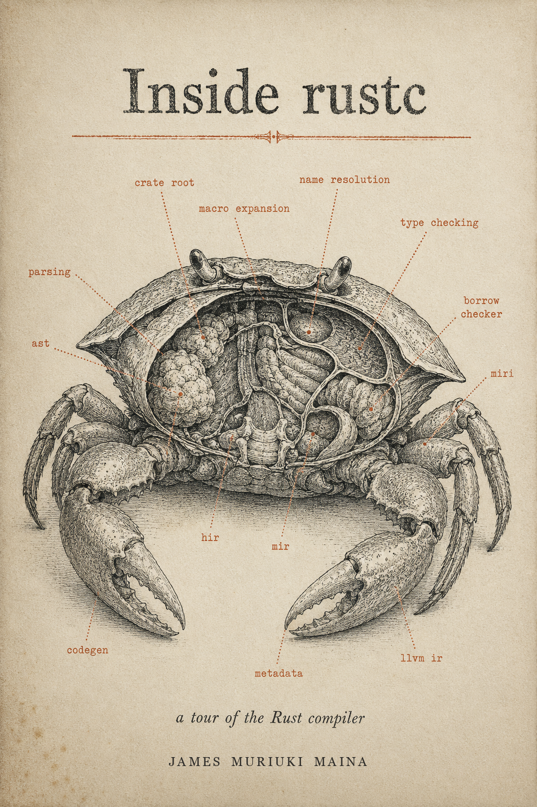

<div align="center">
  <a href="https://inside-rustc-book.james-muriuki-dev.workers.dev">
    
  </a>
</div>

# Inside rustc: A Tour of the Rust Compiler

A working tour of `rustc`, the prover that becomes a translator, from the first byte of source to a merged contribution.

By **James Muriuki Maina**.

[](https://creativecommons.org/licenses/by-nc-sa/4.0/)
[](https://github.com/rust-lang/rust/releases/tag/1.95.0)
[](https://inside-rustc-book.james-muriuki-dev.workers.dev)
[](src/contributing.md)

> *"You cannot bolt a theorem-prover onto the side of a translator; it changes the shape of the whole machine."*
>
> Chapter 1, on why `rustc` does not look like the compiler in your classic textbook.

## Who this book is for

Rust programmers who want to understand the compiler they use every day at the level of "I can name the stage that ran, open the source file that implements it, and contribute a fix." If you have a working knowledge of Rust and you are aiming at `rust-lang/rust` issues marked `E-mentor` (or just at the architectural map of how the borrow checker actually checks), this is the book.

It is not a Rust language tutorial. It assumes you can read Rust; it teaches you how the compiler that compiles Rust works.

## Read it

**[inside-rustc-book.james-muriuki-dev.workers.dev](https://inside-rustc-book.james-muriuki-dev.workers.dev)**

Deployed via Cloudflare Workers (Static Assets) from the `main` branch. Every push to `main` triggers a re-deploy.

<details>
<summary>Full chapter list (26 chapters across 6 parts)</summary>

#### Front matter
- [Cover](https://inside-rustc-book.james-muriuki-dev.workers.dev/cover.html)
- [Epigraph](https://inside-rustc-book.james-muriuki-dev.workers.dev/epigraph.html)
- [Preface](https://inside-rustc-book.james-muriuki-dev.workers.dev/preface.html)
- [From the Author](https://inside-rustc-book.james-muriuki-dev.workers.dev/from-the-author.html)

#### Part 0, Foundations
- [Ch 1, Why the Rust Compiler Is Different](https://inside-rustc-book.james-muriuki-dev.workers.dev/part0/ch01-why-rust-is-different.html)
- [Ch 2, The rustc Pipeline: From Source to Binary](https://inside-rustc-book.james-muriuki-dev.workers.dev/part0/ch02-pipeline-birds-eye.html)
- [Ch 3, Demand-Driven Compilation: The Query System](https://inside-rustc-book.james-muriuki-dev.workers.dev/part0/ch03-query-system.html)
- [Ch 4, Memory That Lives Forever: Arenas and Interning](https://inside-rustc-book.james-muriuki-dev.workers.dev/part0/ch04-arenas-interning.html)

#### Part 1, The Front End
- [Ch 5, Lexical Analysis: From Bytes to Tokens](https://inside-rustc-book.james-muriuki-dev.workers.dev/part1/ch05-lexing.html)
- [Ch 6, Spans and Diagnostics: The Compiler's Sense of Place](https://inside-rustc-book.james-muriuki-dev.workers.dev/part1/ch06-spans-diagnostics.html)
- [Ch 7, Parsing: From Tokens to a Tree](https://inside-rustc-book.james-muriuki-dev.workers.dev/part1/ch07-parsing-ast.html)
- [Ch 8, Macros: Code That Writes Code](https://inside-rustc-book.james-muriuki-dev.workers.dev/part1/ch08-macros-expansion.html)
- [Ch 9, Name Resolution: What Does That Name Refer To?](https://inside-rustc-book.james-muriuki-dev.workers.dev/part1/ch09-name-resolution.html)

#### Part 2, The Middle End
- [Ch 10, HIR: The High-Level Intermediate Representation](https://inside-rustc-book.james-muriuki-dev.workers.dev/part2/ch10-hir.html)
- [Ch 11, Types and Inference: What the Compiler Knows About Your Values](https://inside-rustc-book.james-muriuki-dev.workers.dev/part2/ch11-type-inference.html)
- [Ch 12, Traits: Abstraction Without a Runtime Bill](https://inside-rustc-book.james-muriuki-dev.workers.dev/part2/ch12-traits-solver.html)
- [Ch 13, THIR and Pattern Matching: Have You Covered Every Case?](https://inside-rustc-book.james-muriuki-dev.workers.dev/part2/ch13-thir-exhaustiveness.html)
- [Ch 14, MIR: Rust as a Flowchart](https://inside-rustc-book.james-muriuki-dev.workers.dev/part2/ch14-mir.html)
- [Ch 15, Borrow Checking and the Theory of Ownership](https://inside-rustc-book.james-muriuki-dev.workers.dev/part2/ch15-borrow-checking.html)
- [Ch 16, MIR Optimizations and Const Eval: When the Compiler Runs Your Code for You](https://inside-rustc-book.james-muriuki-dev.workers.dev/part2/ch16-mir-opt-const-eval.html)

#### Part 3, The Back End
- [Ch 17, Monomorphization: From Generic to Concrete](https://inside-rustc-book.james-muriuki-dev.workers.dev/part3/ch17-monomorphization.html)
- [Ch 18, The Codegen Abstraction: One Frontend, Many Backends](https://inside-rustc-book.james-muriuki-dev.workers.dev/part3/ch18-codegen-abstraction.html)
- [Ch 19, The LLVM Backend: Into LLVM IR](https://inside-rustc-book.james-muriuki-dev.workers.dev/part3/ch19-llvm-backend.html)
- [Ch 20, Alternative Backends: When You Don't Want LLVM](https://inside-rustc-book.james-muriuki-dev.workers.dev/part3/ch20-alt-backends.html)
- [Ch 21, Linking: From Object Files to an Executable](https://inside-rustc-book.james-muriuki-dev.workers.dev/part3/ch21-linking.html)

#### Part 4, Cross-Cutting Concerns
- [Ch 22, Incremental Compilation: Remembering What You Did](https://inside-rustc-book.james-muriuki-dev.workers.dev/part4/ch22-incremental.html)
- [Ch 23, Parallel Compilation: Using All the Cores](https://inside-rustc-book.james-muriuki-dev.workers.dev/part4/ch23-parallel.html)
- [Ch 24, Diagnostics and Lints: The Compiler That Teaches](https://inside-rustc-book.james-muriuki-dev.workers.dev/part4/ch24-diagnostics-lints.html)

#### Part 5, The Contributor's Practicum
- [Ch 25, Setting Up to Hack on rustc](https://inside-rustc-book.james-muriuki-dev.workers.dev/part5/ch25-setup.html)
- [Ch 26, The Guided Capstone: From Issue to Merge](https://inside-rustc-book.james-muriuki-dev.workers.dev/part5/ch26-capstone.html)

#### Appendices
- [Appendices A to D](https://inside-rustc-book.james-muriuki-dev.workers.dev/appendices.html)
- [Glossary (47 terms)](https://inside-rustc-book.james-muriuki-dev.workers.dev/glossary.html)
- [Contributing](https://inside-rustc-book.james-muriuki-dev.workers.dev/contributing.html)

</details>

## Build it locally

You need a Rust toolchain (for `cargo install`) and Python 3 (for two small preprocessors).

```bash
cargo install mdbook mdbook-admonish mdbook-quiz mdbook-pagetoc

git clone https://github.com/gme-muriuki/inside-rustc-book
cd inside-rustc-book

mdbook serve --open
```

The first build will print two harmless warnings about `mdbook-admonish` (v1.20.0) and `mdbook-pagetoc` (v0.3.0) being built against a slightly different `mdbook` minor version. The shim at `scripts/admonish-wrap.py` absorbs the actual structural difference; the warnings are cosmetic.

## Deploy (Cloudflare Workers, Static Assets)

The book deploys via a build script that downloads pre-built plugin binaries instead of compiling them (`cargo install` of the four plugins takes around 17 minutes and would risk Cloudflare's 20-minute free-tier build cap; the script is under a minute).

In the Cloudflare dashboard, after connecting this repo as a Workers project:

| Setting                | Value                              |
| ---                    | ---                                |
| Framework preset       | None                               |
| Build command          | `bash scripts/cf-pages-build.sh`   |
| Build output directory | `book`                             |
| Root directory         | `/` (default)                      |
| Environment variables  | (none required)                    |

To bump a plugin version, edit the `*_VERSION` pins at the top of [scripts/cf-pages-build.sh](scripts/cf-pages-build.sh) and push.

## What's in the box

- `src/`: chapter content (26 chapters across 6 parts, plus preface, cover, glossary, appendices).
- `src/images/diagrams/`: 180 pre-rendered Mermaid SVGs. Source `mermaid` blocks live in the chapter markdown; `scripts/mermaid-to-svg.py` rewrites them to `` references at build time. If you change a diagram, regenerate the SVG: `python scripts/render-mermaid.py <changed-chapter.md> --force --config scripts/mmdc-themed.json`.
- `quizzes/`: one TOML per chapter, consumed by `mdbook-quiz` (156 questions total).
- `theme/`: custom CSS and JS (admonish overrides, pagetoc tweaks, glossary tooltips, diagram zoom, reading-time, quiz progress, syntax palette).
- `scripts/admonish-wrap.py`, `scripts/mermaid-to-svg.py`: Python preprocessors `book.toml` calls at build.

## Contribute

The book is verified against `rustc 1.95.0` (commit `59807616e1fa2540724bfbac14d7976d7e4a3860`). `rustc` evolves; drift is inevitable. If you spot:

- A symbol the book describes that has been renamed, moved, or removed,
- A passage that no longer reflects current `rustc` behavior,
- A typo, broken link, or unclear explanation,

please open an issue or PR. See [`src/contributing.md`](src/contributing.md) (rendered as [`/contributing.html`](https://inside-rustc-book.james-muriuki-dev.workers.dev/contributing.html) in the deployed book) for the contribution workflow, citation convention (`path::symbol@SHA`), and the no-em-dash style rule the book enforces.

Four issue templates are wired up (Drift / Typo / Clarity / Site bug); the New Issue button surfaces them automatically.

## License

[Creative Commons Attribution-NonCommercial-ShareAlike 4.0 International (CC BY-NC-SA 4.0)](LICENSE).

You are free to share and adapt the material with attribution, for non-commercial purposes, under the same license. Full terms in [LICENSE](LICENSE).
