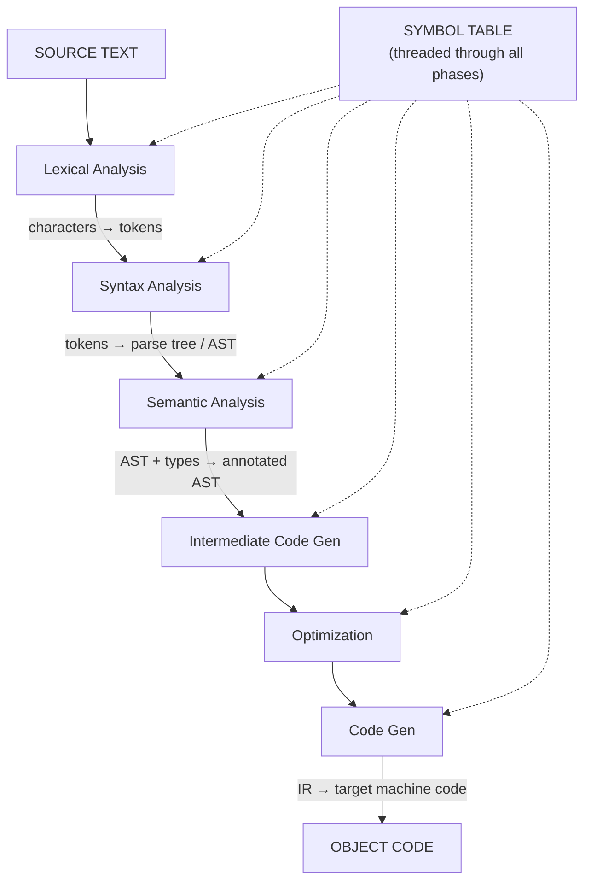
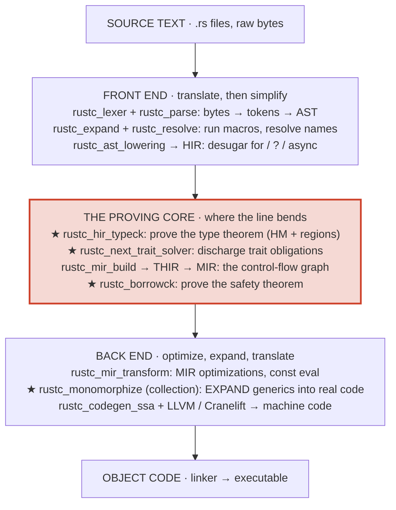
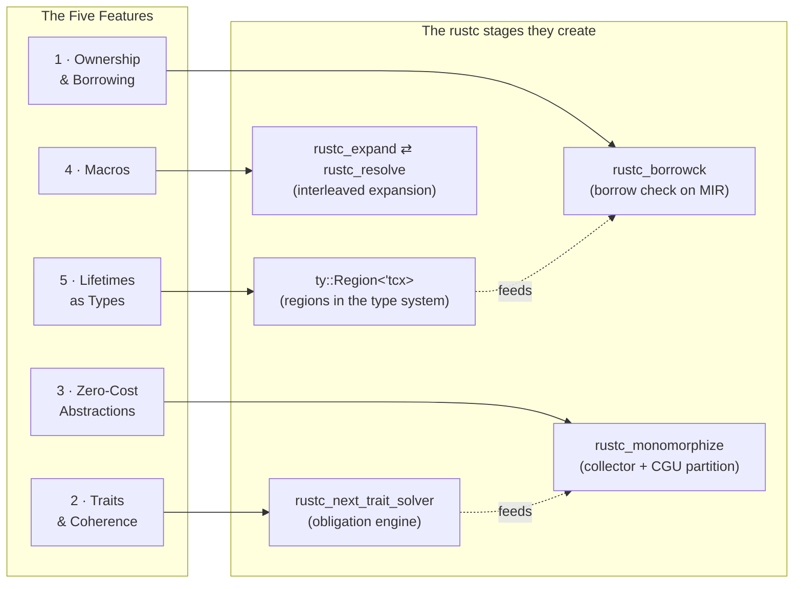
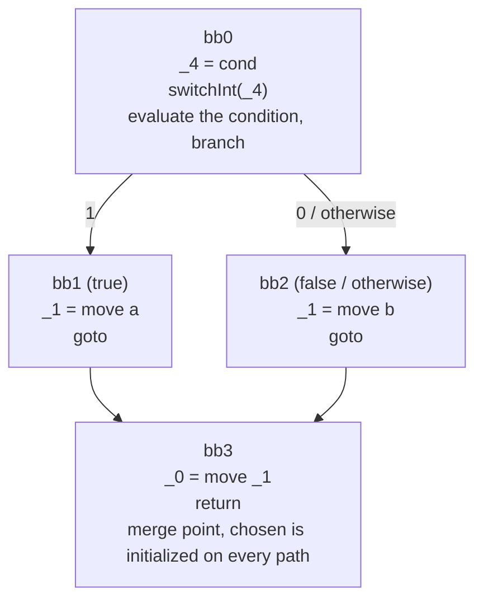
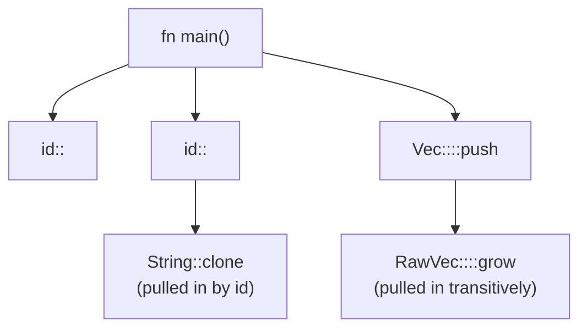
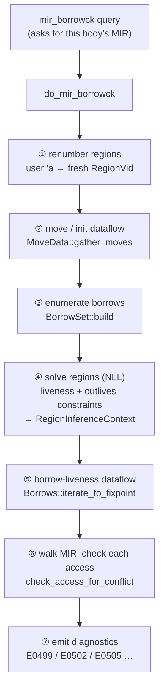
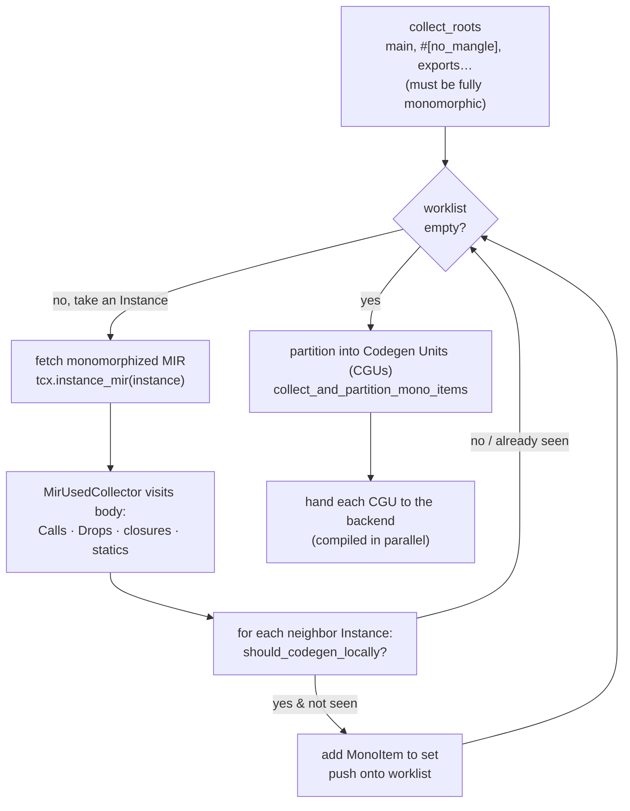
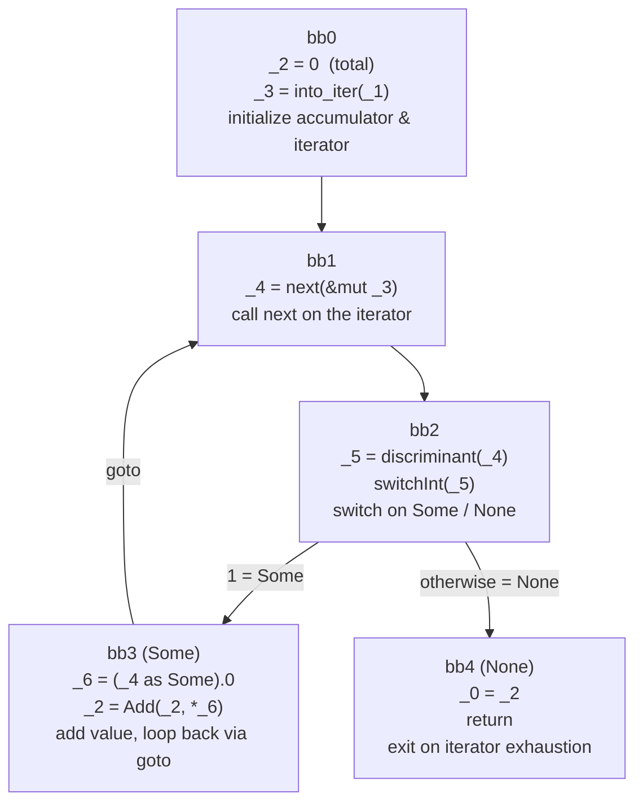
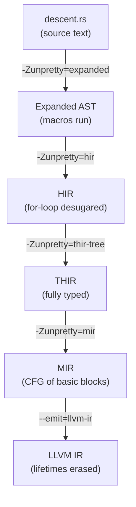

```admonish abstract title="What you'll learn"
- Why `rustc` is structurally different from a classical Dragon Book pipeline: it proves a safety theorem *before* it translates, and that obligation reshapes the line.
- The five Rust features (ownership, traits, zero-cost abstractions, macros, lifetimes-as-types) that each force a specific rustc stage into existence, and which stage each forces.
- The four ★ stages where the proving lives: type checking, [the trait solver](../glossary.md#trait-solver), [the borrow checker](../glossary.md#borrow-checker), and [monomorphization](../glossary.md#monomorphization) collection.
- How to open `rustc`'s real source for `mir_borrowck` and the monomorphization collector for the first time, and read what you find.
- How to watch your own ten-line program descend through every IR (tokens, [AST](../glossary.md#ast), [HIR](../glossary.md#hir), [THIR](../glossary.md#thir), [MIR](../glossary.md#mir), [LLVM IR](../glossary.md#llvm-ir)) with one `rustc -Zunpretty=…` invocation per rung.
```

## 1.1 The Pipeline That Refused to Stay Straight

### An elevator, a crash, and a different kind of compiler

Sometime around 2006, a software engineer named Graydon Hoare climbed several flights of stairs to his apartment because the building's elevator was broken, again.
The elevator's control software had crashed. Not the mechanical parts; the firmware.
Somewhere in a program controlling a heavy steel box full of people, a pointer had pointed at the wrong thing, or a buffer had been written past its end, or a value had been used after the memory holding it was freed. The machine did the only thing a confused machine can do: it gave up.

Hoare, as the often-told origin story goes, was annoyed enough by that climb to start a side-project: a programming language whose compiler would refuse, *at compile time*, to produce the class of bug that had just made him take the stairs. He called it **Rust**.
Mozilla eventually adopted it. And the central, defining promise of that language turned out to be a promise about its **compiler**: *if it compiles, an entire category of memory-corruption bugs cannot occur in safe Rust* (the `unsafe` escape hatch deliberately opts out, and that is part of the design, not a hole in it).

That promise is the reason this book exists, and it is the reason  `rustc` does not look like the compiler in your classic textbook.

Hold that elevator in your mind, because it explains a structural decision we are about to make sense of. A C compiler's job is, roughly, to *translate*. A Rust compiler's job is to translate **and to prove a theorem about your program first**. You cannot bolt a theorem-prover onto the side of a translator; it changes the shape of the whole machine.

```admonish tip title="Pro-Tip"
Whenever a piece of `rustc`'s architecture confuses you, ask "*Is this here to translate the code, or to prove something about it?*" Most of the parts that surprise C and C++ developers (the **borrow checker**, **the trait solver**, the **several intermediate representations between the source and machine code**) exist for the proving, not the *translating*. That single question will untangle most of the surprises in this book.
```

### The pipeline you were promised

Open any classic compilers text: Aho, Lam, Sethi, and Ullman's Compilers: Principles, Techniques, and the Tools (the **Dragon Book**), Appel's Modern Compiler implementation (the **Tiger Book**) or Cooper and Torczon's Engineering a Compiler, and within the first chapter you will meet a diagram that looks essentially like this: 




This is the canonical mental model of a compiler, and it is also, for the most part, **how a traditional C compiler is structured**. The phases form a near-straight line. Each one consumes the output of the last, transforms it, and hands it forward. A symbol table runs alongside as shared bookkeeping. The Dragon Book's enduring insight, still true decades later, is that *separating these concerns into phases is what makes a compiler buildable by humans*. 

Every phase in that diagram has a direct descendant inside `rustc`, and throughout this book we point back to the classical ancestor of each piece of Rust machinery. The Dragon Book is the theory anchor we use throughout.

But notice what the diagram does not contain. No phase asks, *"Is this pointer still valid here?"* No phase asks, *"Does the type `Vec<T>` implement the trait `Clone` for this specific `T`, and if so, which implementation?"* No phase takes one generic function and stamps out several concrete copies of it. The classic pipeline translates a program the programmer has *already promised* is correct; the compiler is not the one making the promise.

```admonish warning title="Warning, what rustc accepting your code actually promises"
"The compiler accepted it" in `rustc` means more than "the syntax and types are consistent." Once `mir_borrowck` (which we open in §1.3) returns success, `rustc` has discharged a safety theorem on your program's MIR: the resulting code is free, in safe Rust, of the use-after-free, double-free, and data-race classes §1.1 opened with. `unsafe` blocks, raw pointers, and FFI sit deliberately outside that theorem (the developer takes on the obligations the checker drops). That theorem is what the extra phases buy. If you find yourself thinking "why is the Rust compiler doing so much *work*", this is the property being purchased.
```

### Where the line bends

So what happens when you take that straight pipeline and demand that it *prove memory safety* before it translates?

The answer, discovered by the Rust team over roughly a decade of hard-won engineering, is that **the line bends into a sequence of progressively simplified representations of your program.** Not one intermediate representation, but several, each one stripping away surface complexity so that a specific proof becomes tractable.

Here is the same pipeline, redrawn as `rustc` actually implements it. Study the stages marked with a ★: that is where the *proving* and *expanding* live, the work the rest of this chapter spends most of its time inside.




Look at the four stages marked with a ★ in the diagram: type checking, the trait solver, the borrow checker, and monomorphization collection. These are the stages where `rustc` proves the type theorem, discharges [trait obligations](../glossary.md#obligation), proves the safety theorem, and expands zero-cost generics into concrete code, on every compilation. A large fraction of this book lives inside those four starred stages.

```admonish tip title="Pro-Tip"
The single most useful command in your entire learning toolkit is `rustc -Z unpretty=...`, which lets you *see* the entire program at each of those intermediate stages. Try `rustc -Z unpretty=hir-tree foo.rs` to see the HIR, or `-Z unpretty=mir` to see the control-flow graph the borrow checker actually reads. (These flags may require a nightly toolchain, `rustup default nightly`, or `rustup run nightly rustc ...`, because they expose unstable compiler internals.) We will learn on these constantly. Watching a `for` loop turn into a `loop { match ... }` in the HIR is the moment the pipeline stops being abstract.
```

### An intuition: the translator versus the building inspector

If the diagrams feel dense, here is the picture to keep.

Imagine two professionals processing the blueprints for a house

The first is a **translator**. You hand her architectural plans written in one notation, and she rewrites them in the notation the construction crew uses. She checks that the drawing is internally consistent (no doors floating in midair, no rooms labeled twice) and passes it along. If the *design* is unsafe (a load-bearing wall in the wrong place), that was never her job to catch.

The second is a **building inspector who is also fluent in every notation**. He does everything the translator does, but before he rewrites a single line, he traces every load path through the structure and *proves the building will not collapse*. To do that tracing, he doesn't work from the original ornate blueprints; they have  too much decorative detail. He first redraws the plans in successively simpler engineering diagrams (first a schematic, then a bare load-bearing skeleton) because the structural proof is only tractable on the simplest representation. Each redraw throws away detail he no longer needs and keeps exactly the information the next proof requires.

That second professional is `rustc`. The "successively simpler engineering diagrams" are the AST, the HIR, the THIR, and finally the **MIR**: the bare load-bearing skeleton, a plain control-flow graph, on which the borrow checker performs its structural proof.
Rust didn't choose to have several intermediate representations because some number is elegant. It chose them because *you cannot prove the building won't collapse while you're still staring at the wallpaper*.

```admonish warning
Do not assume "more intermediate representations" means "slower compiler" in the way you might expect. Each lowering exists precisely so that *next* analysis is cheaper and simpler to write correctly. Running the borrow check directly on a high-level, sugar-rich tree, rather than on a simplified MIR, was effectively what Rust's early "lexical" borrow checker did, and it was both less precise *and* harder to maintain than the MIR-based check that replaced it. We will tell that whole story in Chapter 15. The representations earn their keep.
```

### What this chapter will do

One claim, grounded in a broken elevator: **a Rust compiler is different because it proves a safety theorem before it translates, and that proof reshapes the classic pipeline into a sequence of progressively simplified intermediate representations.** That is the thesis of Chapter 1.

The rest of the chapter makes it concrete. §1.2 traces the bend to five language features (ownership, traits, zero-cost abstractions, macros, lifetimes-as-types) and names the box each one forces into the diagram. §1.3 opens real `rustc` source for the first time: the borrow checker's front door, the `mir_borrowck` [query](../glossary.md#query), and the monomorphization collector. §1.4 hands you the keyboard, you compile a ten-line program and watch it descend, with your own eyes, through every representation in the map above.

## 1.2 The Five Features That Bent the Pipeline

Five language features bend the pipeline, and none is decorative. Each one, taken seriously, forces a specific structural change on the compiler to keep its promise. For each: name the feature, find the box in the pipeline it created, and open the real `rustc` source that implements it. Five features, five times over.

Here is the map for the whole section, which feature forces which stage into existence:




Notice the two dotted "feeds" arrows. The features are not independent: lifetimes-as-types is the *input language* the borrow checker reads, and trait resolution is what tells monomorphization which concrete function a generic call actually targets.

### Feature 1. Ownership and borrowing: the analysis that needs a graph

The headline feature of Rust is **ownership**: every value has exactly one owning binding, and when that binding goes out of scope the value is destroyed. Layered on top is **borrowing**: you may take a shared reference `&T` (any number, read-only) or a unique reference `&mut T` (exactly one, read-write), but never both kinds simultaneously to the same data. These two rules, enforced statically, rule out (in safe Rust) the class of memory-corruption bugs the elevator firmware in §1.1 opened with: use-after-free, data races, and aliased mutation.

The structural consequence is what drives MIR into existence. To check the borrowing rules, the compiler must answer a question that is *fundamentally about control flow*: "Across every possible execution path through this function, is there any point where two conflicting borrows of the same place are simultaneously live?" That word, **live**, is the giveaway. Liveness is a classic dataflow problem, and dataflow problems are defined over a **control-flow graph (CFG)**, not over a syntax tree.

This is precisely why Rust grew the **MIR** (Mid-level Intermediate Representation). You cannot run a clean dataflow analysis over an abstract syntax tree, because an AST is a *tree of nested expressions* (`if`, `match`, `?`, `for`, short-circuiting `&&`) and the control flow is implicit in the nesting. MIR flattens all of that into explicit **basic blocks** connected by edges: a CFG. Consider this function:

```rust
fn pick(cond: bool, a: String, b: String) -> String {
    let chosen = if cond { a } else { b };
    chosen
}
```

Its MIR control-flow graph looks like this, four basic blocks, with the `switchInt` terminator branching on the value of `cond`:




Read that graph and the borrow checker's job becomes obvious. The value of `chosen` (local `_1`) is *moved into* from `a` on one path and from `b` on the other; by `bb3` it is initialized on every path, so returning it is sound. Had `a` been moved *before* the `switchInt` and also used inside `bb2`, the borrow checker would see a use-after-move on one CFG edge and reject it. The proof is a graph traversal. **You need the graph.** The AST cannot give it to you cheaply, and that is the entire reason MIR exists.

The borrow checker's front door is the `mir_borrowck` query, registered by `rustc_borrowck`. Simplified, its entry point reads:

```rust
// compiler/rustc_borrowck/src/lib.rs   [VERIFY against current rustc; abridged, return type and tainted/skip arms elided]
fn mir_borrowck(tcx: TyCtxt<'_>, def: LocalDefId) -> /* borrow-check results */ {
    // 1. Pull the post-build, pre-optimization MIR for this body.
    let (input_body, _) = tcx.mir_promoted(def);
    let input_body: &Body<'_> = &input_body.borrow();

    // 2. Run the actual check inside a root context, which constructs the
    //    inference context (BorrowckInferCtxt → InferCtxt) internally.
    let mut root_cx = BorrowCheckRootCtxt::new(tcx, def, None);
    root_cx.do_mir_borrowck();
    root_cx.finalize()
}
```

Three lines, three deep ideas. First, `tcx.mir_promoted(def)` is itself a *query*: borrow checking doesn't reach for a global variable, it *asks* the query system for this body's MIR, and that act of asking is recorded in the [dependency graph](../glossary.md#depgraph) (a mechanism we devote all of Chapter 3 to). Second, the MIR it asks for is a specific vintage: *after* construction and constant-promotion but *before* the optimization passes, because the borrow checker must see the program as the programmer wrote it, not as the optimizer rewrote it. Third, the body of the check runs through a `BorrowCheckRootCtxt` which builds a `BorrowckInferCtxt` (wrapping an `InferCtxt`, the inference context), because checking borrows is entangled with inferring lifetimes, and that brings us to the modern heart of the analysis: [**NLL**](../glossary.md#nll), non-lexical lifetimes.

```admonish tip title="Pro-Tip"
When you read `tcx.something(def)` in `rustc` source, mentally pronounce it "*ask the query system for* something." Almost every function-call-looking thing on [`tcx`](../glossary.md#tyctxt-tcx) is a memoized query, not a plain method. This is the most useful reading habit for the codebase, and it is invisible to newcomers because the call site looks identical to an ordinary method call.
```

```admonish warning title="Warning, the lexical-lifetime trap"
Developers often picture a borrow as living from the `&` until the closing `}` of its enclosing block. That was true in Rust before 2018 (the "lexical" borrow checker) and it rejected mountains of correct code. The modern checker is **non-lexical**: a borrow lives only until its *last actual use*, computed over the MIR CFG. If you reason about borrow errors using block scopes, you will mispredict the compiler. Reason about them using *last use on the control-flow graph* instead.
```

### Feature 2. Traits and coherence: a logic engine inside the compiler

The second feature is the **trait** system. A trait such as `Clone` or `Iterator` declares an interface, but the resolution machinery behind it has to handle goals that recurse. When you write `x.clone()`, the compiler must answer: *does the type of `x` implement `Clone`?*, and that question can recurse arbitrarily. `Vec<T>: Clone` holds only **if** `T: Clone`. `T: Clone` might hold only if some associated bound holds. The compiler is, in effect, running a small **logic-programming engine**, discharging goals against a database of `impl` blocks the way Prolog discharges goals against clauses.

`rustc` models each such question as an **obligation**. The data structure is literal:

```rust
// compiler/rustc_infer/src/traits/mod.rs  (faithful; #[derive] and per-field
// foldable/visitable attrs elided to keep the four fields in focus)
pub struct Obligation<'tcx, T> {
    pub cause: ObligationCause<'tcx>, // *why* we need this (for diagnostics)
    pub param_env: ParamEnv<'tcx>, // what we may assume in this context
    pub predicate: T, // the goal, e.g. `Vec<i32>: Clone`
    pub recursion_depth: usize, // guard against infinite proof search
}

pub type PredicateObligation<'tcx> = Obligation<'tcx, Predicate<'tcx>>;
```

Walk the fields, because each one encodes a hard-won lesson. The `predicate` is the goal to prove. The `param_env` is the set of bounds currently *assumable*: inside a function `fn f<T: Clone>()`, the param-env contains `T: Clone`, so within `f` that obligation is discharged for free; outside it, the same predicate must be proven concretely. The `recursion_depth` exists because trait resolution can loop forever on pathological `impl`s, so the engine caps proof-search depth. And `cause` carries *no logical content at all*: it exists purely so that when the proof **fails**, the compiler can produce a human error pointing at the right [span](../glossary.md#span). A whole field is reserved for that purpose because the diagnostics budget on a failed proof is treated as first-class infrastructure, not a postscript.

The engine that discharges obligations is being modernized as we write. [VERIFY status and crate names against current rustc.] The legacy solver lives in `rustc_trait_selection` (`SelectionContext`); the **next-generation trait solver** lives in its own crate, `rustc_next_trait_solver`. [Coherence](../glossary.md#coherence) checking (the rule that forbids two overlapping `impl`s of the same trait for the same type) already routes through the new engine by default in 1.95. Routing the *rest* of trait solving through it is still nightly-only: enable globally with `-Znext-solver=globally`. The crate's own documentation warns internal contributors not to flip it on casually:

```rust
// rustc_next_trait_solver, module doc, paraphrased intent:
//   As a *user* of Rust, enable the new solver with -Znext-solver.
//   As a *developer of rustc*, do not route through it without coordinating
//   with the trait-system-refactor-initiative; enable it on an InferCtxt via
//   InferCtxtBuilder::with_next_trait_solver(true).
```

The structural point for this chapter: **none of this is translation.** Resolving a trait obligation is an open-ended proof search with a backing cache, a recursion limit, and a coherence guarantee. That work is a second starred stage in the pipeline, and it sits *inside* type checking, feeding answers to everything downstream, including, crucially, monomorphization.

### Feature 3. Zero-cost abstractions: the monomorphization fan-out

Rust promises **zero-cost abstractions**: a generic function should run exactly as fast as a hand-written specialized one. The mechanism that delivers this is **monomorphization**: for every distinct set of generic arguments a function is *actually called with*, the compiler stamps out a separate, fully-specialized copy. `fn id<T>(x: T) -> T` called with `i32` and with `String` becomes two real functions in the binary, each as tight as if you'd written it by hand.

C++templates monomorphize too, so this is the one feature on our list with a partial C++ analogue. But Rust's version has a structural twist: trait bounds are *checked once* on the generic definition rather than re-checked at each instantiation, so by the time monomorphization runs all bounds have already been discharged. Monomorphization is therefore a pure collection pass over already-type-checked code. The cost reappears elsewhere, though: the compiler must **discover the complete set of instantiations the program actually needs**, walking outward from the entry points.

That discovery is `rustc_monomorphize::collector`. It produces a set of [**mono items**](../glossary.md#monoitem):

```rust
// compiler/rustc_middle/src/mir/mono.rs  (faithful; #[derive] elided)
pub enum MonoItem<'tcx> {
    Fn(Instance<'tcx>), // a specific monomorphized function
    Static(DefId), // a `static` that needs an allocation
    GlobalAsm(ItemId), // a global_asm! block
}
```

[`Instance`](../glossary.md#instance) itself lives one floor down, in the type-system crate (`MonoItem` re-imports it from `crate::ty`). It is "a function plus the generic arguments it was specialized with":

```rust
// compiler/rustc_middle/src/ty/instance.rs  (faithful)
pub struct Instance<'tcx> {
    pub def:  InstanceKind<'tcx>, // which function (or shim)
    pub args: GenericArgsRef<'tcx>, // the concrete type/const/lifetime arguments
}
```

`def` says *which* function; `args` says *with what types*. The pair `(id, [i32])` and the pair `(id, [String])` are two distinct `Instance`s, and the collector's job is to find every such pair reachable from the crate's roots, then hand them to codegen.

The fan-out is the thing to visualize:




One generic source function `id<T>` became two distinct mono-item nodes (`id::<i32>`, `id::<String>`), and each instantiation transitively dragged in *its own* further instantiations: `id::<String>` needs `String`'s `clone`, the `Vec` call needs `RawVec::grow`, and so on. The collector starts at roots (`collect_roots`) and walks this graph to a fixpoint in **lazy** mode by default (it follows only what is actually reachable), or exhaustively in **eager** mode. The discovered set is then sliced into [**codegen units (CGUs)**](../glossary.md#cgu): the chunks that get compiled in parallel and that we will meet again when we discuss parallelism in Chapter 23.

```admonish tip title="Pro-Tip"
You can watch the fan-out happen. Compile with `rustc -Z print-mono-items` to dump every `MonoItem` the collector discovers, or use the community tool `cargo llvm-lines` to rank functions by how much LLVM IR their monomorphizations generate. (Whether the collector runs in Lazy mode, the default, or Eager mode is controlled by `-Clink-dead-code`, not by this flag.) When a Rust build is mysteriously slow or a binary mysteriously large, an over-eager generic fanning out into hundreds of instantiations is the usual culprit, and these tools show it directly.
```

```admonish warning title="Warning, zero-cost is a runtime claim, not a compile-time one"
Zero-cost abstraction means the *generated code* has no overhead versus hand-specialization. It says nothing about *compile time* or *binary size*, both of which monomorphization can inflate dramatically. A function instantiated at twenty types becomes twenty copies in the binary, each paying its share of compile time. The cost didn't vanish. It moved from runtime to build time.
```

### Feature 4. Macros: the phase that loops back on itself

The fourth feature breaks the pipeline's most basic assumption: that phases run in order. **Macros**, both declarative (`macro_rules!`) and procedural (`#[derive(...)]`, attribute, and function-like proc-macros), generate code *during compilation*. And here is the chicken-and-egg problem that bends the pipeline: to *expand* a macro invocation you must first *resolve* its name (which `macro_rules!` or which proc-macro is `foo!` referring to?), but to *resolve* names you must know which items exist, and macros are precisely the things that *create* new items. Expansion needs resolution; resolution needs expansion.

`rustc` resolves the paradox by making expansion and name resolution **co-routine through each other**, in [`rustc_expand`](../glossary.md#macro-expansion) driving `rustc_resolve`, rather than running as two separate sequential phases. The expander maintains a worklist of unexpanded invocations; each time it resolves and expands one, the freshly produced tokens are parsed into AST fragments, *new* names are entered into the resolver, and any *new* invocations they contain go back on the worklist. The loop runs until the worklist is empty (or a fixed iteration limit trips, producing the familiar "recursion limit reached while expanding" error).

The currency of this phase is the `TokenStream`: not characters, not a finished AST, but a tree of [token-trees](../glossary.md#token-tree) that deliberately preserves source structure (and, critically, [**hygiene**](../glossary.md#hygiene) information so a macro's internal variables can't accidentally capture the caller's):

```rust
// compiler/rustc_ast/src/tokenstream.rs  (faithful)
pub struct TokenStream(pub(crate) Arc<Vec<TokenTree>>);

pub enum TokenTree {
    Token(Token, Spacing), // a single token + spacing hint
    Delimited(DelimSpan, DelimSpacing, Delimiter, TokenStream),  // ( … ), { … }, [ … ]
}
```

A procedural macro is, quite literally, a Rust function with the signature `fn(TokenStream) -> TokenStream`: it is compiled, loaded, and *executed* by the compiler mid-compilation. Arbitrary user code now runs in the middle of the pipeline.

The structural lesson: in `rustc`, "parsing" is not a one-shot phase that finishes before semantic analysis begins. It is **re-entrant**, interleaved with the early stages of resolution, and only *after* the expansion fixpoint is reached does the AST stabilize enough to be lowered to HIR. We will give macros their own full chapter (Chapter 8) precisely because this re-entrancy is too rich to compress further here.

### Feature 5. Lifetimes as types: the extra dimension

The fifth feature is the most subtle, and it is the one that *feeds* the first. Rust's type system carries a second axis alongside the familiar one: [**regions**](../glossary.md#region), the compiler's internal name for lifetimes. A `&'a T` is not merely a reference to `T`; it is a reference to `T` valid for region `'a`, and that `'a` is tracked through the type system as rigorously as the `T` is.

Internally, a region is its own interned entity, parallel to [`Ty<'tcx>`](../glossary.md#tytcx):

```rust
// the wrapper lives in rustc_middle::ty (region.rs); the enum itself was lifted into
// rustc_type_ir::region_kind and is generic over an Interner. The `'tcx` form below
// is the rustc_middle re-export: `pub type RegionKind<'tcx> = IrRegionKind<TyCtxt<'tcx>>;`.
pub struct Region<'tcx>(pub Interned<'tcx, RegionKind<'tcx>>);

/*faithful*/
pub enum RegionKind<'tcx> {
    ReEarlyParam(EarlyParamRegion), // `'a` declared on a generic item
    ReBound(BoundVarIndexKind, BoundRegion), // bound under a `for<'a>` binder;
     //   BoundVarIndexKind = Bound(DebruijnIndex) | Canonical
    ReLateParam(LateParamRegion), // late-bound region, freed for a body
    ReStatic, // `'static`
    ReVar(RegionVid), // an inference variable
    RePlaceholder(PlaceholderRegion), // placeholder under universe quantification
    ReErased, // "regions no longer matter here"
    ReError(ErrorGuaranteed), // emitted only after a region error
}
```

The `ReErased` variant is the most direct illustration of "prove, then translate." Lifetimes exist to let the borrow checker run its proof. **The moment that proof is complete, lifetimes have no further purpose**: they correspond to nothing at runtime, generate no machine code, occupy no memory. So after borrow checking, `rustc` calls `tcx.erase_and_anonymize_regions(...)` (per-type-walked via the `erase_and_anonymize_regions_ty` query), rewriting every region in the types it carries forward into `ReErased`. By the time the MIR reaches codegen, regions are gone.

This is the dotted "feeds" arrow from §1.2's opening diagram made concrete. Lifetimes-as-types is the *input language* the borrow checker reads; once the checker has read it and rendered its verdict, the dimension collapses. The feature that makes the proof *possible* is deliberately deleted the instant the proof is *done*.

```admonish tip title="Pro-Tip"
This is why you will sometimes see [`'tcx`](../glossary.md#tcx-lifetime) lifetimes everywhere in `rustc` source but almost no `'a`-style *user* lifetimes surviving in MIR dumps past borrow check. If you `rustc -Z unpretty=mir` a function and wonder where the lifetimes went, this is your answer: `erase_regions` ran. The `'tcx` you *do* see everywhere is a different beast (the [arena](../glossary.md#arena) lifetime, the subject of Chapter 4), not a user lifetime.
```

### Pulling the five together

Step back and look at what we have established. Three of these features (ownership, traits, zero-cost abstractions) each create a starred stage in the pipeline (borrow checking, the trait solver, monomorphization collection) where `rustc` is *proving* or *expanding* rather than translating. The fourth (macros) shatters the assumption that phases run in a fixed order, forcing parsing to be re-entrant. The fifth (lifetimes-as-types) supplies the proof's input language and is erased the moment the proof completes.

The bend in the pipeline is not one decision. It is the accumulated structural pressure of five features that each, independently, refuse to fit inside a straight line. The architects of `rustc` did not set out to build a compiler with four intermediate representations and a logic engine wired into its type checker; they set out to keep five promises, and *this architecture is what keeping those promises costs.*

In 1.3 we stop summarizing and start reading. We will open two of these boxes in the live `rust-lang/rust` source (the borrow checker's `mir_borrowck` and the monomorphization collector's `collect_roots`) and trace their control flow line by line, so that the names in this section (`Obligation`, `Instance`, `MonoItem`, `Region`) stop being vocabulary and start being code you can navigate.

## 1.3 Reading the Source: Inside `mir_borrowck` and the Collector

### The cathedral and the two doors

The first time most engineers `git clone https://github.com/rust-lang/rust`, the reaction is something between awe and panic. The `compiler/` directory alone holds around 75 crates. A full-text search for a common term returns thousands of hits. There is no `main()` that you can read top-to-bottom; the thing is less a program than a cathedral, and cathedrals are not meant to be apprehended all at once. Newcomers who try to read `rustc` "from the start" almost always give up around the third indirection.

There is a better way in, and it is the technique we adopt for the rest of this book. You do not read `rustc` breadth-first. You **pick a single question and follow the query graph that answers it.** In §1.2 we identified the two stages that most distinguish a Rust compiler from a C one: the borrow checker, which *proves the safety theorem*, and the monomorphization collector, which *expands generics into real code*. Those are our two doors. We will walk through each one, function by function, and by the end you will have a repeatable method for entering any part of the compiler you like.

```admonish tip title="Pro-Tip, the navigation move that unlocks the codebase"
When you want to find where some piece of work happens, do not grep for the *concept*; grep for the **query name**. Borrow checking is the `mir_borrowck` query, so `rg "fn mir_borrowck" compiler/` lands you on the front door in one jump. Monomorphization collection is reachable from the `collect_and_partition_mono_items` query. Almost every major phase in `rustc` is named by a query, and the query name is usually the most direct search key for that phase. Concepts are spread across dozens of files; query names are defined in exactly one.
```

A note before we open the doors: the snippets below are **faithful in structure but simplified in detail**, and the exact signatures of these functions churn from release to release: the borrow checker in particular has been refactored repeatedly (the introduction of NLL, the [Polonius](../glossary.md#polonius) experiments, the recent splitting of root-vs-nested body handling). Treat the *shape* and the *order of operations* as the durable lesson; treat any specific type name as something to verify against the commit you happen to be reading. We target the stable 1.95 codebase.

### Door one: `mir_borrowck`, line by line

Recall from §1.2 that the borrow checker's front door is tiny: the `mir_borrowck` query pulls this body's MIR via another query and hands it to `root_cx.do_mir_borrowck()` on a `BorrowCheckRootCtxt`, which builds the inference context internally. All the *real* work is reached from there, split across two helpers in `compiler/rustc_borrowck/src/lib.rs`: `borrowck_collect_region_constraints` (sets up the renumbered MIR, the move data, the borrow set, and gathers region constraints via the MIR type-check) and `borrowck_check_region_constraints` (solves the regions, runs the borrow-liveness dataflow, and walks the MIR reporting conflicts). Here is the combined spine of the two, as one teaching synthesis, with the incidental machinery removed:

```rust
// compiler/rustc_borrowck/src/lib.rs  [VERIFY: synthesized across borrowck_collect_region_constraints
// (steps ① to ③ + constraint gathering for ④) and borrowck_check_region_constraints (④ solve, ⑤, ⑥, ⑦);
// the seven conceptual steps are intact, only the bracketing function changed]
fn do_mir_borrowck<'tcx>(/* root_cx, infcx, body, ... */) -> /* results */ {
    // ① renumber: user lifetimes → fresh RegionVids
    let universal_regions = nll::replace_regions_in_mir(infcx, &mut body, /* ... */);
    // ② move / init dataflow (catches use-after-move)
    let move_data = MoveData::gather_moves(body, tcx, |_| true);
    // ③ enumerate borrows
    let borrow_set = BorrowSet::build(tcx, body, /* ... */, &move_data);
    // ④ MIR type-check accrues outlives constraints; nll::compute_regions then SOLVES them.
    // The first half runs in borrowck_collect_region_constraints; the solve runs next.
    let nll::NllOutput { regioncx, polonius_output, .. } =
        nll::compute_regions(infcx, /* universal_regions, constraints, */ body, &borrow_set, /* ... */);
    // ⑤ borrow-liveness dataflow: which borrows are live at each program point
    let flow_borrows = Borrows::new(tcx, body, &regioncx, &borrow_set).iterate_to_fixpoint(/* ... */);
    // ⑥ walk MIR, ask check_access_for_conflict at each access
    let mut mbcx = MirBorrowckCtxt { infcx, body, move_data: &move_data, borrow_set: &borrow_set, regioncx: &regioncx, /* ... */ };
    rustc_mir_dataflow::visit_results(body, traversal_order, &flow_borrows, &mut mbcx);
    // ⑦ report and package results
    mbcx.report_move_errors();
}
```

Seven steps. Take them in order.

**Step 1, renumbering** is the conceptual hinge of the whole modern borrow checker, and it is the moment §1.2's "lifetimes as types" feature meets §1.2's "ownership" feature. The MIR arrives carrying user lifetimes (`'a`, `'static`), but the checker does not *trust* those names; it *re-derives* them. `replace_regions_in_mir` walks the body and replaces every region with a fresh **region inference variable**, internally a `RegionVid`, an opaque integer. After this step the function's text no longer says "this reference lives for `'a`"; it says "this reference lives for region variable #7, and we will *figure out* what #7 actually is." This is what **non-lexical lifetimes** means at the implementation level: lifetimes are not read off the source, they are *inferred from how the code is actually used*, by solving for these variables in step 4.

**Step 2, move analysis** (`MoveData::gather_moves`) is a textbook dataflow analysis straight out of the Dragon Book's chapter 9, but applied to a Rust-specific question: for each [**place**](../glossary.md#place) (a path like `x`, `x.field`, `*x`), at which program points has it been moved out of, and at which has it been initialized? This is the machinery behind the famous "use of moved value" error. Note that it runs *before* borrow checking proper, because you cannot reason about a borrow of something that has already been moved away.

**Step 3, [`BorrowSet::build`](../glossary.md#borrowset)** simply enumerates every `&` and `&mut` in the body and assigns each a `BorrowIndex`. Think of it as building the cast list before the play: every borrow that *could* be live at some point gets a numbered seat, so later steps can talk about "borrow #3 is live here" with a cheap integer instead of re-scanning the MIR.

**Step 4, `nll::compute_regions*`* is the brain. This is where the region variables from step 1 get *solved*. The solver gathers two kinds of constraints: **liveness constraints** ("region #7 must include every point where the reference it tags is still used") and **outlives constraints** ("region #7 must outlive region #4, because we assigned a `&'7` into a slot expecting `&'4`"). It then computes, for each region variable, the complete set of CFG points that region must cover. The output, a `RegionInferenceContext` (universally nicknamed `regioncx` in the source), is essentially a map *region variable → set of live program points.*

```admonish tip title="Pro-Tip"
The name "Polonius" you may have seen in Rust discussions refers to a long-running experimental reimplementation of exactly this step-4 constraint solver, based on Datalog. [VERIFY current Polonius status against the project tracking issue.] You can see the experimental output threaded through `do_mir_borrowck` as `polonius_output`, present in the data structures alongside the NLL `RegionInferenceContext`. Chapter 15 dissects both.
```

**Step 5, `Borrows` dataflow** combines the cast list (step 3) with the solved regions (step 4) into a single forward dataflow analysis whose state, at every program point, is the *set of borrows currently live*. `iterate_to_fixpoint` is the generic dataflow engine from `rustc_mir_dataflow` doing its standard worklist iteration until the live-borrow sets stop changing, again, pure Dragon Book, applied to a Rust-specific lattice.

**Step 6, the check itself** is almost anticlimactic after all that setup. `MirBorrowckCtxt` implements a results-visitor that walks the MIR one statement at a time. At each memory access it asks a single question, embodied in a method conventionally named `check_access_for_conflict`: *given the borrows the dataflow says are live right now, does this access violate the aliasing rules?* A shared read while a `&mut` is live, a write while any borrow is live, a move while the place is borrowed: each is a conflict, and each conflict becomes a diagnostic (the `E0502`/`E0499`/`E0505` family [VERIFY exact codes against the current rustc error index]). The theorem is proven not by a grand flourish but by a linear walk that, at every step, consults precomputed liveness.

```admonish warning title="Warning, do not confuse the two dataflow passes"
Newcomers conflate step 2 (move/init analysis) with step 5 (borrow liveness). They are *different analyses over the same CFG*. Step 2 answers "is this place initialized / has it been moved?"; step 5 answers "which `&`/`&mut` borrows are live?". A use-after-move error comes from step 2; an aliasing conflict (`cannot borrow as mutable because also borrowed as immutable`) comes from step 6 consulting step 5. When you read a borrow error message, identifying *which* analysis produced it tells you exactly which part of this function to study.
```

Here is the whole of door one as a flow, so the seven steps cohere into one picture:




The highlighted node, region solving, is the part that took the Rust team years to get right, and refinements continue. Everything else is comparatively classical dataflow. The *hard* part of proving Rust's safety theorem is not the walk that finds conflicts; it is computing, precisely and without overapproximation, *how long each borrow actually lives.*

### Door two: the monomorphization collector

Now the second box. Recall the `MonoItem` and `Instance` types from §1.2: a `MonoItem::Fn(Instance)` is "a specific function specialized with specific generic arguments." The collector's job is to find the **complete, transitively-closed set** of such items the program needs, starting from its roots. Its home is `compiler/rustc_monomorphize/src/collector.rs`, and its entry point is:

```rust
// compiler/rustc_monomorphize/src/collector.rs  [VERIFY signature/return type against
// current rustc; SharedState's interior changed (mono_items field replaced by visited/mentioned
// + usage_map sets) so the exact return shape may differ release-to-release]
pub(crate) fn collect_crate_mono_items<'tcx>(
    tcx: TyCtxt<'tcx>,
    strategy: MonoItemCollectionStrategy, // Lazy (default) or Eager
) -> /* (visited mono-items, UsageMap) */ {
    let roots = collect_roots(tcx, strategy); // ① find roots
    let state = SharedState::default(); // ② shared accumulator
    // ③ walk to fixpoint in parallel; each root enters via collect_items_root,
    // which dedups against state.visited and dispatches to collect_items_rec.
    par_for_each_in(roots, |root| {
        collect_items_root(tcx, dummy_spanned(root), &state, tcx.recursion_limit());
    });
    /* return (state.visited.into_inner(), state.usage_map.into_inner()) */
}
```

Three moves: find roots, then from each root walk outward in parallel, accumulating into a `SharedState` whose key fields are a `visited` set (mono items already collected), a `mentioned` set (items that *appear* syntactically but might be optimized away, kept so const-eval errors in them still surface), and a `usage_map` (who uses whom). The depth-first walk lives in `collect_items_rec`, which takes a `CollectionMode` (used vs. mentioned) and a recursion limit. Let us open `collect_roots`:

```rust
// compiler/rustc_monomorphize/src/collector.rs  (faithful; #[instrument]/Spanned wrappers elided)
fn collect_roots<'tcx>(tcx: TyCtxt<'tcx>, strategy: MonoItemCollectionStrategy)
    -> Vec<MonoItem<'tcx>>
{
    let mut roots = Vec::new();
    let mut collector = RootCollector { tcx, strategy,
        entry_fn: tcx.entry_fn(()), output: &mut roots };
    // Gather entry_fn, free items, impl items, nested bodies, extra entry roots.
    let items = tcx.hir_crate_items(());
    for id in items.free_items()    { collector.process_item(id); }
    for id in items.impl_items()    { collector.process_impl_item(id); }
    for id in items.nested_bodies() { collector.process_nested_body(id); }
    collector.push_extra_entry_roots();
    // Keep only roots that are *fully monomorphic*: no leftover generic params.
    roots.into_iter()
        .filter_map(|Spanned { node: item, .. }| item.is_instantiable(tcx).then_some(item))
        .collect()
}
```

The crucial filter is the last one. A root must be **instantiable**: it must have no remaining generic parameters. `fn main` qualifies (it is concrete). A bare `fn id<T>(x: T) -> T` does *not*. There is no such thing as "the machine code for `id`," only "the machine code for `id::<i32>`." Generic functions are therefore never roots; they enter the mono-item set only when some concrete call site instantiates them, which is precisely what the graph walk discovers. Other roots include `#[no_mangle]` and exported symbols (which must exist even if nothing in this crate calls them) and, in eager mode, every non-generic function regardless of reachability.

The walk itself, `collect_items_rec`, is a depth-first traversal with a worklist. For each item it computes the item's **neighbors**, the other mono-items this one references, by *visiting the item's MIR*:

```rust
// [simplified] heart of neighbor discovery
fn collect_items_of_instance<'tcx>(
    tcx: TyCtxt<'tcx>,
    instance: Instance<'tcx>,
    mode: CollectionMode,                          // UsedItems | MentionedItems
) -> Result<(MonoItems<'tcx>, MonoItems<'tcx>), NormalizationErrorInMono> {
    let body = tcx.instance_mir(instance.def);     // monomorphized MIR
    let mut used_items = MonoItems::new();
    let mut mentioned_items = MonoItems::new();
    let mut collector = MirUsedCollector { tcx, body, used_items: &mut used_items,
                                           used_mentioned_items: &mut Default::default(),
                                           instance };
    if mode == CollectionMode::UsedItems {
        // Walk only blocks proven reachable for this monomorphization,
        // not every block in the body.
        for (bb, data) in traversal::mono_reachable(body, tcx, instance) {
            collector.visit_basic_block_data(bb, data);
        }
    }
    // ...also walk body.required_consts() and body.mentioned_items() ...
    Ok((used_items, mentioned_items))
}
```

`MirUsedCollector` is a `rustc_middle::mir::visit::Visitor`, but note the traversal: it is driven by `traversal::mono_reachable`, not a plain `visit_body`, so blocks proven unreachable *post-monomorphization* are skipped before the visitor ever sees them. As it walks the MIR it fires on the constructs that *reference other code*: a `TerminatorKind::Call` to a function pulls in that callee's `Instance`; a `Drop` terminator pulls in the `drop_in_place` instance for the dropped type; an `Rvalue` that creates a closure pulls in the closure's body; a reference to a `static` pulls in `MonoItem::Static`. Each discovered neighbor that should be codegen'd *in this crate* (decided by `should_codegen_locally`: items available from an upstream crate's object code are skipped) goes onto the worklist, and the loop continues until no new items appear.

```admonish warning title="Warning, monomorphization is where infinite generics get caught"
Because each distinct `Instance` is a distinct node, a recursive generic like `fn f<T>() { f::<(T,)>() }` would generate *infinitely many* mono-items: `f::<i32>`, `f::<(i32,)>`, `f::<((i32,),)>`, … The collector guards against this with a **type-length limit** and the `recursion_depths` map threaded through `collect_items_rec`; exceeding it produces the `reached the type-length limit` / `reached the recursion limit` error rather than hanging the compiler. The failure mode is intrinsic to specialization: any compiler that emits a distinct function per generic-argument set must bound the search, or a self-instantiating generic will diverge.
```

The full loop, as a picture:




That final step, partitioning into **codegen units**, is the bridge from the frontend's "what code do we need?" to the backend's "compile it, in parallel." The whole collection-plus-partition is itself wrapped in the `collect_and_partition_mono_items` query, which means (as always) its result is memoized in the dependency graph and reused across incremental rebuilds. We will return to CGU partitioning in Chapter 17 (monomorphization and CGU layout) and to parallel codegen across CGUs in Chapter 23.

### What the two doors have in common

Step back and notice the shared shape. Both the borrow checker and the collector are, at heart, **graph algorithms over MIR**. The borrow checker runs *dataflow* over the CFG of a single body to prove a safety property. The collector runs a *reachability traversal* over the call graph of the whole crate to discover the code that must exist. Neither is "translation" in the Dragon Book sense (one is a proof, the other is a discovery) and both became tractable only because Rust lowered the program to MIR first. The same intermediate representation that lets the borrow checker reason about liveness is the one the collector walks to find calls. MIR earns its keep twice over.

Notice, too, the recurring architectural fingerprints we will see everywhere in this book: work is initiated by a **query** (`mir_borrowck`, `collect_and_partition_mono_items`); the query asks for other queries' results rather than reaching for globals (`tcx.mir_promoted`, `tcx.instance_mir`); results are accumulated into shared state designed for **parallel** workers (`par_for_each_in`, the `SharedState`); and everything is keyed off the interned, arena-allocated data structures (`Instance<'tcx>`, `Body<'tcx>`) that carry the `'tcx` lifetime. Those four fingerprints (queries, demand-driven dependencies, parallelism-ready state, and arena lifetimes) are the actual subject of Part 0's remaining chapters. You have just seen them in the wild before we name them formally.

In §1.4 we close the chapter by putting the keyboard in your hands. You will take a ten-line program, run it through `-Z unpretty` at each stage, and watch your own code descend from source text to AST to HIR to MIR: the very representation both doors in this section operate on. The names will become artifacts you can see.

## 1.4 Hands-On Lab: Watching a Program Descend Through the IRs

### The diagnostic port

Every modern car built since the mid-1990s has a small trapezoidal socket tucked under the dashboard: the OBD-II port. Before it existed, diagnosing an engine fault meant inference: listen to the knock, smell the exhaust, guess. After it existed, a mechanic could plug in a reader and ask the engine directly what it was doing: which cylinder misfired, what the oxygen sensor saw, the exact fault code. The work didn't change. The *visibility* did. A generation of mechanics stopped guessing and started reading.

`rustc` has a diagnostic port, and most Rust programmers never plug into it. It is the `-Z unpretty` family of flags, and it lets you ask the compiler to *show you your own program* at every stage of the descent we mapped in §1.1: after macro expansion, as HIR, as THIR, as MIR. Until you have done this, the pipeline is a diagram in a book. After you have done it, it is a thing you have watched happen to your own code. This lab is where Chapter 1 stops being theory.

We will run one small program through every stage, read what comes out, and connect each output back to the architecture we have been discussing. Then three shorter extension labs let you reproduce the phenomena from §1.2 and §1.3 with your own hands.

````admonish tip title="Pro-Tip, get a nightly toolchain first"
The `-Z` flags expose unstable compiler internals, so they require nightly:

```bash
rustup toolchain install nightly
rustc +nightly --version   # confirm it works
```

Throughout this lab, `rustc +nightly …` selects the nightly compiler for a single invocation without changing your default. If you ever see `error: the option Z is only accepted on the nightly compiler`, you forgot the `+nightly`.
````

### Lab A, The descent (the main exercise)

Our specimen is deliberately macro-free, so the intermediate dumps stay legible. Save this as `descent.rs`:

```rust
fn sum(slice: &[i32]) -> i32 {
    let mut total = 0;
    for &n in slice {
        total += n;
    }
    total
}

fn main() {
    let data = [10, 20, 30];
    println!("{}", sum(&data));
}
```

Ten lines, one ordinary loop. Watch what the compiler does to it.

#### Stage 0 → 1: after macro expansion

```bash
rustc +nightly -Zunpretty=expanded descent.rs
```

This prints your program with all macros expanded but nothing else lowered. The `sum` function is unchanged (it contains no macros) but `println!("{}", …)` explodes into a wall of `::std::io::_print(format_args!(...))` machinery. This is exactly the `rustc_expand` ⇄ `rustc_resolve` interleaving from §1.2's Feature 4: the macro has been run, its output spliced back into the AST, and what you are seeing is the *stabilized* AST after the expansion fixpoint. This is also why we kept `sum` macro-free; expanded `println!` would bury the loop we actually care about.

#### Stage 1 → 2: AST to HIR (the desugaring)

```bash
rustc +nightly -Zunpretty=hir descent.rs
```

Now look at `sum`. The `for` loop is **gone**. In its place is something like this (abridged and reformatted; your exact output will differ by version):

```rust
fn sum(slice: &[i32]) -> i32 {
    let mut total = 0;
    {
        let _t = match IntoIterator::into_iter(slice) {
                mut iter =>
                    loop {
                        match Iterator::next(&mut iter) {
                            Some {0: &n} => { total += n; }
                            None {} => break,
                       }
                  },
            };
        _t
    };
    total
}
```

This is one of the most clarifying things you will see all chapter. The `for` loop was never a primitive: it was *sugar*. `rustc_ast_lowering` rewrote it into a `match` on `IntoIterator::into_iter`, wrapping a `loop` that calls `Iterator::next` and `break`s on `None`. Every `for` loop in every Rust program you have ever written is this underneath. The HIR is where Rust's surface convenience is paid down into a small set of genuine primitives (`loop`, `match`, `break`) that the later analyses actually have to reason about. (Try changing the `for` to a `while let` or a `?` operator and re-running; you will see those desugar too.)

```admonish warning title="Warning, do not memorize the exact desugaring as a contract"
The *shape* (a `for` becomes a `loop`+`match` over the iterator protocol) is stable and conceptual. The *precise* generated HIR (temporary names, the exact `match` arms, whether there is an extra block) is an implementation detail that changes between releases. Read these dumps to build intuition, never to assert "the HIR is exactly X." If your tooling or test depends on the literal text, it will break on the next nightly.
```

#### Stage 2 → 3: HIR to THIR (fully typed)

```bash
rustc +nightly -Zunpretty=thir-tree descent.rs
```

The THIR dump is verbose and tree-shaped, and you are not meant to read it cover to cover. The thing to notice is that **every node now carries a concrete type**. Where the HIR said `total += n`, the THIR records that this is an `i32` addition, that `n` was produced by dereferencing a `&i32`, and that both operands have concrete type `i32`. For *primitive* numeric types the operator is a built-in: MIR will lower `total += n` directly to `AddWithOverflow` (see the §1.4 dump below), no trait dispatch. For *user* types overloading `+=`, the THIR instead records a call to the resolved `AddAssign::add_assign` impl. The THIR is the HIR *after type checking and trait resolution have run*: the trait solver from §1.2 has already discharged the obligations, and their answers are baked in. THIR is the fully-typed, fully-desugared form that exists for exactly one reason: to be the clean input to MIR construction.

For comparison, the same THIR linearised:

```bash
rustc +nightly -Zunpretty=thir-flat descent.rs
```

`thir-flat` is the same THIR as a statement list rather than a tree; this is the form `rustc_mir_build` actually consumes when it walks the body to construct the CFG you'll see next.

#### Stage 3 → 4: THIR to MIR (the control-flow graph)

```bash
rustc +nightly -Zunpretty=mir descent.rs
```

The MIR for `sum` is no longer a tree of any kind: it is a **control-flow graph of basic blocks**, the exact representation the borrow checker and the collector operate on in §1.3. Abridged (locals, scopes, and the unreachable `bb4` are elided; run `rustc +nightly -Zunpretty=mir descent.rs` to see the full dump), it reads roughly:

```rust
fn sum(_1: &[i32]) -> i32 {
    // locals, scopes, and the unreachable bb4 elided

    bb0: { // total = 0; build the iterator
        _2 = const 0_i32;
        _3 = <&[i32] as IntoIterator>::into_iter(copy _1) -> bb1;
    }
    bb1: { _4 = move _3; goto -> bb2; }

    bb2: { // call next on the iterator
        _5 = <Iter<'_, i32> as Iterator>::next(&mut _4) -> bb3;
    }
    bb3: { // dispatch on Some / None
        _7 = discriminant(_5);
        switchInt(move _7) -> [0: bb6, 1: bb5, /* unreachable: bb4 */];
    }

    bb5: { // Some arm: total += *n
        _8 = copy (*((_5 as Some).0));
        _9 = AddWithOverflow(copy _2, copy _8);
        assert(/* no overflow */) -> bb7;
    }
    bb6: { _0 = copy _2; return; } // None arm: exit
    bb7: { _2 = move (_9.0: i32); goto -> bb2; } // wrap accumulator, loop
}
```

Read it as a graph and the loop is unmistakable: `bb2` calls `next()`, `bb3` switches on whether the result is `Some` or `None`, `bb5` does the addition and `goto`s back to `bb2`, and `bb6` is the exit on `None`. The nested HIR `loop`/`match` has become explicit edges. *This* is the form on which §1.3's seven-step borrow check runs its dataflow, and the form §1.3's collector walks to discover that `sum` calls `into_iter` and `next`. You are now looking at the same artifact those two doors operate on.

Technically `-Zunpretty=mir` dumps `tcx.optimized_mir(...)`; the borrow checker actually reads the earlier `mir_promoted` vintage from §1.3. To see the pre-borrowck MIR specifically, run `rustc +nightly -Zdump-mir=mir_built descent.rs` and open `mir_dump/`.

Here is the same loop drawn as a simplified four-block CFG (cleanup edges and the unreachable arm elided, blocks relabeled for legibility):




#### Stage 4 → 5: MIR to LLVM IR (translation, at last)

```bash
rustc +nightly --emit=llvm-ir -O descent.rs
# then open descent.ll
```

The `.ll` file is the LLVM IR. Note this is a different family of flag: `--emit=…` writes the codegen backend's actual output, where `-Zunpretty=…` short-circuits compilation to dump an internal IR. There is no `-Zunpretty=llvm-ir`; LLVM IR is past the boundary of what `unpretty` knows about. This is the point at which `rustc`'s job becomes *translation* in the pure Dragon Book sense and the work is handed to the backend. Two things are worth noticing. First, with `-O` the optimizer may have collapsed the entire loop; LLVM is very good at recognizing a sum-reduction. Second, and more importantly for our story: **search the `.ll` file for lifetimes. There are none.** The `'_` regions that the borrow checker labored over in §1.3 have been erased: this is `ReErased` from §1.2's Feature 5, made visible. LLVM never hears the word "lifetime." The proof was done; the scaffolding was removed.

The full descent, with the command for each rung of the ladder:




The three highlighted rungs (HIR, THIR, MIR) are `rustc`'s progressive desugaring and typing layers, where the surface syntax of Rust is paid down into the small set of primitives the prover-stages reason on. Run all five commands once, in order, on your own machine. Watch the `for` loop dissolve into a `loop`/`match`, then into labeled basic blocks: those are the artifacts §1.3's borrow check and collector operate on.

```admonish tip title="Pro-Tip, more diagnostic ports worth knowing"
the five rungs above (six, with `thir-flat`) are the spine; `-Zunpretty` accepts 16 mode strings in total (see `parse_pretty` in `compiler/rustc_session/src/config.rs`). Four others map directly onto teaching beats from §1.2: `-Zunpretty=expanded,hygiene` annotates each name with its hygiene context (§1.2 Feature 4), `-Zunpretty=hir,typed` writes the inferred type beside every HIR node (§1.2 Feature 5), `-Zunpretty=hir-tree` is the full Debug-tree dump of the HIR (the form the dev-guide recommends for traversal questions), and `-Zunpretty=mir-cfg` emits the MIR as a Graphviz graph (handy if you want a rendered CFG without drawing it yourself). Past `-Zunpretty`, `--emit=mir` writes the textual MIR to a `.mir` file instead of stdout, which is easier to diff across code changes; `--emit=llvm-ir` is a different family of flag entirely (covered in Stage 4→5 above): it writes the codegen backend's actual output, not an internal IR. When you start contributing, diffing the `.mir` before and after a change is one of the fastest ways to confirm a MIR-level transformation did what you intended.
```

### Lab B, Make the borrow checker prove non-lexical lifetimes (extension)

This reproduces §1.2's "lexical-lifetime trap" warning experimentally. Save as `nll.rs`:

```rust
fn main() {
    let mut v = vec![1, 2, 3];
    let first = &v[0]; // shared borrow of v
    println!("{first}"); // <-- the LAST use of `first`
    v.push(4); // needs &mut v
    println!("{}", v.len());
}
```

Compile it. **It succeeds.** Now ask yourself why it *should*, under the old lexical model, have failed: `first` is a shared borrow of `v`, and `v.push(4)` needs a mutable borrow of `v`: two conflicting borrows in the same lexical scope. The pre-2018 borrow checker rejected exactly this pattern, because it treated `first` as living until the end of its block.

The modern checker accepts it because, as §1.3's step 4 computes, the *region* for `first` only needs to cover up to its **last actual use**, the `println!`, after which it is dead, freeing `v` to be borrowed mutably. To *see* the proof fail, add one line that extends `first`'s liveness past the `push`:

```rust
    let first = &v[0];
    v.push(4); // now CONFLICTS …
    println!("{first}"); // … because `first` is still used here
```

```admonish example title="What you should see" collapsible=true
Compiler fails with `E0502: cannot borrow v as mutable because it is also borrowed as immutable`. You have just moved a borrow's last-use across a mutation and watched the region solver's verdict flip. That is non-lexical lifetimes, demonstrated rather than asserted.
```

### Lab C, Watch a generic fan out (extension)

This makes §1.2's monomorphization fan-out concrete. Save as `mono.rs`:

```rust
fn id<T>(x: T) -> T { x }

fn main() {
    let _a = id(1_i32);
    let _b = id(2_u8);
    let _c = id("three");
    let _d = id(4.0_f64);
}
```

Now ask the collector what it produced:

```bash
rustc +nightly -Zprint-mono-items mono.rs 2>&1 | grep "id::"
```

Whether the collector runs in Lazy mode (the default) or Eager mode is controlled by `-Clink-dead-code`, not by this flag. You declared **one** generic function `id<T>`. You will see it listed **four** times (`id::<i32>`, `id::<u8>`, `id::<&str>`, `id::<f64>`) because the collector from §1.3 discovered four distinct `Instance`s reachable from `main`. Each is a separate `MonoItem::Fn`, destined to become separate machine code. Add a fifth call at a new type and re-run; a fifth instantiation appears. This is the "zero-cost" tradeoff from §1.2 in numbers: runtime cost zero, code-size and compile-time cost paid one instantiation at a time. For a real-world view of the same effect, run `cargo install cargo-llvm-lines` and `cargo llvm-lines` on any non-trivial crate; the functions at the top of that list are your monomorphization hot spots.

### Extension exercises

For readers who want to push the diagnostic port further, two short experiments that each pin a §1.2 prose claim to a command you can run:

1. **Flip the collector from Lazy to Eager.** Extend `mono.rs` with `fn dead<T>(_: T) {}` and *do not call it*. Re-run `rustc +nightly -Zprint-mono-items mono.rs 2>&1 | grep "dead::"`: no instantiation appears, because the collector is lazy by default and `dead` is unreachable from `main`. Now re-run with `rustc +nightly -Clink-dead-code -Zprint-mono-items mono.rs 2>&1 | grep "dead::"` and watch a `dead::<…>` mono-item materialise. You have just observed `MonoItemCollectionStrategy { Lazy, Eager }` from `compiler/rustc_monomorphize/src/collector.rs::MonoItemCollectionStrategy@59807616e1fa`; the strategy is chosen by `tcx.sess.link_dead_code()` inside `compiler/rustc_monomorphize/src/partitioning.rs::collect_and_partition_mono_items@59807616e1fa`, not by `-Zprint-mono-items` itself, which §1.2's "lazy by default … or exhaustively in eager mode" claim now has experimental backing for.
2. **See region erasure happen.** Back on `descent.rs`, dump every MIR pass with `rustc +nightly -Zmir-include-spans -Zdump-mir=all descent.rs`, then open `mir_dump/`. Compare the file ending `…erase_regions.before.mir` against `…erase_regions.after.mir`: grep both for `'_` and for `ReErased`. The "before" file still carries named regions; the "after" file has none. The pass that did this is `compiler/rustc_middle/src/ty/erase_regions.rs::erase_and_anonymize_regions@59807616e1fa`, and watching the named regions vanish in one diff is §1.2 Feature 5's `ReErased` ("the moment that proof is complete, lifetimes have no further purpose") made visible rather than inferred from the absence of `'_` in the `.ll` file.

### Where we have been, and where we go next

Chapter 1 set out to defend one claim: a Rust compiler is different because it *proves a safety theorem before it translates*, and that obligation reshapes the classic linear pipeline into a chain of progressively simplified intermediate representations. §1.1 made the claim and mapped the pipeline. §1.2 traced it to five specific language features. §1.3 read the real source of the two stages that most embody the difference. And in this lab you watched your own ten-line program descend, rung by rung, through every representation we discussed, and watched the lifetimes evaporate the instant their proof was done.

You now hold the vocabulary (`Ty<'tcx>`, `Instance`, `MonoItem`, `Obligation`, `Region`, [`DefId`](../glossary.md#defid)) and the navigation method (follow the query) that the rest of Part 0 assumes. Chapter 2 zooms back out to take the full pipeline as a single object of study: every crate, every handoff, the `rustc_driver`/`rustc_interface` shell that orchestrates the whole descent, and the identity vocabulary (`DefId`, [`LocalDefId`](../glossary.md#localdefid), [`HirId`](../glossary.md#hirid)) that ties it together.

`fn sum` (the ten-line specimen from Lab A) returns in the closings of later chapters, briefly, so the same snippet's trajectory through every phase is visible from one place to the next. Each lab teaches its phase on its own optimal vehicle (lambda calculus for inference, Prolog terms for traits, a CFG of basic blocks for borrow checking), but the prose thread of `fn sum` keeps the whole pipeline in view.

## Test yourself

```admonish question title="Anchor the chapter"
Six quick questions on the key claims of Chapter 1. Answer first, then expand the explanation. Quizzes are not graded; they are a recall checkpoint between chapters.
```

{{#quiz ../../quizzes/ch01.toml}}