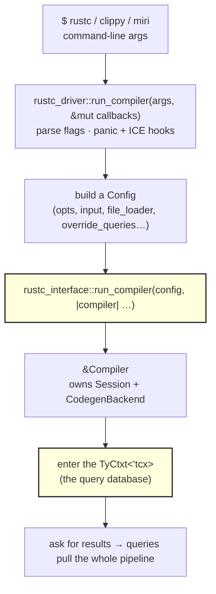
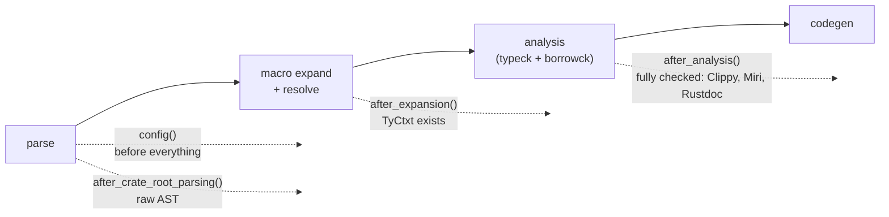
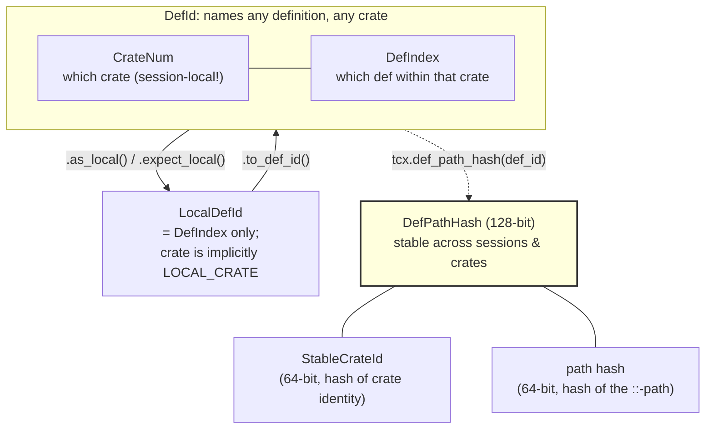
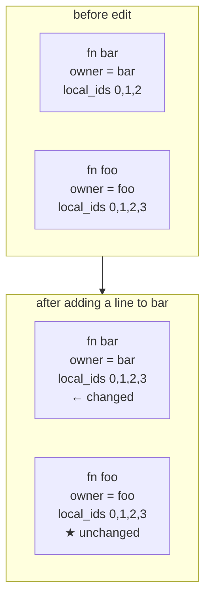
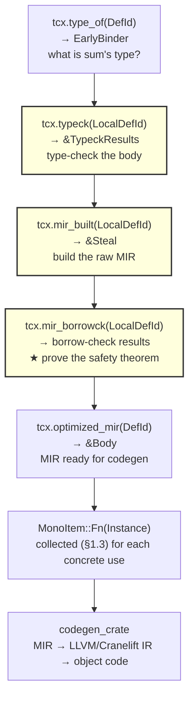
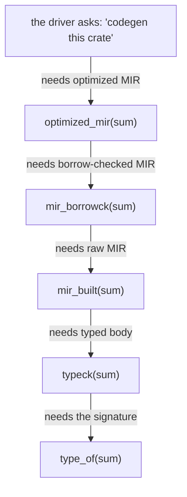
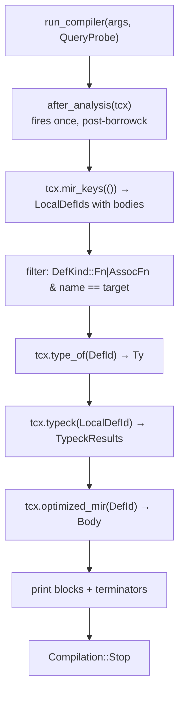
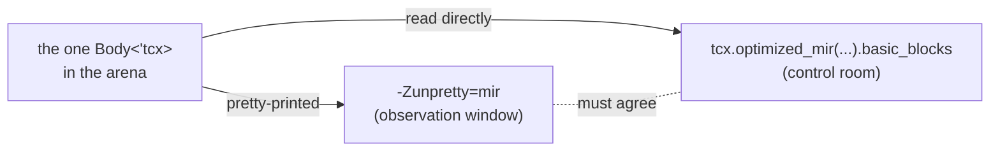

```admonish abstract title="What you'll learn"
- Why "the compiler" is a *library* (`rustc_interface`) with a CLI client (`rustc_driver`) on top, and how Clippy, Miri, and Rustdoc all reuse the same frontend by implementing the `Callbacks` trait.
- The four `Callbacks` hooks (`config`, `after_crate_root_parsing`, `after_expansion`, `after_analysis`) and the `Compilation::{Stop, Continue}` return-value protocol that lets tools splice in at coarse phase boundaries.
- The identity vocabulary: [`DefId`](../glossary.md#defid) ([`CrateNum`](../glossary.md#cratenum) + `DefIndex`), [`LocalDefId`](../glossary.md#localdefid), [`DefPathHash`](../glossary.md#defpathhash) (`StableCrateId` + path hash), [`HirId`](../glossary.md#hirid) (`OwnerId` + `ItemLocalId`), `BodyId`, and why [`Span`](../glossary.md#span) is deliberately kept outside the family.
- How to tail one definition through the query chain (`type_of` to `typeck` to `mir_built` to `mir_borrowck` to `optimized_mir` to collection to codegen), and why three of those queries take `LocalDefId` while two take `DefId`.
- That the pipeline is pulled backward from codegen, not pushed forward from parsing: the driver asks for the final thing and each query lazily pulls its predecessors.
- How to build a 40-line `rustc_private` driver that fires `tcx.mir_keys`, `tcx.type_of`, `tcx.typeck`, and `tcx.optimized_mir` on a function of your choosing and prints its basic blocks.
```

## 2.1 The Shell: `rustc_driver`, `rustc_interface`, and Compilation as Callbacks

### Three compilers that are secretly one compiler

Here is a fact that reorganizes how most people picture the Rust toolchain. **Clippy is not a linter that re-parses your code. Miri is not a separate interpreter that re-implements Rust's semantics. Rustdoc is not a documentation tool with its own parser.** All three are `rustc` (the *exact same compiler*, the same lexer, the same parser, the same type checker, the same [MIR](../glossary.md#mir)) wearing a different hat. Each one links against the compiler as a library, lets it do the full frontend work, and then steps in at a specific moment to do its own thing: Clippy walks the [HIR](../glossary.md#hir) looking for [lint](../glossary.md#lint) patterns, Miri takes the MIR and interprets it, Rustdoc reads the analyzed crate and emits HTML.

The mechanism that makes this possible, that lets a few hundred lines of code reuse the entire Rust frontend rather than reimplementing it, is the compiler's **shell**: the thin orchestration layer, split across `rustc_driver` and `rustc_interface`, that boots the compiler, runs it through its phases, and offers a handful of well-defined hooks where external code can climb aboard. Understanding the shell is understanding how you, too, could build a tool on top of `rustc`, and, more immediately for this book, how the whole pipeline from Chapter 1 is actually launched and sequenced.

```admonish tip title="Pro-Tip"
A useful realization for a `rustc` contributor is that "the compiler" is a *library* (`rustc_interface`) with a *command-line front-end* (`rustc_driver`) on top. Everything you will read in this book lives in that library. The `rustc` binary you invoke from the shell is one client of it, and you can write your own client.
```

### Theoretical foundation: the driver, classic and modern

Every compiler textbook has a driver, even if it is never named. In the Dragon Book's model, *something* has to read the command line, open the source file, call lexical analysis, hand its output to the parser, hand *that* to semantic analysis, and so on down the line, finally writing the object file. In a classic C compiler this driver is an explicit, linear `main()`: a sequence of function calls, one phase after another, each consuming the previous phase's output. Cooper & Torczon describe it plainly: the driver "sequences the passes." Appel's Tiger Book builds exactly such a `main` in its first chapters: `parse`, then `semant`, then `translate`, then `emit`.

`rustc`'s driver looks superficially similar and is philosophically inverted. It is superficially similar in that `rustc_driver` really is "essentially `rustc`'s `main()` function" (the dev-guide's own phrasing): it parses command-line flags, sets up the compiler session, and kicks off compilation. But it is philosophically inverted in *how the phases are sequenced*. A classic driver **pushes**: it actively calls phase 1, then phase 2, then phase 3. `rustc`'s driver mostly **sets up the world and then asks for the final result**, and the phases run themselves *on demand* as the [query system](../glossary.md#query) (Chapter 3) pulls each one in to satisfy that request. The driver does not march the program through type checking and then [borrow checking](../glossary.md#borrow-checker) and then codegen; it asks for codegen, and codegen's dependencies drag in everything upstream automatically.

This gives the shell a curious dual nature, and it is the central concept of this section:

- A **pull** spine, where the real fine-grained sequencing is demand-driven by queries (Chapter 3's subject).
- A **push** skin, a small set of *coarse* phase boundaries ("crate parsed," "macros expanded," "analysis complete") at which the driver pauses and offers a hook to external code.

The push skin exists precisely so that tools like Clippy and Miri have a defined moment to act. You do not want Clippy reaching into the middle of type inference; you want it to run *after analysis is complete*, on a stable, fully-checked program. The `Callbacks` trait is that set of agreed-upon moments.

```admonish warning title="Warning, unlearn the linear main() mental model"
If you come from a C or textbook-compiler background, you will instinctively look for the function that calls `typecheck()` then `borrowck()` then `codegen()` in order. There is no single linear function that pushes the program through typeck → borrowck → codegen the way a textbook driver would; the sequencing is implicit in the query graph. Searching for that linear function is the most common way newcomers get lost in `rustc`. The driver's job is setup and coarse phase hooks; the *ordering* is Chapter 3's story.
```

### Architecture deep-dive: `Config`, `run_compiler`, and `Compiler`

Two crates divide the labor.

`rustc_interface` is the library API, the stable-ish front door for *anyone* embedding the compiler. Its centerpiece is a single function, `run_compiler`, which takes a `Config` describing *what* to compile and a closure describing *what to do with the running compiler*:

```rust
// compiler/rustc_interface/src/interface.rs  (faithful; body elided)
pub fn run_compiler<R: Send>(config: Config, f: impl FnOnce(&Compiler) -> R + Send) -> R;
// The Send bounds exist because the work runs inside a thread pool.
```

The `Config` struct is the compiler's entire input surface gathered into one place. Abbreviated, it carries:

```rust
// compiler/rustc_interface/src/interface.rs  (selected fields; the real struct is larger)
pub struct Config {
    pub opts: config::Options, // parsed -C / -Z / -O flags, edition, etc.
    pub input: Input,  // a file path, or source held in a String
    pub output_dir: Option<PathBuf>,
    pub output_file: Option<OutFileName>,
    pub file_loader: Option<Box<dyn FileLoader + Send + Sync>>,  // how to read source
    pub register_lints: Option<Box<dyn Fn(&Session, &mut LintStore) + Send + Sync>>,
    pub override_queries: Option<fn(&Session, &mut Providers)>,  // swap query impls!
    pub make_codegen_backend:
        Option<Box<dyn FnOnce(&config::Options, &Target)
                          -> Box<dyn CodegenBackend> + Send>>,
    // ... crate_cfg, crate_check_cfg, ice_file, lint_caps, psess_created,
    // hash_untracked_state, extra_symbols, using_internal_features ...
}
```

Look at three of those fields, because each is a door for a serious tool. `file_loader` lets you feed the compiler source that does not live on disk: this is how a tool can compile a `String` it generated in memory. `make_codegen_backend` lets you swap LLVM for Cranelift or your own backend. And `override_queries` lets you *replace the implementation of any query*, the hook by which a research tool can intercept, say, `optimized_mir` and instrument it. The `Config` is not a passive options bag; it is a set of injection points into the compiler's machinery.

`rustc_driver` (implementation crate `rustc_driver_impl`) sits one layer up: it is the command-line client of `rustc_interface`. Its own `run_compiler` (note: *different function*, same name, one layer higher) takes the raw `args: &[String]` and a `Callbacks`, parses the flags into a `Config`, installs panic hooks and the infamous ICE ("internal compiler error") reporter, and then calls down into `rustc_interface::run_compiler`. The `rustc` binary's `main` is barely more than a call to this.

```admonish warning title="Warning, two functions named run_compiler"
There is `rustc_interface::run_compiler` (low-level: takes a fully-built `Config`) and `rustc_driver::run_compiler` (high-level: takes CLI `args` and a `Callbacks`, builds the `Config` for you). They are not the same function and live in different crates. The driver one is what custom tools call; the interface one is what the driver one calls. Keep them straight when reading source or you will misjudge which layer you are in.
```

Inside the closure you receive a `&Compiler`. The `Compiler` is the live, configured compiler instance, it owns the `Session` (global configuration, the error emitter, target info) and the source map, and it is the object from which compilation actually proceeds. In current `rustc` you obtain the [`TyCtxt`](../glossary.md#tyctxt-tcx) (the query database from Chapter 1, the universe in which all `tcx.foo(...)` calls live) by entering it, conceptually `compiler.enter(|tcx| { ... })`, and from inside *that* closure you can ask the query system for anything. (In current `rustc` the real entry-point is the free function `passes::create_and_enter_global_ctxt`, which `run_compiler` calls internally on your behalf.)

```admonish tip title="Pro-Tip, the API churns; the layering does not"
The exact path from `&Compiler` to `TyCtxt` has changed across releases [VERIFY against your nightly]. Do not memorize the method chain. Memorize the *layering*, `Config` → `Compiler` → `Session` + `TyCtxt` → queries, which has been stable for years. When your code stops compiling against a new nightly, it is almost always this method chain, and the dev-guide's "rustc_driver and rustc_interface" page always has the current incantation.
```

Here is the shell's architecture as a whole, from command line to the query database:




The two highlighted nodes are the seam between *your* code and *the compiler library*: `rustc_interface::run_compiler` is where you hand control to the compiler, and entering the `TyCtxt` is where you get a handle to ask it questions.

### The `Callbacks` trait: the push skin

Now the hooks. The `Callbacks` trait is what a tool implements to splice itself into the coarse phase boundaries. Its current shape is small enough to print in full (method names and signatures have shifted across releases: `after_parsing` became `after_crate_root_parsing`, and `after_expansion` once took a `Queries` and now takes a `TyCtxt`, so verify against your nightly):

```rust
// compiler/rustc_driver_impl/src/lib.rs  (faithful; doc-comments paraphrased)
pub trait Callbacks {
    /// Mutate the Config (inject lints, override queries, change options).
    fn config(&mut self, _config: &mut interface::Config) {}
    /// Fires after the crate root parses; submodules not yet parsed.
    fn after_crate_root_parsing(
        &mut self,
        _compiler: &interface::Compiler,
        _krate: &mut ast::Crate,
    ) -> Compilation { Compilation::Continue }
    /// Fires after macro expansion + name resolution. tcx is now available.
    fn after_expansion<'tcx>(
        &mut self,
        _compiler: &interface::Compiler,
        _tcx: TyCtxt<'tcx>,
    ) -> Compilation { Compilation::Continue }
    /// Fires after analysis (typeck + borrowck) is complete.
    /// This is where Clippy and most analysis tools do their work.
    fn after_analysis<'tcx>(
        &mut self,
        _compiler: &interface::Compiler,
        _tcx: TyCtxt<'tcx>,
    ) -> Compilation { Compilation::Continue }
}
pub enum Compilation { Stop, Continue }  // returned by every callback
```

Every method has a default that does nothing and returns `Compilation::Continue`, so a tool overrides only the one moment it cares about. The return type is the other half of the design:

```rust
pub enum Compilation {
    Stop, // halt compilation here
    Continue, // keep going to the next phase
}
```

`Compilation::Stop` is how a tool says "I have what I need; do not bother running the rest." Rustdoc, after analysis, has everything it needs to emit documentation and has no interest in codegen, so it returns `Stop`: that is why `cargo rustdoc` does not produce a binary. A pure linter would do the same. (`cargo clippy` also produces no binary, but via a different route: it invokes `rustc` in **check-mode** (`--emit=metadata`), which never reaches codegen at all, regardless of what its `Callbacks` return [VERIFY against current clippy-driver].)

Map the four hooks onto Chapter 1's pipeline and the design intent is obvious:




Each hook sits at a boundary where the program is in a *known, stable state*: after parsing you have a complete [AST](../glossary.md#ast); after expansion the macros are gone and names are resolved; after analysis the safety theorem of Chapter 1 is proven and the types are final. Tools attach at whichever state they need.

### Source walkthrough: a forty-line compiler

The smallest possible custom driver makes the theory concrete. This program links the compiler as a library and, after analysis, prints the path of every item in the crate, a miniature ancestor of how Clippy enumerates things to lint. (It requires the `rustc-dev` rustup component, the `#![feature(rustc_private)]` gate, and `extern crate` declarations because these internal crates are not on the normal dependency graph.)

```rust
#![feature(rustc_private)]

// These crates ship with the `rustc-dev` component, not crates.io.
extern crate rustc_driver;
extern crate rustc_interface;
extern crate rustc_middle;
extern crate rustc_ast;

use rustc_driver::{Callbacks, Compilation, run_compiler};
use rustc_interface::interface::Compiler;
use rustc_middle::ty::TyCtxt;

struct ListItems;

impl Callbacks for ListItems {
    fn after_analysis(&mut self, _compiler: &Compiler, tcx: TyCtxt<'_>) -> Compilation {
        // The program is now fully parsed, expanded, type-checked, borrow-checked.
        // Walk every local item and print its definition path.
        for local_def_id in tcx.hir_crate_items(()).definitions() {
            let def_id = local_def_id.to_def_id(); // LocalDefId → DefId (see §2.2)
            println!("item: {}", tcx.def_path_str(def_id));
        }
        Compilation::Stop // we don't need codegen; stop here.
    }
}

fn main() {
    let args: Vec<String> = std::env::args().collect();
    run_compiler(&args, &mut ListItems);
}
```

Walk it against everything we have built. `run_compiler(&args, &mut ListItems)` is `rustc_driver`'s high-level entry: it parses `args` into a `Config`, boots the compiler, and runs the pipeline, invoking our callback at each boundary. We override exactly one hook, `after_analysis`, because we want a *fully analyzed* program: we are about to ask `tcx` questions that only have answers once type and borrow checking are done. Inside, `tcx` is the query database; `tcx.hir_crate_items(())` is a *query* (note the Chapter-1 "ask the query system" reading) returning this crate's items; `tcx.def_path_str(def_id)` is another query turning a definition id into a printable path like `mycrate::foo::bar`. We convert each `LocalDefId` to a `DefId` with `.to_def_id()`, the very identity-vocabulary distinction §2.2 will dissect. Finally we return `Compilation::Stop`: we have what we came for, so codegen never runs.

Build it, point it at any `.rs` file, and it prints that file's items. You have written, in forty lines, a tool with the same architectural skeleton as Clippy and Miri. The entire Rust frontend did the heavy lifting; you supplied a single callback.

```admonish tip title="Pro-Tip"
When you eventually read Clippy's source, head straight for its `Callbacks` implementation (`impl rustc_driver::Callbacks for ClippyCallbacks`). Everything Clippy does hangs off `after_analysis` registering its lint passes via the `register_lints` config hook. Miri's driver is the same story with a different payload: its `after_analysis` hands the `tcx` to the Miri interpreter instead of to LLVM. Reading those two files back-to-back is the fastest way to internalize that the shell is a *plugin host*.
```

### Where this leaves us

We have established the compiler's outermost layer. `rustc_interface` is the library; `rustc_driver` is its command-line client; `Config` is the input-and-injection surface; `Compiler` hands you the `Session` and, by entering it, the `TyCtxt`; and the `Callbacks` trait is the small set of push-style hooks at coarse phase boundaries (`config`, `after_crate_root_parsing`, `after_expansion`, `after_analysis`) each returning `Continue` or `Stop`. The duality to carry forward is push-skin over pull-spine: the driver offers coarse phase hooks, but the fine-grained ordering of the pipeline is demand-driven, which is Chapter 3's entire subject.

There is, however, a conspicuous gap. Twice now, in the forty-line driver and in Chapter 1's collector, we have leaned on identifiers like `LocalDefId`, `DefId`, and `HirId`, and twice we have waved at them with "see §2.2." That promissory note comes due next. §2.2 dissects the compiler's **identity vocabulary**: how `rustc` names every definition and every node so that the query system can cache results, so that incremental compilation can tell what changed, and so that one crate can refer to another's items. Before we can watch the pipeline's data flow in §2.3, we need to know what the data is *called*.

## 2.2 The Identity Vocabulary: DefId, LocalDefId, HirId, and Friends

### The broken permalink

You have almost certainly done this. You are reviewing code, you find the exact line that matters, you copy a link to it (`github.com/org/repo/blob/main/src/lib.rs#L240`) and you paste it into a comment for a colleague. A week later they click it and land on a blank line in the middle of a comment block, because someone added thirty lines near the top of the file and *every line number below shifted.* The link pointed at a **position**, and positions are fragile: they move the instant anything above them changes. The fix every developer eventually learns is the **permalink**, pin to a commit hash, because that names the line by something stable instead of by where it happens to sit today.

`rustc` lives or dies by the same distinction, and at a far higher stakes. Consider what incremental compilation demands: you edit one function in a 50,000-line crate, and the compiler must recompile *that function and only what genuinely depends on it*, not the other 49,950 lines whose meaning did not change. But your edit shifted the byte offsets of everything below it. If the compiler identified functions by *position*, every function after your edit would look "different" and the entire crate would recompile. Incremental compilation would be impossible.

So `rustc` needs names for things that are **stable under unrelated edits**, the compiler's equivalent of a permalink. It also needs names that work **across crate boundaries** (so your crate can refer to `std::vec::Vec` in a crate compiled months ago), and names cheap enough to serve as **cache keys** for millions of query invocations. No single identifier can be all of these at once, so `rustc` has a small family of them, each tuned for a job. This section is that family. Get it wrong and nothing else in the compiler will read correctly; get it right and a dozen later mysteries dissolve.

### Theoretical foundation: the symbol table, grown up

Open the Dragon Book to its treatment of the **symbol table** (chapters 2 and 7). The classic picture is a single data structure mapping each identifier to an entry recording its type, scope, storage, and so on. Every phase consults it; the parser inserts names, semantic analysis annotates them, code generation reads them. Appel and Cooper & Torczon present variations, but the core idea is constant: *one table, names in, attributes out.* It is bookkeeping for a compiler that runs once, start to finish, over a single program, and then exits.

`rustc`'s identity vocabulary is the direct descendant of that symbol table, evolved to survive three pressures the classic model never faced:

1. **Separate compilation across crates.** `std` was compiled long ago and lives as a binary `.rlib` with metadata. When your code calls `Vec::push`, the compiler must name an item *in another crate's already-finished compilation.* A single in-memory symbol table cannot span that gap; you need an identifier that encodes *which crate* and *which item within it*, and that can be serialized and re-loaded.
2. **Incremental recompilation.** As argued above, identifiers must be stable under edits that do not change a thing's meaning, so the [dependency graph](../glossary.md#depgraph) (Chapter 3) can tell genuine change from mere movement.
3. **Demand-driven query caching.** Every query is keyed on its input. If that key is a definition, the key must be small, `Copy`, hashable, and comparable in a couple of machine instructions, because it will be looked up constantly.

No one identifier satisfies all three, so `rustc` factors the old symbol table into several cooperating types. The headline split is **stable-but-slow** identifiers (a `DefPathHash`, good for cross-session and cross-crate work) versus **fast-but-session-local** identifiers (a `DefId`, an interned integer pair, good for in-memory lookups). Understanding *which identifier is which* is the whole game.

### Anatomy of a `DefId`

The workhorse is the `DefId`, the identifier for any *definition*: a function, struct, enum, trait, `impl`, constant, module, associated item, anything you can give a name to with an item-like declaration. Its structure is two small integers:

```rust
// compiler/rustc_span/src/def_id.rs  (faithful; field order shown is the
// pedagogical "crate-then-index" reading. Real source declares `index` first,
// `krate` second, with a cfg-gated swap on big-endian 64-bit targets; the
// layout is engineered for FxHash quality, not source clarity.)
pub struct DefId {
    pub krate: CrateNum, // which crate
    pub index: DefIndex, // which definition within that crate
}
```

`CrateNum` is a session-local index into the list of crates this compilation knows about; `LOCAL_CRATE` is the constant `CrateNum` for the crate currently being compiled, and upstream crates get other numbers as they are loaded. `DefIndex` is an index into *that* crate's table of definitions (the "def-path table"). So a `DefId` reads literally as "*crate number `k`, definition number `i` within it*." Both halves are tiny interned integers, which makes a `DefId` a `Copy` value that fits in a register and compares in one instruction, exactly the property requirement 3 demanded of a query key.

But notice the catch hiding in `CrateNum`: it is **session-local**. The number assigned to `serde` in today's compilation may differ from the number it gets tomorrow, because it depends on the order crates were loaded. A `DefId` is therefore a *fast* identifier but not a *stable* one, perfect for in-memory work within one compilation, useless for persisting across sessions. Hold that thought; `DefPathHash` will resolve it.

Now the refinement that trips up every newcomer reading `rustc` source: `LocalDefId`.

```rust
// compiler/rustc_span/src/def_id.rs  (faithful)
pub struct LocalDefId {
    pub local_def_index: DefIndex, // crate is *implicitly* LOCAL_CRATE
}
```

A `LocalDefId` is *a `DefId` that the type system guarantees lives in the current crate.* It drops the `CrateNum` (it is always `LOCAL_CRATE`) and keeps only the `DefIndex`. This is not a micro-optimization; it is a **correctness device encoded in the type**. Vast swathes of the compiler can only operate on local items: you can fetch the *HIR* of a function you are compiling, but not of a function in `std` (you only have `std`'s metadata, not its source tree). By taking a `LocalDefId` rather than a `DefId`, those APIs make "this must be a local item" a *compile-time* guarantee rather than a runtime `assert`. If you have a `LocalDefId`, the borrow of HIR cannot fail for the it's-in-another-crate reason; the type already ruled it out.

```admonish warning title="Warning, DefId vs LocalDefId is a real distinction, not noise"
Newcomers read `LocalDefId` as "some variant of `DefId` I can ignore." It is the opposite: the choice between them is *semantically load-bearing.* A function taking `LocalDefId` is telling you 'I only work on the crate being compiled.' A function taking `DefId` works on any crate but must handle the cross-crate case (often by going through serialized metadata instead of HIR). When you write compiler code and reach for `def_id.expect_local()`, you are asserting 'I am certain this is local', and if you are wrong, it is an ICE. Choosing the right one is part of writing correct `rustc` code.
```

The conversions between them are explicit and worth memorizing:

```rust
let d: DefId = local.to_def_id(); // LocalDefId → DefId  (always works)
let maybe: Option<LocalDefId> = d.as_local(); // DefId → LocalDefId, if local
let definitely: LocalDefId = d.expect_local(); // … or ICE if it isn't
```

Here is the composition of these identifiers as a single picture:




### `DefPathHash`: the permalink

The highlighted node above is the answer to the broken-permalink problem. A `DefPathHash` is a hash of a definition's **def-path**, the `::`-separated logical path to it, like `mycrate::widgets::Button::render`. It is a [`Fingerprint`](../glossary.md#fingerprint), which is two 64-bit halves: a `StableCrateId` in the high half and a crate-local def-path hash in the low half (the source's `Fingerprint::split()` is what destructures them):

```rust
// compiler/rustc_span/src/def_id.rs  (faithful)
pub struct DefPathHash(pub Fingerprint);
//   one half identifies the crate (a StableCrateId);
//   the other hashes the def-path *within* that crate.
```

Everything fragile about a `DefId` is fixed here. The crate is identified by a *hash of its name and disambiguator* (the `StableCrateId`), not by a session-local `CrateNum`, so it means the same thing across compilations and across machines. The within-crate half hashes the *logical path*, not the *byte position*, so adding an unrelated function elsewhere in the file does not change it. Move `Button::render` to a different line, add a hundred items above it: its def-path is still `mycrate::widgets::Button::render`, so its `DefPathHash` is identical. *This* is the permalink: a name that survives edits which do not change a thing's identity.

The division of labor is therefore:

- **Within one compilation session**, the compiler uses `DefId` (fast interned integers) for everything.
- **Across sessions and across crates** (writing the incremental cache to disk, reading another crate's metadata, deciding in Chapter 3 whether a dependency-graph node is still valid) the compiler uses `DefPathHash`, the stable permalink.

At the start of each session, `rustc` builds a map between the two: it loads the previous session's `DefPathHash` values and matches them to this session's freshly-assigned `DefId`s. That mapping is the bridge that lets incremental compilation carry knowledge from yesterday's `DefId` numbering into today's.

```admonish tip title="Pro-Tip"
When you see code serialize or compare a `DefPathHash`, you are almost always looking at incremental-compilation or cross-crate-metadata machinery. When you see a bare `DefId` flowing between queries, you are in the hot path of a single compilation. Spotting which identifier a piece of code uses tells you *what kind of code it is* before you read a single line of its logic.
```

### `HirId`: naming the nodes inside a body

`DefId` names *definitions*, item-level things. But the compiler also needs to name the thousands of nodes *inside* a function body: every expression, every statement, every sub-pattern. That is the job of the `HirId`, whose two-level design is shaped by the same incremental pressures:

```rust
// compiler/rustc_hir_id/src/lib.rs  (faithful; #[derive] and #[rustc_pass_by_value] elided)
pub struct HirId {
    pub owner: OwnerId, // which item-like "owns" this node
    pub local_id: ItemLocalId, // this node's index *within* that owner
}
pub struct OwnerId { pub def_id: LocalDefId }
```

A `HirId` is **two-level**: an `owner` (an item-like, a function, say, identified by its `LocalDefId`) plus a `local_id`, a simple integer counting nodes *within that owner* in a deterministic traversal order. The owner's own node is `local_id` zero; its first child is one, and so on.

Why two levels instead of one global node counter? Because of incremental stability, the same theme as `DefPathHash`. Imagine a single flat numbering across the whole crate: node #5,000 is some expression deep in function `foo`. Now you add an expression to function `bar`, which sits *above* `foo` in the file. Under flat numbering, every node after your edit renumbers (#5,000 becomes #5,001) and `foo` looks entirely changed even though you never touched it. With the two-level scheme, your edit changes only `bar`'s internal `local_id`s; `foo`'s owner is unchanged and `foo`'s `local_id`s are unchanged, because they are counted *relative to `foo`*, not to the whole crate. **Unrelated edits to one function generally do not perturb another owner's `local_id`s** (renaming, splitting, or moving owners are the exceptions). Churn is contained to the single owner you actually edited.




`foo` survives your edit to `bar` completely unscathed (its `HirId`s are byte-for-byte identical) which is exactly what lets the dependency graph keep `foo`'s analysis results green.

The dev-guide makes a second, subtler point about *why HIR is reached through ids rather than direct pointers*: when you hold a `LocalDefId` for a function and must call a query to fetch its body, that act of fetching is *observable*. The query system gets a chance to record "whoever is running right now depends on `foo`'s body", building the dependency edge automatically. If you held a raw `&Body` pointer instead, the dependency would be invisible. The indirection is not bureaucracy; it is how dependencies get tracked for free. (We unpack this fully in Chapter 3.)

A close relative rounds out the set: the `BodyId`, which identifies an executable body (a function body, a `const` initializer, a closure body). It is a small wrapper around a `HirId` of the body's root expression, the handle you pass to `tcx` to fetch the actual `Body` and walk its expressions.

### The deliberate outsider: `Span`

It is worth naming what is *not* in this family. A `Span` (the source location used for error messages, the `lo..hi` byte range into the source map) is the *fragile, position-based* identifier, the very line-number-link this section opened by rejecting. And that is fine, because a `Span`'s job is the one job where position is exactly what you want: pointing a human at the right squiggle in their editor. `rustc` keeps spans rigorously *separate* from the stable identity vocabulary precisely so that the fragile thing (where text sits) never contaminates the stable thing (what a definition *is*). A `DefId` answers "which function?"; a `Span` answers "where, in today's source, is it written?" Conflating them would reintroduce the broken permalink into the heart of the compiler. (Chapter 6 gives spans and the source map their own full treatment.)

### Putting the vocabulary to work

In practice you move between these constantly, via `tcx`:

```rust
// Given a LocalDefId for an item we're compiling…
let hir_id: HirId   = tcx.local_def_id_to_hir_id(local_def_id);  // item → its HIR node id
// id → the actual HIR node
let node            = tcx.hir_node(hir_id);
// → "mycrate::foo::bar"
let printable: String = tcx.def_path_str(local_def_id.to_def_id());
let stable: DefPathHash = tcx.def_path_hash(local_def_id.to_def_id()); // → the permalink
```

Read those four lines as a tour of everything above. We start with a `LocalDefId` (a definition guaranteed to be in our crate), turn it into the `HirId` of its HIR node, fetch that node, and separately render the definition both as a human-readable path and as its stable hash. Every one of those calls is a query (the Chapter-1 reading, "ask the query system") and every one is keyed on one of the identifiers this section dissected.

### Where this leaves us

The classic compiler's single symbol table has, in `rustc`, become a small family of identifiers, each shaped by a pressure the textbook never felt. `DefId` (a `CrateNum` plus a `DefIndex`) is the fast, session-local name for any definition; `LocalDefId` is the type-level promise that a definition is in the current crate; `DefPathHash` (a `StableCrateId` plus a path hash) is the stable permalink that survives across sessions and crates and makes incremental compilation and cross-crate metadata possible; `HirId` (an `OwnerId` plus an `ItemLocalId`) names nodes *inside* a body with a two-level scheme that confines edit-churn to a single owner; `BodyId` names executable bodies; and `Span` is deliberately kept outside the family as the fragile, position-based locator for diagnostics.

Twice this section has gestured at the dependency graph ("so incremental compilation can tell change from movement," "so the query records a dependency for free") and twice deferred it to Chapter 3. We have nearly paid off Chapter 2's debts. One remains: we have now met the shell that launches the pipeline (§2.1) and the vocabulary that names its data (§2.2), but we have not yet watched the *data itself* flow from one representation to the next. §2.3 does exactly that: it takes the full pipeline as a single object and traces a definition, by its `DefId`, as it acquires a type, a HIR body, a MIR graph, and finally machine code, query by query.

## 2.3 The Pipeline as One Object: Tracing a Definition from `DefId` to Machine Code

### Tailing a single function

A detective does not understand a conspiracy by interviewing all ten thousand citizens of a city at once. She picks one suspect and *tails* him (follows him from his apartment to his office to the back room of a restaurant) and the shape of the whole operation reveals itself through that single thread. We do exactly this to the compiler. We pick **one function**, learn its `DefId`, and tail it through the entire compiler, watching each phase compute the next layer of truth about it, until it arrives as machine code. The two pieces are in hand: §2.1 gave us the shell that runs `rustc` and the moment (`after_analysis`) where we can climb aboard, and §2.2 gave us the names the compiler assigns to things.

The function is our old friend from Chapter 1's lab:

```rust
fn sum(slice: &[i32]) -> i32 {
    let mut total = 0;
    for &n in slice { total += n; }
    total
}
```

To the compiler, `sum` is a definition. Once `rustc_ast_lowering` has run, it has been assigned a `LocalDefId` (it lives in the crate being compiled), and through `.to_def_id()` a `DefId`. Everything the compiler ever learns about `sum` (its type, its typed body, its control-flow graph, whether it borrow-checks, its optimized form, its machine code) is computed by a **query keyed on that id.** Tailing `sum` means watching that chain of queries fire, each one pulling the one before it. This is the moment the abstract pipeline of §1.1 becomes a concrete sequence of named function calls you could set a breakpoint on.

### The chain of truth

Here is the suspect's itinerary, the ordered chain of queries that progressively compute everything about `sum`, with the key each one takes and the result each one returns:




Compare the highlighted nodes against §2.2: three queries take a `LocalDefId`; two take a `DefId`. **The three highlighted queries (`typeck`, `mir_built`, `mir_borrowck`) take a `LocalDefId`; the two unhighlighted *query* nodes (A=`type_of` and E=`optimized_mir`) take a `DefId`. F and G are not keyed by `DefId`/`LocalDefId` at all.** This is not arbitrary. `typeck`, `mir_built`, and `mir_borrowck` *can only operate on the crate being compiled*, because they need the function's **HIR** (its source body) and you only have HIR for local code. So their type signatures demand a `LocalDefId`, the §2.2 compile-time promise of locality. By contrast `type_of` and `optimized_mir` can answer for *any* crate (you can ask for the type or the optimized MIR of a `std` function, served from that crate's serialized metadata) so they take the more general `DefId`. The identity vocabulary from §2.2 is not bookkeeping trivia; it is encoded directly into which queries can do what.

Let us tail `sum` through each stop.

### Stop 1, `type_of`: what *is* this thing?

The first question the compiler can answer about `sum` independent of its body is its type. The query is:

```rust
// faithful; type_of returns the type wrapped in EarlyBinder
query type_of(key: DefId) -> ty::EarlyBinder<'tcx, Ty<'tcx>> { /* … */ }
```

You invoke it as `tcx.type_of(sum_def_id)`. For `sum` it yields the function type `fn(&[i32]) -> i32`. Two details earn their place here. First, the key is a `DefId`, so this works cross-crate, exactly as the diagram's color-coding predicted. Second, the return is not a bare [`Ty<'tcx>`](../glossary.md#tytcx) but an `EarlyBinder<Ty<'tcx>>`. That wrapper is the compiler reminding you "*this type may still contain unsubstituted generic parameters.*" `sum` has none, but `Vec::<T>::push` would, and `type_of` returns the *generic* type with a binder you must discharge by calling `.instantiate(tcx, args)` with concrete arguments before the type is fully concrete. `EarlyBinder` is the type system's way of making "you have not yet plugged in the generics" a compile-time obligation rather than a latent bug, the same defensive-typing philosophy as `LocalDefId`.

### Stop 2, `typeck`: check the body

`type_of` knew `sum`'s *signature* without looking inside it. To check the *body* (to confirm `total += n` type-checks, to recognize the `+=` as primitive `i32` addition, a built-in MIR op; trait dispatch through `AddAssign` is what user types overloading `+=` would take, and to discharge the [trait obligations](../glossary.md#obligation) from §1.2) the compiler runs `typeck`:

```rust
// faithful
query typeck(key: LocalDefId) -> &'tcx ty::TypeckResults<'tcx> { /* … */ }
```

Now the key is a `LocalDefId`: body checking is local-only. The result, `TypeckResults`, is the filled-in answer sheet: a side table mapping each `HirId` in `sum`'s body (those §2.2 node ids!) to its inferred type, every method call to the exact method it resolved to, every adjustment (auto-deref, auto-ref) the compiler inserted. This is the [THIR](../glossary.md#thir)'s raw material: recall from §1.4 that THIR is "HIR after type checking," and `TypeckResults` is precisely *what was learned* during that checking, keyed by the node ids of §2.2. The vocabulary and the pipeline interlock here: the analysis is a map *from §2.2's identifiers to §1's types.*

```admonish tip title="Pro-Tip"
`typeck` is one of the most useful queries to set a breakpoint on when you are learning the compiler, because it is the boundary between "syntax that might be nonsense" and "a program known to be type-correct." If you are ever unsure whether a piece of compiler code runs *before* or *after* types are known, ask whether it is upstream or downstream of `typeck`. Upstream, you have only HIR and guesses; downstream, every node has a settled type in `TypeckResults`.
```

### Stop 3, `mir_built`: lower to the graph

With the body type-checked, the compiler lowers it through THIR into MIR, the control-flow graph we dumped in §1.4 and that the borrow checker reads in §1.3. The query is:

```rust
// faithful
query mir_built(key: LocalDefId) -> &'tcx Steal<mir::Body<'tcx>> { /* … */ }
```

Two things to notice. The key is again `LocalDefId` (building MIR needs the local THIR). And the return type is wrapped in `Steal`: `&'tcx Steal<Body<'tcx>>`. A `Steal<T>` is a value that a later phase is allowed to *take ownership of exactly once*; after it is "stolen," any further attempt to read it panics with an ICE. Why? Because the freshly-built MIR is *raw*: it has not been borrow-checked or optimized, and the compiler wants to guarantee that nobody accidentally generates code from this unverified version. The pipeline of borrow-check-then-optimize *steals* the raw body, transforms it, and produces a new one. `Steal` makes the rule "raw MIR is an intermediate that must be consumed, never shipped" a type-system invariant.

### Stop 4, `mir_borrowck`: prove the theorem

Now the safety theorem of Chapter 1. The query `mir_borrowck`, keyed on `LocalDefId` (you can only borrow-check code you have the body for), runs the entire seven-step analysis we dissected in §1.3: renumber [regions](../glossary.md#region), move analysis, enumerate borrows, solve regions via [NLL](../glossary.md#nll), run borrow-liveness dataflow, walk the MIR checking each access, report diagnostics. For `sum` it succeeds silently: there are no aliasing violations in a simple summation. Its job in the chain is not to *transform* `sum` but to *gate* it, to refuse the program if the theorem cannot be proven. This is the safety-theorem phase from §1.1, occupying its place mid-pipeline between raw MIR and optimized MIR because it needs the freshly-built body the programmer actually wrote, before any optimizer rewrite, and must gate codegen on the theorem holding.

### Stop 5, `optimized_mir`: the codegen-ready form

After borrow checking passes, the MIR optimization passes run, producing the final MIR that codegen will consume. This is the one query in our chain whose source we verified verbatim against the repository, so here it is exactly as it appears in `compiler/rustc_middle/src/queries.rs`:

```rust
/// MIR after our optimization passes have run. This is MIR that is ready
/// for codegen. This is also the only query that can fetch non-local MIR, at present.
query optimized_mir(key: DefId) -> &'tcx mir::Body<'tcx> {
    desc { |tcx| "optimizing MIR for `{}`", tcx.def_path_str(key) }
    cache_on_disk_if { key.is_local() }
    separate_provide_extern
}
```

Every token here is a lesson we have already earned. The key is `DefId`, and the doc-comment states *why* in plain words: this is "the only query that can fetch non-local MIR", it must work cross-crate so that, when your code inlines a `std` function, codegen can pull `std`'s optimized MIR. That is exactly the `DefId`-not-`LocalDefId` choice from §2.2, justified in a source comment. The `desc { … tcx.def_path_str(key) }` line builds the human-readable description ("optimizing MIR for `sum`") used in cycle errors and profiling output, and it calls `def_path_str`, the §2.2 query that turns a `DefId` into a printable path. The `cache_on_disk_if { key.is_local() }` modifier says "persist this result in the incremental on-disk cache, but only for local items" (no point caching another crate's MIR; it already lives in that crate's metadata). And `separate_provide_extern` declares that local and external versions of this query have *different providers*: local MIR comes from our optimization pipeline, external MIR from metadata decoding. Four modifiers, each one a concrete instance of machinery this book has been naming. You are now reading real compiler source and recognizing every part.

```admonish warning title="Warning, mir_built is not optimized_mir"
Three different MIR-bearing queries appear in this chain: `mir_built` (raw, `Steal`-wrapped, local-only), the borrow-checked intermediate, and `optimized_mir` (final, `DefId`-keyed, cross-crate, codegen-ready). Newcomers reach for "the MIR" as if there were one. There are several *vintages* of MIR for each function, and asking for the wrong one is a real bug. Codegen must use `optimized_mir`; the borrow checker must use the pre-optimization body (it would be unsound to check the optimizer's rewrite instead of the programmer's code). When you read MIR-handling code, always identify *which vintage* it is touching.
```

### Stop 6 and 7, collection and codegen

The final two stops we have already met in §1.3. The [monomorphization](../glossary.md#monomorphization) **collector** discovers that some concrete call (`sum(&data)` in `main`) requires `sum`, and records a [`MonoItem::Fn(Instance)`](../glossary.md#monoitem) for it (here with empty generic arguments, since `sum` is not generic). Those mono-items are partitioned into [codegen units](../glossary.md#cgu), and then `rustc_codegen_ssa::base::codegen_crate` takes over. Per the rustc-dev-guide's backend section, that function "monomorphizes and produces [LLVM-IR](../glossary.md#llvm-ir) for one codegen unit, then starts a background thread to run LLVM, which must be joined later." (See [`rustc-dev-guide.rust-lang.org/overview.html#code-generation`](https://rustc-dev-guide.rust-lang.org/overview.html#code-generation).) This is where the chain finally crosses from `rustc`'s world into the backend's, where, as §1.4's LLVM dump showed, the lifetimes have already been erased and `sum` becomes a tight loop of machine instructions.

### The inversion: who asks whom

Here is the part that reframes everything and sets up Chapter 3. We presented the chain top-to-bottom, `type_of` first, as if the compiler *pushes* `sum` forward through it. **It does not.** The actual control flow runs the other way. The shell from §2.1 does not call `type_of`, then `typeck`, then `mir_built` in sequence. It asks for the *final* thing (codegen) and each query, finding it needs a predecessor's result, *pulls* it on demand:




The arrows point *downward into dependencies*: codegen pulls `optimized_mir`, which pulls the borrow-checked body, which pulls `mir_built`, which pulls `typeck`, which pulls `type_of`. The phases run in the order we listed only as an *emergent consequence* of this pulling; nothing pushes them. And because each result is memoized, asking for `sum`'s type once computes it once, no matter how many later queries depend on it. This is the **pull spine** that §2.1 promised lived beneath the push skin of `Callbacks`. The driver offers coarse hooks (`after_analysis` and friends); but the real sequencing (fine-grained, demand-driven, memoized) is this inverted dependency graph.

We have now seen the entire mechanism *in operation* without yet naming it formally. That naming is Chapter 3. The `Steal`, the `cache_on_disk_if`, the memoization, the dependency edges built automatically when one query asks for another (the §2.2 reason HIR is reached through ids): these are the moving parts of the **query system**, and the whole next chapter is devoted to it. You have tailed `sum` from a `DefId` to machine code; you have seen that the pipeline is a graph of pulls, not a conveyor of pushes. In §2.4 you will instrument this very chain on your own machine, using the `Callbacks` driver from §2.1 to fire these queries by hand and print what each returns for a function of your choosing.

## 2.4 Hands-On Lab: Firing the Query Chain by Hand

### From the observation window to the control room

In Chapter 1's lab you stood at an observation window. The `-Z unpretty` flags let you *watch* the assembly line (the HIR scrolling past, the MIR taking shape) but you could not touch it. You were a visitor on the factory tour, nose against the glass.

This lab walks you through the door marked **CONTROL ROOM**. Instead of watching the queries fire from outside, you will write a program that *is* the operator: it links the compiler as a library (the §2.1 shell), waits until analysis is complete, and then presses the buttons itself, calling `tcx.type_of`, `tcx.typeck`, `tcx.optimized_mir` on a function you choose, and printing what each returns. This is the practical skeleton most `rustc`-based tools (Clippy, Miri, `cargo-expand`) share. When you finish, the query chain from §2.3 will not be a diagram you read; it will be output your own binary produced.

A candor warning before tools come out: this lab has more setup friction than Chapter 1's, because linking against the compiler's internals (`rustc_private`) is genuinely fiddly, and the runtime-linking step defeats more newcomers than any actual code. We will walk it carefully, name the traps, and give you an escape hatch if the environment fights you.

### Step 0, the toolchain

You need a nightly compiler *plus* the `rustc-dev` component, which ships the compiler's own crates as libraries you can link against:

```bash
rustup toolchain install nightly
rustup component add rustc-dev llvm-tools --toolchain nightly
```

Create the project and pin the toolchain so every build uses the right nightly (the internal APIs differ between nightlies, so pinning is not optional for reproducibility):

```bash
cargo new --bin queryprobe
cd queryprobe
```

`rust-toolchain.toml`:

```toml
[toolchain]
channel = "nightly-2026-04-15" # pin a specific nightly; pick yours
components = ["rustc-dev", "llvm-tools"]
```

```admonish tip title="Pro-Tip, pin the nightly, always"
`rustc_private` carries *no* stability guarantee; accessor names, query signatures, and module paths change between nightlies without ceremony. A `rust-toolchain.toml` with an explicit dated `channel` is the difference between 'my driver builds for a year' and 'my driver broke overnight and I don't know which of fifty changes did it.' Every serious `rustc`-based tool pins.
```

### Step 1, the driver code

Here is the probe. It is the 2.1 `ListItems` driver, grown the ability to find one function by name and fire the 2.3 query chain at it. As always: the *shape* is faithful, but accessor names on `TyCtxt`, `Body`, and `TypeckResults` drift between releases, verify against your pinned nightly, and lean on `rustc --print sysroot`'s docs (`rustc-dev-guide.rust-lang.org`) when something has moved.

`src/main.rs`:

```rust
#![feature(rustc_private)]

// These crates come from the `rustc-dev` component, not crates.io.
extern crate rustc_driver;
extern crate rustc_interface;
extern crate rustc_middle;
extern crate rustc_hir;
extern crate rustc_span;

use rustc_driver::{Callbacks, Compilation, run_compiler};
use rustc_interface::interface::Compiler;
use rustc_middle::ty::TyCtxt;
use rustc_hir::def::DefKind;

struct QueryProbe {
    target: String, // the function name we want to tail
}

impl Callbacks for QueryProbe {
    fn after_analysis(&mut self, _compiler: &Compiler, tcx: TyCtxt<'_>) -> Compilation {
        // `mir_keys` is the set of LocalDefIds that actually have MIR:
        // i.e. functions, closures, and consts with bodies. A clean way
        // to enumerate "things worth tailing."
        for &local_def_id in tcx.mir_keys(()) {
            let def_id = local_def_id.to_def_id();

            // Keep only functions named like our target. We accept both
            // `DefKind::Fn` (free functions) and `DefKind::AssocFn` (`impl`
            // methods); §2.2's identity vocabulary distinguishes them at the
            // `DefKind` level, so a probe that only takes `Fn` silently misses
            // every `impl Foo { fn bar() {} }` body.
            if !matches!(tcx.def_kind(def_id), DefKind::Fn | DefKind::AssocFn) {
                continue;
            }
            if tcx.item_name(def_id).as_str() != self.target {
                continue;
            }

            println!("=== tailing `{}` ===", self.target);

            // ── STOP 1: type_of  (DefId-keyed → works cross-crate) ──────
            // `.instantiate_identity()` discharges the EarlyBinder for a
            // non-generic item (no real generics to plug in).
            let ty = tcx.type_of(def_id).instantiate_identity();
            println!("type_of        : {ty:?}");

            // ── STOP 2: typeck  (LocalDefId-keyed → local only) 
            // We hold the "answer sheet"; confirm it computed cleanly, then
            // peek at the headline payload `TypeckResults` actually carries.
            let typeck = tcx.typeck(local_def_id);
            println!("typeck         : tainted_by_errors = {:?}",
                     typeck.tainted_by_errors);
            println!("typeck         : node_types map has {} entries",
                     typeck.node_types().items().count());

            // ── STOP 5: optimized_mir  (DefId-keyed, codegen-ready) ─────
            let body = tcx.optimized_mir(def_id);
            let blocks = body.basic_blocks.len();
            println!("optimized_mir  : {blocks} basic block(s)");
            for (bb, data) in body.basic_blocks.iter_enumerated() {
                println!("    {:?}: {} stmt(s), terminator = {:?}",
                         bb,
                         data.statements.len(),
                         data.terminator().kind);
            }
        }
        Compilation::Stop // we don't want a binary; stop after probing.
    }
}

fn main() {
    let target = std::env::var("PROBE_FN").unwrap_or_else(|_| "main".into());
    let args: Vec<String> = std::env::args().collect();
    run_compiler(&args, &mut QueryProbe { target });
}
```

Walk it against §2.3, because every line is a stop on the suspect's itinerary. `tcx.mir_keys(())` is itself a query: it returns the `LocalDefId`s that have MIR bodies, the cleanest way to enumerate functions worth examining. We pick `mir_keys` rather than §2.1's `hir_crate_items(()).definitions()` because the chain ends in `optimized_mir`: it makes no sense to ask for the optimized MIR of a `struct` or a `mod`. `mir_keys` is the curated subset of definitions with bodies. We filter to `DefKind::Fn` and match the name via `tcx.item_name` (a §2.2 path-naming query). Then we fire the chain: `type_of` keyed on the `DefId` (cross-crate-capable, returns an `EarlyBinder` we discharge with `instantiate_identity`); `typeck` keyed on the `LocalDefId` (local-only, returns the `TypeckResults` answer sheet); and `optimized_mir` keyed on the `DefId` again (codegen-ready MIR). We then walk `body.basic_blocks` (the very CFG §1.4 dumped and §1.3's borrow checker traversed) printing each block's statement count and terminator. Finally `Compilation::Stop`, because like Clippy we want analysis, not a binary. `QueryProbe` holds only a `String`, so the `Send` bound on `dyn Callbacks + Send` (see §2.1) is trivially satisfied. If you later add an `Rc<T>` field to your callbacks struct, the bound will fail at compile time, which is the parallel-frontend (Ch.23) showing through.

The data flow of the probe:




### Step 2, building and the linking trap

Build it with the pinned nightly:

```bash
cargo build
```

Custom `rustc_private` drivers need `LD_LIBRARY_PATH` (or `DYLD_LIBRARY_PATH` on macOS) pointed at the toolchain sysroot's `lib`, and `--sysroot` set so the driver can find `core` and `std`. This is why Clippy and Miri ship as wrapper binaries (`cargo-clippy`, `cargo-miri`) that set this environment up before exec'ing the real driver. See the rustc-dev-guide's `[rustc_private` chapter]([https://rustc-dev-guide.rust-lang.org/rustc-driver/intro.html](https://rustc-dev-guide.rust-lang.org/rustc-driver/intro.html)) [VERIFY current URL] for the current incantation, including a sample runner script.

Once your environment is set, probe the `descent.rs` from Chapter 1's lab:

```bash
PROBE_FN=sum ./run.sh descent.rs
```

### Step 3, read the output

````admonish example title="Expected output" collapsible=true
For `sum`, the probe prints something close to (approximate; exact count drifts between nightlies):

```text
=== tailing `sum` ===
type_of        : fn(&[i32]) -> i32 {sum}
typeck         : tainted_by_errors = None
typeck         : node_types map has 13 entries
optimized_mir  : 4 basic block(s)
    bb0: 2 stmt(s), terminator = Call { .. into_iter .. }
    bb1: 0 stmt(s), terminator = Call { .. next .. }
    bb2: 1 stmt(s), terminator = SwitchInt { .. }
    bb3: 1 stmt(s), terminator = Goto { .. }
```
````

Each line corresponds to one stop in §2.3's chain: `type_of` reports `sum`'s signature, and the `{sum}` suffix is the function's zero-sized item type, the thing that makes Rust function items distinct from function *pointers*. `typeck` reports `tainted_by_errors = None`, meaning the answer sheet was filled in without type errors. And `optimized_mir` reports the CFG: basic blocks with `into_iter`, `next`, a `SwitchInt`, and a `Goto` back-edge, the loop structure you drew by hand in §1.4, now extracted programmatically by *your* tool from *the compiler's own data structures.* You did not parse a text dump; you read `Body::basic_blocks` directly. That is the difference between the observation window and the control room.

```admonish tip title="Pro-Tip, the optimizer may surprise you"
Because `optimized_mir` runs *after* the MIR optimization passes, your block count and terminators may differ from the raw `mir_built` form, and may differ again between nightlies as passes improve. If you want the *pre-optimization* shape (closer to §1.4's dump), the borrow-checked-but-unoptimized body is reachable through `tcx.mir_drops_elaborated_and_const_checked(local_def_id)`, which returns a `&Steal<Body>`; note you can only `.borrow()` it, calling `.steal()` outside the codegen pipeline ICEs, which is exactly the §2.3 `Steal` warning made concrete. Seeing the two differ is itself instructive: it shows you, concretely, that "the MIR" is several vintages, exactly as §2.3's warning insisted.
```

### Step 4, cross-check against the observation window

A good engineer trusts but verifies. You can confirm your programmatic results against the read-only `-Z` flags from Chapter 1, closing the loop between the two vantage points:

```bash
# Your tool said the type was fn(&[i32]) -> i32; confirm via the dump:
rustc +nightly-2026-04-15 -Zunpretty=mir descent.rs | head -40
```

```admonish example title="What you should see" collapsible=true
The textual MIR dump and your probe's `basic_blocks` walk describe the *same* structure, one rendered to text by the compiler's pretty-printer, the other read straight from the in-memory `Body`. When they agree, you have proven to yourself that the `-Z` flags and the query API are two views of one underlying object, not two separate computations.
```




### What the lab stripped from real rustc

The probe is unusual: it calls the real types verbatim rather than stripping them down. What `[rustc_driver_impl/src/lib.rs](https://github.com/rust-lang/rust/blob/1.95.0/compiler/rustc_driver_impl/src/lib.rs)` adds on top of the one `after_analysis` hook the lab uses:

- `trait Callbacks` has four hooks (`config`, `after_crate_root_parsing`, `after_expansion`, `after_analysis`); the lab implements only the last. The stripped three are where Clippy hooks `config` and rustfix hooks `after_crate_root_parsing`.
- `pub fn run_compiler(at_args, callbacks: &mut (dyn Callbacks + Send))` is called verbatim, but the lab ignores the `Send` bound the parallel front-end needs and the per-call `Config` plumbing inside.
- `TyCtxt<'tcx>` (Ch.3's queries + Ch.4's [arena](../glossary.md#arena)) is passed to `after_analysis`; the lab fires `mir_keys`, `type_of`, `typeck`, `optimized_mir` and leaves every other query, the on-disk cache, and the parallel-query infrastructure untouched.
- `interface::Compiler` is borrowed as `_compiler` but unused; the lab reaches everything through `tcx` and never touches `Compiler::sess` or `Compiler::codegen_backend`.
- Real drivers wrap the call in `rustc_driver::catch_with_exit_code(...)` and call `init_rustc_env_logger` plus `install_ice_hook` before `run_compiler`; the lab omits all three because it runs once on a known file and never needs a contributor-visible panic message.
- Real Miri's `after_analysis` ends with `exit(rustc_driver::EXIT_SUCCESS)` rather than `Compilation::Stop` (`src/tools/miri/src/bin/miri.rs:267` at 1.95.0): when a tool is fully replacing codegen with interpretation, `Stop` would still let the driver run its post-analysis cleanup, which Miri doesn't want.

Chapter 3 picks up the engine that makes any one of those calls fast even when the same key is asked for thousands of times.

### Extension exercises

For readers who want to push further, three escalations that each mirror a real contributor task:

1. **Print resolved types per node.** From the `TypeckResults` you fetched, look up the type of a specific expression by its `HirId` (the §2.2 node id). This is the foundation of every type-aware Clippy lint: a lint *is* a walk over HIR consulting `typeck` results.
2. **Detect a pattern and emit a diagnostic.** Use `tcx.dcx()` (the diagnostic context) to emit a warning when `sum`-like functions contain a manual accumulation loop, suggesting `.iter().sum()`. You have now written, in miniature, a real lint, the capstone skill the book builds toward.
3. **Swap a query with `override_queries`.** Recall the `Config::override_queries` hook from §2.1. Override `optimized_mir` to log every time it is asked, then delegate to the original. Watch how *few* times it actually fires for unused functions, a direct, hands-on demonstration of the demand-driven evaluation that Chapter 3 formalizes.
4. **Read a real `override_queries` injection point.** Once your logging override is working, go read two production uses in the rustc tree at 1.95.0: `src/librustdoc/core.rs::core@59807616e1fa` (around line 294, where rustdoc overrides `hir_attrs` to inject `cfg(doc)` cfg-attrs without touching the in-memory AST) and `src/tools/miri/src/bin/miri.rs::miri@59807616e1fa` (around line 304, where Miri overrides `exported_non_generic_symbols` to inject `miri_start`). Diff the two against your toy override and note the pattern: both stash the original [`Providers`](../glossary.md#providers) callback, then install a wrapper that delegates after doing extra work. What you've learned: `override_queries` is not a debugging gimmick but the canonical injection point both `src/librustdoc/core.rs::core@59807616e1fa` and `src/tools/miri/src/bin/miri.rs::miri@59807616e1fa` use in shipping code.
5. **Walk the body and print every node's type.** Promote extension 1 from "look it up" to "walk and print." From the function's `LocalDefId`, fetch the root `HirId` with `tcx.local_def_id_to_hir_id(local_def_id)` (defined at `compiler/rustc_middle/src/hir/mod.rs::local_def_id_to_hir_id@59807616e1fa`), reach the body via `tcx.hir_node(hir_id)`, and walk every subexpression; for each child node consult `typeck.node_type(child.hir_id)` (the `TypeckResults::node_types` field at `compiler/rustc_middle/src/ty/typeck_results.rs::TypeckResults@59807616e1fa`). Print one line per node: span, kind, inferred type. What you've learned: the `LocalDefId` to `HirId` to `node_type` chain is the foundational walk every Clippy lint performs, and `TypeckResults::node_types` at `compiler/rustc_middle/src/ty/typeck_results.rs::TypeckResults@59807616e1fa` is the answer-sheet side table §2.3 named.

### Where Chapter 2 leaves us

Step back and take stock of the whole chapter. §2.1 established the **shell** (`rustc_driver` and `rustc_interface`, the `Config`, the `Compiler`, and the `Callbacks` trait whose `after_analysis` hook you have now used three times) and the duality of a push-style skin over a pull-style spine. §2.2 gave us the **identity vocabulary** (`DefId`, `LocalDefId`, `DefPathHash`, `HirId`, and friends) and showed why the classic symbol table had to fracture into stable and fast identifiers. §2.3 **tailed a single definition** through the query chain, revealing that the alternation between `DefId`-keyed and `LocalDefId`-keyed queries is meaningful, that `optimized_mir`'s real source encodes everything we'd discussed, and that the chain runs *backward*, pulled from codegen, not pushed from parsing. And in this lab you built a real tool that fired that chain by hand and read the compiler's own data structures.

One thing has been conspicuously promised and conspicuously deferred at every turn: the machinery *underneath* the queries. We have said "queries are memoized," "asking one builds a dependency edge automatically," "results are cached on disk for incremental builds," and each time pointed forward. That forward-pointing ends now. Chapter 3 opens the query system itself (`rustc_middle::dep_graph`, the `rustc_queries!` macro, the red/green dependency graph, and the demand-driven evaluation model) and answers, at last, *how* a pull on `codegen` ripples all the way back to `type_of` while recomputing as little as possible. We have driven the car; now we open the engine.

### The picture so far

Two corner pieces are placed: a pipeline shape that bends backward (Ch.1) and a shell that runs it via well-defined hooks (Ch.2). You now know *what* the compiler is doing in principle and *how* external tools climb aboard. Still missing from the corners: the engine that sequences the phases on demand (Ch.3) and the memory that holds everything they produce (Ch.4).

`fn sum` from §1.4 will travel every box in the pipeline diagram above; the chapters ahead pause at each box to say what happens to it there.

## Test yourself

```admonish question title="Anchor the chapter"
Six quick questions on the key claims of Chapter 2. Answer first, then expand the explanation. Quizzes are not graded; they are a recall checkpoint between chapters.
```

{{#quiz ../../quizzes/ch02.toml}}