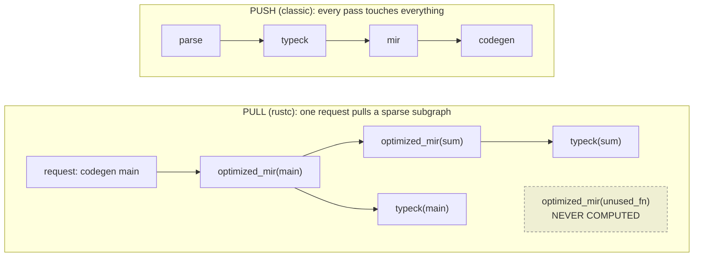
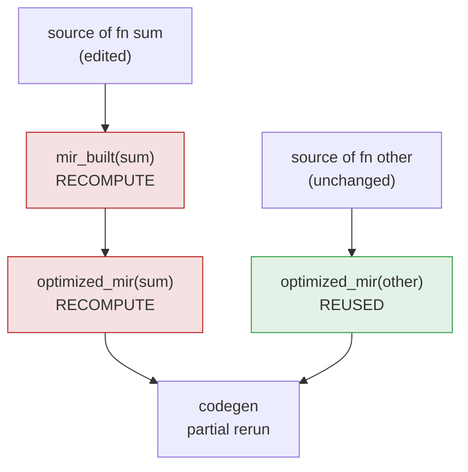
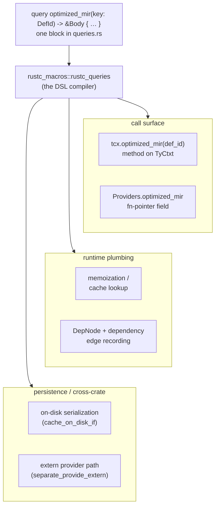
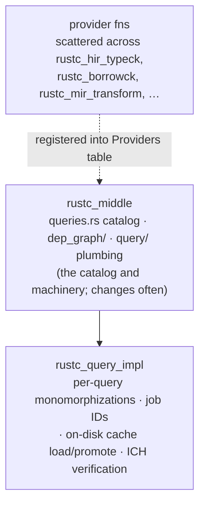
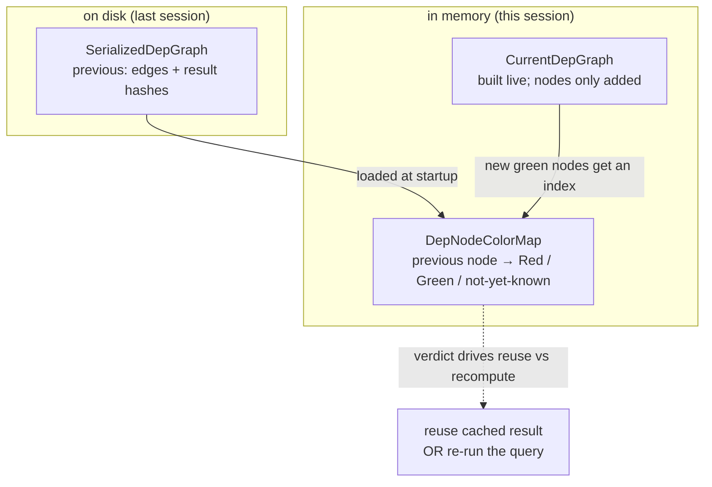
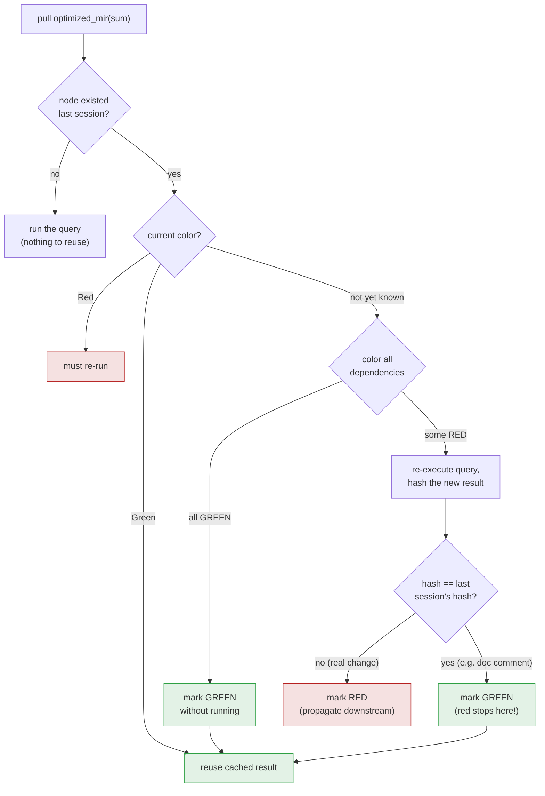
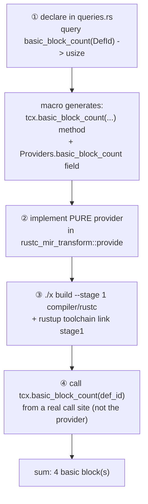
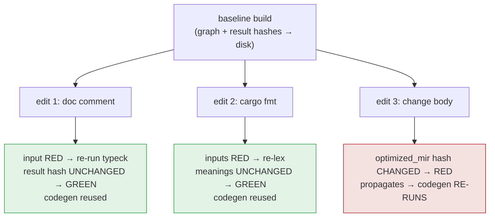

```admonish abstract title="What you'll learn"
- Why `rustc` inverted itself from a push-pipeline of passes into a pull-based engine of memoized [queries](../glossary.md#query), and how the spreadsheet model (cell with a formula, demand-driven recompute) maps onto `tcx.optimized_mir(def_id)`.
- The non-negotiable purity rule on query providers, plus the one sanctioned exception (diagnostics are stored alongside the cached result and replayed).
- The `rustc_queries!` DSL in `compiler/rustc_middle/src/queries.rs`, the macro fan-out, and the [`Providers`](../glossary.md#providers) struct of `fn`-pointers (not a trait) that supplies each query's implementation.
- Why the catalog lives in `rustc_middle` while the per-query [monomorphizations](../glossary.md#monomorphization) live in `rustc_query_impl`, and why `rustc` does not use Salsa even though Salsa is its descendant.
- The [red/green algorithm](../glossary.md#red-green-algorithm): how `DepGraphData` keeps a `previous` graph, a `current` graph, and a `DepNodeColorMap`, and how `try_mark_green` proves a node green either cheaply (all-dependencies-green) or cleverly (re-execute and compare result hashes, so a doc comment does not rebuild the world).
- How to add a brand-new query (`basic_block_count`) to a `rust-lang/rust` checkout, install its provider via `providers.queries`, and watch it go green and red across rebuilds with `RUSTC_LOG=rustc_middle::dep_graph=debug`.
```

## 3.1 Why the Pipeline Runs Backward

### The compiler that rewrote its own control flow

`rustc` did not start life demand-driven. In its early years it was a thoroughly conventional compiler in the Dragon Book mold: a sequence of passes, each sweeping over the entire crate, each handing its output to the next. Parse everything. Resolve everything. Type-check everything. Then lower everything, optimize everything, codegen everything. It worked, and for a batch compiler that runs once and exits, the design is perfectly sound: it is the design Appel and Cooper & Torczon teach.

Then the Rust team ran headlong into a wall that every growing language hits: **incremental compilation**. A developer changes one line and rebuilds. With a pass-based architecture, what can you safely skip? The honest answer, for a long time, was "almost nothing," because a pass-based compiler has no principled record of *what depended on what.* Type checking swept the whole crate; if you wanted to avoid re-type-checking the 99% that didn't change, you needed to know precisely which results were still valid, and a pipeline of passes simply does not carry that information. Early incremental attempts were bolted onto the side and were, by the team's own later assessment, fragile.

So between roughly 2016 and 2018, driven by the incremental-compilation effort (Niko Matsakis's [RFC 1298](https://github.com/rust-lang/rfcs/blob/master/text/1298-incremental-compilation.md) and the "on-demand" design work that followed), `rustc` inverted its control flow. It stopped being a program that pushes the crate forward through passes and became a program that *pulls* answers backward through a graph of memoized functions. We watched it operate in Chapter 2; now we understand it.

```admonish tip title="Pro-Tip"
When you read old blog posts, RFCs, or comments that talk about `rustc`'s "passes," mentally translate to "queries." Much of the compiler's vocabulary predates the inversion, and you will see both words used. A "pass" today usually means a *query* (demand-driven, memoized) or, in the [MIR](../glossary.md#mir) optimizer, an actual sequential transform that a query happens to invoke. The conceptual center of gravity is queries.
```

### The spreadsheet in your compiler

The cleanest mental model for what `rustc` became is a tool you already understand intimately: a **spreadsheet**.

A spreadsheet does not recompute top-to-bottom. Cell `C1` holds the formula `=A1+B1`. When you open the sheet, `C1` is not computed because some scheduler decided to run "the addition pass over all cells." It is computed because *something asked for its value*, the screen needs to display it. To produce `C1`, the spreadsheet engine pulls `A1` and `B1`; if those are themselves formulas, it pulls *their* inputs, and so on, until it bottoms out at raw entered values. The computation is **demand-driven**: nothing runs until its result is needed, and the act of computing `C1` *records* that `C1` depends on `A1` and `B1`.

Now change `A1`. The spreadsheet does not recompute the whole sheet. It knows, from the dependency edges it recorded, that only `C1` (and whatever depends on `C1`) could possibly be affected. Everything else keeps its cached value. Incremental recomputation falls out of two properties: results are **memoized** (cached and reused), and dependencies are **tracked** (recorded as a side effect of computing).

`rustc` is this spreadsheet, scaled to a compiler. Each **query** is a cell with a formula. `optimized_mir(sum)` is a cell whose formula pulls `mir_borrowck(sum)`, which pulls `mir_built(sum)`, which pulls `typeck(sum)`, which pulls `type_of(sum)`, exactly the §2.3 chain, exactly the way `C1` pulls `A1`. Ask for codegen and you ask for the topmost cells; the pull cascades down to the raw inputs (the source text). Change one function and rebuild, and `rustc`, like the spreadsheet reacting to an edited `A1`, recomputes only the queries that transitively depended on what changed. That is how fixing a typo in one function avoids re-type-checking the other 49,950 lines that §2.2 worried about.

This reframes Chapter 2's "the pipeline runs backward". The pipeline runs backward because demand-driven evaluation is the architecture in which laziness, incrementality, and parallelism emerge as consequences rather than added features.

### A query is a pure function

To make the spreadsheet model sound, one property is non-negotiable, and it is the conceptual heart of the entire system: **a query must be a pure function of its key.**

Formally, a query is a function `fn(TyCtxt<'tcx>, Key) -> Value`. Given the same key (and the same compilation universe [`tcx`](../glossary.md#tyctxt-tcx)), it must *always* return the same value, and it must produce that value *only* by reading its inputs (other queries and the immutable source) never by mutating shared state, performing I/O, or depending on the order in which queries happen to run. The signature you verified in §2.3 is exactly this shape:

```rust
// the query we verified verbatim against the repo, as a pure function:
query optimized_mir(key: DefId) -> &'tcx mir::Body<'tcx> { /* … */ }
//    └─ function ──┘ └─ key ─┘     └──── value ────┘
```

Why purity matters: memoization is *only correct for pure functions.* If `optimized_mir(sum)` could return different answers on different calls, if it depended on a mutable global, or on whether `typeck` ran first, then caching its result and reusing it later would be a bug. The spreadsheet trick works precisely because `=A1+B1` always means the same thing given the same `A1` and `B1`. Purity is what lets `rustc` cache a query's result, hand it out a thousand times, persist it to disk between sessions, and trust it, the foundation everything else stands on.

```admonish warning title="Warning, purity is a discipline the compiler enforces socially, not mechanically"
Nothing in Rust's type system *forces* a query provider to be pure; `TyCtxt` is `Copy` and reachable everywhere, and a careless provider *could* stash state in a `RefCell` and corrupt the cache. The rule 'queries are pure' is upheld by code review, convention, and hard-won scar tissue. When you write or modify a query provider (the §3.4 lab), the cardinal sin is hiding a side effect inside it. If your query's result depends on anything other than its key and the queries it explicitly calls, you have planted a time bomb in the incremental cache that may not detonate until someone, months later, gets a miscompilation on a rebuild.
```

There is exactly one *sanctioned* side effect, and it is handled with great care: **diagnostics**. A query like `mir_borrowck` does not just return a verdict; it may emit errors. If those errors were truly side effects, a cached-and-reused [borrow-check](../glossary.md#borrow-checker) result would *silently swallow the error* on the next build. So `rustc` treats diagnostics specially: it stores the diagnostics a query produced *alongside* its cached result and **replays** them when the result is reused. The error you see on an incremental rebuild may have been computed days ago and replayed from cache. We will return to this; for now, treat diagnostics as the one sanctioned exception to the purity rule.

### Why bother? Three consequences

Demand-driven evaluation has three concrete consequences for the compiler.

**Laziness: never compute what you don't need.** In a push pipeline, every pass processes every item, whether or not it matters. In a pull system, a query runs only when something asks for it. A generic function that is never instantiated never gets `optimized_mir` called on it. Recall from §1.3 that the monomorphization collector only pulls the instances actually reachable. A `#[cfg]`-ed-out module's bodies are never type-checked because nothing ever asks. The compiler does the minimum work the *final request* transitively requires, and not one query more.

**Incrementality: recompute only what changed.** This is the consequence that motivated the inversion, and it is the spreadsheet's edited-`A1` behavior. Because every query memoizes its result and records its dependencies, a rebuild can compare what changed against the recorded [dependency graph](../glossary.md#depgraph) and reuse every result whose inputs are untouched. The mechanism that does this comparison, the **red/green algorithm**, is the subject of §3.3. Incrementality is not a feature added to the query system; it is an *emergent consequence* of memoization plus dependency tracking.

**Parallelism: independent queries run concurrently.** If `typeck(foo)` and `typeck(bar)` share no dependencies, nothing stops them running on two threads at once. The dependency graph that enables incrementality *also* encodes which queries are independent, and a pull-based, memoized system has a natural synchronization story: if two threads pull the same query at once, one computes it and the other waits on the result. This is the foundation of the parallel front-end (`-Z threads=N`, [VERIFY status against current rustc]), which we treat in a later chapter on parallelism [VERIFY chapter number against final TOC].

The push-versus-pull contrast, and the sparseness that laziness buys:




The dashed node is the point: in the pull model, work the final request does not need is *never done*, where the push model would have ground through it anyway. The diagram compresses the transitive chain (`optimized_mir → mir_borrowck → mir_built → typeck`) into a direct edge for the push-versus-pull contrast.

### Memoization and dependency tracking, together

The two properties are worth seeing as one mechanism, because they are implemented as one. Conceptually, every query invocation does this:

```rust
// conceptual sketch of what `tcx.some_query(key)` does under the hood
fn invoke_query(tcx, key) -> Value {
    if let Some(cached) = tcx.cache.get(key) {
        // 1. MEMOIZATION: already computed, return the cached value,
        //    and replay any diagnostics it produced.
        record_dependency_edge(current_query, key);  // even a hit is a dep!
        return cached;
    }
    // 2. Begin recording: anything this provider pulls becomes our dependency.
    let (value, deps) = with_dependency_recording(|| {
        provider_for(key)(tcx, key)   // run the actual computation
    });
    tcx.cache.insert(key, value, deps);
    record_dependency_edge(current_query, key);
    value
}
```

Read it slowly, because this sketch *is* the query system in miniature. On a cache hit (line 1) we skip the work, memoization, but we still record that the *current* query depended on this one, because that edge matters for the next incremental build. On a miss, we wrap the provider call in dependency recording (`with_dependency_recording`): every query the provider pulls while running gets noted, so when it finishes we know its exact dependency set. We cache the value *with its dependencies* and return. The edge-recording and the value-caching are the same act, which is why incrementality comes free with laziness: you cannot compute a value without, in the same breath, recording what it depended on.

This is also the deep reason, foreshadowed in §2.2, that [HIR](../glossary.md#hir) is reached *through ids and queries* rather than raw pointers. If you held a `&Body` directly, the `with_dependency_recording` machinery would never see that you read it, and the dependency edge would be invisible, poisoning the next incremental build. By forcing every access to go through `tcx.some_query(id)`, the system guarantees that *reading is recording.* The indirection that looked like bureaucracy in §2.2 is the load-bearing wall of incremental correctness.

And it is what makes the next build fast. When you change one function, the system walks this recorded graph and asks, of each query, "are your inputs still the same?" Those whose inputs are untouched are reused; only the genuinely affected subgraph reruns:




Edit `sum`, and `mir_built(sum)` and `optimized_mir(sum)` rerun (red); `optimized_mir(other)`, whose inputs are unchanged, is reused wholesale (green). The compiler reconstructs the final crate having recomputed a sliver.

### Where this leaves us

The conceptual frame is now set. `rustc` is a demand-driven engine: a query is a *pure function* of a key; results are *memoized*; dependencies are *recorded as a side effect of reading*; and from those two properties, laziness, incrementality, and parallelism emerge rather than being engineered in. The pipeline "runs backward" because that is the only direction in which these payoffs are free. The one sanctioned impurity, diagnostics, is handled by storing and replaying them with the cached result.

What we have *not* yet seen is the actual machinery: where queries are declared (the `rustc_queries!` macro), how `TyCtxt` serves as the database, how the two crates `rustc_middle` and `rustc_query_impl` divide the labor, and the question every Rust programmer asks at this point, which we will answer head-on: *"isn't this just Salsa?"* (It is not, and the relationship is widely misunderstood; §3.2 sets the record straight with sources.) §3.2 opens the architecture. We have the why; next we build the how.

## 3.2 The Architecture: `rustc_queries!`, `TyCtxt` as Database, and the Salsa Question

### One line, a thousand lines

Here is a single query declaration, copied verbatim from the `rustc_queries!` catalog block in `compiler/rustc_middle/src/queries.rs`:

```rust
query optimized_mir(key: DefId) -> &'tcx mir::Body<'tcx> {
    desc { "optimizing MIR for `{}`", tcx.def_path_str(key) }
    cache_on_disk_if { key.is_local() }
    separate_provide_extern
}
```

Five lines of what looks like a small domain-specific language. From those five lines, the compiler's macro machinery generates: a method `tcx.optimized_mir(def_id)` on `TyCtxt` (and on `TyCtxtAt`); a field in a giant function-table struct where the actual implementation gets plugged in; the caching logic that memoizes the result; the dependency-graph integration that records who asked for it; on-disk serialization so the result survives to the next incremental build; and the cross-crate plumbing that the `separate_provide_extern` modifier requests. One declaration; an enormous amount of correct, uniform boilerplate.

Multiply that by the hundreds of queries in the catalog [VERIFY exact count against current rustc] and the problem is plain. You cannot hand-write that much caching, dependency-tracking, and serialization code at that scale without it rotting into inconsistency. So `rustc` does what compiler engineers do: it builds a *language* for declaring queries and a *macro* that compiles that language into the plumbing. The architecture is three things: the macro DSL, the database it plugs into (`TyCtxt`), and the crate split that keeps it all compilable. With those in hand we can answer the question every Rust programmer asks here: *isn't this just Salsa?*

### The `rustc_queries!` macro and the `Providers` table

The catalog is one giant invocation, `rustc_queries! { … }`, living in `compiler/rustc_middle/src/queries.rs`. Every query in the compiler is a `query` block inside it. The macro that consumes this DSL is `rustc_macros::rustc_queries`, defined in `compiler/rustc_macros/src/query.rs`, and the module's own documentation describes what each block expands into: a method on `TyCtxt` (and `TyCtxtAt`) to invoke the query, the provider machinery to supply its value, caching and dependency-graph integration, and incremental/disk-caching/[arena](../glossary.md#arena) support governed by the modifiers.

The output that matters most is the `Providers` struct. It is not a trait. This surprises people, and the source documentation calls it out explicitly. It is a plain struct the macro generates, holding one function pointer per query:

```rust
// Conceptually, the macro generates a struct shaped like this
// (one field per query; hundreds of fields in reality [VERIFY exact count]):
pub struct Providers {
    pub type_of: fn(TyCtxt<'_>, DefId) -> EarlyBinder<'_, Ty<'_>>,
    pub typeck: fn(TyCtxt<'_>, LocalDefId) -> &TypeckResults<'_>,
    pub optimized_mir:  fn(TyCtxt<'_>, DefId) -> &Body<'_>,
    // … and so on, for every query in the catalog …
}
```

This is the seam between the *declaration* of a query (in `queries.rs`) and its *implementation* (somewhere out in `rustc_mir_transform`, `rustc_hir_typeck`, `rustc_borrowck`, etc.). The query system does not know or care where `optimized_mir` is actually computed; it just calls through the function pointer in the `Providers` table. Each crate that *implements* queries exposes a `provide(providers: &mut Providers)` function that fills in its fields, and at startup the compiler assembles them all into one table (`rustc_interface::passes::DEFAULT_QUERY_PROVIDERS`), which becomes the dispatch table for the whole compilation. (One source-organization wrinkle: the `Providers` value that `provide` actually receives is a small outer wrapper that bundles the macro-generated inner struct of fn pointers shown above with separate slots for extern-crate providers and hooks, which is why the §3.4 lab installs its provider via `providers.queries.basic_block_count = …`, reaching into the inner struct.)

```admonish tip title="Pro-Tip, how to find where a query is actually implemented"
Because the declaration (`queries.rs`) and the implementation (some `provide` function) are decoupled through the `Providers` table, "go to definition" on `tcx.optimized_mir` lands you on macro-generated code, not the real logic. The reliable move: grep for `fn optimized_mir(` to find the implementation function (in `rustc_mir_transform/src/lib.rs`), or look for `optimized_mir` inside a `providers.queries = query::Providers { ... }` struct-init block to find where it gets installed. This one trick saves hours of confusion when you start navigating query implementations.
```

```admonish warning title="Warning, Providers is a struct, not a trait"
Newcomers (especially those who *have* used Salsa, which uses traits for query groups) assume the provider mechanism is trait-based dynamic dispatch. It is not. It is a struct of bare `fn` pointers, chosen deliberately for direct, monomorphic dispatch: no vtable, no `dyn`. Hold this fact; it is the crux of the Salsa comparison at the end of this section, and it is the reason `rustc` can call queries in its hottest loops without dispatch overhead.
```

Here is the macro's fan-out, one declaration becoming many artifacts:




The modifiers from §2.3 are the knobs that turn parts of this fan-out on and off: `cache_on_disk_if` enables node `E`, `separate_provide_extern` enables node `F`, `arena_cache` changes how the value is stored, `eval_always` disables the dependency-based skip, `feedable` lets another query supply the result, and so on. The dev-guide and the `QueryModifiers` struct in `rustc_macros/src/query.rs` carry the authoritative list; the lesson here is that *each modifier is a switch on the generated plumbing.*

### `TyCtxt` is the database

If a query is a function and `Providers` is the dispatch table, *what holds the cache, the dependency graph, and the arenas the results live in?* The answer is the object we have leaned on since Chapter 1: `TyCtxt<'tcx>`, the typing context. It is best understood with one word, the same word the Salsa documentation and the dev-guide both use: `TyCtxt` is the **database**.

Structurally, `TyCtxt<'tcx>` is a `Copy` wrapper around a single reference, `&'tcx GlobalCtxt<'tcx>`. That is why you can pass `tcx` around freely by value: it is one pointer wide. The `GlobalCtxt` it points to is the actual universe, and its fields are a roll-call of everything this chapter and the next concern:

```rust
// compiler/rustc_middle/src/ty/context.rs  (selected fields; the real struct is larger)
pub struct GlobalCtxt<'tcx> {
    // where query results are allocated (Ch. 4)
    pub arena: &'tcx WorkerLocal<Arena<'tcx>>,
    interners: CtxtInterners<'tcx>, // the type-interning tables (Ch. 4)
    pub sess: &'tcx Session,  // global config, the error emitter
    pub dep_graph: DepGraph,   // the recorded dependency graph (§3.3)
    pub query_system: QuerySystem<'tcx>,  // the caches + the Providers table
    pub types: CommonTypes<'tcx>,  // pre-interned i32/bool/unit/…
    // … selection/evaluation caches, data_layout, jobserver, current_gcx, … …
}
```

Every property of the spreadsheet model from §3.1 has a home here. The caches (memoization) and the `Providers` table live in `query_system`. The `dep_graph` (dependency tracking) is its own field. The arenas and [interners](../glossary.md#interner) where results are stored are here too, which is why Chapter 4, on arenas, is the natural sequel: a query produces a [`Ty<'tcx>`](../glossary.md#tytcx) or a `&'tcx Body<'tcx>`, and *this* is where that [`'tcx`](../glossary.md#tcx-lifetime) memory comes from. `TyCtxt` is the single object that ties the query system, the dependency graph, and the storage together. When code says `tcx.optimized_mir(def_id)`, it is asking *the database* for a value, and the database checks its cache, dispatches through `Providers` on a miss, records the dependency edge, and hands back an arena-allocated result.

### The two-crate split: why the catalog and the instantiation are separate

A subtle but important architectural decision: the query system is spread across **two** crates with a deliberate division of labor. Knowing the split is what lets you navigate the system instead of drowning in it.

1. `rustc_middle`, the *catalog and machinery*. The `rustc_queries! { … }` invocation that *declares* every query lives in `queries.rs`; the dep-graph machinery (`DepGraph`, [`DepNode`](../glossary.md#depnode), the red/green algorithm of §3.3) lives under `dep_graph/`; and the cache/plumbing/keys infrastructure (modifier definitions, value-erasure helpers, on-disk cache types) lives under `query/`. This is the bulk of the system, and it changes often as queries are added or modified.
2. `rustc_query_impl`, the *instantiation*. It contains the per-query monomorphized code the macro generates: job IDs in `next_job_id`/`start_query`, on-disk cache load and promote in `try_load_from_disk`/`loadable_from_disk`, ICH verification in `query_key_hash_verify`. The macro-generated per-query code stays in its own crate, with thin wrappers that hook into `TyCtxt`'s `query_system` field directly.

Why split the per-query monomorphized code (`rustc_query_impl`) out of `rustc_middle`? The reason is engineering pragmatism: **compile time.** The macro fan-out, one declaration becoming hundreds of monomorphized instantiations, is heavy code, and keeping it in its own crate means a change to the macro logic or to the per-query plumbing does not force every consumer of `rustc_middle` to recompile. This is the same separation-of-concerns logic the Dragon Book applies to phases, applied here to *crates* for the benefit of the people who build the compiler.




The split keeps macro-generated per-query code out of `rustc_middle` so that, when you work on queries, the central `rustc_middle` crate does not have to absorb every monomorphization change as well.

### The Salsa question, answered with sources

Now the question. If you have done any reading around the Rust ecosystem, you have met **Salsa**, a general-purpose framework for incremental, demand-driven computation, and noticed it sounds *exactly* like what this chapter describes. The natural conclusion, which appears in countless blog comments and was even embedded in this book's own commissioning brief, is "rustc uses Salsa." **It does not, and the truth is the reverse of what most people assume.**

The authoritative source is the rustc-dev-guide's own Salsa chapter, which states plainly (as of its November 2022 date-check) that although Salsa is *inspired by* rustc's query system, it is *not used directly in rustc*; it is used in **chalk** (a trait-system implementation) and **extensively in rust-analyzer** (the official LSP server), but there are no medium- or long-term plans to integrate it into the compiler. Salsa's own README credits the rustc query-system authors (Eduard-Mihai Burtescu, Matthew Hammer, Yehuda Katz, and Michael Woerister) as inspiration. The lineage runs **rustc → Salsa**, not the other way around: Salsa is, in effect, *the rustc query system generalized into a reusable library* so that other tools (notably the IDE engine) could have demand-driven incrementality without reimplementing it.

So why didn't `rustc` then *adopt* its own grandchild? Four concrete, technical reasons, and each one is a property we have already met in this book:


| Concern            | rustc's hand-rolled system                                                                              | Salsa                                                                            |
| ------------------ | ------------------------------------------------------------------------------------------------------- | -------------------------------------------------------------------------------- |
| Return values      | Arena-allocated `&'tcx T` (pointer-cheap, `Copy`); the `'tcx` lifetime is the proof of validity (Ch. 4) | Owned / `Arc`'d values; no compilation-long arena lifetime                       |
| Dispatch           | `Providers` *struct of `fn` pointers*, direct, monomorphic, no vtable                                   | Query groups are *traits*, implies `dyn` dispatch or large monomorphization cost |
| Dep-graph lifetime | Streamed **to disk** between sessions; not kept in memory after                                         | Kept **in memory**, an IDE needs it on every keystroke                           |
| IDE features       | None (batch compiler)                                                                                   | Durability levels, cancellation, snapshots, central to interactive use           |


Read the table against the chapter. The arena/`'tcx` row is why Chapter 4 exists: `rustc`'s queries return interned pointers, and Salsa has no equivalent of a compilation-long arena. The dispatch row is the `Providers`-is-a-struct-not-a-trait fact from earlier in this section, now revealed as a deliberate divergence from Salsa's trait-based groups, made for hot-path performance. The dep-graph row reflects a genuine difference in *use case*: a batch compiler streams its dependency graph to disk and forgets it until the next run, whereas an IDE must keep it live to respond to every keystroke, which is precisely why rust-analyzer, not rustc, is Salsa's natural home.

```admonish tip title="Pro-Tip, the one-sentence version"
*Salsa was generalized out of rustc's query system and is used by rust-analyzer and chalk; rustc keeps its own hand-rolled engine because arena lifetimes, fn-pointer dispatch, and disk-streamed dependency graphs serve a batch compiler better than Salsa's owned-value, trait-based, in-memory model serves it.* That sentence captures the relationship; the rest of this section unpacks each clause.
```

### Where this leaves us

We now have the architecture. A query is declared in a DSL (`rustc_queries!` in `queries.rs`), compiled by a macro into a `TyCtxt` method plus a slot in the `Providers` function-pointer table; the real implementation is installed by a `provide` function from whichever crate owns it, all assembled into `DEFAULT_QUERY_PROVIDERS`. The database that holds the caches, the dependency graph, the arenas, and the `Providers` table is `GlobalCtxt`, reached through the `Copy`, one-pointer-wide `TyCtxt<'tcx>`. The whole system is split across two crates: `rustc_middle` (catalog plus dep-graph and cache plumbing) and `rustc_query_impl` (per-query monomorphizations and on-disk cache load/promote), so the macro-generated monomorphizations need not be absorbed by every consumer of `rustc_middle`. And `rustc` does not use Salsa: Salsa is the descendant, used by rust-analyzer and chalk, and the divergences are deliberate.

One central mechanism remains a black box. We have said "the dependency graph records edges," "the red/green algorithm decides what to reuse," and "queries are memoized across sessions", but we have not opened the dep-graph code to see *how* a node is colored green and reused, or red and recomputed. §3.3 does exactly that: it walks the real `DepGraph`, `DepNode`, and `try_mark_green` machinery from `compiler/rustc_middle/src/dep_graph/`, turning the spreadsheet's "only recompute what changed" from a promise into an algorithm you can trace.

## 3.3 The Red/Green Algorithm: How `rustc` Decides What to Reuse

### The doc comment that didn't rebuild the world

Try this on any reasonably large Rust project. Do a full build, then add a single doc comment, `/// hello`, above one function and rebuild. The rebuild is nearly instant. Now change the *body* of that same function and rebuild: noticeably more work. Now reformat a file with `rustfmt` so that whitespace changes everywhere but no actual code does, and rebuild: again, nearly instant.

Something is clearly distinguishing "the bytes of the file changed" from "the *meaning* changed." A naive incremental compiler keyed on file timestamps or byte hashes would rebuild after the doc comment and after the reformat, because the file *did* change. `rustc` does not. The mechanism that lets it tell a cosmetic change from a consequential one is the **red/green algorithm**, the beating heart of incremental compilation. §3.1 promised that "recompute only what changed" was an emergent consequence of memoization plus dependency tracking, and §3.2 showed where the dependency graph lives. Now we open `rustc_middle::dep_graph`'s code and watch the algorithm decide, query by query, what to reuse.

```admonish tip title="Pro-Tip"
You can watch this happen. Build with `CARGO_INCREMENTAL=1` (the default for dev builds) and pass `-Z self-profile` or set `RUSTC_LOG=rustc_middle::dep_graph=debug` on a nightly to see dep-nodes being marked green and red in real time. Pairing that log with the algorithm below, actually watching `try_mark_green` fire on your own edit, is the fastest way to make this section concrete rather than abstract.
```

### Two graphs and a map of colors

The algorithm operates on three data structures, and you cannot follow it without holding all three. They are bundled inside `DepGraphData`, the inner state of the `DepGraph` field on `GlobalCtxt` from §3.2:

```rust
// compiler/rustc_middle/src/dep_graph/graph.rs  (faithful)
pub struct DepGraphData {
    current:  CurrentDepGraph, // the graph being BUILT this session
    // the graph LOADED from last session's on-disk cache
    previous: Arc<SerializedDepGraph>,
    // each previous node's color: green, red, or not-yet-known
    colors:   DepNodeColorMap,
    previous_work_products: WorkProductMap,
    // … plus a couple of debug-only bookkeeping fields (loaded-from-disk set,
    // dep-node debug names) omitted here.
}
```

The shape is the whole idea in miniature. `previous` is **last session's dependency graph**, deserialized from the incremental cache on disk, a frozen, read-only record of *what depended on what* and *what each result hashed to* the last time the compiler ran. `current` is **this session's graph**, being populated live as queries run; per its own documentation, nodes are only ever *added* to it, never removed. And `colors` is the bridge: for each node that existed in the `previous` graph, a color recording the verdict we have reached about it this time around.

The color type (tri-valued, with the third variant standing for the starting state every previous node holds until the algorithm reaches a verdict):

```rust
// compiler/rustc_middle/src/dep_graph/graph.rs  (faithful)
pub(super) enum DepNodeColor {
    Green(DepNodeIndex),  // unchanged; reuse the old result (and here's its new index)
    Red, // an input changed; this node's old result is invalid
    Unknown, // starting state; the algorithm has not yet reached a verdict
}
```

Three states, then: **green** means "this node's previous result is still valid: reuse it," and it carries the `DepNodeIndex` of the node in the *current* graph so callers can find the reused result; **red** means "something this node depended on changed, so its previous result is invalid: it must be recomputed"; and the third, **not-yet-determined**, is the starting state for every previous node before the algorithm has reached a verdict about it. The entire job of the red/green algorithm is to walk the previous graph and turn every not-yet-determined node into either red or green.

### What a node *is*

Before the algorithm, the node. A `DepNode` identifies one query invocation, one cell in the spreadsheet, and it is conceptually a pair:

```rust
// compiler/rustc_middle/src/dep_graph/dep_node.rs  (faithful)
pub struct DepNode {
    pub kind: DepKind, // WHICH query: type_of, typeck, optimized_mir, …
    pub key_fingerprint: PackedFingerprint,  // 128-bit fingerprint of the KEY
}
```

The `kind` says which query (one variant per query in the catalog), and the `key_fingerprint` is a 128-bit [fingerprint](../glossary.md#fingerprint) of the *key*, packed into a 16-byte representation, and here the §2.2 vocabulary returns with force. For the common case, a query keyed on a [`DefId`](../glossary.md#defid), the key fingerprint *is* the corresponding [`DefPathHash`](../glossary.md#defpathhash), the stable, position-independent permalink from §2.2. (Other node kinds use a [`HirId`](../glossary.md#hirid)-derived hash, opaque hashes, or, for parameterless queries, `Fingerprint::ZERO`; the four cases are enumerated in the `KeyFingerprintStyle` enum, `DefPathHash`, `HirId`, `Unit`, `Opaque`, with anonymous queries flagged separately via `DepKindVTable.is_anon`.) For the `DefPathHash` case in particular, this is why `DepNode`s survive across sessions: a `DefId`'s session-local integer would be meaningless to last session's serialized graph, but its `DefPathHash` means the same thing in both sessions. The §2.2 stable-identity machinery is *what makes the previous graph comparable to the current one.* Without it, there would be no way to ask "is `optimized_mir(sum)` the same node it was last time?" And incremental compilation would collapse. Two distinct keys must not collide to the same `DepNode`; `rustc` relies on the fingerprint's 128 bits making accidental collision negligible, and asserts against it in debug builds.




### `try_mark_green`: the algorithm, line by line

When the driver pulls a query, say `optimized_mir(sum)`, the system first asks: *can I avoid running this by proving it green?* That question is `try_mark_green`. The implementation lives in `rustc_middle` and takes `TyCtxt<'tcx>` directly:

```rust
// compiler/rustc_middle/src/dep_graph/graph.rs  (faithful; impl on DepGraphData.
// DepGraph::try_mark_green is a one-liner that delegates to this via self.data()?.)
pub fn try_mark_green<'tcx>(
    &self,
    tcx: TyCtxt<'tcx>,
    dep_node: &DepNode,
) -> Option<(SerializedDepNodeIndex, DepNodeIndex)> {
    // eval_always queries never take this path. They always re-run.
    debug_assert!(!tcx.is_eval_always(dep_node.kind));

    // Step 1: did this node even exist last session? If not, we can't reuse anything.
    let prev_index = self.previous.node_to_index_opt(dep_node)?; // None → must run

    // Step 2: have we already reached a verdict on it?
    match self.colors.get(prev_index) {
        DepNodeColor::Green(idx) => Some((prev_index, idx)), // already green → reuse
        DepNodeColor::Red => None, // already red → must run
        DepNodeColor::Unknown => {
            // The interesting case: recurse into dependencies. (continues below)
            self.try_mark_previous_green(tcx, prev_index, None)
                .map(|idx| (prev_index, idx))
        }
    }
}
```

Walk the three outcomes. If the node did not exist last session (`node_to_index_opt` returns `None`), there is nothing to reuse, the query must run, and `try_mark_green` returns `None`. If we already decided it was green, we return the indices so the caller can grab the cached result without running anything. If we already decided red, we return `None`: it must run. The whole drama is in the *not-yet-determined* case, which recurses into the node's dependencies. That recursion is the algorithm's core, and in prose it runs like this:

> To determine whether `optimized_mir(sum)` is green, look at every node it *depended on last session* (its recorded reads). Try to color each of those dependencies. If a dependency is itself not-yet-determined, recursively `try_mark_green` it. If **every** dependency comes out green, then nothing `optimized_mir(sum)` relied on has changed, so we may mark it green and reuse its result **without ever running it or even looking at its value.** If, however, **any** dependency comes out red, we cannot conclude greenness this way, and we fall to the re-execution step below.

That "without ever looking at its value" clause is the performance win. For the vast majority of a crate on a typical rebuild, every dependency is green, so whole subtrees are proven green by pure graph traversal, no query bodies run, no values are even loaded from disk. The compiler reconstructs "this is all still valid" structurally.

### The subtlety that explains the doc comment

But what about the doc comment from this section's opening? Adding `/// hello` *does* change an input, the source text of the function, so the input node that hashes the function's tokens or HIR goes **red**. By the rule above, any query depending on that red input cannot be proven green by traversal alone. So why doesn't the world rebuild?

Because red does not blindly propagate. When `try_mark_green` finds a red dependency, the algorithm does not give up: it falls to a **re-execute-and-compare** step, exactly as the dev-guide describes it. The query *is* re-run, but then its freshly computed result is **hashed and compared to the hash stored from last session.** If the new result hash equals the old one, if the output is *identical despite the changed input*, the node is marked green anyway, and everything downstream of it can still be reused.

This is precisely the doc-comment case. Adding `/// hello` changes the source bytes (red input), so `typeck(sum)` or its upstream HIR-owner query re-runs. But a doc comment does not change the function's *type*, its *MIR*, or its *codegen*, so when `type_of(sum)` is re-evaluated and its result re-hashed, the hash is unchanged. `type_of(sum)` is marked green; `optimized_mir(sum)`, seeing a green dependency, never re-runs; codegen is reused. The red stopped propagating the instant a re-executed query produced an unchanged result. The reformat-with-`rustfmt` case is the same story at scale: every body re-lexes, but nothing's *meaning* changes, so the redness dies one level up and the expensive downstream work (type checking, MIR, codegen) is reused wholesale.




The two green-marking paths in the diagram cover most of what incremental compilation does in practice. The left path (all-dependencies-green, mark green without running) is the cheap traversal path that covers most of a crate. The right path (re-execute, compare hashes, mark green if unchanged) is the re-execute-and-compare path that stops cosmetic edits from cascading. Together they are why the doc comment didn't rebuild the world.

### The §3.2 split in action: per-query plumbing

A detail that pays off §3.2's crate split. The `try_mark_green` we just read lives in `compiler/rustc_middle/src/dep_graph/graph.rs`, alongside the rest of the dep-graph machinery. The same architectural separation pays off one layer down: `rustc_query_impl::plumbing` carries per-query plumbing (job IDs in `next_job_id`/`start_query`, on-disk cache load and promote, ICH verification) that hooks into the catalog declared in `rustc_middle`. The macro-generated per-query code stays in its own crate, separate from the catalog, so the same compile-time isolation logic from §3.2 applies.

```admonish warning title="Warning, eval_always opts out, and inputs are special"
Two categories of node sidestep the algorithm. Queries marked with the `eval_always` modifier (§2.3) re-run unconditionally, the `debug_assert!(!… is_eval_always …)` at the top of `try_mark_green` enforces that they never take the green path. And *inputs* (the leaf nodes representing raw source, command-line options, and the like) are colored red or green **eagerly, before any query runs**, because there are no dependencies to recurse into; their color is determined by directly comparing this session's input to last session's. When you read dep-graph code and see special handling for `is_input()` nodes or `FOREVER_RED_NODE` (a sentinel index for nodes that must always be considered red), this is why: the recursion has to bottom out somewhere, and inputs are the bottom.
```

### Where this leaves us

The red/green algorithm is now demystified. The compiler keeps two graphs, `previous` (deserialized from last session's on-disk cache) and `current` (built live), plus a `DepNodeColorMap` recording a verdict (red, green, or not-yet-known) for each previous node. `DepNode`s are comparable across sessions because they are keyed on the §2.2 `DefPathHash`, the stable permalink. `try_mark_green` proves a node green either *cheaply*, when all its dependencies are green (reuse without running), or *cleverly*, by re-executing it and finding its result hash unchanged (the doc-comment case, where red stops propagating).

We have now traced the query system end to end: §3.1 gave the why (demand-driven purity, the spreadsheet), §3.2 the architecture (the macro, `TyCtxt`-as-database, the two-crate split, the Salsa truth), and §3.3 the algorithm that makes incrementality real. Only one thing remains, and it is the most satisfying: doing it yourself. In §3.4 you will add a brand-new query to the compiler (declare it in `queries.rs`, implement its provider, watch the macro generate its `tcx` method) and then instrument the dep graph to *see* your query go green and red across rebuilds. The spreadsheet, in your own hands.

## 3.4 Hands-On Lab: Adding a Query and Watching It Go Green

### Adding a query

Adding a query touches every piece of machinery this chapter described: you write the DSL declaration (§3.2), watch the macro generate a `tcx` method, implement a *pure* provider (§3.1), register it into the `Providers` table (§3.2), and then watch your query participate in the red/green algorithm (§3.3) across rebuilds.

This lab comes in two halves. **Lab A** is the real rite of passage: adding a query to a `rust-lang/rust` checkout. It requires building the compiler from source, which is a genuine commitment, so we walk it carefully and honestly. **Lab B** is the accessible companion, reproducing §3.3's doc-comment experiment with instrumentation to literally *watch nodes go green and red*, and it requires no compiler build at all, so do it even if Lab A's build cost is too steep for your machine today.

```admonish warning title="Warning, building rustc is a real commitment"
A from-source build of `rustc` is multiple gigabytes of disk, wants 8 GB+ of RAM to be comfortable, and the *first* full build can take from twenty minutes to well over an hour depending on your hardware. There is a shortcut (`rust.download-rustc` in the bootstrap config downloads a prebuilt compiler so you only recompile changed crates) but it does **not** help us here, because our query lives in `rustc_middle`, a crate so central that changing it forces a real rebuild of much of the compiler. Budget the time, or start with Lab B. This is not a "quick" lab; it is a foundational one.
```

### Lab A, add a query to rustc

#### Step 0, get and configure the source

```bash
git clone https://github.com/rust-lang/rust
cd rust
./x setup # interactive; choose the "compiler" profile
```

`./x` is the modern entry point to **bootstrap**, the build system (you may also see `./x.py`; they are the same tool). `./x setup` writes a bootstrap configuration file (`bootstrap.toml` in current checkouts, called `config.toml` in older ones) pre-tuned for compiler work. The "compiler" profile enables the right debug assertions and keeps build times sane for iterating on the compiler itself.

```admonish tip title="Pro-Tip, turn on debug assertions and dep-graph checks"
In your `bootstrap.toml`, set `rust.debug-assertions = true` and `rust.incremental = true`. The former turns on the internal sanity checks, including the `DepNode` hash-collision assertions and the `eval_always` guard we saw in §3.3, that catch query mistakes early. The latter lets you exercise the very incremental machinery this chapter is about. Building without debug assertions and then wondering why a query bug silently corrupts the cache is a rite of passage you can skip.
```

#### Step 1, declare the query

Open `compiler/rustc_middle/src/queries.rs`, the catalog from §3.2, the home of the `rustc_queries! { … }` invocation. Add a new `query` block. We will define a query that counts the basic blocks in a function's optimized MIR, deliberately chosen because it *depends on another query* (`optimized_mir`), which is what makes its red/green behavior interesting:

```rust
// inside the rustc_queries! { … } invocation in queries.rs
/// The number of basic blocks in the optimized MIR of `key`.
/// (A teaching query: counts CFG blocks of a function body.)
query basic_block_count(key: DefId) -> usize {
    desc { "counting basic blocks of `{}`", tcx.def_path_str(key) }
}
```

Five lines, and from §3.2 you now know exactly what the macro will do with them: generate a `tcx.basic_block_count(def_id)` method, add a `basic_block_count` field to the `Providers` function-table struct, and wire in caching and dependency-graph integration. We deliberately added *no* modifiers beyond `desc` (no `cache_on_disk_if`, no `arena_cache`) because `usize` is a tiny `Copy` value that needs neither arena allocation nor disk persistence. The `desc` block is mandatory: it is the human-readable description (§2.3) used in cycle errors and profiling output, and note it calls `tcx.def_path_str` (the §2.2 path query) on the key.

#### Step 2, implement the provider (purely!)

The declaration created a *slot* in `Providers`; now we fill it. A MIR-reading query belongs naturally in `rustc_mir_transform`. Open `compiler/rustc_mir_transform/src/lib.rs`, find its `provide` function (every query-implementing crate has one, §3.2), and install the provider:

```rust
// in compiler/rustc_mir_transform/src/lib.rs
use rustc_middle::query::Providers;

fn basic_block_count<'tcx>(tcx: TyCtxt<'tcx>, def_id: DefId) -> usize {
    // Pull the optimized MIR (this records a dependency edge automatically, §3.1)
    // and count its basic blocks. No side effects: a pure function of the key.
    tcx.optimized_mir(def_id).basic_blocks.len()
}

pub fn provide(providers: &mut Providers) {
    // The dominant rustc idiom: struct-init with `..*providers` to preserve every
    // other registration, then replace. This is the shape you'll see in
    // `rustc_mir_transform/src/lib.rs` and most other provider-installing crates.
    *providers = Providers {
        queries: rustc_middle::query::queries::Providers {
            basic_block_count,
            ..providers.queries
        },
        ..*providers
    };
}
```

*Note on the closure's key type:* our key is `DefId` and we do not set `separate_provide_extern`, so the provider takes `DefId` directly. Real queries that *do* set `separate_provide_extern` (such as `optimized_mir`) take [`LocalDefId`](../glossary.md#localdefid) on the local-side provider, because the macro routes only local-crate calls through it; the extern path is filled in by `rustc_metadata::provide_extern`.

This is the moment §3.1's purity rule stops being abstract. Read what the provider does: it calls `tcx.optimized_mir(def_id)` (which, per §3.1's "reading is recording," automatically registers that `basic_block_count(d)` *depends on* `optimized_mir(d)`) and returns a count. It mutates nothing, performs no I/O, consults no global. It is a pure function of its key, and *that* is what makes it safe to memoize and to color green or red.

```admonish warning title="Warning, do not eprintln! inside the provider"
The overwhelming temptation, to check your work, is to add `eprintln!("counted {n} blocks")` inside the closure. **Resist it.** A provider that prints is no longer pure in spirit, and, worse, on an incremental rebuild where the result is reused from cache, the provider *does not run*, so your print would lie by omission about what actually happened. This is exactly the diagnostics problem from §3.1: output belongs at a *call site*, not inside a query. We will print from a legitimate place in Step 4.
```

#### Step 3, build the stage-1 compiler

```bash
./x build --stage 1 compiler/rustc
```

This builds a usable compiler containing your new query. Because you touched `rustc_middle`, expect a substantial rebuild (see the opening warning). When it finishes, register the resulting toolchain with `rustup` so you can invoke it:

```bash
rustup toolchain link stage1 build/host/stage1
```

(The `build/host/...` path varies by platform; `./x build` prints the exact location.)

#### Step 4, call it and confirm

Now exercise the query from a *legitimate* call site, somewhere output is allowed. Reuse the §2.4 custom-driver pattern *built against your stage-1 sysroot*: a `Callbacks::after_analysis` that calls `tcx.basic_block_count(def_id)` for each function and prints the result. The call site, not the provider, does the printing:

```rust
// in a Callbacks::after_analysis, or a temporary debug block at a real call site:
for &local_def_id in tcx.mir_keys(()) {
    let def_id = local_def_id.to_def_id();
    if matches!(tcx.def_kind(def_id), DefKind::Fn) {
        let n = tcx.basic_block_count(def_id); // ← OUR new query
        println!("{}: {n} basic block(s)", tcx.def_path_str(def_id));
    }
}
```

*Note on the filter:* `mir_keys` actually returns body-owners of every MIR-producing kind (methods, closures, ctors, constants); we filter to `DefKind::Fn` only because `optimized_mir` panics on constant-context bodies. Real code in the compiler relies on `tcx.is_mir_available(def_id)` plus the const-context handling inside `optimized_mir` itself.

```admonish example title="What you should see" collapsible=true
Run it against `descent.rs` from Chapter 1 and you should see `sum` reported with its block count, the same number §2.4's probe read directly from `Body::basic_blocks`, now served through a query *you added to the compiler.* You have completed the apprentice's joint.
```

The whole Lab-A workflow, end to end:




#### Step 5, rebuild and watch *your* query go green

The lab title promised "Adding a Query and Watching It Go Green," and so far you have done only the first half. Add `cache_on_disk_if { key.is_local() }` to your query declaration (or leave it off and just watch the in-memory cache); then rebuild your driver without changing `sum`, and re-run with the dep-graph trace turned on:

```bash
RUSTC_LOG=rustc_middle::dep_graph=debug \
    cargo +stage1 run -- src/main.rs 2>&1 | grep basic_block_count
```

```admonish example title="What you should see" collapsible=true
On the second run, you will see `basic_block_count(sum)` reported *green*: its dependencies (`optimized_mir(sum)`, transitively `type_of`, `typeck`, …) all hashed the same, so `try_mark_green` (§3.3) propagated green to your node and the provider closure never ran. Now edit `sum`'s body trivially (add a `let _ = 0;`), rebuild, re-run: your query reports *red* and the closure fires again. That is the §3.3 algorithm operating on the query *you wrote*. Lab B does the same experiment on stock queries; this step lands it on yours.
```

### Lab B, watch a query go green and red (no build required)

Lab A proved you can *add* machinery; Lab B lets you *see* the §3.3 algorithm operate, and it runs on any stable-plus-nightly setup without building the compiler. We reproduce the doc-comment experiment from §3.3 under instrumentation.

Create a tiny crate:

```rust
// src/main.rs
fn sum(slice: &[i32]) -> i32 {
    let mut total = 0;
    for &n in slice { total += n; }
    total
}
fn main() { println!("{}", sum(&[1, 2, 3])); }
```

Build it once with incremental compilation on and the self-profiler attached:

```bash
export CARGO_INCREMENTAL=1
cargo +nightly rustc -- -Zself-profile=. -Zself-profile-events=default
```

That first build is the *baseline*: every query runs and the dependency graph plus result hashes are written to the incremental cache. Now make the three edits from §3.3, rebuilding after each, and compare:

1. **Add a doc comment** above `sum` (`/// adds up a slice`). Rebuild. This changes the source bytes, an input goes **red**, but `sum`'s type, MIR, and codegen are unchanged, so when those queries are re-examined their result hashes match and they are marked **green**. Almost nothing downstream re-runs.
2. **Reformat** with `cargo fmt`. Rebuild. Whitespace changes throughout; inputs go red; meanings do not; the redness dies one level up and everything expensive is reused.
3. **Change the body**, make it `total += n * 2`. Rebuild. *Now* the result hashes genuinely differ: `optimized_mir(sum)` goes **red**, propagates to codegen, and you see real recompilation of the affected subgraph.

To read the verdicts, point the analysis tool at the profile data:

```bash
cargo install --git https://github.com/rust-lang/measureme --branch stable summarize crox
summarize <your-profile>.mm_profdata | head -40
```

The summary attributes time to query kinds; across the three rebuilds you will see the *body change* (edit 3) light up `optimized_mir` and `codegen` while the *doc comment* and *reformat* (edits 1 and 2) leave them cold. For an even more direct view, a nightly `RUSTC_LOG=rustc_middle::dep_graph=debug` build prints `try_mark_green` decisions as they happen. You can literally read lines announcing nodes marked green and the rarer ones forced red.

The experiment, mapped to the §3.3 algorithm:




Edits 1 and 2 are the "red stops here" path from §3.3's flowchart; edit 3 is the "hash changed, propagate red" path. You are watching the exact algorithm of the previous section operate on your own keystrokes.

### Extension exercises

1. **Give your query a disk cache.** Return to Lab A and add `cache_on_disk_if { key.is_local() }` to `basic_block_count`. Rebuild and confirm (via `-Zself-profile`) that on an incremental rebuild where `sum` is unchanged, the count is loaded from disk rather than recomputed. You have just made *your* query incremental.
2. **Induce a query cycle.** First, add the `cycle_fatal` modifier to your query declaration so the cycle is *reported*, not turned into an ICE (without it, the default cycle handler bugs via `bug!` because `usize` has no `Value` recovery impl):

   ```rust
   query basic_block_count(key: DefId) -> usize {
       desc { "counting basic blocks of `{}`", tcx.def_path_str(key) }
       cycle_fatal  // route cycle into report_cycle, not into bug!
   }
   ```

   Then write a (broken) provider that calls `tcx.basic_block_count(def_id)` *from within itself*. Rebuild and observe the cycle diagnostic, and notice that the `desc` string you wrote in Step 1 is exactly what appears in it, naming the cycle. This is why `desc` is mandatory.
3. **Find a real query and read its provider.** Use the §3.2 Pro-Tip, grep for `fn optimized_mir(` in `rustc_mir_transform/src/lib.rs`, and read the actual implementation. Compare its structure to the toy provider you wrote. You will find it does the same thing yours did, only more: pull dependencies, compute, return.
4. **Make your query `feedable` and pre-populate the cache.** Add the `feedable` modifier to your `basic_block_count` declaration in `queries.rs`, then add a hook somewhere that already has the count in hand (for instance, alongside `mir_built`) and *feed* the value into the cache rather than waiting for the provider to compute it. Rebuild and confirm that asking for `basic_block_count(sum)` now does no real work because the cache was filled by the feeder. This is the same mechanism rustc uses for always-known-early facts like `def_kind` and `def_span`, see `rustc_macros::query::QueryModifiers::feedable@59807616e1fa` and the §3.1 "purity rule with one sanctioned exception" framing extended to values *fed* in from an outside source.
5. **Switch to `arena_cache` and return an arena-allocated slice.** Change `basic_block_count` to return something larger than a `usize`, say `&'tcx [Symbol]` listing each block's terminator kind as a symbol, and add the `arena_cache` modifier so the macro wraps your provider's return value into the `'tcx` arena. Rebuild and confirm the call site can now hold the slice with a `'tcx` lifetime that lives as long as the compilation. This is the exact mechanism Ch.4 unpacks, and it is how `rustc_mir_transform::optimized_mir@59807616e1fa` returns `&'tcx Body<'tcx>`: `arena_cache` is the bridge between a provider that *produces* a value and the arena where query results *live*.

### Where Chapter 3 leaves us

Chapter 3 is complete, and with it the conceptual core of Part 0. §3.1 established *why* `rustc` is demand-driven: queries as pure functions, the spreadsheet model, and the three payoffs of laziness, incrementality, and parallelism. §3.2 laid out the *architecture*: the `rustc_queries!` DSL and its macro, `TyCtxt` as the database, the two-crate split, and the truth about Salsa (rustc's descendant, not its dependency). §3.3 dissected the *algorithm*: two graphs, a color map, and `try_mark_green` with its cheap all-green path and its clever re-execute-and-compare path that lets a doc comment leave the world unrebuilt. And in this lab you added a real query to the compiler and watched the red/green machinery operate on your own edits.

One thread has run quietly under all three sections and is now ready to be pulled. Every query returns a value that lives *somewhere*: `optimized_mir` hands back a `&'tcx Body<'tcx>`, `type_of` a `Ty<'tcx>`, and your `basic_block_count` a humble `usize`. The cheap ones live on the stack; but the big interned ones, and the `'tcx` lifetime stamped on them, come from a memory architecture we have referenced in nearly every chapter and never opened: the **arenas** and the **interner** inside `GlobalCtxt`. Why does `rustc` allocate types in arenas instead of with `Box` or `Rc`? Why is `Ty<'tcx>` a pointer you can compare with `==` in one instruction? What *is* that `'tcx` lifetime, really? Chapter 4 answers all three, and in doing so explains the `'tcx` lifetime that appears throughout the compiler.

### The picture so far

Three of Part 0's four corners are in: the pipeline shape (Ch.1), the shell that runs it (Ch.2), the query engine that pulls each phase on demand (Ch.3). You now know how a single edit recomputes only what it affected, and why the compiler can be incremental at all. Chapter 4 adds the last corner: the arena where every query's result lives.

## Test yourself

```admonish question title="Anchor the chapter"
Six quick questions on the key claims of Chapter 3. Answer first, then expand the explanation. Quizzes are not graded; they are a recall checkpoint between chapters.
```

{{#quiz ../../quizzes/ch03.toml}}

---

*End of Chapter 3. Next: Chapter 4, 4.1 Memory That Lives Forever: Why `rustc` Uses Arenas.*