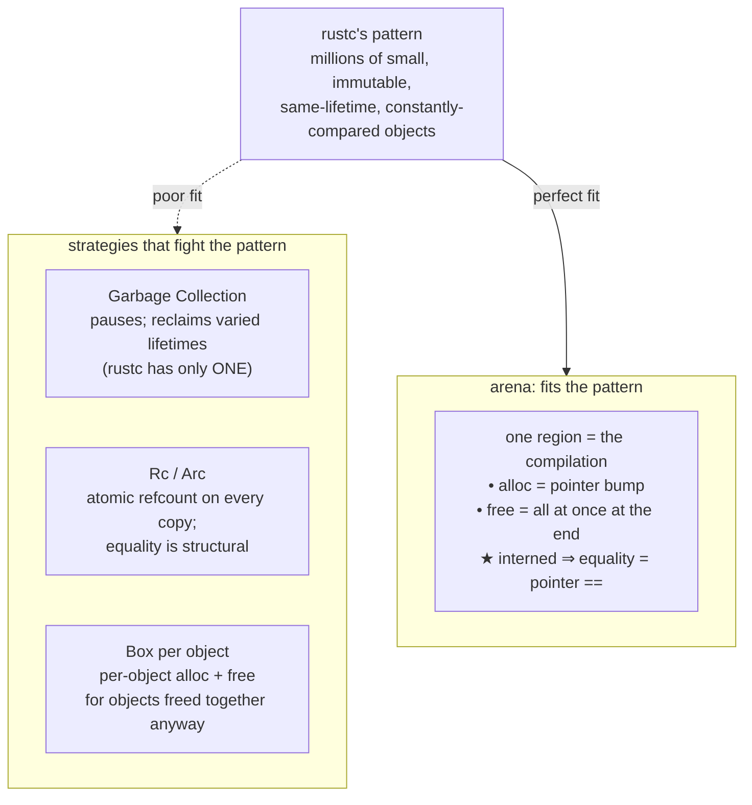
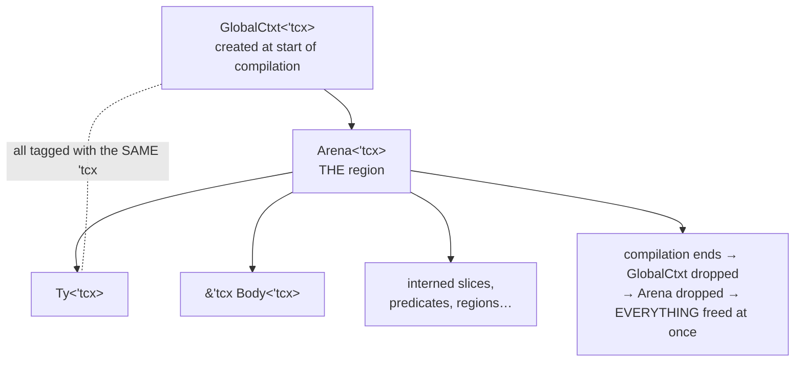
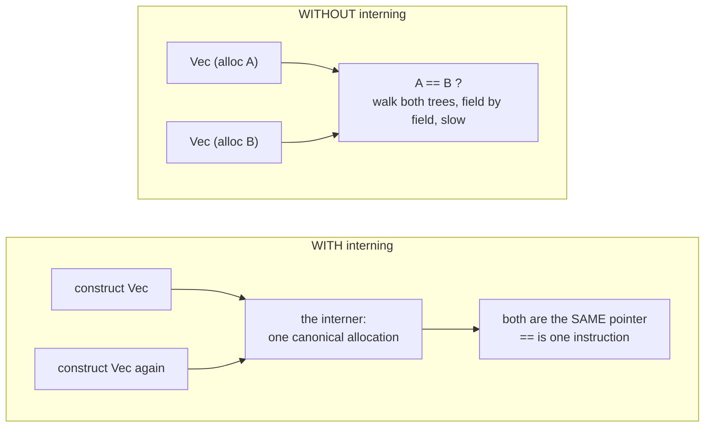
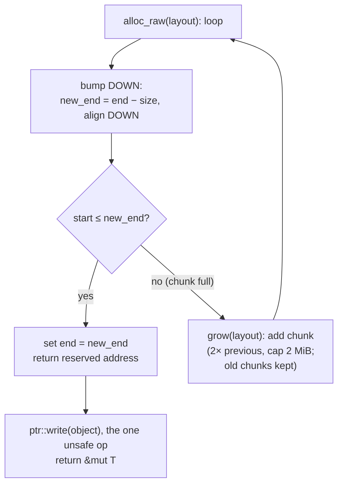
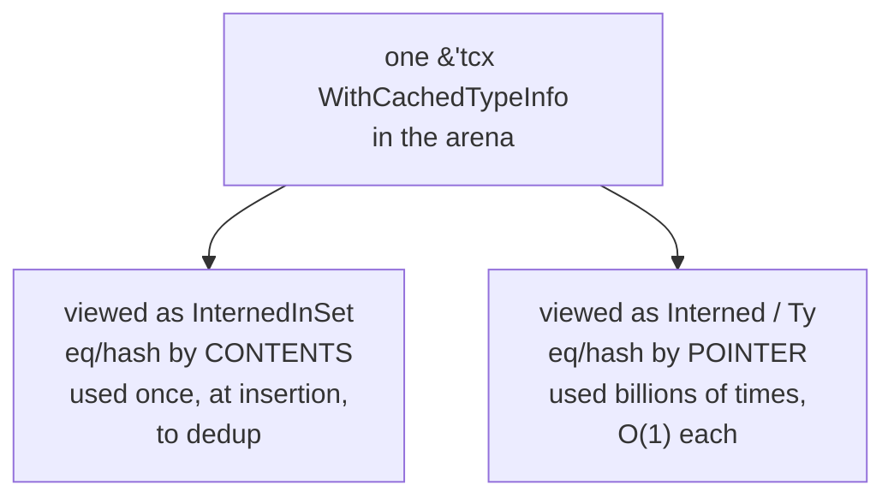
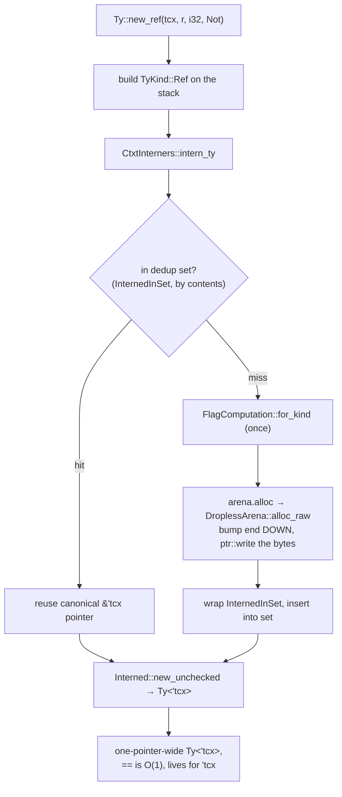
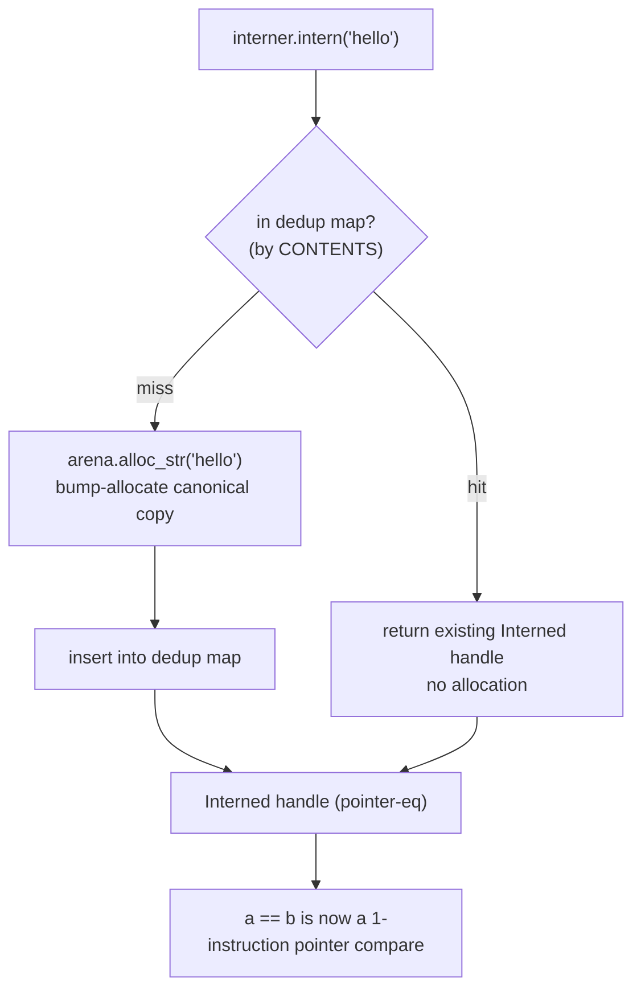
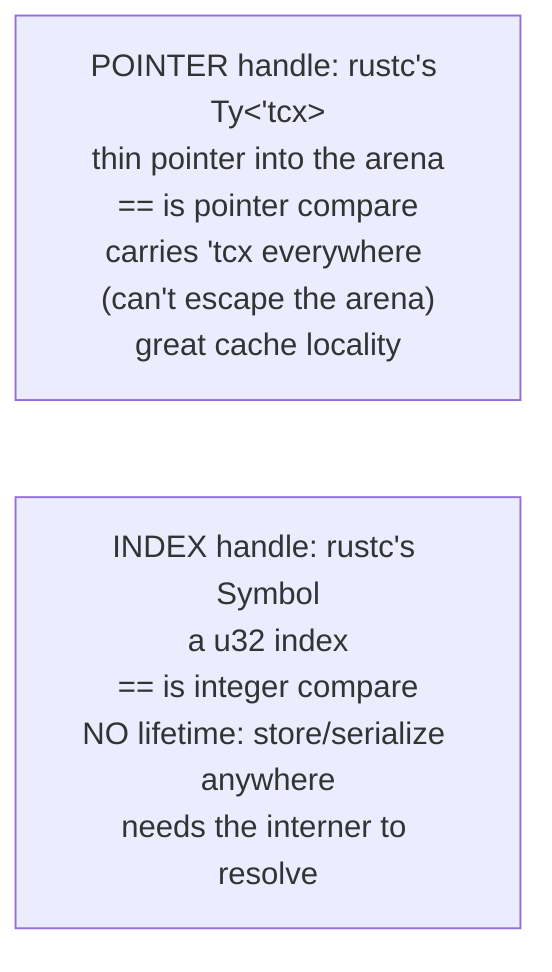

```admonish abstract title="What you'll learn"
- Why `rustc` uses [arenas](../glossary.md#arena): millions of small, immutable, same-lifetime, constantly-compared objects fit region-based allocation in a way that GC, `Rc`/`Arc`, and per-object `Box` do not.
- What the pervasive [`'tcx` lifetime](../glossary.md#tcx-lifetime) actually means: the name of the arena region owned by `GlobalCtxt`, policed by Rust's own [borrow checker](../glossary.md#borrow-checker) so no arena pointer outlives compilation.
- The split between `TypedArena<T>` (runs destructors) and `DroplessArena` (no destructors, many `Copy`-ish types), and how `declare_arena!` weaves them into `Arena<'tcx>`.
- How `CtxtInterners::intern_ty` and [`InternedInSet`](../glossary.md#internedinset) reconcile structural dedup with pointer equality so that [`Ty<'tcx>`](../glossary.md#tytcx) comparison is one machine instruction.
- The bump-downward `alloc_raw` loop in `compiler/rustc_arena/src/lib.rs`, the chunk-growth policy (start at `PAGE` 4 KiB, double up to `HUGE_PAGE` 2 MiB), and where the one `unsafe ptr::write` lives.
- The trap of using `==` on `Ty<'tcx>` as semantic equality versus identity, and why mistaking the two has shipped real unsoundness.
```

## 4.1 Why `rustc` Uses Arenas

### The student becomes the teacher

Rust's lifetimes did not spring from nowhere. They are the tamed, ergonomic descendant of a line of academic research called **region-based memory management**, most directly Tofte and Talpin's work on the ML Kit (a region inference system for Standard ML, published in *Information and Computation* in 1997) and the **Cyclone** safe-C dialect that followed. The core idea of that research: instead of freeing objects one at a time, group objects that share a lifetime into a **region**, and free the entire region in a single stroke when that lifetime ends. A region is a block of memory whose contents live and die together.

Rust handed *programmers* a refined version of this idea: the lifetime `'a`, a local, checked, per-borrow region. But the Rust *compiler*, internally, manages its own memory with regions in almost the literal Tofte-Talpin sense. `rustc` allocates the millions of small objects it creates (every type, every [MIR](../glossary.md#mir) body, every interned list) into **arenas**, blocks of memory that are filled during compilation and then freed *all at once* when compilation ends. There is essentially one giant region, and its lifetime is the compilation session itself. The student became the teacher: the language inspired by region research is built by a compiler that uses regions to manage itself.

And the name of that region (a pervasive piece of notation in the `rustc` codebase, the `'tcx` you have seen on `Ty<'tcx>`, `&'tcx Body<'tcx>`, [`TyCtxt<'tcx>`](../glossary.md#tyctxt-tcx), and many other types across the last three chapters) *is the name of the region.* This chapter, the last of Part 0, finally explains it. §4.1 makes the case for arenas; §4.2 shows *how* the [interner](../glossary.md#interner) makes `Ty<'tcx>` a one-instruction comparison; §4.3 walks the real `rustc_arena` source; and §4.4 has you build a working arena interner yourself.

### The compiler's peculiar allocation pattern

Why arenas at all? Because `rustc` has an allocation pattern unlike most programs, and that pattern makes the usual strategies a poor fit. Consider what the compiler allocates:

- **An enormous number of small objects.** A non-trivial crate produces millions of `Ty<'tcx>` values, MIR statements, interned substitution lists, predicates, and so on.
- **That are overwhelmingly immutable once created.** A type, once constructed, is never mutated; it is read, compared, and passed around.
- **That all share one lifetime: the compilation.** Almost nothing the compiler allocates needs to outlive the compilation, and almost nothing needs to be freed *before* it ends. A `Ty` created during type checking is still wanted during codegen.
- **That are compared constantly.** Type checking asks "is this type equal to that type?" billions of times.

Now weigh the standard memory strategies against that profile.

**Garbage collection** (the strategy of Java, Go, OCaml) would work, but it brings unpredictable pause times and runtime overhead that a batch compiler has no reason to pay, and it complicates the `unsafe`-free, predictable-performance world `rustc` wants to live in. GC reclaims objects with *varied* lifetimes automatically; rustc's objects all share *one* lifetime, so that machinery is something it would pay for without ever using.

**Reference counting** (`Rc`/`Arc`) does not match the pattern either. Every copy of a `Ty` would perform an atomic refcount increment (Arc is needed for the parallel front end). And two `Rc<TyKind>`s holding equal types are still different allocations, so equality stays structural rather than a pointer check, exactly the operation the compiler does most.

**Individual heap allocation** (`Box<TyKind>`, freed when dropped) avoids refcounting but reintroduces per-object allocation and deallocation cost for objects that, again, all want to be freed at the same moment anyway, and still leaves you with structural equality.

The arena fits the pattern like a key in a lock. One region, the compilation. Allocation is a **pointer bump**: advance a cursor, return the old position: no bookkeeping, no headers, no refcount. Deallocation does not happen per object at all; when the arena is dropped at the end of compilation, *every object in it vanishes simultaneously.* And because identical objects can be **interned** into a single arena allocation, equality becomes pointer comparison. The pattern that fits GC, refcounting, and per-object boxing poorly is precisely the pattern arenas were made for.




```admonish warning title="Warning, arenas do not free individual objects"
If you are used to allocator APIs where every allocation has a matching free, note that an arena reclaims its objects in bulk when the region drops; the absence of per-object `free` is the design, not a leak. The mental shift is from "track each object's death" to "track the region's death," and it is exactly the shift Tofte-Talpin made academically.
```

### Bump allocation, concretely

The "pointer bump" deserves to be made literal, because its speed is the whole point. An arena holds one or more chunks of raw memory and a cursor. To allocate, it returns the cursor's current position and advances the cursor by the object's size. That is the entire operation: no free list to search, no size classes, no header. Conceptually:

```rust
// the essence of bump allocation (heavily simplified)
fn alloc<T>(&self, value: T) -> &mut T {
    let ptr = self.cursor; // 1. take the current position
    self.cursor = self.cursor + size_of::<T>();  // 2. advance past it
    if self.cursor > self.chunk_end {  // 3. out of room? grab a new chunk
        self.grow();
    }
    unsafe { write(ptr, value); &mut *ptr }  // 4. write the value, hand back a reference
}
```

`rustc`'s real implementation in `compiler/rustc_arena/src/lib.rs` adds the production details: it actually bumps *downward* from the end of each chunk toward the start (a trick that shaves a couple of instructions off the hot path, per Nick Fitzgerald's "Always Bump Downwards"), it keeps chunks aligned, and its chunks start at `PAGE` (4 KiB) and double each time, capped at `HUGE_PAGE` (2 MiB), so a barely-used arena cannot strand an oversized chunk. The crate's own summary is exact: arenas destroy their objects all at once when the arena is destroyed, do not support freeing individual objects, and offer very fast allocation that is just a pointer bump.

### Two flavors: `TypedArena` and `DroplessArena`

`rustc_arena` provides two arena types, and the split is about one thing: **destructors.**

A `TypedArena<T>` holds many objects of a *single* type `T`, and it *will run `T`'s destructor* on each object when the arena is dropped. You use it for types that own heap resources (a MIR `Body<'tcx>`, for instance, contains `Vec`s and other owning structures whose `drop` must run to free their backing memory). The arena tracks these objects so it can drop them en masse at the end.

A `DroplessArena` holds objects of *many* types at once, but only types that need no destructor: formally, types that are `Copy` and/or satisfy `!mem::needs_drop`. Because nothing in it needs dropping, it can forget its objects entirely: at the end it simply releases its raw chunks, running no destructors. In practice its three fields are `start: Cell<*mut u8>`, `end: Cell<*mut u8>`, and `chunks: RefCell<Vec<ArenaChunk>>`, bumping downward from `end` toward `start`. This is where the vast bulk of small, `Copy`-ish compiler data lives: interned `TyKind`s, slices of `GenericArg`s, and the like.

`rustc` weaves these together with the `declare_arena!` macro, which the crate documents as declaring an `Arena` containing **one dropless arena and many typed arenas**: one `TypedArena<T>` field per type that needs dropping, plus the shared `DroplessArena` for everything else. The concrete `Arena<'tcx>` that results lives in `rustc_middle`, and a reference to it is the very first field of `GlobalCtxt` from §3.2:

```rust
// from §3.2's GlobalCtxt: now we know what this field is for:
pub struct GlobalCtxt<'tcx> {
    pub arena: &'tcx WorkerLocal<Arena<'tcx>>, // ← THE compilation region
    // … interners, dep_graph, query_caches, … …
}
```

That `WorkerLocal` wrapper is a nod forward to parallelism: under the parallel front-end each worker thread gets its own arena (`arena: &'tcx WorkerLocal<Arena<'tcx>>` is the field, on both `CtxtInterners` and `GlobalCtxt`), because bump allocation is fast precisely by *not* synchronizing, and synchronizing every allocation would destroy the advantage. For now, hold the single-arena mental model; Chapter 23 adds the threads.

### `'tcx` is the name of the region

What *is* the `'tcx` lifetime?

**`'tcx` is the lifetime of the arena, which is to say, the name of the compilation region.** When a query returns `&'tcx Body<'tcx>` or constructs a `Ty<'tcx>`, the `'tcx` is a Rust lifetime annotation asserting "this reference points into the arena, and is valid for exactly as long as the arena lives, the whole compilation." Every `'tcx` you have seen across Part 0 is the same lifetime: the borrow of the one region. `TyCtxt<'tcx>` is a handle to a context whose arena lives for `'tcx`; `Ty<'tcx>` points at data in that arena; `&'tcx Body<'tcx>` borrows an arena-allocated MIR body. They all share one lifetime because they all live in one region.

How does `rustc` ensure it never accidentally lets a `'tcx` reference escape and dangle after the arena is freed? **It uses Rust's own borrow checker**, the very analysis Chapter 15 will explore in depth, to police its region-based memory management. The `'tcx` lifetime threads through every signature precisely so that the borrow checker can verify, at compile time, that no arena pointer outlives the arena. `rustc` manages its memory with regions, and proves the regions sound using the lifetime system that those same regions' academic ancestors inspired. The compiler dogfoods the language's central safety mechanism to keep its own house in order.




```admonish tip title="Pro-Tip, read 'tcx as lives-for-the-whole-compilation"
Whenever you see `'tcx` in `rustc` source, and you will see it *everywhere*, mentally substitute "valid for the entire compilation session." A function `fn foo<'tcx>(tcx: TyCtxt<'tcx>) -> Ty<'tcx>` is saying "give me the compilation context, and I'll hand back a type that lives as long as that context does." This single substitution demystifies the most intimidating-looking signatures in the codebase. The `'tcx` is not complexity for its own sake; it is the borrow checker tracking the one region, on your behalf, so arena pointers can never dangle.
```

### Where this leaves us

The case for arenas is now made. `rustc` allocates millions of small, immutable, same-lifetime, constantly-compared objects, a pattern that defeats garbage collection (pauses, varied-lifetime reclamation it doesn't need), reference counting (atomic increments on every copy; structural equality), and per-object boxing (per-object alloc/free for objects freed together anyway). Arenas fit it exactly: allocation is a pointer bump, deallocation is a single bulk free when the region dies, and, the thread into §4.2, interning makes equality a pointer comparison. The two flavors, `TypedArena` (runs destructors, one type) and `DroplessArena` (no destructors, many `Copy` -ish types), are woven by `declare_arena!` into the `Arena<'tcx>` that `GlobalCtxt` owns. And `'tcx`, the most pervasive notation in the compiler, is simply the *name of that region*: the lifetime of the arena, policed by Rust's own borrow checker so that no arena pointer can ever escape its compilation.

We have established *why* the memory lives in arenas and *what* `'tcx` means. What we have not yet seen is the mechanism that turns "arena-allocated" into "comparable in one instruction", the **interner**. Why is `Ty<'tcx>` not just a pointer into the arena but a pointer to a *canonical, deduplicated* allocation, such that two equal types are the *same* pointer? How does `CtxtInterners` guarantee that constructing `Vec<i32>` twice yields one allocation and one pointer? §4.2 opens the interner and answers the question that makes the whole scheme pay off: how `==` on a `Ty<'tcx>` became a single machine instruction.

## 4.2 The Interner: How `Ty<'tcx>` Became a One-Instruction Comparison

### You already know interning

If you have ever been surprised that `"hello" is "hello"` returns `True` in Python, or that two `String` literals in Java share object identity, you have already met **interning**. You just met it for strings. The idea: instead of letting many equal values float around as separate copies, keep *one canonical copy* of each distinct value in a central table, and hand everyone a *reference* to that single copy. Two values are equal if and only if they point to the same canonical entry, so equality, which would otherwise mean comparing contents character by character, collapses into comparing two pointers.

That is the entire trick `rustc` plays with *types*, and §4.1 set up exactly why it must. Type checking asks "is this type equal to that type?" an astronomical number of times. If a `Ty` were a tree (and a real type like `Vec<HashMap<String, Vec<i32>>>` *is* a tree) then equality would mean recursively walking two trees node by node, every single time. For a compiler that performs billions of such comparisons, that cost is intolerable. The fix is to intern types into the arena from §4.1: keep one canonical allocation per distinct type, and make `Ty<'tcx>` a pointer to it. Then "is this type equal to that type?" becomes "do these two pointers hold the same address?", a single machine instruction.

### `Ty<'tcx>` is a pointer, not a tree

Start with what `Ty<'tcx>` actually *is*. It is not the type data; it is a thin pointer *to* the type data, living in the arena. The definition looks roughly like:

```rust
// rustc_middle::ty (faithful, verbatim from src/ty/mod.rs)
pub struct Ty<'tcx>(Interned<'tcx, WithCachedTypeInfo<TyKind<'tcx>>>);
```

Peel the onion from the inside out. `TyKind<'tcx>` is the actual "what kind of type is this" enum, the big enum with a variant for every shape of Rust type: `Bool`, `Int`, `Ref`, `Adt` (structs/enums), `Tuple`, `FnDef`, and so on. This is the real, structural data. `WithCachedTypeInfo<…>` wraps that `TyKind` together with three precomputed values the compiler consults constantly: a [`stable_hash: Fingerprint`](../glossary.md#fingerprint) for the incremental on-disk cache (which Chapter 3's [red/green](../glossary.md#red-green-algorithm) system later consults), `flags: TypeFlags` (a bitset answering questions like "does this type contain inference variables?" without re-walking it), and `outer_exclusive_binder: DebruijnIndex` (bookkeeping for bound lifetimes); all three fields verbatim in `rustc_type_ir::WithCachedTypeInfo`. These are convenience caches: information *about* the type, computed once at construction so it never has to be recomputed. And `Interned<'tcx, …>` is the wrapper that makes the whole thing a pointer with pointer-based equality.

The companion type confirms the pattern is uniform; here is `Const<'tcx>` copied verbatim from `compiler/rustc_middle/src/ty/consts.rs`:

```rust
pub struct Const<'tcx>(pub(super) Interned<'tcx, WithCachedTypeInfo<ConstKind<'tcx>>>);
```

Same shape exactly: an interned pointer to a cached-info wrapper around a `Kind` enum. Types, consts, and several other core entities all follow this template. The dev-guide states the payoff plainly: `Interned` makes `ty::Ty` a thin, pointer-like type, enabling cheap equality comparisons, and you almost never touch `Interned` directly, because `Ty` hides it behind `Deref` and methods.

### What `Interned` guarantees

`Interned<'tcx, T>` is defined in `rustc_data_structures::intern`, and its contract is the heart of the mechanism. Per its own documentation: if you have two different `Interned<T>` values, they refer to the *same value at a single location in memory*, which means equality and hashing can be done on the value's **address** rather than its **contents**. So `Interned`'s `PartialEq` is a pointer comparison, and its `Hash` hashes the pointer, both O(1), both independent of how large or deeply nested the underlying type is.

But that guarantee, "two `Interned`s point to the same location iff their values are equal", only holds if *something enforces uniqueness*: there must be exactly one canonical allocation per distinct value. If two equal `TyKind`s ever got two separate allocations, their `Interned` pointers would differ and `==` would wrongly report them unequal. The type even hints at the danger: you construct an `Interned` only through `new_unchecked`, named to flag that *you* are promising the value is genuinely unique; violating that promise causes incorrect behavior (though, notably, not memory unsafety). So the burden shifts to whoever creates types: every `TyKind` must pass through a gatekeeper that guarantees canonical uniqueness. That gatekeeper is the interner.




### `CtxtInterners`: the gatekeeper

The gatekeeper is `CtxtInterners`, a struct living in `compiler/rustc_middle/src/ty/context.rs` and held inside `GlobalCtxt` (§3.2). It owns the central deduplication tables (one hash-set-like structure per interned kind (types, consts, [regions](../glossary.md#region), and the various slices)) plus a reference to the arena from §4.1 where the canonical copies are stored. Constructing a type runs through it, conceptually like this:

```rust
// the essence of interning a type (heavily simplified)
fn intern_ty(&self, kind: TyKind<'tcx>) -> Ty<'tcx> {
    // 1. Look up `kind` in the dedup set, comparing by CONTENTS (structural).
    if let Some(existing) = self.type_set.get(&kind) {
        return Ty(existing);  // already interned → reuse the canonical pointer
    }
    // 2. First time we've seen this type:
    let cached = WithCachedTypeInfo {
        internee: kind,
        flags: compute_flags(&kind), // precompute the cached info ONCE
        outer_exclusive_binder: compute_binder(&kind),
    };
    let ptr: &'tcx _ = self.arena.alloc(cached);  // bump-allocate in the arena (§4.1)
    self.type_set.insert(ptr); // record it as the canonical copy
    Ty(Interned::new_unchecked(ptr))
}
```

The two-level move in that sketch is worth stating explicitly. The dedup *set* hashes and compares by **contents** (structural): it *has* to, because that is how it recognizes that a freshly-constructed `Vec<i32>` is the same as one it interned an hour ago. But that structural comparison happens *exactly once per distinct type*, at the moment of first construction. Forever after, the type is referred to by its canonical `Interned` pointer, whose equality is by **address**. So `rustc` pays the cost of structural comparison *once* to establish canonicity, and reaps O(1) pointer equality on every one of the billions of comparisons that follow. The expensive operation is amortized to nearly nothing. (Internally the canonical entry is wrapped in a small `InternedInSet` helper precisely so the dedup set can hash-and-compare by contents while the public `Interned` compares by pointer, two different equality notions on the same allocation, kept carefully separate.)

This is the moment §4.1 and §4.2 fuse. The arena answers *where* the canonical type lives (one region, freed at the end); the interner answers *how* we guarantee it is canonical (the dedup set) and *why* that makes `Ty<'tcx>` pointer-comparable. Arenas without interning would give you fast allocation but slow structural equality; interning without arenas would have nowhere stable to put the canonical copies. Together they give you both fast allocation *and* one-instruction equality, which is exactly what a compiler that allocates and compares millions of types needs.

### How you actually make a type

You never call `intern_ty` or touch `Interned` directly. The dev-guide is explicit: to allocate a type you use the `new_`* constructor methods on `Ty`, and for the interned *slices* (substitution lists and the like) the `mk_`* methods on `tcx`. For example:

```rust
let unit:  Ty<'tcx> = tcx.types.unit; // a pre-interned common type
let i32_t: Ty<'tcx> = tcx.types.i32; // ditto
let ref_t: Ty<'tcx> = Ty::new_ref(tcx, region, i32_t, Mutability::Not);  // &'r i32
let args:  GenericArgsRef<'tcx> = tcx.mk_args(&[i32_t.into()]); // an interned slice
```

Two things to note. First, `tcx.types.bool`, `tcx.types.i32`, `tcx.types.unit`, and friends are *pre-interned*: the compiler interns the handful of ubiquitous primitive types once at startup and stashes them in a `CommonTypes` table on `GlobalCtxt`, so the hottest types need no lookup at all. Second, even *slices* are interned: `mk_args` interns a slice of `GenericArg`s so that two identical substitution lists share one allocation and compare by pointer, exactly like types. Interning is not a special case for `TyKind`; it is the pervasive strategy for all the immutable, frequently-compared data the compiler manufactures.

There is even a memory micro-optimization worth seeing, because it shows how far this is taken: a `GenericArg<'tcx>` (which can hold a type, a lifetime, or a const) is itself an interned pointer with the *lowest two bits used as a tag* to record which of the three it points to. Rather than spend a whole discriminant word, `rustc` exploits the fact that arena allocations are aligned (so the low bits of their addresses are always zero) and stuffs the tag into those free bits. A `GenericArg` is one pointer-sized word that is simultaneously a pointer *and* a 2-bit tag. This is the kind of density you reach for when you allocate hundreds of millions of these.

```admonish tip title="Pro-Tip, use the constructors, never the raw interner"
When writing compiler code, reach for `tcx.types.bool` for common types, `Ty::new_`* for constructing types, and `tcx.mk_`* for interned slices. Do *not* construct `Interned` values yourself with `new_unchecked` unless you are writing the interner itself. The uniqueness invariant is the interner's job to uphold, and bypassing it is how you silently break pointer equality across the whole compiler. The constructors exist precisely so you cannot get this wrong.
```

### The trap: pointer equality is not *semantic* type equality

Now the subtlety that separates someone who has read about interning from someone who can safely work in `rustc`. Because types are interned, you *can* compare two `Ty<'tcx>` with `==`, and it is O(1). But the dev-guide attaches a sharp warning to this, and it must be internalized: **`==` on `Ty` is almost never what you want when you are asking "are these the same type?"**

The reason is that pointer equality tells you the two `Ty` values are *the identical interned representation*. But in Rust, *the same type can have more than one representation*, especially once inference is involved. An inference variable `?0` that has been resolved to `i32` is, as a representation, distinct from the interned `i32`, even though they denote the same type. Type aliases, projection types, and not-yet-normalized associated types create further cases where two structurally-different `Ty` pointers mean the same type. So `ty_a == ty_b` answers "are these the same interned node?" (useful for hashing, deduplication, and fast-path checks) but *not* "are these semantically the same type?", which requires the inference and relation machinery (unification, normalization) covered in Chapter 11.

```admonish warning title="Warning, the most dangerous == in the compiler"
Using `ty_a == ty_b` to decide semantic type equality is a classic `rustc` bug, and a seductive one, because the `==` *compiles*, is *fast*, and is *correct in the easy cases* where both types are already in canonical, normalized form. It then silently misbehaves the moment inference variables, aliases, or un-normalized projections appear, exactly the hard cases. Pointer equality on interned types is for *identity* (is this the same node?), not for *semantics* (do these denote the same type?). When you mean the latter, you must go through the type relation/inference code. Mistaking one for the other has shipped real unsoundness; treat `==` on `Ty` as a fast-path identity check and nothing more.
```

### Where this leaves us

The interner is now demystified. `Ty<'tcx>` is not a tree but a thin `Interned` pointer to a `WithCachedTypeInfo<TyKind<'tcx>>` living in the §4.1 arena. `CtxtInterners` is the gatekeeper that guarantees one canonical allocation per distinct type, using a structural dedup set *once* at construction so that every subsequent equality check is a single-instruction pointer comparison. You build types with `tcx.types.`*, `Ty::new_`*, and `tcx.mk_*`, never by touching `Interned` directly, and even slices and the tag-packed `GenericArg` ride the same interning machinery. And the essential caution: pointer `==` on `Ty` means *identity*, not *semantic type equality*, which is a different and harder question.

Two sections in, the architecture of Part 0's memory story is complete: arenas give one-region allocation and bulk free (§4.1); interning gives canonical, pointer-comparable values (§4.2); and `'tcx` ties it together as the lifetime of the region. What remains is to see it *in the real source* rather than in faithful sketches. §4.3 opens `compiler/rustc_arena/src/lib.rs` and the interner code for real (the actual `DroplessArena` bump pointer, the `declare_arena!` expansion, the `InternedInSet` dedup set) and traces an allocation from a `Ty::new_`* call down to the byte written into a chunk. Then §4.4 closes Part 0 by having you build a working arena-backed string interner of your own, in a few dozen lines, so the mechanism lives in your fingers and not just on the page.

## 4.3 Reading the Source: `rustc_arena` and the Interner, End to End

### Down into the engine room

Almost all of `rustc` is safe Rust. The borrow checker, [the query system](../glossary.md#query), the type checker: millions of lines that never write the word `unsafe`, riding on top of a small set of carefully-audited primitives that *do*. `rustc_arena` is one of those primitives: it is the engine room, the place where the safe abstractions of §4.1 and §4.2 bottom out into raw pointers and manual memory management. And it is, refreshingly, one of the most *readable* files in the entire compiler, a few hundred lines you can genuinely sit and read end to end, unlike the cathedral of §1.3. If you want to read real `rustc` source and actually finish, `compiler/rustc_arena/src/lib.rs` is the place to start.

This section descends into that engine room and the interner above it, replacing §4.1's and §4.2's "faithful sketches" with the real machinery. We will trace a single concrete allocation, constructing the type `&'r i32` via `Ty::new_ref`, all the way down to the exact byte written into an arena chunk, and back up to the `Ty<'tcx>` pointer you hold. By the end you will have followed one type through every layer this chapter has built.

```admonish tip title="Pro-Tip, the unsafe is small, audited, and the point"
Do not be intimidated that `rustc_arena` is full of `unsafe`. This is a deliberate Rust architecture pattern: concentrate the dangerous code into a *tiny, heavily-tested core* with a *safe public API*, so the rest of the compiler, the millions of safe lines, can build on it without ever touching a raw pointer. Reading this file is the best possible lesson in that pattern. The `unsafe` is not a smell here; it is the whole reason the safe surface above can exist.
```

### `DroplessArena`: the bump pointer, for real

§4.1 sketched bump allocation in four conceptual lines. Here is the real `DroplessArena`, whose three fields you saw verified earlier:

```rust
// compiler/rustc_arena/src/lib.rs  (faithful)
pub struct DroplessArena {
    start:  Cell<*mut u8>, // start of the current chunk's free space
    end:    Cell<*mut u8>, // end of free space: allocation bumps DOWN from here
    // all chunks; old ones kept, never freed individually
    chunks: RefCell<Vec<ArenaChunk>>,
}
```

The allocation logic is the heart of the file. Recall §4.1's note that `rustc` bumps *downward* (a couple of instructions cheaper than upward). Here is why that matters in code:

```rust
// compiler/rustc_arena/src/lib.rs  (faithful; LLVM-hint `hint::assert_unchecked` line elided)
pub fn alloc_raw(&self, layout: Layout) -> *mut u8 {
    assert!(layout.size() != 0);
    // This loop executes once or twice: if allocation fails the first
    // time, the `grow` ensures it will succeed the second time.
    loop {
        let start = self.start.get().addr();
        let old_end = self.end.get();
        let end = old_end.addr();

        // Round the request up so `end` stays aligned to DROPLESS_ALIGNMENT.
        let bytes = align_up(layout.size(), DROPLESS_ALIGNMENT);

        if let Some(sub) = end.checked_sub(bytes) {
            // Bump DOWN: subtract size, then align DOWN to the layout's alignment.
            let new_end = align_down(sub, layout.align());
            if start <= new_end {
                let new_end = old_end.with_addr(new_end);
                self.end.set(new_end); // commit the new cursor
                return new_end; // hand back the freshly reserved address
            }
        }
        // No free space left. Allocate a new chunk and retry the loop.
        self.grow(layout);
    }
}
```

Walk it. Inside the `loop` we take the current `end` cursor, subtract the requested size (rounded up to `DROPLESS_ALIGNMENT` so the cursor itself stays aligned), and align *down* to the layout's own alignment. That is a single subtraction and a single bitmask under `align_down`, which is the entire reason downward bumping is faster: aligning downward is one `AND`, whereas aligning an upward-growing cursor needs an add-then-mask. If the resulting address has not crossed below `start`, there is room: we commit the new cursor and return the reserved address. If it *has* crossed `start`, the chunk is full, and `self.grow(layout)` adds a new chunk before the loop retries. The `.addr()` and `.with_addr()` calls are Rust's strict-provenance ceremony, which the compiler obeys so MIRI and pointer-analysis passes can reason about provenance correctly; they do nothing at runtime beyond the obvious bit-level read and write.

And `grow` is where §4.1's growth policy lives: each new chunk doubles the previous, capped at `HUGE_PAGE` (2 MiB), so a barely-used arena cannot strand a giant chunk, and the first chunk starts at `PAGE` (4 KiB). Old chunks are *kept* in the `chunks` vector, never reallocated or freed, because live `&'tcx` references point into them; only when the whole `DroplessArena` is dropped at end of compilation do all chunks release at once. The typed public entry point wraps this with a write:

```rust
// compiler/rustc_arena/src/lib.rs  (faithful)
pub fn alloc<T>(&self, object: T) -> &mut T {
    assert!(!mem::needs_drop::<T>()); // DroplessArena refuses droppable types (§4.1)
    assert!(size_of::<T>() != 0); // and zero-sized types: alloc_raw rejects them too
    let mem = self.alloc_raw(Layout::new::<T>()) as *mut T;
    unsafe { ptr::write(mem, object); &mut *mem } // the one unsafe write
}
```

The `assert!(!mem::needs_drop::<T>())` is §4.1's two-flavor distinction *enforced in code*: a `DroplessArena` will not accept a type with a destructor, because it will never run one. Droppable types go in a `TypedArena<T>` instead, which keeps a record of its objects precisely so it can drop them en masse. The single `unsafe` block is the entire dangerous surface: reserve aligned bytes, write the object, return a reference. Everything above this is safe.




### `declare_arena!`: one dropless, many typed

§4.1 said the `declare_arena!` macro weaves one `DroplessArena` together with many `TypedArena<T>`s into the `Arena<'tcx>` that `GlobalCtxt` owns. Conceptually it expands to:

```rust
// what declare_arena! generates (conceptual)
pub struct Arena<'tcx> {
    pub dropless: DroplessArena, // everything Copy / !needs_drop
    pub mir: TypedArena<Body<'tcx>>,  // droppable: has owning Vecs
    pub typeck: TypedArena<TypeckResults<'tcx>>,
    // … one TypedArena field per droppable type the compiler arena-allocates …
}
```

The macro also generates the dispatch glue so that `arena.alloc(x)` routes `x` to the right field by its type: droppable types to their dedicated `TypedArena`, everything else to the shared `dropless`. This is why, throughout the compiler, code simply writes `tcx.arena.alloc(thing)` without caring which flavor it lands in: the type of `thing` decides, at compile time, via the trait machinery the macro emits.

### Up one level: `CtxtInterners::intern_ty`

The arena is the *where*; now the *how-canonical*, from §4.2. When you build a type, `CtxtInterners::intern_ty` is the gatekeeper, and its real shape is this:

```rust
// compiler/rustc_middle/src/ty/context.rs  (faithful)
fn intern_ty(&self, kind: TyKind<'tcx>, sess: &Session, untracked: &Untracked) -> Ty<'tcx> {
    Ty(Interned::new_unchecked(
        self.type_   // the dedup set for types
            .intern(kind, |kind| {
                // Called ONLY on a miss: i.e., the first time this type is seen.
                // Compute cached info once, bump-allocate the wrapper.
                let flags = ty::FlagComputation::<TyCtxt<'tcx>>::for_kind(&kind);
                let stable_hash = self.stable_hash(&flags, sess, untracked, &kind);
                InternedInSet(self.arena.alloc(WithCachedTypeInfo {
                    internee: kind,
                    stable_hash,
                    flags: flags.flags,
                    outer_exclusive_binder: flags.outer_exclusive_binder,
                }))
            })
            .0,
    ))
}
```

Read it against §4.2's two-level trick. `self.type_` is the deduplication set. Its `.intern(kind, make)` looks `kind` up *by contents*; on a **hit** it returns the existing canonical entry and the `make` closure never runs; on a **miss** it calls `make`, which computes the cached `flags` and the `stable_hash` (the incremental on-disk cache fingerprint that Chapter 3's red/green system later consults) *once*, bump-allocates the `WithCachedTypeInfo` into the arena (the `alloc` we just read), wraps it as the canonical entry, and inserts it. Either way we end with one canonical `&'tcx` pointer, wrapped in `Interned::new_unchecked` (the §4.2 "I promise this is unique" constructor) and then in `Ty`. The expensive structural work (hashing and comparing `kind`, computing flags and the stable hash) happens *only on the miss*, exactly once per distinct type.

### The two-equality trick, in the source: `InternedInSet`

One allocation supports two different notions of equality: by-contents for the dedup set, by-pointer for everything else. That is what `InternedInSet` is for:

```rust
// compiler/rustc_middle/src/ty/context.rs  (faithful, abridged)
struct InternedInSet<'tcx, T: ?Sized>(&'tcx T); // real: + PointeeSized

// Borrow<T> lets the dedup set look up entries by the inner kind directly
// (so `set.contains_key(&kind)` works); this is what forces eq/hash to go
// by contents below.
impl<'tcx, T> Borrow<T> for InternedInSet<'tcx, WithCachedTypeInfo<T>> {
    fn borrow(&self) -> &T { &self.0.internee }
}

// Inside the dedup SET, equality and hashing go by CONTENTS.
// Generic over T, so the same impl serves WithCachedTypeInfo<TyKind>,
// WithCachedTypeInfo<ConstKind>, WithCachedTypeInfo<Binder<PredicateKind>>, …
impl<'tcx, T: PartialEq> PartialEq for InternedInSet<'tcx, WithCachedTypeInfo<T>> {
    fn eq(&self, other: &Self) -> bool {
        self.0.internee == other.0.internee // compare the actual inner kind
    }
}
impl<'tcx, T: Hash> Hash for InternedInSet<'tcx, WithCachedTypeInfo<T>> {
    fn hash<H: Hasher>(&self, s: &mut H) {
        self.0.internee.hash(s)
    }
}
```

Contrast this with the *public* `Interned<'tcx, T>` from §4.2, whose `PartialEq` and `Hash` go by **address**. The same `&'tcx WithCachedTypeInfo` allocation is viewed two ways: through `InternedInSet`, the dedup set sees it *structurally* (so it can recognize duplicates); through `Interned`/`Ty`, the rest of the compiler sees it *by pointer* (so equality is one instruction). The structural view is used exactly once, at insertion, to establish canonicity; the pointer view is used billions of times thereafter. Two equality implementations on one piece of memory. That is the entire performance story of `rustc`'s type representation, and now you have seen it in the source rather than in a sketch.




### The full trace: `Ty::new_ref` to a byte and back

Now assemble every layer into one journey. Suppose the compiler constructs the type `&'r i32` by calling `Ty::new_ref(tcx, region, i32_ty, Mutability::Not)`. Here is the complete path:

1. `Ty::new_ref` builds a `TyKind::Ref(region, i32_ty, Not)` on the stack, just a stack value so far, nothing allocated, and hands it to the interner via `tcx`.
2. `CtxtInterners::intern_ty` receives the `TyKind` and consults `self.type_`, the dedup set, looking it up *by contents* (`InternedInSet`'s structural `eq`/`hash`).
3. **On a hit** (the common case: `&'r i32` has surely been built before), the existing canonical `&'tcx WithCachedTypeInfo` pointer is returned. No allocation, no flag computation. Done.
4. **On a miss**, the `make` closure runs: `FlagComputation` walks the `TyKind` once to compute `flags`, then `self.arena.alloc(WithCachedTypeInfo { … })` drops into `DroplessArena::alloc` → `alloc_raw`, whose `loop` bumps the `end` cursor down by the struct's size, aligns, and (the one `unsafe`) writes the bytes into the chunk. The returned `&'tcx` pointer is wrapped in `InternedInSet` and inserted into the dedup set.
5. Either way, the canonical pointer is wrapped in `Interned::new_unchecked` and then in `Ty`, and handed back. You now hold a `Ty<'tcx>` (one pointer wide, comparable to any other `Ty` with a single instruction, valid for the whole compilation).




That is the complete machinery of Part 0's memory story, exercised on one type: the arena (§4.1) supplied the bytes, the interner (§4.2) guaranteed canonicity, `InternedInSet` reconciled the two equality notions, and `'tcx` stamped the result as living for the compilation.

```admonish warning title="Warning, these arenas assume the 'tcx discipline"
It is tempting, having read how clean `rustc_arena` is, to copy `DroplessArena` into your own project. Be careful: its safety rests on invariants the *rest* of `rustc` upholds: that allocated objects are never freed individually, that `!needs_drop` types go in the dropless arena, that interned values are genuinely unique, and that `'tcx` references never escape the arena (enforced by the borrow checker, §4.1). The crate is `rustc_private` and not meant for general use; for your own code, reach for the `bumpalo` crate, which packages the same bump-allocation idea with a safe, stable, general-purpose API. We use exactly that in §4.4.
```

```admonish tip title="Pro-Tip, static_assert_size and why type size is sacred"
Scattered through `rustc`'s type code you will find `rustc_data_structures::static_assert_size!(TyKind<'_>, 24)` (the value at `rustc_middle/src/ty/sty.rs` on the 1.95 tag, alongside a companion `static_assert_size!(ty::WithCachedTypeInfo<TyKind<'_>>, 48)` for the actual arena-allocated wrapper) and similar, compile-time assertions pinning the *exact byte size* of hot types. The exact constant changes as the team trims fields; the `static_assert_size!` macro's job is to break the build the moment that number drifts. Because the compiler allocates hundreds of millions of these, a careless field that grows `TyKind` by a word can measurably slow every build, so the team locks the sizes with assertions that *fail the build* if a type unexpectedly grows. When you see one, it is a tripwire guarding a performance-critical struct, and a hint of just how seriously this code treats the cost of the things it interns.
```

### Where this leaves us

We have now read the real engine room. `DroplessArena` allocates by bumping a cursor *downward* through chunks that double to a 2 MiB cap and are freed only in bulk; `alloc<T>` enforces `!needs_drop` and performs the lone `unsafe` write; `declare_arena!` weaves one dropless arena with many typed ones into `Arena<'tcx>`. Above it, `CtxtInterners::intern_ty` deduplicates by contents on the rare miss and returns a canonical pointer on the common hit, while `InternedInSet` lets one allocation be compared structurally by the dedup set and by-pointer by everyone else. Trace `Ty::new_ref` and you watch all of it cooperate to produce a one-pointer-wide, O(1)-comparable `Ty<'tcx>`.

Part 0's architecture is now complete and seen in source. Only one thing remains, and it is the most satisfying kind of remaining: doing it with your own hands. §4.4, the final section of Part 0, has you build a working **arena-backed string interner** in a few dozen lines of safe, stable Rust (on `bumpalo`, per the warning above), reproducing in miniature the exact mechanism you just read: bump-allocate canonical copies into an arena, dedup through a set, and hand out cheap, pointer-comparable handles. When it compiles and your interner returns the *same* handle for two equal strings, the entire chapter will live in your fingers.

## 4.4 Hands-On Lab: Build Your Own Arena Interner

### What you cannot create, you do not understand

When Richard Feynman died, his blackboard carried the line *"What I cannot create, I do not understand."* It is the perfect epigraph for this final lab of Part 0. Across §4.1 to §4.3 you read how `rustc` represents types: bump-allocate canonical copies into an arena, deduplicate them through a set, and hand out thin pointers whose equality is a single instruction. You have *read* it. Now you will *build* it (a working arena-backed string interner, in a few dozen lines of safe, stable Rust) and when two equal strings come back as the same pointer, the mechanism will have moved from the page into your fingers.

This lab is, deliberately, the gentlest of Part 0's four. No `rustc_private`, no `LD_LIBRARY_PATH`, no hour-long `./x build`. Just a `cargo new` project and the `bumpalo` crate (the safe, general-purpose bump allocator we recommended in §4.3's warning, an independent, safe, stable bump-arena crate with the same shape as `rustc_arena`'s `DroplessArena`). You can finish this on any machine in ten minutes, and what you produce is a real, useful data structure.

### Setup

```bash
cargo new --bin interner-lab
cd interner-lab
cargo add bumpalo@3
```

That pulls in `bumpalo` (any 3.x release; the call shapes below are stable across the line), whose `Bump` type is a bump arena with exactly the §4.1 semantics: allocation is a pointer bump, and everything is freed at once when the `Bump` drops.

### Lab A: the pointer interner (mirrors `Ty<'tcx>`)

We will build the version that mirrors `rustc`'s *type* interner directly: a handle that is a pointer into the arena, with equality by **address**, just like `Interned` and `Ty<'tcx>` from §4.2 and §4.3.

First, the handle. The crucial trick, the one that makes this an interner and not just a string wrapper, is the custom `PartialEq`/`Hash` that compares by *pointer*, not by contents:

```rust
use std::hash::{Hash, Hasher};
use std::ops::Deref;

/// A handle to an interned string. Equality is by POINTER, not contents,
/// exactly like rustc's `Interned<'tcx, _>` and `Ty<'tcx>`.
#[derive(Copy, Clone)]
struct Interned<'a>(&'a str);

impl<'a> PartialEq for Interned<'a> {
    fn eq(&self, other: &Self) -> bool {
        // Compare the REFERENCE itself, not the bytes; this matches rustc's
        // `Interned::eq`, which is `ptr::eq(self.0, other.0)` on the &T directly.
        std::ptr::eq(self.0, other.0)
    }
}
impl<'a> Eq for Interned<'a> {}

impl<'a> Hash for Interned<'a> {
    fn hash<H: Hasher>(&self, h: &mut H) {
        // Hash the REFERENCE, not the contents (mirrors rustc's `Interned::hash`).
        std::ptr::hash(self.0, h);
    }
}

impl<'a> Deref for Interned<'a> {
    type Target = str;
    fn deref(&self) -> &str { self.0 } // so you can still read the string
}
```

Notice we did *not* `#[derive(PartialEq)]`. The derived version would compare `&str` contents, which is structural, the very thing we are trying to avoid. By hand-writing `eq` as `std::ptr::eq`, our handle gains the §4.2 superpower: comparison in one instruction regardless of string length, valid *only because* the interner will guarantee one canonical allocation per distinct string. This is `Interned` from §4.3, rebuilt by you.

Now the interner itself. Real rustc holds canonical entries in a `ShardedHashMap<InternedInSet<'tcx, T>, ()>`: the entry **is** the key, the value is `()`, and `InternedInSet`'s `Borrow<T>` impl is what lets the set look up by inner content while comparing entries to each other structurally. We will mirror that shape exactly, in miniature:

```rust
use bumpalo::Bump;
use std::borrow::Borrow;
use std::collections::HashSet;

/// The canonical entry as it sits *inside* the dedup set. Its `Eq`/`Hash` go by
/// contents (so `set.contains_key("hello")` works on a miss), and its
/// `Borrow<str>` impl is what lets the lookup happen without allocating a temporary
/// owned `String`. This is `InternedInSet<'tcx, T>` from §4.3, in miniature.
#[derive(PartialEq, Eq, Hash, Copy, Clone)]
struct InternedInSet<'a>(&'a str);

impl<'a> Borrow<str> for InternedInSet<'a> {
    fn borrow(&self) -> &str { self.0 }
}

struct Interner<'a> {
    arena: &'a Bump,                       // where canonical copies live (the 4.1 arena)
    // The set IS the dedup table; entry == key, no separate value. rustc names these
    // per kind: `type_`, `const_lists`, `args`, ...; we use `strings` because we
    // intern strings.
    strings: HashSet<InternedInSet<'a>>,
}

impl<'a> Interner<'a> {
    fn new(arena: &'a Bump) -> Self {
        Interner { arena, strings: HashSet::new() }
    }

    fn intern(&mut self, s: &str) -> Interned<'a> {
        if let Some(entry) = self.strings.get(s) {
            return Interned(entry.0); // HIT: reuse the canonical pointer
        }
        // MISS: bump-allocate one canonical copy into the arena …
        let canonical: &'a str = self.arena.alloc_str(s);
        self.strings.insert(InternedInSet(canonical));  // … and record it.
        // (real rustc uses hashbrown's `RawEntry` to compute the hash once; we keep
        // the double lookup for clarity. The body above is the get-or-insert pattern
        // that rustc factors out as `ShardedHashMap::intern(value, make)`; when you
        // read it in `sharded.rs` you will see the same two branches, plus a
        // shard-by-hash lock and a hashbrown raw-entry to avoid the double lookup our
        // `HashSet::get` then `insert` does.)
        Interned(canonical)
    }
}
```

Read this against §4.3's `intern_ty` and the parallel is exact. `InternedInSet<'a>`'s **structural** `Eq`/`Hash` mean `strings.get("hello")` finds a previously-interned equal string *by contents* (the `Borrow<str>` impl is what makes the `&str` argument work without allocating). The `Interned` handle returned to the caller is a different wrapper around the *same* `&'a str` whose `Eq`/`Hash` go *by pointer*. One canonical allocation, two equality notions on it: the §4.3 trick, in your code. On a miss, `arena.alloc_str(s)` is your `DroplessArena::alloc`. It bump-allocates the bytes and hands back a `&'a str` living for the arena's lifetime `'a` (your `'tcx`).

Finally, prove it works:

```rust
fn main() {
    let arena = Bump::new();
    let mut interner = Interner::new(&arena);

    let a = interner.intern("hello");
    let b = interner.intern("hello"); // same CONTENTS as a
    let c = interner.intern("world");

    // Equality is by POINTER, and yet behaves correctly:
    assert!(a == b);  // same canonical allocation → equal
    assert!(a != c);  // different allocation → not equal

    // And they really are the identical pointer, one allocation, not two:
    assert!(std::ptr::eq(a.0.as_ptr(), b.0.as_ptr()));

    println!("a -> {:?} @ {:p}", &*a, a.0.as_ptr());
    println!("b -> {:?} @ {:p}", &*b, b.0.as_ptr()); // SAME address as a
    println!("distinct strings interned: {}", interner.strings.len()); // 2, not 3
}
```

Run `cargo run`.

```admonish example title="What you should see" collapsible=true
You will see `a` and `b` print the *same* address, the assertions pass, and the interner reports **2** distinct strings even though you called `intern` three times. You interned `"hello"` twice and got one allocation and one canonical pointer, the entire point of §4.2, demonstrated by code you wrote. Two equal strings, one pointer, O(1) equality.
```




### Lab B: the index interner (mirrors `Symbol`)

The pointer handle has one ergonomic cost you may already feel: the `'a` lifetime. `Interned<'a>` cannot outlive the arena, cannot be stored in a `'static` collection, and cannot be serialized to disk. The lifetime infects everything that holds it. `rustc` lives with this for *types* (`Ty<'tcx>`), where pointer locality and the `'tcx` discipline are worth it. But for *symbols* (interned identifiers like variable and function names, of which there are millions) `rustc` makes the opposite choice, and it is instructive to build that one too.

`rustc_span::Symbol` is **not** a pointer; it is a `u32` index into a global interner. And critically, real rustc's `InternerInner` is built from the **same primitive Lab A used**: a `DroplessArena` holding the canonical bytes, plus an `FxIndexSet<&'static [u8]>` that provides both deduplication *and* the index in one structure. One arena, two handle flavors. We rebuild it directly (`indexmap::IndexSet` is the stable equivalent of rustc's `FxIndexSet`):

```rust
use bumpalo::Bump;
use indexmap::IndexSet;

/// A handle that is an INDEX, not a pointer. No lifetime: store it anywhere,
/// serialize it, put it in a `static`. This mirrors rustc's `Symbol`.
#[derive(Copy, Clone, PartialEq, Eq, Hash, Debug)]
struct Symbol(u32);

struct SymbolInterner<'a> {
    arena:   &'a Bump,                // SAME arena primitive as Lab A
    strings: IndexSet<&'a str>,       // dedup AND index in one structure
}

impl<'a> SymbolInterner<'a> {
    fn new(arena: &'a Bump) -> Self {
        SymbolInterner { arena, strings: IndexSet::new() }
    }

    fn intern(&mut self, s: &str) -> Symbol {
        if let Some(idx) = self.strings.get_index_of(s) {
            return Symbol(idx as u32); // hit: existing index
        }
        let canonical: &'a str = self.arena.alloc_str(s); // bump-allocate
        let (idx, _) = self.strings.insert_full(canonical); // dedup + assign index
        Symbol(idx as u32)
    }

    fn resolve(&self, sym: Symbol) -> &str {
        self.strings.get_index(sym.0 as usize).unwrap()
    }
}
```

`Symbol(u32)` is `Copy`, has *no lifetime*, and its equality is just integer comparison, even cheaper than a pointer compare, and free of the borrow-checker entanglement. The price is that the handle is meaningless on its own: to recover the string you must ask the interner to `resolve` it. Real rustc also wraps the `u32` in a `SymbolIndex` generated by the `rustc_index::newtype_index!` macro so the indices for `Symbol`, `LocalDefId`, `HirId`, and many others cannot be accidentally confused; we use a bare `u32` here for the lab.

```admonish note title="Sidebar, why our SymbolInterner has a lifetime when rustc's Symbol does not"
Real rustc takes the arena-allocated `&[u8]` and `unsafe`-casts it to `&'static [u8]` inside `InternerInner` (see the SAFETY comment on `intern_inner`), which is what lets `Symbol` itself be lifetime-free. We keep the `'a` here so no `unsafe` is needed: the cost is that our `SymbolInterner<'a>` carries the arena's lifetime in its type, where rustc's `Symbol` does not. The trade is the same one §4.3's "warning, these arenas assume the `'tcx` discipline" called out: rustc's interner can be more ergonomic because the entire compiler upholds `'tcx`'s invariants; we can't, so we pay with a lifetime.
```

So `rustc` interns two ways, and the choice is a genuine engineering tradeoff worth carrying out of this book:




Pointers for types, indices for symbols: `rustc` picks per use case, and now you have built both and felt why.

### What the lab stripped from real rustc

The lab proves the interning pattern at toy scale. The production code in `[rustc_data_structures/src/intern.rs](https://github.com/rust-lang/rust/blob/1.95.0/compiler/rustc_data_structures/src/intern.rs)`, `[rustc_arena/src/lib.rs](https://github.com/rust-lang/rust/blob/1.95.0/compiler/rustc_arena/src/lib.rs)`, and `[rustc_middle/src/ty/context.rs](https://github.com/rust-lang/rust/blob/1.95.0/compiler/rustc_middle/src/ty/context.rs)` scales this with sharding, multiple interned kinds, and cached flags; see the dev-guide's memory chapter for the full surface. The mechanism scales identically; only the bookkeeping grows.

### The production version of `intern`

Once you've built the lab's interner, read `[ShardedHashMap::intern](https://github.com/rust-lang/rust/blob/1.95.0/compiler/rustc_data_structures/src/sharded.rs)` in `rustc_data_structures/src/sharded.rs` (~18 lines). It is the same get-or-insert pattern, with three things the lab couldn't show: `make_hash` is computed once and reused via hashbrown's raw-entry API; `lock_shard_by_hash` takes the top bits of the hash to pick one of N shards, so unrelated interners almost never contend; and the `Lock` guard's lifetime is the entry match itself. The same eighteen lines are also Chapter 3's query-cache core and Chapter 23's parallel-scalability core: one primitive underneath three subsystems.

### Extension exercises

1. **Intern a small type, not a string.** Define `enum MiniTy { Bool, Int, Ref(Interned<…>) }` and intern *it* with the pointer interner, so that `Ref(Bool)` interned twice yields one pointer. You will have rebuilt, in miniature, `Ty<'tcx>` interning `TyKind`, the actual §4.2 mechanism.
2. **Add the `WithCachedTypeInfo` idea.** Have your interner compute and cache a derived fact at intern time, say, the string's length or a flag for "is ASCII", stored alongside the canonical copy, so callers never recompute it. That is `WithCachedTypeInfo`'s `flags` from §4.2, in your interner.
3. **Measure the win.** Intern the same long string a million times in a loop and compare the wall-clock time of `a == b` (pointer) against `*a == *b` (the structural `str` comparison). Watch the pointer compare stay flat as the string grows while the structural one scales with length, the §4.2 performance argument, on your own clock.
4. **Pre-fill the symbol interner.** Modify `SymbolInterner::new` to accept a `&[&str]` of common identifiers (`fn`, `let`, `i32`, ...) and intern them eagerly so their `Symbol(u32)` values land at 0..N in insertion order. Print the resulting symbols and observe they are deterministic; expose them as `const SYM_FN: Symbol = Symbol(0);` style constants so hot lookups can avoid the interner entirely. This is the lab equivalent of `tcx.types.i32` from §4.2 and of `rustc_span::symbol::Interner::prefill@59807616e1fa`, which loads every keyword and known symbol at session-globals construction so `kw::Loop` and `sym::u8` are compile-time-known `u32`s.
5. **Split your arena in two.** Define a trait `ArenaAllocatable<'a>` with one impl for `Copy + !Drop` types (uses `bump_copy: &'a Bump`, your dropless arena) and one for droppable types (uses `bump_drop: &'a Bump` plus a registration list so destructors run on arena drop). Now your interner can hold both `Symbol`s (in the copy arena) and a `Body { stmts: Vec<Stmt> }` (in the drop arena), with `arena.alloc(x)` routing to the right field by `x`'s type via trait dispatch. You have rebuilt, in miniature, what `rustc_arena::declare_arena!@59807616e1fa` generates: one `DroplessArena` plus one `TypedArena<T>` per droppable type, woven into the `Arena<'tcx>` from §4.3.

### Where Chapter 4, and Part 0, leaves us

Chapter 4 is complete. §4.1 made the case for arenas: `rustc`'s pattern of millions of small, immutable, same-lifetime, constantly-compared objects fits region-based allocation perfectly, and `'tcx` is simply the name of that one region, policed by Rust's own borrow checker. §4.2 added interning: `Ty<'tcx>` is a thin `Interned` pointer to a canonical, deduplicated allocation, so equality is one instruction. §4.3 read the real `rustc_arena` and `CtxtInterners` source, watching `InternedInSet` reconcile structural dedup with pointer equality and tracing `Ty::new_ref` to a byte. And in this lab you built the whole mechanism yourself, twice: pointer-keyed like `Ty`, index-keyed like `Symbol`.

Step back further, because this is the end of **Part 0**, the foundation the rest of the book stands on. Look at how far the four chapters have carried you:

- **Chapter 1** established the thesis that organizes everything: a Rust compiler *proves a safety theorem before it translates*, bending the classic linear pipeline into a chain of progressively simplified IRs, with whole phases (borrow checking, [trait solving](../glossary.md#trait-solver), [monomorphization](../glossary.md#monomorphization)) inserted to discharge that proof.
- **Chapter 2** gave you the shell that runs that pipeline (`rustc_driver`/`rustc_interface`, the `Callbacks` hooks) and the identity vocabulary ([`DefId`](../glossary.md#defid), [`LocalDefId`](../glossary.md#localdefid), [`HirId`](../glossary.md#hirid), [`DefPathHash`](../glossary.md#defpathhash)) that names everything, then tailed a single definition from `DefId` to machine code.
- **Chapter 3** revealed that the pipeline runs *backward* (a demand-driven query system of pure, memoized functions, with the red/green algorithm delivering incrementality) and set the record straight on Salsa.
- **Chapter 4** explained where every value those queries return actually lives, and what the ubiquitous `'tcx` lifetime has meant all along.

You now possess the four things every later chapter assumes without re-explaining: the **mental model** (prove-then-translate, the IR ladder), the **navigation method** (follow the query; grep the query name; read `'tcx` as "lives for the compilation"), the **vocabulary** (`DefId`, `Ty<'tcx>`, [`Instance`](../glossary.md#instance), [`MonoItem`](../glossary.md#monoitem), [`Obligation`](../glossary.md#obligation), query, arena, intern), and the **hands-on muscle** (a custom driver, a self-added query, a working interner). The cathedral is no longer opaque; you know how to walk into any room of it.

Part 1, *The Front End*, begins the journey down the IR ladder for real. Chapter 5 opens at the very top, where raw bytes of source text become tokens: lexical analysis, and `rustc`'s deliberately decoupled, allocation-free `rustc_lexer`. We have spent four chapters understanding the machine that *holds* the program; now we start watching a program *enter* it, character by character.

### The picture so far

Step back from the table. The corner pieces are in: a pipeline shape that bends backward (Ch.1), a shell that orchestrates it (Ch.2), a query engine that runs it on demand (Ch.3), an arena that holds everything it produces (Ch.4). No source code has touched this machine yet. From Chapter 5 onward the inner pieces start landing: real bytes flow in at the top, and you watch them transform, rung by rung, until they leave the bottom as machine code.

## Test yourself

```admonish question title="Anchor the chapter"
Six quick questions on the key claims of Chapter 4. Answer first, then expand the explanation. Quizzes are not graded; they are a recall checkpoint between chapters.
```

{{#quiz ../../quizzes/ch04.toml}}

---

*End of Part 0. Next: Part 1, Chapter 5, §5.1, Lexical Analysis: From Bytes to Tokens.*