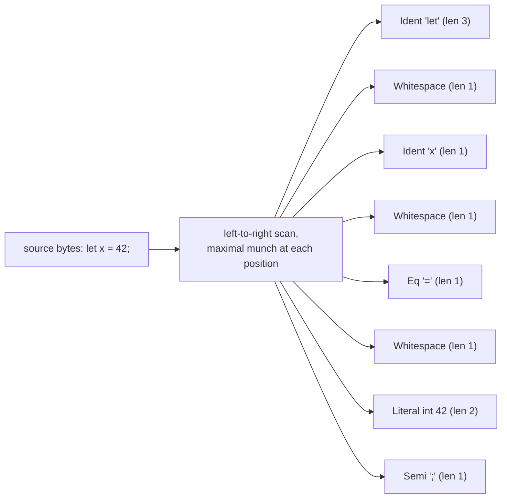
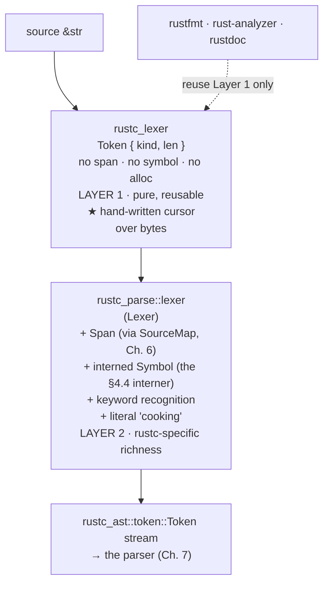
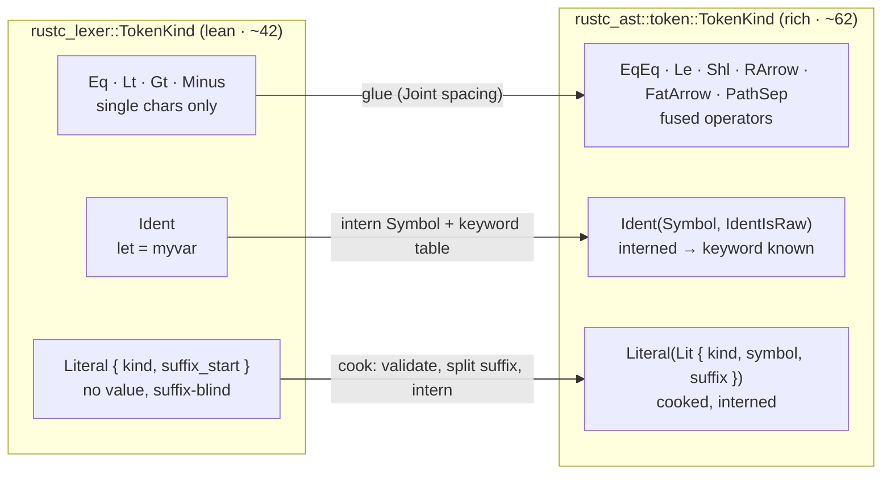
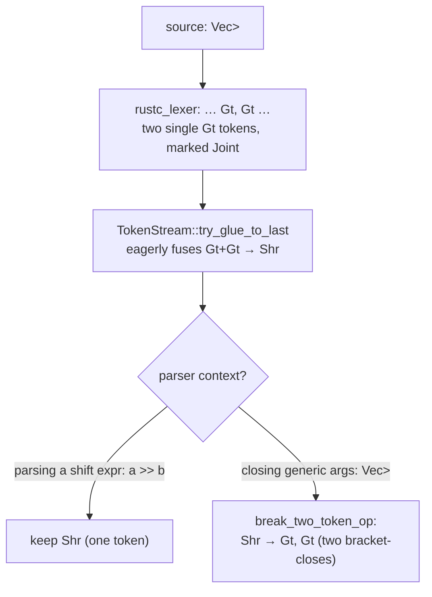
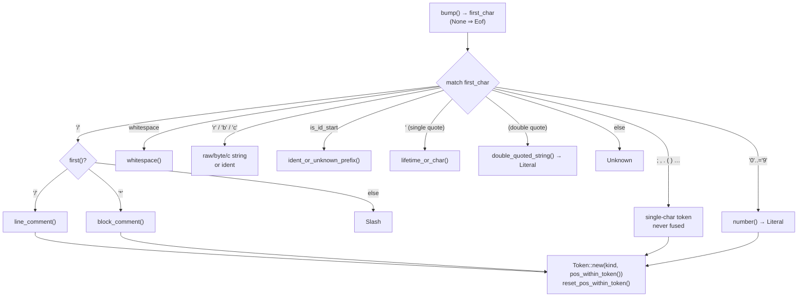
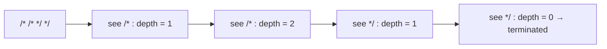
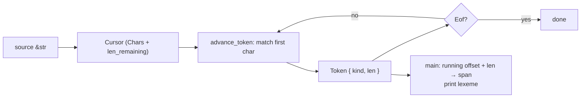
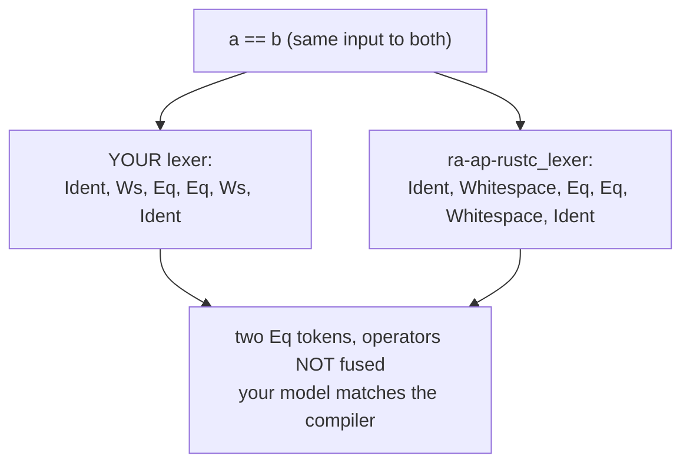

```admonish abstract title="What you'll learn"
- Why `rustc`, like GCC and Clang, hand-writes its lexer rather than generating one with `lex`/`flex`: diagnostics, control over non-regular corners, and reusability.
- The two-layer split: `rustc_lexer` (pure, allocation-free, `Token { kind, len }`) versus `rustc_parse::lexer::Lexer` (the cooker that adds [`Span`](../glossary.md#span), interned `Symbol`s, keyword recognition, and literal validation).
- The lean ~42-variant `rustc_lexer::TokenKind`: keywords undistinguished, literals suffix-blind, single-character operators never fused at Layer 1.
- The `Cursor`'s working vocabulary (`bump`, `first`, `second`, `eat_while`, `pos_within_token`) plus the `EOF_CHAR = '\0'` sentinel that keeps the hot path branch-free.
- How `advance_token` dispatches the whole language with one `match` on the first character, and how the non-regular helpers (nested `block_comment` depth counter, counted-hash raw strings) are the concrete reason hand-writing wins.
- How operator glueing actually happens: Layer 2 records `Spacing`, `TokenStream::try_glue_to_last` fuses eagerly, and `Parser::break_and_eat` un-glues contextually (the `>>` versus `Vec<Vec<i32>>` story).
```

## 5.1 The Theory, and Why rustc Hand-Writes Its Lexer

### Why rustc hand-writes its scanner

Every compilers course teaches the same lesson: don't hand-write a lexer, generate one from regular expressions. The canonical tool is `lex`, or its GNU successor `flex`, built at Bell Labs in the mid-1970s. You write regular expressions paired with actions; it compiles them into a finite-state machine that chops input into tokens. The Dragon Book gives the theory a whole chapter: regular languages, finite automata, and the subset construction that turns a nondeterministic automaton into a deterministic one.

Now open rustc's source. Or GCC's, or Clang's. There is no `.l` file and no generated state table. There is a hand-written lexer: a loop that looks at one character and decides what to do with a `match`. The rustc-dev-guide says it plainly, that although lexers are usually built as generated finite-state machines, rustc's is hand-written.

So the textbook is wrong, or at least every production compiler ignores it. Two questions follow, and they organize the chapter. Why hand-write the scanner? And why does rustc split it into two layers, a pure scanning core that rustfmt, rust-analyzer, and rustdoc can reuse, wrapped in a rustc-specific shell? Both answers start with the theory the design departs from.

### What lexing is: bytes, lexemes, tokens

Lexing is the pipeline's first transformation (Chapter 1): it turns a flat run of bytes, the source text, into a sequence of **tokens**, the atomic words of the language. The parser (Chapter 7) assembles those words into sentences without ever re-examining the letters. That pre-chunking is what makes parsing tractable; a parser forced to reason one character at a time would drown.

Three terms must be kept distinct, because the Dragon Book is precise about them and so is `rustc`:

- A **lexeme** is the actual run of source characters: the four bytes `l`, `e`, `t`; or the characters `4`, `2`; or `==`.
- A **token** is the *classified* lexeme: its category plus whatever data the later stages need: "this lexeme is a keyword `let`," "this is an integer literal with value 42," "this is the equality operator."
- A **token kind** (or token *type*) is just the category: `Ident`, `Literal`, `Eq`. Many lexemes share one kind.

The lexer scans lexemes and emits tokens. In theory the valid lexemes for each token kind form a **regular language**: an identifier is `[a-zA-Z_][a-zA-Z0-9_]`*, an integer is `[0-9]+` (with elaborations for `_`, hex, and so on), each describable by a regular expression and recognizable by a finite automaton. Because every kind is regular, one combined automaton can recognize them all at once. That is exactly what lex generates, and exactly what rustc declines to use.

```admonish tip title="Pro-Tip, keep kind and value separate"
A token splits its category from its span and its meaning. rustc's first lexer layer records only the kind and the length and defers the rest, which is what lets the core be reused by rustfmt, rust-analyzer, and rustdoc. That distinction is the key to the two-layer design below.
```

### Maximal munch: the one rule that makes scanning deterministic

One rule resolves nearly all the ambiguity in scanning, and every lexer obeys it, hand-written or generated: **maximal munch**, the longest-match rule. *At each position, take the longest run of characters that forms a valid token.*

Take `==`. The first `=` could be a complete assignment token, or the start of an equality `==`. Maximal munch says take the longer one: `==`, a single token. The same rule makes `>>` one shift-shaped token rather than two `>`s, which once made `Vec<Vec<i32>>` a lexing headache, since the parser *wants* two separate `>`s to close two generic brackets (a tension §5.2 resolves). It makes `1.2` one float, `r"..."` one raw string, and `foo123` one identifier rather than `foo` then `123`. Maximal munch is what makes a single left-to-right pass deterministic: one rule at each step, longest valid token, no backtracking in the common case.




The diagram hides two deliberate choices. `let` is lexed as a generic `Ident`, because recognizing it as a keyword needs the [interner](../glossary.md#interner), which lives a layer up. And whitespace is emitted as its own token, because downstream tools like rustfmt and macros need to see it. Both fall out of the architecture below.

### Why hand-written, not generated

So why does `rustc`, like GCC and Clang, hand-write its scanner rather than generate one from regular expressions? Three reasons, in increasing order of importance.

**Diagnostics.** A generated DFA is excellent at saying "valid" or "invalid" and terrible at saying *why*, or *what you probably meant*. Messages like "unterminated string literal; did you mean..." or detecting the Unicode bidirectional-override characters used in supply-chain attacks need the lexer to grasp the *shape* of what went wrong and carry context. That is easy with explicit branches and painful in a generated table where every state is anonymous.

**Control and performance.** Rust's lexical grammar has corners that resist pure regular expressions: raw strings with a variable number of `#`s (`r##"..."##`), nested block comments (`/* /* */ */`, which require *counting* and so are not regular), shebang lines, and now frontmatter. Hand-written code dispatches these in a few explicit lines; a regex engine has to be bent around them. And a tight loop over bytes, with no generated indirection, is simply fast.

**Reusability, the decision that shapes the chapter.** This is the real one. rustc splits the lexer so that the *pure* act of chopping text into token-shaped chunks is a standalone library, `rustc_lexer`, with no dependency on the rest of the compiler. Its stated goal is to keep pure lexing separate from rustc-specific concerns like spans, error reporting, and interning, so that other tools, rustfmt, rust-analyzer, and rustdoc, can reuse the exact lexing logic without dragging in the whole compiler. A generated, monolithic lexer welded to the compiler's data structures could never be shared this way.

### The two layers: a pure core and a rustc-specific shell

Reusability produces the architecture to hold in your head for the rest of the chapter. Lexing in rustc happens in **two stages, in two crates**:

**Layer 1, `rustc_lexer` (pure).** Operates directly on a `&str`. For each token it answers only two questions: *what kind?* and *how long?* Its `Token` is, faithfully:

```rust
// compiler/rustc_lexer/src/lib.rs  (faithful)
pub struct Token {
    pub kind: TokenKind, // the category: Ident, Literal{…}, LineComment, Whitespace, …
    pub len: u32, // how many bytes this token spans, and nothing else
}
```

Read what is *absent*. There is no `Span`: only a length. There is no interned `Symbol`: the identifier `foo` is not looked up or stored, merely measured. There is no value: the literal `42` is not parsed into the number 42, only recognized as a `Literal` of integer kind and length two. `rustc_lexer` does not even know that `let` is a keyword: as the diagram showed, it emits `let` as a plain `Ident`. The crate's documentation is blunt about this: a `Token` contains no information about the data that was parsed, only the type of the token and its size. It is the leanest possible description of a lexeme, a tag and a width, and it allocates nothing.

**Layer 2, `rustc_parse::lexer` (the `Lexer`).** Here the rustc-specific richness is added. It drives `rustc_lexer` across the source and *cooks* each lean token into a `rustc_ast::token::Token`: it computes the token's `Span` (turning the running byte offset plus the length into a real source location, via the `SourceMap` of Chapter 6); it **interns** identifiers and literal contents into `Symbol`s (the `u32`-index interner you built in §4.4); it **recognizes keywords** (now that it can compare the interned symbol against the keyword table, `let` becomes the keyword it is); and it cooks literals, validating escapes, catching unterminated strings, and flagging the Unicode attacks. The dev-guide's framing: this layer integrates `rustc_lexer` with data structures specific to rustc.




The highlighted layer is the reusable core. An external tool that only needs to *chunk* Rust source, say, a syntax highlighter, links `rustc_lexer` alone and never pays for spans, interning, or the compiler's data structures. The compiler itself is just the most demanding consumer of that core, wrapping it in the shell that adds everything a full front end requires.

```admonish warning title="Warning, rustc_lexer::Token is not rustc_ast::token::Token"
There are two types named `Token` in the front end, one per layer, and confusing them is a classic stumble. `rustc_lexer::Token` is the lean `{ kind, len }` from Layer 1: no span, no symbol. `rustc_ast::token::Token` is the rich, cooked token from Layer 2 that the parser actually consumes. It carries a `Span` and, for identifiers and literals, an interned `Symbol`. When you read front-end source, always know *which* `Token` you are looking at; the crate path (`rustc_lexer::` vs `rustc_ast::token::`) is the tell.
```

### How this builds on Part 0

Notice how much of Part 0 quietly underwrites this design. Layer 1 can omit spans because `Span` (Chapter 6) is a separate concern layered on top: the lexer tracks only lengths, and offset plus length *becomes* a span in Layer 2. It can omit symbols because interning (§4.2) is its own service, and the `Symbol` Layer 2 produces is exactly the `u32`-index interner you rebuilt by hand in §4.4, decoupling an identifier's identity from any lifetime so it flows freely through the [AST](../glossary.md#ast). Even `rustc_lexer`'s *purity*, a function from `&str` to tokens with no global state, rhymes with the [query system](../glossary.md#query) of Chapter 3. The front end is not a new world; it is Part 0's principles applied to reading source.

### Where this leaves us

We have the theory and the shape. Lexing turns bytes into tokens; the textbook generates an automaton from regular expressions, but rustc, like its production peers, hand-writes the scanner, for diagnostics, for control over Rust's non-regular corners, and above all for reusability. That reusability forces the two-layer split: `rustc_lexer` is a pure, allocation-free core whose `Token` is just a kind and a length, and `rustc_parse::lexer` is the shell that cooks those into span-bearing, symbol-interning, keyword-aware `rustc_ast::token::Token`s. Maximal munch keeps the scan deterministic.

We have not opened either layer. §5.2 does: the real `TokenKind` and the surprises in what it does and does not distinguish, how the `Cursor` walks the bytes, and what cooking a token entails. §5.3 then reads the genuine `Cursor::advance_token` line by line, and §5.4 puts you to work building a lexer of your own.

## 5.2 The Architecture: `TokenKind`, the `Cursor`, and Cooking Tokens

### The operator the lexer refuses to build

Open `rustc_lexer`'s `TokenKind` expecting Rust's operators, and you get a surprise. There is `Eq` for `=`, `Lt` for `<`, `Gt` for `>`, `And` for `&`, `Or` for `|`, `Minus` for `-`. But there is no `EqEq`. No `Le`, no `Ge`, no `AndAnd`, no `Shl`, no `RArrow`, no `FatArrow`. The lexer that §5.1 said obeys maximal munch appears, for operators, to refuse it: `==` comes out as *two* `Eq` tokens, `->` as `Minus` then `Gt`, `<<` as two `Lt`s. For word-like tokens, identifiers, numbers, strings, it greedily takes the longest run, as promised. For operator punctuation it stubbornly emits one character at a time.

This is not an oversight. It resolves the `>>` tension §5.1 left hanging, and it is the doorway into the architecture. Recall the problem: in `a >> b`, `>>` is one right-shift operator; in `Vec<Vec<i32>>` it is *two* separate closing brackets. A lexer that maximal-munched `>>` into one shift token would make `Vec<Vec<i32>>` unparseable without an ugly hack, older C++ compilers literally required `Vec<Vec<i32> >`, with a space, for exactly this reason. rustc sidesteps the whole problem by **never fusing operator characters in the lexer at all.** It emits single-character punctuation and lets a *later* stage decide, from grammatical context, whether two adjacent `>`s mean a shift or two closes. The rest of this section is the payoff: what the lean Layer-1 tokens look like, how the `Cursor` produces them, and how Layer 2 cooks them, including gluing single characters back into compound operators when, and only when, the grammar asks.

### The real `TokenKind`: lean variants

Here is a close-read excerpt of the Layer-1 `TokenKind` [VERIFY against current rustc]; the full enum lives in `compiler/rustc_lexer/src/lib.rs`:

```rust
// compiler/rustc_lexer/src/lib.rs  (faithful; ~30 variants elided as // …)
pub enum TokenKind {
    // trivia variants the parser skips, including ↓ which is semantically meaningful
    LineComment  { doc_style: Option<DocStyle> }, // // …  and  /// …
    // …
    // foo, let, struct: keywords undistinguished
    Ident,
    // 42, 1.0e-3, "hi": no value, suffix split deferred
    Literal { kind: LiteralKind, suffix_start: u32 },
    // …
    // single-character punctuation, not combined at Layer 1
    Eq, Lt, Gt, Minus, And, Or, Plus, Star, Slash, /* … */
    // …
    Unknown, // e.g. a stray №, drives diagnostics
    Eof,
}
```

Three things in this enum repay close attention, because each reveals a design principle.

**First, keywords are not a category.** There is `Ident`, and that is all. `let`, `struct`, `fn`, and `myVariable` are *all* `Ident` at this layer. The lexer does not own the keyword list; it merely recognizes "this is an identifier-shaped run of characters." Keyword recognition is deferred to Layer 2, for a reason that connects straight to Part 0: deciding `let` is a keyword requires *interning* it and comparing against a keyword table, and interning is Layer 2's job (§4.2, §4.4). The lexer stays ignorant of semantics so it can stay a pure, reusable chunker.

**Second, comments carry a `doc_style`.** Notice `LineComment { doc_style: Option<DocStyle> }`. The lexer *does* bother to distinguish `/// a doc comment` from `// an ordinary comment`, even though both are "trivia." Why spend a field on it? Because doc comments are not trivia at all. They are *semantically meaningful*: `///` desugars into a `#[doc = "…"]` attribute that the compiler actually processes. So the lexer flags doc-ness here, at the only place that cheaply can, even while treating the comment as skippable for parsing. It is a small, instructive exception to "comments don't matter."

**Third, literals are recognized but not understood.** `Literal { kind: LiteralKind, suffix_start: u32 }` says "this is a literal, of this rough kind, and the type suffix (if any) starts at this byte offset." It does *not* contain the value. The literal `42` is not the number 42; it is a `Literal` whose `kind` is integer and whose bytes happen to be `4` and `2`. Parsing `42` into an actual integer, and validating `"\q"` is a bad escape, and rejecting `1_f32`'s stray underscore, is **cooking**, Layer 2's job. The lexer measures; it does not interpret.

### `LiteralKind`: deliberately coarse

The `kind` inside a literal token is its own enum, and it is instructive precisely because of what it *gets wrong on purpose*:

```rust
// compiler/rustc_lexer/src/lib.rs  (faithful; 7 variants elided as // …)
pub enum LiteralKind {
    Int { base: Base, empty_int: bool }, // 42, 0xFF, 0b1010
    Str { terminated: bool }, // "hi": tag, don't fail
    RawStr { n_hashes: Option<u8> }, // r#"hi"#: counted-# matching
    // …Float { empty_exponent }, Char/Byte/ByteStr/CStr { terminated },
    // …RawByteStr/RawCStr { n_hashes } follow the patterns above
}
```

The documentation flags the deliberate coarseness directly: the *suffix is not considered* when deciding the `LiteralKind`, so a float literal written `1f32` is classified here as `Int`: because lexically it begins as an integer `1` followed by a suffix `f32`, and only cooking, with full knowledge of suffixes, will reclassify it as a float. The `terminated: bool` and `n_hashes` fields exist not to interpret the literal but to carry *just enough* information for Layer 2 to produce a good error: "unterminated string starting here," "raw string with mismatched `#`s." This is the recurring pattern: Layer 1 records the minimum that lets Layer 2 do the rich work.

```admonish warning title="Warning, three different LiteralKind/LitKind types"
Rust's front end has *three* literal-classification enums, and they are not interchangeable. `rustc_lexer::LiteralKind` (above) is the coarse, suffix-blind lexer view. `rustc_ast::token::LitKind` is the cooked token view. `rustc_ast::ast::LitKind` is the fully-parsed AST view that actually holds the *value*. The dev-guide and the source explicitly tell you to compare them. When you read front-end code touching literals, identify *which* of the three you are in, or you will misread what information is available.
```

### The `Cursor`: a single pass over characters

Layer 1 produces these tokens through the `Cursor`, which its docs call a peekable iterator over a character sequence. It holds the remaining input and offers a tiny vocabulary: `bump()` consumes and returns the next character, `first()` peeks without consuming, `second()` peeks one further, and a sentinel `EOF_CHAR` (`'\0'`) is returned past the end so the hot path never needs an `Option` check. The one public driver is `advance_token`: a `match` on the first byte that decides what token starts here and consumes its full extent. `tokenize(&str)` just calls `advance_token` in a loop, yielding an iterator of `Token`s. No allocation, no lookahead buffer beyond a couple of characters, no DFA table, just a cursor and a `match`. §5.3 reads the real `advance_token` line by line; for now, hold the shape: *one character of lookahead decides the token, maximal munch consumes its body, a `Token { kind, len }` falls out.*

### Layer 2: cooking lean tokens into rich ones

Now the shell. `rustc_parse::lexer`, its central type the `Lexer`, drives `rustc_lexer` across the source and turns each lean `Token { kind, len }` into the rich `rustc_ast::token::Token` the parser consumes. That transformation is "cooking," and it does four jobs.

**Job 1, attach a `Span`.** The `Lexer` tracks a running byte offset. A lean token's `len` plus that offset becomes a `Span` (Chapter 6): a compact handle to "bytes 1042..1045 of this source file," resolvable later, via the `SourceMap`, into "line 30, column 4 of `main.rs`." This is *why* Layer 1 needs only a length: the absolute position lives in the driver, and offset + length = span.

**Job 2, intern symbols and recognize keywords.** For an `Ident`, the cooker interns the identifier's text into a `Symbol` (the `u32`-index interner of §4.4). Now keyword recognition becomes trivial: compare the interned `Symbol` against the pre-interned keyword symbols. The cooked token is `Ident(Symbol, IdentIsRaw)`: still nominally an identifier, but its `Symbol` *is* the keyword's identity, so the parser knows `let` from `myvar` by a single integer comparison. Interning is what turned a bare character-run into a recognizable keyword.

**Job 3, cook literals.** The coarse `Literal { kind, suffix_start }` is validated and refined: escapes are checked, unterminated strings and bad escapes become diagnostics, the suffix is split off (now stored separately as `Some(Symbol)`), and the contents are interned. The cooked form is `Literal(Lit { kind, symbol, suffix })`: still suffix-blind for `1f32` (it stays `Integer` here, with `suffix = Some("f32")`), with full reclassification to `Float` deferred to AST-literal construction. (The *value*, turning `"42"` into `42u128`, also comes at the AST level; recall the three-enum warning.)

**Job 4, record spacing so the stream can glue, and the parser can un-glue.** Here is the operator puzzle resolved. As the cooker emits single-character punctuation, it records each token's `Spacing`: `Joint` if the next token is abutting punctuation, `JointHidden` if it abuts a non-punctuation token (identifier, literal, delimiter, doc-comment), and `Alone` if whitespace or EOF follows. (You met `Spacing` in §1.2, riding inside [`TokenTree`](../glossary.md#token-tree); for operator-glueing, only `Joint` matters.) The actual fusing happens **eagerly, at `TokenStream` construction**: `rustc_ast::tokenstream::TokenStream::try_glue_to_last` calls `Token::glue` on a `Joint`-spaced token and its predecessor, so two abutting `Gt`s become a single `Shr` token in the stream. The **parser** (Chapter 7) then *un*-glues when its grammar wants the single characters back: `Parser::break_and_eat` calls `break_two_token_op`, which splits `Shr` back into `Gt`+`Gt` when closing generic brackets in `Vec<Vec<i32>>`. The call is *contextual*, made by the parser that knows what it expects, which is exactly what `Spacing` enables: glue early, un-glue when needed.

The cooked `rustc_ast::token::TokenKind` is correspondingly richer (62 variants), and it is where the compound operators finally live: `EqEq`, `Le`, `Ge`, `Ne`, `AndAnd`, `OrOr`, `Shl`, `Shr`, `RArrow` (`->`), `FatArrow` (`=>`), `PathSep` (`::`), `DotDotEq` (`..=`), alongside `Literal(Lit)`, `Ident(Symbol, IdentIsRaw)`, and `DocComment(CommentKind, AttrStyle, Symbol)`. Lexer tokens are lean and single; parser tokens are rich and fused.




### How `>>` actually gets resolved

Trace the famous case end to end, because it is the whole architecture in one example:




The lexer's refusal to commit, emitting two joint `Gt`s rather than pre-fusing them, is what gives the stream the freedom to glue eagerly and the parser the freedom to un-glue contextually. A lexer that maximal-munched operators *and* threw away the adjacency would have destroyed the information the parser needs. The single-character `TokenKind` plus the `Spacing` tag is the design that lets the stream commit one way and the parser, knowing whether it expects a shift or a closing bracket, undo that commit when the grammar demands it. (The `Spacing` is also recorded so tools like `rustfmt` and proc-macros can still see that the two `>`s were written abutting.)

### Where this leaves us

The architecture is in hand. Layer 1's `TokenKind` is a lean ~42-variant enum of *categories*: trivia (with the telling `doc_style` exception), words (`Ident`, keywords undistinguished; suffix-blind `Literal`s), and single-character punctuation, deliberately never fused. The `Cursor` produces these in one allocation-free pass driven by `advance_token`. Layer 2's `Lexer` then cooks each into a rich `rustc_ast::token::Token`: it attaches a `Span` (offset plus length), interns identifiers into `Symbol`s and so recognizes keywords, validates and refines literals, and records `Spacing` so the parser can glue single characters into the ~62 compound operators *contextually*. That is how `>>` serves both shifts and nested generics.

We have described `advance_token` without reading it. §5.3 opens `compiler/rustc_lexer/src/lib.rs` and walks the real `Cursor` and `advance_token` line by line: the `match` on the first character, the helpers for identifiers and numbers, and the genuinely non-regular cases (nested block comments, counted-`#` raw strings) that justified hand-writing in the first place. Then §5.4 has you build a working lexer of your own.

## 5.3 Reading the Source: `Cursor` and `advance_token`, Line by Line

### `advance_token`: the dispatch loop

Every Rust source file passes through `Cursor::advance_token` in `compiler/rustc_lexer/src/lib.rs`. It is the single place where raw text first becomes structure. No DFA tables, no generated code, no allocation: just a `match` on one character with about forty arms. §5.2 described its shape from outside; here we read it, top to bottom, including the two helper scanners, nested block comments and counted-hash raw strings, that are the concrete justification for hand-writing the whole thing.

Four pieces, in order: the `tokenize` driver, the `Cursor` primitives, the `advance_token` dispatch itself, and the non-regular helpers. By the end you will have read the actual front door of the Rust compiler.

### The driver: `tokenize`

The public entry point is tiny, and verified verbatim against the source:

```rust
// compiler/rustc_lexer/src/lib.rs  (faithful, exact)
pub fn tokenize(
    input: &str,
    frontmatter_allowed: FrontmatterAllowed,
) -> impl Iterator<Item = Token> {
    let mut cursor = Cursor::new(input, frontmatter_allowed);
    std::iter::from_fn(move || {
        let token = cursor.advance_token();
        if token.kind != TokenKind::Eof { Some(token) } else { None }
    })
}
```

That is the whole lexer-as-a-stream: build a `Cursor` over the input, then repeatedly call `advance_token` until it returns `Eof`, yielding each `Token` lazily. `std::iter::from_fn` makes it a pull-based iterator: the consumer (Layer 2's `Lexer`) asks for one token at a time, and only then does the cursor advance. Nothing is buffered; nothing is allocated. The `frontmatter_allowed` flag is a small recent wrinkle (frontmatter is only legal at the very top of a file), threaded through so the same scanner can be reused on document slices where frontmatter must be rejected.

### The `Cursor`: five primitives and a sentinel

The `Cursor` is described in its docs as a peekable iterator over a character sequence, and its working vocabulary is deliberately tiny. The methods you will see invoked throughout `advance_token`, all verified by name against the source:

```rust
// compiler/rustc_lexer/src/lib.rs  (pedagogical: signatures only; real impl has bodies and pub(crate) visibility)
impl Cursor<'_> {
    fn bump(&mut self) -> Option<char>; // consume and return the next char
    fn first(&self) -> char; // peek 1 ahead (EOF_CHAR past the end)
    fn second(&self) -> char; // peek 2 ahead
    fn third(&self) -> char; // peek 3 ahead
    fn is_eof(&self) -> bool; // nothing left to consume
    fn eat_while(&mut self, pred: impl FnMut(char) -> bool); // consume while pred holds
    // bytes consumed since last reset → the token's len
    fn pos_within_token(&self) -> u32;
    fn reset_pos_within_token(&mut self); // zero the per-token counter
}
const EOF_CHAR: char = '\0'; // the past-the-end sentinel
```

Two of these carry the section's quiet themes. `EOF_CHAR` is the **sentinel** trick: `first()` returns `'\0'` past the end of input rather than an `Option`, so the hot-path `match` never has to branch on "did we run out?" for every peek. End-of-input simply falls through to the `Unknown`/default arm or is caught by `is_eof` where it matters. And `pos_within_token` is **how `len` is computed**: the cursor counts bytes consumed since the last reset, so when a token finishes, that count *is* its length. This is the mechanism behind §5.2's "`Token` is just kind + length": the length is a running byte counter, nothing more. `eat_while` is the maximal-munch workhorse: hand it a predicate and it greedily consumes the longest run satisfying it.

```admonish tip title="Pro-Tip, first is peek, bump is consume"
A common confusion when reading lexer code is mixing the peeking methods (`first`, `second`, `third`, look but don't move) with the consuming method (`bump`, take and advance). A lexer is a constant dance of "peek to decide, then bump to commit." When you read `advance_token`, track which is which and the logic becomes transparent: every decision is a `first()`, every commitment is a `bump()` or an `eat_while()`.
```

### `advance_token`: one character, forty branches

Here is the spine of the lexer; the full ~40-arm match lives in `compiler/rustc_lexer/src/lib.rs` [VERIFY against current rustc]:

```rust
// compiler/rustc_lexer/src/lib.rs  (faithful; ~30 arms and a frontmatter post-cleanup elided)
pub fn advance_token(&mut self) -> Token {
    let Some(first_char) = self.bump() else {
        return Token::new(TokenKind::Eof, 0);
    };
    let token_kind = match first_char {
        '/' => match self.first() { // ① peek to disambiguate
            '/' => self.line_comment(),
            '*' => self.block_comment(),
            _   => Slash,
        },
        // ② word-like and number arms eat_while to maximal-munch
        // ③ single-char punctuation: ONE char, ONE token, never fused
        '=' => Eq, '<' => Lt, '>' => Gt, /* …rest of the ~40 arms… */
        _ => Unknown,
    };
    // (frontmatter-mode post-arm cleanup elided here)
    let res = Token::new(token_kind, self.pos_within_token());
    self.reset_pos_within_token();
    res
}
```

Read the rhythm. `bump()` takes the first character (or returns `Eof` if there is none). The big `match` dispatches on that one character. For most cases a single character settles the matter; the only places needing lookahead are exactly where Rust's grammar is genuinely ambiguous on the first character: `/` (divide? line comment? block comment?), `r` (identifier? raw string? raw identifier?), `'` (lifetime `'a`? char literal `'a'`?). Each resolves with a `first()`/`second()` peek, never a backtrack. When the kind is decided, `Token::new(kind, self.pos_within_token())` packages it with the byte length the cursor accumulated, and `reset_pos_within_token()` zeroes the counter for the next call. That final pair of lines is `Token { kind, len }` being born.

And there, in the punctuation block, is §5.2's whole argument made literal: `'=' => Eq`, `'<' => Lt`, `'>' => Gt`. Each operator character maps to its own single-character token and the `match` moves on. There is no arm that peeks ahead to fuse `==` or `>>`. The lexer commits to *one character* and leaves fusing to the parser. The design decision is right here, in the absence of code that would have combined them.




### Why hand-written: the two non-regular helpers

§5.1 claimed Rust's lexical grammar has corners that *cannot* be expressed as regular expressions, which is the deepest reason the lexer is hand-written rather than generated. Now we can see those corners in code. Two helpers are the proof.

**Nested block comments.** A regular language cannot count arbitrary nesting depth. That requires unbounded memory, which finite automata, by definition, lack. But Rust block comments nest: `/* outer /* inner */ still outer */` is a single comment. So `block_comment` keeps an explicit **depth counter**:

```rust
// compiler/rustc_lexer/src/lib.rs  (faithful)
fn block_comment(&mut self) -> TokenKind {
    self.bump(); // eat the '*' after the '/'
    let doc_style = match self.first() {
        '!' => Some(DocStyle::Inner), // /*! … */
        // /** … */ but NOT /*** or /**/
        '*' if !matches!(self.second(), '*' | '/') => Some(DocStyle::Outer),
        _ => None,
    };
    let mut depth = 1usize;
    while let Some(c) = self.bump() {
        match c {
            '/' if self.first() == '*' => { self.bump(); depth += 1; }  // nested open
            '*' if self.first() == '/' => { self.bump(); depth -= 1; if depth == 0 { break; } }
            _ => (),
        }
    }
    // unterminated if depth never hit 0
    BlockComment { doc_style, terminated: depth == 0 }
}
```

The moment you write `depth += 1` you have left the world of regular languages. A generated lexer built from regular expressions *could not do this*, and would either reject nested comments or require a special-cased extension. The hand-written scanner handles it in four lines, and even records `terminated: depth == 0` so Layer 2 can emit "unterminated block comment" pointing at the right place.




**Counted-hash raw strings.** The same impossibility appears in `r##"…"##`: a raw string opens with some number *n* of `#`s and closes only on `"` followed by the *same* `n` `#`s. Matching a count of one delimiter against a count of another is, again, beyond regular languages. The raw-string helper counts the opening `#`s, remembers *n*, then scans for a closing `"` followed by exactly *n* `#`s, recording `n_hashes` in the `LiteralKind` so a mismatch becomes a precise diagnostic. Two of Rust's everyday lexical features, nested comments and raw strings, are each formally non-regular; that is not a curiosity but the core engineering reason rustc's lexer is the hand-written `match` we just read rather than a generated automaton.

```admonish warning title="Warning, the lexer tags and moves on"
Notice what `block_comment` does on an unterminated comment: it does *not* panic or return an error. It returns `BlockComment { terminated: false }` and keeps going. The same pattern runs throughout: bad input becomes `Unknown`, `terminated: false`, `Option<u8>::None` hashes. The lexer is designed to produce a token stream even for broken input, so that the IDE and the parser have something to work with and error recovery can proceed. Diagnostics are Layer 2's responsibility, raised from these tags. The lexer only *records* what was wrong.
```

### How this builds on what came before

This walkthrough closes the loop on the previous two sections. The single-character punctuation arms are 5.2's "never fuse operators" decision, visible as the literal absence of fusing code. The `pos_within_token` counter is §5.1's and §5.2's "length, not span": the length is a byte tally the cursor keeps, and the span is built later from offset plus that length. The `terminated` and `n_hashes` tags are the "record the minimum for Layer 2 to cook" pattern. And the whole allocation-free, table-free directness is what lets `rustc_lexer` be the reusable, dependency-light core that rustfmt and rust-analyzer borrow. You are now looking at the same code those tools run.

### Where this leaves us

We have read the front door. `tokenize` turns a `&str` into a lazy iterator by calling `advance_token` to `Eof`; the `Cursor` walks bytes with `bump`/`first`/`eat_while` and counts length via `pos_within_token`, using `EOF_CHAR` to keep the hot path branch-free; `advance_token` is a single `match` on the first character, resolving the few genuinely ambiguous starts (`/`, `r`, `'`) with a peek and emitting one `Token { kind, len }` per call, single-character operators included; and the `block_comment` depth counter and raw-string hash counting are the concrete, non-regular features that make hand-writing not just preferable but *necessary*. Throughout, the lexer never errors. It tags and continues, leaving diagnostics to Layer 2.

§5.4 turns reading into building. You will write a small but real lexer for a Rust-like toy language: a cursor, an `advance_token` with the same single-character-dispatch shape, maximal munch via an `eat_while`, and a nested-block-comment scanner with the very depth counter you just read. Then instrument it and run it against `rustc_lexer` itself on real input, watching your tokens line up with the compiler's. The front door, rebuilt in your own hands.

## 5.4 Hands-On Lab: Build a Lexer, and Drive `rustc_lexer` Yourself

### The convergence test

To check your understanding of `advance_token`, write your own and run it beside `rustc_lexer` on the same input, token for token. That is this lab. In **Lab A** you build a small lexer that mirrors `rustc_lexer`'s design: the `Cursor`, the single-character `match`, maximal munch via `eat_while`, and the nested-block-comment depth counter from §5.3. In **Lab B** you add the *real* `rustc_lexer` as a dependency (it is published to crates.io) and tokenize the same source with it. When your toy tokens line up with the compiler's, including the two separate `Eq`s for `==` that §5.2 promised, your mental model is validated against the genuine article.

Like §4.4, this lab needs nothing exotic: a `cargo new` project and, for Lab B, one dependency. No nightly, no compiler build.

### Lab A, build a lexer that mirrors `rustc_lexer`

```bash
cargo new --bin lexer-lab && cd lexer-lab
```

We will lex a tiny Rust-ish language: identifiers, integers, whitespace, line and (nested) block comments, and the single-character operators. The design follows §5.3 deliberately, including the real `Cursor`'s trick of holding a `Chars` iterator and computing length from the remaining-bytes delta.

```rust
// src/main.rs
const EOF_CHAR: char = '\0';

#[derive(Debug, PartialEq, Clone, Copy)]
enum DocStyle { Outer, Inner }

#[derive(Debug, PartialEq, Clone, Copy)]
enum Base { Decimal, Hex, Bin, Oct }

// The Layer-1 envelope from §5.2: a literal is tagged and measured, never
// understood. `kind` carries the coarse shape (here just integers, but
// extension 2 adds Str); `suffix_start` is the byte offset where a possible
// type suffix begins, mirroring rustc's two-tier `Literal { kind, suffix_start }`
// / `LiteralKind::Int { base, .. }` shape.
#[derive(Debug, PartialEq, Clone, Copy)]
enum LiteralKind {
    Int { base: Base }, // extension: Str { terminated }, RawStr { n_hashes }, ...
}

#[derive(Debug, PartialEq, Clone, Copy)]
enum TokenKind {
    Ident, Whitespace,
    LineComment { doc_style: Option<DocStyle> },
    BlockComment { doc_style: Option<DocStyle>, terminated: bool },
    // tagged-and-measured literal: kind + where the suffix would begin
    Literal { kind: LiteralKind, suffix_start: u32 },
    // single-character operators, NEVER fused (the §5.2/§5.3 decision)
    Plus, Minus, Star, Slash, Eq, Lt, Gt,
    OpenParen, CloseParen, OpenBrace, CloseBrace, Semi,
    Unknown, Eof,
}

#[derive(Debug)]
struct Token { kind: TokenKind, len: u32 }

impl Token {
    fn new(kind: TokenKind, len: u32) -> Token { Token { kind, len } }
}

// The Cursor mirrors rustc_lexer's real design: a Chars iterator plus a
// "bytes remaining at the start of this token" marker. Length = the delta.
struct Cursor<'a> {
    len_remaining: usize,
    chars: std::str::Chars<'a>,
}

impl<'a> Cursor<'a> {
    fn new(input: &'a str) -> Self {
        Cursor { len_remaining: input.len(), chars: input.chars() }
    }
    fn first(&self) -> char {
        // peek without consuming; EOF_CHAR past the end (the §5.3 sentinel)
        self.chars.clone().next().unwrap_or(EOF_CHAR)
    }
    fn bump(&mut self) -> Option<char> {
        self.chars.next()
    }
    fn is_eof(&self) -> bool {
        self.chars.as_str().is_empty()
    }
    fn pos_within_token(&self) -> u32 {
        (self.len_remaining - self.chars.as_str().len()) as u32
    }
    fn reset_pos_within_token(&mut self) {
        self.len_remaining = self.chars.as_str().len();
    }
    fn eat_while(&mut self, mut pred: impl FnMut(char) -> bool) {
        while pred(self.first()) && !self.is_eof() {
            self.bump();
        }
    }
}

fn is_id_start(c: char) -> bool { c == '_' || c.is_alphabetic() }
fn is_id_continue(c: char) -> bool { c == '_' || c.is_alphanumeric() }
// Real rustc uses unicode_ident::is_xid_start / is_xid_continue (the Unicode
// Standard's XID profile); is_alphabetic / is_alphanumeric is the
// no-dependency approximation and they do not agree on every char.
```

That `Cursor` is the load-bearing core of rustc's: `chars: Chars<'a>` plus `len_remaining: usize` with `pos_within_token` as exactly this subtraction. The real `Cursor` adds two fields we omit: `frontmatter_allowed` (the recent feature gate threaded through `advance_token`) and a debug-only `prev: char` that powers `debug_assert!(self.prev() == ...)` invariant checks scattered through every scanner helper. Now the heart, `advance_token`, with the same shape you read in §5.3:

```rust
impl Cursor<'_> {
    fn advance_token(&mut self) -> Token {
        let Some(first_char) = self.bump() else {
            return Token::new(TokenKind::Eof, 0);
        };
        let kind = match first_char {
            '/' => match self.first() {
                '/' => self.line_comment(),
                '*' => self.block_comment(),
                _   => TokenKind::Slash,
            },
            c if c.is_whitespace() => { self.eat_while(|c| c.is_whitespace()); TokenKind::Whitespace }
            c if is_id_start(c) => { self.eat_while(is_id_continue); TokenKind::Ident }
            '0'..='9' => {
                self.eat_while(|c| c.is_ascii_digit());
                // record suffix_start the moment the digits end, mirroring rustc's
                // `Cursor::number` → `Literal { kind, suffix_start }` envelope.
                let suffix_start = self.pos_within_token();
                TokenKind::Literal { kind: LiteralKind::Int { base: Base::Decimal }, suffix_start }
            }

            // single-character operators: one char, one token, no fusing
            ';' => TokenKind::Semi,
            '(' => TokenKind::OpenParen, 
            ')' => TokenKind::CloseParen,
            '{' => TokenKind::OpenBrace, 
            '}' => TokenKind::CloseBrace,
            '+' => TokenKind::Plus, '-' => TokenKind::Minus, 
            '*' => TokenKind::Star,
            '=' => TokenKind::Eq, '<' => TokenKind::Lt,    
            '>' => TokenKind::Gt,
            _ => TokenKind::Unknown,
        };
        let token = Token::new(kind, self.pos_within_token());
        self.reset_pos_within_token();
        token
    }

    // Line comments are flat, but they still flag doc-ness: `///` outer,
    // `//!` inner, and `////` is *not* a doc comment (the fourth `/` cancels).
    fn line_comment(&mut self) -> TokenKind {
        // we already consumed the first '/'; first() is the second '/'
        self.bump(); // eat the second '/'
        let doc_style = match self.first() {
            '!' => Some(DocStyle::Inner), // //! ...
            // /// ... but NOT //// ...; peek a char beyond first() to disambiguate.
            '/' => {
                let mut probe = self.chars.clone();
                probe.next(); // skip the '/' that first() reports
                if probe.next() == Some('/') { None } else { Some(DocStyle::Outer) }
            }
            _ => None,
        };
        self.eat_while(|c| c != '\n');
        TokenKind::LineComment { doc_style }
    }

    // The non-regular helper from §5.3: nested comments need a depth counter.
    // We also flag doc-ness on the way in, exactly as the real `block_comment` does.
    fn block_comment(&mut self) -> TokenKind {
        self.bump(); // eat the '*' after '/'
        // /*! ... */ is inner, /** ... */ is outer, but /*** and /**/ are not docs.
        let doc_style = match self.first() {
            '!' => Some(DocStyle::Inner),
            '*' => {
                let mut probe = self.chars.clone();
                probe.next();
                match probe.next() {
                    Some('*') | Some('/') => None, // /*** or /**/ : not a doc comment
                    _ => Some(DocStyle::Outer),
                }
            }
            _ => None,
        };
        let mut depth = 1;
        while let Some(c) = self.bump() {
            match c {
                '/' if self.first() == '*' => { self.bump(); depth += 1; }
                '*' if self.first() == '/' => { self.bump(); depth -= 1; if depth == 0 { break; } }
                _ => {}
            }
        }
        TokenKind::BlockComment { doc_style, terminated: depth == 0 }
    }
}

fn tokenize(input: &str) -> impl Iterator<Item = Token> + '_ {
    let mut cursor = Cursor::new(input);
    std::iter::from_fn(move || {
        let token = cursor.advance_token();
        (token.kind != TokenKind::Eof).then_some(token)
    })
}
```

Finally, a `main` that does Layer 2's *first* job, turning each token's `len` into a span by tracking a running offset, and prints the lexeme it covers:

```rust
fn main() {
    let src = "fn main() { let x = 42 + 1; /* a /* nested */ comment */ }";
    let mut pos = 0;
    for tok in tokenize(src) {
        let end = pos + tok.len as usize;
        println!("{:>3}..{:<3} {:<28?} {:?}", pos, end, tok.kind, &src[pos..end]);
        pos = end;
    }
}
```

Run `cargo run`.

```admonish example title="What you should see" collapsible=true
You will see `fn` and `main` and `let` and `x` all reported as plain `Ident` (no keyword distinction, §5.2's deferral), `42` and `1` as `Literal { kind: Int { base: Decimal }, suffix_start: 2 }` and `Literal { kind: Int { base: Decimal }, suffix_start: 1 }` (the envelope from §5.2: a kind tag plus the byte offset where a suffix *would* begin, in a suffix-less integer that is just the length of the digit run), the whole `/* a /* nested */ comment */` collapsed into a single `BlockComment { doc_style: None, terminated: true }` (the depth counter handled the nesting, the doc-style probe correctly saw no `*` or `!` after the opener), and the operators each as their own single-character token.
```

Build a span-bearing view of a program, from scratch, in about a hundred lines: the same architecture as the real thing.




### Lab B, drive the *real* `rustc_lexer`

Now the convergence test. `rustc_lexer` is republished to crates.io under the name `ra-ap-rustc_lexer`. Add it:

```bash
cargo add ra-ap-rustc_lexer
```

```rust
// a second binary, or replace main.rs temporarily
use ra_ap_rustc_lexer::{tokenize, FrontmatterAllowed};

fn main() {
    let src = "fn main() { let x = 42 + 1; /* a /* nested */ comment */ }";
    let mut pos = 0;
    for tok in tokenize(src, FrontmatterAllowed::No) {
        let end = pos + tok.len as usize;
        println!("{:>3}..{:<3} {:<32?} {:?}", pos, end, tok.kind, &src[pos..end]);
        pos = end;
    }
}
```

This calls the exact `tokenize` you read in §5.3: the same `Cursor`, the same `advance_token`, the same depth-counting `block_comment`. Run it on the same `src` and compare to Lab A.

```admonish example title="What you should see" collapsible=true
The structure lines up token-for-token: the compiler reports `fn`/`main`/`let`/`x` as `Ident` just as you did; the nested comment is one `BlockComment { doc_style: None, terminated: true }`, matching your lab's variant shape; the integers come back as `Literal { kind: Int { base: Decimal, empty_int: false }, suffix_start: .. }` where yours emit the same envelope minus the `empty_int` flag the real lexer keeps for diagnostics. The differences are exactly the richer *interior* fields §5.2 catalogued (the real `LiteralKind::Int` adds `empty_int`, and the full enum carries `Str`, `RawStr`, `Float`, byte/C/char variants), never the *envelope* or the *structure*. Feed both lexers `a == b` and each emits **two** `Eq` tokens, not one: the operator-fusing refusal of §5.2, observable in both your code and the compiler's.
```




```admonish tip title="Pro-Tip, version-pin loosely and read the docs you have"
`ra-ap-rustc_lexer`'s version number (e.g. `0.155.x`) tracks a `rust-lang/rust` commit, not Rust's user-facing version, and it moves often. Pin to whatever `cargo add` fetches and, if a `TokenKind` variant differs from this book, trust the crate's own `cargo doc --open` over any printed list. You are reading a live snapshot of the compiler's lexer, and §5.2's "≈42 variants" is a moving target by design.
```

### What the lab stripped from real rustc

Lab A mirrors Layer 1 closely. The real `[rustc_lexer/src/lib.rs](https://github.com/rust-lang/rust/blob/1.95.0/compiler/rustc_lexer/src/lib.rs)` also handles raw strings, byte and C strings, lifetimes, raw identifiers, doc-comment detection, frontmatter, the literal sub-kinds with their `terminated`/`n_hashes` flags, and a `FrontmatterAllowed` parameter; see the file and the dev-guide's lexer chapter for the full surface. rustc's `is_whitespace` is a hard-coded `Pattern_White_Space` set (chosen to be stable across Unicode versions), not `char::is_whitespace` which is `White_Space` and can change. Layer 2 cooking (`SourceMap` folding `len` into `Span`, `Symbol` interning, keyword recognition, `Spacing`-driven glueing) is entirely absent; the lab just tracks a running offset.

Chapter 6 picks up Layer 2's first half (spans, `SourceMap`); Chapter 7's parser does the glueing.

### Extension exercises

1. **Implement eager glueing, then un-glueing.** This exercise mirrors the *real* two-direction mechanism: rustc glues eagerly at `TokenStream` construction time, then un-glues on demand inside the parser when the grammar wants the individual characters back.
   - (a) **Track adjacency.** In `advance_token`, record for each emitted token whether the previous token abutted it with no gap. Introduce `enum Spacing { Joint, Alone }` (rustc's real enum has a third variant `JointHidden` for proc-macro round-trip fidelity in `rustc_ast::tokenstream::Spacing`; we collapse it into `Joint` because operator-glueing only cares about punctuation-on-punctuation adjacency). Have `tokenize` emit `(Token, Spacing)` pairs.
   - (b) **Eager glue, like `try_glue_to_last`.** Write a builder that consumes your `(Token, Spacing)` stream and, exactly as `rustc_ast::tokenstream::TokenStream::try_glue_to_last` does, *eagerly* fuses two `Joint`-spaced single-char tokens into a compound: `Eq` + `Eq` → `EqEq`, `Gt` + `Gt` → `Shr`. The fused stream is what `TokenStream` actually stores.
   - (c) **Un-glue, like `break_two_token_op`.** Write a companion `break_two_token_op(token, count) -> (Token, Token)` that splits `EqEq` back into two `Eq`s and `Shr` back into two `Gt`s. This is the move `Parser::break_and_eat` makes when closing the nested brackets of `Vec<Vec<i32>>`.

   The pair is the genuine mechanism: glue early at stream construction, un-glue contextually when the parser wants single tokens. The §5.2 prose about `>>` and `Vec<Vec<i32>>` is precisely those two steps in motion.
2. **Add the `terminated` story for strings.** Add a `"`-handling arm and a `double_quoted_string` helper that returns whether the string closed, producing `Str { terminated: bool }`. Feed it an unterminated `"oops` and confirm your lexer *tags* it rather than panicking: the §5.3 "never fail, just record" discipline.
3. **Add raw strings with hash counting.** Implement `r#"…"#` with the non-regular counted-`#` matching from §5.3: count opening `#`s, then scan for `"` followed by exactly that many. This is the second feature that forces hand-writing.
4. **Run both lexers on a real file.** Point Lab B at an actual `.rs` file (`std::fs::read_to_string`) and skim the token stream. Find a doc comment and watch `doc_style: Some(..)` appear; find a `1f32` and watch it come back as `Literal { kind: Int { .. } }`: the suffix-blind classification of §5.2, live.
5. **Cook your tagged literal into a diagnostic.** After exercise 2 you have `Str { terminated: bool }`, but the lab only *tags*; it never closes the §5.2 Job 3 loop. Write the minimal Layer-2 partner: a `fn cook(token: Token, lexeme: &str) -> Result<CookedToken, &'static str>` that turns `Str { terminated: false }` into `Err("unterminated string")` and `Str { terminated: true }` into `Ok(CookedToken::Str(lexeme))`. You have now built the smallest possible analogue of `rustc_parse::lexer::mod::cook_lexer_literal@59807616e1fa`, the tag-to-diagnostic conversion that turns Layer 1's "record what was wrong" tags into the actual unterminated-string error.

### Where Chapter 5 leaves us

Chapter 5 gave the front end its first floor. §5.1 set the surprise: lexing turns bytes into tokens, the textbook *generates* a DFA from regular expressions, but rustc, like every production compiler, hand-writes the scanner and splits it into a pure, reusable core and a rustc-specific shell. §5.2 detailed the architecture: the lean `≈42`-variant `TokenKind` (keywords undistinguished, literals suffix-blind, operators never fused), the `Cursor`, and Layer 2's cooking, spans, `Symbol` interning, keyword recognition, and the `Spacing`-driven glueing that resolves `>>`. §5.3 read the genuine `tokenize` and `advance_token`, and the non-regular helpers, the block-comment depth counter and counted-hash raw strings, that make hand-writing necessary, not merely preferred. Then you built it yourself and watched it converge, token for token, with the real compiler.

One thread runs straight into the next chapter: the `Span`. Every cooked token carries one, every diagnostic points with one, and the whole edit-stability story of [`DefPathHash`](../glossary.md#defpathhash) and [`HirId`](../glossary.md#hirid) back in §2.2 was about *not* using raw spans for identity. But what *is* a `Span`? How does a compiler store "bytes 1042..1045 of `main.rs`" in a handle small enough to copy billions of times yet rich enough to render a caret-underlined error with line and column, and how does the `SourceMap` turn an offset back into a human location? That is Chapter 6, Spans and Diagnostics, the machinery behind Rust's famously good error messages, and the second great service (with interning) that Layer 2 leans on. Real bytes now enter the top of the ladder and leave as tokens; one rung has carried weight. Run the lab on `fn sum` (from §1.4) and you get the located token stream the next chapter turns into a tree: `fn`, `sum`, `(`, `slice`, `:`, `&`, `[`, `i32`, `]`, `)`, each tagged with its byte range.

### The picture so far

Part 0 placed the foundation's four corners: the pipeline that bends to prove before it translates (Chapter 1), the driver-and-query shell that runs it (Chapter 2), the demand-driven query engine that sequences the phases (Chapter 3), and the arena-and-interning memory everything lives in (Chapter 4). Chapter 5 lays the front end's first floor: raw bytes become a token stream. What the tokens still lack is a place. Each one knows its kind and its length, but not yet *where* it sits in the source, and that location memory, the `Span`, is Chapter 6.

## Test yourself

```admonish question title="Anchor the chapter"
Six quick questions on the key claims of Chapter 5. Answer first, then expand the explanation. Quizzes are not graded; they are a recall checkpoint between chapters.
```

{{#quiz ../../quizzes/ch05.toml}}

---

*End of Chapter 5. Next: Chapter 6, 6.1, Spans: How the Compiler Remembers Where Everything Came From.*