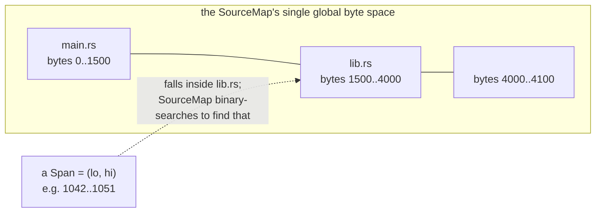
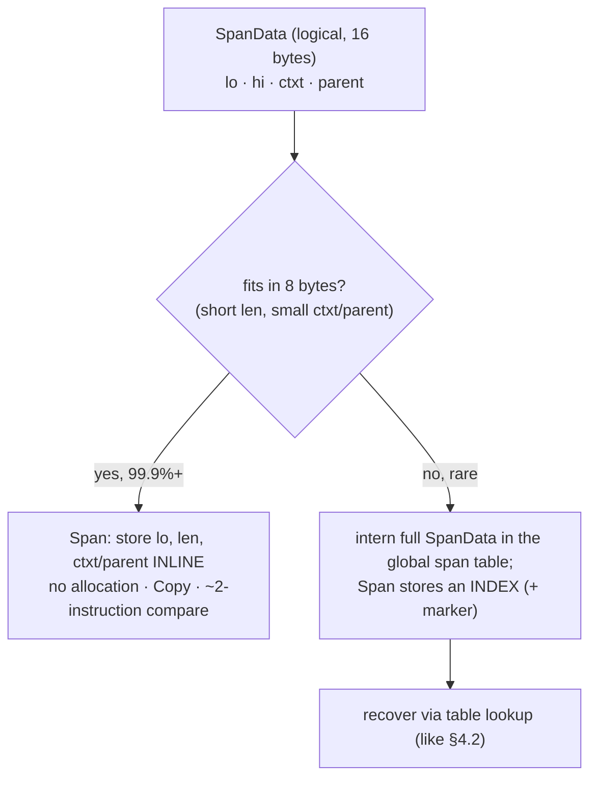
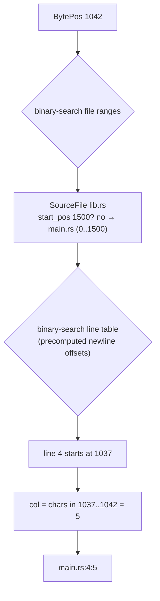
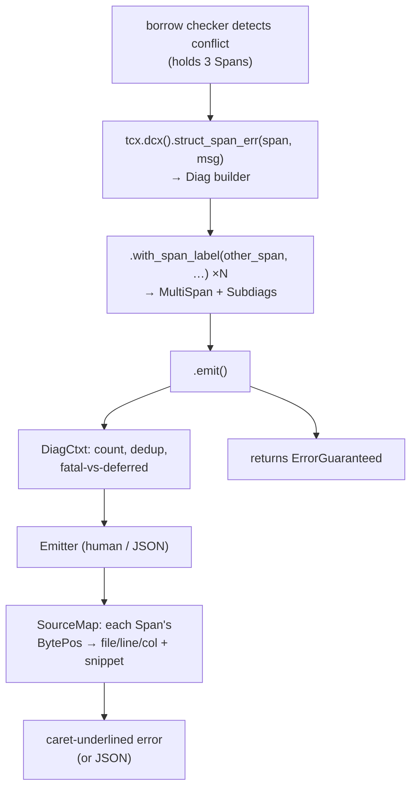
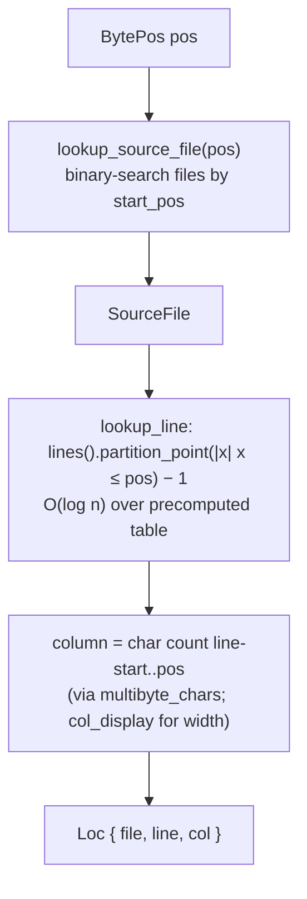
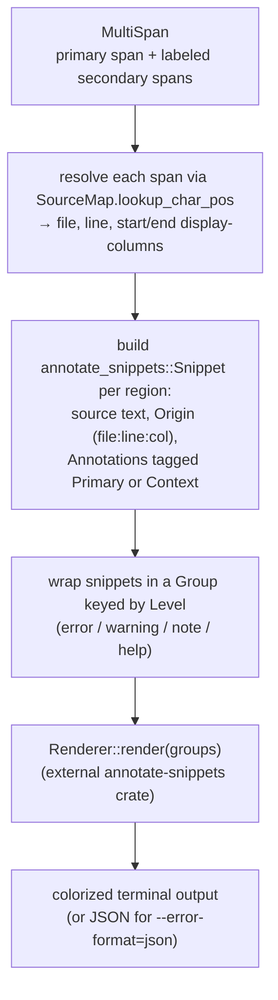
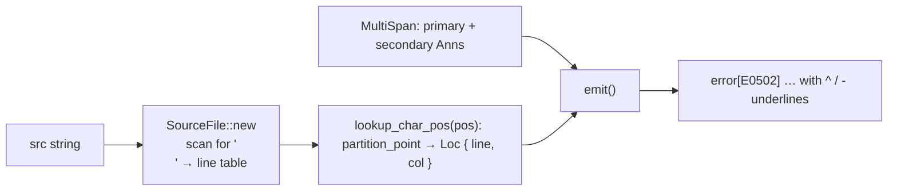
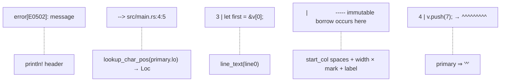

```admonish abstract title="What you'll learn"
- Why `rustc` stores only byte offsets on every node and defers line/column computation to render time, and how `BytePos` collapses every file into a single global `SourceMap` coordinate space.
- The four logical fields of `SpanData` (`lo`, `hi`, [`ctxt: SyntaxContext`](../glossary.md#syntaxcontext), [`parent: Option<LocalDefId>`](../glossary.md#localdefid)) and how `span_encoding.rs` packs the 99.9% common case into an 8-byte [`Span`](../glossary.md#span) while interning the overflow.
- How `SourceFile::lookup_line` uses `partition_point` over a precomputed line table, and how `SourceMap::lookup_char_pos` turns a `BytePos` into a `Loc` with two binary searches plus column math over `multibyte_chars`.
- The diagnostics machine in `rustc_errors`: the `DiagCtxt` sink reached via [`tcx.dcx()`](../glossary.md#tyctxt-tcx), the must-be-consumed [`Diag<'a, G>`](../glossary.md#diag) builder with its drop-bomb `Drop` impl, [`MultiSpan`](../glossary.md#multispan) with primary and context annotations, and the `Emitter` trait that holds a `SourceMap`.
- Why [`ErrorGuaranteed`](../glossary.md#errorguaranteed) is constructable only by emitting an error, so a `Result<T, ErrorGuaranteed>` is a compile-time receipt that the user was told.
- How to rebuild a miniature `SourceMap` plus caret emitter in about 120 lines, reproducing the `E0502` error from a line table, a `partition_point` lookup, and a loop that writes `^` and `-`.
```

## 6.1 Spans: How the Compiler Remembers Where Everything Came From

### The error message that points

Here is the kind of diagnostic this chapter explains how rustc produces:

```text
error[E0502]: cannot borrow `v` as mutable because it is also borrowed as immutable
  --> src/main.rs:4:5
   |
 3 |     let first = &v[0];
   |                  - immutable borrow occurs here
 4 |     v.push(7);
   |     ^^^^^^^^^ mutable borrow occurs here
 5 |     println!("{first}");
   |               ----- immutable borrow later used here
```

Look at how much *location* is in that single diagnostic. It names a file and a line and a column for the error itself, and it draws carets under the exact characters `v.push(7)`. But it also reaches *back* to line 3 to underline `&v[0]`, and *forward* to line 5 to underline `first`. Three different regions of source, each rendered with the precise byte extent of the offending code, each labeled. To produce this, the compiler must have remembered (for the `&v[0]` borrow, for the `v.push(7)` call, for the `first` use) *exactly where in the source each one came from*, and carried that memory all the way from lexing (Chapter 5) through [borrow checking](../glossary.md#borrow-checker) (Chapter 15). The thing it carries is the `Span`, and this section is about what a `Span` is and why it can afford to be everywhere.

### The naïve design, and why it is unaffordable

The obvious way to remember where a token came from is to store, on each token, its **file name, line, and column**. This is what many teaching compilers do, and it is exactly wrong for a production compiler, for two reasons.

First, *size*. The compiler creates an astronomical number of things that each need a location: every token, every [AST](../glossary.md#ast) node, every [HIR](../glossary.md#hir) node, every type, every [MIR](../glossary.md#mir) statement. Recall from Chapter 4 that these are allocated in the millions and that `rustc` fights for every byte (the `static_assert_size!` tripwires of §4.3). A `(String, u32, u32)` location on every node would be ruinous: the `String` alone is a heap allocation and 24 bytes of pointer-len-capacity, multiplied by millions.

Second, *line and column are not free to know*. A column is "how many characters since the last newline," which means computing it requires *scanning the source for newlines*. Storing line/column on every node would mean either doing that scan eagerly for everything (wasteful, since the vast majority of locations are never rendered into an error) or storing redundant data. The insight that resolves both problems is this: **the only location you fundamentally need to store is a byte offset; everything human-readable can be computed from it on demand, and only when an error actually needs rendering.**

```admonish tip title="Pro-Tip, locations are lazy"
The mental shift that makes spans click is realizing that `rustc` almost never computes a line and column. It stores byte offsets, copies them around billions of times for free, and converts an offset into "line 4, column 5" *only* at the moment a diagnostic is printed: a few thousand times per compilation at most. Lazy location is the whole game: pay the human-readable cost only at the rare point of actually talking to a human.
```

### One number for the whole program: the global coordinate space

So a location should be a byte offset. An offset *into what*? Here is rustc's first design decision for spans. Rather than "byte 42 of `main.rs`," which would require storing *which file* alongside the offset, it concatenates **every source file into a single, global byte-address space**, managed by the `SourceMap`. Imagine all the crate's files laid end to end on one enormous number line: `main.rs` occupies bytes 0..1500, `lib.rs` occupies 1500..4000, an expanded macro's synthetic source occupies 4000..4100, and so on. A single number, a `BytePos`, which is just a `u32`, now unambiguously identifies a byte *anywhere in the entire compilation*.

```rust
// compiler/rustc_span/src/lib.rs  (faithful; via the impl_pos! macro, Pos trait + Add/Sub impls auto-generated)
pub struct BytePos(pub u32); // an absolute offset into the SourceMap's global space
```

This is why a location needs no file field: the file is *implied* by where the offset falls in the global space, and the `SourceMap` can recover it by binary-searching its table of file ranges. The documentation is explicit that span positions are absolute positions from the beginning of the `SourceMap`, not positions relative to individual `SourceFile`s. A `u32` reaches up to 4 GiB, comfortably more source than any real crate, and, a deliberate choice, `lo` is stored at full 32-bit width precisely so that there is *no performance cliff* when a crate gets large.




```admonish warning title="Warning, a span's length is not always hi minus lo"
Because files are concatenated with the possibility of gaps between them in the `BytePos` range, the source documentation cautions that you *cannot* assume a span's byte length equals `hi - lo`, and that a span crossing a file boundary cannot be used with many `SourceMap` methods. In practice spans stay within one file, but the global-space design means this is a real edge a compiler hacker must respect. Do not compute "length of this code" as `hi - lo` and assume it indexes into one file's text.
```

### `SpanData`: the four things a location needs

A single offset locates a *point*; an error needs a *range*: `v.push(7)` spans nine characters. And, it turns out, two more things are needed. The logical contents of a span are captured by `SpanData`, verbatim from the source:

```rust
// compiler/rustc_span/src/lib.rs  (faithful; derives elided)
pub struct SpanData {
    pub lo: BytePos, // start of the range (inclusive)
    pub hi: BytePos, // end of the range (exclusive)
    pub ctxt: SyntaxContext, // which macro expansion this came from (hygiene)
    pub parent: Option<LocalDefId>,  // the enclosing item, for compact storage
}
```

`lo` and `hi` are the range: start and end offsets in the global space. The other two fields are subtler and each connects to a theme already in this book.

**`ctxt: SyntaxContext`** records *macro [hygiene](../glossary.md#hygiene)*: if this code was produced by a [macro expansion](../glossary.md#macro-expansion), `ctxt` identifies which expansion, so the compiler can reason about whether two identifiers that look the same actually refer to the same thing, and so it can avoid blaming your code for an error inside a macro you called. This is the entire subject of Chapter 8; for now, hold it as "a tag saying which expansion context this span lives in," usually the root context for hand-written code.

**`parent: Option<LocalDefId>`** is a storage optimization with a Part-0 flavor. Many spans sit inside a known item, a function body, say, and recording the enclosing `LocalDefId` lets the span be stored more compactly and helps the compiler relate spans to items without a lookup. It is the same instinct as §2.2's two-level [`HirId`](../glossary.md#hirid): anchor fine-grained things to a containing item so the representation is both smaller and more stable.

### `Span`: the same data, packed into eight bytes

`SpanData` is the *logical* view, and it is sixteen bytes (four 4-byte fields: `lo`, `hi`, `ctxt`, `parent`). Sixteen bytes on every token, node, and type is still too much to "stick everywhere," as the source comments put it. So `rustc` plays the §4.2 game one more time: it defines a separate, compressed `Span`, the type actually stored on every node, that squeezes the common case into **eight bytes**, and *interns* the rare cases that do not fit. Faithful to `span_encoding.rs`:

```rust
// compiler/rustc_span/src/span_encoding.rs  (faithful; derives + #[rustc_pass_by_value] elided)
pub struct Span {
    // either lo directly, or an index into the span interner
    lo_or_index: u32,
    len_with_tag_or_marker: u16, // usually the length (15 bits) + a 1-bit PARENT_TAG
    ctxt_or_parent_or_marker: u16, // usually ctxt or parent, inline (also 15 bits effective)
}
// total: 8 bytes
```

The encoding uses bit-stealing, applying the §4.2 [interner](../glossary.md#interner) pattern to spans:

- **The common case is inline.** Most spans are short and live in the root context: `lo` fits in the `u32`, the *length* (`hi - lo`) fits in 15 bits, and the `ctxt` (or `parent`) fits in the remaining 16. When everything fits, the whole span *is* those eight bytes: no allocation, no indirection, `Copy`, comparable in a couple of instructions.
- **The rare case is interned.** If the length is huge, or the `ctxt` is large (deep macro expansion), or both `ctxt` and `parent` are non-trivial, the data will not fit. Then `rustc` stores the full `SpanData` in a **global span interner table** and packs an *index* into that table into the `Span` instead, flagged by a marker value. Recovering the `SpanData` from such a `Span` is a table lookup: exactly the §4.2 "pointer/index to a canonical copy" move.

The documentation reports that 99.9%+ of spans fit inline in the eight bytes; interning is rare enough to be cheap but common enough that the code stays exercised. An earlier four-byte encoding for `Span` was *slower*, because only 80-90% of spans fit inline (even less in very large crates) and the interner was hit far more often. Eight bytes is the measured sweet spot between size-per-node and interner traffic: performance engineering by profiling, and the reason the size is what it is.




```admonish warning title="Warning, an interned Span is meaningful only where its SessionGlobals are set"
The span interner lives in a *scoped-thread-local* `SESSION_GLOBALS`, so an interned `Span`'s index resolves only on a thread where those globals are installed. `Span` itself is `Send` (it is three POD integers, `u32 + u16 + u16`, with no `!Send` impl), but sending one to a bare thread that does not enter a matching `SessionGlobals` makes any interner-backed form unresolvable. That is exactly why `SpanData` is the public type used when crossing the boundary: performance infrastructure that runs on a separate thread works with the fully-expanded `SpanData` instead. When you see code call `span.data()` to get a `SpanData`, sending across threads or thread-independent comparison is often why. For ordinary single-threaded compiler code, prefer `Span`.
```

### Why `Span` is *not* an identity: the §2.2 payoff

There is a temptation, having seen how compact and ubiquitous `Span` is, to use it as an *identity*: to say "two nodes are the same if they have the same span." Part 0 already warned against this, and now we can see exactly why. A `Span` is a *position*, and positions are the most fragile thing about source code: insert one blank line at the top of the file and *every* `BytePos` below it shifts, so every span changes, even though not a single definition's identity changed. That fragility is precisely why §2.2 built [`DefPathHash`](../glossary.md#defpathhash) and the two-level `HirId` as *stable* identifiers and explicitly kept `Span` *out* of the identity family. `Span` answers "where did this come from, for the human?": a question whose answer is *supposed* to move when the source moves. It must never answer "what thing is this?" The division of labor §2.2 drew is the same one here: stable hashes for identity, fragile spans for diagnostics, and never the two confused.

### Where this leaves us

We now have the foundation. A `Span` is how the compiler remembers, for everything it builds, where in the source it came from. Cheaply enough to attach to millions of nodes and carry from lexing to borrow checking. The design rests on three ideas: a **global coordinate space** where every file is concatenated onto one `u32` `BytePos` number line (so a location needs no file field, and the `SourceMap` recovers the file by search); a **lazy** philosophy where only byte offsets are stored and human-readable line/column are computed on demand at error time; and a **packed, interned `Span`** that squeezes the logical four-field `SpanData` into eight bytes for the 99.9% common case and interns the rest: the §4.2 interning pattern, profiled into its exact size. The `ctxt` field reaches forward to macro hygiene (Chapter 8) and the `parent` field echoes §2.2's anchoring instinct, while the whole type is deliberately kept out of *identity*, which belongs to the stable hashes of §2.2.

What we have not done is meet the `SourceMap` in full, or the diagnostics machinery that *consumes* spans. §6.2 takes the architecture deep-dive: how the `SourceMap` stores `SourceFile`s and answers the lookup "which file and line is `BytePos` 1042?", and how the diagnostics subsystem (the `DiagCtxt`, the `Diag` builder, the emitters) turns a span plus a message into the caret-underlined, multi-label error we opened this section with. Spans are the *what*; §6.2 is the machine that renders them.

## 6.2 The Architecture: the `SourceMap` and the Diagnostics Machine

### From a number to a caret

A `Span` stores byte offsets, `lo` and `hi` into the global `BytePos` space, and §6.1 claimed the human-readable "line 4, column 5" is computed *lazily*, only when an error is rendered. But computed *how*? And once you have a human location, what turns it into the caret-underlined, multi-label error that opened the chapter? Those are the two halves of Chapter 6's architecture, and they are two distinct machines: the `SourceMap`, which answers "what file and line is `BytePos` 1042?", and the **diagnostics subsystem** in `rustc_errors`, which takes a span plus a message and renders the error. This section walks both, then closes with `ErrorGuaranteed`, a type that lets the compiler *prove to itself* that it told you about a problem.

### The `SourceMap`: offset back to location

The `SourceMap` owns the global byte space of §6.1. Concretely it holds a list of `SourceFile`s, each of which knows its name, its slice of the global space (its `start_pos` and length), its source text, and, the crucial part, a precomputed **line table**: the `BytePos` at which each line begins. That table is built once, when the file is first loaded and added to the map, by a single scan for newlines. After that, the expensive newline-scanning §6.1 worried about never happens again.

With those tables in place, converting a `BytePos` to a human location is two binary searches and a subtraction:

1. **Which file?** Binary-search the files by their `start_pos` ranges to find the one containing the offset. (This is the "file is implied by position" recovery from §6.1.)
2. **Which line?** Binary-search *that file's* line table to find the greatest line-start `≤` the offset. The index is the line number.
3. **Which column?** Subtract the line-start from the offset: that byte distance, adjusted for any multi-byte UTF-8 characters earlier on the line, is the column.

```rust
// the SourceMap's job, conceptually
fn lookup(&self, pos: BytePos) -> (FileName, usize /*line*/, usize /*col*/) {
    let file = self.files.binary_search_by(|f| f.range().cmp_containing(pos));   // step 1
    let line = file.lines.partition_point(|&start| start <= pos) - 1; // step 2
    let col  = char_count(&file.src[file.lines[line]..pos]); // step 3
    (file.name.clone(), line + 1, col + 1)
}
```

This is the payoff of §6.1's laziness: the conversion is cheap (two binary searches over precomputed tables), and it runs only the few thousand times per compilation that a diagnostic is actually rendered, never on the billions of spans merely copied around. The `SourceMap` exposes this through methods like `lookup_char_pos` (offset → file/line/col), `span_to_snippet` (give me the source text a span covers, used to quote your code in the error), and `span_to_lines` (the line/column extents a span touches, used to draw the carets).




```admonish tip title="Pro-Tip, span_to_snippet is how errors quote your code"
Every time a rustc error shows you the offending line of your own source, that line came from `SourceMap::span_to_snippet(span)`: the map slicing the original text between `lo` and `hi`. If you ever write a [lint](../glossary.md#lint) or a diagnostic and wonder "how do I show the user the code I'm complaining about?", this is the method. It returns a `Result`, because a span might point into synthetic, macro-generated source that has no original text to quote: a case you must handle.
```

### The diagnostics subsystem: `DiagCtxt`, `Diag`, and the drop-bomb

Now the second machine. Diagnostics live in `rustc_errors`, and three types carry the weight.

**`DiagCtxt`** (the "diagnostic context"; older code and blog posts call it `Handler`) is the central sink for all compiler output. It owns the error *count*, the chosen *emitter*, and the logic for fatal-vs-deferred handling: the docs note that some diagnostics (fatal, bug) cause immediate exit while others are logged for later reporting. You reach it as `tcx.dcx()`, which exposes a family of `*_span_err`/`*_span_warn` constructors (the dev-guide enumerates them), each pairing a span with a message at a level.

**`Diag`** (older name: `DiagnosticBuilder`) is the *builder* you get back from those constructors. Its verified shape:

```rust
// compiler/rustc_errors/src/diagnostic.rs  (faithful; #[must_use] and !Clone impl elided)
pub struct Diag<'a, G: EmissionGuarantee = ErrorGuaranteed> {
    pub dcx: DiagCtxtHandle<'a>, // the context it will emit into
    diag: Option<Box<DiagInner>>, // the actual diagnostic data (boxed: it's large)
    _marker: PhantomData<G>, // what kind of "guarantee" emit returns
}
```

You build the error up fluently (attach extra labeled spans, notes, help text, suggestions) and then *consume* it with `.emit()` (or `.cancel()`, `.delay_as_bug()`). The `DiagInner` it wraps is the real data and is large, which is why it is `Box`ed; the `Option` is `Some` right up until the moment the builder is consumed.

A `Diag` dropped without being emitted or cancelled panics: it is a drop-bomb. The reason is a real class of compiler bug: constructing an error and then accidentally letting it fall out of scope, so the user is never told. By making the unconsumed `Diag` panic in its `Drop`, the compiler turns "forgot to emit a diagnostic" from a silent correctness bug into a loud, immediate failure during development. The type system is enlisted, again, to make a whole category of mistake impossible to ship.

A typical emission, then, reads like this, and produces the multi-caret error of §6.1:

```rust
// reconstructing the E0502 from §6.1, conceptually
tcx.dcx()
   // primary span + message
   .struct_span_err(mutate_span, "cannot borrow `v` as mutable …")
   // a secondary labeled span
   .with_span_label(borrow_span, "immutable borrow occurs here")
   .with_span_label(use_span,    "immutable borrow later used here") // another
   .with_code(E0502)
   .emit(); // → ErrorGuaranteed
```

The several spans are gathered into a **`MultiSpan`**: the structure that holds one or more *primary* spans plus any number of labeled *secondary* spans (the type permits multiple primaries; the common pattern is one). The `MultiSpan` is exactly what makes §6.1's three-caret error possible: one diagnostic, several source regions, each annotated. This is the data the emitter walks to draw the carets.

### The `Emitter`: turning a diagnostic into output

A built `DiagInner` is still abstract: spans and messages, no formatting. The **`Emitter`** trait is what renders it. Its core, verified:

```rust
// compiler/rustc_errors/src/emitter.rs  (faithful; ~10 default-method members elided)
pub trait Emitter {
    fn emit_diagnostic(&mut self, diag: DiagInner);
    fn source_map(&self) -> Option<&SourceMap>;
    // … supports_color, primary_span_formatted (suggestion formatting),
    // …render_multispans_macro_backtrace, fix_multispans_in_extern_macros,
    // …plus JSON-only: emit_artifact_notification, emit_timing_section,
    // …emit_future_breakage_report, emit_unused_externs, should_show_explain
}
```

The key dependency is right there: an emitter holds a `SourceMap`, because rendering *requires* turning every span's `BytePos`es into file/line/column to draw the carets: the two machines of this section meeting at the point of output. `rustc` ships several emitters behind this trait: the `AnnotateSnippetEmitter` at `compiler/rustc_errors/src/annotate_snippet_emitter_writer.rs`, which drives the external `annotate-snippets` crate to produce the colorized, caret-underlined terminal output you know (rustc has retired its in-tree caret renderer in favor of that shared library); a **JSON emitter** (`--error-format=json`) that `cargo`, IDEs, and `rust-analyzer` consume as structured data; and a short variant. The `Level` of each diagnostic (error, warning, note, help) selects color and prefix, and a `CodeSuggestion` becomes the `help: try changing this to …` lines, optionally machine-applicable so `cargo fix` can apply them automatically.




### `ErrorGuaranteed`: proving you told the user

`.emit()` returns an **`ErrorGuaranteed`**. It applies the Chapter-1 pattern (compile-time-enforced proof) to the compiler's own code: the compiler proves something, except here it proves something *to itself*.

The problem: after the compiler reports an error, it usually wants to *keep going*: to find more errors in one run rather than stopping at the first. But continuing past an error means working with broken data (a type that failed to resolve, a name that didn't exist). That is only *sound* if the compiler is certain it already told the user something was wrong, so it will never emit a confusing "success" or a nonsense downstream error as the user's last word. How do you guarantee, across a million lines of compiler code, that every "error path" actually reported an error?

The answer is a type you **cannot construct except by emitting an error**. `ErrorGuaranteed` is an opaque token, and the *only* way to obtain one is to call something like `Diag::emit` on an error-level diagnostic: the trait `EmissionGuarantee` ties the act of emitting to the production of the token. So a function whose signature is `fn check(...) -> Result<`[`Ty`](../glossary.md#tytcx)`, ErrorGuaranteed>` is making a *compile-time-enforced promise*: on its `Err` path it must hand back an `ErrorGuaranteed`, which it can only have gotten by actually reporting an error. The type system makes "return an error result without telling the user" unrepresentable. When you see `ErrorGuaranteed` threaded through the compiler, and you will see it everywhere in the analysis crates, read it as a *receipt*: "an error was definitely emitted; it is safe to proceed on degraded data." The compiler that proves your program safe uses the same trick on its own code to prove it never stays silent.

```admonish warning title="Warning, do not fabricate an ErrorGuaranteed"
Because the token is so load-bearing, the compiler guards its creation. There are a few sanctioned ways to obtain one without a fresh emission: notably `DiagCtxt` methods used when you *know* an error was already reported elsewhere (and the now-removed-from-normal-use back doors that exist only for those cases). Manufacturing an `ErrorGuaranteed` when no error was actually emitted breaks the soundness argument and leads to the compiler silently accepting broken programs or ICE-ing later. If you are writing analysis code and reach for one, the rule is simple: you may hold an `ErrorGuaranteed` only if an error genuinely went to the user.
```

### Two threads back to Part 0

The diagnostics machine closes two loops from earlier chapters.

**Diagnostics are a tracked side effect.** Recall §3.1's claim that [queries](../glossary.md#query) are pure *except* for diagnostics, which are stored with the cached query result and *replayed* on reuse. Here is the mechanism: `rustc_errors` exposes a `TRACK_DIAGNOSTIC` hook through which every emitted diagnostic passes, and the incremental engine uses it to record diagnostics alongside query results so that, when a green query is reused without re-running, its diagnostics are replayed and you still see the warning. The "sanctioned side effect" of §3.1 is implemented right here, as a tracking hook on emission.

**Diagnostics are increasingly declarative.** Rather than building every error imperatively, modern `rustc` defines many as *structs* with `#[derive(Diagnostic)]`, annotating fields with `#[primary_span]` and the like, with the human-readable *text* supplied as the literal string inside `#[diag("...")]`, parsed by the macro as a Fluent message so positional arguments `{x}` interpolate from the struct's fields. Older code routed messages through per-crate `messages.ftl` files; 1.95 has inlined them, so the previous "edit translations without touching compiler code" property no longer holds. The separation that remains is between a diagnostic's *logic* (which spans, which data) and its *wording* (kept on the struct definition itself), the same separation-of-concerns instinct as the two-layer lexer of Chapter 5: mechanism in code, presentation co-located with the struct.

### Where this leaves us

The architecture of Chapter 6 is now whole. The `SourceMap` turns a `BytePos` back into a human location through two binary searches over a precomputed line table: the lazy conversion §6.1 promised, run only at render time, and the source of the code snippets errors quote. The **diagnostics subsystem** builds errors with the must-be-consumed `Diag` builder (the drop-bomb that forbids forgetting to emit), gathers their spans into a `MultiSpan`, routes them through the `DiagCtxt`, and renders them with an `Emitter` that leans on the `SourceMap` to draw carets, in human or JSON form. `ErrorGuaranteed` is the type-level receipt proving an error was told to the user, letting the compiler continue soundly on broken data. And both the incremental-replay hook and the declarative-Fluent design tie the machine back to themes from Parts 0 and the start of Part 1.

§6.3 takes us into the real source: we will read the actual `SourceMap` lookup and a slice of the human emitter, how it walks a `MultiSpan`, fetches snippets, and lays out the carets and labels you see in a terminal, turning this architectural sketch into concrete code. Then §6.4 has you build a tiny diagnostics emitter of your own: take a span and a message, resolve it through a miniature source map, and print a caret-underlined error in the rustc style.

## 6.3 Reading the Source: `SourceMap` Lookup and the Human Emitter

### Two load-bearing pieces, one of them now out-of-tree

`compiler/rustc_errors/src/emitter.rs` is a modest 700-line file that defines the `Emitter` trait and a few thin adapter implementations; the actual rendering of carets and labels has been delegated to the external `annotate-snippets` crate, driven by `AnnotateSnippetEmitter` in `compiler/rustc_errors/src/annotate_snippet_emitter_writer.rs`. Turning a span and a message into a caret-underlined error has to handle multi-line spans, overlapping annotations, CJK and other wide characters, tab stops, color, terminal width, and machine-applicable suggestions, and that heavy lifting now lives in `annotate-snippets`. We are not going to read all of it. We will read the two load-bearing pieces: the **`SourceMap` lookup** that turns a `BytePos` into a line and column, and the **emitter's annotation-layout core** that decides which characters get a `^` and which get a `-`. Together they are §6.2's two machines, in real code.

### `SourceFile`: the line table, for real

§6.2 said each `SourceFile` precomputes a table of line-start offsets. Here are its actual fields, faithful to the source:

```rust
// compiler/rustc_span/src/lib.rs  (faithful; selected fields, in pedagogical order)
pub struct SourceFile {
    pub name: FileName, // the path, or <macro expansion>, etc.
    // the text, None for files imported from other crates
    pub src: Option<Arc<String>>,
    // where this file begins in the global space (§6.1)
    pub start_pos: BytePos,
    // length AFTER newline-normalization (the real length we walk)
    pub normalized_source_len: RelativeBytePos,
    pub unnormalized_source_len: u32, // raw byte length before normalization
    // line-start table; FreezeLock so it's lazily decoded then immutable
    pub lines: FreezeLock<SourceFileLines>,
    // where the non-ASCII bytes are (for column math)
    pub multibyte_chars: Vec<MultiByteChar>,
    // … src_hash, checksum_hash, external_src, normalized_pos, stable_id, cnum …
}
```

The two fields that matter for this section are `lines` and `multibyte_chars`. `lines` is the precomputed table: conceptually a `Vec<BytePos>` of where each line begins, built by one newline scan at load time (the real encoding is compressed, but think of it as that vector). `multibyte_chars` records where the non-ASCII characters are, and exists for one reason: a *column* is a count of *characters*, not bytes, so to turn a byte offset into a column you must know how many multi-byte UTF-8 characters lie between the line start and the offset. The `src` being `Option` is the §6.2 snippet caveat in struct form: files imported from upstream crates have no text (`None`), so you cannot quote their source, only locate it for debuginfo.

### `lookup_char_pos`: two binary searches

The conversion §6.2 sketched is, in the real code, exactly two binary searches. First the `SourceMap` finds the file, then the file finds the line. The line lookup is a clean one-liner, faithful to the source:

```rust
// compiler/rustc_span/src/lib.rs  (faithful; doc-comment paraphrased)
impl SourceFile {
    /// Returns the (0-based) line index that `pos` falls on.
    pub fn lookup_line(&self, pos: RelativeBytePos) -> Option<usize> {
        self.lines().partition_point(|x| x <= &pos).checked_sub(1)
    }
}
```

`partition_point` is `std`'s binary search for "how many elements satisfy this predicate": here, how many line-starts are `≤` our position. Subtract one and you have the index of the line *containing* the position. That is the whole line lookup: one `O(log n)` search over the precomputed table, no scanning. The `SourceMap` wraps this with the file search and the column math, by delegating to two helpers:

```rust
// compiler/rustc_span/src/source_map.rs  (faithful)
pub fn lookup_char_pos(&self, pos: BytePos) -> Loc {
    let sf = self.lookup_source_file(pos);
    let (line, col, col_display) = sf.lookup_file_pos_with_col_display(pos);
    Loc { file: sf, line, col, col_display }
}

// And `lookup_source_file` itself is the OTHER binary search:
pub fn lookup_source_file_idx(&self, pos: BytePos) -> usize {
    self.files.borrow().source_files.partition_point(|x| x.start_pos <= pos) - 1
}
```

Three lines for the public entry point; one line for the file lookup; the column work happens inside `SourceFile::lookup_file_pos_with_col_display`, which calls `lookup_line` (the `partition_point` we just saw) for the line index, walks `multibyte_chars` to convert byte offset to character column (`bytepos_to_file_charpos`), turns the 0-based line into a 1-based one (`line + 1`), and computes `col_display` by summing `char_width` over the line's leading characters so terminal underlines align even in the presence of tabs and zero-width characters.

The result is a **`Loc`**, the "source code location used for error reporting": a file, a line, and a column. Note `col` is computed as a *character* count using `multibyte_chars`, and there is also a `col_display` that accounts for *display width* (a CJK character occupies two terminal columns, a tab advances to a stop), which is how the emitter aligns carets correctly under wide characters. The byte/char distinction has its own type, **`CharPos`**, precisely so the compiler never silently confuses "byte 5" with "character 5."

And the method that quotes your code:

```rust
// span → the actual source text it covers
pub fn span_to_snippet(&self, sp: Span) -> Result<String, SpanSnippetError> { /* … */ }
```

It finds the file for the span, checks the file has `src` (returns `Err` if it is an external or synthetic file with no text), and slices the string between the span's local `lo` and `hi`. Every quoted line in every rustc error is this method returning `Ok`.




### The emitter: from `MultiSpan` to carets

Now the heart. When a `Diag` is emitted, the `DiagCtxt` hands a `DiagInner` to the `Emitter`'s `emit_diagnostic` (§6.2). For the human emitter the implementation is `AnnotateSnippetEmitter::emit_diagnostic`, which delegates to `emit_messages_default` in `annotate_snippet_emitter_writer.rs`, and the core problem it solves is layout: given a `MultiSpan` (a primary span plus labeled secondary spans, possibly scattered across lines and files) produce the annotated source block. The algorithm, faithful in shape:

1. **Resolve every span to file + line + columns.** Each annotation's `lo`/`hi` go through `lookup_char_pos`, yielding the file, the line number, and the start/end *display* columns. This is the exact point where the two machines meet: the emitter holds a `&SourceMap` (the `Emitter::source_map` method from §6.2) and calls it for every annotation.
2. **Build an `annotate_snippets::Snippet` per source region.** For every contiguous slice of source that needs annotating, the emitter constructs a `Snippet` carrying the file's source text, an `Origin` (file:line:col for the location arrow), and a list of `annotate_snippets::Annotation` values. Each annotation is tagged `AnnotationKind::Primary` (for the `^^^` span where the error fundamentally *is*) or `AnnotationKind::Context` (for the `---` secondary spans), and carries the start/end byte range and the label text. This is the structural replacement for the older in-tree "group by file then by line" pass: the grouping is now expressed as the snippet list passed to the external renderer.
3. **Wrap snippets in a `Group` keyed by `Level`, hand to `Renderer::render`.** A `Group` bundles snippets that share a header (the `error[E0502]: ...` line and its level: error, warning, note, help). The emitter assembles the group list and calls `Renderer::render(groups)`, which lives in the external `annotate-snippets` crate. The renderer is what actually emits the gutter ( `4 |`), the source line, and the underline row with `^` under primary columns and `-` under context columns, applying ANSI color when the terminal supports it.

The `^` versus `-` distinction, the visible grammar of every rustc error, is now carried by `AnnotationKind::Primary` vs `AnnotationKind::Context` rather than an `is_primary: bool` on an in-tree annotation type. The label text is written just past the underline by the renderer. The pedagogical mental model is unchanged from older rustc (resolve via SourceMap, group by file/line, lay carets and labels under each region, flush as colored output or JSON), but the in-tree machinery that used to do the last two steps has moved into `annotate-snippets`; in 1.95 the in-tree code is mostly a marshalling layer.




### Why the rendering work is so big: the hard cases

The sketch above is the clean spine. The `annotate-snippets` crate, plus the marshalling in `annotate_snippet_emitter_writer.rs`, handles edge cases: multi-line spans (drawn with `|` rails connecting start to end), overlapping annotations on the same line (assigned to different vertical levels so labels do not collide), wide/CJK/tab/zero-width characters (handled via display-width math so a `^` sits under the visual column), long-line elision (truncated with `...`), and `CodeSuggestion` rendering as a `help:` block (serialized for `cargo fix` when machine-applicable). See the dev-guide's top-level diagnostics chapter (`src/doc/rustc-dev-guide/src/diagnostics.md`) and the `annotate-snippets` crate documentation for the full list.

```admonish tip title="Pro-Tip, read emit_diagnostic top-down, not the whole file"
If you ever need to work on the human emitter, do *not* try to read `annotate_snippet_emitter_writer.rs` linearly. Start at `AnnotateSnippetEmitter::emit_diagnostic`, then follow `emit_messages_default` to see how a `DiagInner` becomes a list of `annotate_snippets::Group` values, and only then descend into the `annotate-snippets` crate if you need to know how a `Group` becomes terminal output. The file is a marshalling layer hung off one entry point; treat it as a menu, not a narrative. This is the same "find the entry point, follow one path" discipline that tamed the query system in Part 0.
```

```admonish warning title="Warning, never compute columns by byte indexing"
The single most common bug when working with spans and source text is slicing or counting by *byte* index and treating the result as a *column*. `"café".len()` is 5 bytes but 4 characters and 4 display columns; a tab is 1 byte but advances to a column stop. The emitter goes through `CharPos`, `multibyte_chars`, and `col_display` precisely to avoid this, and so must any tool you write. If your homemade caret is one column off under an accented character, this is why.
```

### Where this leaves us

The `SourceFile` line table is §6.1's "compute line/column lazily" in concrete form: the table is built once, and `partition_point` reads it in `O(log n)` only when an error renders. `lookup_char_pos` and `span_to_snippet` are the `SourceMap` half of §6.2's architecture, now seen as real method bodies. The `MultiSpan`-to-`Snippet`-to-`Group` marshalling is the diagnostics half, and the moment the emitter calls `source_map().lookup_char_pos(...)` is literally the two machines touching: the `BytePos` arithmetic of §6.1 feeding the caret layout that `Renderer::render` then draws. The `^`/`-` distinction you have seen in every Rust error of your life is now a two-variant tag, `AnnotationKind::Primary` vs `AnnotationKind::Context`, that the external renderer maps to a caret or a dash.

Which is exactly what §6.4 asks you to do. The lab has you build a miniature but real diagnostics emitter: a tiny source map that stores one file and a line table, a `lookup_char_pos` that does the `partition_point` search, and an emitter that takes a primary span plus a couple of labeled secondary spans and prints a caret-underlined, rustc-style error to the terminal, complete with the gutter, the `^`/`-` underlines, and the labels. You will reproduce, in a hundred lines, the machine you just read.

## 6.4 Hands-On Lab: Build a Span Resolver and a Caret Emitter

### The famous error messages, reduced to their essence

This lab rebuilds rustc's caret-underlined diagnostic in about 120 lines of dependency-free Rust. You will construct a miniature `SourceMap` (a file plus a line table, with a `partition_point` lookup straight out of §6.3) and a caret emitter that takes a primary span and a couple of labeled secondary spans and prints the `E0502` error that opened this chapter. When your program prints carets under the right characters, you will see that rustc's diagnostics reduce, at their core, to a line table, a binary search, and a loop that writes `^`.

As in §5.4, nothing exotic is required: `cargo new`, pure `std`, no dependencies.

### The miniature `SourceMap`

Mirror §6.3's `SourceFile`: hold the text and a precomputed table of line-start offsets, and offer the three operations the emitter needs: `lookup_char_pos` (offset → line/column), `line_text` (the source of a line), and `span_to_snippet` (the text a span covers).

```rust
// src/main.rs, a miniature rustc-style diagnostics emitter

#[derive(Clone, Copy)]
// byte offsets. (rustc's also carries `ctxt: SyntaxContext` for hygiene and
// `parent: Option<LocalDefId>` for compact storage; this lab is `SpanData` with both
// stripped, and the 8-byte packing of `Span` from §6.1 is also dropped.)
struct Span { lo: u32, hi: u32 }

fn span(lo: usize, hi: usize) -> Span { Span { lo: lo as u32, hi: hi as u32 } }

/// A resolved location, like rustc's `Loc { file, line, col, col_display }`. We drop
/// `file` (single-file lab) and `col_display` (covered by extension exercise 3).
struct Loc { line: usize, col: usize }

/// One source file with a precomputed line-start table, like rustc's `SourceFile`.
struct SourceFile {
    name: String,
    src: String,
    lines: Vec<u32>, // byte offset of the start of each line (the line table)
}

impl SourceFile {
    fn new(name: &str, src: &str) -> SourceFile {
        // Build the line table with ONE scan for '\n', exactly what rustc does at load time.
        // (rustc's `analyze_source_file` finds newlines AND multibyte char offsets in one
        // SSE2-accelerated pass; we skip the latter and walk `.chars()` later instead.)
        let mut lines = vec![0u32];
        for (i, b) in src.bytes().enumerate() {
            if b == b'\n' { lines.push((i + 1) as u32); }
        }
        SourceFile { name: name.into(), src: src.into(), lines }
    }

    /// 0-based index of the line containing `pos`, the §6.3 `partition_point` trick.
    /// rustc returns `None` for empty files / positions before line 0; we unwrap because
    /// we control inputs.
    fn lookup_line(&self, pos: u32) -> Option<usize> {
        self.lines.partition_point(|&start| start <= pos).checked_sub(1)
    }

    /// (1-based line, 1-based column). Column is a CHAR count, not a byte count (§6.3 warning).
    /// Mirrors rustc's `SourceMap::lookup_char_pos`, which returns a `Loc { file, line, col,
    /// col_display }`; we drop `file` (one file) and `col_display` (extension exercise 3).
    fn lookup_char_pos(&self, pos: u32) -> Loc {
        let line = self.lookup_line(pos).expect("pos before first line");
        let line_start = self.lines[line] as usize;
        let col = self.src[line_start..pos as usize].chars().count();
        Loc { line: line + 1, col: col + 1 }
    }

    /// The text of a 0-based line, without its trailing newline.
    fn line_text(&self, line0: usize) -> &str {
        let start = self.lines[line0] as usize;
        let end = self.lines.get(line0 + 1).map(|&e| e as usize - 1).unwrap_or(self.src.len());
        &self.src[start..end]
    }

    /// The source text a span covers, like `SourceMap::span_to_snippet`.
    /// (rustc's returns `Result<String, SpanSnippetError>`; we panic on bad spans because
    /// we hand-build them above.)
    fn span_to_snippet(&self, sp: Span) -> &str {
        &self.src[sp.lo as usize..sp.hi as usize]
    }
}
```

That `lookup_line` is *the same line* you read in §6.3: `partition_point` over the precomputed table, minus one. You have rebuilt the `SourceMap`'s core in five lines.

### Annotations and the emitter

Now the `MultiSpan` and the rendering. A `MultiSpan` holds one primary span (the `^` underline, where the error fundamentally is) plus any number of labeled secondary spans (the `-` underlines, the context); the kind tag chooses `^` versus `-` (6.3's "visible grammar"):

```rust
/// Mirrors rustc's `AnnotationKind::Primary` vs `AnnotationKind::Context` (§6.3): the
/// two-variant tag the external `annotate-snippets` renderer dispatches on.
enum AnnKind { Primary, Context }

/// Mirrors rustc's `MultiSpan { primary_spans: Vec<Span>, span_labels: Vec<(Span,
/// DiagMessage)> }` (§6.2): one bundle holding the primary span(s) plus any number of
/// labeled secondary spans, exactly the shape the emitter walks.
struct MultiSpan {
    primary_spans: Vec<Span>,
    span_labels: Vec<(Span, String)>,
}

impl MultiSpan {
    fn from_span(sp: Span, label: &str) -> MultiSpan {
        MultiSpan { primary_spans: vec![sp], span_labels: vec![(sp, label.into())] }
    }
    fn with_label(mut self, sp: Span, label: &str) -> MultiSpan {
        self.span_labels.push((sp, label.into()));
        self
    }
    /// Yields each (span, label, kind) in the order the emitter wants them.
    fn anns(&self) -> Vec<(Span, &str, AnnKind)> {
        self.span_labels.iter().map(|(sp, label)| {
            let kind = if self.primary_spans.contains(sp) { AnnKind::Primary } else { AnnKind::Context };
            (*sp, label.as_str(), kind)
        }).collect()
    }
}

/// Emit a rustc-style diagnostic: header, location arrow, and per-line caret underlines.
fn emit(file: &SourceFile, code: &str, message: &str, ms: &MultiSpan) {
    // header line:  error[E0502]: message
    println!("error[{code}]: {message}");

    let prim_span = *ms.primary_spans.first().expect("need a primary span");
    let prim_loc = file.lookup_char_pos(prim_span.lo);
    let anns = ms.anns();
    let gw = anns.iter().map(|(sp, _, _)| file.lookup_char_pos(sp.lo).line).max().expect("emit called with no annotations").to_string().len(); // gutter width = widest line number
    println!("{:>gw$}--> {}:{}:{}", "", file.name, prim_loc.line, prim_loc.col, gw = gw + 1);
    println!("{:>gw$} |", "", gw = gw);

    // one annotated source line per annotation, in source order (assume single-line spans).
    let mut order = anns;
    order.sort_by_key(|(sp, _, _)| sp.lo);
    for (sp, label, kind) in order {
        let loc = file.lookup_char_pos(sp.lo);
        let line0 = loc.line - 1;
        let line_start = file.lines[line0] as usize;
        // CHAR column
        let start_col = file.src[line_start..sp.lo as usize].chars().count();
        let width = file.span_to_snippet(sp).chars().count().max(1);
        let mark = match kind { AnnKind::Primary => '^', AnnKind::Context => '-' };

        println!("{:>gw$} | {}", loc.line, file.line_text(line0), gw = gw);
        let underline = mark.to_string().repeat(width);
        println!("{:>gw$} | {}{} {}", "", " ".repeat(start_col), underline, label, gw = gw);
    }
}
```

Read `emit` against §6.3's algorithm: walk the `MultiSpan`'s annotations, resolve each span to a line and column with `lookup_char_pos`, sort them into source order, and for each one print the gutter-and-source line followed by an underline row: `start_col` spaces, then `width` copies of `^` or `-`, then the label. The columns are computed with `.chars().count()`, *not* byte indexing, so the lab is correct under accented characters (because we count characters, not bytes), but tabs and wide CJK characters still misalign: see extension exercise 3 and rustc's `char_width` (`compiler/rustc_span/src/lib.rs`).

### Putting it together: reproducing `E0502`

```rust
fn main() {
    let src = "\
fn main() {
    let v = vec![1, 2, 3];
    let first = &v[0];
    v.push(7);
    println!(\"{first}\");
}";
    let file = SourceFile::new("src/main.rs", src);

    // A real compiler gets these spans from the lexer/parser (we wire that connection in
    // extension exercise 1); here we locate them by `find` to keep the lab dependency-free.
    let at = |needle: &str, from: usize| {
        let lo = src[from..].find(needle).unwrap() + from;
        span(lo, lo + needle.len())
    };
    let borrow = at("&v[0]", 0);
    let mutate = at("v.push(7)", 0);
    let used = at("first", src.find("println").unwrap());

    let ms = MultiSpan::from_span(mutate, "mutable borrow occurs here")
        .with_label(borrow, "immutable borrow occurs here")
        .with_label(used, "immutable borrow later used here");
    emit(&file, "E0502",
        "cannot borrow `v` as mutable because it is also borrowed as immutable",
        &ms,
    );
}
```

````admonish example title="Expected output" collapsible=true
Run `cargo run`, and you get the chapter's opening error, generated by your own code:

```text
error[E0502]: cannot borrow `v` as mutable because it is also borrowed as immutable
  --> src/main.rs:4:5
  |
3 |     let first = &v[0];
  |                 ----- immutable borrow occurs here
4 |     v.push(7);
  |     ^^^^^^^^^ mutable borrow occurs here
5 |     println!("{first}");
  |               ----- immutable borrow later used here
```
````

The primary span gets `^`, the secondaries get `-`, each underline sits under the right characters because `start_col` and `width` are char counts resolved through the line table, and the location arrow points at the primary. That is the whole machine of §6.1 to §6.3, in one file you can read at a glance.




Each printed element traces to a specific piece of the code:




### What the lab stripped from real rustc

The lab's `partition_point` lookup, gutter, and caret-underlining are the algorithm. What the lab strips is the production bookkeeping that `[rustc_span](https://github.com/rust-lang/rust/blob/1.95.0/compiler/rustc_span/src/lib.rs)` and `[rustc_errors](https://github.com/rust-lang/rust/blob/1.95.0/compiler/rustc_errors/src/diagnostic.rs)` layer on top: hygiene context (`SyntaxContext`, the Chapter 8 thread) and the owning-body `parent` link the incremental system keys on; the bit-packed `Span` encoding with its interning fallback for big spans; the global `BytePos` coordinate space and `lookup_source_file` step that the lab collapses to a single file; `MultiSpan` with structured Fluent messages and suggestion spans; the `Diag<'a, G: EmissionGuarantee>` drop-bomb and its type-level guarantee machinery; the `DiagCtxt` + `Emitter` split for swappable human/JSON output and error counting; and the `ErrorGuaranteed` token returned by `Diag::emit` that lets the rest of the compiler skip a check once it has seen one. The dev-guide's diagnostics chapter walks each in full. The mechanism is the same; the bookkeeping that makes it production-grade is what fills the rest of `rustc_errors`.

### Extension exercises

1. **Wire it to your Chapter 5 lexer.** Take the lexer from §5.4, and when it produces an `Unknown` token (a stray `№`, say), feed that token's offset and length as a `Span` into this emitter and print `error: unknown token` with a caret under it. You will have connected the front end's first two floors: lexing produces a token with a length, and the diagnostics machine turns that length-plus-offset into a span-underlined error. This is also the closest the lab gets to how spans arrive in real rustc: from a lexer, not from a string search. That join is exactly what Layer 2 (§5.2) does for real.
2. **Multi-line spans.** Handle an annotation whose `lo` and `hi` are on different lines by drawing the `|` rails rustc uses: print the first line with a `/`-style start marker and the last with the underline, connected down the gutter. This is the single biggest source of complexity in the real emitter.
3. **Display width, not char count.** Replace `.chars().count()` for the underline with a *display-width* calculation that counts a CJK character as two columns and expands tabs to stops. Feed your emitter a line containing `"café"` and a line containing a wide character and watch where the naïve version misaligns: the `col_display` problem of §6.3, live.
4. **A `help:` suggestion.** Add a `Suggestion { span, replacement }` and render a `help:` block showing the proposed edit, the way rustc renders a machine-applicable `CodeSuggestion`.
5. **A second emitter: JSON.** Write an `emit_json` that serializes the same diagnostic (code, message, file, line, col, spans, labels) as a JSON object instead of drawing carets: exactly the `--error-format=json` split of §6.2, where one `DiagInner` feeds either a human or a machine emitter.
6. **Diff-compress the line table.** Replace `Vec<u32>` with a `(u8 /*bytes_per_diff*/, Vec<u8>)` of consecutive line-length deltas, the way rustc stores `SourceFileLines::Diffs` (`compiler/rustc_span/src/lib.rs::SourceFileLines@59807616e1fa`). Most line lengths fit in a single byte, so one byte per line is usually enough; on first lookup, decode the diffs back to absolute offsets, then freeze. You will have rebuilt the same `static_assert_size!` byte-fighting instinct §4.3 taught, applied to the millions of lines a real workspace contains.
7. **Build a `Diag` builder with a drop-bomb.** Replace the free `emit(file, code, message, ms)` with a `#[must_use] struct Diag<'a> { sm: &'a SourceFile, code: &'static str, message: String, ms: MultiSpan, emitted: bool }`, implemented with `with_label`, `with_primary`, and an `emit` method that flips `emitted = true`. Give it a `Drop` impl that panics with `"error constructed but not emitted"` if dropped unconsumed. You will have rebuilt §6.2's drop-bomb idiom of `compiler/rustc_errors/src/diagnostic.rs::Diag@59807616e1fa` in a dozen lines, turning "forgot to emit a diagnostic" from a silent bug into a loud panic.

### Where Chapter 6, and the front end's first floor, leaves us

Chapter 6 is complete. §6.1 established what a `Span` is and why it can be everywhere: a compact handle into a single global `BytePos` coordinate space, packed into eight bytes and interned in the rare overflow case, with human-readable line and column computed lazily and never stored, and deliberately kept *out* of identity, which belongs to the stable hashes of §2.2. §6.2 laid out the two consuming machines: the `SourceMap`, which turns an offset back into a location, and the diagnostics subsystem (the `DiagCtxt`, the must-be-consumed `Diag` builder, the `MultiSpan`, the `Emitter`) capped by the `ErrorGuaranteed` token that lets the compiler prove to itself it told you about a problem. §6.3 read the real `partition_point` lookup and the emitter's annotation-layout core. And in this lab you rebuilt both, reproducing Rust's signature error message from a line table and a loop.

Step back and see how far the front end has come. Chapter 5 turned bytes into a stream of tokens; Chapter 6 gave every one of those tokens a `Span` and built the machine that turns spans into the errors a human reads. We now have a *located token stream*: tokens that know what they are and where they came from. What we do not yet have is *structure*: the token stream is still flat, a sequence with no notion that `v.push(7)` is a method call whose receiver is `v`, or that the whole thing is a statement inside a function inside a module. Building that tree, turning the flat, located token stream into the **Abstract Syntax Tree**, is the job of the **parser**, and it is where Chapter 7 begins. We have the words and we know where they came from; next we learn the grammar.

### The picture so far

The front end now has bytes (Chapter 5), tokens, and the location memory (`Span`) that lets every later phase point back at the source (Chapter 6). Diagnostics have the raw material they need; what does not exist yet is structure. Chapter 7 builds the AST, the tree the rest of the front end walks.

## Test yourself

```admonish question title="Anchor the chapter"
Six quick questions on the key claims of Chapter 6. Answer first, then expand the explanation. Quizzes are not graded; they are a recall checkpoint between chapters.
```

{{#quiz ../../quizzes/ch06.toml}}

---

*End of Chapter 6. Next: Chapter 7, 7.1, Parsing: From Tokens to a Tree.*