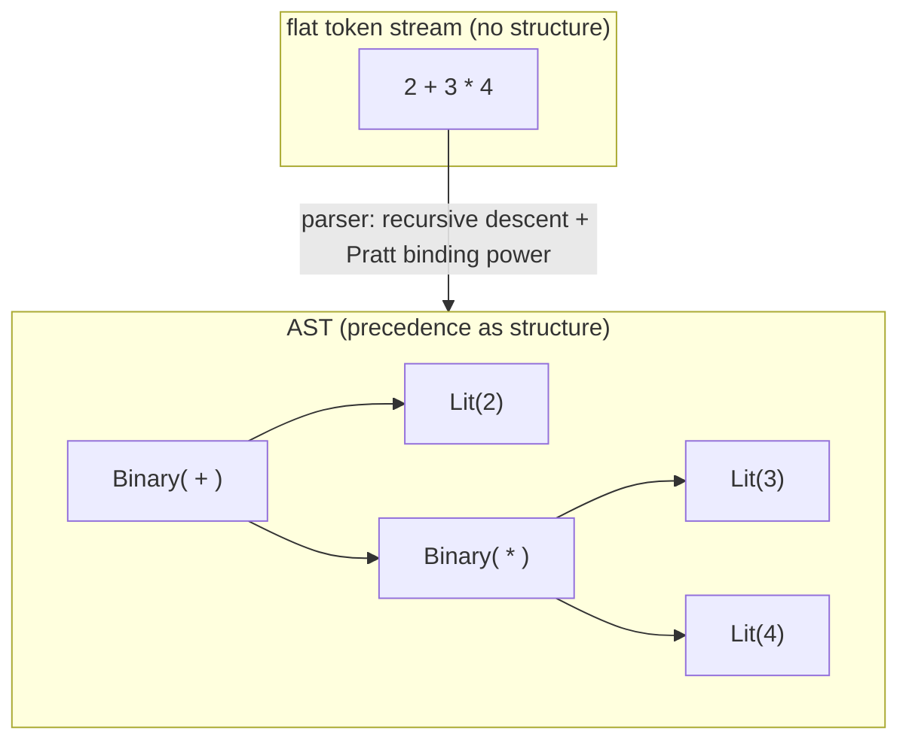
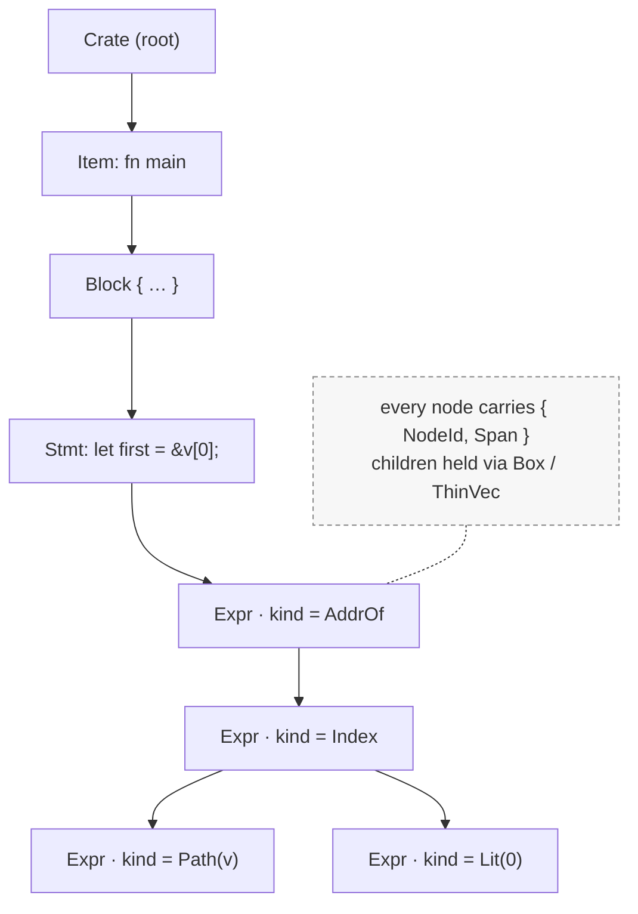
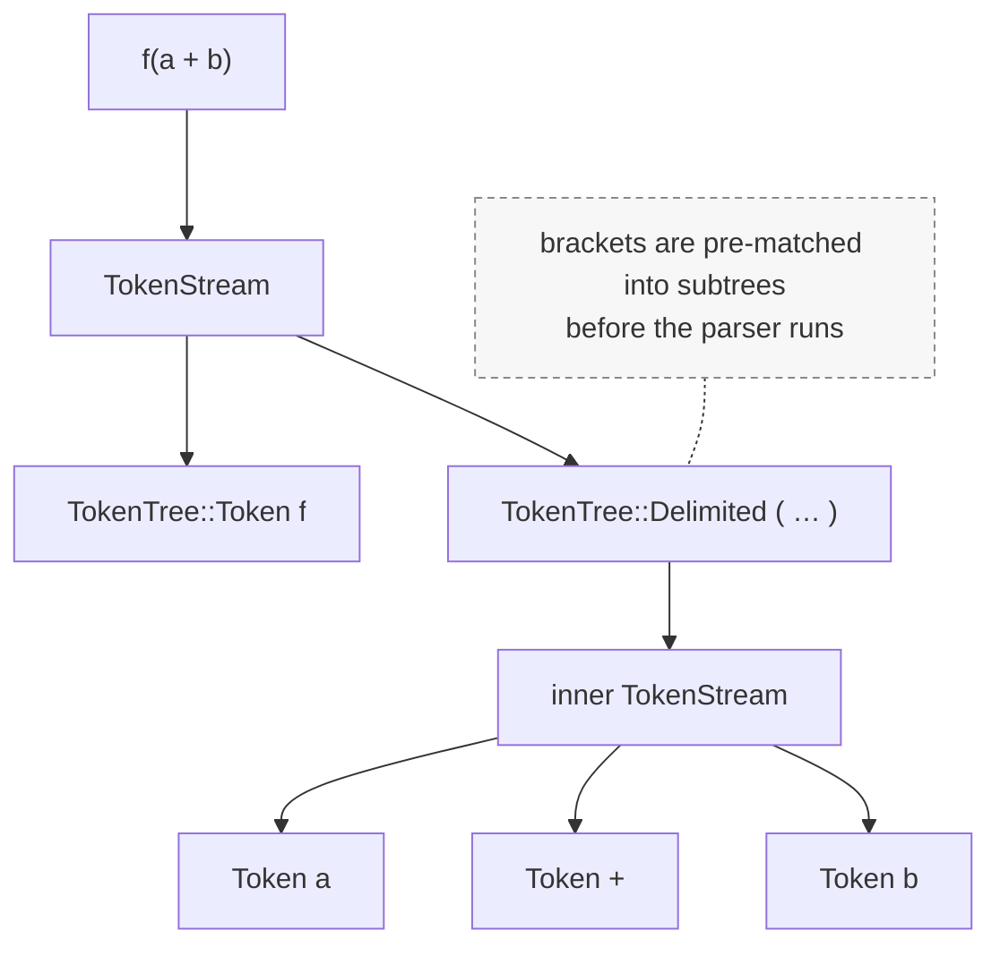
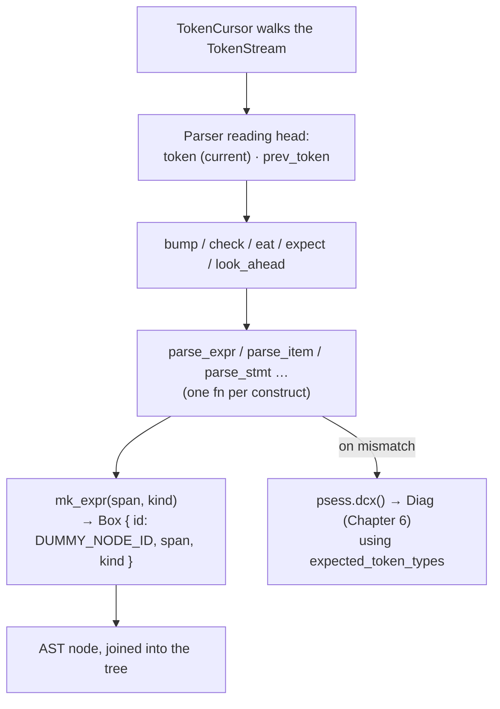
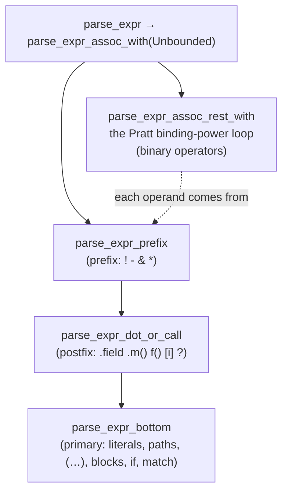
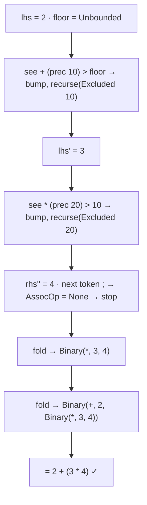
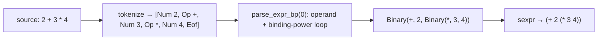

```admonish abstract title="What you'll learn"
- Why `rustc` hand-writes a recursive-descent parser in `rustc_parse` (centered on the `Parser` struct in `compiler/rustc_parse/src/parser/mod.rs`) instead of using a generator: diagnostics quality, context-sensitive corners like `<` and `>>`, and continuity with the rest of the crate graph.
- How `Parser::bump`, `check`, `eat`, `expect`, and `look_ahead` (the five-primitive driver vocabulary) compose into every `parse_*` function, and why `ExpTokenPair` quietly feeds `expected_token_types` for the famous "expected one of ..." messages.
- The shape of `TokenStream` (an `Arc<Vec<TokenTree>>` whose `Delimited` variant pre-matches brackets) and why the expression parser never has to worry about unbalanced parens.
- The `rustc_ast::Expr` node template (`id`, `kind`, `span`, `attrs`, `tokens`), how `ExprKind::Binary(BinOp, Box<Expr>, Box<Expr>)` makes precedence into nesting, and why nodes are born with `DUMMY_NODE_ID`.
- How `parse_expr` descends through `parse_expr_prefix` to `parse_expr_dot_or_call` to `parse_expr_bottom` for one operand, then runs the Pratt binding-power loop in `parse_expr_assoc_rest_with` to fold binary operators.
- How left- and right-associativity reduce to `Bound::Excluded(prec)` versus `Bound::Included(prec)` (rustc) or asymmetric `(l_bp, r_bp)` pairs (the lab), and how a chained `a < b < c` is caught inside the same loop.
```

## 7.1 Parsing: From Tokens to the Abstract Syntax Tree

### The stream has no shape

Chapter 6 left us a *located token stream*: every token knows what it is and where it came from. Take one line of that stream and look at what is still missing:

```text
let  first  =  &  v  [  0  ]  ;
```

That is `let first = &v[0];` as the parser receives it: nine tokens in a row, flat as a railway track. Nothing in that sequence says that `[0]` binds to `v` and not to `=`, that the `&` applies to the whole of `v[0]` rather than just `v`, or that the entire `&v[0]` is the value being bound to `first`. The structure is *implied* by Rust's grammar, but it is nowhere in the stream. The stream is a list; the meaning is a *tree*.

Consider the sharpest version of the problem, the one every compiler course opens with: `2 + 3 * 4`. The tokens `2 + 3 * 4` do not tell you whether this is `(2 + 3) * 4`, which is 20, or `2 + (3 * 4)`, which is 14. The flat sequence is genuinely ambiguous; only the *rules of precedence* resolve it, and the resolution must be recorded as **structure**, a tree in which `3 * 4` is a single branch that `2 +` hangs off of. Turning the flat, located token stream into that tree, the [**Abstract Syntax Tree**](../glossary.md#ast), or **AST**, is the job of the **parser**, and it is the subject of this chapter.

There is also a debt to collect. Back in §5.2 the lexer *deliberately refused* to fuse operators: it emitted `>` and `>` as two separate single-character tokens, recording only whether they were adjacent (`Spacing::Joint`), and left the decision of whether `>>` means "shift" or "two closing angle brackets in `Vec<Vec<i32>>`" to a later stage. This chapter is that later stage. The parser is where single characters become operators *in context*, where precedence becomes structure, and where the flat stream finally acquires shape.

### The classic theory: grammars, descent, and generators

The formal foundation is the **context-free grammar** (CFG): a set of **production rules** describing how to build the language's constructs from smaller ones. A toy expression grammar reads:

```text
expr → expr '+' term | term
term → term '*' factor | factor
factor → NUMBER | '(' expr ')'
```

The two-level split (`expr` over `term` over `factor`) is not decoration. It is *how a grammar encodes precedence*. Because `*` lives one level deeper than `+`, any parser that follows this grammar will necessarily group `3 * 4` before `2 +`, producing the correct `2 + (3 * 4)`. Precedence is baked into the grammar's shape.

Classic compiler theory (the Dragon Book) sorts parsing into two great families. **Top-down** parsers start from the root symbol and try to derive the input, predicting which rule applies; the canonical hand-written form is **recursive descent**, where you write *one function per grammar rule*, and the functions call each other exactly as the rules reference each other. `parse_expr` calls `parse_term` calls `parse_factor`; the call stack *is* the derivation. **Bottom-up** parsers (the **LR** family) instead shift tokens onto a stack and reduce them to non-terminals as complete rules are recognized, more powerful, but far harder to write by hand, which is why they are almost always generated by a tool.

And that is the third option: **parser generators**. You hand a tool (yacc/bison for LALR, ANTLR for LL, or in Rust's ecosystem LALRPOP, `pest`, `peg`, `nom`) a grammar, and it emits the parser for you: tables for an LR automaton, or code for a recursive-descent one. For a textbook this is the default, and for many languages it is the right call.

```admonish tip title="Pro-Tip, recursive descent cannot be left-recursive"
The grammar above is written `expr → expr '+' term`, which is *left-recursive*: the rule starts by referring to itself. A recursive-descent `parse_expr` that called `parse_expr` as its very first action would recurse forever, never consuming a token. Hand-written top-down parsers therefore rewrite such rules into a loop ("parse a `term`, then *while* you see a `+`, parse another `term`"). Keep this in mind for §7.4: the first thing you do when turning a grammar into a recursive-descent parser is eliminate left recursion, and it is the most common beginner trap.
```

### Why `rustc` writes its parser by hand

**`rustc` hand-writes a recursive-descent parser** in the crate `rustc_parse`, centered on a type called `Parser`, the same decision, and for closely related reasons, as the hand-written lexer of Chapter 5. Three forces drive that choice.

The first and most important is **diagnostics**. Recall Chapter 6: rustc invests heavily in error messages, and many of them are *syntactic*: "missing `;`", "expected `}`, found `)`", "did you mean to write `if let`?". rustc hand-writes the parser so that, on an unexpected token, it can *know what construct it was in the middle of*, guess what the user meant, insert the missing token in its mental model, recover, and keep parsing to report *more* errors in one run rather than dying at the first. Rust's syntax errors are downstream of this choice. The parser is hand-written largely so that it can fail *gracefully and informatively*.

The second is **context-sensitivity**. Rust's grammar has corners that are painful to express in a clean CFG. The `<` token opens a comparison *or* a generic argument list; `|` is the bitwise-or operator *or* the delimiter of closure parameters; and the `>>` problem from §5.2 means the parser must sometimes split a token it is looking at. A hand-written parser resolves these with a bit of local context and a peek, which is exactly what these context-sensitive corners demand.

The third is simply **control and continuity**: a hand-written parser is debuggable, profileable, and editable by the team like any other crate in the build. This is the same instinct as the lexer: rustc hand-writes its entire front end's input path, accepting the maintenance cost in exchange for error quality and control over hard cases.

### Pratt parsing: precedence without a tower of rules

Recursive descent handles most of Rust cleanly: items, statements, types, patterns each get a function, and the grammar's structure maps onto the call graph. But **expressions** are a problem. Rust has roughly a dozen precedence levels (`*` over `+` over comparisons over `&&` over `||` over assignment, and more). The pure recursive-descent recipe demands *one grammar level, and one function, per precedence level*, a tall tower of `parse_or → parse_and → parse_comparison → parse_add → parse_mul → …`, each calling the next. It works, but it is verbose, and every expression pays the cost of descending the entire tower even to parse a single literal.

The alternative `rustc` uses for expressions is **Pratt parsing**, named for Vaughn Pratt, who described it in 1973 as **Top-Down Operator Precedence** (TDOP). The standard one-line characterization, which appears across the literature, is that a Pratt parser is *an improved recursive-descent parser that associates parsing behavior with **tokens** rather than with grammar rules*. Instead of a function per precedence level, you give each operator a number, its **binding power** (sometimes "precedence"), and run a single loop:

> Parse one operand. Then, *while* the next operator's binding power is high enough to "bind" to what you have, consume that operator and recursively parse its right-hand operand (asking the recursion for everything that binds *more* tightly than the current operator). Fold the result into the tree and repeat.

That one loop, plus a binding-power table, replaces the entire tower. For `2 + 3 * 4`: parse `2`; see `+` (say, power 10) and consume it; recursively parse the right side asking for things tighter than 10, which grabs `3`, sees `*` (power 20, higher, so it binds), consumes it, grabs `4`, and returns `3 * 4` as one unit; that unit becomes the right operand of `+`. The result is `2 + (3 * 4)`, precedence resolved, associativity handled by whether the threshold is "greater than" or "greater than or equal." This is also exactly where the §5.2 deferral is paid off: the parser, looking at adjacent `>` `>` tokens with `Joint` spacing and knowing it is inside a generic argument list, decides they are two closing brackets rather than a shift operator.




### The output: the AST in `rustc_ast`

What the parser produces is the **AST**, defined in the crate `rustc_ast`. It is a tree of typed nodes that mirrors the *written syntax* faithfully: every `if`, every `+`, every parenthesis the grammar cares about is represented as the user wrote it. (This is the key contrast with the [**HIR**](../glossary.md#hir) of Chapter 10, which is the *desugared* tree where `for` loops have become `loop` + `match` and the convenient surface forms are normalized away. The AST is the surface; the HIR is the simplified interior.)

The tree is built from a handful of node families: a `Crate` at the root, `Item`s (functions, structs, modules, impls), `Stmt`s, and the three that recur everywhere: `Expr` (expressions), `Pat` (patterns), and `Ty` (type annotations). The expression node, verbatim from the current source, shows the universal shape:

```rust
// compiler/rustc_ast/src/ast.rs  (verbatim)
pub struct Expr {
    pub id: NodeId, // this node's identity (see below)
    pub kind: ExprKind, // WHICH expression, the actual variety
    pub span: Span, // where in the source (Chapter 6)
    pub attrs: AttrVec, // #[...] attributes on this expression
    pub tokens: Option<LazyAttrTokenStream>, // raw tokens, kept for macro round-tripping
}
```

Every AST node follows this template: an `id`, a `span` (the Chapter 6 payoff, *this* is why the lexer attached spans to tokens, so the parser could thread them onto nodes), and a `kind` enum carrying the actual content. For expressions the content is `ExprKind`, whose variants are the grammar of Rust expressions made into data, a sample, faithful to the source:

```rust
pub enum ExprKind {
    Lit(token::Lit), // a literal: 2, "foo", true
    Binary(BinOp, Box<Expr>, Box<Expr>), // a + b  → Binary(Add, <a>, <b>)
    Unary(UnOp, Box<Expr>), // !x, -x
    Call(Box<Expr>, ThinVec<Box<Expr>>), // f(a, b)
    MethodCall(Box<MethodCall>), // x.foo(a, b)
    If(Box<Expr>, Box<Block>, Option<Box<Expr>>), // if c { … } else { … }
    Path(Option<Box<QSelf>>, Path), // a variable or path: v, foo::bar
    AddrOf(BorrowKind, Mutability, Box<Expr>),// &v, &mut v
    Index(Box<Expr>, Box<Expr>, Span), // v[0]
    // … dozens more: Match, Loop, Closure, Assign, Field, Range, Block …
}
```

Look at `Binary(BinOp, Box<Expr>, Box<Expr>)`: a binary expression *contains two more expressions*. That self-reference is the tree. `2 + 3 * 4` becomes, concretely, `Binary(Add, Lit(2), Binary(Mul, Lit(3), Lit(4)))`, the nesting that the flat stream lacked, now explicit in the data. And the line we started with, `&v[0]`, becomes `AddrOf(_, _, Index(Path(v), Lit(0)))`, the `[0]` bound to `v` inside, the `&` wrapping the whole, exactly the structure the tokens only implied.

```admonish tip title="Pro-Tip, Box and ThinVec are the AST's size discipline"
You will see `Box<Expr>` everywhere instead of bare `Expr`. Older rustc used a newtype `P<T>` (a thin wrapper around `Box<T>`); `rustc_ast::ptr::P` was removed before 1.95, and the AST now holds children in plain `Box<T>`. The reason is structural: a recursive type *cannot contain itself by value* (an `Expr` holding an `Expr` holding an `Expr`… would be infinite-sized), so the children must live behind a pointer. It also keeps each node small. Likewise `ThinVec` is a vector that is a *single* word when empty or short, instead of `Vec`'s three, and since most argument lists and statement blocks are short, this is the same byte-counting instinct as the packed [`Span`](../glossary.md#span) of §6.1 and the interned types of §4.2, applied to the millions of nodes a real crate produces.
```

### `NodeId`: the first rung of the identity ladder

Every AST node carries a `NodeId`, and this connects directly to the identity discussion of §2.2. A `NodeId` is a simple per-crate sequential number, handed out as the parser (and later the expansion and resolution passes) creates nodes. It is the identity the *early* compiler uses: name resolution (Chapter 9) records "this `Path` resolves to that binding" by `NodeId`, and [macro expansion](../glossary.md#macro-expansion) tracks nodes by `NodeId`.

But notice what kind of identity it is: *absolute and sequential*, like an array index. That makes it the opposite of stable across edits. Insert one expression near the top of a file and every `NodeId` after it shifts, exactly the fragility §2.2 warned about for raw positions. This is fine, because a `NodeId` is *temporary*: it serves the AST-era passes and is then largely superseded when the AST is **lowered** to the HIR (Chapter 10), where the stable, two-level [`HirId`](../glossary.md#hirid) of §2.2 takes over for everything that must survive incremental recompilation. Before a node is assigned its real id, it holds the placeholder `DUMMY_NODE_ID`. So the identity ladder §2.2 promised now has its bottom rung visible: `NodeId` for the AST, then `HirId` and [`DefId`](../glossary.md#defid) after lowering (fragile-but-simple early, stable-and-structured later).




### Where this leaves us

The parser is the front end's structure-builder. It takes the flat, located token stream of Chapters 5 and 6 and discovers the tree the grammar implies, resolving the ambiguities (precedence, associativity, the `>>` and `<` context problems) that a flat sequence cannot express. `rustc` does this with a *hand-written recursive-descent* parser (one function per construct, mirroring the grammar, left-recursion eliminated) in `rustc_parse`, chosen over a generator chiefly so it can recover from errors and produce Rust's signature diagnostics, augmented with *Pratt / TDOP* parsing for expressions so that a dozen precedence levels collapse into one binding-power loop instead of a tower of rules. Its output is the **AST** in `rustc_ast`: a faithful, sugar-and-all tree of `Expr`/`Item`/`Stmt`/`Pat`/`Ty` nodes, each carrying a `Span` (the Chapter 6 payoff) and a `NodeId` (the first, fragile rung of the §2.2 identity ladder), with children held behind `Box<T>` and `ThinVec` for the by-now-familiar reasons of recursion and size.

§7.2 takes the architecture deep-dive: the real `Parser` struct in `rustc_parse`, how it holds the token stream and the current token, how `bump` and `expect` and the `check`/`eat` family drive the descent, and how the `rustc_ast` node types fit together into a full tree, including the `NodeId` assignment and the token-stream plumbing that lets macros (Chapter 8) re-parse. Then §7.3 reads the genuine `parse_expr` and its Pratt binding-power loop line by line, and §7.4 has you build a working recursive-descent-plus-Pratt parser that turns a token stream into an expression tree, wired, if you like, to the lexer you already built in §5.4.

## 7.2 The Architecture: the `Parser`, the Token Stream, and the `rustc_ast` Tree

### A reading head with one-token lookahead

For all the theory of §7.1, the `rustc` parser is structurally simple: it holds **one current token** and decides what to do by looking at it. That is the whole engine. Everything else (the rest of the real `Parser` struct's fields, the recovery machinery, the angle-bracket bookkeeping) is in service of two things the simple engine cannot do alone: produce *excellent error messages*, and feed *macros*. The shape of the struct is itself the proof of §7.1's central claim: if you were told "this parser is hand-written mostly so it can recover from errors and emit great diagnostics," and then you counted how many of its fields exist purely for diagnostics and recovery, you would believe it.

But first, a surprise about what the parser actually reads.

### The input is a *tree* of tokens, not a list

§7.1 spoke of a "flat token stream," and at the lexer's level (Chapter 5) that is true. But the thing the parser consumes is not a flat `Vec<Token>`. It is a `TokenStream`, and a `TokenStream` is already *partly* a tree. Faithful to `rustc_ast`:

```rust
// compiler/rustc_ast/src/tokenstream.rs  (faithful)
pub struct TokenStream(pub(crate) Arc<Vec<TokenTree>>);  // 8 bytes: one Arc ptr (cheap clone)

pub enum TokenTree {
    Token(Token, Spacing),  // a single token + its §5.2 spacing
    Delimited(DelimSpan, DelimSpacing, Delimiter, TokenStream),  // ( … ) [ … ] { … }
}
```

The key idea is `Delimited`: every matched pair of brackets (`(...)`, `[...]`, `{...}`) has *already been grouped* into a single [`TokenTree`](../glossary.md#token-tree) containing an inner `TokenStream`, before the real parser ever runs. Delimiter matching happens in a pre-pass (the token-tree reader), so by the time the expression parser is working, brackets are guaranteed balanced and nested. The parser walking `f(a + b)` does not see five flat tokens after `f`; it sees `f` followed by *one* `Delimited` tree whose interior is the stream `a + b`. This is why you never see the expression parser fretting about unbalanced parentheses. That error was caught earlier, by the delimiter pre-pass, which can give a far better "unclosed `(`" message because it knows exactly where the opener was. It is also why **macros** (Chapter 8) are tractable: a macro operates on `TokenStream`s, and pre-grouped delimiters mean a macro can be handed `( … )` as one tidy subtree.




### The `Parser` struct, field by field

Here is one field from each group, with the rest elided. The real struct has 20 fields totalling 288 bytes (enforced by `static_assert_size!(Parser<'_>, 288)`), and the field order in the source is more interleaved than the pedagogical grouping here:

```rust
// compiler/rustc_parse/src/parser/mod.rs  (faithful; field order regrouped pedagogically)
pub struct Parser<'a> {
    // ── the session: gateway to spans and diagnostics (Chapter 6) ──
    pub psess: &'a ParseSess, // holds the SourceMap and the DiagCtxt

    // ── the reading head: the actual parsing state ──
    pub token: Token, // THE current token, the one-token lookahead
    pub prev_token: Token, // the token we just consumed (for spans)
    // … token_spacing, token_cursor, num_bump_calls …

    // ── diagnostics & error recovery (the bulk of the struct) ──
    expected_token_types: TokenTypeSet, // what would have been valid here → "expected X"
    // … unmatched_angle_bracket_count, angle_bracket_nesting, parsing_generics,
    //   last_unexpected_token_span, subparser_name, recovery, break_last_token,
    //   in_fn_body, fn_body_missing_semi_guar …

    // ── token capture, for macros / proc-macros (Chapter 8) ──
    capture_state: CaptureState,  // fills the `tokens` field of AST nodes
    // … pub capture_cfg …

    // ── misc parsing context ──
    // e.g. "no struct literals here" (in `if` conditions)
    restrictions: Restrictions,
    // … current_closure …
}
```

Count by category. A small handful of fields (`token`, `prev_token`, `token_cursor`, `token_spacing`) are the actual parsing engine, plus `psess` for output. The remainder are overwhelmingly about *failing well*: `expected_token_types` so an error can say "expected `;`, `,`, or `}`"; the angle-bracket counters to untangle `<` and `>`; `recovery`, `last_unexpected_token_span`, `subparser_name`, `break_last_token` for graceful recovery; and the capture fields for macros. §7.1 claimed `rustc` hand-writes the parser largely for diagnostics and macros; the struct *is* that claim, made of fields.

```admonish tip title="Pro-Tip, psess is the parser's line to Chapter 6"
The `psess: &ParseSess` field is how every span and every error gets made. When a `parse_`* method needs to report a problem it calls `self.dcx()` (which goes through `psess` to the `DiagCtxt` of §6.2) and builds a [`Diag`](../glossary.md#diag); when it needs to make a span for a node it combines `self.prev_token.span` and `self.token.span` through the `SourceMap`. The parser does not own diagnostics or the source map. It borrows them from the session. If you are reading parser code and see `self.dcx().struct_span_err(...)`, that is the §6.2 machinery being driven from inside the descent.
```

### The driver vocabulary: `bump`, `check`, `eat`, `expect`, `look_ahead`

Every `parse_`* function in the entire parser is built from a tiny set of primitives that operate on that reading head. The dev-guide names them, and their behavior is faithful below:

```rust
impl<'a> Parser<'a> {
    // Advance: the consumed token becomes prev_token; pull the next from the cursor.
    pub fn bump(&mut self) { /* prev_token = mem::replace(&mut token, cursor.next()); … */ }

    // Peek: is the current token this kind? (does NOT consume)
    pub fn check(&mut self, exp: ExpTokenPair) -> bool {
        /* records exp.token_type into expected_token_types if absent */
    }

    // Conditionally consume: if the current token matches, bump and return true.
    pub fn eat(&mut self, exp: ExpTokenPair) -> bool {
        let matched = self.check(exp);
        if matched { self.bump(); }
        matched
    }

    // Demand: consume the expected token, or produce a recoverable error.
    pub fn expect(&mut self, exp: ExpTokenPair) -> PResult<'a, Recovered> { /* … */ }

    // Look further ahead without consuming, via the cursor.
    pub fn look_ahead<R>(&self, n: usize, f: impl FnOnce(&Token) -> R) -> R { /* … */ }
}
```

`ExpTokenPair` bundles a `TokenKind` with a `TokenType` (the diagnostic-facing name); that pairing is what lets `check` record what it was looking for into `expected_token_types`.

That is essentially the whole interface. Read it as a sentence: *peek* to decide which rule applies (`check`/`look_ahead`), *conditionally take* optional pieces (`eat`), *demand* required pieces (`expect`), and *advance* (`bump`). A recursive-descent function for a `let` statement, for instance, is little more than "`expect(let); parse a pattern; if eat(=) then parse an expression; expect(;)`." The notable detail is that `check` quietly records the token it was hoping for into `expected_token_types`, so that *if* the parse later fails, the accumulated set of "things that would have been valid here" is ready to render the famous `expected one of …, found …` message. Error reporting is woven into the very act of looking.

```admonish warning title="Warning, eat consumes, check does not"
The single most common bug when writing or modifying parser code is confusing `eat` (which advances the reading head if it matches) with `check` (which only peeks). Call `eat` when you mean to peek and you will silently swallow a token and desynchronize the entire parse downstream, often producing a baffling error several tokens later. The mental rule mirrors the lexer's `bump`-vs-`first` of §5.3: `check`/`look_ahead` look, `eat`/`bump`/`expect` commit. When a parse goes wrong "one token too far," an over-eager `eat` is the first suspect.
```

### Where the §5.2 debt is finally paid

Two of those diagnostic fields exist to solve the exact problems §7.1 promised the parser would handle. The `token_spacing` field carries each token's `Spacing`, `Joint` or `Alone`, straight from the lexer's Layer 2 (§5.2). When the parser is parsing a binary operator and sees `+` with `Joint` spacing followed by `=`, it can *glue* them into `+=`; the lexer deliberately did not, precisely so the parser could decide in context. And `unmatched_angle_bracket_count` / `angle_bracket_nesting` are how the parser tracks whether a `<` opened a generic argument list, so that a later `>` (or a glued `>>`, which `break_last_token` can split back apart) is understood as closing generics rather than as a comparison or a shift. This is the resolution of `Vec<Vec<i32>>`, the parser counts the brackets it opened and splits the `>>` token to close them. The "context-sensitivity" bullet of §7.1 lives in these three little fields.

### Assembling the tree: `mk_expr` and `DUMMY_NODE_ID`

When a `parse_`* function has gathered a construct's pieces, it builds the AST node with a small helper. For expressions it is `mk_expr`, faithful:

```rust
// compiler/rustc_parse/src/parser/expr.rs  (faithful; pedagogically inlined,
// real source splits this across `mk_expr` and `mk_expr_with_attrs` in the same file)
pub(crate) fn mk_expr(&self, span: Span, kind: ExprKind) -> Box<Expr> {
    Box::new(Expr {
        id: DUMMY_NODE_ID, // real NodeId assigned later (see below)
        kind, // the variant we just parsed
        // usually prev_token.span .to(start), the node's extent
        span,
        attrs: AttrVec::new(),
        // filled by the capture machinery if a macro needs them
        tokens: None,
    })
}
```

Two details matter. First, the `span` is computed by *joining* spans, typically the start position the function remembered (`lo`) extended `.to(...)` the span of the last token consumed, so the node's span exactly covers the source it came from, the Chapter 6 payoff threaded onto a tree node. Second, and connecting straight back to §7.1's identity discussion: the node is born with `DUMMY_NODE_ID`, *not* a real `NodeId`. The parser is concerned with *shape*, not identity; the real `NodeId`s are stamped on in a later pass once the full AST exists (during/after macro expansion, before name resolution). The `tokens` field is likewise usually `None`, filled only when the capture machinery determines a macro will need the original token text, the plumbing behind §7.1's `tokens: Option<LazyAttrTokenStream>`.

The nodes assemble into the tree §7.1 described: a `Crate` of `Item`s, each `Item` (a `fn`, say) holding a `Block` of `Stmt`s, each `Stmt` holding `Expr`s, all owned through `Box<T>` and `ThinVec`. (The legacy `P<T>` newtype that the rustc-dev-guide and older sources still mention has been replaced by plain `Box<T>` throughout the parser.) One large owned tree, every node carrying its `Span` and its (eventual) `NodeId`.




### Organized by construct

A last architectural note that pays off when you go looking for code. The parser is split into files *by the syntactic construct each one parses*, and the dev-guide highlights that this naming scheme recurs across the whole compiler. In `rustc_parse/src/parser/` the files are named for the construct they parse, for example `expr.rs` and `item.rs`. The entry point that parses a whole file is the crate/module parser; macros use a `parse_nonterminal`-style entry point to parse a fragment like `:expr` or `:pat`. So to find how Rust parses any construct, you can usually guess the filename, and you will meet `expr.rs` again in §7.3, because that is where the Pratt loop lives.

### Where this leaves us

The architecture is now in hand. The parser reads a `TokenStream` whose delimiters are already matched into `Delimited` subtrees, so brackets are balanced before expression parsing begins and macros can be handed tidy token groups. Its engine is a four-field reading head (current `token`, its `token_spacing`, the `prev_token`, and a `token_cursor`) driven by the tiny `bump`/`check`/`eat`/`expect`/`look_ahead` vocabulary that every `parse_`* function composes. The dozen remaining struct fields are the cost of doing diagnostics and macros well: the expected-token set, the angle-bracket counters that resolve `<`/`>>` (the §5.2 and §7.1 debts paid in `token_spacing` and `break_last_token`), the recovery state, and the token-capture machinery. Nodes are built by helpers like `mk_expr` that join spans and stamp `DUMMY_NODE_ID`, deferring real identity to a later pass, and assemble into the one big owned `rustc_ast` tree, organized in source by construct.

§7.3 descends into `expr.rs` and reads the real expression parser: how `parse_expr` parses a first operand and then runs the Pratt **binding-power** loop (consuming operators while their precedence is high enough, recursing for right operands, and folding `Binary`/`Unary` nodes) turning `2 + 3 * 4` into the correctly nested tree we drew in §7.1. The theory of Pratt parsing becomes a `while` loop you can read.

## 7.3 Reading the Source: `parse_expr` and the Pratt Binding-Power Loop

### The dozen-level tower, collapsed into one loop

The correctness of `2 + 3 * 4`, the thing every compiler course frets over, comes down to about fifteen lines in `rustc_parse/src/parser/expr.rs`: a `while` loop, a precedence comparison, and a recursive call. Rust's roughly dozen levels of operator precedence do not become a tower of a dozen mutually-recursive functions; they collapse into that single Pratt binding-power loop, as §7.1 promised. We trace those fifteen lines by hand and watch the correctly nested tree fall out.

### The entry chain, and what counts as "one operand"

`Parser::parse_expr` is the public door. It parses any outer attributes and then delegates to the associative-expression parser with no lower precedence bound: "parse a full expression, stopping at nothing." Faithful to the source:

```rust
// compiler/rustc_parse/src/parser/expr.rs  (faithful)
pub fn parse_expr(&mut self) -> PResult<'a, Box<Expr>> {
    self.current_closure.take();
    let attrs = self.parse_outer_attributes()?;
    // parse_expr_res sets restrictions = empty, then internally calls
    // parse_expr_assoc_with(Bound::Unbounded, attrs), i.e. "no minimum
    // precedence: consume operators all the way down."
    self.parse_expr_res(Restrictions::empty(), attrs).map(|res| res.0)
}
```

`parse_expr_assoc_with` does two things in order: parse a single **left-hand operand**, then run the binding-power loop over any operators that follow. The first half is itself a little descent, and it is where prefix, postfix, and primary precedence are settled before any binary operator is even considered:

```rust
// faithful (range-separator path elided); the operand is parsed by a fixed descent chain
pub(super) fn parse_expr_assoc_with(&mut self, min_prec: Bound<ExprPrecedence>, attrs: AttrWrapper)
    -> PResult<'a, (Box<Expr>, bool)>
{
    // ← parse ONE operand (see the chain below)
    let lhs = self.parse_expr_prefix(attrs)?;
    self.parse_expr_assoc_rest_with(min_prec, false, lhs)   // ← then the operator loop
}
```

That `parse_expr_prefix` is the top of a three-link chain, each link handling a tighter-binding class of syntax than the last:

- `parse_expr_prefix` handles **prefix** operators: `!x`, `-x`, `&x`, `*x`. These bind tighter than any binary operator, so they are absorbed into the operand before the loop runs. A prefix op recurses back into `parse_expr_prefix` for its own operand (so `!!x` works).
- `parse_expr_dot_or_call` handles **postfix** syntax: field access `x.field`, method calls `x.foo()`, function calls `f(...)`, indexing `x[i]`, the `?` operator. These bind tightest of all, so they sit at the bottom of the prefix link.
- `parse_expr_bottom` is, in the source's own words, the bottom (or top?) of the precedence hierarchy: the **primary** expressions, literals, paths, parenthesized expressions, blocks, `if`, `match`, `loop`, `return`, macros. The doc note warns it only works correctly when reached *through* `parse_expr_dot_or_call`, because a primary like `foo` must immediately be open to a trailing `.bar()` or `(args)`.

So "one operand," to the binding-power loop, already means "all the prefix ops, a primary, and all the postfix ops," the whole tight-binding cluster. The loop only ever has to think about *binary* (associative) operators. That division is what keeps the loop small.




### The binding-power loop

Here is the heart, the loop that replaces the tower, faithful in shape to `parse_expr_assoc_rest_with`:

```rust
// compiler/rustc_parse/src/parser/expr.rs  (faithful; ~80 lines of error-recovery elided)
pub(super) fn parse_expr_assoc_rest_with(
    &mut self,
    min_prec: Bound<ExprPrecedence>,
    starts_stmt: bool,
    mut lhs: Box<Expr>,
) -> PResult<'a, (Box<Expr>, bool)> {
    let mut parsed_something = false;
    if !self.should_continue_as_assoc_expr(&lhs) { // ⓪ should we even loop?
        return Ok((lhs, parsed_something));
    }
    self.expected_token_types.insert(TokenType::Operator);
    while let Some(op) = self.check_assoc_op() {  // ① keyed to the token
       //   (thin wrapper over AssocOp::from_token with `and`/`or` → `&&`/`||` recovery)
        let prec = op.node.precedence();
        if match min_prec {  // ② precedence gate, explicit
            Bound::Included(m) => prec < m,
            Bound::Excluded(m) => prec <= m,
            Bound::Unbounded   => false,
        } { break; }
        parsed_something = true;
        self.bump();  // ③ commit
        // … recovery for ===, !==, <>, <=>, ++, -- elided …
        let op_span = op.span;
        let op = op.node;
        if op == AssocOp::Cast      { lhs = self.parse_assoc_op_cast(/*…*/)?; continue; }
        if let AssocOp::Range(lim) = op {
            lhs = self.parse_expr_range(prec, lhs, lim, /*cur_op_span*/ op_span)?;
            break;
        }
        let rhs_min_prec = match op.fixity() { // left-assoc → strictly tighter;
            Fixity::Right => Bound::Included(prec), // right-assoc → ≥
            Fixity::Left | Fixity::None    => Bound::Excluded(prec),
        };
        let (rhs, _) = self.with_res(self.restrictions - Restrictions::STMT_EXPR, |this| {
            let attrs = this.parse_outer_attributes()?;
            this.parse_expr_assoc_with(rhs_min_prec, attrs)
        })?;
        let span = self.mk_expr_sp(&lhs, /* lhs_span (interpolated-aware) */ lhs.span, op_span, rhs.span);
        lhs = match op {   // ④ fold
            AssocOp::Binary(ast_op) =>
                self.mk_expr(span, self.mk_binary(respan(op_span, ast_op), lhs, rhs)),
            AssocOp::Assign =>
                self.mk_expr(span, ExprKind::Assign(lhs, rhs, op_span)),
            AssocOp::AssignOp(aop) =>
                self.mk_expr(span, self.mk_assign_op(respan(op_span, aop), lhs, rhs)),
            AssocOp::Cast | AssocOp::Range(_) => unreachable!(/*handled by special cases above*/),
        };
    }
    Ok((lhs, parsed_something))
}
```

Read it as four moves, repeated:

1. **Is there an operator?** `AssocOp::from_token(&self.token)` asks whether the current token is an associative operator: `+`, `*`, `==`, `&&`, `=`, and so on. If it returns `None` (the token is a `;`, a `)`, a `}`, anything that is not a binary operator), the loop ends: the expression is complete. This is the *Pratt insight from §7.1 in code*, behavior is keyed to the **token**, via `AssocOp::from_token`, not to a grammar rule.
2. **Does it bind tightly enough?** Each operator has a `precedence()` (its binding power). If it is not greater than `min_prec`, the floor passed in by whoever called us, the loop breaks and returns the operand untouched, letting the looser-level caller take over. This single comparison is what the entire grammar tower of `parse_add → parse_mul` was doing implicitly.
3. **Consume and recurse.** `bump` the operator, then parse the right-hand side by recursing with the floor raised to `Bound::Excluded(prec)`, "give me everything that binds *strictly* tighter than this operator." That strictness is precisely left-associativity: equal-precedence operators to the right will *not* be folded into this RHS, so `a - b - c` parses as `(a - b) - c`.
4. **Fold.** Combine `lhs` and `rhs` into a single node, `Binary`, `Assign`, `AssignOp`, whose span runs `lhs.span.to(rhs.span)`, then loop with that node as the new `lhs`.

### Tracing `2 + 3 * 4`

Walk the loop by hand on the running example, with `+` at precedence 10 and `*` at precedence 20 (higher binds tighter):

- `parse_expr` → operand `lhs = 2` (via the descent chain). Enter the loop with `min_prec = Unbounded`.
- Token is `+`. `AssocOp::from_token` → `Add`, `prec = 10`, which is above the unbounded floor. `bump` the `+`.
- Recurse for the RHS with floor `Excluded(10)`. Operand `lhs' = 3`. Enter the inner loop.
  - Token is `*`. `prec = 20`, above 10 → it binds. `bump` the `*`.
  - Recurse for *its* RHS with floor `Excluded(20)`. Operand `4`. Token after is `;`/EOF → `AssocOp::from_token` returns `None` → inner-inner loop ends, returns `4`.
  - Fold: `lhs' = Binary(Mul, 3, 4)`. Loop again: token is `;`/EOF → `None` → ends. Return `Binary(Mul, 3, 4)`.
- Back in the outer loop, `rhs = Binary(Mul, 3, 4)`. Fold: `lhs = Binary(Add, 2, Binary(Mul, 3, 4))`. Loop again: `;`/EOF → ends.

The result is `Binary(Add, 2, Binary(Mul, 3, 4))`, exactly `2 + (3 * 4)`, the tree from §7.1. Notice *why* it is correct: when the loop saw `*` while building the right side of `+`, `*`'s higher precedence cleared the `Excluded(10)` floor, so the recursion grabbed `3 * 4` as a complete unit *before* returning it to be `+`'s right operand. Precedence became nesting through nothing more than a number comparison and a recursive call.




```admonish tip title="Pro-Tip, associativity is just Excluded vs Included"
The whole left-versus-right associativity question reduces to one choice: what floor does the RHS recursion get? Left-associative operators (most of them) recurse with `Bound::Excluded(prec)`, equal precedence does *not* re-bind to the right, so `a - b - c` is `(a - b) - c`. A right-associative operator (assignment `=`, so that `a = b = c` is `a = (b = c)`) recurses with the bound *including* its own precedence, letting an equal-precedence operator fold into the right side. If you ever implement this yourself (you will, in §7.4) and your subtraction comes out right-associative, this single `Excluded`/`Included` choice is the bug.
```

### Error quality, inside the loop

§7.1 and §7.2 argued the parser is hand-written chiefly for diagnostics; the binding-power loop is a good place to see that conviction at work, because the cleanest place to *catch a mistake* is exactly where you know the precedence structure. The standout example, called out in the parser's own documentation, is **chained comparisons**. In Rust, `a < b < c` is an error, and the parser detects it precisely here. Because all comparison operators share one precedence and are left-associative, the loop would naturally try to parse `(a < b) < c`; the parser notices the chain at that moment and, rather than emitting a baffling type error later, produces a targeted message suggesting you parenthesize or, if it looks like a mis-typed generic, use the turbofish `::<>`. The same machinery recovers from the non-existent ternary `cond ? a : b` (suggesting `if`) and a few other near-misses. These recoveries can be written well precisely because they live inside the structural loop that already understands what binds to what; the loop has the local context needed to recognise a chained comparison the moment it appears and suggest the fix. The diagnostic fields of the §7.2 struct and the binding-power loop of this section are two views of the same design: structure understood well enough to explain itself when it breaks.

### How this builds, and what is next

We have read the engine room of expression parsing. `parse_expr` parses one tight-binding operand through the fixed `prefix → dot_or_call → bottom` descent, then `parse_expr_assoc_rest_with` runs the Pratt loop: while the current token is an `AssocOp` that binds above the current floor, consume it, recurse for a right operand at a raised floor (`Excluded` for left-associativity), and fold a `Binary`/`Assign` node spanning `lhs.span.to(rhs.span)`. That loop is the dozen-level precedence tower of §7.1 reduced to a number comparison, and tracing `2 + 3 * 4` showed precedence turning into nesting in real time. The same loop is where Rust catches chained comparisons and ternaries with helpful suggestions, the §7.2 "hand-written for diagnostics" thesis, observed from the inside.

§7.4 closes the chapter by having you build this. You will write a small recursive-descent parser with a Pratt binding-power loop that turns a token stream, ideally the very one your §5.4 lexer produces, into an expression AST, complete with a precedence table, left- and right-associative operators, and `Binary`/`Unary` nodes carrying spans. When your parser turns `2 + 3 * 4` into `(+ 2 (* 3 4))` and `1 - 2 - 3` into `(- (- 1 2) 3)`, you will have reproduced, in your own code, the loop you just read.

## 7.4 Hands-On Lab: Build a Recursive-Descent and Pratt Parser

### The third floor of the front end

You have built a lexer (§5.4) that turns source into tokens, and an emitter (§6.4) that turns spans into errors. This lab builds the piece between them and above them: the parser that turns the token stream into a tree. You will add the real `syn` crate, the parser that nearly every Rust procedural macro in existence uses, and watch it nest `2 + 3 * 4` into exactly the shape your own hundred-line parser produced. When your toy and the production parser agree on the tree, you will know the Pratt loop of §7.3 is genuinely in your hands.

As before: `cargo new`, pure `std` for Lab A, one dependency for Lab B.

### Lab A, a Pratt parser, end to end

We will parse arithmetic with `+ - * /`, right-associative `^` (exponentiation), unary minus, and parentheses, enough to exercise precedence, both associativities, prefix operators, and grouping. Start with a tiny lexer (the same shape as §5.4, trimmed to what we need) and the AST, whose `Box<Expr>` is the same `Box<Expr>` you saw on `ExprKind` in §7.1:

```rust
// src/main.rs, a recursive-descent + Pratt expression parser

// Lab-side analogues of rustc's BinOpKind / UnOp (rustc_ast::ast).
#[derive(Debug, Clone, Copy, PartialEq)]
enum BinOp { Add, Sub, Mul, Div, Pow }

#[derive(Debug, Clone, Copy, PartialEq)]
enum UnOp { Neg }

#[derive(Debug, Clone, PartialEq)]
enum Token { Num(f64), Op(BinOp), LParen, RParen, Eof }

fn tokenize(src: &str) -> Vec<Token> {
    let mut toks = Vec::new();
    let mut chars = src.chars().peekable();
    while let Some(&c) = chars.peek() {
        match c {
            c if c.is_whitespace() => { chars.next(); }
            '0'..='9' | '.' => {
                let mut n = String::new();
                while let Some(&d) = chars.peek() {
                    if d.is_ascii_digit() || d == '.' { n.push(d); chars.next(); } else { break; }
                }
                toks.push(Token::Num(n.parse().unwrap()));
            }
            '+' => { toks.push(Token::Op(BinOp::Add)); chars.next(); }
            '-' => { toks.push(Token::Op(BinOp::Sub)); chars.next(); }
            '*' => { toks.push(Token::Op(BinOp::Mul)); chars.next(); }
            '/' => { toks.push(Token::Op(BinOp::Div)); chars.next(); }
            '^' => { toks.push(Token::Op(BinOp::Pow)); chars.next(); }
            '(' => { toks.push(Token::LParen); chars.next(); }
            ')' => { toks.push(Token::RParen); chars.next(); }
            // ignore the unexpected (a real parser would diagnose, §6)
            _   => { chars.next(); }
        }
    }
    toks.push(Token::Eof);
    toks
}

#[derive(Debug)]
enum Expr {
    Num(f64),
    // Box<Expr> (recursion needs a pointer; same as §7.1's ExprKind).
    // `BinOp`/`UnOp` here map to rustc's `BinOpKind` / `UnOp` in `rustc_ast::ast`.
    Unary(UnOp, Box<Expr>),
    Binary(BinOp, Box<Expr>, Box<Expr>),
}
```

Now the parser. It is the §7.2 reading head (a token slice plus a position, with `check`/`eat`/`expect` driving the descent exactly as §7.2 described, scaled down) wrapped around the §7.3 binding-power loop. The operand half is factored into three helpers, `parse_prefix` → `parse_postfix` → `parse_primary`, mirroring the §7.3 `parse_expr_prefix` → `parse_expr_dot_or_call` → `parse_expr_bottom` chain:

```rust
struct Parser { toks: Vec<Token>, pos: usize }

impl Parser {
    fn new(toks: Vec<Token>) -> Parser { Parser { toks, pos: 0 } }

    // ── the §7.2 driver vocabulary, scaled down ──
    // peek / look_ahead: inspect without consuming
    fn peek(&self) -> &Token { &self.toks[self.pos] }
    // bump: advance the reading head
    fn bump(&mut self) -> Token { let t = self.toks[self.pos].clone(); self.pos += 1; t }
    // check: is the current token this one? (does NOT consume)
    fn check(&self, t: &Token) -> bool { self.peek() == t }
    // eat: conditionally consume; returns true if it matched
    fn eat(&mut self, t: &Token) -> bool {
        if self.check(t) { self.bump(); true } else { false }
    }
    // expect: demand the token (lab-grade: panic; rustc returns a Diag)
    fn expect(&mut self, t: &Token) {
        if !self.eat(t) { panic!("expected {t:?}, found {:?}", self.peek()); }
    }

    /// The Pratt loop, mirrors `parse_expr_assoc_with` (§7.3).
    /// `min_bp` is the precedence floor, exactly like rustc's `min_prec`.
    fn parse_expr_bp(&mut self, min_bp: u8) -> Expr {
        // ── 1. Parse ONE operand via the prefix → postfix → primary chain. ─
        let mut lhs = self.parse_prefix();

        // ── 2. The binding-power loop over binary operators. ──
        loop {
            let op = match self.peek() {
                Token::Op(c) => *c,
                // not an operator → expression ends
                _ => break,
            };
            let (l_bp, r_bp) = infix_bp(op);
            // binds too loosely → hand back to caller
            if l_bp < min_bp { break; }
            self.bump(); // consume the operator
            // recurse at the right binding power
            let rhs = self.parse_expr_bp(r_bp);
            // fold via mk_binary, like rustc
            lhs = self.mk_binary(op, lhs, rhs);
        }
        lhs
    }

    /// Prefix link: handles `-x`, then delegates to postfix. Mirrors
    /// rustc's `parse_expr_prefix` (§7.3); recurses into itself for `--x`.
    fn parse_prefix(&mut self) -> Expr {
        if self.eat(&Token::Op(BinOp::Sub)) {
            // prefix unary minus: binds tighter than +,-,*,/
            let rhs = self.parse_expr_bp(PREFIX_BP);
            return self.mk_unary(UnOp::Neg, rhs);
        }
        self.parse_postfix()
    }

    /// Postfix link: this lab has no postfix ops, so it just delegates to
    /// primary. This is where you would add `.field`, `f(args)`, indexing;
    /// in rustc it is `parse_expr_dot_or_call`. The empty shell makes the
    /// three-link descent visible and primes Extension 1.
    fn parse_postfix(&mut self) -> Expr {
        self.parse_primary()
    }

    /// Primary: literals and parenthesized expressions. Mirrors rustc's
    /// `parse_expr_bottom` (§7.3): the bottom of the descent, where the
    /// "first thing" of an expression is decided.
    fn parse_primary(&mut self) -> Expr {
        if self.eat(&Token::LParen) {
            // grouping resets the floor to 0
            let inner = self.parse_expr_bp(0);
            self.expect(&Token::RParen);
            return inner;
        }
        match self.bump() {
            Token::Num(n) => Expr::Num(n),
            other => panic!("expected an operand, found {other:?}"),
        }
    }

    // The lab-grade analogues of rustc's `mk_expr` / `mk_binary` / `mk_unary`
    // helpers in `rustc_parse/src/parser/expr.rs`. With no span or NodeId to
    // stamp here, they reduce to the constructor + a `Box`, but naming the
    // fold step is the §7.2 teaching beat.
    fn mk_binary(&self, op: BinOp, lhs: Expr, rhs: Expr) -> Expr {
        Expr::Binary(op, Box::new(lhs), Box::new(rhs))
    }
    fn mk_unary(&self, op: UnOp, rhs: Expr) -> Expr {
        Expr::Unary(op, Box::new(rhs))
    }
}

const PREFIX_BP: u8 = 9;

/// Binding-power table. Higher binds tighter. The (left, right) ASYMMETRY encodes associativity:
///   left-assoc  → left < right  (so equal-precedence ops do NOT re-bind to the right)
///   right-assoc → left > right  (so equal-precedence ops DO fold into the right)
/// This is the concrete form of §7.3's `Excluded`-vs-`Included` choice.
fn infix_bp(op: BinOp) -> (u8, u8) {
    match op {
        BinOp::Add | BinOp::Sub => (1, 2), // left-assoc
        BinOp::Mul | BinOp::Div => (3, 4), // left-assoc, tighter
        BinOp::Pow  => (8, 7), // RIGHT-assoc (left > right), tightest binary op
    }
}
```

The associativity trick is worth pausing on, because it is exactly §7.3's `Excluded`/`Included` Pro-Tip in numeric form. A left-associative operator like `-` has `(l_bp, r_bp) = (1, 2)`: after consuming it we recurse with floor `2`, so a *second* `-` (whose `l_bp` is only `1`) fails the `l_bp < min_bp` test and is left for the outer loop, giving `(a - b) - c`. A right-associative operator like `^` has `(8, 7)`: after consuming it we recurse with floor `7`, so a *second* `^` (whose `l_bp` is `8`) passes the test and folds into the right side, giving `a ^ (b ^ c)`. One swapped pair of numbers is the entire difference between left and right associativity.

rustc encodes the same asymmetry differently. Instead of two binding-power numbers per operator, it uses a single `ExprPrecedence` enum and toggles between `Bound::Included(prec)` (right-associative, so `prec <= m` is the break test) and `Bound::Excluded(prec)` (left-associative, `prec < m`). The choice is driven by a `Fixity` enum, see `rustc_ast::util::parser`. Different machinery, identical effect.

Finally an S-expression printer, so the tree is legible, and a `main`:

```rust
fn bin_glyph(op: BinOp) -> char {
    match op {
        BinOp::Add => '+', BinOp::Sub => '-',
        BinOp::Mul => '*', BinOp::Div => '/',
        BinOp::Pow => '^',
    }
}
fn un_glyph(op: UnOp) -> char { match op { UnOp::Neg => '-' } }

fn sexpr(e: &Expr) -> String {
    match e {
        Expr::Num(n) => format!("{n}"),
        Expr::Unary(op, x) => format!("({} {})", un_glyph(*op), sexpr(x)),
        Expr::Binary(op, l, r) => format!("({} {} {})", bin_glyph(*op), sexpr(l), sexpr(r)),
    }
}

fn main() {
    for src in ["2 + 3 * 4", "1 - 2 - 3", "2 ^ 3 ^ 2", "-2 + 3", "(2 + 3) * 4",
                "1 + 2 * 3 - 4 / 2"] {
        let mut p = Parser::new(tokenize(src));
        println!("{src:>18} => {}", sexpr(&p.parse_expr_bp(0)));
    }
}
```

````admonish example title="Expected output" collapsible=true
Run `cargo run`, and the trees match the §7.3 predictions exactly:

```text
         2 + 3 * 4   =>   (+ 2 (* 3 4))
         1 - 2 - 3   =>   (- (- 1 2) 3)
         2 ^ 3 ^ 2   =>   (^ 2 (^ 3 2))
            -2 + 3   =>   (+ (- 2) 3)
       (2 + 3) * 4   =>   (* (+ 2 3) 4)
 1 + 2 * 3 - 4 / 2   =>   (- (+ 1 (* 2 3)) (/ 4 2))
```
````

`*` binds tighter than `+`, `-` is left-associative, `^` is right-associative, unary minus and parentheses behave, all from one loop and a six-line table. That is the dozen-level precedence tower of §7.1, collapsed exactly as promised.




### Lab B, drive the real parser, `syn`

Now the convergence test. `syn` is the production Rust parser that nearly every derive and procedural macro in the ecosystem runs on, and it exposes exactly the AST shapes of §7.1. Add it:

```bash
cargo add syn --features full
```

```rust
use syn::{Expr, BinOp, UnOp, Lit};

/// Print syn's AST in the same S-expression form as Lab A.
fn sexpr(e: &Expr) -> String {
    match e {
        Expr::Lit(l) => match &l.lit {
            Lit::Int(i)   => i.base10_digits().to_string(),
            Lit::Float(f) => f.base10_digits().to_string(),
            _ => "?".to_string(),
        },
        // syn::ExprBinary { left, op, right }
        Expr::Binary(b) => {
            let op = match b.op {
                BinOp::Add(_) => "+", BinOp::Sub(_) => "-",
                BinOp::Mul(_) => "*", BinOp::Div(_) => "/",
                _ => "?",
            };
            format!("({op} {} {})", sexpr(&b.left), sexpr(&b.right))
        }
        Expr::Unary(u) => { // syn::ExprUnary { op, expr }
            let op = match u.op { UnOp::Neg(_) => "-", _ => "?" };
            format!("({op} {})", sexpr(&u.expr))
        }
        // syn preserves explicit parens in the AST; unwrap them so the shape matches Lab A
        Expr::Paren(p) => sexpr(&p.expr),
        Expr::Group(g) => sexpr(&g.expr),
        _ => "?".to_string(),
    }
}

fn main() {
    for src in ["2 + 3 * 4", "1 - 2 - 3", "(2 + 3) * 4"] {
        let e: Expr = syn::parse_str(src).expect("valid Rust expression");
        println!("{src:>14}   =>   {}", sexpr(&e));
    }
}
```

```admonish example title="What you should see" collapsible=true
`syn::parse_str::<Expr>("2 + 3 * 4")` returns `Expr::Binary(ExprBinary { left: 2, op: Add, right: Expr::Binary { left: 3, op: Mul, right: 4 } })`, the *same nesting* your Lab-A parser produced, printed as `(+ 2 (* 3 4))`. `1 - 2 - 3` comes back left-associated as `(- (- 1 2) 3)`, exactly as yours did. The production parser used by the entire macro ecosystem and your hundred-line toy agree, because they implement the same idea: operators carry precedence, and a loop folds them into a tree. (`syn` does not use `^` for exponentiation, in Rust `^` is bitwise XOR, so test associativity differences with the other operators, or with assignment `a = b = c`.)
```

```admonish tip title="Pro-Tip, syn is the parser that runs in practice"
Every time you write `#[derive(Serialize)]`, a proc-macro parses your struct with `syn`, walks the resulting AST, and emits code. Building intuition on `syn::Expr`, `syn::Item`, and `syn::parse_str` is directly transferable: the day you write your own derive or `macro!`, this is the API you will use, and `cargo expand` will show you the code it generates. The toy parser teaches you *how* the tree is built; `syn` is the tree you will actually manipulate.
```

### What the lab stripped from real rustc

The Pratt loop the lab built is the algorithm. What `[rustc_parse/src/parser/mod.rs](https://github.com/rust-lang/rust/blob/1.95.0/compiler/rustc_parse/src/parser/mod.rs)` and `[rustc_ast/src/ast.rs](https://github.com/rust-lang/rust/blob/1.95.0/compiler/rustc_ast/src/ast.rs)` add on top of the lab's two-field `Parser`, five-variant `Token`, and three-variant `Expr` is in four broad categories: **diagnostics state** (the `expected_token_types` set, the angle-bracket counters, the `ExpTokenPair`/`Recovered` machinery behind `expect`); **capture/macro plumbing** (the `capture_cfg`/`CaptureState` fields driving the `tokens: Option<LazyAttrTokenStream>` on every AST node, so proc-macros can re-tokenize); **real identity** (`NodeId`, with `DUMMY_NODE_ID` as the placeholder the parser stamps before name resolution, the first rung of §2.2's identity ladder); and the **dozens of `ExprKind` variants** (48 in 1.95.0, but the count drifts release to release) for control flow (`If`, `Loop`, `Match`, `Closure`, …) that the lab cannot reach. The rustc-dev-guide's parser chapter is the place to look up the exact API surface.

Chapter 8 picks up where the lab stops at the `Macro`-call expressions a real `ExprKind` includes.

### Extension exercises

1. **Wire in your Chapter 5 lexer.** Replace Lab A's `tokenize` with the real `ra-ap-rustc_lexer`-driven lexer from §5.4: lex the source, map each `rustc_lexer` token to a `Token`, and feed the stream to `parse_expr_bp`. You will have connected three chapters, the compiler's real lexer, your spans-aware mindset, and your parser, into one pipeline from `&str` to AST.
2. **Add an evaluator.** Write `fn eval(e: &Expr) -> f64` that walks the tree (`Num` → the value, `Unary(UnOp::Neg, x)` → `-eval(x)`, `Binary(BinOp::Add, l, r)` → `eval(l) + eval(r)`, …). Now your parser plus evaluator is a working calculator, and you will *feel* why the tree must nest correctly: `eval` of `(+ 2 (* 3 4))` is 14, but `eval` of a wrongly-nested `(* (+ 2 3) 4)` would be 20. The AST is correct precisely so that evaluation is.
3. **Add comparisons and catch the chain.** Add `<` and `==` at a low precedence, then, like §7.3's chained-comparison recovery, detect `a < b < c` (two comparisons folding) and print a helpful "comparison operators cannot be chained" message instead of building the tree. You will have reimplemented a real rustc diagnostic.
4. **Carry spans.** Give each `Token` a byte range (as in §5.4), thread it into each `Expr` as a `span: (u32, u32)`, computing a node's span as `lhs.span.0 .. rhs.span.1` on each fold, and on a parse error, feed that span to your §6.4 emitter to underline the offending operator. The whole front end, stitched together.
5. **Refactor to Fixity.** Replace `infix_bp` with `fn precedence(op: BinOp) -> u8` plus `fn fixity(op: BinOp) -> Fixity`, where `enum Fixity { Left, Right, None }`. Write a tiny three-variant `enum Bound<T> { Included(T), Excluded(T), Unbounded }`, pass `min_prec: Bound<u8>` into `parse_expr_bp`, and compute the recursive floor as `Bound::Excluded(prec)` for `Left`/`None` and `Bound::Included(prec)` for `Right`. The output trees stay identical to your original; you will have rebuilt rustc's exact API surface, see `rustc_ast::util::parser::Fixity@59807616e1fa` and `rustc_ast::ast::BinOpKind::fixity@59807616e1fa`. `Fixity::None` is the structural hook the next exercise builds on.
6. **Chain detection via `Fixity::None`.** Building on the Fixity refactor, make `<` and `==` (add them at a low precedence first) return `Fixity::None` instead of `Left`/`Right`. Then in `parse_expr_bp`, after consuming a `None`-fixity operator, peek the next token: if it is *also* a `None`-fixity operator at the same precedence, emit "comparison operators cannot be chained" instead of recursing. This is structurally the algorithm rustc uses, see `rustc_parse::parser::expr::check_no_chained_comparison@59807616e1fa` paired with `BinOpKind::fixity@59807616e1fa` returning `Fixity::None` for the six comparison ops. The diagnostic Extension 3 hand-rolls is now produced by the same mechanism rustc relies on.

### Where Chapter 7, and the front end's reading path, leaves us

Chapter 7 is complete. §7.1 framed parsing as turning a flat, located token stream into the tree the grammar implies, introduced recursive descent and Pratt/TDOP, and described the `rustc_ast` AST with its `Span`- and `NodeId`-bearing nodes. §7.2 opened the real `Parser`: a four-field reading head over a `TokenStream` of pre-matched delimiters, a `bump`/`check`/`eat`/`expect` vocabulary, and a dozen fields whose existence proves the parser is hand-written for diagnostics and macros. §7.3 read `parse_expr` and the binding-power loop, watching precedence become nesting through a number comparison and a recursive call. And in this lab you built that loop, confirmed it against `syn`, and saw your tree match the parser the whole ecosystem relies on.

Stand back and the front end's *reading path* is now whole. Bytes became tokens (Chapter 5); tokens gained spans and a diagnostics machine (Chapter 6); the located token stream became a structured AST (Chapter 7). We can now read a Rust program into a faithful tree and point precisely at any piece of it. But there is a catch hiding in that tree, and it is the subject of Chapter 8. Some of the "nodes" we parsed are not real code yet, they are **macro invocations**. `println!(...)`, `vec![...]`, `#[derive(...)]`: the parser dutifully recorded each as a macro-call node, but did *not* run it. Before name resolution (Chapter 9) can resolve a single identifier, those macros must be **expanded**: their token streams (the very `TokenStream`s and captured `tokens` fields of §7.2) run through `macro_rules!` matchers or procedural macros, producing new AST that is spliced back into the tree, all while tracking [*hygiene*](../glossary.md#hygiene) through the [`SyntaxContext`](../glossary.md#syntaxcontext) we first met in the `Span` of §6.1. Turning a tree full of un-expanded macro calls into pure, expanded code, without letting a macro's variables collide with yours, is one of the most distinctive things `rustc` does, and it is where Chapter 8 begins.

### The picture so far

Bytes have become a tree (Ch.5, Ch.7). The structure rustc walks for the rest of the front end is in place; the spans (Ch.6) point every node back at its source. What the tree does not yet do is expand its macros (Ch.8) or know what its names refer to (Ch.9). Both finish the front end's reading path.

The parser's AST for `fn sum` is the shape every later phase walks: an `Item::Fn` with a body block containing a `Local` for `total`, an `Expr::ForLoop` whose desugaring is still in the future, and identifiers (`slice`, `i32`, `total`, `Iterator`) waiting for Chapter 9 to bind them.

## Test yourself

```admonish question title="Anchor the chapter"
Six quick questions on the key claims of Chapter 7. Answer first, then expand the explanation. Quizzes are not graded; they are a recall checkpoint between chapters.
```

{{#quiz ../../quizzes/ch07.toml}}

---

*End of Chapter 7. Next: Chapter 8, 8.1, Macros: Syntactic Abstraction and the Expansion Problem.*