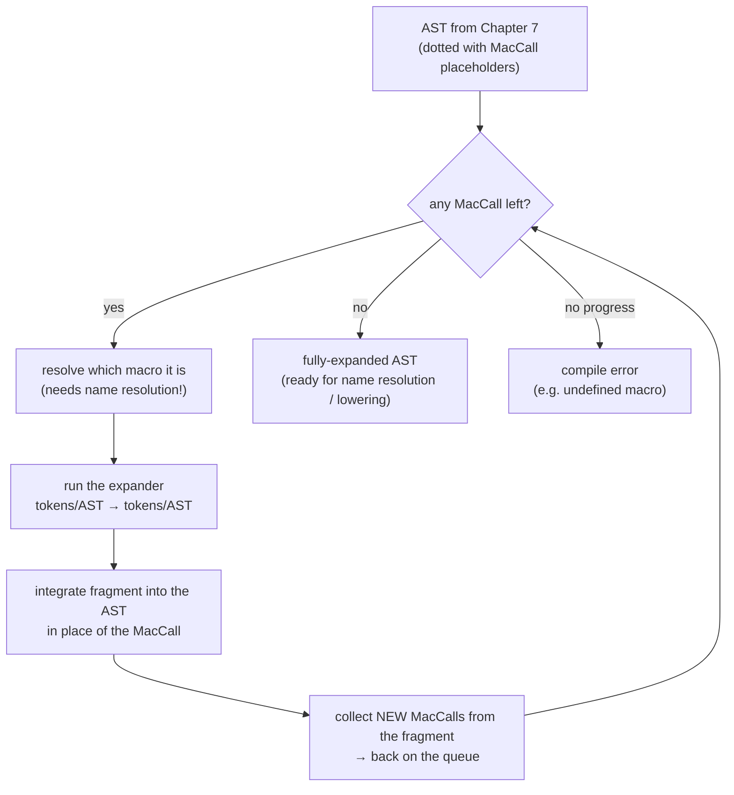
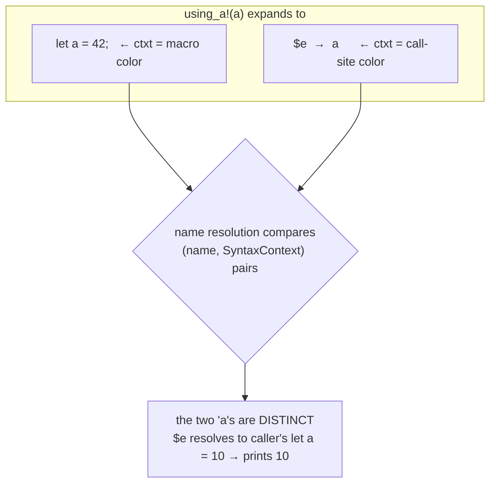
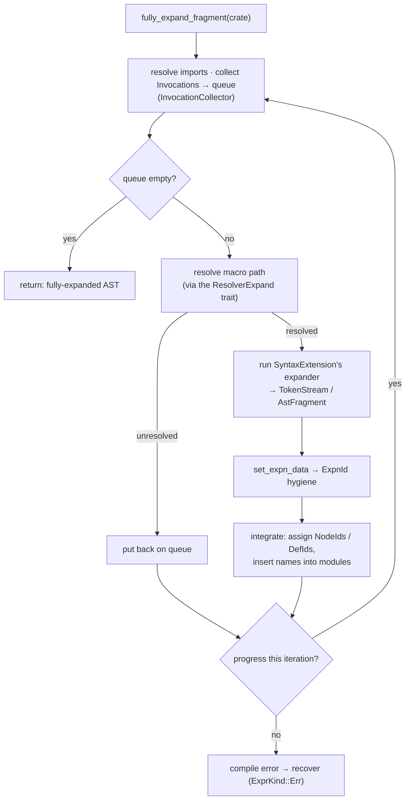
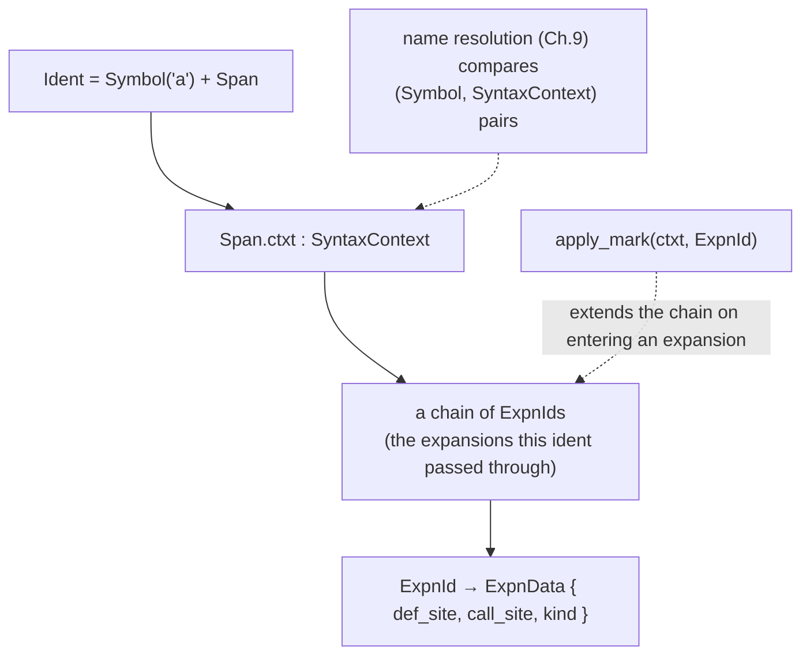
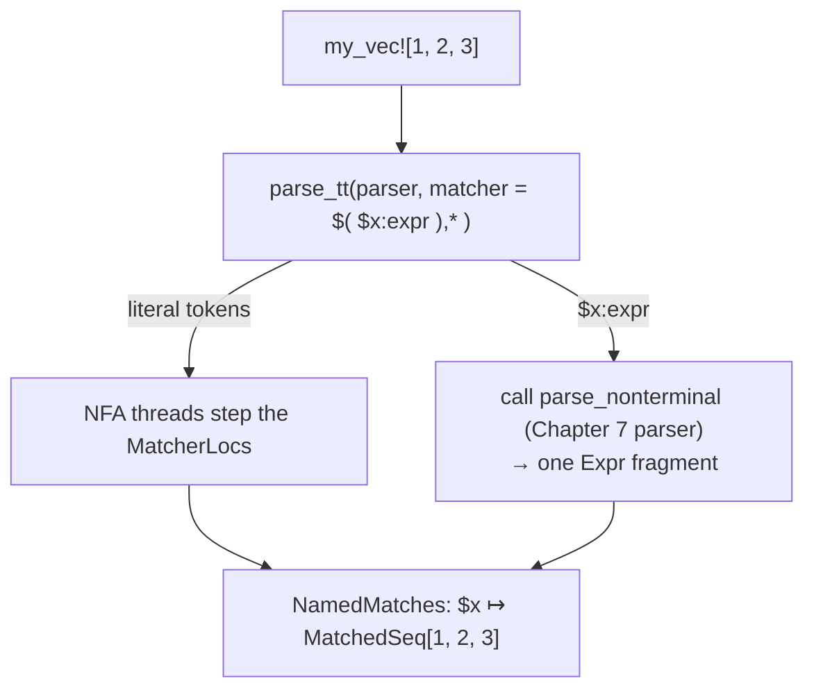
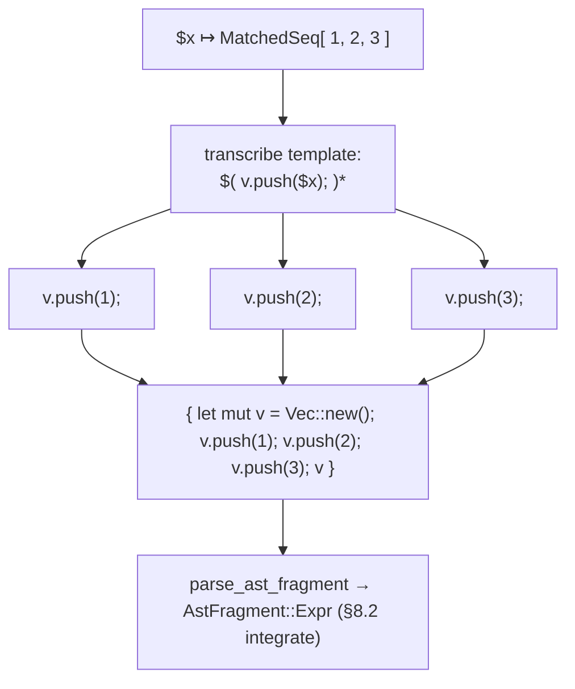
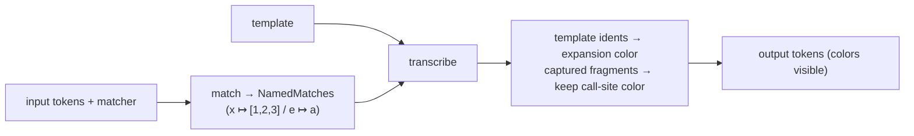
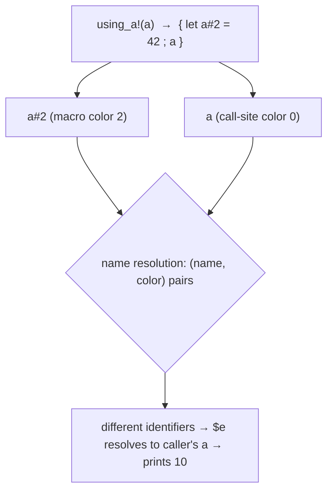

```admonish abstract title="What you'll learn"
- Why macros are syntactic abstraction (they transform program structure, not values) and why `rustc` operates on [token trees](../glossary.md#token-tree) rather than text (C-preprocessor style) or [AST](../glossary.md#ast) (Lisp style).
- The fixpoint loop `MacroExpander::fully_expand_fragment` runs in [`rustc_expand`](../glossary.md#macro-expansion): collect `Invocation`s, resolve through the `ResolverExpand` trait, run the `SyntaxExtension`'s expander, integrate the produced `AstFragment`, and loop until the queue stabilizes.
- Why expansion and name resolution are interlaced, and how the `ResolverExpand` trait (in `rustc_expand::base`) breaks the crate cycle so the resolver in `rustc_resolve` can supply the lookup.
- How [hygiene](../glossary.md#hygiene) is encoded as a [`SyntaxContext`](../glossary.md#syntaxcontext) on every [`Span`](../glossary.md#span): an interned chain of `(ExpnId, Transparency)` pairs extended by `apply_mark`, compared as `(Symbol, SyntaxContext)` pairs at name resolution.
- How the `macro_rules!` engine works: `mbe::TokenTree` with first-class `MetaVarDecl` and `Sequence`, the NFA in `parse_tt` running over `MatcherLoc`s, delegating typed captures to the parser's `parse_nonterminal`, producing a `NamedMatch` tree, then `transcribe` filling the template.
- How to build a tiny hygienic expander whose token colors make the `using_a!` capture puzzle visible, and how to confirm the behavior against the real compiler with `cargo expand` or `-Zunpretty=expanded,hygiene`.
```

## 8.1 Macros: Syntactic Abstraction and the Expansion Problem

### The problem hygiene solves

A macro substitutes code into a context it did not write, so any name it introduces risks colliding with a name the caller already used. That is variable capture; rustc's defense is hygiene. The C examples below make the problem concrete:

```c
#define SQUARE(x) x * x
int r = SQUARE(2 + 3); // expands to: 2 + 3 * 2 + 3  ==  11, not 25
```

The C preprocessor performs *textual* substitution (it pastes the argument in as raw characters) so `SQUARE(2 + 3)` becomes `2 + 3 * 2 + 3`, and precedence quietly destroys the answer. Wrap every argument in parentheses and you fix that one, but a deeper trap remains:

```c
#define SWAP(a, b) { int tmp = a; a = b; b = tmp; }
SWAP(x, tmp); // expands to: { int tmp = x; tmp = tmp; tmp = tmp; }
```

Here the macro's own `tmp` *collides* with the caller's variable named `tmp`, and the swap silently fails. This is **variable capture**. Rust's equivalent macro behaves differently; the rest of the chapter explains the mechanism:

```rust
macro_rules! using_a {
    ($e:expr) => {{ let a = 42; $e }}
}
fn main() {
    let a = 10;
    println!("{}", using_a!(a)); // prints 10, NOT 42
}
```

The macro introduces its own `let a = 42;`, and the argument `$e` is the caller's `a`. By the C model this should print 42: the macro's `a` ought to shadow the caller's. It prints **10**. Rust's macro system is **hygienic**: the `a` the macro introduces and the `a` the caller wrote are treated as *different variables despite identical spelling*. This chapter is about how `rustc` performs macro expansion and, at its heart, how it achieves that hygiene, and the mechanism turns out to be the mysterious `ctxt` field we met inside `Span` back in §6.1, finally earning its place.

### Macros are *syntactic* abstraction

A function abstracts over **values**: you pass it values, it returns a value, and it cannot see or change the *syntax* of the call. A **macro** abstracts over **syntax** itself: it receives a piece of the program's structure and produces a new piece of structure to put in its place. That is a categorically different power, and it buys things functions cannot: a variadic `println!("{} {} {}", a, b, c)` with any number of arguments; `#[derive(Clone)]` generating a whole `impl` block; `vec![1, 2, 3]` building a collection with custom syntax; entire embedded DSLs. The cost is that operating on syntax is treacherous, exactly as the C examples showed.

Macro systems can be classified by *what they operate on*: the C preprocessor manipulates **text** (raw characters, blind to structure); Lisp macros manipulate the **abstract syntax tree** directly (because Lisp code *is* its own data structure). rustc operates on **token trees** because it needs inputs that are structured enough to forbid re-association (so `2 + 3` cannot be re-parsed as four loose characters) but loose enough to admit syntax that is not yet legal Rust (so a DSL can be embedded). Token trees are that level. A Rust macro does not see raw text, and it does not quite see the typed AST either; it sees a `TokenStream`: the structured-but-untyped sequence of tokens and pre-matched delimiter groups from §7.2. The macro transforms that token stream, and *the result is then parsed* into real AST. Operating on tokens rather than text means `SQUARE!(2 + 3)` receives `2 + 3` as a grouped expression fragment, so it cannot be re-associated.

```admonish tip title="Pro-Tip, cargo expand shows you the output"
Because a macro's job is to produce code, a useful habit when working with macros is to *look at what they generate*. The community tool `cargo expand` (and the compiler's own `-Zunpretty=expanded` on nightly) prints your crate with every macro expanded into ordinary Rust. When a `derive` or a `macro_rules!` misbehaves, expanding it turns an invisible compile error into visible code you can read. This is the macro equivalent of the §6.4 emitter: a window into a stage that is otherwise opaque.
```

### The two families: declarative and procedural

Rust has two quite different macro mechanisms, and the distinction matters for the rest of the chapter.

**Declarative macros** (written with `macro_rules!`) are *pattern-matchers over token trees*. You give a set of rules, each a **matcher** (a pattern with metavariables like `$name:ident` or `$ty:ty`, and repetitions like `$(...)`*) paired with a **transcriber** (a template). The macro matches its input against the matchers and substitutes the captured fragments into the template. A small but real example:

```rust
macro_rules! my_vec {
    ( $( $x:expr ),* $(,)? ) => {{ // match zero-or-more comma-separated exprs
        let mut v = Vec::new();
        $( v.push($x); )* // repeat the push for each captured $x
        v
    }};
}
// → { let mut v = Vec::new(); v.push(1); …; v }
let xs = my_vec![1, 2, 3];
```

This is, in essence, a hygienic, structure-aware search-and-replace on syntax. Its machinery is comparatively simple and stable, which (as IDE authors note) is why tools can expand declarative macros relatively easily.

**Procedural macros** are arbitrary Rust programs that transform a `TokenStream` into a `TokenStream`. They come in three kinds: **function-like** (`sql!(...)`, invoked like a macro), **derive** (`#[derive(Serialize)]`, attached to a type), and **attribute** (`#[route(GET, "/")]`, attached to an item). A procedural macro is not interpreted by a matcher; it is *compiled Rust code* that runs at compile time. This has a striking architectural consequence, confirmed by the dev-guide: a proc macro lives in a *separate, third-party crate* that the compiler compiles first, and then `rustc` *calls the proc-macro's function*, handing it tokens and receiving tokens back. The token type crossing that boundary is the **stable** `proc_macro::TokenStream`, deliberately distinct from the compiler's own unstable `rustc_ast::tokenstream::TokenStream`; conversion between them happens in `rustc_expand::proc_macro` and the proc-macro server. The ecosystem crates `syn` and `quote` (the `syn` you drove in §7.4) exist to parse and generate those token streams ergonomically.

### The expansion problem: a tree full of placeholders

Recall the §7.4 cliffhanger. When the parser meets `my_vec![1, 2, 3]` or `#[derive(Clone)]`, it does *not* run the macro. It records a placeholder node, a `MacCall` (as `ExprKind::MacCall`, `ItemKind::MacCall`, and so on), holding the macro's path and its raw token arguments. So the AST that comes out of Chapter 7 is not pure code; it is code dotted with un-expanded macro calls. **Macro expansion**, performed by the crate `rustc_expand` (with its core data structures in `rustc_expand::base`), is the process of replacing every one of those placeholders with the code it produces, repeatedly, until none remain or a compile error is reached.

The shape of that process is the important thing, because it is *not* a single pass. Expansion is a **fixpoint loop**. The dev-guide describes it as a queue: take a macro invocation; resolve which macro it refers to; run that macro's **expander** (which consumes tokens or AST and produces tokens or AST, depending on its kind); **integrate** the produced fragment back into the partially-built AST in place of the invocation; and, crucially, *scan the freshly produced fragment for new macro calls* and add them to the queue. Then iterate. A macro can expand into code that contains more macros, which expand into still more, and the loop runs until the AST is free of `MacCall`s. If an iteration makes *no progress* (a macro that cannot be resolved, say), that is the compile error, and the compiler tries to recover enough to produce a good diagnostic.




### Expansion and name resolution are interlaced

Notice the resolve step above: to expand `foo!(...)`, the compiler must first figure out *which* macro `foo` is. And that is **name resolution** (Chapter 9). But name resolution cannot finish until macros are expanded, because a macro can *generate the very names* that later code refers to (a `#[derive]` introduces an `impl`, a `macro_rules!` can define a function). So neither can run fully before the other: **macro expansion and name resolution are interlaced**, each feeding the other, run together iteratively rather than as separate phases. After every fragment is expanded, three sub-passes run on it: assigning `NodeId`s (the §7.1 identities, stamped now by the `InvocationCollector`, which also harvests the new macro calls), creating `DefId`s for any new definitions, and inserting new names into modules so the resolver can see them.

This is why Chapter 8 sits *before* Chapter 9 in this book but is, in the compiler, tangled together with it. The clean IR-ladder of Part 0 had a pipeline feel; the front end's middle is messier: a fixpoint where syntax and naming bootstrap each other. It is worth holding onto this as a correction to the "compiler as assembly line" picture: real compilers have loops in them, and this is the most important one in `rustc`'s front end.

### Hygiene: painting identifiers different colors

Now back to the `using_a!` puzzle. The danger of syntactic abstraction is **capture**: a name the macro introduces accidentally binding (or being bound by) a name at the call site. Rust's defense is **hygiene**, and the mechanism is exactly the `SyntaxContext` carried in every `Span` (§6.1).

The idea is to tag each identifier not only with its spelling but with *where it came from*: which macro expansion, if any, introduced it. Each expansion is given an `ExpnId` (an expansion identifier), and an identifier's `SyntaxContext` records the chain of expansions it passed through. The Rust Book's metaphor is exact: it is as though each expansion paints its identifiers a different **color**. Name resolution then compares not bare strings but `(name, SyntaxContext)` pairs. So the macro's `a` (painted with the macro's color) and the caller's `a` (painted with the call-site color) are *different identifiers* even though both are spelled `a`. The macro's `let a = 42;` therefore cannot capture the caller's `a`, and `using_a!(a)` resolves `$e` to the caller's binding, printing 10.




This is what §6.1's `ctxt` field was deferred for. Back then, `SpanData`'s `ctxt: SyntaxContext` field was introduced as "a tag saying which expansion context this span lives in," and deferred to this chapter. Now it does real work: hygiene *is* that tag, consulted at name resolution, and it is the reason every `Span` in the compiler carries a syntax context even though most code is never touched by a macro (where the context is simply the root, color zero).

```admonish warning title="Warning, procedural macros are only as hygienic as their spans"
Declarative `macro_rules!` macros are hygienic for local variables and labels by default. Procedural macros are *not* automatically so: because a proc macro builds its output token-by-token, the hygiene of each generated identifier is determined by the `Span` it is given. `Span::call_site()` makes an identifier behave as if written at the call site (unhygienic, it *can* capture); `Span::def_site()` and `Span::mixed_site()` give stronger hygiene. The widely used `quote!` macro defaults to call-site spans, so proc-macro output is frequently *intentionally* unhygienic. If you write a proc macro and your generated `let __tmp` mysteriously clashes with user code, the span you attached to it is why. Hygiene in Rust is not a single global guarantee; it is a per-identifier property carried by spans.
```

### Where this leaves us

Macros are syntactic abstraction (they transform program structure, not values), and rustc performs them at the level of token trees: structured enough to preserve grouping (so precedence cannot be re-associated) and untyped enough to admit syntax that is not yet legal Rust. There are two families: **declarative** `macro_rules!` (matcher-and-template pattern matching over token trees, simple and stable) and **procedural** (compiled Rust transforming `TokenStream`s, in derive/attribute/function-like kinds, run from separate crates across the stable `proc_macro` boundary). The parser leaves each invocation as a `MacCall` placeholder, and `rustc_expand` replaces them in a **fixpoint loop** (resolve, expand, integrate, collect-new) that is **interlaced with name resolution**, because macros both *need* names to be found and *generate* names to find, making the front end a bootstrapping loop rather than a clean pipeline. And the whole edifice rests on **hygiene**: every identifier carries a `SyntaxContext` (the §6.1 `ctxt` field, tied to an `ExpnId`) that colors it by its expansion origin, so name resolution keeps a macro's names and the call site's names distinct even when they are spelled the same.

§8.2 takes the architecture deep-dive: the `rustc_expand` machinery, the `MacroExpander` and the `fully_expand_fragment` loop, the `MacResult` a macro produces, the `InvocationCollector` that walks fragments to assign `NodeId`s and harvest new calls, and the hygiene data structures (`ExpnId`, `ExpnData`, the `SyntaxContext` interner) that implement the coloring. Then §8.3 reads the real expansion loop and a `macro_rules!` matcher, and §8.4 has you build a small hygienic macro expander of your own.

## 8.2 The Architecture: `rustc_expand`, the Expansion Loop, and Hygiene Data

### One method runs the whole show

Almost the entire process is driven by a single method, `MacroExpander::fully_expand_fragment`, which the compiler runs on the whole crate and which does not return until the AST contains no unexpanded macro invocations (or a compile error has been recorded). That one method runs the four verbs of §8.1's fixpoint loop (*resolve, expand, integrate, collect*) in `rustc_expand`. Everything else in the crate is a supporting cast: types that represent *a queued call*, *a resolved macro*, *a produced fragment*, and *the coloring that keeps it hygienic*. Meet `fully_expand_fragment` first, then assign each verb to the type that performs it.

### `fully_expand_fragment`: the real loop

The dev-guide spells out the algorithm, and it is worth reading closely because it makes §8.1's "interlacing" concrete. Faithful to that description:

```text
fully_expand_fragment(crate):
    queue = [] // unresolved macro invocations
    loop:
        resolve imports in the partially-built crate as far as possible
        collect all macro Invocations now visible (fn-like, attribute, derive) → queue
        if queue is empty: return // done: no macros left
        pick an Invocation from the queue
        try to resolve which macro it names:
            if unresolved: put it back on the queue; continue
            if resolved:
                run the macro's expander  → a TokenStream or AstFragment
                set_expn_data(...) // fill this expansion's hygiene data (ExpnId)
                integrate the fragment into the AST in place of the invocation
        if an entire iteration made NO progress: compile error (recover, diagnose)
```

Three things in this loop are the architecture of the chapter. First, it *re-collects* invocations every iteration: because expanding one macro can reveal new ones (a `derive` that emits code containing a `vec!`), the set of work is not known up front; it grows as expansion proceeds. Second, the **resolve** step calls into name resolution, and a macro that cannot yet be resolved is *put back on the queue*, that is the fixpoint: keep going around until either everything resolves or an iteration adds nothing. Third, **integrate** is where, as the dev-guide vividly puts it, a "token-like mass" becomes "set-in-stone AST with side-tables": `NodeId`s are assigned, `DefId`s created, and new names inserted into modules, all in one sweep over the freshly produced fragment.




### The cast: a type for each verb

Now the supporting types, each one the noun behind a verb of the loop.

**`Invocation` / `InvocationKind`:** *the queued call.* An `Invocation` describes one macro use: which path was invoked, with what arguments, in what kind of position (a bang `m!(...)`, an attribute `#[attr]`, or a derive). These are the items on the queue.

**`InvocationCollector`:** *collect and integrate.* This is a visitor that walks an AST fragment, finds every macro invocation in it, and adds them to the queue. It is also the pass that, on a freshly expanded fragment, stamps the `NodeId`s (the §7.1 identities, deferred by the parser as `DUMMY_NODE_ID`, assigned now) and harvests the new calls. The dev-guide notes two sibling passes run alongside it during integration: `DefCollector` creates `DefId`s, and `BuildReducedGraphVisitor` inserts names into modules for the resolver.

**`SyntaxExtension` and `SyntaxExtensionKind`:** *the resolved macro.* Once a macro path resolves, what it resolves *to* is a `SyntaxExtension`: the macro's definition packaged for use, with a `SyntaxExtensionKind` distinguishing the varieties: a declarative `macro_rules!` (carrying its compiled rules, run by a `TTMacroExpander`), or one of the procedural kinds (`Bang`, `Attr`, `Derive`, behind traits like `BangProcMacro`, `AttrProcMacro`, `MultiItemModifier`). Whatever the kind, it exposes an *expander* the loop can call. The call itself, faithful to the source, looks like:

```rust
// compiler/rustc_expand/src/expand.rs  (faithful, abridged)
// Proc-macro bang path inside expand_invoc:
match expander.expand(self.cx, span, mac.args.tokens.clone()) {
    Ok(tok_result) => {
        // Parse the macro's tokens into a typed fragment for this context:
        let fragment = self.parse_ast_fragment(
            tok_result, fragment_kind, &mac.path, span,
        );
        // ...
    }
    Err(guar) => return ExpandResult::Ready(fragment_kind.dummy(span, guar)),
}
// The neighbouring legacy `macro_rules!` arm has the same shape but returns
// ExpandResult<TokenStream, ()>; its Retry case puts the invocation back on the
// queue (the "try later" branch in the diagram above) and produces its fragment
// via fragment_kind.make_from(tok_result) instead of parse_ast_fragment.
```

**`MacResult` and `AstFragmentKind`:** *the polymorphic result.* This piece is worth examining closely. A macro does not produce a fixed kind of node; the *same* macro call can mean different things depending on where it sits. `vec![1,2,3]` in expression position must yield an `Expr`; a `macro_rules!` that emits items, used in item position, must yield a list of items; one used in pattern position must yield a `Pat`. So a macro's output is a `MacResult`: described in the design notes as "a polymorphic AST fragment, something that can turn into a different `AstFragment` depending on its context." The context is an `AstFragmentKind` (Expr, Items, Pat, Ty, Stmts, …), and `MacResult` offers a `make_expr`, `make_items`, `make_pat`, and so on; the expander picks the one matching the position the invocation occupied.

**`AstFragment`:** *the produced fragment.* The concrete result: an enum (`AstFragment::Expr`, `::Items`, `::Pat`, `::Crate`, …) holding the real AST nodes a single expansion produced, possibly several homogeneous nodes at once (a macro can expand to a *list* of items). It is, per the docs, "a fragment of AST that can be produced by a single macro expansion," and it doubles as both the output of expansion and an intermediate value.

**`ExtCtxt` / `ExpansionData`:** *the expander's world.* When the loop calls `expander.expand(self.cx, …)`, that `cx` is the `ExtCtxt`: the expansion context, the expander's gateway to the session, the `SourceMap`, the `DiagCtxt` (so a macro can emit the §6.2 diagnostics), and the current `ExpansionData`. It is to expansion what the `Parser`'s `psess` was to parsing: the handle on everything outside the local job.

### The `ResolverExpand` trait: interlacing, made architectural

§8.1 claimed expansion and name resolution are *interlaced*. The architecture proves it with a clever bit of dependency inversion. The expansion machinery lives in `rustc_expand`, but name resolution lives in a different crate, `rustc_resolve`, which depends on the AST crate. So `rustc_expand` *cannot* depend on `rustc_resolve` without a cycle. The solution is a trait: `rustc_expand` defines a `ResolverExpand` trait describing the resolution services it needs (chiefly "resolve this macro path to a `SyntaxExtension`"), and the real resolver in `rustc_resolve` (a struct named `Resolver`) *implements* it. The expander holds a `&mut dyn ResolverExpand` and calls through it.

This should feel familiar. §3.2's [`Providers`](../glossary.md#providers) struct decouples declaration from implementation through a function-pointer table; here the same decoupling instinct is implemented with a `dyn ResolverExpand` trait object to break a similar crate cycle. The same pattern recurs here for the same reason: a lower-level crate needs a service from a higher-level one, so the service is abstracted behind a trait the higher-level crate fills in. The interlacing of §8.1 is not hand-waving. It is a `dyn ResolverExpand` call sitting inside `fully_expand_fragment`'s resolve step.

```admonish tip title="Pro-Tip, macro-not-found-in-this-scope is the resolve step failing"
When you see the error *cannot find macro `foo` in this scope*, you are looking at the output of exactly the resolve step above: the `ResolverExpand` returned no `SyntaxExtension` for the path, the invocation went back on the queue, and a later iteration made no progress on it. The error often means the macro is defined *below* the use and the macro is a `macro_rules!` (which, unlike items, are order-sensitive within a scope), or that a `#[macro_use]`/`use` import is missing. Knowing it is a resolution failure, not an expansion failure, tells you to look at *where the macro is defined and imported*, not at the macro's body.
```

### Failure recovery: `ExprKind::Err`

The loop's "no progress → error" branch deserves a note, because it connects to the diagnostics philosophy of Chapter 6. When a macro genuinely cannot be resolved, the compiler does not simply stop. It expands the unresolved invocation into a *dummy*, an `ExprKind::Err` (or the equivalent error node for the position), and *keeps going*. This is the same "recover and continue so we can report more" instinct as the parser (§7.2) and the [`ErrorGuaranteed`](../glossary.md#errorguaranteed) discipline (§6.2): a placeholder error node lets the rest of expansion and the later passes proceed, surfacing additional real errors in one compilation instead of dying at the first unresolved macro. The dummy carries an `ErrorGuaranteed`, the §6.2 proof token, so downstream code knows an error was already reported and need not complain again.

### Hygiene data: how a color is stored

Finally, the structures that implement §8.1's "painting identifiers different colors." Three types, in increasing scope:

- **`ExpnId`:** an identifier for *one expansion*: a particular macro call (or compiler desugaring). When a macro runs, `set_expn_data` records its `ExpnData`: the properties of that expansion, including its *definition site* and its *call site* spans, in global tables, keyed by the `ExpnId`.
- **`SyntaxContext`:** the actual "color," and the thing stored in every `Span`'s `ctxt` field (§6.1). A `SyntaxContext` is not a single expansion but an *identifier for a chain of nested expansions*: the sequence of `ExpnId`s an identifier has passed through as it was carried out of one macro and into another. Its cached, filtered forms live in `SyntaxContextData`. Because contexts are chains that recur, they are **interned** into a global table (the same §4.2/§6.1 interning instinct), so a `SyntaxContext` is a small index, cheap to copy onto every `Span`.
- **`apply_mark`:** the operation that *extends* a context: when an identifier crosses into an expansion, `apply_mark` pushes that expansion's `ExpnId` onto its `SyntaxContext`, producing a new context. This is the literal act of "mixing in another color."

And the consumer of all this is the humble `Ident`, which is just an interned `Symbol` (the §4.2/§4.4 `Symbol` interner) plus a `Span` (which carries the `SyntaxContext`). Name resolution, in Chapter 9, will compare not `Symbol`s but effectively `(Symbol, SyntaxContext)` pairs: so two `a`s with different contexts are different names. The entire hygiene guarantee of §8.1 reduces to this: identity for resolution is *spelling plus color*, and the color is a chain of expansion ids interned into a `Span`.




### Where this leaves us

The architecture is in hand. `MacroExpander::fully_expand_fragment` runs an iterative queue: collect `Invocation`s with the `InvocationCollector`, resolve each through the `ResolverExpand` trait (the dependency-inversion that makes the §8.1 interlacing real, echoing §3.2), run the resolved `SyntaxExtension`'s expander to get a polymorphic `MacResult`, realize it as a concrete `AstFragment` for the invocation's `AstFragmentKind`, and integrate it, assigning `NodeId`s and `DefId`s and inserting names, before looping to catch the macros that integration revealed, recovering from the unresolvable with `ExprKind::Err`. Hygiene is carried underneath by `ExpnId`/`ExpnData` for each expansion and a `SyntaxContext` (an interned chain of `ExpnId`s, extended by `apply_mark` and stored in every `Span`) so that an `Ident`'s identity is its `Symbol` *and* its color.

§8.3 reads the real code: a slice of `fully_expand_fragment`'s loop, and the `macro_rules!` engine, the matcher (`TtParser`) that binds metavariables against an invocation's tokens, and the transcriber that splices them into the template, so you can see a declarative macro actually match and expand. Then §8.4 has you build a tiny hygienic expander: match a pattern with a metavariable, transcribe a template, and tag introduced identifiers with a context so they do not capture the caller's names.

## 8.3 Reading the Source: the Expansion Loop and the `macro_rules!` Matcher

### Two engines we have already built, meeting

Watch a declarative macro actually match and expand, and the pleasant surprise is that we have already built both halves of the engine earlier in this book. The `macro_rules!` matcher is, in the words of the source itself, *an NFA-based parser*, a regular-expression engine over token trees, kin to the lexer's mindset from Chapter 5. And whenever that NFA needs to capture a typed fragment like `$x:expr`, it does not reimplement expression parsing; it *calls back into the real Rust parser*, the `parse_nonterminal` entry point we met in §7.2. So macro expansion sits squarely *on top of* the parser, not beside it. The matcher, the binding it produces, and the transcriber that fills the template, read with one small macro throughout:

```rust
macro_rules! my_vec {
    ( $( $x:expr ),* ) => {{
        let mut v = Vec::new();
        $( v.push($x); )*
        v
    }};
}
let xs = my_vec![1, 2, 3];
```

### The macro's own representation: `mbe::TokenTree`

A macro definition is itself parsed (using the very meta-pattern the dev-guide records, `$( $lhs:tt => $rhs:tt );+`) into a list of rules, each a *matcher* (the left side) and a *transcriber* (the right). But the token trees of a macro's rules are not the plain `tokenstream::TokenTree` of §7.2; they are a richer `mbe::TokenTree` (the `mbe` module is "macro-by-example") in which the macro-only constructs are *first-class*:

```rust
// compiler/rustc_expand/src/mbe.rs  (faithful, abridged)
pub(crate) enum TokenTree {
    // ... literal Token / Delimited group variants ...
    Sequence(DelimSpan, SequenceRepetition),  // ① a $( ... )sep* repetition
    // ② a declaration $x:expr in the matcher (a struct variant; the
    // fragment specifier is required, not optional)
    MetaVarDecl { span: Span, name: Ident, kind: NonterminalKind },
    // ... MetaVar use site, MetaVarExpr ${...} ...
}
```

The full variant set is in the source; the teaching point is that the macro-only constructs (repetitions and metavariable declarations) are first-class nodes here rather than ad-hoc text patterns.

For `my_vec!`, the matcher side parses to: a `Sequence` (the `$( … ),*`) whose body is a single `MetaVarDecl` for `$x:expr`, with `,` as the separator and `*` as the Kleene operator. The literal tokens `( ) ,` are `Token`s to be matched exactly. This richer tree is what the matcher walks.

### The matcher: an NFA over `MatcherLoc`s

Before matching, the matcher's token trees are *flattened* from the recursive `mbe::TokenTree` into a non-recursive sequence of `MatcherLoc`s by `compute_locs`. The source comment explains why: a `MatcherLoc` makes the separator, the Kleene operator, and the very end of the matcher *explicit* positions, so the whole matcher becomes a flat `&[MatcherLoc]` and "traversal mostly involves simply incrementing the current matcher position index by one." A recursive tree has become a tape the matcher head can step along, exactly the shape an automaton wants.

The matching itself is `parse_tt`, and its signature tells the story (faithful):

```rust
// compiler/rustc_expand/src/mbe/macro_parser.rs  (faithful, abridged)
pub(super) fn parse_tt<'matcher, T: Tracker<'matcher>>(
    &mut self,
    parser: &mut Cow<'_, Parser<'_>>, // the invocation's tokens + the parsing session
    matcher: &'matcher [MatcherLoc], // the rule's pattern, flattened
    track: &mut T, // diagnostics tracker (instruments matching)
) -> NamedParseResult<T::Failure> // Success(NamedMatches) | Failure | Error | ErrorReported
```

The algorithm is, per the file's own header, an NFA: there is a set of *current* matcher positions (NFA "threads") and a set of *next* ones, and each input token advances every thread, dropping the ones that fail to match and forking at the Kleene-star `Sequence` (one thread tries another repetition, one thread exits the loop). It is "similar in spirit to the Earley algorithm" but restricted to finite-automaton features, which fits Macro-by-Example rules naturally. Match `my_vec![1, 2, 3]` against `$( $x:expr ),`* and the threads walk: enter the sequence, capture an expression, see `,`, loop, capture, see `,`, loop, capture, see end: three captures.

But there is the one exception that ties this section to Chapter 7. The NFA can match literal tokens itself, but it *cannot* parse an `expr` or a `block` or a `ty`: those are full grammar non-terminals. So, as the dev-guide states, when the matcher reaches a `MetaVarDecl` like `$x:expr` it *calls back into the normal Rust parser*, invoking `Parser::parse_nonterminal` (§7.2) to consume exactly one expression from the token stream, and "commits to it fully." The macro matcher is a thin NFA layer wrapped around the real parser: it handles the *shape* of the rule (literals, repetitions, separators) and delegates every *typed capture* to the parser you read in Chapter 7.

```admonish tip title="Pro-Tip, this is why $x:expr then a non-comma is a hard error"
Because the matcher commits fully to a non-terminal once it starts parsing one, the *follow-set* rules exist: the follow set for `expr` is restricted to a small set of tokens (currently `=>`, `,`, `;`). The restriction is not arbitrary: it exists so the NFA can know unambiguously where the committed expression parse ends and the matcher resumes. If you write a matcher like `$x:expr $y:expr` you get "`$x:expr` may only be followed by ..."; the cause is precisely that the matcher cannot tell where the first expression stops and the second begins once it has handed control to the parser.
```

### The binding: `NamedMatch`

A successful match produces `NamedMatches`: a map from each metavariable to a `NamedMatch`, whose shape mirrors the matcher's repetition nesting (verbatim):

```rust
// compiler/rustc_expand/src/mbe/macro_parser.rs  (faithful; derives elided)
pub(crate) enum NamedMatch {
    MatchedSeq(Vec<NamedMatch>), // one repetition level
    MatchedSingle(ParseNtResult), // one captured fragment (Tt, Ident, Expr, Ty, …)
}
```

The structure mirrors the *nesting of repetitions* in the matcher. A bare `$x:ident` binds to a `MatchedSingle`. A `$( $x:expr ),`* binds to a `MatchedSeq` holding one `MatchedSingle` per repetition; a doubly-nested `$( $( $x )* )`* binds to a `MatchedSeq` of `MatchedSeq`s. The docs put it plainly: each `MatchedSeq` corresponds to a single repetition, and the depth of the `NamedMatch` tree equals the nesting depth of repetitions. For `my_vec![1, 2, 3]`, the metavariable `$x` binds to `MatchedSeq([ MatchedSingle(<expr 1>), MatchedSingle(<expr 2>), MatchedSingle(<expr 3>) ])` (each `MatchedSingle` carries a `ParseNtResult::Expr(...)`), the three captured expressions, in order.




### The transcriber: filling the template

With the bindings in hand, `transcribe` walks the *right-hand* token trees (the template) and produces the output `TokenStream`, faithful in behavior:

```rust
// compiler/rustc_expand/src/mbe/transcribe.rs  (faithful signature; conceptual body)
pub(super) fn transcribe<'a>(
    psess: &'a ParseSess,
    interp: &FxHashMap<MacroRulesNormalizedIdent, NamedMatch>,
    src: &mbe::Delimited, // the template (a delimited group at the root)
    src_span: DelimSpan,
    transparency: Transparency, // hygiene: how identifiers introduced here resolve
    expand_id: LocalExpnId, // hygiene: this expansion's id (for apply_mark)
) -> PResult<'a, TokenStream> {
    // Walk the template. For each piece:
    //   Token(t) → emit t unchanged
    //   MetaVar($x) → look up interp[$x], emit the captured tokens
    //   Sequence($(…)*) → for each element of the MatchedSeq bound inside it,
    // transcribe the body once (with the separator between)
    //   …
}
```

Run it on `my_vec!`'s template. The literal `let mut v = Vec::new();` is emitted as-is. The `$( v.push($x); )*` is a `Sequence`; the transcriber finds that the metavariable inside it, `$x`, is bound to a `MatchedSeq` of length 3, so it transcribes the body three times, substituting `$x` with `1`, then `2`, then `3`: producing `v.push(1); v.push(2); v.push(3);`. The trailing `v` is emitted. The result is the token stream:

```rust
{ let mut v = Vec::new(); v.push(1); v.push(2); v.push(3); v }
```

which `parse_ast_fragment` (the integration step of §8.2) then parses into an `AstFragment::Expr` and splices in where `my_vec![1, 2, 3]` stood. The metavariable substitution drives the repetition: the number of `push` statements is *the length of the `MatchedSeq`*, not anything written literally. That is the rule for `$(...)*`: repetition in the template is governed by repetition in the binding.




### Where the coloring happens

§8.1 and §8.2 explained hygiene as a `SyntaxContext` "color" stamped onto identifiers. Transcription is *where that stamping physically occurs*. As the transcriber emits the template's tokens, the identifiers that come from the *template*, the `v` and `Vec` the macro wrote, are given spans carrying the expansion's `SyntaxContext` (the one created for this `my_vec!` call via `apply_mark` on its `ExpnId`), while the tokens that came from the *invocation* (the captured `1, 2, 3` inside `$x`) keep the call site's context. So the template's `v` is painted the macro's color and the caller's own `v`, if any, is painted differently; the two cannot collide. The `using_a!` puzzle of §8.1 is resolved right here, in the transcriber: the introduced `let a` gets the macro's color, the substituted `$e` keeps the caller's, and Chapter 9's name resolution will keep them apart. Hygiene is not a separate pass. It is a property attached to spans *at the moment tokens are transcribed*.

```admonish warning title="Warning, $x is captured as a parsed fragment, not as text"
A subtle but important consequence of the matcher calling `parse_nonterminal`: when `$x:expr` captures `2 + 3`, it captures a fully-parsed *expression node*, not the three loose tokens. This is why a captured `$x` used in the template is treated as one indivisible unit: `$x * 2` with `$x = 2 + 3` yields `(2 + 3) * 2`, never `2 + 3 * 2`. Re-association is impossible precisely because the metavariable is bound to a parsed grammar fragment, not to loose tokens: `$x` enters the template as one indivisible expression node. If you have ever wondered why Rust macros do not need defensive parentheses around `$x`, this is the reason: the parse already happened, at capture time.
```

### How this builds, and what is next

We have read the declarative-macro engine end to end. A macro's rules are parsed into the macro-by-example `mbe::TokenTree` with first-class repetitions and metavariables; the matcher flattens each rule's pattern into `MatcherLoc`s and runs `parse_tt`, an NFA that steps the literal tokens itself and *delegates every typed metavariable to Chapter 7's `parse_nonterminal`*, producing a `NamedMatch` binding tree whose shape mirrors the repetition nesting; the transcriber walks the template, substitutes each metavariable's binding and unrolls each `$(...)*` by the length of its `MatchedSeq`, and emits a `TokenStream` that §8.2's integration step parses into an `AstFragment`, stamping the template's identifiers with the expansion's `SyntaxContext` as it goes, which is where hygiene physically happens. The matcher-on-top-of-the-parser structure is the chapter's quiet theme: expansion reuses the front end beneath it rather than duplicating it.

§8.4 turns this into a build. You will write a tiny `macro_rules!`-style expander: a matcher that binds a metavariable (and, as an extension, a `$(...)*` repetition) from an input token stream, a transcriber that substitutes it into a template, and a coloring step that tags introduced identifiers with a context so they stay distinct from call-site identifiers of the same spelling. Wire it, if you like, to the lexer of §5.4 and the parser of §7.4, and you will have a miniature hygienic macro system standing on your own front end.

## 8.4 Hands-On Lab: Build a Tiny Hygienic Macro Expander

### Making hygiene visible

The hardest idea in this chapter is invisible: hygiene is a *color* on identifiers that you never see in source code, only in the compiler's internal `SyntaxContext`. This lab makes it visible. You will build a small `macro_rules!`-style expander whose tokens carry their color explicitly, and you will watch the `using_a!` puzzle of §8.1 resolve itself on screen (the macro's `a` printed as `a#2`, the caller's `a` printed plain, two different identifiers that happen to share a spelling). Then you will run the *real* macro in `rustc` and confirm it behaves exactly as your colors predicted. Three pieces, the same three as the real engine: **match** (bind metavariables), **transcribe** (substitute and unroll repetitions), and **color** (tagging introduced identifiers so they stay distinct from call-site identifiers of the same spelling).

`cargo new`, pure `std` for Lab A; the real toolchain for Lab B.

### Lab A: tokens that carry a color

The one idea that makes an expander hygienic is that identifiers carry a context: a tag that records which expansion introduced them, so name resolution can keep two same-spelled identifiers distinct. So our token type tags every identifier with a `ctxt: u32`: `0` is the call site, and each macro expansion gets its own number:

A macro is a **matcher** (the pattern) and a **template** (the transcriber), built here directly as data. Rather than splitting into two enums, we mirror real rustc's `mbe::TokenTree` (in `compiler/rustc_expand/src/mbe.rs`) and use one `Tt` enum with the macro-only constructs as first-class variants: `MetaVarDecl` is `$x` on the **matcher** side (the declaration that introduces a metavariable), `MetaVar` is `$x` on the **template** side (the use site that splices a captured fragment), and `Sequence` is a `$( … )sep`* repetition. Which variants are legal where is a position rule: `MetaVarDecl` only appears in matchers, `MetaVar` only in templates, exactly as rustc enforces via its `RulePart` discriminator:

```rust
#[derive(Clone)]
enum Tt {
    Lit(Tok),                        // literal token, matched/emitted as-is
    Sequence(Vec<Tt>, Option<char>), // a $( ... )sep* repetition (sep is None on RHS)
    MetaVarDecl(String),             // $x on the LHS  (declaration; matcher only)
    MetaVar(String),                 // $x on the RHS  (use site; template only)
}
// Real rustc: `mbe::TokenTree` in `compiler/rustc_expand/src/mbe.rs`, with the
// LHS/RHS split carried by `RulePart::{Pattern, Body}`.
```

### The matcher: bind metavariables

The matcher walks the input and the pattern in lock-step, capturing a fragment for each `$x` and looping for each `$(...)*`. Bindings map a name to a *list* of captured fragments (one entry normally, many inside a repetition) which is our miniature `NamedMatch` (§8.3's `MatchedSeq`):

```rust
// (§8.3's `NamedMatch`: outer is `MatchedSeq`, inner is the captured fragment of one
// `MatchedSingle`.)
type NamedMatch = Vec<Tok>; // one captured fragment
type NamedMatches = HashMap<String, Vec<NamedMatch>>; // metavar → its captured fragment(s)

struct Matcher<'a> { input: &'a [Tok], pos: usize }

impl<'a> Matcher<'a> {
    fn peek(&self) -> Option<&Tok> { self.input.get(self.pos) }
    fn bump(&mut self) -> Option<Tok> {
        let t = self.input.get(self.pos).cloned();
        if t.is_some() { self.pos += 1; }
        t
    }

    fn match_pats(&mut self, pats: &[Tt], binds: &mut NamedMatches) -> Result<(), String> {
        for pat in pats {
            match pat {
                Tt::Lit(expected) => {
                    let got = self.bump().ok_or("unexpected end of input")?;
                    if &got != expected { return Err(format!("expected {expected:?}, got {got:?}")); }
                }
                Tt::MetaVarDecl(name) => {
                    // ← like §8.3's parse_nonterminal
                    let frag = self.capture_fragment()?;
                    binds.entry(name.clone()).or_default().push(frag);
                }
                Tt::Sequence(body, sep) => {
                    loop { // zero-or-more
                        let save = self.pos;
                        let mut trial = binds.clone();
                        if self.match_pats(body, &mut trial).is_ok() {
                            *binds = trial;
                            // consume a separator, or stop
                            match sep {
                                Some(s) if self.peek() == Some(&Tok::Punct(*s)) => { self.bump(); }
                                _ => break,
                            }
                        } else { self.pos = save; break; }
                    }
                }
                Tt::MetaVar(_) => panic!("`MetaVar` is a use site; illegal in a matcher (rustc: `RulePart::Pattern`)"),
            }
        }
        Ok(())
    }

    /// Capture ONE fragment: a balanced (..) group, or a single token.
    /// (Real rustc calls `parse_nonterminal` here to capture a full `expr`/`ty`/…, §8.3.)
    fn capture_fragment(&mut self) -> Result<Vec<Tok>, String> {
        match self.peek() {
            Some(Tok::Punct('(')) => {
                let mut depth: i32 = 0;
                let mut out = Vec::new();
                loop {
                    let t = self.bump().ok_or("unbalanced `(`")?;
                    match t { Tok::Punct('(') => depth += 1, Tok::Punct(')') => depth -= 1, _ => {} }
                    out.push(t);
                    if depth == 0 { break; }
                }
                Ok(out)
            }
            Some(_) => Ok(vec![self.bump().expect("peeked")]),
            None => Err("expected a fragment".into()),
        }
    }
}
```

### The transcriber: substitute, unroll, and color

Here is where both substitution and hygiene happen. As we emit the template, every identifier that came from the *template* is recolored with the expansion's color; every fragment spliced in from a `$x` keeps the color it was captured with (the call site's):

```rust
fn transcribe(tpls: &[Tt], binds: &NamedMatches, color: u32, rep: Option<usize>, out: &mut Vec<Tok>) {
    for tpl in tpls {
        match tpl {
            Tt::Lit(tok) => out.push(match tok {
                // ── HYGIENE: identifiers the MACRO introduces get the macro's color ──
                Tok::Ident { name, .. } => Tok::Ident { name: name.clone(), ctxt: color },
                other => other.clone(),
            }),
            Tt::MetaVar(name) => {
                let frags = binds.get(name).expect("unbound metavariable");
                let frag = &frags[rep.unwrap_or(0)];
                // captured tokens keep their ORIGINAL (call-site) color, NOT recolored.
                // (Real rustc applies the mark uniformly via `Marker::mark_span` in
                // `transcribe.rs`; the call-site-vs-def-site asymmetry is encoded by
                // `Transparency::SemiOpaque` and consumed at name resolution, not skipped at
                // transcription. Our `ctxt: 0` shortcut models the observable outcome.)
                out.extend(frag.iter().cloned());
            }
            Tt::Sequence(body, _sep) => {
                let len = body.iter().find_map(|t| match t {
                    Tt::MetaVar(nm) => binds.get(nm).map(|v| v.len()),
                    _ => None,
                }).unwrap_or(0);
                // unroll
                for i in 0..len { transcribe(body, binds, color, Some(i), out); }
            }
            Tt::MetaVarDecl(_) => panic!("`MetaVarDecl` is a declaration; illegal in a template (rustc: `RulePart::Body`)"),
        }
    }
}

fn expand(matcher: &[Tt], template: &[Tt], input: &[Tok], color: u32) -> Vec<Tok> {
    let mut m = Matcher { input, pos: 0 };
    let mut binds = NamedMatches::new();
    m.match_pats(matcher, &mut binds).expect("macro did not match");
    let mut out = Vec::new();
    transcribe(template, &binds, color, None, &mut out);
    out
}

/// Print tokens, showing non-zero colors as `name#N` so hygiene is visible.
/// Keywords resolve by spelling alone (no `(Symbol, SyntaxContext)` lookup), so we
/// print them without a color tag, mirroring rustc's treatment.
fn show(toks: &[Tok]) -> String {
    toks.iter().map(|t| match t {
        Tok::Ident { name, ctxt: 0 } => name.clone(),
        Tok::Ident { name, ctxt }    => format!("{name}#{ctxt}"),
        Tok::Kw(s)                   => (*s).to_string(),
        Tok::Num(v)                  => v.to_string(),
        Tok::Punct(c)                => c.to_string(),
    }).collect::<Vec<_>>().join(" ")
}
```

### Running it: repetition, then hygiene

```rust
fn main() {
    // ── my_vec!: $( $x ),*  =>  { let mut v = Vec::new(); $( v.push($x); )* v } ──
    let matcher = vec![Tt::Sequence(vec![Tt::MetaVarDecl("x".into())], Some(','))];
    let template = vec![
        Tt::Lit(p('{')),
        Tt::Lit(kw("let")), Tt::Lit(kw("mut")), Tt::Lit(id("v")), Tt::Lit(p('=')),
        Tt::Lit(id("Vec")), Tt::Lit(p('.')), Tt::Lit(id("new")), Tt::Lit(p('(')), Tt::Lit(p(')')), Tt::Lit(p(';')),
        Tt::Sequence(vec![
            Tt::Lit(id("v")), Tt::Lit(p('.')), Tt::Lit(id("push")),
            Tt::Lit(p('(')), Tt::MetaVar("x".into()), Tt::Lit(p(')')), Tt::Lit(p(';')),
        ], None),
        Tt::Lit(id("v")), Tt::Lit(p('}')),
    ];
    let input = vec![n(1), p(','), n(2), p(','), n(3)]; // my_vec![1, 2, 3]
    println!("my_vec![1, 2, 3]\n  => {}\n", show(&expand(&matcher, &template, &input, 1)));

    // ── using_a!: $e  =>  { let a = 42; $e } (the §8.1 hygiene puzzle) ──
    let matcher = vec![Tt::MetaVarDecl("e".into())];
    let template = vec![
        Tt::Lit(p('{')),
        Tt::Lit(kw("let")), Tt::Lit(id("a")), Tt::Lit(p('=')), Tt::Lit(n(42)), Tt::Lit(p(';')),
        Tt::MetaVar("e".into()),
        Tt::Lit(p('}')),
    ];
    // using_a!(a), caller's `a`
    let input = vec![id("a")];
    println!("using_a!(a)\n  => {}", show(&expand(&matcher, &template, &input, 2)));
}
```

Running it prints:

````admonish example title="Expected output" collapsible=true
```text
my_vec![1, 2, 3]
  => { let mut v#1 = Vec#1 . new#1 ( ) ; v#1 . push#1 ( 1 ) ; v#1 . push#1 ( 2 ) ; v#1 . push#1 ( 3 ) ; v#1 }

using_a!(a)
  => { let a#2 = 42 ; a }
```
````

```admonish example title="What you should see" collapsible=true
Look at the second line: it shows the hygiene mechanism directly. The macro introduced `a#2`, colored with expansion 2, while the spliced-in `$e`, the caller's `a`, stayed plain (`a`, color 0). They are spelled identically and they sit in the same block, yet they carry different colors, so Chapter 9's name resolution will treat them as *different variables*: the `$e` resolves to the caller's `a`, never to the macro's `a#2`. This is precisely why the real `using_a!(a)` prints 10 and not 42. And you have just reproduced the mechanism. The repetition in the first line is the §8.3 transcriber unrolling a length-3 binding into three `push`es. Match, transcribe, color: all three, in one screen of output.
```







### Lab B: confirm against the real compiler

Write the same two macros for real and let `rustc` settle it:

```rust
macro_rules! my_vec {
    ( $( $x:expr ),* ) => {{ let mut v = Vec::new(); $( v.push($x); )* v }};
}
macro_rules! using_a {
    ( $e:expr ) => {{ let a = 42; $e }};
}

fn main() {
    let xs = my_vec![1, 2, 3];
    println!("{xs:?}"); // [1, 2, 3]
    let a = 10;
    // 10, NOT 42  ← hygiene, exactly as your colors predicted
    println!("{}", using_a!(a));
}
```

```admonish example title="What you should see" collapsible=true
`cargo run` prints `[1, 2, 3]` and then `10`. The `10` is the real compiler doing what your colored output showed: the macro's `a` and your `a` are distinct. To see rustc's actual transcription, run `cargo expand` (or, on nightly, `rustc -Zunpretty=expanded`, and `-Zunpretty=expanded,hygiene` will even print the syntax-context numbers, the real version of your `#N` colors). Your hundred-line expander and the production macro engine agree on both the expansion *and* the hygiene.
```

```admonish tip title="Pro-Tip, toggle hygiene off to feel why it matters"
The most instructive change you can make is to *break* hygiene in Lab A: in the `Tpl::Lit` arm, emit identifiers with `ctxt: 0` instead of `ctxt: color`. Now `using_a!(a)` produces `{ let a = 42 ; a }` with *both* `a`s at color 0. And a name resolver would bind the spliced `$e` to the macro's `let a = 42`, making it print 42. That is the variable-capture bug: with both `a`s at color 0, name resolution binds the spliced `$e` to the macro's `let a = 42`. Hygiene is exactly that one word: recoloring identifiers a macro introduces so they cannot collide with call-site names.
```

### What the lab stripped from real rustc

The three verbs the lab built (match, transcribe, color) are the three verbs rustc's expander runs. The conceptual gaps between the lab's flat `expand(matcher, template, input, color)` and the real machinery in `[rustc_expand/src/expand.rs](https://github.com/rust-lang/rust/blob/1.95.0/compiler/rustc_expand/src/expand.rs)` are:

- **A real fixpoint loop with retries.** `fully_expand_fragment` iterates a queue of pending `Invocation`s with an undetermined-retry path and `ExprKind::Err` failure recovery; the lab does one non-iterative pass.
- **A polymorphic per-position result.** `AstFragment` is an enum with a variant per AST shape an expansion can produce (currently around twenty variants generated by the `ast_fragments!` macro in `expand.rs`, including `Expr`, `Pat`, `Items`, and contextual item flavours like `TraitImplItems`), so the same macro yields different shapes in different positions; the lab uses one flat `Vec<Tok>`.
- **A full invocation taxonomy and hygiene type.** `InvocationKind` covers bang macros, attributes, derives, and (currently) trait-impl glob delegation; `SyntaxContext(u32)` is itself an index but points into a hygiene table where each entry is a `(parent: SyntaxContext, outer_expn: ExpnId, outer_transparency: Transparency)` triple, so our flat `ctxt: u32` *is* a `SyntaxContext`, and the chain rustc builds via `apply_mark` lives in the table our index would index into; layered on top is a `Transparency` tag with variants `Transparent`/`SemiOpaque`/`Opaque`; and `parse_nonterminal` is the typed-capture seam by which the matcher delegates `$x:expr`/`$x:ty`/etc. to the Chapter 7 parser.
- **A list of arms tried in order.** Real rustc's `expand_macro` walks `rules: &[MacroRule]` with `try_match_macro` (`compiler/rustc_expand/src/mbe/macro_rules.rs`), returning the first `Success`; our lab fuses matcher and template into one shot. Extension Exercise 3 below restores the rule list.
- **Lockstep iteration check.** Real `transcribe_sequence` calls `lockstep_iter_size` and errors if two metavars in the same repetition were bound at different lengths (`MetaVarsDifSeqMatchers`); the lab uses the first metavar it finds and would silently truncate the mismatch.

The full type-by-type breakdown lives in `[rustc_expand](https://github.com/rust-lang/rust/tree/1.95.0/compiler/rustc_expand)` and the dev-guide's macro-expansion chapter; the structural point is that every lab simplification (`Vec<Tok>`, `ctxt: u32`, one-shot expand, single `InvocationKind`) corresponds to a richer real-world type pulling the same verb in more contexts.

Chapter 9 picks up where the lab stops at the `(name, color)` keys the resolver looks up.

### Extension exercises

1. **Capture real expressions.** Replace `capture_fragment`'s single-token capture with a call into your §7.4 Pratt parser, so `$x` can bind `2 + 3`, not just `1`. You will have built the §8.3 "matcher calls `parse_nonterminal`" architecture yourself, on your own parser.
2. **Nested repetitions.** Support `$( $( $x ),* );`* by making a binding a *tree* (`MatchedSeq` of `MatchedSeq`, exactly the §8.3 `NamedMatch`) rather than a flat list, and have `transcribe` recurse through the nesting.
3. **Multiple rules.** Give a macro several `(matcher => template)` arms and try each in order, first match wins: the real `macro_rules!` dispatch.
4. **Wire the whole front end.** Feed source text through your §5.4 lexer, expand with this, and parse the result with your §7.4 parser, threading spans (§6) so an expansion error underlines the macro call. Five chapters, one pipeline.
5. **Transparency.** Today every recolor is opaque (the macro's identifiers never see the caller). Real `macro_rules!` is `Transparency::SemiOpaque`: locals and labels resolve at def-site (hygienic), but item paths resolve at call-site (so the macro can call functions defined where it was used). Add a per-identifier `Transparency::{Transparent, SemiOpaque, Opaque}` tag emitted alongside the color, and split resolution accordingly: locals consult the chain, item paths look through it. You will have built the axis rustc encodes as `rustc_span::hygiene::Transparency@59807616e1fa`, the one piece of §8 hygiene the base lab does not touch.

### Where Chapter 8, and the front end's hardest middle, leaves us

Chapter 8 is complete. §8.1 framed macros as syntactic abstraction, set hygiene against the C-preprocessor's capture bugs, and placed expansion as a fixpoint interlaced with name resolution. §8.2 opened `rustc_expand`: `fully_expand_fragment`'s iterative queue, the `ResolverExpand` trait that makes the interlacing real (echoing §3.2), and the `ExpnId`/`SyntaxContext` hygiene data. §8.3 read the `macro_rules!` engine: the NFA matcher that delegates typed captures to Chapter 7's parser, the `NamedMatch` binding tree, and the transcriber where coloring happens. And in this lab you built match, transcribe, and color, watched the `using_a!` hygiene resolve on screen, and confirmed it against the real compiler.

The front end's reading path is now genuinely finished. Bytes became tokens (Ch5), tokens gained spans and diagnostics (Ch6), the stream became an AST (Ch7), and the macros dotted through that AST have been expanded away (Ch8), leaving a complete, macro-free tree whose every identifier carries a `SyntaxContext` color. That last detail is the handoff. The next question is the one every previous chapter has deferred: when the program says `v`, *which* `v` does it mean: this local, that function, a type from another module? Answering it is **name resolution**, and it is the first stage that consumes the colored identifiers Chapter 8 produced, comparing `(Symbol, SyntaxContext)` pairs to bind every name to its definition. We have a fully-formed tree of names; Chapter 9 is where the names finally find their meanings.

### The picture so far

The tree has run its macros: every `macro_rules!` and procedural macro has expanded, hygiene is preserved, and the AST that emerges is the *full* program (Ch.8). What it still does not do is bind names to definitions. That is Chapter 9, the last stage of the front end.

## Test yourself

```admonish question title="Anchor the chapter"
Six quick questions on the key claims of Chapter 8. Answer first, then expand the explanation. Quizzes are not graded; they are a recall checkpoint between chapters.
```

{{#quiz ../../quizzes/ch08.toml}}

---

*End of Chapter 8. Next: Chapter 9, §9.1 Name Resolution: Binding Names to Definitions.*