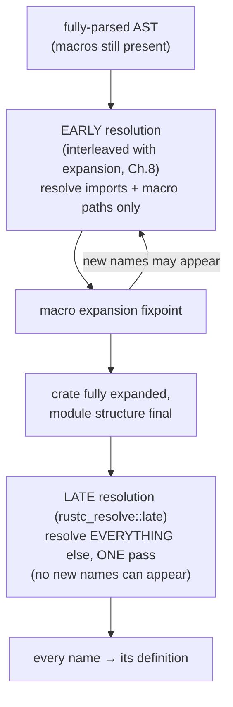
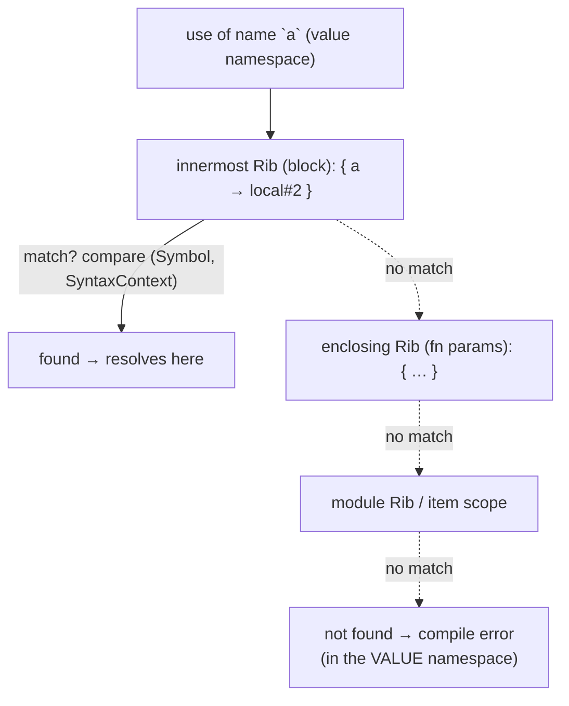
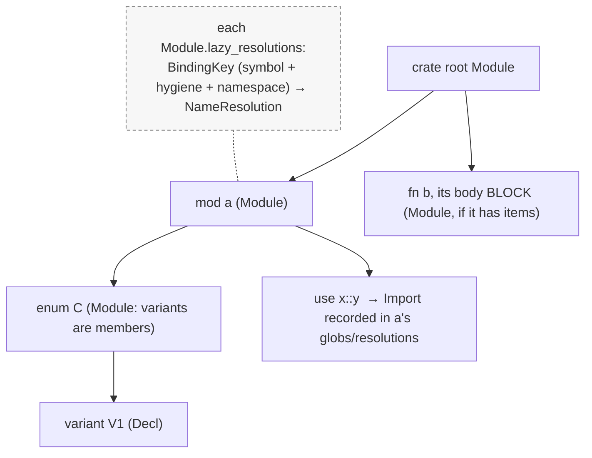
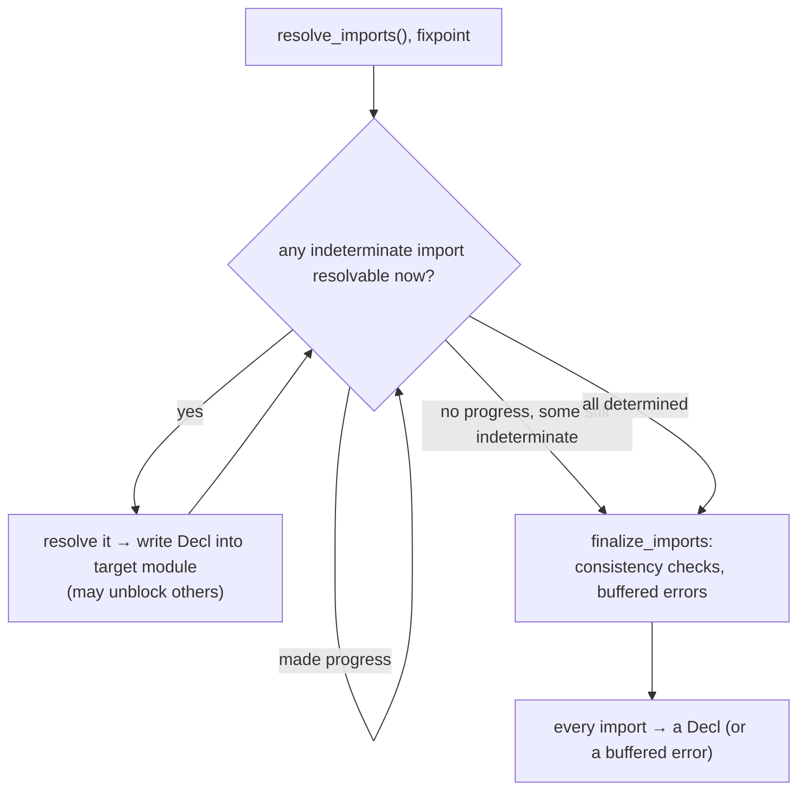
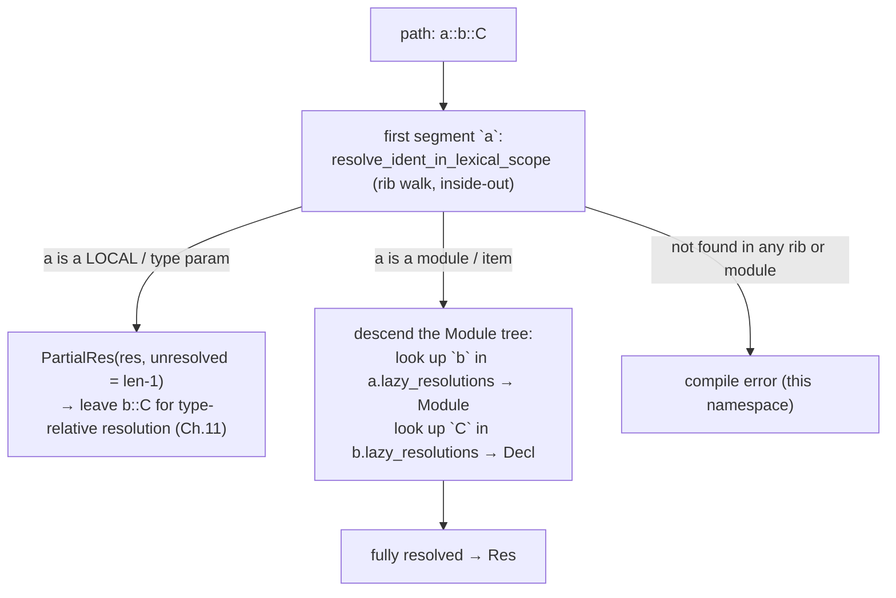
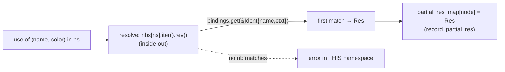

```admonish abstract title="What you'll learn"
- Why name resolution is the front end's *final* act and what it produces: a `Res` (carrying a [`DefId`](../glossary.md#defid) for items or a binding `NodeId` for locals) recorded in `partial_res_map`, consulted forever after by [HIR](../glossary.md#hir) lowering and type checking.
- The three Rust-specific complications that shape `rustc_resolve`: three independent namespaces (type, value, macro) realized as `PerNS<Vec<Rib>>`; macros that force an early/late split (early resolution interleaved with expansion in Chapter 8, late resolution in `rustc_resolve::late`); and [hygiene](../glossary.md#hygiene) that keys lookups by `IdentKey` (symbol plus normalized [`SyntaxContext`](../glossary.md#syntaxcontext)), not bare strings.
- The architecture of the long-lived `Resolver`: the `Module` tree (broader than `mod`, including blocks, enums, traits) planted by `build_reduced_graph`, its `lazy_resolutions` map keyed by `BindingKey`, and the `ParentScope` that says where a lookup begins.
- How imports resolve by a **fixpoint iteration** (`determined_imports` versus `indeterminate_imports`, with globs the hard case and ambiguity an error reported through `AmbiguityError`), mirroring the macro-expansion loop of Chapter 8.
- How `LateResolutionVisitor` walks the [AST](../glossary.md#ast) with `PerNS<Vec<Rib>>`, why `resolve_ident_in_lexical_scope` searches innermost-first, the items-outrank-locals rule, and how a path's first segment runs the rib walk while the rest either descends the `Module` tree or returns a `PartialRes` for type-relative resolution in Chapter 11.
- How to build a working multi-namespace, hygiene-aware resolver in §9.4 whose `(name, color)` key reproduces the §8.4 puzzle: the macro's `a#2` and the user's `a` resolve to different `Res`es because the hash-map key differs.
```

## 9.1 Name Resolution: Binding Names to Definitions

### The question every name asks

Consider one line of Rust:

```rust
let x = foo(y);
```

By the time the compiler reaches this line it has a perfect tree (Chapter 7) with every macro expanded away (Chapter 8). And yet the line is still, in a precise sense, *meaningless*. What is `foo`? A function in this module? One imported with a `use`? A closure stored in a local variable? What is `y`: the parameter two lines up, or a `const` from another module, or a variable shadowed three times since? And the `x` being bound: does it shadow an earlier `x`, and which later uses will see *this* one rather than that? Each of these names is a question, and answering all of them (mapping every identifier in the program to the exact definition it refers to) is **name resolution**, the subject of this chapter and the final stage of Part 1's front end.

This is the stage that turns a tree of *spellings* into a tree of *references*. After it, `foo` is no longer the string `"foo"`; it is a concrete pointer to a specific definition, recorded so that every later pass (type checking, [borrow checking](../glossary.md#borrow-checker), code generation) can ask "what does this name mean?" and get an answer without ever looking at the text again.

### The classic theory: scopes, shadowing, and the symbol table

The textbook treatment of this problem is **lexical scoping** and the **symbol table**. A *scope* is a region of program text in which a set of names is visible; scopes nest, and an inner scope can introduce a name that **shadows** an outer one of the same spelling. The canonical data structure is a stack of symbol tables: entering a scope pushes a table, leaving it pops, and resolving a name means searching the stack from the top (innermost) down (outermost), taking the first match. That "first match from the inside out" rule is exactly what makes this legal Rust:

```rust
let a = 1;
{
    let a = 2; // a new binding, shadowing the outer `a`
    println!("{a}"); // 2, inner scope searched first
}
println!("{a}"); // 1, inner binding popped; outer found
```

The Dragon Book builds compilers on precisely this: a scope stack, push on entry, pop on exit, innermost-first lookup. Rust's resolver is a member of this family, complicated by three properties of the language it must serve: three independent namespaces, [macro expansion](../glossary.md#macro-expansion) that can introduce new names mid-resolution, and hygiene. Those three problems shape the chapter.

### Complication one: three namespaces, not one

Rust lets the same spelling name three different things at once: a type, a value, and a macro. To support that, the resolver maintains **three independent namespaces**, and (this is the crucial subtlety the dev-guide stresses) "namespace" here does *not* mean the module hierarchy. It means the **type** namespace, the **value** namespace, and the **macro** namespace. The same spelling can name different things in each, simultaneously and without conflict:

```rust
struct foo {} // `foo` in the TYPE namespace only (braced; no ctor)
fn foo() {} // `foo` in the VALUE namespace, no collision!
macro_rules! foo { () => {} } // `foo` in the MACRO namespace
```

(A *unit* `struct foo;` or a *tuple* `struct foo(...)` would also enter the value namespace, the constructor, and collide with `fn foo()`. Only **braced** structs are pure type-namespace, which is why the example uses one.)

All three `foo`s coexist because resolution of any *use* knows, from its syntactic position, which namespace to search: `foo(...)` in expression position looks in the value namespace, `x: foo` in type position looks in the type namespace, `foo!()` looks in the macro namespace. The resolver therefore does not keep one scope stack; it keeps a **separate stack per namespace**, and the live data structure in the source is literally `PerNS<Vec<Rib>>`: "per namespace, a vector of ribs." (Lifetimes and labels get their own rib stacks too.) When you read that a name "wasn't found," the first question is always *in which namespace*: a value used where a type was expected fails differently from a genuinely undefined name.

### Complication two: macros force two passes

To expand a macro you must resolve *which* macro it is. But that macro can generate new items, new names, even new `use` imports, which changes what is in scope for everything around it. So full resolution cannot complete in a single tree-walk, yet expansion needs some resolution to proceed at all. Rust's answer, confirmed by the dev-guide, is to split resolution into two phases:

- **Early resolution**, interleaved with macro expansion (Chapter 8): resolve only what expansion strictly needs: **imports and macro paths**. This is the fixpoint of §8.2, and it is *just enough* to know what to expand.
- **Late resolution**, in the module `rustc_resolve::late`: once the crate is fully expanded and its module structure is final, walk the whole AST once and resolve *everything else*: every expression, type, pattern, path. The dev-guide notes the key simplification this buys: in late resolution "we only need to try to resolve a name once, since no new names can be added." If a name fails to resolve here, it is simply a compile error.

So the resolver is two visitors, not one. The early one cooperates with the expander; the late one (`LateResolutionVisitor`) does the bulk of the work on a frozen tree.




### Complication three: hygiene, carried from Chapter 8

The third complication is the one Chapter 8 spent itself building toward. A name is not resolved by its *spelling* alone; it is resolved by its spelling **and its `SyntaxContext`**: the hygiene color stamped onto every identifier during expansion (§8.3). This is why, in §8.4, the macro's `a#2` and the caller's `a` did not collide: name resolution compares the *pair*, not the string. The verified data structures make this concrete. The resolver's binding keys are therefore not bare `Symbol`s but an `IdentKey` pairing the symbol with its normalized hygiene context, so identically-spelled identifiers from different expansions remain different names. Every lookup the resolver performs carries the syntax context along, exactly as §8.1 promised and §8.4 demonstrated.

```admonish tip title="Pro-Tip, cannot find X in this scope names the namespace it searched"
Rust's resolution errors are precise about *which* of the three namespaces failed. "cannot find value `foo`" means the value namespace had no binding; "cannot find type `foo`" means the type namespace did. If you have a `struct Foo` but get "cannot find value `Foo`," you used `Foo` (a type) in expression position, the resolver looked in the value namespace and, correctly, did not find it there even though the type exists. Reading the namespace word in the error tells you whether the name is *missing* or merely *in the wrong namespace*, which are very different fixes.
```

### The `Rib`: Rust's scope, made into a struct

Rust's name for a single scope-frame is a `Rib`, and it is worth meeting now because it is the spine of the late resolver. The verified definition:

```rust
// compiler/rustc_resolve/src/late.rs  (faithful, abridged)
pub(crate) struct Rib<'ra, R = Res> {
    // names introduced in THIS scope → what they resolve to
    pub bindings: FxIndexMap<Ident, R>,
    pub kind: RibKind<'ra>, // what KIND of scope (block, function, module, item…)
    // … patterns_with_skipped_bindings (diagnostics) …
}
```

A `Rib` is one frame of the scope stack: a small map from the names introduced *in that scope* to their resolutions, plus a `kind` recording what sort of scope it is. The dev-guide's description is exact: a rib is "an abstraction of a scope," and a new one is pushed "every time the set of visible names potentially changes": not only at curly braces, but at function boundaries, at `let` bindings (which can shadow), at modules, even at macro boundaries. The `kind` matters because, as the docs note, "different rib kinds are transparent for different names": a closure boundary, for instance, lets some outer names through but not others. To resolve a local name, the late resolver walks the rib stack for the appropriate namespace from the innermost rib outward and takes the first binding whose `Ident` (spelling *and* context) matches, the classic inside-out search, with hygiene woven into the match.




### What a name resolves *to*: `Res` and the identity ladder

When resolution succeeds, what does a name become? Not a string and not a span, but a `Res`: a resolution, an enum saying what kind of thing the name refers to and pointing at it. For an item (a function, a struct, a `const`) the `Res` carries a `DefId`: the stable, cross-crate definition identifier from §2.2. For a local variable or parameter, the `Res` instead points at the `NodeId` of the binding site (a local needs no global `DefId`; it never escapes its function). The resolver records these in side tables: `partial_res_map` for ordinary nodes, and a separate `import_res_map` for imports, which can resolve to different things in different namespaces at once. [VERIFY field names and types against `compiler/rustc_resolve/src/lib.rs` in current rustc]

This is the rung of the §2.2 identity ladder that finally connects the others. Recall the progression: the parser stamped every node with a fragile, sequential `NodeId` (§7.1); lowering to HIR will assign stable [`HirId`](../glossary.md#hirid)s (Chapter 10); and definitions have `DefId`s that work across crates (§2.2). Name resolution is the pass that *links* a use's `NodeId` to its definition's `Res`/`DefId`: it is the bridge from "this identifier node" to "the thing it means." Every later stage reads these resolution tables instead of re-searching scopes, which is why resolution happens once and is then consulted forever after.

```admonish warning title="Warning, resolution is not type checking"
It is tempting to think name resolution figures out *everything* about a name, but it deliberately stops short. `rustc_resolve` resolves paths, imports, macros, labels, and lifetimes, but **type-relative** resolution (which method `x.foo()` calls, which field `x.bar` accesses, which associated item `T::ASSOC` names) is *not* done here. As the crate's own documentation states, that happens later, in `rustc_hir_analysis`, because it needs to know the *type* of `x` first, and types are not known during resolution. So `x.foo()` leaves resolution with `x` resolved but `foo` deliberately unresolved: a method call cannot be resolved until type inference (Chapter 11) discovers what `x` is. Keep the boundary clear: resolution binds names that can be found by *scope*; anything that needs a *type* waits.
```

### Where this leaves us

Name resolution is the front end's final act: it converts a tree of spellings into a tree of references, mapping every identifier to the definition it names. It is a recognizable descendant of the classic scope-stack-and-symbol-table technique (push a scope, pop a scope, search innermost-first) complicated by three things that define the chapter. Rust keeps **three namespaces** (type, value, macro), so the resolver maintains a rib stack *per namespace* (`PerNS<Vec<Rib>>`). Macros force resolution into **two phases**: early resolution of imports and macro paths interleaved with expansion (Chapter 8), then a single **late** pass over the frozen, fully-expanded AST that resolves everything else. And **hygiene** means names are keyed by spelling *and* `SyntaxContext` (the `IdentKey`), the direct payoff of Chapter 8's coloring. The unit of scope is the `Rib`; the result of a successful lookup is a `Res` carrying a `DefId` (for items) or a binding `NodeId` (for locals), recorded in resolution tables that every later pass consults, the rung of the §2.2 identity ladder that links a use to its meaning. Type-relative names wait for Chapter 11.

§9.2 takes the architecture deep-dive: the `Resolver` itself (the long-lived structure that outlives expansion and carries the resolution tables), the `Module`/`ModuleData` tree built by `build_reduced_graph`, how imports are resolved by the fixpoint iteration, and how the `LateResolutionVisitor` walks the AST pushing and popping ribs across the three namespaces. Then §9.3 reads the real rib-walking lookup, and §9.4 has you build a scoped, multi-namespace resolver of your own.

## 9.2 The Architecture: the `Resolver`, the Module Tree, and the Rib Stack

### The structure that outlives expansion

The two phases of resolution, early and late, must share state, so something has to persist across the entire front end: holding the module structure as it is built, the macro definitions as they are discovered, and the resolution tables as they fill in. That something is the `Resolver`: the central, long-lived structure of `rustc_resolve`, created before macro expansion begins and consulted long after it ends. It is the resolver's equivalent of the [`TyCtxt`](../glossary.md#tyctxt-tcx) from Part 0: the one big context that owns everything the pass needs and lends it out.

The field list is large (dozens of fields), but it sorts into a few jobs. It holds the [**arena**](../glossary.md#arena) that backs all the module and binding allocations; the **macro machinery** the §8 expander calls through the `Resolver` trait (the local macro map, builtin macros, the macro-use prelude, and the recovery extensions handed out when a macro fails to resolve); the **prelude and builtin** bindings; and the resolution maps `partial_res_map` and `import_res_map` from §9.1 that every later pass reads. One field is worth highlighting: a single pre-made "this failed to resolve" binding handed out on errors so that resolution can continue and report more, the same recover-and-proceed discipline as the parser's error nodes (§7.2) and [`ErrorGuaranteed`](../glossary.md#errorguaranteed) (§6.2). [VERIFY exact field names against `compiler/rustc_resolve/src/lib.rs` in current rustc]

```admonish tip title="Pro-Tip, the Resolver becomes part of TyCtxt's inputs, then is gone"
Name resolution runs *before* [the query system](../glossary.md#query)'s `TyCtxt` is fully in business; the `Resolver` is its own world. When resolution finishes, its results, chiefly the resolution maps, are packaged into the global structures the rest of the compiler queries, and the `Resolver` itself is dropped. This is why you will not find a `tcx.resolver()` you can call mid-typecheck: resolution is a *front-loaded* pass whose *output* (the `Res` for every path) is what survives, consulted through HIR and typeck, not the resolver machinery itself. If you need "what does this path resolve to" later, you read the recorded resolution, you do not re-run the resolver.
```

### The `Module` tree: broader than `mod`

The skeleton the resolver builds names against is a tree of `Module`s. The first surprise, stated plainly in the source, is that a "module" here is *broader* than a `mod` you write in Rust. The verified `ModuleData`:

```rust
// compiler/rustc_resolve/src/lib.rs  (faithful, selected fields)
struct ModuleData<'ra> {
    parent: Option<Module<'ra>>, // the enclosing module (may not be a `mod`)
    kind: ModuleKind, // what KIND of module this is
    lazy_resolutions: // the names this module contains →
        CmRefCell<FxIndexMap<BindingKey, &'ra CmRefCell<NameResolution<'ra>>>>,
    // macros that may add items here
    unexpanded_invocations: CmRefCell<FxHashSet<LocalExpnId>>,
    glob_importers: CmRefCell<Vec<Import<'ra>>>, // who globs us
    globs: CmRefCell<Vec<Import<'ra>>>, // glob imports (`use foo::*`) out of here
    expansion: ExpnId, // which expansion produced this module
    // … populate_on_access, underscore_disambiguator,
    //   no_implicit_prelude, traits, span, self_decl …
}
// CmRefCell is a crate-internal RefCell wrapper from rustc_resolve::ref_mut.
```

A `Module` is created not only for each `mod`, but for the crate root, for each **block** that can contain items, for **enums** (their variants are members), for **traits** (their associated items), and so on: anything that can *contain named members* gets a module node. The `kind` distinguishes them. The tree is `parent`-linked, and (the §4 arena pattern, recurring) every `Module` is allocated in the resolver's arena, which lets the code use **referential equality** to compare modules: two `&ModuleData` are the same module if and only if they are the same pointer. That is the same "arena makes identity cheap" move as the type [interner](../glossary.md#interner) of §4.2.

The heart of a `ModuleData` is `lazy_resolutions`: a map from a `BindingKey` to a `NameResolution`. A `BindingKey` is essentially the `IdentKey` of §9.1 (symbol plus normalized hygiene context) together with the namespace and a disambiguator: so the *same* module can hold a `foo` in the value namespace and a `foo` in the type namespace as two distinct entries (§9.1's three-namespace rule, realized as distinct keys). The word *lazy* is also load-bearing: for modules imported from *other crates*, the resolutions are not filled in until first accessed (`populate_on_access`), so the compiler never pays to enumerate the entire contents of, say, `std`, only the parts a crate actually touches. Demand-driven again, in the spirit of Part 0's query system.

### `build_reduced_graph`: planting the tree

The module tree is constructed by the module `build_reduced_graph`. Its job, as the crate documentation puts it, is that "after we obtain a fresh AST fragment from a macro, code in this module helps to integrate that fragment into the module structures that are already partially built." In other words, `build_reduced_graph` is the §8.2 *integration* step seen from the resolver's side: every time expansion produces a fragment, this visitor walks it, creates `Module` nodes for the new modules/blocks/enums it contains, and inserts each new item's name as a `Decl` into the appropriate module's `lazy_resolutions`. It is called the "reduced graph" because it captures just the naming skeleton (what defines what, what imports what) not the full detail of the AST. By the time expansion reaches its fixpoint, `build_reduced_graph` has planted a complete module tree with every item-level name in place.




### `Decl`, `NameResolution`, and the import fixpoint

What sits in each `lazy_resolutions` slot is a `NameResolution`: the source describes it as recording "the resolution of a name in a namespace of a module." A directly-defined item resolves immediately to a `Decl` (formerly `NameBinding`; renamed during the late-2024 resolver refactor): the thing a name binds to, a `Res` or an import, with its visibility and provenance. But an *import*, `use foo::bar;`, cannot resolve until `foo::bar` itself is known, which may depend on *other* imports, which may depend on glob imports (`use foo::`*) that pull in unknown sets of names. Imports therefore resolve by **fixpoint iteration**, exactly mirroring the macro-expansion loop of §8.2.

The mechanism: the resolver keeps two lists, `determined_imports` (known to succeed or fail) and `indeterminate_imports` (not yet decided). The method `resolve_imports` performs the fixed-point iteration: repeatedly try to resolve the indeterminate ones; each success may make others resolvable; loop until no progress. A glob import is the hard case: `use foo::*` cannot be finalized until `foo`'s own contents are settled, because anything added to `foo` (perhaps by a macro) must also appear here, which is why glob importers are tracked on the module (`glob_importers`) and re-examined as bindings arrive. When the dust settles, `finalize_imports` runs the consistency checks and reports errors, deliberately buffering them so multiple unresolved-import failures become one coherent diagnostic rather than a cascade.




```admonish warning title="Warning, a glob import does not win over an explicit one, and ambiguity is an error"
Because globs pull in whole name-sets that may overlap with each other or with explicit items, the resolver must adjudicate conflicts. The rules are specific: an explicitly-named import or item shadows a glob-imported name of the same spelling, but *two globs* bringing in the same name from different places, with no explicit winner, is an **ambiguity error** (the verified `AmbiguityError`), not a silent pick. This is why adding a seemingly innocent `use other_crate::`* can suddenly break a build with "`foo` is ambiguous," a second glob now offers a competing `foo`. The resolver refuses to guess; it reports. Knowing globs are resolved by this fixpoint-plus-ambiguity machinery explains why glob-heavy code has the most surprising resolution errors.
```

### `ParentScope`: where a name is being resolved *from*

Resolving a path needs more than the path. It needs to know *where the lookup starts*. That context is a `ParentScope`, verified as:

```rust
// compiler/rustc_resolve/src/lib.rs  (verbatim)
struct ParentScope<'ra> {
    module: Module<'ra>, // the module the use sits in
    // which expansion it came from (hygiene)
    expansion: LocalExpnId,
    macro_rules: MacroRulesScopeRef<'ra>, // in-scope macro_rules (= &'ra CacheCell<MacroRulesScope<'ra>>)
    derives: &'ra [ast::Path],
}
```

The docs call it "everything you need to know about a name's location to resolve it": the starting point for the scope search. Note the `expansion` field: the parent scope carries the hygiene context, so resolving a name from inside a macro expansion searches scopes *as that expansion sees them*, which is how hygiene (§8) is honored at the module level, complementing the per-`Ident` `SyntaxContext` matching of §9.1. (`ParentScope` is, in practice, the starting point chiefly for *early* resolution; the late visitor carries one but its rib stack does most of the work.)

### Late resolution: the rib stack, walking

For **late** resolution, the bulk of the work, the driver is the `LateResolutionVisitor`, and its state is the rib machinery of §9.1, made into fields:

```rust
// compiler/rustc_resolve/src/late.rs  (verbatim, selected)
struct LateResolutionVisitor<'a, 'ast, 'ra, 'tcx> {
    r: &'a mut Resolver<'ra, 'tcx>, // the long-lived resolver (tables, modules)
    parent_scope: ParentScope<'ra>, // the current module scope
    ribs: PerNS<Vec<Rib<'ra>>>, // the scope stacks: ONE per namespace (§9.1)
    label_ribs: Vec<Rib<'ra, NodeId>>, // labels get their own stack
    lifetime_ribs: Vec<LifetimeRib>, // so do lifetimes
    // … diag_metadata, in_func_body …
}
```

There is the `PerNS<Vec<Rib>>` of §9.1 in the flesh: a separate rib stack for the type and value namespaces, plus dedicated stacks for labels and lifetimes. The visitor walks the AST depth-first; entering a scope (a block, a function, a `let`) pushes a `Rib` of the right `kind` onto the relevant stacks, and leaving pops it. When it meets a *use* of a name, it resolves it (for a local, by the inside-out rib walk of §9.1; for a path into the module tree, by searching the `Module`s through `parent_scope`) and records the answer in the resolver's `partial_res_map`. One walk, every name, no second chances: the §9.1 "resolve once" property, embodied in a single depth-first traversal.

### How this builds, and what is next

The architecture is now in hand. A single long-lived `Resolver`, arena-backed like the contexts of Part 0, persists across both resolution phases and owns the module tree, the macro tables, and the `partial_res_map`/`import_res_map` that every later pass reads. The naming skeleton is a tree of `Module`s (broader than `mod`, arena-allocated for referential-equality identity, each holding a `BindingKey`-to-`NameResolution` map that is *lazy* for external crates) planted by `build_reduced_graph` as the §8 integration step. **Imports** resolve by a **fixpoint iteration** (`determined`/`indeterminate`, globs the hard case, ambiguity an error) that mirrors macro expansion. A `ParentScope` says where a lookup begins, carrying hygiene context. And **late** resolution drives the `LateResolutionVisitor` with `PerNS<Vec<Rib>>`, the per-namespace scope stacks of §9.1, walking the frozen AST once, pushing and popping ribs, resolving every name and recording it.

§9.3 reads the real lookup code: how the late resolver searches the rib stack for a local and the module tree for a path, how the `(Symbol, SyntaxContext)` comparison is actually performed against a `Rib`'s `bindings`, and how a successful match becomes a `Res` written into the resolution map. Then §9.4 has you build a working multi-namespace, rib-based resolver (pushing scopes, shadowing, resolving across value and type namespaces with hygiene-aware keys) over the AST your §7.4 parser produces.

## 9.3 Reading the Source: the Rib Walk and Path Resolution

### One function, asked of every name

When the `LateResolutionVisitor` of §9.2 meets a use of a name, the question "what does this refer to?" funnels into one routine: walk the rib stack from the inside out, return the first scope that defines the name. The compiler's own description is exact: it "proceeds up the hierarchy of scopes and returns the binding for `ident` in the first scope that defines it (or `None` if no scope does)." This section reads that walk, the surprising scope-ordering rule hiding inside it, and how a multi-segment *path* like `foo::bar::baz` extends the same idea into the module tree, finishing with the moment a successful lookup becomes a recorded `Res`.

### The rib walk: inside-out, hygiene-aware

Recall the `Rib` (§9.1/§9.2): one scope-frame, a map from `Ident` to a resolution, plus a `kind`.

```rust
// compiler/rustc_resolve/src/late.rs  (faithful, abridged)
pub(crate) struct Rib<'ra, R = Res> {
    pub bindings: FxIndexMap<Ident, R>, // names introduced in THIS scope → resolution
    pub kind: RibKind<'ra>, // block / function / item / closure / …
}
```

The lookup, `resolve_ident_in_lexical_scope`, is handed the identifier, its namespace, and the rib stack for that namespace (`&ribs[ns]`), and walks it from the top (innermost) down. In shape:

```rust
// faithful, the essential rib walk
fn resolve_ident_in_lexical_scope(&self, ident: Ident, ns: Namespace, ribs: &[Rib<'ra>], ...) -> Option<...> {
    for (i, rib) in ribs.iter().enumerate().rev() { // innermost first
        if let Some(res) = rib.bindings.get(&ident) { // (Symbol + SyntaxContext) match
            // found a local / type param in this scope, but check the rib KIND lets it through
            return Some(self.validate_res_from_ribs(i, res, ns, ...));
        }
        // otherwise keep walking outward; some rib kinds also block certain names
    }
    None // not found in any local scope → try the module tree (paths) or error
}
```

Two details carry the section's weight. First, the `rib.bindings.get(&ident)` lookup is keyed by `Ident`, and an `Ident` is a `Symbol` *plus a `Span` carrying a `SyntaxContext`*. So this `get` compares spelling *and hygiene color* (§8, §9.1). Two `x`s from different expansions hash to different keys and do not match each other; the hygiene guarantee is literally this map lookup. Second, the `kind` is consulted on the way: as the docs note, "different rib kinds are transparent for different names." A closure rib, for example, lets outer *items* and *types* through but stops outer *local variables* from leaking in where they should not, so finding the name is not enough; the rib kinds between the use and the binding must permit the reference. That `validate`-on-the-way is why a `Rib` carries a `kind` at all.

### Items outrank locals within a block

Within a block, items are in scope across the entire block, regardless of textual order, while locals are visible only after their `let`. Example:

```rust
fn f() {
    // resolves to the ITEM `fn g` below, items are in scope for the whole block
    g();
    let g = || {};
    fn g() {}
    g(); // resolves to the LOCAL `g`, it shadows the item from its `let` onward
}
```

The first `g()` resolves to the function item even though `fn g` is written *later*, because items are not subject to the "defined before use" rule that locals are: an item is visible throughout its entire block. The second `g()`, after the `let`, resolves to the local, which shadows the item from that point on. The resolver models this by arranging that, for a given block, the rib carrying the block's *items* sits outside (is searched after, but is unconditionally in scope across) the ribs carrying its *locals*, while the locals' "only visible after their `let`" behavior comes from *when* they are inserted during the depth-first walk.

```admonish tip title="Pro-Tip, cannot find value in this scope with the item right there usually means a local shadowed it"
If the compiler claims it cannot find something you can plainly see defined, suspect shadowing order. A `let` binding of the same name *earlier* in the block shadows a later item from the `let` onward, and a use *after* that `let` sees the local, not the item, which can surprise you if the local has a different type or is uninitialized. The inside-out, items-outside-locals model of the rib walk is the precise rule; when resolution does something you did not expect, mentally replay the walk: innermost rib first, locals only after their `let`, items everywhere in their block.
```

### From identifier to path: the same walk, then descent

A bare identifier is the easy case. Most real names are *paths*: `foo`, `foo::bar`, `crate::module::Item`, `Vec::new`. Path resolution reuses the rib walk for the **first segment** and then switches to the module tree for the rest. Reading the verified logic in `ident.rs`: for the path's first segment, the resolver tries `resolve_ident_in_lexical_scope` against `&ribs[ns]`. If that finds a local variable or type parameter, a `RibDef`, something important happens:

```rust
// compiler/rustc_resolve/src/ident.rs  (faithful)
Some(LateDecl::RibDef(res)) => {
    record_segment_res(self.reborrow(), finalize, res, id);
    return PathResult::NonModule(PartialRes::with_unresolved_segments(
        res,
        path.len() - 1, // ← leave the REMAINING segments unresolved
    ));
}
```

Look at `with_unresolved_segments(res, path.len() - 1)`. If the first segment resolved to a local of type `T`, the resolver resolves *only that segment* and deliberately leaves the rest, `path.len() - 1` segments, **unresolved**, returning a `PartialRes`. This is the §9.1 boundary made concrete: for `x.field` or `local::Assoc`, name resolution binds `x` (the local) and *stops*, because resolving what comes after needs the *type* of `x`, which only type checking knows (Chapter 11). The "partial" in `PartialRes` and `partial_res_map` is exactly this: resolution often resolves a path's *prefix* and records how many trailing segments it left for later, type-relative resolution.

If instead the first segment is not a local but a module-or-item (an `Import`/`Decl`), resolution descends into the `Module` tree of §9.2: look the segment up in the current module's `lazy_resolutions` by `BindingKey`, get the next `Module`, repeat for each segment, and bind the final one. A path is therefore "rib walk for the head, module descent for the tail," and either part can stop early and hand the remainder to a later pass.




### Recording the answer: `record_partial_res`

A resolution is useless unless it is remembered. When the walk succeeds, the resolver writes the result into the side table the whole rest of the compiler will read, the `partial_res_map` of §9.2, via `record_partial_res`:

```rust
// faithful
self.r.record_partial_res(node_id, PartialRes::new(res));
```

The key is the *use's* `NodeId` (the §7.1 identity the parser stamped on that path node); the value is the `PartialRes` carrying the `Res`. After this single write, the question "what does the name at this node refer to?" is answered forever: HIR lowering (Chapter 10) and type checking (Chapter 11) look up `node_id` in this map rather than re-walking any scopes. This is the §9.1 "resolve once, consult forever" property in one line of code, and the rung of the §2.2 identity ladder being forged: the use's `NodeId` is now linked to its definition's `Res`/`DefId`.

```admonish warning title="Warning, patterns introduce names; they are resolved differently"
Most of this section is about *uses* of names. But a pattern (`let (a, b) = pair;`, or a `match` arm `Some(x) =>`) *defines* names, and the resolver handles it with separate machinery (`resolve_pattern`, `apply_pattern_bindings`) that *inserts* bindings into the innermost rib rather than looking them up. Two pattern subtleties are real traps. First, **or-patterns** like `Some(x) | Other(x)` must bind the *same* set of names on both sides, and the resolver checks this consistency, *hygienically*, since (as the docs note) one `x` might come from the user and one from a macro, and those must be treated as different names even here. Second, a pattern binding can shadow, and binding the same name twice in one *product* pattern (`(x, x)`) is an error while reusing it across an *or* (`A(x) | B(x)`) is required. If you build a resolver (§9.4), remember that patterns flow the opposite direction from uses: they write to the rib, not read from it.
```

### How this builds, and what is next

We have read the core of late resolution. Every use of a name runs `resolve_ident_in_lexical_scope`, an inside-out walk of the namespace's rib stack whose `bindings.get(&ident)` compares `Symbol` *and* `SyntaxContext`, so hygiene is literally a map lookup, and whose `RibKind` gating decides which outer names a given scope lets through. The walk encodes the rule that catches everyone: a block's items are in scope across the whole block while its locals are visible only after their `let`, so `fn g` is callable before its definition until a `let g` shadows it. A *path* reuses the walk for its first segment and then either descends the `Module` tree for the rest or, for a local prefix, returns a `PartialRes` that resolves the head and leaves the trailing segments for type-relative resolution in Chapter 11, the §9.1 boundary made literal. The answer is recorded once with `record_partial_res` into `partial_res_map`, keyed by the use's `NodeId`, and consulted by every later pass. Patterns run the same machinery in reverse, inserting hygienic bindings.

§9.4 turns this into a build. You will write a multi-namespace, rib-based resolver over the AST your §7.4 parser produces: a stack of scopes per namespace, `let`-introduces-shadowing, a hygiene-aware key so a "macro-colored" name does not collide with a user name, and a resolution table mapping each use to its definition, with the items-outrank-locals rule and a pattern that introduces bindings. You will reproduce, in miniature, the walk you just read, and watch a `(name, color)` lookup keep two identical spellings apart.

## 9.4 Hands-On Lab: Build a Scoped, Multi-Namespace Resolver

### The last floor of the front end

This is the final lab of Part 1, and it builds the pass that gives every name a meaning. You will write a resolver that does the three things §9.1 to §9.3 identified as Rust-specific: it keeps **separate scope stacks per namespace** (so a type `Foo` and a value `Foo` coexist), it resolves names **inside-out with the items-outrank-locals rule**, and it keys lookups by **`(symbol, color)`** so a macro-introduced name cannot capture a user's. When your resolver binds the two identically-spelled `a`s from §8.4 to *different* definitions, the whole arc from Chapter 8 closes: the color you painted in expansion is the key that keeps them apart in resolution.

`cargo new`, pure `std`. The AST here is hand-built for clarity; an extension wires it to your §7.4 parser.

### The pieces: identifiers with color, namespaces, and resolutions

```rust
// src/main.rs
use std::collections::HashMap;

/// An identifier is a name PLUS a hygiene color, exactly rustc's (Symbol, SyntaxContext).
#[derive(Clone, PartialEq, Eq, Hash, Debug)]
struct Ident { name: String, ctxt: u32 } // ctxt 0 = source; >0 = a macro expansion

fn id(name: &str) -> Ident { Ident { name: name.into(), ctxt: 0 } }
fn id_c(name: &str, ctxt: u32) -> Ident { Ident { name: name.into(), ctxt } }

/// rustc's `Namespace` is three: `ValueNS`, `TypeNS`, `MacroNS`; we model the
/// two the late visitor walks. Macros resolve in the early phase (§9.1).
#[derive(Clone, Copy, PartialEq, Eq, Hash, Debug)]
enum Ns { ValueNS, TypeNS }

/// What a name resolves TO: a miniature `Res`.
/// rustc's `Res::Def(DefKind, DefId)` carries two payloads; we mirror with `(DefKind, u32)`.
#[derive(Clone, Debug, PartialEq)]
enum DefKind { Fn, Struct, Const }
#[derive(Clone, Debug, PartialEq)]
enum Res { Local(u32), Def(DefKind, u32) } // carries node id / def id
```

The crucial choice is that `Ident` derives `Hash`/`Eq` over *both* `name` and `ctxt`. That single decision is hygiene: the map will treat `a#0` and `a#2` as different keys, exactly as rustc's `bindings.get(&ident)` does (§9.3).

### The rib stack: a scope per namespace

A `Rib` is one scope-frame's bindings; the visitor holds a `Vec<Rib>` *per namespace*, the `PerNS<Vec<Rib>>` of §9.2, plus the output table mapping each use's node id to its `Res`. We model `PerNS<T>` as a small named-field struct, exactly as rustc does (rustc's `PerNS<T>` has three fields, one per namespace; we model the two the late visitor walks). And `bindings` here is a `HashMap` for simplicity; rustc uses `FxIndexMap` so iteration order is deterministic for diagnostics.

```rust
struct Rib { bindings: HashMap<Ident, Res>, kind: RibKind }

#[allow(dead_code)] // `Item` is a placeholder; see Extension 4
enum RibKind { Block, Function, Item } // (real rustc has many more)

/// Like rustc's `PerNS<T> { value_ns, type_ns, macro_ns }`, but two-namespace.
struct PerNs<T> { value: T, type_: T }

impl<T> std::ops::Index<Ns> for PerNs<T> {
    type Output = T;
    fn index(&self, ns: Ns) -> &T {
        match ns { Ns::ValueNS => &self.value, Ns::TypeNS => &self.type_ }
    }
}
impl<T> std::ops::IndexMut<Ns> for PerNs<T> {
    fn index_mut(&mut self, ns: Ns) -> &mut T {
        match ns { Ns::ValueNS => &mut self.value, Ns::TypeNS => &mut self.type_ }
    }
}

/// rustc's outer `Resolver` owns `partial_res_map` and outlives expansion;
/// the visitor type below is what does the walk.
struct LateResolutionVisitor {
    ribs: PerNs<Vec<Rib>>, // PerNS<Vec<Rib>>, inside-out scope stacks
    partial_res_map: HashMap<u32, Res>, // use node id → Res
    next_def: u32,
}

impl LateResolutionVisitor {
    fn new() -> LateResolutionVisitor {
        LateResolutionVisitor {
            ribs: PerNs { value: Vec::new(), type_: Vec::new() },
            partial_res_map: HashMap::new(),
            next_def: 0,
        }
    }

    fn push(&mut self, ns: Ns, kind: RibKind) {
        self.ribs[ns].push(Rib { bindings: HashMap::new(), kind });
    }
    fn pop(&mut self, ns: Ns) {
        self.ribs[ns].pop();
    }

    /// Introduce a binding in the innermost rib of `ns` (a `let`, a param, an item).
    fn define(&mut self, ns: Ns, ident: Ident, res: Res) {
        self.ribs[ns].last_mut().unwrap().bindings.insert(ident, res);
    }

    /// Resolve a USE: walk the rib stack inside-out, first match wins (§9.3).
    fn resolve(&self, ns: Ns, ident: &Ident) -> Option<Res> {
        for rib in self.ribs[ns].iter().rev() { // innermost first
            if let Some(res) = rib.bindings.get(ident) { // (name, color) match
                return Some(res.clone());
            }
        }
        None
    }

    /// rustc's `record_partial_res` panics on double-insert; we mirror that.
    fn record_partial_res(&mut self, node_id: u32, res: Res) {
        let prev = self.partial_res_map.insert(node_id, res);
        assert!(prev.is_none(), "double insert");
    }
}
```

`resolve` is the §9.3 walk in five lines: `iter().rev()` is "innermost first," `bindings.get(ident)` is the hygiene-aware match, and "first match wins" is shadowing.

### A tiny AST, and the items-outrank-locals rule

We model just enough AST to exercise the interesting rules: items, `let`s, uses, and a block:

```rust
enum Stmt {
    Item { name: &'static str, ns: Ns, kind: DefKind },
    Let  { name: &'static str, init: Expr },
    Eval(Expr),
}
enum Expr { Use { node: u32, name: &'static str, ns: Ns } } // a use of a name, with its node id
```

Resolving a block has the §9.3 subtlety baked in: items are collected and defined *first* (so a use earlier in the block can see a later item), then statements run in order, with each `let` shadowing from its position onward. That two-pass structure is precisely how rustc makes `g()` resolve to a `fn g` written below it:

```rust
impl LateResolutionVisitor {
    fn resolve_block(&mut self, stmts: &[Stmt]) {
        self.push(Ns::ValueNS, RibKind::Block);
        self.push(Ns::TypeNS, RibKind::Block);

        // PASS 1, items first: visible across the entire block regardless of position (§9.3).
        for s in stmts {
            if let Stmt::Item { name, ns, kind } = s {
                let d = self.fresh();
                self.define(*ns, id(name), Res::Def(kind.clone(), d));
            }
        }
        // PASS 2, statements in order: a `let` shadows from its point onward.
        for s in stmts {
            match s {
                // already defined in pass 1
                Stmt::Item { .. } => {}
                Stmt::Let { name, init } => {
                    // resolve the initializer FIRST…
                    self.resolve_expr(init);
                    let d = self.fresh();
                    // …THEN bind (so `let x = x` sees the outer x)
                    self.define(Ns::ValueNS, id(name), Res::Local(d));
                }
                Stmt::Eval(e) => self.resolve_expr(e),
            }
        }
        self.pop(Ns::ValueNS); self.pop(Ns::TypeNS);
    }

    fn resolve_expr(&mut self, e: &Expr) {
        match e {
            Expr::Use { node, name, ns } => {
                match self.resolve(*ns, &id(name)) {
                    Some(res) => self.record_partial_res(*node, res),
                    None => println!("  error: cannot find {ns:?} `{name}` in this scope"),
                }
            }
        }
    }
    fn fresh(&mut self) -> u32 { self.next_def += 1; self.next_def }
}
```

Two lines encode rules from §9.3. Defining items in *pass 1* gives "items are in scope across the whole block." Resolving a `let`'s initializer *before* defining its name means `let x = x + 1;` sees the *outer* `x` on the right: the correct Rust behavior, and a classic resolver bug if you bind first.

*What we simplified: real rustc keeps items in the block's `Module` (planted by `build_reduced_graph_for_block` during expansion) and pushes a single `RibKind::Block(Some(module))` rib for locals; the walk tries `rib.bindings` first, then falls through to the module. We merge both into one map and use a two-pass walk; the observable shadowing is the same, the layout is not.*

### Running it: shadowing, namespaces, hygiene

```rust
fn main() {
    let mut r = LateResolutionVisitor::new();

    // ── 1. items-outrank-locals: use `g` BEFORE its item; then a `let g` shadows it. ──
    println!("block 1 (use g before fn g, then shadow):");
    r.resolve_block(&[
        // → Item (fn g, defined below)
        Stmt::Eval(Expr::Use { node: 1, name: "g", ns: Ns::ValueNS }),
        // RHS → Item
        Stmt::Let { name: "g", init: Expr::Use { node: 2, name: "g", ns: Ns::ValueNS } },
        Stmt::Item { name: "g", ns: Ns::ValueNS, kind: DefKind::Fn },
        // → Local (shadowed)
        Stmt::Eval(Expr::Use { node: 3, name: "g", ns: Ns::ValueNS }),
    ]);
    // Def(Fn, _) (item visible across block)
    println!("  node 1 → {:?}", r.partial_res_map[&1]);
    // Def(Fn, _) (RHS resolved before `let` binds)
    println!("  node 2 → {:?}", r.partial_res_map[&2]);
    println!("  node 3 → {:?}", r.partial_res_map[&3]); // Local  (let g shadows from here)

    // ── 2. namespaces: a value `Foo` and a type `Foo` coexist. ──
    println!("\nblock 2 (Foo in two namespaces):");
    let mut r = LateResolutionVisitor::new();
    r.resolve_block(&[
        Stmt::Item { name: "Foo", ns: Ns::TypeNS,  kind: DefKind::Struct }, // struct Foo
        Stmt::Item { name: "Foo", ns: Ns::ValueNS, kind: DefKind::Fn }, // fn Foo
        Stmt::Eval(Expr::Use { node: 10, name: "Foo", ns: Ns::TypeNS }),  // → the struct
        Stmt::Eval(Expr::Use { node: 11, name: "Foo", ns: Ns::ValueNS }), // → the fn
    ]);
    println!("  node 10 (type)  → {:?}", r.partial_res_map[&10]);
    println!("  node 11 (value) → {:?}", r.partial_res_map[&11]);

    // ── 3. HYGIENE: a macro's `a#2` and the user's `a#0` are different names. ──
    println!("\nblock 3 (hygiene, the §8.4 using_a! puzzle):");
    let mut r = LateResolutionVisitor::new();
    r.push(Ns::ValueNS, RibKind::Function);
    // macro-introduced  `let a#2 = 42`
    r.define(Ns::ValueNS, id_c("a", 2), Res::Local(42));
    // user's `let a   = 10`
    r.define(Ns::ValueNS, id("a"),      Res::Local(10));
    let macro_a = r.resolve(Ns::ValueNS, &id_c("a", 2)).unwrap();
    let user_a  = r.resolve(Ns::ValueNS, &id("a")).unwrap();
    println!("  a#2 (macro) → {macro_a:?}"); // Local(42)
    // Local(10)  ← distinct, despite same spelling
    println!("  a#0 (user)  → {user_a:?}");
}
```

````admonish example title="Expected output" collapsible=true
```text
block 1 (use g before fn g, then shadow):
  node 1 → Def(Fn, 1)
  node 2 → Def(Fn, 1)
  node 3 → Local(2)

block 2 (Foo in two namespaces):
  node 10 (type)  → Def(Struct, 1)
  node 11 (value) → Def(Fn, 2)

block 3 (hygiene, the §8.4 using_a! puzzle):
  a#2 (macro) → Local(42)
  a#0 (user)  → Local(10)
```
````

Block 1: `g` used before its `fn` resolves to the item; after `let g`, it resolves to the local, items-outrank-locals plus shadowing. Block 2: the same spelling `Foo` resolves to *two different things* depending on namespace, no collision. Block 3 closes the §8.4 example: the macro's `a#2` and the user's `a` are stored under different keys and resolve to different `Res`es, so the §8.4 `using_a!(a)` returns the user's 10, never the macro's 42. The color from Chapter 8 is, here, the hash-map key that keeps them apart.




### What the lab stripped from real rustc

The three rules the lab encoded (rib stack walked inside-out, `(name, color)` keying, items-outrank-locals) are exactly the rules the production resolver runs on. What the real sources in `[rustc_resolve/src/lib.rs](https://github.com/rust-lang/rust/blob/1.95.0/compiler/rustc_resolve/src/lib.rs)`, `[rustc_resolve/src/late.rs](https://github.com/rust-lang/rust/blob/1.95.0/compiler/rustc_resolve/src/late.rs)`, and `[rustc_resolve/src/imports.rs](https://github.com/rust-lang/rust/blob/1.95.0/compiler/rustc_resolve/src/imports.rs)` add on top of the lab is bookkeeping: the import fixpoint with its `Determinacy::{Determined, Undetermined}` state that lets a resolver say "try me again once more imports are resolved"; the many transparency-encoding `RibKind` variants that decide which outer names a closure, constant, or macro-definition rib lets through; the lazy `ModuleData` tree with its glob-importer tracking and `unexpanded_invocations` driving the §8 interlacing; and `PartialRes`, which encodes the §9.3 type-relative boundary by recording how many trailing segments were left for the type checker. The full enumeration of fields and variants lives in the rustc-dev-guide's name-resolution chapter and in those three source files.

The mechanism is identical; the bookkeeping is what makes name resolution interlace with expansion and feed every later pass.

### Extension exercises

1. **Resolve patterns.** Add a `Pat` that *introduces* names (`let (a, b) = …`) by writing to the innermost rib (§9.3). Then add or-patterns `A(x) | B(x)` and check both arms bind the *same* set: hygienically, so a user `x` and a macro `x` are required to match as the *same* binding only if their colors agree.
2. **Add paths and a module tree.** Give items a small `Module` tree (§9.2) and resolve `a::b::C`: rib-walk the first segment, then descend modules for the rest, returning a `PartialRes` (resolve the prefix, leave the tail) when the head is a local, the §9.3 type-relative boundary.
3. **Wire to your parser.** Replace the hand-built AST with the output of your §7.4 parser (extended with `let`/identifiers), threading spans so an unresolved name underlines via your §6.4 emitter. Lex → parse → resolve, your own front end end-to-end.
4. **Closure transparency.** Add a `RibKind::Closure` that lets outer *items* through but reports an error for captured-by-name *locals* you choose to forbid, a toy of the "different rib kinds are transparent for different names" rule (§9.3).
5. **`Res::Err` and a dummy resolution.** Add a `Res::Err` variant and return it from `resolve` on lookup miss instead of `None`. Record it in `partial_res_map` so every node has an entry, even the failed ones, and have `resolve_expr` simply write through whatever `resolve` returns rather than branching on success. This is the recover-and-proceed discipline rustc uses with its single pre-made `dummy_decl: Decl<'ra>` at `compiler/rustc_resolve/src/lib.rs::Resolver::dummy_decl@59807616e1fa`, constructed once as `arenas.new_pub_def_decl(Res::Err, DUMMY_SP, LocalExpnId::ROOT)` and handed out on every failure so the rest of the compiler keeps running. What you have learned: the §6.2 `ErrorGuaranteed` / §7.2 error-node discipline reappears at the resolver, mirroring rustc's `Res::Err` at `compiler/rustc_hir/src/def.rs::Res::Err@59807616e1fa`.
6. **`BindingKey`: namespace-tagged module entries.** Building on extension 2's module tree, key your `Module`'s name map by a `BindingKey { name, ctxt, ns }` rather than by `Ident` alone, and look items up by constructing the matching key for the namespace the use sits in. This lets one module hold `foo` in the type namespace and `foo` in the value namespace as two distinct entries, the same three-namespace rule the rib stack already enforces at the local level. What you have learned: the namespace-aware module key behind `compiler/rustc_resolve/src/lib.rs::BindingKey@59807616e1fa` (`BindingKey { ident: IdentKey, ns: Namespace, disambiguator: u32 }`) backing `ModuleData::lazy_resolutions`, so the same-spelling-different-namespace property is symmetric across ribs and modules.

### Where Chapter 9, and Part 1, leaves us

Chapter 9 is complete. §9.1 framed resolution as turning spellings into references, complicated by three namespaces, the macro-forced early/late split, and hygiene. §9.2 opened the long-lived `Resolver`, the `Module` tree built by `build_reduced_graph`, and the import fixpoint. §9.3 read the inside-out rib walk, the items-outrank-locals rule, the `PartialRes` boundary that hands type-relative names to later passes, and `record_partial_res`. And in this lab you built a multi-namespace, hygiene-aware resolver and watched a `(name, color)` key keep two `a`s apart, closing the loop opened in Chapter 8.

Part 1 is complete: the compiler now has tokens (Chapter 5), spans and diagnostics (Chapter 6), an AST (Chapter 7), expansion with hygiene coloring (Chapter 8), and every identifier bound to its definition (Chapter 9). The front end has turned a flat string into a fully-resolved syntax tree.

But notice what the tree still does *not* know: **types**. It knows `x` is a local and `foo` is a function, but not that `x: u32`, not whether `foo(x)` type-checks, not whether the trait bounds are satisfied, not whether the borrows are sound. The AST is faithful to your syntax (sugar, surface forms, and all), which makes it well suited to diagnostics but unwieldy for analysis. So the compiler's middle end begins by *lowering* the resolved AST into a new, desugared intermediate representation built for semantic work: the **HIR**, the High-level Intermediate Representation. Where the AST has three kinds of loop, the HIR has one; where the AST leaves `NodeId`s, the HIR assigns the stable `HirId`s of §2.2. Part 2 opens there, with Chapter 10, **HIR Lowering**, as the resolved tree of Part 1 is transformed into the first IR of the middle end, and the compiler turns from *reading* your program to *understanding* it.

### The picture so far

Part 1 is complete. The front end's reading path now runs end-to-end: bytes → tokens (Ch.5) → AST (Ch.7) → expanded AST (Ch.8) → resolved AST (Ch.9), with spans (Ch.6) tying every node back to source. The compiler can *read* a program. Part 2 begins teaching it to *understand* one: lower the AST to HIR (Ch.10), then infer types, prove traits, check exhaustiveness, and build [MIR](../glossary.md#mir).

In `fn sum`, the parser's loose identifiers are now bound: `slice`, `total`, and `n` resolve to locals on the function's body rib; `i32`, `Iterator`, and `IntoIterator` resolve to the prelude. Every name carries a `DefId` (or a local index). Chapter 10 takes the resolved tree and starts lowering it.

## Test yourself

```admonish question title="Anchor the chapter"
Six quick questions on the key claims of Chapter 9. Answer first, then expand the explanation. Quizzes are not graded; they are a recall checkpoint between chapters.
```

{{#quiz ../../quizzes/ch09.toml}}

---

*End of Chapter 9. End of Part 1, The Front End. Next: Part 2, The Middle End, Chapter 10, §10.1 HIR: Lowering the AST to a Semantic Tree.*