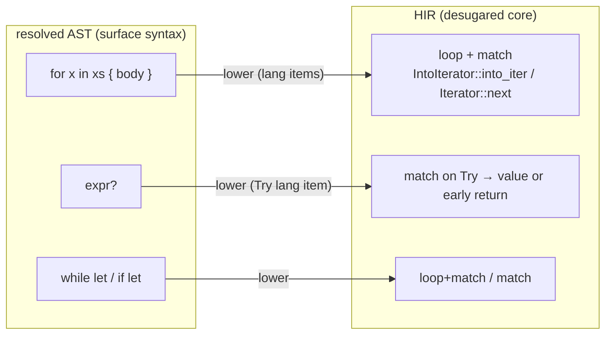
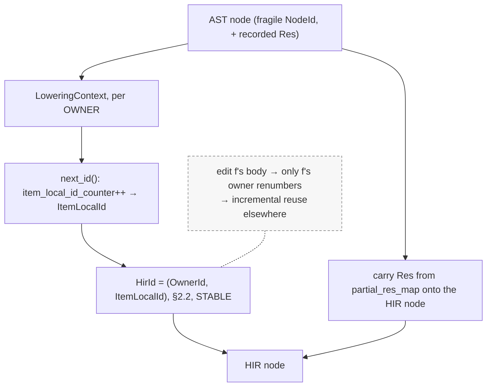
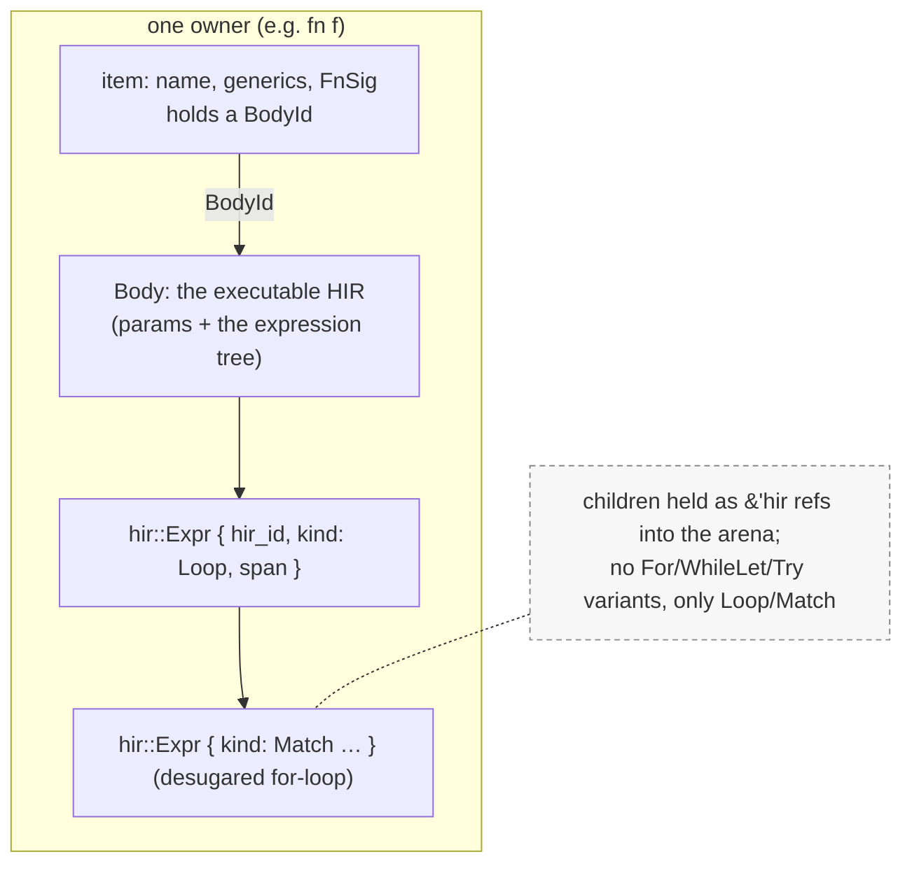
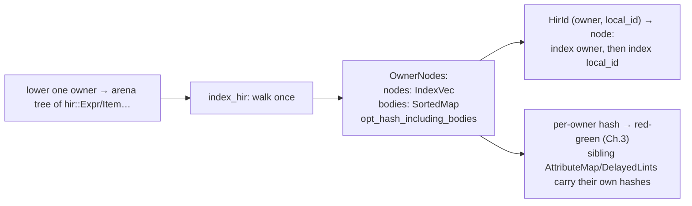
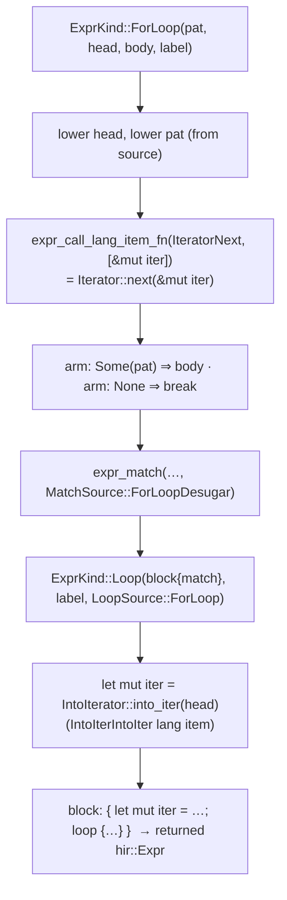
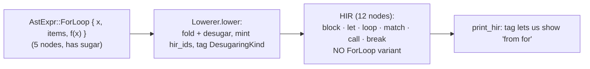

```admonish abstract title="What you'll learn"
- Why the resolved [AST](../glossary.md#ast) is the wrong shape for the middle end, and how lowering desugars it into a smaller core ([HIR](../glossary.md#hir)) so every later pass sees only `loop`/`match` instead of `for`/`while let`/`?`.
- How **lang items** (`LangItem::IteratorNext`, `LangItem::IntoIterIntoIter`) let `rustc_ast_lowering` name standard-library machinery by role instead of by path.
- Where the stable two-level [`HirId = (OwnerId, ItemLocalId)`](../glossary.md#hirid) is born: per-owner counters inside `LoweringContext`, with `ItemLocalId::ZERO` reserved for the owner itself.
- The shape of the HIR tree: [arena](../glossary.md#arena)-allocated `&'hir` children, body-separated signatures, no `For`/`WhileLet`/`Try` variants in `ExprKind` (35 variants on 1.95).
- How `index_hir` flattens each owner into `OwnerNodes` (an `IndexVec<ItemLocalId, ParentedNode>` plus an `opt_hash_including_bodies` [fingerprint](../glossary.md#fingerprint)) so a `HirId` lookup is two array indexings and incremental compilation can hash per owner.
- How `lower_expr_for` constructs the `for`-loop desugaring bottom-up and tags it with `DesugaringKind::ForLoop`, `MatchSource::ForLoopDesugar`, and `LoopSource::ForLoop` so diagnostics stay honest.
```

## 10.1 HIR: Lowering the AST to a Semantic Tree

### A tree built for reading, not for reasoning

Part 1 ended with a fully-parsed, macro-free, fully-resolved AST in which every name knows its definition. It is a faithful record of what you wrote. And that fidelity is now a liability. The AST records *syntax*, every surface form exactly as typed, and the compiler is about to start *reasoning*: inferring types, checking traits, proving borrows sound. For reasoning, faithfulness to syntax is noise. Consider how many ways Rust lets you write a loop:

```rust
for x in xs { f(x); } // a for-loop
while let Some(x) = it.next() { }  // a while-let
loop { if done { break; } } // a bare loop
```

Three syntactic forms, and the type checker should not have to care about the difference, because *semantically* there is only one looping construct underneath. If every later pass had to handle all three (and `if let`, and `?`, and `a += b`, and closures, and `async`), each would re-implement the same desugaring, inconsistently. The AST is the wrong shape for the middle end. So the compiler's first act of "understanding" is to *translate* the resolved AST into a new tree designed for analysis: the **HIR**, the **High-level Intermediate Representation**. That translation is **lowering**, and it carries one structural payload too: the stable identifiers of §2.2.

AST → **HIR** is the first rung of the IR ladder.

### The principle: desugar to a smaller core

The idea is old and load-bearing across language implementation: a source language has many convenient surface forms, but an implementation is far simpler if those forms are first **desugared** (mechanically rewritten) into a much smaller *core* language, after which every later pass targets only the core. Lisp formalized this as a handful of **special forms** to which all macros expand. Haskell's GHC lowers the entire sprawling surface language into a tiny typed intermediate called **Core**, a few constructors that the optimizer and code generator can treat uniformly. The pattern is universal: *normalize early, so everything downstream is simpler.*

Rust's HIR is exactly this move applied once to the AST. The dev-guide describes lowering plainly: because the AST and HIR are fairly similar, it is "mostly a simple procedure, much like a fold," a structure-preserving walk that copies most nodes across nearly unchanged, except at the constructs where it does real work, and there the work is **desugaring**. The HIR is not a radically different tree; it is the AST with the sugar boiled off and stable identities stamped on. A `for` loop in the AST becomes, in the HIR, the `loop`-plus-`match` it always meant. Crucially, this happens *once*, in one place, so every pass after it (type inference, [trait solving](../glossary.md#trait-solver), even the next IR ([MIR](../glossary.md#mir))) sees only the desugared forms and never re-derives them.

```admonish tip title="Pro-Tip, the HIR is what rustc_hir_analysis and typeck actually consume"
When you read that "type checking operates on the HIR," this is why it can. The type checker never sees a `for` loop or a `?`; it sees method calls and matches. That uniformity is the entire point of lowering. If you are ever surprised that a type error mentions `Iterator::next` or `Try` for code where you wrote `for` or `?`, you are seeing the HIR's desugaring leak into a diagnostic, the compiler is reasoning about the core form, not your surface syntax.
```

### What lowering desugars

The interesting cases (where lowering is more than a fold) are a catalogue of Rust's conveniences rewritten into a smaller set of primitives. The verified examples:

A **`for` loop** is desugared into an explicit `match` on an iterator, using the `IntoIterator` and `Iterator` **lang items**. Conceptually:

```rust
for x in xs { body }
// lowers to (roughly):
{
    let mut iter = IntoIterator::into_iter(xs);
    loop {
        match Iterator::next(&mut iter) {
            Some(x) => { body }
            None => break,
        }
    }
}
```

The **`?` operator** is desugared into a `match` on the `Try` lang item: pull out the `Ok`/`Some` value, or `return` the error/`None` early. **`while let`** and **`if let`** become `loop`/`match` and plain `match`. A compound assignment `a += b` is normalized; closures and `async` blocks are lowered to their HIR forms. The recurring tool is the **lang item**: a trait or type the standard library *marks* (`#[lang = "..."]`) so the compiler can refer to it by role rather than by path. Lowering a `for` loop must name *the* `Iterator::next`, and lang items are how the compiler knows which method that is without hard-coding a path.




```admonish warning title="Warning, desugaring is semantics-preserving, but error spans must not lie"
Lowering rewrites your code into different code, which raises a danger: if a borrow error in a desugared `for` loop pointed at `Iterator::next` instead of your loop, the message would be useless. The compiler guards against this carefully. The dev-guide is explicit that, unlike [macro expansion](../glossary.md#macro-expansion), lowering does *not* record its process in [spans](../glossary.md#span), and that "tools are likely to get confused if the spans from leaf AST nodes occur in multiple places in the HIR." Desugared nodes are tagged with a `DesugaringKind` (e.g. "this came from a `for`-loop desugaring") on their spans, so diagnostics can say "in this `?` expression" or "in this `for` loop" even though the underlying HIR is a `match`. The rule for anyone working on lowering: preserve spans honestly, and mark synthetic nodes as desugared, so the surface syntax can always be reconstructed for the user.
```

### The structural payoff: stable `HirId`s

Desugaring is the *visible* job of lowering. The *structural* job, and the one that connects to Part 0, is identity. Recall §7.1: the parser stamped every AST node with a `NodeId`, an absolute per-crate sequential number, deliberately *fragile* (insert a node and everything after it renumbers). That was fine for the front end's one-shot passes. But the middle end is where **incremental compilation** must work: re-typecheck only what changed. A fragile, renumbering identity would defeat that: change one function and every `NodeId` in the file shifts, invalidating everything.

So lowering assigns the `HirId` of §2.2: the *stable, two-level* identity. The verified mechanism: lowering proceeds **per owner** (an "owner" being an item-like definition, a function, an `impl`, a `const`), and within each owner a counter (`item_local_id_counter`) hands out `ItemLocalId`s starting at 1 (the owner itself takes `ItemLocalId::ZERO`), via `next_id()`/`lower_node_id`. A `HirId` is therefore `(owner, local_id)`, *which definition* plus *which node inside it*. This is exactly the §2.2 design, and now we see *where it is born*: at lowering, node by node. Its stability is structural: editing the body of function `f` renumbers only the local ids *within* `f`'s owner; every other owner's ids are untouched, so incremental recompilation can reuse them. The fragile `NodeId` of the AST is, at lowering, exchanged for the durable `HirId` of the middle end.

What carries *across* the exchange is resolution. The `Res` that name resolution computed for each path (§9.3) is threaded into the HIR, lowering reads the `partial_res_map` and attaches each path's resolution to its HIR node, so the HIR arrives already knowing what every name means. Lowering does not re-resolve; it *transcribes* resolution onto the new tree.




### Lowering is a query

One last connection to Part 0. Lowering is not a free-standing phase you call once and forget; it is exposed as a [**query**](../glossary.md#query). The lowering entry point is exposed as the `tcx.hir_crate(())` query (registered to `rustc_ast_lowering::lower_to_hir`), which means the demand-driven machinery of Chapter 3 governs it. The HIR is produced when something asks for it and is then cached in the [`TyCtxt`](../glossary.md#tyctxt-tcx); downstream queries (type-checking a particular item, say) request the HIR for just the owners they need. The IR ladder and the query system are not separate ideas: each rung of the ladder is *built by a query and consumed by queries*, which is how incremental compilation threads through the whole architecture. Lowering being a `tcx` query is the first place in the middle end where that unification becomes concrete.

### Where this leaves us

Lowering is the front end handing off to the middle end. The resolved AST, faithful to syntax, is the wrong shape for semantic reasoning, so the compiler *desugars* it into the **HIR**, a smaller core in which the three loop forms become one `loop`+`match`, `?` becomes a `Try` match, `if let`/`while let` and compound assignments and closures are all normalized, using **lang items** to name the standard-library machinery the desugarings target. This is the universal "normalize early" move (Lisp special forms, GHC Core), done once so every later pass sees only the core. Mechanically it is "mostly a fold" that copies the tree across while doing real work at the sugar; it tags synthetic nodes with `DesugaringKind` so diagnostics never lie about your syntax; it exchanges the AST's fragile `NodeId` for the stable two-level `HirId` of §2.2, born here in per-owner counters so that incremental recompilation works; it transcribes the `Res` from name resolution onto the new tree; and it runs as a `TyCtxt` query, uniting the IR ladder with Part 0's demand-driven system.

§10.2 takes the architecture deep-dive: the `LoweringContext` and how it walks owner by owner, the actual shape of the HIR data types (`hir::Expr`, `hir::Item`, `Body`, `OwnerNode`, the arena they live in), the `HirId`/`OwnerId` indexing and the `index_hir` step that builds the owner's node map, and how the HIR is stored in and retrieved from the `TyCtxt`. Then §10.3 reads the real lowering of a `for` loop into its `loop`+`match`, and §10.4 has you build a small desugaring lowerer that turns surface forms into a core tree.

## 10.2 The Architecture: the `LoweringContext`, the HIR Tree, and Owner Indexing

### The machine that folds and desugars

Lowering folds, desugars at the sugar, and stamps stable `HirId`s as it goes (§10.1). The machine that performs all three is the `LoweringContext`, a large struct with around 30 fields that carries the state of a single owner's lowering. Most of its fields fall into four jobs, and reading them is the fastest way to understand what lowering actually tracks:

```rust
// compiler/rustc_ast_lowering/src/lib.rs  (faithful; representative fields)
// One representative field per group; see the source for the full set.
struct LoweringContext<'a, 'hir> {
    // ── inputs: query context + resolver's results ──
    tcx: TyCtxt<'hir>, // ① lowering is a query (§10.1)
    // ── outputs: where HIR nodes go ──
    arena: &'hir hir::Arena<'hir>, // ② HIR nodes are arena-allocated (§4.1)
    // ── identity: per-owner HirId machinery (§2.2) ──
    current_hir_id_owner: hir::OwnerId, // ③ which owner we are lowering right now
    // ── desugaring context: state the rewrites need ──
    // ④ enclosing loop, for `break`/`continue`
    loop_scope: Option<HirId>,
    // … resolver, bodies, item_local_id_counter, ident_and_label_to_local_id,
    //   coroutine_kind, task_context, attrs, trait_map, … (see source)
}
```

The four groupings tell the story. `tcx` and `resolver` are the inputs: the query context and Chapter 9's resolution tables. `arena` and `bodies` are the outputs: where the new HIR nodes are allocated and collected. `current_hir_id_owner`, `item_local_id_counter`, and `ident_and_label_to_local_id` are the §2.2 identity machinery: the counter that mints `ItemLocalId`s within the current owner (§10.1), plus the map (`ident_and_label_to_local_id` in release builds; a sibling `node_id_to_local_id` exists only under `cfg(debug_assertions)`) remembering which AST `NodeId` became which `ItemLocalId`, so that resolutions and cross-references can be translated. And the desugaring fields (`loop_scope`, `coroutine_kind`, `task_context`) are *context the rewrites need*: lowering a `break` requires knowing the enclosing `loop_scope`; lowering `.await` requires knowing the `task_context`. These fields exist precisely because the desugarings of §10.1 are not purely local: a `for` loop's `break` must point at the right `loop`, and that requires carrying the loop scope down the walk.

```admonish tip title="Pro-Tip, current_hir_id_owner is the invariant of lowering"
Almost every subtle bug in lowering is an owner mistake. A `HirId` is meaningful only relative to its owner, so a node lowered while `current_hir_id_owner` points at the wrong owner gets a `HirId` that indexes into the wrong node map, a silent corruption that surfaces much later as a confusing panic. This is why the context offers `with_hir_id_owner`-style helpers that *save, switch, and restore* the owner around lowering a nested item. When you read lowering code, the question "what owner are we in right now?" is the one to keep answering; it is the spine of the whole pass.
```

### The HIR tree: arena-allocated, body-separated

The output of lowering is the HIR proper, defined in `rustc_hir`. Two design choices distinguish it from the AST.

First, **arena allocation with shared references.** Where the AST owns its children through `Box<T>` (§7.1), the HIR holds them as `&'hir` references into an arena (§4.1's arena pattern). The verified `hir::Expr` and a slice of its kind:

```rust
// compiler/rustc_hir/src/hir.rs  (faithful; representative variants)
pub struct Expr<'hir> {
    pub hir_id: HirId, // ① stable (owner, local_id) identity (§2.2/§10.1)
    pub kind: ExprKind<'hir>, // ② the variety
    pub span: Span, // ③ source location, DesugaringKind-tagged if synthetic
}

pub enum ExprKind<'hir> {
    // children held as &'hir, not Box<>
    Call(&'hir Expr<'hir>, &'hir [Expr<'hir>]),
    MethodCall(/* path segment, receiver, args, span */), // (faithful, abridged)
    // for/while-let/? lower to this
    Match(/* scrutinee, arms, MatchSource */),
    Loop(/* block, label, LoopSource, span */), // the desugared loop
    // … Binary, Unary, Lit, Path, Block, … (see source; a few dozen variants);
    //   note the absence of For/WhileLet/Try (§10.1) …
}
```

The `'hir` lifetime everywhere is the arena's lifetime: every HIR node lives as long as the arena, which lives as long as the lowering output is needed, so the tree is a web of cheap `Copy` references rather than a tree of owning boxes. And notice the *absence* in `ExprKind`: in practice it has no `For`, no `WhileLet`, no `Try` variant. They are replaced by `Match` and `Loop`, the desugaring of §10.1, visible as missing enum variants. The HIR's `ExprKind` is the smaller core language, and you can read that contraction directly in the enum.

Second, **bodies are separated from signatures.** A function's *signature* (its name, generics, parameter and return types) and its *body* (the executable code) are stored apart. A `Body`, described in the dev-guide as "some kind of executable code, such as the body of a function/closure or the definition of a constant," is referenced by a `BodyId`, and an item holds the `BodyId`, not the body inline. This separation is not cosmetic: it is what lets a query type-check a function's *signature* without forcing its *body* to be lowered or analyzed, and vice versa, the demand-driven granularity of Chapter 3 reaching down into the HIR's very shape. You can ask "what is `f`'s type?" and touch only the signature; you ask for the body only when you actually check or codegen it.




### `index_hir`: turning a tree into an indexable owner

Lowering an owner produces a tree of arena-allocated nodes, but a tree is awkward to *query*: "give me the node with this `HirId`" should be a lookup, not a search. So after an owner is lowered, an indexing pass, `index_hir`, walks it once and flattens it into a node map. The result is `OwnerNodes`, verified:

`index_hir` produces an `OwnerNodes` carrying an `IndexVec<ItemLocalId, ParentedNode>` of every node in the owner, the owner's bodies, and a single pre-computed fingerprint covering the full HIR.

Three consequences follow from this layout. The `nodes` field is an `IndexVec` keyed by `ItemLocalId`: so a `HirId = (owner, local_id)` resolves to a node by *two array indexings*: pick the owner, index by local id. That is why `HirId` is a two-level id (§2.2): the structure it indexes is literally two levels. Each entry is a `ParentedNode`, the node *plus its parent's local id*, which is how `tcx.parent_hir_node(n)` walks upward without a separate parent map. And `opt_hash_including_bodies` is a **pre-computed hash** of the owner's HIR covering nodes and bodies together: this is incremental compilation's fingerprint (Chapter 3's [red-green](../glossary.md#red-green-algorithm)) computed *per owner*. The sibling `AttributeMap` and `DelayedLints` structures carry their own per-owner hashes alongside `OwnerNodes` inside `OwnerInfo`, so attribute and [lint](../glossary.md#lint) changes can be tracked separately from HIR changes.




### Reaching the HIR from `TyCtxt`

Because lowering is a query (§10.1) and its output is indexed per owner, the rest of the compiler reaches the HIR through `TyCtxt` accessors rather than holding the tree directly. The dev-guide names the everyday ones: `tcx.hir_node(hir_id)` returns the `Node` at a `HirId`; `tcx.hir_expect_expr(hir_id)` extracts an `&hir::Expr` (panicking if it is not an expression); `tcx.parent_hir_node(n)` climbs to the parent via the `ParentedNode` linkage. Under the hood these consult the per-owner `OwnerNodes` for the relevant owner, which the query system produces and caches on demand. So "walking the HIR" is really "asking `tcx` for owners and indexing into them," and an analysis that only touches a few owners only forces *those* owners to be lowered. The HIR is not one monolithic tree the compiler holds; it is a collection of independently-produced, independently-hashed, independently-cached per-owner trees, reached through the query context.

```admonish warning title="Warning, the HIR is immutable; analysis results live in side tables"
A natural instinct is to imagine type checking *annotates* the HIR with types. It does not. The HIR is built once by lowering and never mutated. The results of analysis (the type of each expression, the resolved method for each `MethodCall`, and so on) are stored in *separate* tables keyed by `HirId`, most importantly `TypeckResults`, which Chapter 11 will produce, mapping each expression's `HirId` to its inferred type. This separation is deliberate: it keeps the HIR a stable, hashable, cacheable input, while the (much more volatile) analysis outputs live in their own query results. When you want "the type of this HIR expression," you do not look on the `Expr`; you look it up in `TypeckResults` by its `HirId`. Keep the tree and its annotations distinct.
```

### Where this leaves us

The architecture of lowering is now in hand. The `LoweringContext` carries one owner's lowering: `tcx` and `resolver` as inputs, an `arena` and a `bodies` list as outputs, the `current_hir_id_owner`/`item_local_id_counter`/`ident_and_label_to_local_id` machinery that mints and tracks the §2.2 `HirId`s, and desugaring-context fields like `loop_scope` and `task_context` that the non-local rewrites of §10.1 require. The **HIR tree** it produces is arena-allocated (children as `&'hir` references, not boxes), has had the sugar removed (no `For`/`WhileLet`/`Try` in `ExprKind`; sugar lowers to `Loop`/`Match`), and separates **bodies** from signatures so queries can touch one without the other. The `index_hir` pass flattens each owner into `OwnerNodes`, an `IndexVec<ItemLocalId, ParentedNode>` that makes the two-level `HirId` a two-step lookup, plus a per-owner `opt_hash_including_bodies` fingerprint for incremental compilation (with sibling `AttributeMap`/`DelayedLints` carrying their own hashes). And the whole thing is reached through `TyCtxt` accessors (`hir_node`, `parent_hir_node`), so the HIR is a collection of per-owner trees produced and cached on demand, the IR ladder fused with the query system. Analysis never mutates this tree; its results live in `HirId`-keyed side tables like `TypeckResults`.

§10.3 reads the real lowering of a `for` loop: `LoweringContext::lower_expr` reaching the `for`-loop case, building the `IntoIterator::into_iter` call and the `loop { match Iterator::next(...) { ... } }` with fresh `HirId`s and a `DesugaringKind::ForLoop` span, so you can watch §10.1's desugaring happen line by line. Then §10.4 has you build a small lowerer that desugars surface forms into a core tree and assigns owner-local ids.

## 10.3 Reading the Source: Lowering a `for` Loop into `loop` + `match`

### Watching sugar dissolve

A `for` loop *becomes* a `loop` + `match`; the HIR's `ExprKind` proves it in the negative, with no `ForLoop` variant (§10.1, §10.2). The code that performs the rewrite lives in `rustc_ast_lowering/src/expr.rs`. It is a compact desugaring that touches every theme of the chapter: lang items, fresh `HirId`s, arena allocation, and honest spans. By the end you will have watched one surface form dissolve into core, node by node.

### The dispatch, and the target

Expression lowering is a giant `match` on the AST's `ExprKind`, `LoweringContext::lower_expr`. Most arms are the boring "fold" of §10.1: copy the node, lower the children, mint a `HirId`. The `for`-loop arm is one of the interesting ones; it dispatches to a dedicated method. The AST node it receives is, verified:

```rust
// rustc_ast, the surface form  (faithful; field names verified)
ExprKind::ForLoop { pat, iter, body, label, kind /* for / for await */ }
//  for pat in iter { body } (optionally  'label: for …)
```

And the HIR it must produce is the desugaring every Rust programmer has seen in the docs, verified against the standard reference shape:

```rust
// what `for pat in head { body }` lowers to (conceptually):
{
    let mut iter = IntoIterator::into_iter(head);
    loop {
        match Iterator::next(&mut iter) {
            Some(pat) => { body }
            None      => break,
        }
    }
}
```

Everything in the walkthrough is the compiler *constructing this tree* out of HIR nodes, and it builds it bottom-up, because each node needs its children before it can be allocated.

### Building it bottom-up

The lowering reads, in faithful outline:

```rust
// compiler/rustc_ast_lowering/src/expr.rs  (faithful, abridged)
fn lower_expr_for(
    &mut self,
    e: &Expr, pat: &Pat, head: &Expr, body: &Block,
    opt_label: Option<Label>,
    loop_kind: ForLoopKind, // `for` vs `for await`
) -> hir::Expr<'hir> {
    // ① span tagged as for-loop desugaring, so diagnostics stay honest (§10.1)
    let for_span = self.mark_span_with_reason(
        DesugaringKind::ForLoop, self.lower_span(e.span), None,
    );
    // ② source pieces lowered first
    let head = self.lower_expr_mut(head);
    let pat  = self.lower_pat(pat);
    // ③ Iterator::next(&mut iter), named by lang item IteratorNext
    let next_expr = self.expr_call_lang_item_fn(
        head_span, hir::LangItem::IteratorNext, /* args */,
    );
    // ④ inner match { None => break, Some(pat) => body }
    //   tagged MatchSource::ForLoopDesugar
    let match_expr = self.expr_match(
        head_span, next_expr, /* arms */, hir::MatchSource::ForLoopDesugar,
    );
    // ⑤ inner loop { <match> }, tagged LoopSource::ForLoop
    let loop_expr = hir::ExprKind::Loop(
        loop_block, label, hir::LoopSource::ForLoop, /* span */,
    );
    // ⑥ outer match: IntoIterator::into_iter(head) { mut iter => <loop> }
    //   (NESTED match, not `let mut iter = ...`, so temporaries from `head`
    //   drop after the loop, not before; see Rust issue #21984)
    // ⑦ wrap in `expr_drop_temps` so the iterator is dropped correctly, return
    // … (see source for the full body)
}
```

Read it as the tree being assembled from the leaves up. The deepest pieces, the lowered `head` and `pat`, which are the only parts that come from *your* source, are lowered first. Then the `Iterator::next(&mut iter)` call is built around `iter`; then the two `match` arms (`Some(pat) => body`, `None => break`); then the `match` wrapping the `next` call; then the `loop` wrapping the `match`; and finally the outer block that binds `iter` to `IntoIterator::into_iter(head)` and runs the loop. Each `expr_`*/`arm`/`block_expr` helper allocates its node in the arena (`self.arena.alloc`, the §10.2 storage) and mints a fresh `HirId` from the owner's counter (the §10.1/§10.2 `next_id`). The synthetic `iter` binding, the `Some`/`None` patterns, the `break`, none existed in your source; lowering *invents* them, each as a real HIR node with its own stable id.

### Lang items: naming `next` without a path

Steps ③ and ⑥ hide a subtlety worth surfacing. The desugaring needs to call *the* `IntoIterator::into_iter` and *the* `Iterator::next`, but lowering happens before type checking, and it cannot simply write a path like `std::iter::Iterator::next`, because the user might not have `std` in scope, might have shadowed those names, or might be compiling `core` itself. The escape hatch is the **lang item**: `IntoIterator` and `Iterator` are marked in the standard library with `#[lang = "..."]`, and `expr_call_lang_item_fn` looks them up *by role* (`hir::LangItem::IteratorNext`, `hir::LangItem::IntoIterIntoIter`) rather than by name. This is the §10.1 lang-item mechanism in action: the compiler refers to the iterator machinery by what it *is*, not by where it sits, so desugaring is immune to scope, shadowing, and which crate is being built.




### The tags that keep diagnostics honest

Notice three labels threaded through the construction: `DesugaringKind::ForLoop` on the span (step ①), `MatchSource::ForLoopDesugar` on the `match` (step ④), and `LoopSource::ForLoop` on the `loop` (step ⑤). These are the §10.1 "honest spans" Warning made concrete. The synthesized `match` and `loop` did not exist in your source, so if a later pass (exhaustiveness checking, say, or a borrow error) needs to talk about them, it must *not* say "non-exhaustive match" or "this `loop`," which would baffle a programmer who wrote `for`. The `MatchSource::ForLoopDesugar` tag tells the match-checking code "this match came from a `for` loop; suppress the normal match diagnostics," and the `DesugaringKind::ForLoop` span lets any error point at *the `for` loop* and say "in this `for` loop." The desugaring rewrites the structure but leaves a paper trail so the surface syntax can always be reconstructed for the human.

```admonish tip title="Pro-Tip, MatchSource is why you never get non-exhaustive match diagnostics for a for loop"
The `match` that lowering builds for a `for` loop is, structurally, a perfectly ordinary `match` with `Some` and `None` arms, and exhaustiveness checking (Chapter 13) runs on it like any other. The only reason you do not see iterator-internals diagnostics is the `MatchSource::ForLoopDesugar` tag, which downstream code checks to switch off or rephrase its messages. If you are ever hacking on match diagnostics and a `for` loop starts emitting a raw "match" error, a missing `MatchSource` check is the cause. The tag is the seam between the desugared reality and the surface story, and a lot of diagnostic quality lives on that seam.
```

### Where `break` goes: the loop scope

One last wire. The `break` in the `None` arm, and any `break`/`continue` the user wrote inside `body`, must target *this* synthesized `loop`. This is where the `loop_scope` field of the `LoweringContext` (§10.2) earns its place: before lowering `body`, the context records the new loop as the current `loop_scope`, so that lowering a `break` inside the body resolves its jump destination to this loop (via `lower_jump_destination`, which consults `is_in_loop_condition` and the label). The desugaring's own `None => break` and the user's `break`s all converge on the same loop target. This is precisely why §10.2 stressed that desugaring context must be carried down the walk: a `for` loop's correctness depends on `break` finding the loop that the desugaring invented, and `loop_scope` is the thread that connects them.

### How this builds, and what is next

We have read the canonical desugaring whole. `lower_expr` dispatches the `for`-loop arm to a method that constructs, bottom-up, the tree `{ let mut iter = IntoIterator::into_iter(head); loop { match Iterator::next(&mut iter) { Some(pat) => body, None => break } } }`, lowering the source `head` and `pat` first, then wrapping them in synthesized `next` call, `match`, `loop`, and binding, each node arena-allocated with a fresh owner-local `HirId`. The iterator methods are named by **lang item**, not path, so the rewrite is immune to scope and shadowing and works even when compiling `core`. The synthetic nodes are tagged (`DesugaringKind::ForLoop`, `MatchSource::ForLoopDesugar`, `LoopSource::ForLoop`) so diagnostics speak in terms of your `for` loop, never the iterator machinery beneath it. And the synthesized `loop` is registered as the `loop_scope` so every `break` inside, invented or written, finds it. The result is pure core HIR: a `Loop` and a `Match`, with no `ForLoop` anywhere.

§10.4 turns this into a build. You will write a small lowerer that takes a tiny surface AST (with a `for`-like form and a `while`) and desugars it into a core tree with only `loop`, `match`, `if`, and `let`, minting owner-local ids as it goes and tagging the root of each desugaring so a pretty-printer can still show the original form. You will reproduce, in miniature, the `for` → `loop` + `match` rewrite you just read, plus a sibling `while` → `loop` + `if` desugaring, and watch surface forms become core.

## 10.4 Hands-On Lab: Build a Desugaring Lowerer

### Boiling off the sugar

This lab builds the pass you just read: a **lowerer** that takes a small surface AST (with sugar like `for` and `while`) and rewrites it into HIR with only a handful of primitive forms. You will reproduce two sibling desugarings (`for` → `loop` + `match`, the canonical one from §10.3, and `while` → `loop { if cond { body } else { break } }`, the one rustc's `lower_expr_while_in_loop_scope` builds), mint a fresh **owner-local `HirId`** for every node, and, the detail that keeps the compiler honest, tag the *root* of each synthesized subtree with a `DesugaringKind` so a pretty-printer can still show the surface form it came from. The lowerer turns a five-node `for` loop into a twelve-node HIR that prints back as `for`.

`cargo new`, pure `std`.

### Two trees: surface and core

The whole point of lowering is that the *output* language is smaller than the *input*. So we define two AST types. The **surface** AST has the sugar; the **core** AST does not:

```rust
// src/main.rs
//
// Lab modeled on:
//   compiler/rustc_ast/src/ast.rs (the source AST: ast::Expr / ast::ExprKind)
//   compiler/rustc_hir/src/hir.rs (the target IR:  hir::Expr / hir::ExprKind)
//   compiler/rustc_ast_lowering/src/expr.rs  (the lowering loop: LoweringContext::lower_expr)
//   compiler/rustc_span/src/hygiene.rs::DesugaringKind
// Real rustc threads 'tcx arenas, a HirId(owner, ItemLocalId) pair, and full ExprKind
// variants (Path, Closure, Async, ...). We use a u32 id and a small subset to stay std-only.

// AstExpr: what the parser produced; still has sugar (ForLoop, While).
enum AstExpr {
    Lit(i64),
    // bare identifier reference
    Path(String),
    Call(String, Vec<AstExpr>), // f(args)
    Block(Vec<AstExpr>),
    // for pat in iter { body }
    ForLoop { pat: String, iter: Box<AstExpr>, body: Box<AstExpr> },
    // while cond { body }
    While { cond: Box<AstExpr>, body: Box<AstExpr> },
}

// HirExprKind: the lowered IR. No ForLoop, no While; one variant per primitive form.
#[derive(Debug)]
enum HirExprKind {
    Lit(i64),
    Path(String),
    Call(String, Vec<HirExpr>),
    Block(Vec<HirExpr>),
    Let { name: String, init: Box<HirExpr> },
    Loop(Box<HirExpr>), // loop { body }
    Match { scrutinee: Box<HirExpr>, arms: Vec<(Pat, HirExpr)> },
    // if cond { then } else { else_ }
    If { cond: Box<HirExpr>, then: Box<HirExpr>, else_: Box<HirExpr> },
    Break,
}

#[derive(Debug)]
enum Pat { Variant(String, String), Wild } // V(x) | _

// Every HIR node carries a stable owner-local id (our HirId) and a desugaring tag
// recording which surface form it came from (§10.2/§10.3).
#[derive(Debug)]
struct HirExpr { hir_id: u32, kind: HirExprKind, desugar: DesugaringKind }

#[derive(Debug, Clone, Copy, PartialEq)]
// mirrors rustc's hygiene::DesugaringKind (real rustc has 10 variants at 1.95; no IfLet)
enum DesugaringKind { None, ForLoop, WhileLoop }
```

The shape mirrors rustc's `hir::ExprKind`: no `ForLoop`, no `While` (both will become `Loop`/`Match`/`If`); every `HirExpr` carries a `hir_id` and a `desugar` tag, the two pieces of bookkeeping that make incremental compilation (§10.2) and honest diagnostic spans (§10.3) work. The two desugarings we will build are siblings in the loop family: `for` becomes `loop` + `match`, `while` becomes `loop` + `if`. Real rustc's `DesugaringKind` at 1.95 has ten variants (`QuestionMark`, `TryBlock`, `ForLoop`, `WhileLoop`, `Async`, `Await`, …) and notably no `IfLet`, because `if let` at 1.95 is no longer lowered to `match`; it stays as `ExprKind::If(Let(LetExpr { pat, init, .. }), then, else)` carrying a dedicated `LetExpr` node. We pick `while` as our second desugaring precisely because it mirrors the real `lower_expr_while_in_loop_scope` and stays in the loop family with `for`.

### The lowerer: a per-owner id counter and the rewrites

The `Lowerer` holds the owner-local id counter (§10.2's `item_local_id_counter`) and mints a fresh id for every node it builds:

```rust
struct Lowerer { next_id: u32 }

impl Lowerer {
    // 0 is reserved for the owner itself (ItemLocalId::ZERO in real rustc).
    fn new() -> Lowerer { Lowerer { next_id: 1 } }

    /// Mint a fresh owner-local HirId (§10.1/§10.2 item_local_id_counter) and wrap a kind.
    /// Leaves `desugar = None`; tagging is a separate step (`with_desugar`), because
    /// in real rustc the desugaring tag lives on the *span* and is applied once at
    /// the root of a desugaring via `mark_span_with_reason`, not on every node.
    fn mk_node(&mut self, kind: HirExprKind) -> HirExpr {
        let hir_id = self.next_id; self.next_id += 1;
        HirExpr { hir_id, kind, desugar: DesugaringKind::None }
    }

    /// Tag a node as the root of a desugaring (mirrors rustc's `mark_span_with_reason`,
    /// applied once at the outer node; inner synthetic nodes inherit context from it).
    fn with_desugar(mut node: HirExpr, kind: DesugaringKind) -> HirExpr {
        node.desugar = kind; node
    }

    fn lower(&mut self, expr: &AstExpr) -> HirExpr {
        match expr {
            // The fold: copy across, lower children, mint an id.
            AstExpr::Lit(n) => self.mk_node(HirExprKind::Lit(*n)),
            AstExpr::Path(name) => self.mk_node(HirExprKind::Path(name.clone())),
            AstExpr::Call(f, args) => {
                let args = args.iter().map(|a| self.lower(a)).collect();
                self.mk_node(HirExprKind::Call(f.clone(), args))
            }
            AstExpr::Block(stmts) => {
                let stmts = stmts.iter().map(|s| self.lower(s)).collect();
                self.mk_node(HirExprKind::Block(stmts))
            }

            // DESUGAR 1: for pat in iter { body }  →  §10.3's loop + match
            AstExpr::ForLoop { pat, iter, body } => self.lower_for(pat, iter, body),

            // DESUGAR 2: while cond { body }  →  loop { if cond { body } else { break } }
            AstExpr::While { cond, body } => self.lower_while(cond, body),
        }
    }

    /// for pat in iter { body }  ⟶
    ///   { let iter0 = into_iter(iter);
    ///     loop { match next(iter0) { Some(pat) => body, None => break } } }
    ///
    /// Only the outermost block is tagged `DesugaringKind::ForLoop`; inner synthetic
    /// nodes are left untagged, mirroring rustc's per-root span-tagging.
    fn lower_for(&mut self, pat: &str, iter: &AstExpr, body: &AstExpr) -> HirExpr {
        let iter_lowered = self.lower(iter);
        let body_lowered = self.lower(body);

        // let iter0 = into_iter(iter); (into_iter named "by role," a lang item, §10.3)
        let into_iter = self.mk_node(HirExprKind::Call("into_iter".into(), vec![iter_lowered]));
        let let_iter  = self.mk_node(HirExprKind::Let { name: "iter0".into(), init: Box::new(into_iter) });

        // match next(iter0) { Some(pat) => body, None => break }
        let iter_path  = self.mk_node(HirExprKind::Path("iter0".into()));
        let next_call  = self.mk_node(HirExprKind::Call("next".into(), vec![iter_path]));
        let break_node = self.mk_node(HirExprKind::Break);
        let match_node = self.mk_node(HirExprKind::Match {
            scrutinee: Box::new(next_call),
            arms: vec![
                // Some(pat) => body
                (Pat::Variant("Some".into(), pat.into()), body_lowered),
                // None/_ => break
                (Pat::Wild, break_node),
            ],
        });

        // loop { <match> }
        let loop_node = self.mk_node(HirExprKind::Loop(Box::new(match_node)));

        // { let iter0 = …; loop {…} }  ← only this outer node carries the desugar tag
        let block = self.mk_node(HirExprKind::Block(vec![let_iter, loop_node]));
        Self::with_desugar(block, DesugaringKind::ForLoop)
    }

    /// while cond { body }  ⟶  loop { if cond { body } else { break } }
    ///
    /// Mirrors rustc's `lower_expr_while_in_loop_scope`, tagged `DesugaringKind::WhileLoop`.
    /// As with `lower_for`, only the outer `loop` carries the tag.
    fn lower_while(&mut self, cond: &AstExpr, body: &AstExpr) -> HirExpr {
        let cond_hir = self.lower(cond);
        let body_hir = self.lower(body);

        // else branch: break
        let break_node = self.mk_node(HirExprKind::Break);

        // if cond { body } else { break }
        let if_node = self.mk_node(HirExprKind::If {
            cond: Box::new(cond_hir),
            then: Box::new(body_hir),
            else_: Box::new(break_node),
        });

        // loop { <if> }  ← only this outer node carries the desugar tag
        let loop_node = self.mk_node(HirExprKind::Loop(Box::new(if_node)));
        Self::with_desugar(loop_node, DesugaringKind::WhileLoop)
    }
}
```

*Why split `mk` into `mk_node` + `with_desugar`.* Real rustc keeps id-minting (`next_id`) and desugar-tagging (`mark_span_with_reason`) as two separate concerns. The tag lives on the *span*, not on the node, and is applied once at the outer root of a desugaring; inner synthetic nodes inherit that context. The lab follows the same shape: `mk_node` mints an id and leaves `desugar = None`, then `with_desugar` flips the outer root's tag. Blanket-tagging every synthetic node (which an earlier draft did) teaches a more aggressive rule than the compiler actually applies.

*Real rustc divergence on `lower_for`.* Our `lower_for` uses the textbook `let mut iter = into_iter(head); loop { … }` shape; real rustc's `lower_expr_for` instead builds the nested `match into_iter(head) { mut iter => loop { … } }` wrapped in `expr_drop_temps` (§10.3) so the head's temporaries drop after the loop, not before (Rust issue #21984). The lab keeps the simpler shape on purpose; if you walked through §10.3 first, treat this as where the teaching beat diverges from the source.

### A pretty-printer that reconstructs the surface form

This is the §10.3 "honest spans" idea, made tangible: because the root of each synthesized subtree is tagged with the `DesugaringKind` it came from, the printer can show the *original* `for`/`while` even though the underlying tree is `loop`/`match`/`if`. It prints the HIR by default, but when it meets a node tagged `ForLoop` or `WhileLoop` at the *root* of a desugaring, it prints the surface form instead, exactly how a diagnostic says "in this `for` loop" rather than "in this match":

```rust
fn print_hir(node: &HirExpr, indent: usize) {
    let pad = "  ".repeat(indent);
    // The honest-span trick: a node tagged at the *root* of a desugaring shows
    // the SURFACE form it came from, even though the underlying tree is core.
    let tag = match node.desugar {
        DesugaringKind::ForLoop => " (from `for`)",
        DesugaringKind::WhileLoop => " (from `while`)",
        DesugaringKind::None => "",
    };
    match &node.kind {
        HirExprKind::Lit(n) => println!("{pad}Lit({n})  [#{}]", node.hir_id),
        HirExprKind::Path(v) => println!("{pad}Path({v})  [#{}]", node.hir_id),
        HirExprKind::Break => println!("{pad}break  [#{}]", node.hir_id),
        HirExprKind::Let { name, init } => { println!("{pad}let {name} =  [#{}]", node.hir_id); print_hir(init, indent+1); }
        HirExprKind::Loop(b)  => { println!("{pad}loop{tag}  [#{}]", node.hir_id); print_hir(b, indent+1); }
        HirExprKind::If { cond, then, else_ } => {
            println!("{pad}if  [#{}]", node.hir_id);
            print_hir(cond, indent+1);
            println!("{pad}  then =>"); print_hir(then, indent+2);
            println!("{pad}  else =>"); print_hir(else_, indent+2);
        }
        HirExprKind::Call(f, args) => {
            println!("{pad}{f}(…)  [#{}]", node.hir_id);
            for a in args { print_hir(a, indent+1); }
        }
        HirExprKind::Block(stmts) => { println!("{pad}{{ }}{tag}  [#{}]", node.hir_id); for s in stmts { print_hir(s, indent+1); } }
        HirExprKind::Match { scrutinee, arms } => {
            println!("{pad}match  [#{}]", node.hir_id);
            print_hir(scrutinee, indent+1);
            for (p, body) in arms { println!("{pad}  {p:?} =>"); print_hir(body, indent+2); }
        }
    }
}
```

### Running it

```rust
fn main() {
    // for x in items { f(x) }
    let surface = AstExpr::ForLoop {
        pat: "x".into(),
        iter: Box::new(AstExpr::Path("items".into())),
        body: Box::new(AstExpr::Block(vec![
            AstExpr::Call("f".into(), vec![AstExpr::Path("x".into())]),
        ])),
    };

    let mut lo = Lowerer::new();
    let hir = lo.lower(&surface);

    println!("surface: for x in items {{ f(x) }}");
    // ids start at 1 (0 is reserved for the owner itself, §10.2)
    println!("lowered to HIR ({} nodes, ids #1..#{}):\n", lo.next_id - 1, lo.next_id - 1);
    print_hir(&hir, 0);
}
```

````admonish example title="Expected output" collapsible=true
Output (ids will depend on construction order):

```text
surface: for x in items { f(x) }
lowered to HIR (12 nodes, ids #1..#12):

{ } (from `for`)  [#12]
  let iter0 =  [#6]
    into_iter(…)  [#5]
      Path(items)  [#1]
  loop  [#11]
    match  [#10]
      next(…)  [#8]
        Path(iter0)  [#7]
      Variant("Some", "x") =>
        { }  [#4]
          f(…)  [#3]
            Path(x)  [#2]
      Wild =>
        break  [#9]
```
````

The five-node `for` loop has become a twelve-node HIR of `block`/`let`/`loop`/`match`/`call`/`break`, with no `ForLoop` variant, yet the outer block still announces it came from a `for` loop. Only the root of the desugaring carries the tag, exactly as real rustc applies `mark_span_with_reason` once at the outer span; the synthetic `match`, `loop`, `let`, and `break` inside it are untagged and inherit context from the root. Every node carries a stable `hir_id`, the iterator methods are named by role (`into_iter`, `next`) rather than by path, and the synthetic `iter0` binding and `break` were invented by the lowerer.




### Cross-check against real rustc

Once the lab compiles and prints its lowered HIR, watch the real compiler do the same desugaring on a stock nightly. Save a snippet your lab handles as `foo.rs` and run:

```bash
rustc +nightly -Zunpretty=hir-tree foo.rs
```

```admonish example title="What you should see" collapsible=true
The dump is verbose, but the shape your lab produced is in there: a `for` collapsed into `loop { match Iterator::next(...) { Some(_) => ..., None => break } }`, with synthetic bindings, role-named methods (`into_iter`, `next`), and a `DesugaringKind` tag that lets rustc still print "this came from a `for` loop." Compare your `hir_id` allocation order with rustc's, and the synthetic binding names: both lowerers are doing the same fold; the bookkeeping is what fills the rest of `rustc_ast_lowering`.
```

### Extension exercises

1. **Desugar `?`.** Add a surface `Try(expr)` and lower it to `match expr { Ok(v) => v, Err(e) => return Err(e) }` (you will need a `Return` core node). This is the §10.1 `?`-into-`Try`-match desugaring; notice it, too, is just a `match`.
2. **Desugar `while let`.** Add `WhileLet { variant, bind, scrutinee, body }` and lower it to `loop { match scrutinee { V(x) => body, _ => break } }`, almost the `for` desugaring without the `into_iter`. Tag the outer `loop` as a new `DesugaringKind::WhileLet` (mirroring rustc's separate `MatchSource` for while-let scrutinees) and confirm your printer shows it as `from while let`.
3. **Add a lang-item table.** Replace the bare strings `"into_iter"`/`"next"` with a `LangItem` enum resolved through a small map, mirroring §10.3's `expr_call_lang_item_fn`: the desugaring should name the method *by role*, and a separate table maps the role to a concrete function. Now your lowerer is immune to a user who names a variable `next`.
4. **Two owners, two counters.** Give the lowerer two functions to lower, each its own `next_id` starting at 1 (0 is reserved for the owner itself), so ids are `(owner, local)` pairs, the real `HirId` (§10.2). Confirm editing one function's body does not change the other's ids: incremental-friendly identity, demonstrated.
5. **Loop-scoped `break`.** Add a `Break { target: u32 }` core variant and give `Lowerer` a `loop_scope: Vec<u32>` stack. Around the body of `lower_for`, push the synthesized loop's `hir_id` before lowering the body and pop after; have `Break` resolve its target to `loop_scope.last()`. Confirm a user `break` inside `for x in items { if c { break; } }` resolves to the synthesized `loop`, not anywhere else; the §10.3 "where break goes" thread is now wired in code, mirroring `with_loop_scope` in `compiler/rustc_ast_lowering/src/expr.rs::lower_expr_for@59807616e1fa`.
6. **Index your HIR.** After `lower(...)` returns, walk the lowered tree once and build a `Vec<(u32 parent, HirExpr)>` indexed by `hir_id`; implement `OwnerNodes::lookup(hir_id) -> &HirExpr` and `parent_hir_node(id) -> u32`. Confirm that "find this node" is now O(1), not a tree walk, and that "climb to my parent" is one indexing. This is the §10.2 indexing beat in miniature: the toy you just built turns into the two-array-indexings lookup that real rustc's `index::index_hir` produces (`compiler/rustc_ast_lowering/src/index.rs::index_hir@59807616e1fa`).

### Where Chapter 10 leaves us

Chapter 10 is complete. §10.1 framed lowering as desugaring the resolved AST into a smaller core, the HIR, using lang items, assigning the stable two-level `HirId`, and running as a `TyCtxt` query, the universal "normalize early" move that lets every later pass target one core. §10.2 opened the `LoweringContext` (per-owner state, the arena, the id counter, desugaring context), the arena-allocated body-separated HIR tree (no `For`/`Try` variants), and the `index_hir` step producing per-owner `OwnerNodes` with the hashes that feed incremental compilation. §10.3 read the canonical `for` → `loop` + `match` desugaring, lang-item by lang-item, tag by tag. And in this lab you built a lowerer that boils a surface tree down to core, mints owner-local ids, and keeps a desugaring paper trail.

The compiler now holds a clean, desugared, stably-identified semantic tree, but it still does not know a single **type**. The HIR records that `f(x)` is a call and `x` is a local, but not that `x: u32`, not that `f` accepts a `u32`, not whether the call even type-checks. Supplying that (inferring the type of every expression, checking that every operation is well-typed, resolving the method calls and field accesses that §9.3 deliberately left for "later") is the largest single job in the compiler, and it is where Part 2 turns next. Chapter 11 opens the **type system**: how `rustc` represents types (the interned [`Ty<'tcx>`](../glossary.md#tytcx) of §4.2, now in earnest), and how Hindley-Milner-style **type inference** with unification fills in everything you left unannotated. The tree is built and named and desugared; next, it learns what everything *is*.

### The picture so far

The front end's reading path is now complete: bytes → tokens → AST → resolved AST → HIR. Five chapters' worth of pieces have come together to make one thing: a clean, named, desugared tree the rest of the book consumes. Everything Part 2 does from here either walks this tree (type inference Ch.11, trait solving Ch.12) or lowers it further ([THIR](../glossary.md#thir) Ch.13, MIR Ch.14). The HIR is where "what was written" finishes becoming "what can be analyzed."

`fn sum`'s `for &n in slice { total += n; }` lowers, in HIR, to roughly `loop { match Iterator::next(&mut iter) { Some(&n) => total += n, None => break } }`: one of the canonical desugars this chapter walked through. The `for` keyword is gone; what remains are `loop`, `match`, and method calls, the primitives the analyses to come actually have to reason about.

## Test yourself

```admonish question title="Anchor the chapter"
Six quick questions on the key claims of Chapter 10. Answer first, then expand the explanation. Quizzes are not graded; they are a recall checkpoint between chapters.
```

{{#quiz ../../quizzes/ch10.toml}}

---

*End of Chapter 10. Next: Chapter 11, §11.1 The Type System and Type Inference.*