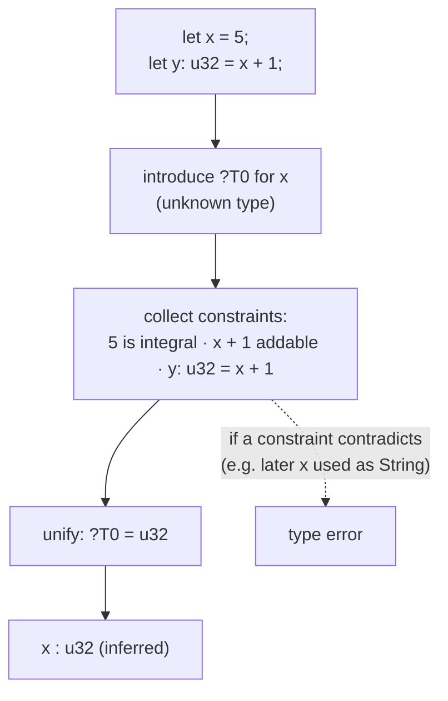
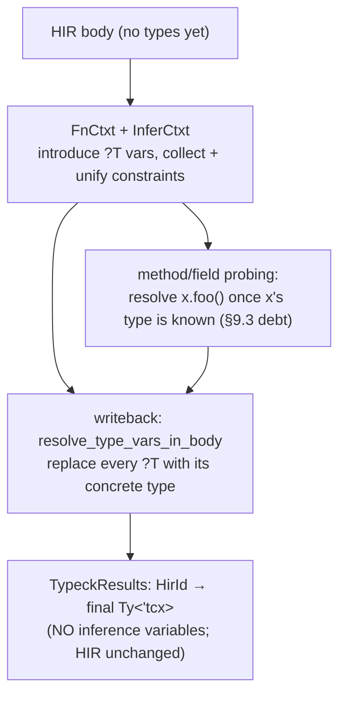
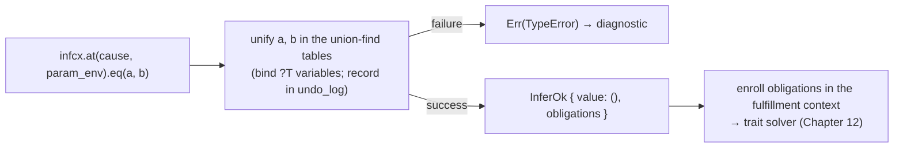
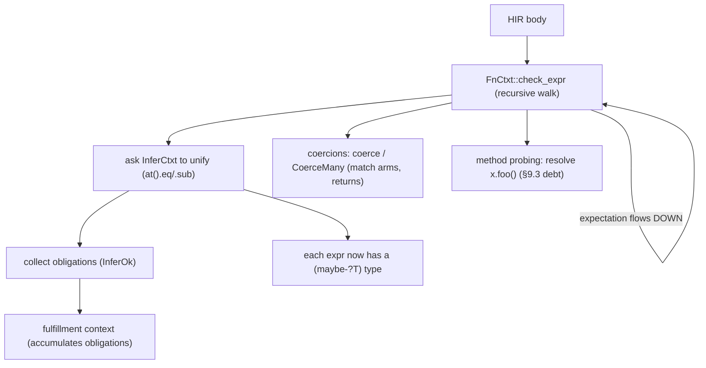
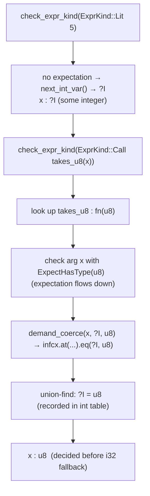
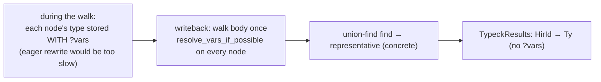
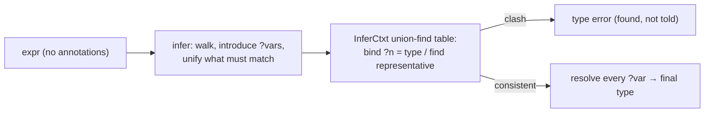

```admonish abstract title="What you'll learn"
- Why type checking is where rustc turns from translator to prover, building on the interned [`Ty<'tcx>`](../glossary.md#tytcx) of §4.2 and the `TyKind` enum (including the `Infer(InferTy)` hole that makes inference possible).
- How Hindley-Milner inference with unification discovers unwritten types: introduce a `?T` for every unknown, collect constraints by walking the program, then unify to a fixpoint or a clash.
- Rust's extension of HM: integral and floating-point literal-fallback variables (`?I`, `?F`) that default to `i32` and `f64` when context leaves them unconstrained.
- The three machines of body type-checking, the `InferCtxt` (union-find tables plus `undo_log` snapshots), the `FnCtxt` (the `check_expr` walk with downward expectations), and the fulfillment context that hands obligations to Chapter 12.
- How `infcx.at(cause, env).eq(a, b)` returns an `InferOk` whose obligations are the seam between unification and the [trait solver](../glossary.md#trait-solver).
- How writeback (`resolve_type_vars_in_body`) strips every inference variable into the [`HirId`](../glossary.md#hirid)-keyed `TypeckResults` side table, which is what every later pass actually reads.
```

## 11.1 The Type System and Type Inference

### The pass that proves your program means something

Chapter 1 of this book drew a thesis: `rustc` is less a *translator* than a *prover*. The front end of Parts 1 and 2 has, until now, mostly been the translator, reading bytes into tokens, tokens into a tree, names into definitions, sugar into core. With type checking, the prover arrives. This is the pass that establishes that your program is *meaningful*: that `x + y` adds things that can be added, that `f(a)` passes `f` an argument of the type it expects, that the value you return matches the type you promised. It is one of the larger subsystems in the compiler [VERIFY exact LOC against current rustc], and it does two intertwined jobs at once. It **infers** the types you did not write (`let x = 5;`, what is `x`?) and it **checks** that everything is consistent (if `x` is later used as a `String`, that is an error). The foundation is two things: how `rustc` represents a type, and the classic algorithm (Hindley-Milner inference with unification) by which it discovers and verifies them.

### Representing a type: `Ty<'tcx>` in earnest

We have met the protagonist before. Back in §4.2, the interned type `Ty<'tcx>` was the running example of interning: a type is `Interned<'tcx, WithCachedTypeInfo<TyKind<'tcx>>>`, a cheap, `Copy`, pointer-sized handle to a canonical, deduplicated `TyKind` living in the [arena](../glossary.md#arena), so that comparing two types is a pointer comparison. Chapter 11 is where that representation does its real work. The content behind the handle is `TyKind`, the enum of every kind of type Rust has, a faithful sample:

```rust
// rustc_type_ir / rustc_middle::ty  (faithful; rustc_middle::ty alias form, abridged)
pub enum TyKind<'tcx> {
    Bool, Char, Int(IntTy), Uint(UintTy), Float(FloatTy), // primitives
    // a struct/enum/union + its generic arguments
    Adt(AdtDef<'tcx>, GenericArgs<'tcx>),
    Ref(Region<'tcx>, Ty<'tcx>, Mutability), // &'a T / &'a mut T
    Tuple(&'tcx List<Ty<'tcx>>), // (A, B, C)
    FnDef(DefId, GenericArgs<'tcx>), // the zero-sized type of a specific fn
    Slice(..), Array(..), RawPtr(..), Closure(..), Dynamic(..),  // and more
    Never, // the `!` type
    Alias(AliasTy<'tcx>), // projection / opaque / free type alias
    Param(ParamTy), // a generic parameter `T`
    Infer(InferTy), // ← an INFERENCE VARIABLE: "not yet known"
    // a type that failed to compute (recover-and-continue)
    Error(ErrorGuaranteed),
}
// Canonical declaration is `pub enum TyKind<I: Interner>` in rustc_type_ir;
// the form above is the rustc_middle::ty alias specialization.
```

Two things matter for this chapter. First, there are *two* `TyKind`-like worlds, and the distinction is the seam between syntax and semantics. The types the *user writes*, `x: Vec<u32>`, are parsed as `hir::Ty` with a syntactic `hir::TyKind` (just a path and arguments, not yet meaningful). Type checking *converts* these into the semantic `ty::Ty<'tcx>` via lowering (`<dyn HirTyLowerer>::lower_ty`, verified), resolving `Vec` to its `AdtDef`, `u32` to `Uint(U32)`, and so on. The `hir::TyKind` is what you typed; the `ty::TyKind` is what it *means*. Second, and central: one variant is `Infer(InferTy)`, a type that is **not yet known**. This is the representation that makes inference possible: a hole the compiler will fill.

### The classic algorithm: Hindley-Milner and unification

How does a compiler discover the type of `x` in `let x = 5; let y: u32 = x + 1;` without being told? The mechanism is **Hindley-Milner (HM) type inference**. The dev-guide states plainly that `rustc`'s inference "is based on the standard Hindley-Milner type inference algorithm," extended for subtyping, [regions](../glossary.md#region), and higher-ranked types. The core idea has two phases, *constrain* then *solve*:

1. **Introduce an inference variable** for every unknown type. The dev-guide writes these `?T` and calls them *inference variables* (or *existential variables*). When the compiler sees `let x = ...;` with no annotation, it gives `x` a fresh `?T0`, "I don't know yet, call it `?T0`."
2. **Generate constraints** by walking the program. Every expression imposes requirements. `x + 1` where `1` is an integer constrains `?T0` to be something addable to an integer. Assigning `x` to a `u32`-typed slot constrains `?T0 = u32`.
3. **Unify** the constraints. **Unification** is the algorithm (shared with Prolog and other logic systems) that takes two types that must be equal and makes them so, binding inference variables along the way. Unifying `?T0` with `u32` records "`?T0` *is* `u32`." Unifying `?T0` with `String` *after* it was already `u32` is a contradiction: a type error.

The program does not need to state types where they can be deduced: the constraints, solved together, pin them down. `let x = 5; let y: u32 = x + 1;` infers `x: u32` because the second line unifies `?T0` (the type of `x`) with `u32`. The whole of `let` inference is "introduce a variable, collect constraints, unify."




```admonish tip title="Pro-Tip, type annotations needed means unification ran out of constraints"
The error `type annotations needed` (E0282) is HM telling you it could not pin down an inference variable, the program left a `?T` with no constraint forcing it to a concrete type. `let v = Vec::new();` with no later use is the classic case: `?T` (the element type) is never constrained, so the compiler genuinely cannot know it. The fix is to *add a constraint*, annotate (`Vec::<u32>::new()`) or use `v` in a way that forces the element type. Reading the error as "I have an unsolved inference variable" tells you exactly what to do: give unification one more fact.
```

### Rust's extension: literal-fallback variables

Pure HM has one kind of inference variable; Rust has several, and the extra ones solve a Rust-specific problem the dev-guide spells out. Consider `let x = 5;`: `5` could be `i32`, `u8`, `u64`, any integer type. A plain `?T` would demand the type be pinned exactly, but Rust wants `5` to stay flexible until context decides, *then* default. So `rustc` has, beyond the **general type variable** (unifiable with any type), an **integral type variable** (arising from an integer literal, unifiable only with an integer type) and a **floating-point type variable** (from a float literal). If nothing constrains an integral variable by the end, it **falls back** to `i32`; a float falls back to `f64`. This is why `let x = 5;` alone compiles with `x: i32`, but `let x = 5; takes_u8(x);` infers `x: u8`: the constraint from `takes_u8` resolves the integral variable before fallback. The literal-fallback variables are HM bent to fit Rust's "untyped integer literal" ergonomics.

### Where inference lives: the `InferCtxt`

All of this unification needs a home, somewhere to store the inference variables and their evolving bindings. That home is the `InferCtxt` (inference context), verified in the dev-guide as the structure whose "main purpose ... is to house a bunch of inference variables." You build one from the [`TyCtxt`](../glossary.md#tyctxt-tcx) (`tcx.infer_ctxt().build(TypingMode::analysis_in_body(tcx, def_id))`; the builder takes a `TypingMode` selecting [coherence](../glossary.md#coherence) vs analysis vs borrowck vs post-analysis) and it holds the unification tables: as constraints are solved, the `InferCtxt` records each `?T`'s binding. Crucially, the `InferCtxt` is *temporary*, it exists only while a single body is being checked. The structure that actually drives body type-checking is the `FnCtxt`, which (verified) "stores type-checking context needed to type-check bodies of functions, closures, and consts, including performing type inference with `InferCtxt`." Its sibling, `ItemCtxt`, type-checks item *signatures* and deliberately does *no* inference: a signature like `fn f(x: u32) -> bool` has no holes to fill. The split is the §10.2 body/signature separation again: signatures are checked without inference (`ItemCtxt`), bodies with it (`FnCtxt` + `InferCtxt`).

### Finishing the job: the boundary, and writeback

Two final pieces close the loop with earlier chapters.

First, the **boundary with name resolution**. §9.3 said the resolver left `x.field` and type-relative path tails unresolved, and §9.1 noted the same deferral for method calls like `x.foo()`: a method or field cannot be resolved until the *type* of `x` is known. Type checking is where that debt is paid. Once inference determines `x: Vec<u32>`, the type checker can finally resolve `.push` to the right method (this is **method probing**, in `rustc_hir_typeck::method`) and `.len` to the right field. The names §9 could not bind, because they needed a type, are bound *here*, by the pass that supplies the type.

Second, **writeback**. During inference, expressions have types full of `?T` variables, partially solved. But the *output* of type checking, the thing later passes consume, must be free of inference variables: every type fully known. So at the end of checking a body, a step the source calls **writeback** (`resolve_type_vars_in_body`, verified) walks the body and replaces every inference variable with the concrete type it was unified to, producing a `TypeckResults`, the verified side table that maps each expression's `HirId` to its final, inference-variable-free type. This is the §10.2 promise made good: the [HIR](../glossary.md#hir) is never mutated; the inferred types live in a separate `HirId`-keyed table, and `TypeckResults` *is* that table. When any later pass asks "what is the type of this expression?", it looks up the `HirId` in `TypeckResults`, never on the HIR node itself.




```admonish warning title="Warning, inference is local to a body and does not flow between functions"
A crucial property, easy to forget: Rust infers types *within* a function body, but **never across function boundaries**. A function's signature must be fully annotated, `fn f(x: u32) -> bool`, precisely so that each body can be checked in isolation, using only the signatures of the functions it calls, never their bodies. This is a deliberate design choice (it keeps inference fast, makes errors local, and lets bodies be checked in parallel and incrementally), and it is why "just infer my function's argument types" is not a feature: the boundary is load-bearing. When you see a "type annotations needed" error on a closure or a `let`, inference is stuck *inside one body*; it cannot reach out to another function to resolve it, by design.
```

### Where this leaves us

Type checking is where the compiler turns from translator to prover. It represents a type as the interned, `Copy`, pointer-sized `Ty<'tcx>` of §4.2, a handle to a `TyKind` that ranges over primitives, ADTs, references, generic `Param`s, the inference-hole `Infer`, and the recover-and-continue `Error`, converting the *syntactic* `hir::TyKind` the user wrote into the *semantic* `ty::TyKind` it means. It discovers unwritten types by **Hindley-Milner inference**: introduce an inference variable `?T` for each unknown, collect constraints by walking the program, and **unify** them, a contradiction being a type error and an unconstrained variable being "type annotations needed." Rust extends HM with **integral and floating-point literal variables** that fall back to `i32`/`f64`, fitting untyped-literal ergonomics. The machinery lives in a per-body `InferCtxt` driven by `FnCtxt` (bodies, with inference) versus `ItemCtxt` (signatures, without), the §10.2 body/signature split again. It pays the §9.3 debt, resolving the method and field accesses that needed a type. And it ends in **writeback**, replacing every inference variable with its solved type to produce `TypeckResults`, the `HirId`-keyed side table of final types: the immutable HIR's annotations living separately, exactly as §10.2 promised. Inference is strictly *intra-body*; signatures are the boundary.

§11.2 takes the architecture deep-dive: the `InferCtxt` and its unification tables in detail, how `FnCtxt` walks the HIR body generating constraints (the `check_expr` family), how [`Obligation`](../glossary.md#obligation)s for trait bounds are accumulated for the trait solver (Chapter 12), and how `TypeckResults` is assembled. Then §11.3 reads the real unification and a slice of `check_expr`, and §11.4 has you build a small Hindley-Milner inferencer with unification over a toy expression language.

## 11.2 The Architecture: the `InferCtxt`, Unification, and the Type-Checking Walk

### The three machines of type checking

Three machines cooperate to type-check a body. The `InferCtxt` *stores* the inference variables and performs **unification**: the bookkeeping of "what is each `?T` so far." The `FnCtxt` *walks* the HIR body, visiting each expression, asking the `InferCtxt` to unify types as it goes, and accumulating the trait **obligations** it cannot discharge locally. And a **fulfillment context** *collects* those obligations for the trait solver of Chapter 12. We take them in turn, then watch a single expression flow through all three.

### Inside the `InferCtxt`: union-find with an undo log

The heart of inference is the `InferCtxt`'s mutable storage, `InferCtxtInner`, whose fields are the unification tables §11.1 implied:

```rust
// rustc_infer::infer  (faithful; selected fields, module paths elided)
pub struct InferCtxtInner<'tcx> {
    undo_log: InferCtxtUndoLogs<'tcx>, // records every change, for rollback
    type_variable_storage: TypeVariableStorage<'tcx>, // general ?T variables
    // integral literal vars
    int_unification_storage:   UnificationTableStorage<IntVid>,
    float_unification_storage: UnificationTableStorage<FloatVid>, // float literal vars
    // … plus const, region, opaque, projection state; see the dev-guide's "Type inference" page
}
```

Each `UnificationTable` is a **union-find** structure, the classic data structure for "these things are now known to be equal." When unification binds `?T0 = u32`, it does not copy `u32` everywhere `?T0` appeared; it *unions* `?T0` into an equivalence class whose representative is `u32`. Asking "what is `?T0`?" later means *finding the representative* of its class. Union-find makes this near-constant-time and is exactly why HM inference is efficient at scale, the §11.1 "introduce a variable, unify it later" is union-find under the hood. The int/float/const slots are `UnificationTableStorage<...>` directly; the general-type slot is wrapped in `TypeVariableStorage<'tcx>`, which itself contains a `UnificationTableStorage<TyVidEqKey>`. Either way, each variable kind has its own union-find.

The field that makes inference *robust* is the `undo_log`. Inference must sometimes *try* a unification speculatively ("if I assume this coercion, does everything still check?") and back out if it fails. So every change to the tables is recorded in the undo log, and the `InferCtxt` offers **snapshots**: take a snapshot, do some unifications, and either commit them or roll back, undoing every binding made since. The public surface is `commit_if_ok` (commit if a closure returns `Ok`) and `probe` (always roll back), implemented over a private `start_snapshot` / `rollback_to` / `commit_from` trio. This is how the compiler explores possibilities (trying a coercion, probing a method) without corrupting the inference state if the attempt fails.

```admonish tip title="Pro-Tip, snapshots are why type errors do not cascade as badly as they could"
Because the `InferCtxt` can roll back, the compiler can attempt a unification, discover it fails, roll back cleanly, and report *one* precise error rather than leaving half-applied bindings that poison every later expression. When you do see a cascade of confusing follow-on type errors, it usually means a variable got bound to `Error` (the §11.1 recover-and-continue type) and propagated, not that rollback failed. The snapshot machinery is why one failed unification can be reported as a single localized error rather than propagating bindings forward.
```

### The unification API: `at(...).eq(...)` and `InferOk`

Code does not poke the tables directly; it uses a small, readable API. The dev-guide documents the idiom: `infcx.at(&cause, param_env).eq(a, b)`. The `at(cause, env)` call supplies *context*: *why* this unification is happening (the `ObligationCause`, used for diagnostics) and *in what environment* (the [`ParamEnv`](../glossary.md#paramenv), the set of trait bounds in scope). The `.eq(a, b)` then "performs the actual equality constraint," forcing `a` and `b` to be equal and binding variables as a side effect. There is also `.sub(a, b)` for *subtyping* (`a` is a subtype of `b`), Rust's extension of HM for lifetimes and variance.

The return type is the subtle, important part. As the dev-guide stresses, `eq` does not really return `()`; it returns `InferOk<()>`, and the `InferOk` *carries extra trait obligations*. Unifying two types can *generate requirements*: unifying `?T` with `Vec<U>` where some bound says `U: Clone` produces an obligation "`U: Clone` must hold." `eq`'s job is the equality; it hands you back any obligations the equality implied, and **your job is to fulfill them** by enrolling them in a fulfillment context. This single fact, that unification produces obligations as a byproduct, is the seam between type inference (this chapter) and trait solving (Chapter 12). Inference says "these are equal, *and* here are the trait bounds that now must be proven"; the trait solver proves them.




### The `FnCtxt`: walking the body with expectations

The `InferCtxt` is passive: it unifies when asked. The active driver is the `FnCtxt`, which walks the HIR body expression by expression through the `check_expr` family of methods, computing each expression's type and unifying it against what context demands. The pattern is recursive and recognizable: to check `a + b`, check `a`, check `b`, then unify their types with the requirements of `+`; to check `f(arg)`, check `f` to get its signature, check `arg`, and unify `arg`'s type with `f`'s parameter type.

A refinement worth naming: `check_expr` is not purely bottom-up. It threads an **expectation** downward: when checking the `5` in `let x: u8 = 5;`, the `FnCtxt` passes the expectation "this should be a `u8`" *into* checking the literal, so the integral variable resolves to `u8` immediately rather than defaulting to `i32`. This is a touch of **bidirectional** type checking layered onto HM: types flow up from leaves *and* expectations flow down from context, meeting in the middle. It is why annotations placed far from a literal still guide it, and why `collect()` can infer its target type from the binding it feeds.

The `FnCtxt` also owns the machinery for the things pure HM lacks. **Coercions** (`&Vec<T>` to `&[T]`, a concrete type to a `dyn Trait`) are handled by `coerce` and, for "many expressions that must agree" (all the arms of a `match`, all the `return`s in a function), by `CoerceMany`; the verified `ret_coercion` field collects every `return` expression to compute their common type. And **method probing** (resolving the §9.3 debt now that a type is known) lives here: once an expression's type is known, the `FnCtxt` searches that type's inherent and trait methods to resolve `x.foo()`.




### Accumulating obligations: the bridge to Chapter 12

As `check_expr` walks, the obligations handed back by every `eq` pile up, plus obligations from method calls (the called method's `where` clauses must hold), from generic instantiations, from operators (`a + b` requires `A: Add<B>`). These `PredicateObligation`s are not solved inline; they are accumulated in a **fulfillment context** and solved together, because a trait bound often cannot be proven until *other* inference has progressed (proving `?T: Clone` is impossible while `?T` is still unknown). The interplay is iterative: unify to make progress, attempt to fulfill obligations, which may force more unification, repeat. The `param_env` field on the `FnCtxt`, the set of `where`-clause bounds in scope, is what obligations are proven *against*. All of this sets up Chapter 12, whose entire subject is *how* an obligation like `String: Display` is discharged. For now the architecture's point is the handoff: type inference *produces* obligations; trait solving *consumes* them; the fulfillment context is the queue between them.

```admonish warning title="Warning, an obligation proven against the wrong ParamEnv is a subtle bug class"
Every obligation is proven relative to a `ParamEnv`, the bounds assumed in the current context. Inside `fn f<T: Clone>()`, the bound `T: Clone` is *assumed* (it is in the `ParamEnv`), so `t.clone()` checks; outside such a bound it does not. The `FnCtxt`'s `param_env` can *change* when descending into a closure or a nested item, and using a stale or wrong `ParamEnv` makes the trait solver prove the wrong thing, accepting code it should reject or vice versa. When you read typeck code, "which `ParamEnv` are we in?" is as load-bearing a question as "which owner?" was in lowering (§10.2). Bounds are contextual; the `ParamEnv` is that context, and it must be the right one.
```

### Funnelling to `TypeckResults`

When the walk finishes, the body's expressions all have types, but those types still contain inference variables, and they live in the `InferCtxt`'s tables, not in any durable structure. The final step is the **writeback** of §11.1: walk the body once more, resolve every expression's type to its union-find representative (which is now concrete), and record the result in `TypeckResults`, keyed by `HirId`. Method resolutions, coercions applied, and the type of every node are all written there. The `InferCtxt`, variables, tables, undo log, and all, is then discarded; it was scaffolding. What survives is `TypeckResults`, the inference-variable-free `HirId → Ty` map that §10.2 promised would hold the HIR's type annotations. Type checking, architecturally, is "spin up an `InferCtxt`, walk the body with a `FnCtxt` unifying and collecting obligations, fulfill the obligations, write back the solved types, throw away the scaffolding."

### How this builds, and what is next

The engine is assembled. The `InferCtxt` stores inference variables in per-kind **union-find** tables (general, int, float, const) plus region constraints, with an `undo_log` powering snapshot/`rollback_to`/`commit` so the compiler can try unifications speculatively and back out cleanly. Unification is driven through the `at(cause, env).eq/.sub` API, whose `InferOk` return value carries the trait **obligations** that equality implied, the seam to Chapter 12. The `FnCtxt` walks the HIR body through the `check_expr` family, threading **expectations** downward (a dash of bidirectional checking on top of HM), and owns coercions (`CoerceMany`, `ret_coercion`) and method probing (the §9.3 debt). Trait `PredicateObligation`s accumulate in a fulfillment context, proven against the current `ParamEnv` by the Chapter 12 solver in an iterative dance with unification. And **writeback** funnels everything into the inference-variable-free `TypeckResults` before the `InferCtxt` scaffolding is discarded.

§11.3 reads the real code: a slice of `FnCtxt::check_expr` for a simple expression, the `at().eq()` unification call and how it threads `InferOk` obligations, and the union-find `TypeVariableTable` resolving a variable to its representative, so you can watch a literal acquire a type. Then §11.4 has you build a Hindley-Milner inferencer with a union-find unification table over a toy expression language, inferring types with no annotations at all.

## 11.3 Reading the Source: `check_expr`, Unification, and Variable Resolution

### Watching a literal acquire a type

Follow the literal `5` in `let x = 5; takes_u8(x);` from "an integer of unknown type" to "definitely `u8`," and the engine of §11.2 runs in front of you, in real code. Three things matter here: `check_expr` dispatching on the HIR, the `at().eq()` unification that pins the type down, and the union-find table that resolves a variable to its representative. The file is `rustc_hir_typeck/src/expr.rs`; its top-of-file comment is a "Note on Names" aside rather than a chapter heading, but every routine in it is part of type-checking expressions.

### The dispatch: `check_expr_with_expectation`

The `FnCtxt`'s expression checker is a family of entry points, verified in the source: `check_expr` (no expectation), `check_expr_with_expectation` (the workhorse, carrying a downward expectation), and `check_expr_has_type_or_error` (which *demands* the result be a subtype of an expected type, "a *hard* requirement," per the verified doc comment). They all funnel into a big dispatch on the HIR's `ExprKind`:

```rust
// rustc_hir_typeck/src/expr.rs  (faithful, abridged)
fn check_expr_kind(&self, expr: &'tcx hir::Expr<'tcx>, expected: Expectation<'tcx>) -> Ty<'tcx> {
    match expr.kind {
        ExprKind::Lit(ref lit) => self.check_expr_lit(lit, expected),
        ExprKind::Binary(op, lhs, rhs) => self.check_expr_binop(expr, op, lhs, rhs, expected),
        ExprKind::Call(callee, args)   => self.check_expr_call(expr, callee, args, expected),
        ExprKind::MethodCall(segment, receiver, args, _) =>
            self.check_expr_method_call(expr, segment, receiver, args, expected),
        ExprKind::Path(ref qpath) => self.check_expr_path(qpath, expr, None),
        // … one arm per ExprKind, but NO ForLoop or Try: they were desugared (Ch.10) …
    }
}
```

Two things to notice immediately. First, the `Expectation<'tcx>` parameter threaded into every arm is the §11.2 *downward expectation*: `NoExpectation`, or `ExpectHasType(ty)` when context demands a specific type. Second, the absence again: there is no `ForLoop` or `Try` arm, because Chapter 10's lowering already turned them into `Loop`/`Match`/`Call`. The type checker reaps the benefit of desugaring: it implements one arm per *core* form, not per surface form.

### The literal: a fresh integral variable

When `check_expr_kind` reaches `ExprKind::Lit` for our `5`, it must produce a type. An integer literal does not have a fixed type, so, exactly the §11.1 mechanism, it creates a **fresh integral inference variable**, unless an expectation says otherwise. In faithful outline:

```rust
// rustc_hir_typeck/src/expr.rs  (faithful signature; integer-literal arm illustrative)
fn check_expr_lit(&self, lit: &hir::Lit, expected: Expectation<'tcx>) -> Ty<'tcx> {
    match lit.node {
        ast::LitKind::Int(..) => {
            // If the expectation already says "u8", use it; otherwise a fresh integral var ?I.
            let opt_ty = expected.to_option(self).and_then(|ty| match ty.kind() {
                ty::Int(_) | ty::Uint(_) => Some(ty),
                _ => None,
            });
            // ← fresh integral ?I (the §11.2 int table)
            opt_ty.unwrap_or_else(|| self.next_int_var())
        }
        // … float, str, bool …
    }
}
```

For `let x = 5;` there is no annotation, so `5` gets a fresh integral variable `?I` from the `InferCtxt`'s integer-unification table (§11.2). `x` is therefore `?I`, known to be *some* integer, not yet which. If we stopped here and nothing else constrained `?I`, the §11.1 fallback would make it `i32`. But the next line constrains it.

### The constraint: `takes_u8(x)` and `demand_coerce`

The call `takes_u8(x)` is an `ExprKind::Call`. Checking it looks up `takes_u8`'s signature, `fn(u8)`, and then must enforce that the argument `x` (type `?I`) matches the parameter type `u8`. This enforcement is the unification of §11.2, reached through the `demand` module's helpers (`demand_coerce`/`demand_eqtype`), which wrap the `at().eq()` (or coercion) call:

```rust
// rustc_hir_typeck/src/expr.rs  (illustrative; representative arg-checking pattern)
// expectation = u8 flows DOWN
let arg_ty = self.check_expr_with_expectation(arg, ExpectHasType(param_ty));
// demand that arg_ty coerces/equates to param_ty:
// → infcx.at(cause, env).eq(?I, u8) under the hood
self.demand_coerce(arg, arg_ty, param_ty, /* … */);
```

Two paths reach the same place. The *expectation* `ExpectHasType(u8)` flows down into checking `x`, and the *demand* afterward calls into `at().eq()` to unify `?I` with `u8`. Unifying an integral variable `?I` with `u8` succeeds (a `u8` is an integer, which the integral variable permits), and the union-find table now records `?I = u8`. The `InferOk` returned (§11.2) carries any obligations (here none of consequence) and inference has progressed: `x` is now `u8`, decided by the constraint *before* fallback could make it `i32`. This is precisely the §11.1 claim "`let x = 5; takes_u8(x);` infers `x: u8`," now seen in the code that does it.




### Resolving a variable: union-find in `TypeVariableTable`

When code later asks "what *is* `?I`?", it does not read a stored type off the variable. It **resolves** the variable through the union-find table. The `InferCtxt` offers two verified resolution methods that differ in depth. `shallow_resolve(ty)` follows a variable *one step* to whatever it is directly bound to (which might be another variable, or a type that itself contains variables). `resolve_vars_if_possible(ty)` resolves *as far as currently possible*, replacing every variable in the type with its representative, recursively, but leaving still-unbound variables untouched. The underlying operation in the `TypeVariableTable` is the union-find *find*: follow the chain of "this variable was unified into that class" links to the class's representative, which is the concrete type if one has been determined.

This is why §11.2 stressed union-find: binding `?I = u8` did not rewrite every occurrence of `?I` in the body; it simply made `u8` the representative of `?I`'s class. Every expression that referred to `x` still holds `?I` in its recorded type *during* checking; only when resolved (at a query, or finally at writeback) does `?I` become `u8`. Resolution is *find the representative*, on demand.

```admonish tip title="Pro-Tip, integer and underscore placeholders in error messages are unresolved inference variables"
When a type error prints `{integer}`, `{float}`, or a bare `_`, you are seeing an inference variable that resolution could not pin to a concrete type: `{integer}` is an unbound *integral* variable, `{float}` an unbound float variable, `_` a general one. The compiler is literally showing you the union-find representative, which is still "some integer" rather than `u8`. It is the same information the Pro-Tip of §11.1 described from the user side: `{integer}` means "I have an integral variable here and no constraint has decided it yet." Reading these placeholders as *unresolved variables* tells you the fix is, again, to add a constraint.
```

### From checked to recorded: writeback resolves for keeps

During the walk, every expression's type is *stored as it was computed*, full of `?I`-style variables, because rewriting them eagerly on every unification would be, in the writeback module's own words, "unreasonably slow." So the body is checked with variables in place, and only at the end does **writeback** (`resolve_type_vars_in_body`, §11.1/§11.2) walk the body once, call `resolve_vars_if_possible` on every node's type, and record the now-concrete result in `TypeckResults`. For our example, the node for `x` that held `?I` throughout checking is resolved, once, to `u8` and written into the `HirId → Ty` map. The verified module comment captures the design exactly: inference variables "don't appear in the final `TypeckResults` since all of the types should have been inferred once typeck is done."




### How this builds, and what is next

We have read inference doing its work on one expression. `FnCtxt::check_expr_with_expectation` dispatches via `check_expr_kind` on the HIR's `ExprKind`, one arm per *core* form, the desugaring of Chapter 10 paying off as the absence of `For`/`Try` arms. An integer literal with no expectation becomes a fresh **integral inference variable** `?I` (the §11.2 int table); a later `takes_u8(x)` flows the expectation `u8` *down* and `demand_coerce`s the argument, calling `at().eq(?I, u8)` so the union-find table records `?I = u8`, deciding the type before the `i32` fallback. Variables are resolved on demand by **union-find find** (`shallow_resolve` one step, `resolve_vars_if_possible` as far as possible), which is why a binding does not rewrite the body and why `{integer}` in an error is an unresolved variable. And **writeback** resolves every node once at the end into the variable-free `TypeckResults`. The literal `5` has acquired a type, and we watched every step.

§11.4 turns this into a build. You will write a small **Hindley-Milner inferencer** over a toy expression language (`let`, lambdas, application, integer and boolean literals) with a real **union-find** unification table, fresh inference variables, and a `unify` that binds variables or reports a clash. With no annotations at all, your inferencer will deduce that `let id = \x -> x in id(5)` gives `id : ?a -> ?a` and the whole expression an integer: the §11.1 algorithm, the §11.2 union-find, and the §11.3 resolution, in code you wrote.

## 11.4 Hands-On Lab: Build a Hindley-Milner Type Inferencer

### Inference with no annotations at all

This lab builds the algorithm at the heart of the chapter: a **Hindley-Milner type inferencer** that takes an expression with *zero* type annotations and deduces the type of every part of it. You will write the three pieces §11.1 to §11.3 dissected (a **union-find** table of inference variables (§11.2), a `unify` that binds variables or reports a clash (§11.1), and an `infer` walk that generates and solves constraints (§11.3)) and watch it conclude, from nothing but structure, that `\x -> x` has type `?a -> ?a` and that `(\x -> x)(5)` is an integer. By the end the inferencer rejects `5 + true` on its own.

`cargo new`, pure `std`.

### Types, with a hole

The type language has primitives, functions, and, the crucial one, a *variable*, an unknown the inferencer will solve:

```rust
// src/main.rs
use std::collections::HashMap;

#[derive(Clone, Debug, PartialEq)]
enum Type {
    Int,
    Bool,
    Fun(Box<Type>, Box<Type>), // T1 -> T2
    Var(u32), // ?n, an inference variable (the §11.1 Infer hole)
}
```

`Type::Var(n)` is our `?T`. Everything the inferencer does is, in the end, deciding what each `Var` *is*.

### The union-find table

This is the §11.2 `InferCtxt` in miniature: a table indexed by variable id whose entry says either "I know what this is" or "still unknown." `next_ty_var()` mints a new unbound entry and returns its id as a `Type::Var`; `find` follows the chain to a representative, *resolving* a type as far as the current bindings allow, exactly §11.3's `resolve_vars_if_possible`. Note the two-variant payload: rustc spells these `TypeVariableValue::{Known, Unknown}` and stores them in a `UnificationTableStorage` (ena union-find); `IntVarValue` and `FloatVarValue` share the same shape.

```rust
/// Each inference variable is either bound to a concrete type or still unknown.
/// rustc spells this `TypeVariableValue::{Known { value }, Unknown { universe }}`.
#[derive(Clone, Debug)]
enum VarValue {
    Known(Type),
    Unknown,
}

struct InferCtxt {
    values: Vec<VarValue>, // indexed by var id; `Known(T)` if unified, else `Unknown`
}

impl InferCtxt {
    fn new() -> Self { Self { values: Vec::new() } }

    /// Mint a fresh, unbound inference variable (§11.2 next_*_var).
    fn next_ty_var(&mut self) -> Type {
        let n = self.values.len() as u32;
        self.values.push(VarValue::Unknown);
        Type::Var(n)
    }

    /// Resolve a type as far as current bindings allow, union-find `find`, recursively.
    /// This is §11.3's resolve_vars_if_possible.
    fn resolve_vars_if_possible(&self, t: &Type) -> Type {
        match t {
            Type::Var(n) => match &self.values[*n as usize] {
                // follow the chain to the representative
                VarValue::Known(bound) => self.resolve_vars_if_possible(bound),
                VarValue::Unknown => Type::Var(*n), // still unbound → leave as ?n
            },
            Type::Fun(a, b) => Type::Fun(Box::new(self.resolve_vars_if_possible(a)), Box::new(self.resolve_vars_if_possible(b))),
            other => other.clone(),
        }
    }
}
```

### `unify`: the engine of inference

`unify` takes two types that *must* be equal and makes them so, binding a variable to a type, or recursing into matching structure, or reporting a clash. It is the §11.1 algorithm and the §11.3 `at().eq()` in one function:

```rust
impl InferCtxt {
    fn unify(&mut self, a: &Type, b: &Type) -> Result<(), String> {
        // resolve both to representatives first
        let (a, b) = (self.resolve_vars_if_possible(a), self.resolve_vars_if_possible(b));
        match (&a, &b) {
            // identical concrete types: done.
            (Type::Int, Type::Int) | (Type::Bool, Type::Bool) => Ok(()),

            // a variable unifies with anything: bind it (after an OCCURS CHECK).
            (Type::Var(n), other) | (other, Type::Var(n)) => {
                if let Type::Var(m) = other { if m == n { return Ok(()); } } // ?n == ?n
                // occurs check (§ below)
                if self.occurs(*n, other) {
                    return Err(format!("infinite type: ?{n} occurs in {other:?}"));
                }
                // ← bind ?n = other (union-find union)
                self.values[*n as usize] = VarValue::Known(other.clone());
                Ok(())
            }

            // functions: unify domains and codomains structurally.
            (Type::Fun(a1, a2), Type::Fun(b1, b2)) => {
                self.unify(a1, b1)?;
                self.unify(a2, b2)
            }

            // anything else is a CLASH, a type error the inferencer found itself.
            _ => Err(format!("type mismatch: {a:?} vs {b:?}")),
        }
    }

    /// Occurs check: ?n must not appear inside the type we're binding it to,
    /// or we'd build an infinite type (e.g. ?n = ?n -> ?n).
    fn occurs(&self, n: u32, t: &Type) -> bool {
        match self.resolve_vars_if_possible(t) {
            Type::Var(m) => m == n,
            Type::Fun(a, b) => self.occurs(n, &a) || self.occurs(n, &b),
            _ => false,
        }
    }
}
```

The `occurs` check is the one subtlety pure structural unification needs: without it, unifying `?n` with `?n -> ?n` would loop forever (and is meaningless: no finite type satisfies it). Rust's real inferencer does the same check; it is why `let f = |x| x(x);` fails. Real rustc folds the occurs check into a wider `Generalizer` (`rustc_infer::infer::relate::generalize`) that simultaneously prepares for region/alias unification; the failure variant is `TypeError::CyclicTy(Ty)`. Our standalone `occurs` captures the cycle-detection beat without the generalisation.

### `infer`: the constraint-generating walk

Now the §11.3 walk. `infer` takes an expression and an environment (names → types) and returns the expression's type, generating constraints via `unify` as it goes:

```rust
#[derive(Clone)]
enum Expr {
    Int(i64), Bool(bool),
    Var(String),
    Lam(String, Box<Expr>), // \x -> body
    App(Box<Expr>, Box<Expr>), // f arg
    Let(String, Box<Expr>, Box<Expr>), // let x = e1 in e2
    If(Box<Expr>, Box<Expr>, Box<Expr>),
}

impl InferCtxt {
    fn infer(&mut self, env: &HashMap<String, Type>, e: &Expr) -> Result<Type, String> {
        match e {
            Expr::Int(_)  => Ok(Type::Int),
            Expr::Bool(_) => Ok(Type::Bool),
            Expr::Var(x)  => env.get(x).cloned().ok_or_else(|| format!("unbound variable {x}")),

            Expr::Lam(x, body) => {
                let param = self.next_ty_var(); // ?a for the parameter
                let mut env2 = env.clone();
                env2.insert(x.clone(), param.clone());
                let ret = self.infer(&env2, body)?; // infer the body
                Ok(Type::Fun(Box::new(param), Box::new(ret))) // \x -> body : ?a -> ret
            }

            Expr::App(f, arg) => {
                let f_ty   = self.infer(env, f)?;
                let arg_ty = self.infer(env, arg)?;
                let ret    = self.next_ty_var(); // ?r for the result
                // CONSTRAINT: f must be a function from arg_ty to ?r.
                self.unify(&f_ty, &Type::Fun(Box::new(arg_ty), Box::new(ret.clone())))?;
                Ok(ret)
            }

            Expr::Let(x, e1, e2) => {
                let t1 = self.infer(env, e1)?;
                let mut env2 = env.clone();
                // bind x, then infer the body
                env2.insert(x.clone(), t1);
                self.infer(&env2, e2)
            }

            Expr::If(c, t, f) => {
                let c_ty = self.infer(env, c)?;
                self.unify(&c_ty, &Type::Bool)?; // condition must be Bool
                let t_ty = self.infer(env, t)?;
                let f_ty = self.infer(env, f)?;
                self.unify(&t_ty, &f_ty)?; // both arms must agree
                Ok(t_ty)
            }
        }
    }
}
```

Every arm is a constraint. A lambda introduces a fresh parameter variable and returns a function type. An application demands its callee *be* a function `arg_ty -> ?r` and yields `?r`. An `if` demands a `Bool` condition and *agreement* between the arms. The whole inferencer is "introduce variables, unify what must match," §11.1, made of five match arms.

We thread `env: &HashMap<String, Type>` by clone; real rustc stores locals in a `HirIdMap<Ty<'tcx>>` on `TypeckRootCtxt` (pre-populated by `GatherLocalsVisitor` with `next_ty_var` for each `let` binding) and looks them up via `FnCtxt::local_ty(span, hir_id)`. The clone-by-name idiom is the standard HM presentation; the HirId-keyed table is rustc's adaptation once HIR exists.

### Running it

```rust
fn main() {
    let cases = vec![
        // \x -> x (identity)
        ("identity", Expr::Lam("x".into(), Box::new(Expr::Var("x".into())))),
        // (\x -> x)(5)   (apply identity to an int)
        ("apply id to 5", Expr::App(
            Box::new(Expr::Lam("x".into(), Box::new(Expr::Var("x".into())))),
            Box::new(Expr::Int(5)))),
        // if true then 1 else 2
        ("if", Expr::If(Box::new(Expr::Bool(true)), Box::new(Expr::Int(1)), Box::new(Expr::Int(2)))),
        // 5(3), applying a non-function: a type ERROR the inferencer finds itself
        ("apply an int", Expr::App(Box::new(Expr::Int(5)), Box::new(Expr::Int(3)))),
    ];

    for (name, expr) in &cases {
        let mut icx = InferCtxt::new();
        let env = HashMap::new();
        match icx.infer(&env, expr) {
            Ok(ty)  => println!("{name:>14}  :  {:?}", icx.resolve_vars_if_possible(&ty)),
            Err(e)  => println!("{name:>14}  :  ERROR, {e}"),
        }
    }
}
```

````admonish example title="Expected output" collapsible=true
Output:

```text
      identity  :  Fun(Var(0), Var(0))
 apply id to 5  :  Int
            if  :  Int
  apply an int  :  ERROR, type mismatch: Int vs Fun(Int, Var(0))
```

No annotations were supplied. `identity` is inferred as `?0 -> ?0`, the parameter and result *unified to the same variable* because the body returns the parameter, exactly the §11.1 "constraints pin it down." `apply id to 5` forces that `?0` to `Int` (the argument), so the result is `Int`. `if` agrees its arms to `Int`. And `5(3)` is rejected because unifying `Int` (the callee's type) with `Fun(Int, ?r)` (what an application demands) is a clash, a type error your inferencer *discovered*, not one you told it about.
````




### What the lab stripped from real rustc

The two halves of HM the lab built (introduce a fresh `?T` for the unknown, unify constraints as you walk) are the two halves rustc's inferencer is built around. What `[rustc_type_ir/src/ty_kind.rs](https://github.com/rust-lang/rust/blob/1.95.0/compiler/rustc_type_ir/src/ty_kind.rs)` and `[rustc_infer/src/infer/mod.rs](https://github.com/rust-lang/rust/blob/1.95.0/compiler/rustc_infer/src/infer/mod.rs)` add on top of the lab's four-variant `Type`, `Vec<VarValue>` table, and `unify(a, b) -> Result<(), String>` falls into three buckets:

- **An interned type universe.** `TyKind<I: Interner>` has dozens of variants (28 at 1.95.0: `Adt`, `FnDef`, `Ref`, `Slice`, `Array`, `Tuple`, `Closure`, `Param`, `Error`, and so on), with an [`Interner`](../glossary.md#interner) trait so `rustc_type_ir` is shared between `rustc_middle` and external solvers. `InferTy` similarly splits the literal-fallback distinction and adds canonicalization-time "fresh" variants. The lab collapses everything into `Type::Var(u32)`.
- **The obligation-carrying `at().eq()` API.** `InferCtxt::at(cause, env).eq(a, b) -> InferOk { obligations }` threads the `ObligationCause` ([spans](../glossary.md#span) for diagnostics), the `ParamEnv` (Chapter 12's assumptions), and a `ThinVec<PredicateObligation>` for the trait solver. Underneath, the general-type slot is a union-find table with constant-amortized find and snapshot/rollback machinery (via `rustc_data_structures::unify`, an `ena`-derived union-find) that §12.3's trial probes build on. The lab returns `Result<(), String>` from a plain `Vec<VarValue>`. Real rustc also splits `unify` into `super_combine_tys` (handles every `Infer(_)` arm and delegates) and `structurally_relate_tys` (var-free; panics if it sees one). Our combined match collapses both halves because we have only one infer-kind.
- **The `FnCtxt`/`TypeckResults` persistence layer.** `FnCtxt<'tcx>` drives a per-fn typeck pass writing into the `TypeckResults<'tcx>` side table (every later pass does roughly `tcx.typeck(def_id).node_type(hir_id)` to look types up), with coercion (`CoerceMany`) and autoderef/autoref. The lab's `infer` just returns the inferred type.

For the exhaustive variant lists and field shapes, the dev-guide's "Type inference" and "The `ty` module" pages enumerate the current set; the structural point is that the lab elides interning, the obligation handoff, and the persistence layer. Chapter 12 picks up where the lab's obligations queue would feed in.

### Extension exercises

1. **`let`-polymorphism (generalization).** Right now `let id = \x -> x in (id(5), id(true))` fails, because `id`'s single `?0` gets unified to `Int` then clashes with `Bool`. Real HM *generalizes* a `let`-bound type into a scheme (`∀a. a -> a`) and *instantiates* fresh variables at each use. Add a `Scheme` with quantified variables, generalize at `Let`, and instantiate at `Var`, and watch the tuple type-check. This is the single biggest step from "toy" to "real HM."
2. **Integral fallback.** Add an `IntVar` kind that unifies only with `Int`-like types and *defaults* to `Int` if unconstrained at the end, the §11.1/§11.3 integral-literal-variable mechanism.
3. **Make the occurs check fire.** Try to infer `\x -> x(x)` and confirm your inferencer reports "infinite type." Then read why Rust gives a similar error for self-application, the occurs check is load-bearing, not decoration.
4. **Path compression.** Optimize `resolve`/`find` to re-point each variable directly at its representative as it walks (path compression), the optimization that makes real union-find near-constant-time, and the reason §11.2's tables scale to whole crates.
5. **Snapshots and probe.** Add an `undo_log: Vec<u32>` that records every var id you bind in `unify`. Define `snapshot(&self) -> usize` returning the log length and `rollback_to(&mut self, len: usize)` that truncates the log and resets each undone entry back to `VarValue::Unknown`. Then build `probe<F>(&mut self, f: F)` that snapshots, runs `f`, and *always* rolls back (rustc's `InferCtxt::probe@59807616e1fa`) and `commit_if_ok<F>` that rolls back only on `Err` (rustc's `InferCtxt::commit_if_ok@59807616e1fa`). Use them to try a speculative unification and reject it cleanly. You will have built the §11.2 "snapshots are why type errors don't cascade" Pro-Tip in code: the rustc analogue lives at `rustc_infer::infer::snapshot::mod::{probe, commit_if_ok}@59807616e1fa` backed by `InferCtxtUndoLogs`.

### Where Chapter 11 leaves us

Chapter 11 is complete. §11.1 framed type checking as the compiler's turn from translator to prover, representing types as the interned `Ty<'tcx>`/`TyKind` of §4.2 and inferring the unwritten ones by Hindley-Milner unification, with integral/float literal variables as Rust's ergonomic extension. §11.2 opened the `InferCtxt`'s union-find tables and undo-log snapshots, the `at().eq()` API whose `InferOk` carries trait obligations, and the `FnCtxt` walk with downward expectations. §11.3 read `check_expr` turning a literal into an integral variable, `demand_coerce` unifying it to `u8`, and writeback resolving everything into `TypeckResults`. And in this lab you built a working HM inferencer (fresh variables, union-find, `unify` with an occurs check, a constraint-generating walk) that types programs with no annotations and rejects ill-typed ones on its own.

But notice the one thing your inferencer could *not* do, and the one thing §11.2 kept deferring. When `eq` returned an `InferOk` carrying **obligations** ("`String: Display` must hold," "`?T: Add<?U>` must hold") we said only "enrol them in a fulfillment context" and moved on. *Discharging* those obligations (proving that a type actually implements a trait, searching the `impl`s, checking their `where` clauses, handling blanket impls and associated types and coherence) is an entire subsystem of its own, large enough to warrant its own chapter. It is what makes `5.to_string()` find `impl Display for i32`, what makes generic code with `T: Clone` sound, and what the next-generation trait solver was designed to handle (Chapter 12 explains how). Type inference *produces* the questions; **trait solving** *answers* them. Chapter 12 opens there, the trait system and the obligation-proving engine that the whole of generic Rust rests on.

### The picture so far

The HIR (Ch.10) has been *typed*: every expression carries a `Ty<'tcx>`, every implicit deref is implicit no longer, every type variable the user did not write has been inferred by unification (Ch.11). The tree now knows what everything *is*. What it still does not know is *which generic implementations* satisfy its trait bounds. Chapter 12 answers that.

On `fn sum`, inference settled `total` at `i32` from its literal initializer, then propagated that out to constrain `n` (the loop variable) at `i32` by following `&[i32]`'s `IntoIterator::Item` through the unification engine. The single `0` told the whole function what numeric type it was.

## Test yourself

```admonish question title="Anchor the chapter"
Six quick questions on the key claims of Chapter 11. Answer first, then expand the explanation. Quizzes are not graded; they are a recall checkpoint between chapters.
```

{{#quiz ../../quizzes/ch11.toml}}

---

*End of Chapter 11. Next: Chapter 12, §12.1 Traits and the Trait Solver.*