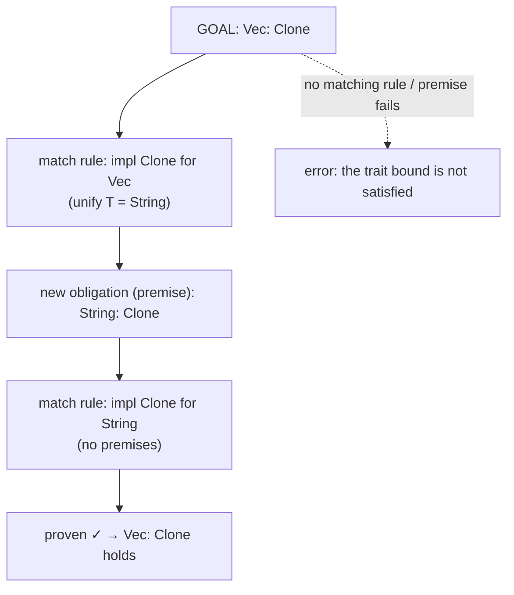
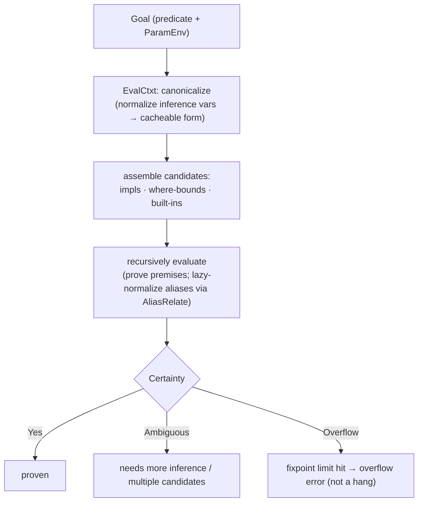
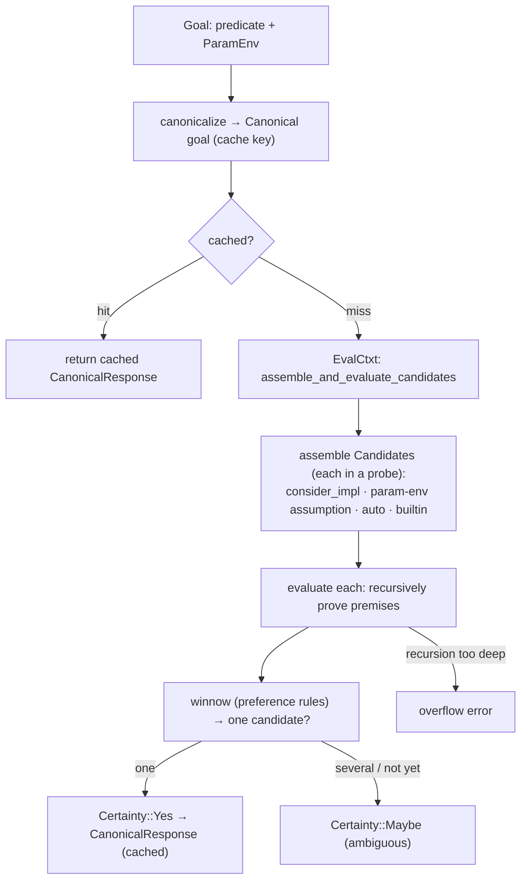
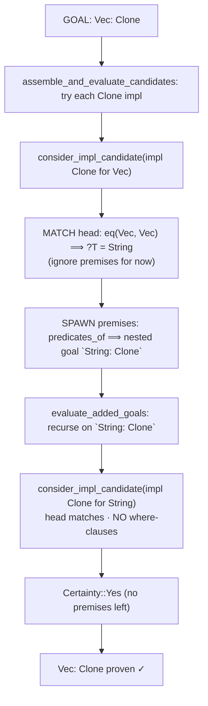
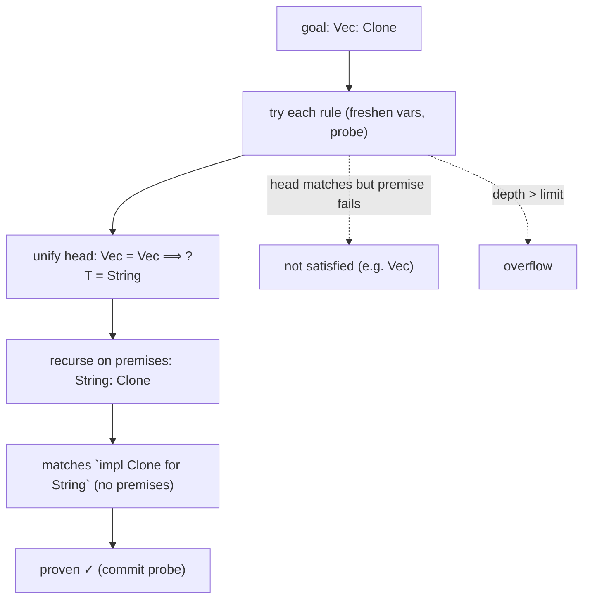

```admonish abstract title="What you'll learn"
- Why a trait is a *proposition* (a bound), not a base class, so proving `T: Display` is theorem proving in the Chapter 1 sense, run as Prolog-style resolution over `impl`s as Horn-clause rules.
- The atom of trait solving (the [`Obligation`](../glossary.md#obligation) / next-gen `Goal`: a `Predicate` plus a [`ParamEnv`](../glossary.md#paramenv)), where candidates come from (impls, `where`-bounds, built-ins), and how [**coherence**](../glossary.md#coherence) (overlap + orphan rules) guarantees at most one applies.
- The next-gen solver's architecture in [`rustc_next_trait_solver`](../glossary.md#trait-solver): `EvalCtxt`, `assemble_and_evaluate_candidates`, **canonicalization** as the cache key tying trait solving into the Part 0 [query system](../glossary.md#query), and `Certainty::Yes`/`Maybe`/overflow.
- How cycles are tamed by a **search graph** iterated to a fixpoint, and how associated types are handled by **lazy normalization** via deferred `AliasRelate` / `NormalizesTo` goals.
- How `consider_impl_candidate` applies a Horn clause in code: instantiate the impl with fresh args, **match** the head with `eq`, **spawn** the `where` clauses as nested goals, and **recurse**, proving `Vec<String>: Clone` through its `String: Clone` premise.
- How the **fulfillment loop** (`ObligationCtxt`) drives obligations to completion interleaved with inference, so `Maybe` means "retry later," not failure.
```

## 12.1 Traits and the Trait Solver

### The questions inference left unanswered

Chapter 11 ended on a debt. Every time the type checker unified two types, the resulting `InferOk` came back carrying **obligations**, little statements like "`String: Display` must hold" or "`?T: Add<?U>` must hold", and we did nothing with them but drop them in a queue. This chapter empties that queue. **Trait solving** is the subsystem that *proves* those statements: that a given type really does implement a given trait, by finding the `impl` (or the assumed bound) that makes it so, recursively checking whatever *that* requires. It is the engine beneath every `5.to_string()`, every `T: Clone`, every `?`, every `for`. If this engine returns the wrong answer, generic code either fails to compile or compiles to the wrong impl.

### What a trait *is*: a bound, not a base class

It helps to fix what a trait *is*, because the OOP-flavored intuition ("a trait is like an interface") undersells it. A **trait** is a named set of requirements (methods, associated types, associated constants) that a type may **implement** via an `impl` block. But the load-bearing role of traits in Rust is as **bounds** on generics: `fn print_all<T: Display>(xs: &[T])` does not take "a Display object"; it takes any `T` *for which the compiler can prove* `T: Display`, and is compiled knowing only that proof exists. A trait bound is a *proposition* about a type, and the question "does `T: Display` hold here?" is one the compiler must *answer with a proof*. This reframes the whole subsystem: trait solving is theorem proving, the Chapter 1 framing of rustc as prover applied concretely.

### The unit of work: the obligation

The atom of trait solving is the **obligation** (in the next-gen solver, a `Goal`): a predicate the compiler must prove, paired with the environment of assumptions it may use. The verified description is precise: a `Goal` is "a statement, i.e. predicate, we want to prove given some assumptions, i.e. `param_env`." The predicate is usually a trait bound (`String: Display`), sometimes an associated-type equality or a region constraint. The assumptions are the `ParamEnv` of §11.2, the `where` clauses in scope, which the solver may take *as given*. Proving `T: Clone` inside `fn f<T: Clone>()` is trivial: `T: Clone` is *assumed* in the `ParamEnv`. Proving `String: Clone` requires *finding the `impl`*. Same machinery, different source of truth.

### Trait solving is logic programming

Trait solving is **logic programming**, the same model as Prolog. The pieces map directly:

- An **`impl` block** is a *rule* (a Horn clause). `impl<T: Clone> Clone for Vec<T>` reads as: "`Vec<T>: Clone` is provable *if* `T: Clone` is provable." The `where` clauses are the rule's premises.
- A trait **bound to prove** is a *query* (a goal). `Vec<String>: Clone` is the query.
- **Proving** a goal means finding a rule whose head matches and then *recursively proving its premises*. `Vec<String>: Clone` matches the `Vec` impl, which demands `String: Clone`, which matches `impl Clone for String` with no premises, proven.

The LWN description of the new solver captures the mechanism exactly: for each implementation that must be found, the solver decides whether it is best resolved through an `impl` or a `where`-bound; these "can depend on other trait implementations existing... in which case the compiler adds them to a work list," and "the compiler keeps taking obligations from the work list and processing them until they have all been eliminated. If they cannot be, an error is indicated." That is Prolog's resolution loop, in a compiler. The work list of obligations is the proof search.




### Where candidates come from

When the solver tries to prove `?T: SomeTrait`, it gathers **candidates**, the possible ways the goal could be satisfied, and this is where the verified "candidate assembly" of the solver lives. The main sources:

- **`impl` blocks**: any `impl SomeTrait for X` whose head can unify with the goal. This includes **blanket impls** like `impl<T: Display> ToString for T`, which is why *every* `Display` type gets `.to_string()`: the blanket impl is a candidate for any `T`.
- **`where`-bounds**: if the `ParamEnv` assumes `T: SomeTrait`, that assumption is a candidate (the trivial proof above).
- **Built-in / auto traits and other special rules**: `Sized`, closures' `Fn` impls, and so on, which the compiler knows intrinsically.

Often more than one candidate applies, and the solver has *preference rules*: the verified notes describe preferring `where`-bounds over alias-bounds in general (and the reverse for marker traits). When candidates genuinely conflict in a way that cannot be resolved, that is an ambiguity error; when none apply, "the trait bound is not satisfied."

```admonish tip title="Pro-Tip, the trait bound X: Trait is not satisfied is a failed proof search"
That ubiquitous error is the solver reporting that it ran the proof search above and found *no* candidate: no `impl` whose head matches `X`, and no `where`-bound assuming it. The "the following other types implement the trait" list it often prints is the solver showing you the `impl` heads it *did* find, none of which unified with your `X`. The fix is to make one of them apply: add the missing `impl`, add a `where T: Trait` bound (turn it into an assumption), or change `X` to a type an existing `impl` covers. Reading the error as "proof search found no rule" tells you the three ways to give it one.
```

### Coherence: at most one answer

A proof search could, in principle, find *several* `impl`s that satisfy a goal. And for Rust's guarantees, that would be a disaster: which `impl`'s method does `x.clone()` call? Rust forbids it. The **coherence** rules guarantee that for any given type and trait there is **at most one** applicable `impl`, enforced by two sub-rules: the **overlap check** (no two `impl`s may apply to the same type) and the **orphan rule** (you may only `impl` a trait for a type if you *own* the trait or the type, so two different crates cannot both add conflicting impls). Coherence is what makes the proof search's answer *unique* and therefore *meaningful*. It is why trait method resolution is unambiguous across the entire crate graph, and why "trait solving" can speak of *the* impl rather than *an* impl. (The next-gen solver, the verified goals note, is already in production *for coherence* specifically.)

### The hard part: cycles, and why there is a new solver

The proof search has a lurking difficulty the LWN article highlights: the obligations "can form a loop." Proving `A: Trait` might require proving `B: Trait`, which requires `A: Trait` again, a cycle. Naively, the solver loops forever. Some cycles are genuine errors; others are *legitimate* and should succeed (this is **coinduction**: for certain traits, "assume it holds and check consistency" is the correct semantics, as with auto traits on recursive types). Handling cycles correctly, along with associated-type **normalization**, higher-ranked bounds, and a pile of soundness corner cases, is exactly what the old trait solver did *badly*: its structure made the fixes "prohibitively difficult," in the project's own words.

That is the motivation for the **next-generation trait solver**, the engine this book treats as primary (per its 2026 currency target). It is a ground-up reimplementation in `rustc_next_trait_solver`, designed to "replace the existing implementations of `select` and `fulfill`," to fix soundness bugs, enable stalled features (coinductive semantics, better higher-ranked handling), and improve compile times. Verified specifics: its core is the `EvalCtxt`, which canonicalizes each goal (rewrites its inference variables into a normal form so identical queries share a cache), assembles candidates, and recursively evaluates the goal, returning a `Certainty` of `Yes` or `Maybe` (with `MaybeCause::Ambiguity` or `MaybeCause::Overflow`); it handles associated types by **lazy normalization** via a separate `AliasRelate` goal; and it bounds cycles with a **fixpoint iteration** limit that reports *overflow* rather than hanging. The solver is enabled per-inference-context (`with_next_trait_solver`, or `-Znext-solver`), and is being readied to replace the old one [VERIFY status against current rustc].




```admonish warning title="Warning, trait solving and inference are mutually recursive, not sequential"
It is tempting to picture "first infer all the types, then solve all the traits." That is wrong, and the error mode is real. Proving `?T: Clone` is impossible while `?T` is unknown. The solver returns *ambiguous*, asking inference to make progress; meanwhile, solving a trait goal can *constrain* an inference variable (proving `?T: Iterator` might fix `?T`'s `Item`), feeding back into inference. The two run in an interleaved loop, which is why §11.2 enrolled obligations in a *fulfillment context* re-attempted as inference advances rather than solving them on the spot. When you see "type annotations needed" *near* a trait bound, it is often this loop stalling: neither inference nor solving can make the next move without the other, and you must break the tie with an annotation. Treat inference and trait solving as one fixed-point computation, not two phases.
```

### Where this leaves us

Trait solving is the engine that discharges the obligations type inference produces, the proof that a type implements a trait. A **trait** is a *proposition* (a bound), not a base class, so proving `T: Display` is **theorem proving**, the Chapter 1 framing of rustc as prover applied concretely. The unit of work is the **obligation** (the `Goal`): a predicate to prove against a `ParamEnv` of assumptions. The method is **logic programming**: `impl`s are Horn-clause *rules* (`impl<T: Clone> Clone for Vec<T>` = "`Vec<T>: Clone` if `T: Clone`"), a bound is a *query*, and proving means matching a rule and recursively proving its premises, run as a work-list loop exactly like Prolog's resolution. Candidates come from `impl`s (including blanket impls), `where`-bounds, and built-ins, with preference rules to choose among them; **coherence** (overlap + orphan rules) guarantees *at most one* applies, making the answer unique. The hard parts (**cycles/coinduction**, associated-type **normalization**, higher-ranked bounds, soundness) motivated the **next-generation solver** in `rustc_next_trait_solver`, whose `EvalCtxt` canonicalizes goals, assembles candidates, evaluates recursively to a `Certainty`, lazily normalizes aliases, and bounds cycles with a fixpoint limit. And it all runs *interleaved* with inference, not after it.

§12.2 takes the architecture deep-dive: the `Predicate`/`Goal` representation, the `EvalCtxt` and its candidate-assembly-then-evaluate loop, how canonicalization makes goals cacheable (and ties back to the query system of Part 0), how the fulfillment context drives obligations to completion alongside inference, and where coherence checking sits. Then §12.3 reads the real evaluation of a `Vec<T>: Clone`-style goal (candidate assembly, recursion into the `where` clause) and §12.4 has you build a small Prolog-style trait solver that proves bounds by searching impl "rules."

## 12.2 The Architecture: `Goal`s, the `EvalCtxt`, and Candidate Assembly

### From a proposition to a provable query

Here is the next-generation solver's architecture: how a trait bound becomes a *canonical* query, how the `EvalCtxt` assembles and evaluates **candidates** to produce a `Certainty`, how cycles are tamed, and how the whole thing is driven, interleaved with inference, by a fulfillment loop. The throughline is a single transformation, *proposition → canonical goal → candidates → certainty*, and we follow it end to end.

### The `Goal`: a predicate plus its environment

The thing the solver proves is a `Goal`: a predicate together with the assumptions it may use. The predicate is a `Predicate`, whose `PredicateKind` enumerates everything the solver can be asked, most importantly the `Clause` kinds: a `Trait` clause (`T: Display`), a `Projection` clause (`<T as Iterator>::Item = U`, associated-type equality), and outlives clauses (`T: 'a`). A `Goal` pairs that predicate with the `ParamEnv` of §11.2, the in-scope `where` bounds it may treat as axioms. So a goal is literally "prove this `Clause`, given these assumed `Clause`s." This is the §12.1 logic-programming picture in types: the `ParamEnv` is the assumed facts, the predicate is the query, and the `impl`s in the crate are the rules.

### Canonicalization: making goals cacheable

Before the solver evaluates a goal, it **canonicalizes** it, and this is the architectural hinge that ties trait solving to Part 0. A goal in flight contains inference variables (`?T: Clone`), and `?T` is a *local* name meaningful only in the current `InferCtxt`. Two goals that are *structurally identical* up to variable renaming, `?T0: Clone` here and `?T9: Clone` there, should share work, but their raw forms differ. **Canonicalization** rewrites a goal into a normal form where inference variables are renumbered to canonical positions (`^0`, `^1`, … in first-appearance order), producing a `Canonical` goal that is *independent of the originating context*. Two equivalent goals canonicalize to the *same* key.

That key is what makes trait solving a **cached query**. The verified design routes canonical goal evaluation through the [`TyCtxt`](../glossary.md#tyctxt-tcx) query system (the docs note the canonical evaluation entry point is "a `tcx` query"), so proving `Vec<u32>: Clone` once and caching the result means the thousandth occurrence is a hash lookup. This is the Chapter 3 demand-driven machinery reaching into trait solving: a canonical goal is a query key, its `CanonicalResponse` is the cached value, and incremental compilation tracks it like any other query. In the new solver, canonicalization is pervasive, responses are canonical and nested goals share the cache through the same key form, not just at the top.

```admonish tip title="Pro-Tip, canonicalization is why a generic function's bounds are checked once, not per call"
When you call `foo::<u32>()` a hundred times, the obligation `u32: SomeBound` from `foo`'s `where` clause canonicalizes to one key and is proven once; the other ninety-nine calls hit the cache. This is a large part of why trait-heavy generic code does not have catastrophic compile times despite the proof search being, in the worst case, expensive. When you *do* see a trait-solving compile-time blowup, it is usually a goal that *fails* to canonicalize to a cache hit, often because it contains a fresh type at each site (deeply nested generics, or large associated-type projections) so every occurrence is a distinct key. Canonicalization is the performance seam of the whole subsystem.
```

### The `EvalCtxt`: assemble, then evaluate

The engine that processes a canonical goal is the `EvalCtxt`. Its core loop is `assemble_and_evaluate_candidates`, and it has exactly the two phases §12.1 anticipated.

**Assemble.** The solver gathers every `Candidate`, verified as "a possible way to prove a goal," carrying a `source` (*how* it would be proven) and a `result`. The `source` is a `CandidateSource`: an `Impl` (a matching `impl` block), a `ParamEnv` (an assumed `where`-bound), an `AliasBound`, or a `BuiltinImpl` (plus a coherence-only `CoherenceUnknowable` for the solver's intercrate mode). The assembly methods are a verified family of `consider_`* functions: `consider_impl_candidate(goal, impl_def_id)` tries to match an `impl`'s head against the goal, `probe_and_match_goal_against_assumption` tries a `where`-bound, `consider_auto_trait_candidate` handles auto traits like `Send`, and so on. Each runs inside a *probe*, a §11.2 snapshot, so a candidate can be tried speculatively and rolled back if it does not fit, without disturbing the others.

**Evaluate.** With candidates in hand, `evaluate_goal` recursively proves each one's premises, proving a `Vec<T>: Clone` candidate means recursively evaluating its `T: Clone` premise, and returns a `Certainty`: `Yes` (proven), `Maybe` (ambiguous, could hold once more inference happens, or genuinely overlapping), with overflow surfaced when the recursion exceeds the fixpoint limit. When multiple candidates survive, a step the verified code calls **winnowing** picks one (applying the §12.1 preference rules: `where`-bounds over alias-bounds, etc.); a clean single answer is success, an irreducible multiple is ambiguity. The verified selection path even *re-confirms* the winning candidate outside the `EvalCtxt` to compute the concrete `impl` details that codegen will later need.




### Taming cycles: the search graph

§12.1 flagged that obligations can form loops, and that handling them is what the new solver was built to do well. The mechanism is a **search graph** that records which goals are currently being proven up the stack. When evaluation reaches a goal already in progress, a cycle, it does not recurse forever; it treats the cycle according to the trait's semantics and iterates to a **fixpoint**. For *coinductive* situations (auto traits on recursive data, where "assume it holds and check consistency" is correct), the cycle can resolve to success; for inductive ones it cannot. The solver re-runs the affected goals until the certainty stops changing, a fixpoint, and if it does not converge within the iteration bound, it reports **overflow** rather than hanging. Handling cycles via an explicit search graph and fixpoint iteration, rather than the old solver's per-case patches, is a core reason the reimplementation exists (§12.1).

### Lazy normalization: `AliasRelate` and associated types

Associated types are the other thing the new solver handles structurally. `<T as Iterator>::Item` is an **alias**, a type that *names* another type indirectly, resolvable only by finding `T`'s `Iterator` impl. The old solver normalized these *eagerly*, which caused ordering bugs. The new solver does **lazy normalization**: rather than resolving an alias on sight, it defers the work into a separate `AliasRelate` goal, known as deferred alias relation, and a `NormalizesTo` goal that computes the alias's value only when needed. This is why §12.1 listed normalization among the hard parts: associating `::Item` with the right concrete type interacts with inference and cycles, and making it a first-class, deferrable goal is how the new architecture keeps it sound.

```admonish warning title="Warning, Maybe/ambiguous is not failure; it means ask again later"
A goal evaluating to `Certainty::Maybe` has *not* been refuted. It means the solver cannot decide *yet*, typically because an inference variable in the goal is still unconstrained (`?T: Clone` with `?T` unknown). The correct response is not to error but to *defer* and re-evaluate after inference makes progress, which is exactly what the fulfillment loop does. Treating `Maybe` as failure (or as success) is a classic trait-solver bug: report a spurious error, or accept code that later turns out unprovable. The three-way `Yes`/`No`/`Maybe` certainty is essential precisely because trait solving runs *during* inference, when "I don't know yet" is a legitimate, common, and temporary answer.
```

### The fulfillment loop: driving obligations to completion

The `EvalCtxt` proves *one* canonical goal. But type checking produces *many* obligations, and (the §12.1 Warning) they are entangled with inference. The driver that pushes them all to completion is the **fulfillment context** (exposed to typeck via the `ObligationCtxt`). It holds the pending obligations and repeatedly attempts each: an obligation that proves `Yes` is discharged; one that returns `Maybe` is *retained* and retried after more inference; one that returns `No` is an error. Because proving a goal can *constrain* inference variables (and inference progress can turn a `Maybe` into a `Yes`), the loop alternates with the `FnCtxt` walk of §11.2 until the obligation set is empty (success) or stalls with unresolvable obligations (errors, or "type annotations needed"). This is the concrete realization of §11.2's "enroll in a fulfillment context" and §12.1's "inference and solving are one fixed-point computation": the fulfillment loop *is* that fixed point.

### Decoupling: `SolverDelegate` and `rustc_type_ir`

One structural note explains a recurring oddity: the new solver lives in `rustc_next_trait_solver` and is written against an abstraction, `SolverDelegate`, and the interner-generic types of `rustc_type_ir`, rather than directly against `rustc_middle`. The reason is reuse and testability: the same solver core can be driven by `rustc` proper *and* by `rust-analyzer` or standalone tests, with the `SolverDelegate` supplying the host-specific pieces (how to make inference variables, access impls, etc.). The pattern is dependency inversion: a self-contained engine that calls out through a trait to whatever host embeds it. It is also why the solver could be "uplifted" into its own crate at all.

### How this builds, and what is next

The architecture is in hand. A trait bound becomes a `Goal`, a `Predicate` (a `Clause`: trait, projection, outlives) plus a `ParamEnv` of assumptions. The solver **canonicalizes** it, renumbering inference variables into a context-independent normal form that serves as a **query key**, tying trait solving into Part 0's cached, incremental query system, which is why a generic's bounds are proven once and reused. The `EvalCtxt` runs `assemble_and_evaluate_candidates`: assemble every `Candidate` (by `CandidateSource`: impl, param-env, auto, builtin) inside speculative probes, then recursively **evaluate** to a `Certainty` (`Yes`/`Maybe`/overflow), **winnowing** by preference rules and re-confirming the winner. Cycles are handled by a **search graph** iterating to a **fixpoint** (coinduction where appropriate, overflow if it diverges); associated types are handled by **lazy normalization** via deferred `AliasRelate`/`NormalizesTo` goals. The whole thing is driven by a **fulfillment loop** (`ObligationCtxt`) interleaved with inference (`Maybe` means "retry later," not failure), realizing the single fixed-point computation of §11.2 and §12.1. And it is decoupled behind `SolverDelegate`/`rustc_type_ir` so the engine can be reused.

§12.3 reads the real code: `assemble_and_evaluate_candidates` for a trait goal, `consider_impl_candidate` matching an `impl` head and spawning its `where`-clause obligations, and `evaluate_goal` recursing, so you can watch `Vec<T>: Clone` get proven through its `T: Clone` premise. Then §12.4 has you build a small Prolog-style solver: represent `impl`s as rules, bounds as goals, and prove them by unifying heads and recursively discharging premises, the §12.1 logic-programming model, made to run.

## 12.3 Reading the Source: Candidate Assembly and Goal Evaluation

### Watching a bound get proven

This section runs one goal through the `EvalCtxt`'s assemble-then-evaluate loop and reads the code. We will prove `Vec<String>: Clone`, the §12.1 example, and watch the two moves that matter: **matching** an `impl`'s head against the goal, and **recursing** into that `impl`'s `where` clauses as new sub-goals. The relevant source is `rustc_next_trait_solver/src/solve/`, whose module layout is itself a map of the chapter: `assembly` (shared candidate gathering), `trait_goals` / `project_goals` / `effect_goals` (per-kind candidate impls), `normalizes_to` / `alias_relate` (associated types), `eval_ctxt` (the evaluation driver), `inspect` (proof-tree introspection), and `search_graph` (cycles).

### Assembly: gathering the ways to prove the goal

Evaluating a trait goal begins with `assemble_and_evaluate_candidates`, which collects every `Candidate` (§12.2) by trying each source. The relevant assembly methods are the verified `consider_`* family declared on the goal-kind trait:

```rust
// rustc_next_trait_solver/src/solve/assembly/mod.rs (faithful; trait method declared on GoalKind, abridged)
fn consider_impl_candidate(
    ecx: &mut EvalCtxt<'_, D>,
    goal: Goal<I, Self>,
    impl_def_id: I::ImplId,
    then: impl FnOnce(&mut EvalCtxt<'_, D>, Certainty) -> QueryResult<I>,
) -> Result<Candidate<I>, NoSolution>;
// ... a `consider_*` method per candidate kind (param-env assumptions, auto traits,
//     builtin Sized, trait aliases, etc.); the full list lives in the rustc-dev-guide's
//     candidate-assembly chapter and in the source.
```

For `Vec<String>: Clone`, the solver iterates the `impl`s of `Clone` and calls `consider_impl_candidate` for each, including `impl<T: Clone> Clone for Vec<T>`. Each attempt runs inside a *probe* (a §11.2 snapshot), so a failed match leaves no trace. The ones that match become candidates; the rest are discarded with `NoSolution`.

### `consider_impl_candidate`: match the head, then spawn the premises

This is the heart of the walk, and its two-step structure *is* the §12.1 Horn-clause rule application. The spine, illustrative (the real method is declared on the `GoalKind` trait in `assembly/mod.rs` and implemented on `TraitPredicate`, `HostEffectPredicate`, and `NormalizesTo` in the sibling `trait_goals.rs` / `effect_goals.rs` / `normalizes_to/mod.rs` modules; current rustc threads completion through a `then: FnOnce(&mut EvalCtxt, Certainty) -> _` callback rather than calling `evaluate_added_goals_and_make_canonical_response` directly):

```rust
// rustc_next_trait_solver, consider_impl_candidate (illustrative spine;
// real method also does DeepReject pre-filtering and elaborates supertrait outlives)
fn consider_impl_candidate(ecx, goal, impl_def_id, then) -> Result<Candidate, NoSolution> {
    let cx = ecx.cx();
    let impl_args = ecx.fresh_args_for_item(impl_def_id); // (1) fresh vars
    let impl_trait_ref = cx.impl_trait_ref(impl_def_id).instantiate(cx, impl_args);
    ecx.probe_trait_candidate(CandidateSource::Impl(impl_def_id)).enter(|ecx| {
        ecx.eq(goal.param_env, goal.predicate.trait_ref, impl_trait_ref)?; // (2) MATCH head
        let where_clause_bounds = cx
            .predicates_of(impl_def_id.into())
            .iter_instantiated(cx, impl_args)
            .map(|pred| goal.with(cx, pred));
        ecx.add_goals(GoalSource::ImplWhereBound, where_clause_bounds); // (3) SPAWN premises
        // (4) recurse, threading completion through the `then` callback
        then(ecx, maximal_certainty)
    })
}
```

Read the four steps as the §12.1 rule `impl<T: Clone> Clone for Vec<T>` = "`Vec<T>: Clone` *if* `T: Clone`" being applied:

1. **Instantiate the rule with fresh variables.** The impl's generic `T` becomes a fresh inference variable `?T` (via `fresh_args_for_item`), so the rule can be matched against *this particular* goal without disturbing other uses of the same impl.
2. **Match the head.** `ecx.eq(goal.trait_ref, impl_trait_ref)` unifies `Vec<String>: Clone` (the goal) with `Vec<?T>: Clone` (the impl head), which, by the §11 union-find, binds `?T = String`. The dev-guide states this exactly: for impl candidates, matching "amounts to unifying the impl header (the `Self` type and the trait arguments) *while ignoring nested obligations*." Crucially, matching is *only the head*; the premises wait.
3. **Spawn the premises.** Now the head matches, the impl's `where` clauses (`predicates_of(impl_def_id)`, instantiated with the same args so `T` is `String`) are added to the `EvalCtxt` as **nested goals** via `add_goals`. For our impl, that is the single obligation `String: Clone`. (A verified PR even confirms this is *where* an impl's `where` clauses get checked, "as part of the recursive evaluate in `consider_impl_candidate`.")
4. **Recurse.** The `then` callback (whose body is supplied by the caller and typically ends in `evaluate_added_goals_and_make_canonical_response`) proves the nested goals. Proving `String: Clone` runs this *same* machinery one level down: assemble `Clone` impls, match `impl Clone for String` (no `where` clauses, no premises), succeed. With the premise discharged, the candidate is `Certainty::Yes`.

The recursion is the proof tree of §12.1 built depth-first: matching the head of one rule spawns its premises as sub-goals, each proven by matching another rule's head, until a rule with no premises (a "fact" like `impl Clone for String`) closes a branch. `Vec<String>: Clone` is proven precisely *because* `String: Clone` is, head-match, then premise, all the way down.




```admonish tip title="Pro-Tip, match-the-head-then-check-premises explains impl exists but bound not satisfied"
A confusing error class is "`Vec<NotClone>: Clone` is not satisfied" *even though* `impl Clone for Vec<T>` plainly exists. The walk above explains it: step 2 (match the head `Vec<?T>`) *succeeds*, the impl applies to *any* `Vec`, but step 3 spawns the premise `NotClone: Clone`, and step 4 *fails* to prove it. The impl matched; its `where` clause did not. The compiler's "the trait bound `NotClone: Clone` is not satisfied" points at the *premise*, not the head, which is why the error names a type you may not have written directly. Reading the two-step structure tells you to look at the `impl`'s `where` clauses, not whether the `impl` exists.
```

### Winnowing: when more than one candidate matches

Often several candidates survive assembly, a `where`-bound *and* a blanket impl might both match. The verified procedure: if the candidate set is a singleton, the answer is immediate; otherwise the solver **winnows**. The dev-guide describes it precisely: winnowing uses the recursive evaluation to check whether each candidate's nested obligations *may* apply, and if more than one still survives, `candidate_should_be_dropped_in_favor_of` applies the §12.1/§12.2 preference rules (prefer `where`-bounds over alias-bounds, and so on) to discard the dominated ones. If exactly one remains, that is the answer; if several genuinely tie, the goal is **ambiguous** (`Certainty::Maybe`), to be retried as inference progresses (the §12.2 Warning). Winnowing is how the solver turns "several rules could apply" into either one definite answer or an honest "ambiguous."

### The result: a `Selection` carrying nested obligations

When a goal proves `Yes`, the solver does not just return a boolean: it produces, for the typeck/codegen consumers, a record of *how* it was proven: which `impl` was chosen and the nested obligations attached to it. The verified description of the old solver's `Selection`/`impl_source` captures the shape that survives: it "identifies a particular impl in the source, along with a set of generic parameters," with a "nested vector corresponding to the nested obligations attached to the impl's type parameters." This is what [monomorphization](../glossary.md#monomorphization) (Chapter 17) and the codegen chapters that follow will eventually need: to generate the code for `xs.clone()` where `xs: Vec<String>`, they must know *which* `Clone` impl was selected (`Vec`'s) and that *its* `T: Clone` was satisfied by `String`'s impl. The proof tree is not discarded; its shape, chosen impl plus discharged premises, is the answer.

```admonish warning title="Warning, matching the head ignores premises on purpose; don't conflate the two phases"
A subtle source of solver bugs (and of confusion reading the code) is collapsing step 2 and step 3. Matching deliberately unifies *only* the impl header and ignores the `where` clauses, because you must first know the head applies before it even makes sense to check the premises, and because checking premises can require inference progress that head-matching provides. If you "helpfully" checked `where` clauses during matching, you would reject candidates that are ambiguous-but-valid and break the interleaving with inference (§12.2). The two-phase structure (match cheaply and locally, then evaluate premises recursively) is load-bearing, not an accident; it is what lets the solver assemble a candidate set first and *then* decide, which is exactly what winnowing needs.
```

### How this builds, and what is next

We have read a bound get proven. `assemble_and_evaluate_candidates` gathers candidates by trying each source's `consider_`* method inside speculative probes. `consider_impl_candidate` is the §12.1 Horn-clause rule in code: instantiate the impl with fresh variables, **match** the goal against the impl's *head* with `eq` (binding `?T = String`, ignoring premises), then **spawn** the impl's `where` clauses as **nested goals** and **recurse** to discharge them, so `Vec<String>: Clone` is proven exactly because its premise `String: Clone` is, head-match by head-match down a proof tree. When several candidates match, **winnowing** (`candidate_should_be_dropped_in_favor_of`) applies preference rules to reach one answer or an honest ambiguity. The proven goal yields a `Selection` recording the chosen impl and its discharged nested obligations, the data codegen will need. The two-phase match-then-evaluate structure is deliberate and load-bearing.

§12.4 turns this into a build. You will write a small **Prolog-style trait solver**: represent each `impl` as a *rule* (a head plus premise bounds), each query as a *goal*, and prove a goal by finding a rule whose head unifies with it and recursively proving its premises, with a depth limit standing in for overflow. Feed it the rules for `Clone` on `String` and `Vec<T>`, ask it `Vec<String>: Clone`, and watch it build the proof tree you just read, the §12.1 logic-programming model, running in code you wrote.

## 12.4 Hands-On Lab: Build a Prolog-Style Trait Solver

### Proving bounds by searching rules

This lab builds the engine at the center of the chapter: a **trait solver** that proves a bound like `Vec<String>: Clone` by treating `impl`s as logical **rules** and running the Prolog-style proof search of §12.1, exactly as `consider_impl_candidate` did in §12.3. You will represent each `impl` as *a head plus premise bounds*, prove a goal by finding a rule whose head **unifies** with it and recursively proving the instantiated premises, and cap the recursion with a **depth limit** standing in for the real solver's overflow. When your solver prints the proof tree for `Vec<String>: Clone` (matching the `Vec` rule, then the `String` rule) and *rejects* `Vec<NotClone>: Clone` because a premise fails, you will have built the same head-match-then-recurse loop the real solver runs, in miniature.

`cargo new`, pure `std`. This reuses the union-find idea from §11.4 in a lighter form (substitution by variable id).

### Terms: types and trait references

We need a tiny type language (with variables, as §11.4) and a **trait reference**, "type implements trait":

```rust
// src/main.rs
use std::collections::HashMap;

/// A type term: a concrete constructor with arguments, or a variable.
#[derive(Clone, Debug, PartialEq)]
enum Ty {
    Con(String, Vec<Ty>), // String, i32, Vec<T>  →  Con("Vec", [Var(0)])
    // a rule's generic parameter, e.g. the T in impl<T> … for Vec<T>
    Var(u32),
}

fn con(name: &str, args: Vec<Ty>) -> Ty { Ty::Con(name.into(), args) }
fn atom(name: &str) -> Ty { con(name, vec![]) }

/// A trait reference: `ty : trait`.  (We ignore trait generic args for simplicity.)
#[derive(Clone, Debug, PartialEq)]
struct TraitRef { ty: Ty, trait_name: String }

fn bound(ty: Ty, trait_name: &str) -> TraitRef { TraitRef { ty, trait_name: trait_name.into() } }

// Display impls so the proof trace reads like the diagnostics rustc prints
// (`Vec<String>: Clone` rather than `TraitRef { ty: Con(...), ... }`).
impl std::fmt::Display for Ty {
    fn fmt(&self, f: &mut std::fmt::Formatter<'_>) -> std::fmt::Result {
        match self {
            Ty::Con(name, args) if args.is_empty() => write!(f, "{name}"),
            Ty::Con(name, args) => {
                write!(f, "{name}<")?;
                for (i, a) in args.iter().enumerate() {
                    if i > 0 { write!(f, ", ")?; }
                    write!(f, "{a}")?;
                }
                write!(f, ">")
            }
            Ty::Var(n) => write!(f, "?T{n}"),
        }
    }
}

impl std::fmt::Display for TraitRef {
    fn fmt(&self, f: &mut std::fmt::Formatter<'_>) -> std::fmt::Result {
        write!(f, "{}: {}", self.ty, self.trait_name)
    }
}
```

### Rules: `impl`s as Horn clauses

An `impl` is a **rule**: a head (`Vec<T>: Clone`) and premises (`T: Clone`). This is the §12.1/§12.3 representation exactly, `impl<T: Clone> Clone for Vec<T>` is a head with one premise:

```rust
/// impl<vars> Trait for Head where <premises>
struct Rule { head: TraitRef, premises: Vec<TraitRef> }

/// The "crate": all impls in scope, as rules.
fn rules() -> Vec<Rule> {
    vec![
        // impl Clone for String { } , a FACT (no premises)
        Rule { head: bound(atom("String"), "Clone"), premises: vec![] },
        // impl Clone for i32 { } , a FACT
        Rule { head: bound(atom("i32"), "Clone"), premises: vec![] },
        // impl<T: Clone> Clone for Vec<T> { } , a RULE (premise T: Clone)
        Rule {
            head:     bound(con("Vec", vec![Ty::Var(0)]), "Clone"),
            premises: vec![bound(Ty::Var(0), "Clone")],
        },
        // NOTE: there is deliberately NO `impl Clone for NotClone`.
    ]
}
```

### Unification: matching a goal against a rule head

To apply a rule we must unify the goal's type with the rule's head type, building a **substitution** (variable id → type). This is §11.4's `unify` and §12.3's `eq`, the head-match of `consider_impl_candidate`:

```rust
type Subst = HashMap<u32, Ty>;

/// Resolve a type through the current substitution (union-find `find`, §11.3).
fn resolve(t: &Ty, s: &Subst) -> Ty {
    match t {
        Ty::Var(n) => match s.get(n) { Some(b) => resolve(b, s), None => Ty::Var(*n) },
        Ty::Con(name, args) => Ty::Con(name.clone(), args.iter().map(|a| resolve(a, s)).collect()),
    }
}

/// Unify two types, extending the substitution. Returns false on a clash.
fn unify(a: &Ty, b: &Ty, s: &mut Subst) -> bool {
    let (a, b) = (resolve(a, s), resolve(b, s));
    match (&a, &b) {
        (Ty::Var(n), other) | (other, Ty::Var(n)) => {
            // guard against inserting `n -> Var(n)` (same var on both sides), which would
            // make `resolve` recurse forever
            if other != &Ty::Var(*n) { s.insert(*n, other.clone()); }
            true
        }
        (Ty::Con(n1, a1), Ty::Con(n2, a2)) => {
            n1 == n2 && a1.len() == a2.len()
                // unify args structurally
                && a1.iter().zip(a2).all(|(x, y)| unify(x, y, s))
        }
    }
}
```

### The solver: match a head, recurse on premises, with a depth limit

Here is the §12.3 walk, whole. A `Goal` bundles the predicate to prove with a `param_env` of assumed bounds (§12.1/§12.2), so a `where T: Clone` bound can succeed *immediately* against the assumption set rather than needing an impl. To prove a goal: first check the `param_env`; otherwise gather all rules whose head matches the trait via `for_each_relevant_impl`, **freshen** each rule's variables (so two uses of the `Vec` rule don't clash, the `fresh_args_for_item` of §12.3), and ask `consider_impl_candidate` to **match the head** and **recurse** on premises. The per-candidate body returns the trial substitution on success rather than committing; the outer loop collects every surviving candidate so we can see "more than one rule applies" as ambiguity rather than "first wins." A `depth` budget stands in for the solver's fixpoint/overflow limit (§12.2):

```rust
/// A query bundle: the predicate to prove, plus the assumed bounds in scope (§12.1/§12.2).
/// `param_env` mirrors rustc's `Goal { param_env, predicate }` at
/// `rustc_type_ir/src/solve/mod.rs:43`; an empty `param_env` means "no assumptions."
#[derive(Clone)]
struct Goal { param_env: Vec<TraitRef>, predicate: TraitRef }

fn goal(predicate: TraitRef) -> Goal { Goal { param_env: vec![], predicate } }

/// Give a rule's variables fresh ids, so each use is independent (§12.3 fresh_args).
fn freshen(rule: &Rule, counter: &mut u32) -> Rule {
    let mut remap: HashMap<u32, u32> = HashMap::new();
    fn fresh_ty(t: &Ty, remap: &mut HashMap<u32,u32>, c: &mut u32) -> Ty {
        match t {
            Ty::Var(n) => Ty::Var(*remap.entry(*n).or_insert_with(|| { let id = *c; *c += 1; id })),
            Ty::Con(name, args) => Ty::Con(name.clone(), args.iter().map(|a| fresh_ty(a, remap, c)).collect()),
        }
    }
    fn fresh_ref(r: &TraitRef, remap: &mut HashMap<u32,u32>, c: &mut u32) -> TraitRef {
        TraitRef { ty: fresh_ty(&r.ty, remap, c), trait_name: r.trait_name.clone() }
    }
    Rule {
        head:     fresh_ref(&rule.head, &mut remap, counter),
        premises: rule.premises.iter().map(|p| fresh_ref(p, &mut remap, counter)).collect(),
    }
}

struct Solver { rules: Vec<Rule>, counter: u32 }

/// Real rustc has both a recursion limit (`tcx.recursion_limit()`) AND a separate
/// `FIXPOINT_STEP_LIMIT = 8` for search-graph fixpoint iterations; we conflate them here.
const RECURSION_LIMIT: usize = 10;

impl Solver {
    /// rustc's `for_each_relevant_impl` indexes impls by both trait DefId AND self type;
    /// we only index by trait_name. Real rustc also does a `DeepRejectCtxt::args_may_unify`
    /// fast-reject before `fresh_args_for_item`, so non-matching impls never enter the
    /// probe loop at all.
    fn for_each_relevant_impl(&self, trait_name: &str) -> Vec<&Rule> {
        self.rules.iter().filter(|r| r.head.trait_name == trait_name).collect()
    }

    /// The §12.3 outer loop. Tries every relevant rule, *collects* the trial substitutions
    /// produced by `consider_impl_candidate`, then commits if exactly one survives;
    /// reports ambiguity if several do, "no impl" if none do. Real rustc returns
    /// `Vec<Candidate<I>>` here and a separate winnowing step picks one; we model that
    /// directly so Extension #3 is about *preference rules*, not retro-fitting collection.
    fn assemble_and_evaluate_candidates(&mut self, goal: &Goal, s: &mut Subst, depth: usize) -> bool {
        let g = TraitRef { ty: resolve(&goal.predicate.ty, s), trait_name: goal.predicate.trait_name.clone() };
        let pad = "  ".repeat(depth);
        // OVERFLOW guard (§12.2 fixpoint limit)
        if depth > RECURSION_LIMIT {
            println!("{pad}overflow proving {}", g);
            // Real rustc returns `Certainty::Maybe { cause: MaybeCause::Overflow { .. } }` here,
            // not a flat "no"; see §12.2, a Maybe means "retry once inference advances",
            // whereas our bool conflates the two.
            return false;
        }
        // ASSUMPTION candidate: does any in-scope `where`-bound match the goal directly?
        // (Real rustc tries `ParamEnv` candidates alongside impls; we check them first
        // for clarity. A `where T: Clone` inside `fn f<T: Clone>()` lands here.)
        for assumption in &goal.param_env {
            let mut trial = s.clone();
            if assumption.trait_name == g.trait_name && unify(&g.ty, &assumption.ty, &mut trial) {
                println!("{pad}{}: via param_env assumption {}", g, assumption);
                *s = trial;
                return true;
            }
        }
        // IMPL candidates: ask the rule store for every rule whose trait matches, freshen
        // each, and try them all. We collect *all* surviving trials so we can see "more
        // than one rule applies" rather than silently picking the first.
        let relevant: Vec<Rule> = self.for_each_relevant_impl(&g.trait_name)
            .into_iter()
            .map(|r| freshen(r, &mut self.counter))
            .collect();
        let mut survivors: Vec<Subst> = Vec::new();
        for rule in &relevant {
            if let Some(trial) = self.consider_impl_candidate(&g, rule, s, &goal.param_env, depth) {
                survivors.push(trial);
            }
        }
        match survivors.len() {
            0 => { println!("{pad}{}: NO matching impl/premise failed", g); false }
            1 => { *s = survivors.into_iter().next().unwrap(); true } // commit the lone survivor
            n => {
                // Real rustc's `Certainty::Maybe { cause: Ambiguity }`; Extension #3 adds
                // preference rules (the §12.2/§12.3 "winnowing") to break the tie.
                println!("{pad}{}: ambiguous, {} candidates match", g, n);
                false
            }
        }
    }

    /// The §12.3 per-candidate body: probe-snapshot, unify the head, spawn and recurse
    /// on the premises, *return* the trial subst on success rather than committing.
    /// Mirrors rustc's `<TraitPredicate as GoalKind>::consider_impl_candidate` in
    /// `trait_goals.rs:56`, except real rustc returns `Result<Candidate<I>, NoSolution>`
    /// and the outer loop winnows the surviving candidates.
    fn consider_impl_candidate(&mut self, g: &TraitRef, rule: &Rule, s: &Subst,
                               param_env: &[TraitRef], depth: usize) -> Option<Subst> {
        let pad = "  ".repeat(depth);
        // PROBE: snapshot, mutate trial, return on success (§11.2/§12.3 ecx.probe_trait_candidate).
        let mut snapshot = s.clone();
        // MATCH THE HEAD. (This is §12.3's `ecx.eq(goal.predicate.trait_ref, impl_trait_ref)`;
        // §11.4 calls the same operation `unify`.)
        if unify(&g.ty, &rule.head.ty, &mut snapshot) {
            println!("{pad}{}: via impl with {} premise(s)", g, rule.premises.len());
            // SPAWN + RECURSE on premises. Real rustc enqueues premises via
            // `ecx.add_goals(GoalSource::ImplWhereBound, where_clause_bounds)` and drains
            // them later in `evaluate_added_goals_and_make_canonical_response`; we just
            // recurse on the spot. The premise inherits the goal's `param_env`.
            let all = rule.premises.iter().all(|p| {
                let sub = Goal { param_env: param_env.to_vec(), predicate: p.clone() };
                self.assemble_and_evaluate_candidates(&sub, &mut snapshot, depth + 1)
            });
            if all { return Some(snapshot); }
        }
        None
    }
}
```

### Running it

```rust
fn main() {
    // start counter above rule-var ids (which start at 0) so freshened vars don't collide
    let mut solver = Solver { rules: rules(), counter: 100 };

    println!("=== prove Vec<String>: Clone ===");
    let g1 = goal(bound(con("Vec", vec![atom("String")]), "Clone"));
    let ok = solver.assemble_and_evaluate_candidates(&g1, &mut HashMap::new(), 0);
    println!("RESULT: {}\n", if ok { "PROVEN ✓" } else { "not satisfied ✗" });

    println!("=== prove Vec<NotClone>: Clone ===");
    let g2 = goal(bound(con("Vec", vec![atom("NotClone")]), "Clone"));
    let ok2 = solver.assemble_and_evaluate_candidates(&g2, &mut HashMap::new(), 0);
    println!("RESULT: {}\n", if ok2 { "PROVEN ✓" } else { "not satisfied ✗" });

    println!("=== prove Vec<Vec<i32>>: Clone (nested) ===");
    let g3 = goal(bound(con("Vec", vec![con("Vec", vec![atom("i32")])]), "Clone"));
    let ok3 = solver.assemble_and_evaluate_candidates(&g3, &mut HashMap::new(), 0);
    println!("RESULT: {}", if ok3 { "PROVEN ✓" } else { "not satisfied ✗" });
}
```

````admonish example title="Expected output" collapsible=true
```text
=== prove Vec<String>: Clone ===
Vec<String>: Clone: via impl with 1 premise(s)
  String: Clone: via impl with 0 premise(s)
RESULT: PROVEN ✓

=== prove Vec<NotClone>: Clone ===
Vec<NotClone>: Clone: via impl with 1 premise(s)
  NotClone: Clone: NO matching impl/premise failed
Vec<NotClone>: Clone: NO matching impl/premise failed
RESULT: not satisfied ✗

=== prove Vec<Vec<i32>>: Clone (nested) ===
Vec<Vec<i32>>: Clone: via impl with 1 premise(s)
  Vec<i32>: Clone: via impl with 1 premise(s)
    i32: Clone: via impl with 0 premise(s)
RESULT: PROVEN ✓
```
````

There is the proof tree of §12.3, built by code you wrote. `Vec<String>: Clone` matches the `Vec` rule's head (binding the rule's `T` to `String`), spawns the premise `String: Clone`, which matches the `String` fact with no premises, proven. `Vec<NotClone>: Clone` matches the *head* (the `Vec` impl applies to any `Vec`) but its premise `NotClone: Clone` finds no rule: exactly the §12.3 Pro-Tip's "impl exists but the bound is not satisfied," and the error points at the *premise*. And `Vec<Vec<i32>>: Clone` recurses twice, proving the bound structurally, the work-list of §12.1 as a call stack.




### What the lab stripped from real rustc

The lab condensed an `impl` into a `Rule` and a bound into a `TraitRef`. The real solver fans the same two ideas across `[rustc_type_ir/src/predicate.rs](https://github.com/rust-lang/rust/blob/1.95.0/compiler/rustc_type_ir/src/predicate.rs)`, `[rustc_type_ir/src/predicate_kind.rs](https://github.com/rust-lang/rust/blob/1.95.0/compiler/rustc_type_ir/src/predicate_kind.rs)`, `[rustc_middle/src/ty/predicate.rs](https://github.com/rust-lang/rust/blob/1.95.0/compiler/rustc_middle/src/ty/predicate.rs)`, `[rustc_type_ir/src/solve/mod.rs](https://github.com/rust-lang/rust/blob/1.95.0/compiler/rustc_type_ir/src/solve/mod.rs)`, and `[rustc_infer/src/traits/mod.rs](https://github.com/rust-lang/rust/blob/1.95.0/compiler/rustc_infer/src/traits/mod.rs)`. What the real solver adds on top of the lab's `Rule`, `Goal`, `TraitRef`, and a `bool`-returning `assemble_and_evaluate_candidates`:

- `TraitRef<I: Interner>` parametrizes over `TyCtxt`/`chalk` and carries `I::TraitId` + `I::GenericArgs` (the [interner](../glossary.md#interner)'s `DefId`-equivalent) with lifetime/type/const distinction. The lab's `TraitRef { ty, trait_name: String }` flattens all that.
- `ClauseKind<I>` has nine variants (`Trait`, `Projection`, `RegionOutlives`, `TypeOutlives`, `ConstArgHasType`, `WellFormed`, `ConstEvaluatable`, `HostEffect`, `UnstableFeature`). The lab has one (the `Trait` case), and `Rule` is a hard-coded `Clause(Trait(...))` plus where-clause `Clause`s.
- `Predicate<'tcx>` / `Clause<'tcx>` are `Interned<'tcx, WithCachedTypeInfo<Binder<PredicateKind>>>` for §4.2 pointer-equality, higher-ranked binders (`for<'a> T: Fn(&'a u8)`), and cached flags. The lab passes `TraitRef` by value.
- `Goal<I, P> { param_env, predicate }` plus `Obligation<'tcx, T>` (predicate + `ObligationCause` + env + recursion depth) wrap the query with canonicalization and the span needed for "the trait bound is not satisfied" diagnostics. The lab's `Goal { param_env: Vec<TraitRef>, predicate: TraitRef }` mirrors the shape but skips the canonical/span machinery.
- `Certainty::Yes` vs `Certainty::Maybe { cause: MaybeCause::Ambiguity | MaybeCause::Overflow { .. }, .. }` returns a third answer feeding back into inference. The lab returns `bool`.
- `consider_impl_candidate` over `EvalCtxt`'s candidate list adds canonicalization, the cycle-breaking search graph, winnowing, and the global evaluation cache. The lab's `for rule in rules { unify head; recurse on premises }` skips all four.

What the lab strips is what makes the real solver fast and diagnostic; the three moves (unify head, spawn premises, bound depth) are the same three `EvalCtxt::evaluate_goal` makes.

### Extension exercises

1. **Blanket impls (`ToString`).** Add `impl<T: Display> ToString for T` as a rule whose head is `Var(0): ToString` with premise `Var(0): Display`, plus facts `String: Display`, `i32: Display`. Prove `i32: ToString` and watch the blanket rule match *any* type, then gate on `Display`, the §12.1 mechanism behind `.to_string()`.
2. **`where`-bound assumptions (a `ParamEnv`).** The `Goal { param_env, predicate }` struct already carries the assumption set; set `param_env: vec![bound(Ty::Var(0), "Clone")]` to model `fn f<T: Clone>()` and try to prove `Var(0): Clone`. (Real rustc tries assumption candidates *alongside* impls and then winnows; the lab currently checks the `param_env` first for clarity. Move that check into the candidate-collection loop and observe the ambiguity.)
3. **Winnowing.** Add a second rule whose head also matches some goal, and a preference function `should_drop(a, b)` that prefers assumptions over impls (§12.2/§12.3). Make `assemble_and_evaluate_candidates` collect *all* matching candidates, then winnow to one, or report ambiguity if two genuinely tie.
4. **Associated types.** Add a `Projection` goal `<Ty as Trait>::Assoc = ?X` and resolve it by looking up the chosen impl's associated-type definition, a toy of the `NormalizesTo`/`AliasRelate` lazy normalization of §12.2.
5. **Return a `Selection`.** Change `assemble_and_evaluate_candidates` to return `Option<Selection>` where `enum Selection { Impl { rule_idx: usize, nested: Vec<Selection> }, Assumption(usize) }`, so a successful proof yields the *proof tree* (which rule was chosen at each step, and the discharged premises beneath it) rather than just `true`. This is what monomorphization (Chapter 17) consumes; the §12.3 closing prose ("the proof tree is not discarded; its shape, chosen impl plus discharged premises, is the answer") becomes a runnable data structure. *What you've learned:* rustc's analogue is `CandidateSource<I>` at `rustc_type_ir/src/solve/mod.rs::CandidateSource@59807616e1fa` and the consumer-side `Selection<'tcx>` at `rustc_infer/src/traits/mod.rs::Selection@59807616e1fa`, both built precisely so codegen can later ask *which* impl was chosen, not just whether one exists.

### Where Chapter 12 leaves us

Chapter 12 is complete. §12.1 reframed traits as *propositions* and trait solving as *theorem proving* by logic programming (impls as Horn-clause rules, bounds as queries, proof as a work-list of obligations) with coherence guaranteeing a unique answer and cycles/normalization motivating the next-generation solver. §12.2 opened that solver's architecture: the `Goal` (predicate + `ParamEnv`), canonicalization tying it into Part 0's query cache, the `EvalCtxt`'s assemble-then-evaluate loop, `Certainty` with `Maybe`-means-retry, the search graph for cycles, lazy normalization via `AliasRelate`, and the fulfillment loop interleaved with inference. §12.3 read `consider_impl_candidate` matching an impl head then spawning its `where` clauses as nested goals, proving `Vec<String>: Clone` through `String: Clone`. And in this lab you built a Prolog-style solver (rules, unification, recursive premise-proving, a depth limit) that proves and refutes bounds, printing the proof tree.

With Chapter 12, the compiler can answer *every* question type inference (Chapter 11) poses: what type each expression has, and which traits those types satisfy. The middle end now *understands* the program semantically: names bound (Ch. 9), sugar removed (Ch. 10), types inferred (Ch. 11), bounds proven (Ch. 12). But understanding is not yet *verification of safety*, and one large semantic check remains before the compiler builds its executable-shaped IR. Rust's `match` must be **exhaustive**, every possible value handled, and its patterns must be sensible (no unreachable arms, no missing variants); this is checked not on the [HIR](../glossary.md#hir) but on a further-lowered, type-annotated tree called the [**THIR**](../glossary.md#thir) (Typed HIR), which exists precisely to make pattern analysis and the next lowering tractable. Chapter 13 opens there: the THIR, and the **usefulness** algorithm that decides whether a set of patterns covers all cases. The program is understood; next, its patterns are checked for completeness before it descends toward [MIR](../glossary.md#mir).

### The picture so far

Types are settled (Ch.11) and trait obligations have been proven (Ch.12). For every `T: Display` the compiler has either found an impl or assumed the bound. The proofs are the engine that makes generic Rust *sound*. Chapter 13 lowers the typed tree to THIR for the analyses that need a self-describing form: exhaustiveness, MIR construction, the `unsafe` check.

On `fn sum`, the solver discharged a small but real set of obligations: `&[i32]: IntoIterator` (so the `for` desugaring can call `into_iter`), `Iter<'_, i32>: Iterator` (so it can call `next`), and the bound on `Iterator::Item` that yields `&i32`. Three proofs, all by impl lookup against `core`, all discharged before MIR construction sees the body.

## Test yourself

```admonish question title="Anchor the chapter"
Six quick questions on the key claims of Chapter 12. Answer first, then expand the explanation. Quizzes are not graded; they are a recall checkpoint between chapters.
```

{{#quiz ../../quizzes/ch12.toml}}

---

*End of Chapter 12. Next: Chapter 13, §13.1 THIR and Exhaustiveness Checking.*