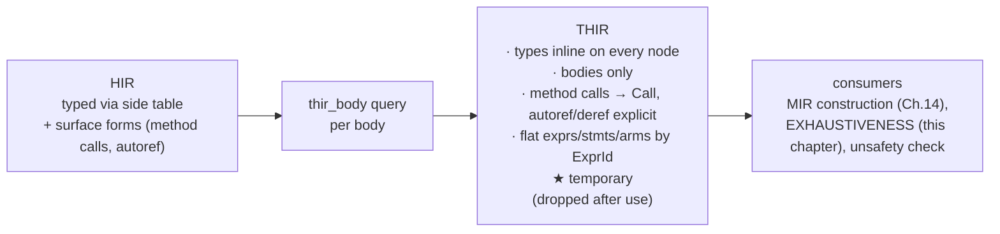
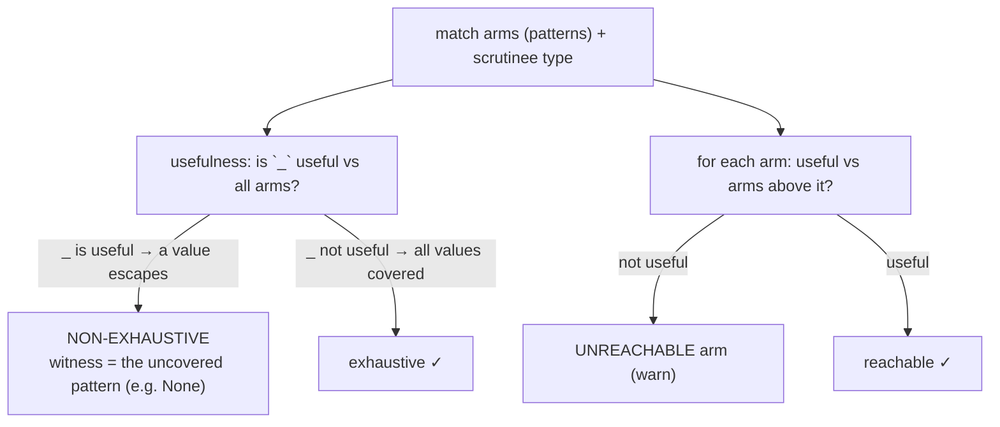
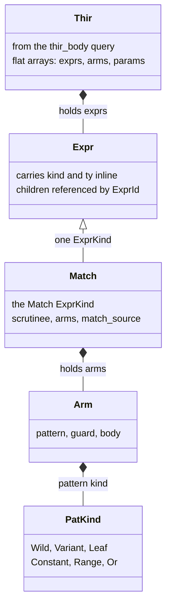
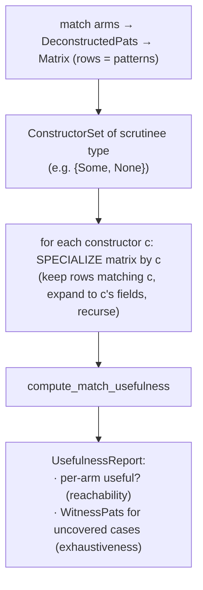
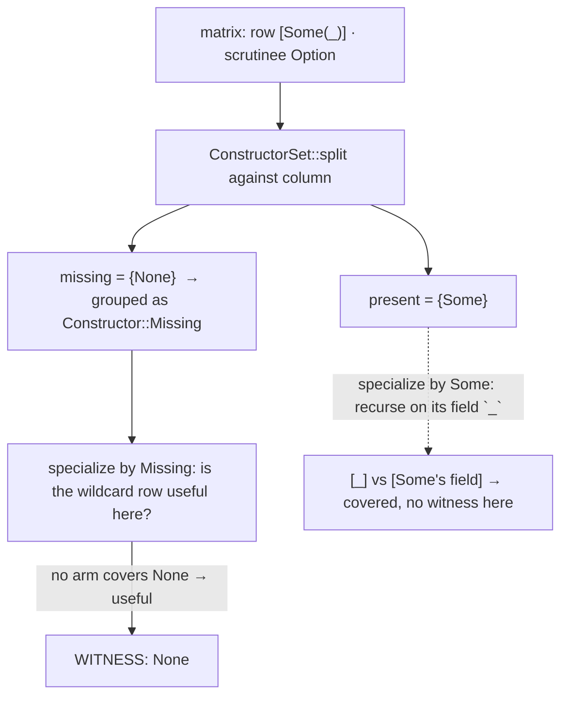
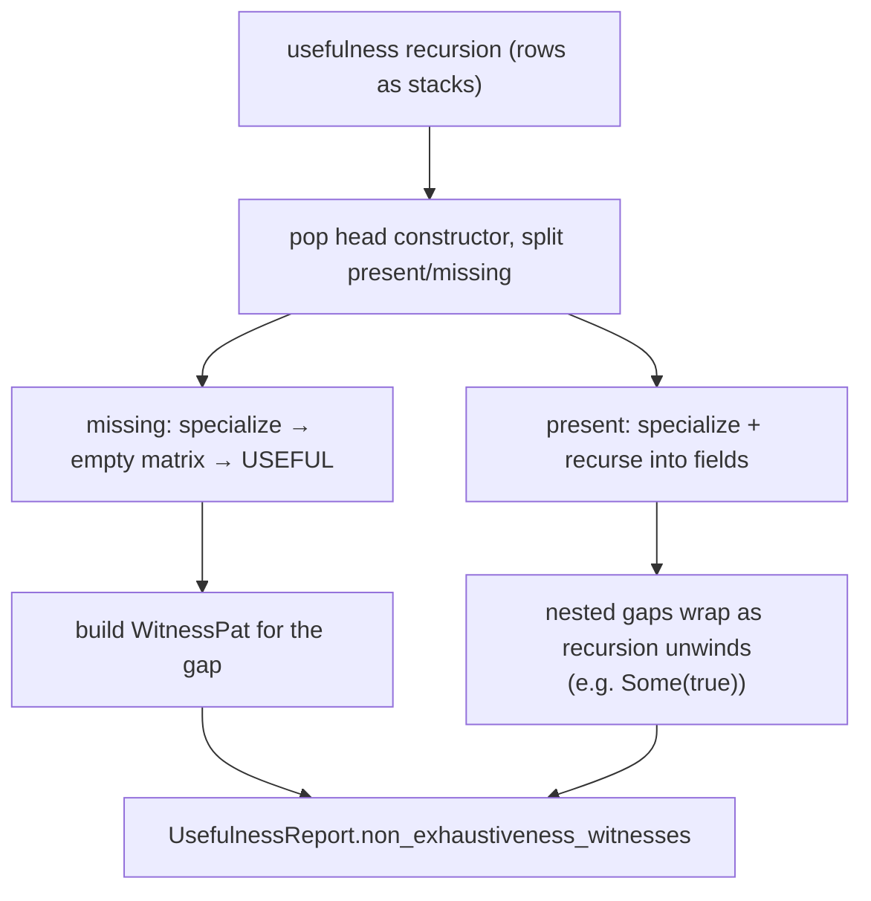
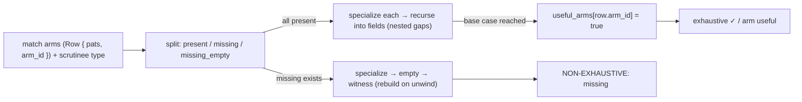

```admonish abstract title="What you'll learn"
- Why `rustc` lowers [HIR](../glossary.md#hir) one step further into the [**THIR**](../glossary.md#thir): types inline on every node, method calls and overloaded operators folded into `ExprKind::Call`, autoderefs made explicit, and bodies stored as flat arrays indexed by `ExprId`.
- How the `thir_body` query builds a temporary `Thir` [arena](../glossary.md#arena) per body and drops it once [MIR](../glossary.md#mir) construction and the safety checks are done.
- The single algorithm, **usefulness** (Maranget), from which both exhaustiveness checking and reachability fall out, and how it organizes arms as a matrix and recurses by **specializing** on constructors.
- The vocabulary of `rustc_pattern_analysis`: `Constructor`, `ConstructorSet::split` into `present`/`missing`/`missing_empty`, `DeconstructedPat`, and the `WitnessPat` that the diagnostic prints as the uncovered case.
- How `check_match` (in `rustc_mir_build::thir::pattern`) drives `compute_match_usefulness` over the THIR, turning witnesses into `E0004` "non-exhaustive patterns" and unuseful arms into the `UNREACHABLE_PATTERNS` [lint](../glossary.md#lint), while respecting `match_source` so desugared matches are not wrongly blamed.
- How to build a working exhaustiveness checker in miniature, with a matrix, `split`, `specialize`, and witness construction, that reproduces `rustc`'s `None`-not-covered diagnostic on a toy `Option`-like type.
```

## 13.1 THIR and Exhaustiveness Checking

### One more lowering before the machine

By the end of Chapter 12 the compiler *understands* your program: names are bound, sugar is desugared, every expression has a type, every trait bound is proven. You might expect the next step to be the executable-shaped IR (the MIR of Chapter 14). But there is one more representation in between, and a major safety check that rides on it. The representation is the **THIR**, the **Typed High-level Intermediate Representation**, and the check is **exhaustiveness**: the guarantee that every `match` covers every possible value, the property that makes Rust's pattern matching safe to compile into a jump table with no "what if none of the arms matched?" fallthrough. This section is the foundation: why the THIR exists, what it is, and the algorithm, *usefulness*, that decides whether a set of patterns is complete.

### Why another IR? The HIR is still too raw

The HIR (Chapter 10) carries types only *indirectly*: a `hir::Expr` has a [`HirId`](../glossary.md#hirid), and you look its type up in the `TypeckResults` side table (§11.1). For the analyses ahead (building MIR, checking matches, checking `unsafe`) that indirection is friction, and the HIR still carries surface conveniences that those analyses would each have to re-handle. So `rustc` lowers the type-checked HIR *one more step* into the **THIR**, described by the dev-guide as "a lowered version of the HIR where all the types have been filled in, which is possible after type checking has completed." The THIR is the HIR with the types *baked in* and the remaining conveniences *desugared away*, built specifically so that MIR construction and pattern analysis are tractable. The rationale, per the dev guide, is that the THIR exists to make MIR construction and pattern analysis tractable by lowering the HIR to a typed, desugared shape.

### What the THIR is

Several properties (all verified from the dev-guide and source) define it, and each is a deliberate simplification:

- **Types are inline.** Where the HIR needed a `TypeckResults` lookup, every THIR node *carries* its type. The analyses downstream never consult a side table; the tree is self-describing.
- **Bodies only.** Like the MIR to come, the THIR represents only *executable code* (function bodies, `const` initializers) not items like structs or traits. There is no THIR for a `struct` declaration; there is THIR for the *body* that uses it.
- **More desugaring.** The THIR goes further than the HIR: method calls and overloaded operators become plain `ExprKind::Call`s ("a number of the more straight-forward MIR simplifications are already done in the lowering to THIR," per the verified docs), and **automatic references and dereferences are made explicit**, the implicit `&` and `*` that type checking inferred are written into the tree. What the HIR left implicit, the THIR spells out.
- **Flat arrays, indexed by id.** Expressions, statements, and match arms are stored in separate arrays and refer to each other by index, an `ExprId` into the `exprs` array, rather than a pointer. This is an arena-of-vectors layout, friendly to the MIR builder that will walk it.
- **Temporary.** Unlike the HIR (kept for the whole compilation) the THIR for each body is built on demand via the `thir_body` query, used, and then *dropped*, its arena freed, to keep peak memory down. It is scaffolding for MIR construction and the safety checks, not a durable artifact.




```admonish tip title="Pro-Tip, the THIR is why MIR construction is comparatively simple"
When you read (in Chapter 14) that lowering THIR to MIR is mostly mechanical, the THIR is the reason. By making types inline, desugaring method calls to `Call`, and writing out every implicit deref, the THIR pre-pays the complexity that would otherwise land on the MIR builder. Each simplification done in the THIR is one the MIR builder does not have to do.
```

### The exhaustiveness problem

Now the check the THIR enables. Rust requires that a `match` be **exhaustive**, that the patterns, taken together, cover *every* value the scrutinee could have:

```rust
match opt {
    Some(x) => x,
    None => 0,
}   // exhaustive: Some and None are all the cases of Option
```

Omit the `None` arm and the compiler rejects the program: "non-exhaustive patterns: `None` not covered." This is not a stylistic nicety. It is a *soundness* requirement. Exhaustiveness is what lets the compiler turn a `match` into an efficient jump with no fallthrough case, *knowing* control can never escape the arms. It also powers the *opposite* check: an arm that can never match (because earlier arms already cover its values) is **unreachable**, and the compiler warns. Both questions, "is anything left uncovered?" and "is this arm ever reached?", are *the same question* asked two ways. That single question is **usefulness**.

### The core: the usefulness algorithm

The algorithm at the heart of exhaustiveness is built on one definition. A pattern `p` is **useful** with respect to a list of patterns (the arms above it) if there exists at least one value that `p` matches but *none* of the earlier patterns match. "Useful" means "adds something", covers a value not already covered. From this single notion, both checks fall out:

- **Exhaustiveness** = ask whether the wildcard pattern `_` is useful relative to all the arms. If `_` *is* useful, if there is some value no arm matches, then the match is **not exhaustive**, and the value `_` matched is a *counterexample*. If `_` is *not* useful, every value is already covered, the match is exhaustive.
- **Reachability** = ask, for each arm in turn, whether it is useful relative to the arms *above* it. If an arm is *not* useful, no value reaches it (the arms above already cover everything it would match). It is **unreachable**, and the compiler warns.

This is the result from Maranget's work on compiling pattern matching, which rustc builds on: one recursive procedure, `usefulness`, answers both. It works by **specializing** the pattern matrix on each possible **constructor** of the scrutinee's type: for `Option`, the constructors are `Some` and `None`; for a `bool`, `true` and `false`; for a struct, its single constructor; for integers, ranges. To check exhaustiveness, the algorithm asks: for *every* constructor of the type, do the patterns cover all the ways that constructor can be filled? A constructor with no covering pattern is a gap, and the algorithm constructs a **witness**, a concrete pattern like `None` or `Some(true)`, demonstrating exactly what is missing. That witness *is* the "`None` not covered" in the error message.




```admonish warning title="Warning, exhaustiveness reasons over constructors and types, not the values you can see"
A common surprise is that the checker insists on a `_` arm (or all variants) even when you "know" the other cases cannot occur. It reasons structurally: it considers every *constructor* the *type* admits, not the values your program happens to produce. `match x { 0..=9 => …, 10..=255 => … }` for a `u8` is exhaustive because the ranges cover every `u8` constructor; drop a value and it is not, regardless of what `x` "really" is at runtime. The checker does not do value-range tracking beyond the patterns themselves. Likewise `#[non_exhaustive]` enums from another crate *always* require a `_`, because that attribute tells the checker "more constructors may exist than you can see." When exhaustiveness surprises you, ask "what constructors does the *type* have?", not "what values can actually happen?". The algorithm answers the former.
```

### Where it lives: `rustc_pattern_analysis`

The usefulness algorithm is important and self-contained enough to live in its own crate, `rustc_pattern_analysis`, with the verified vocabulary the rest of the chapter will use: a `DeconstructedPat` (a pattern broken into constructor-plus-fields form for the algorithm), a `Constructor`, the `Usefulness`/`UsefulnessReport` results, and a `WitnessPat` (the constructed counterexample). The check itself is driven by `check_match` (in `rustc_mir_build::thir::pattern`), which walks the THIR body with a `MatchVisitor`, hands each `match`'s arms to the pattern-analysis crate, and turns an "uncovered" witness into the "non-exhaustive patterns" diagnostic or an unreachable arm into a lint. Like the [trait solver](../glossary.md#trait-solver) living in `rustc_next_trait_solver` (§12.2), pulling the algorithm into its own crate keeps it testable and reusable, the engine-in-its-own-crate split of §3.2 once more.

### Where this leaves us

The THIR is the type-checked HIR lowered one more step: types **inline** on every node, **bodies only**, with method calls and overloaded operators desugared to plain `Call`s and implicit references made explicit, stored as **flat arrays** indexed by `ExprId` and built **temporarily** by the `thir_body` query. It exists to make the analyses that follow tractable: chiefly MIR construction (Chapter 14), which it pre-simplifies, and the **exhaustiveness** check, which rides on it. Exhaustiveness is a *soundness* requirement: a `match` must cover every value, so the compiler can compile it with no fallthrough. Both it and its mirror, unreachable-arm detection, reduce to one question, **usefulness**: does a pattern match a value no earlier pattern does? Exhaustiveness is "is `_` useful?" (if so, the value it matches is an uncovered **witness**); reachability is "is each arm useful relative to those above?" The algorithm specializes the pattern matrix per **constructor** of the scrutinee's *type*, and lives in the standalone `rustc_pattern_analysis` crate, driven over the THIR by `check_match`.

§13.2 takes the architecture deep-dive: the THIR data types (`thir::Expr`, `Pat`, `Arm`, the `ExprId`/arena layout) and the `thir_body` query, then the structure of `rustc_pattern_analysis`, `DeconstructedPat`, `Constructor`, the matrix and specialization, and how `check_match` orchestrates it. Then §13.3 reads the real usefulness recursion on a small matrix, and §13.4 has you build a working exhaustiveness checker for a toy pattern language.

## 13.2 The Architecture: the THIR, `rustc_pattern_analysis`, and `check_match`

### From a typed tree to a completeness proof

The architecture has three parts: the THIR's data types and the `thir_body` query that produces them, the standalone `rustc_pattern_analysis` crate (its constructor/pattern/matrix machinery), and `check_match`, the driver that walks the THIR and turns an uncovered case into the diagnostic you see. The throughline: a typed tree becomes a *matrix of patterns*, the matrix is checked for completeness, and any gap becomes a *witness*.

### The THIR data types

The THIR's container is a `Thir` struct holding the body's nodes in **flat, indexed arrays**, the §13.1 layout made concrete. Expressions live in an `exprs` array and are referenced everywhere by `ExprId` (an index), arms by `ArmId`, and so on. `thir::ExprKind` has around 50 variants; most children are referenced by `ExprId`/`ArmId` rather than direct ownership:

```rust
// rustc_middle::thir  (faithful; representative variants, abridged)
pub enum ExprKind<'tcx> {
    Call { ty: Ty<'tcx>, fun: ExprId, args: Box<[ExprId]>, from_hir_call: bool, fn_span: Span },  // methods became Call
    // ← explicit: autoderef written out (§13.1)
    Deref { arg: ExprId },
    Binary { op: BinOp, lhs: ExprId, rhs: ExprId },
    Match { scrutinee: ExprId, arms: Box<[ArmId]>, match_source: MatchSource },
    Block { block: BlockId },
    Let { expr: ExprId, pat: Box<Pat<'tcx>> },
    // … many more variants, children mostly by ExprId/ArmId/BlockId …
}
```

Two confirmations of §13.1 are visible. The `Call` variant carries a `ty` and absorbs what were method calls and overloaded operators: they are *gone* as distinct kinds. And `Deref { arg }` exists as an explicit node: the automatic dereferences type checking inferred are now written into the tree, not implicit. The `Match` variant is the one this chapter cares about: a `scrutinee` expression, a list of `arms`, and (carried faithfully from §10.3) a `match_source` saying whether this `match` was written by the user or synthesized by a `for`/`?` desugaring.

A pattern is a `thir::Pat`, verified as carrying its type inline:

```rust
// rustc_middle::thir  (faithful)
pub struct Pat<'tcx> {
    pub ty: Ty<'tcx>, // the type this pattern matches against, inline, no side table
    pub span: Span,
    pub extra: Option<Box<PatExtra<'tcx>>>, // boxed side data: expanded_const, ascriptions
    pub kind: PatKind<'tcx>, // Wild, Binding, Variant, Leaf (struct/tuple), Constant, Range, Or, …
}
```

`PatKind` is the vocabulary the exhaustiveness check consumes: `Wild` (the `_`), `Variant` (an enum variant like `Some(..)`), `Leaf` (a struct/tuple's fields), `Constant`, `Range`, `Or`, and so on. Every pattern knows its `ty`, which is what lets the checker ask "what constructors does this *type* have?" (§13.1) without any external lookup.

This whole structure is produced by the `thir_body` query: ask `tcx.thir_body(def_id)` and you get the body's `Thir` arena and the `ExprId` of its root, built on demand and dropped after use (§13.1). The flat-array, id-referenced shape is exactly what both the MIR builder (Chapter 14) and the pattern checker want to walk.




### `rustc_pattern_analysis`: the algorithm, decoupled

The usefulness algorithm lives in its own crate, `rustc_pattern_analysis`, and, like the trait solver (§12.2), it is written against an *abstraction* of the host compiler rather than directly against `rustc_middle`. The verified interface is a trait, `PatCx` (with `rustc`'s implementation, `RustcPatCtxt`), supplying the type-specific knowledge the algorithm needs: given a type, what are its constructors? Is it uninhabited? The crate then re-exports `rustc`-flavored aliases (`Constructor`, `DeconstructedPat`, `MatchArm`, `Usefulness`, `UsefulnessReport`, `WitnessPat`) all parameterized over `RustcPatCtxt`. This is the trait-decoupling pattern §12.2 introduced for `SolverDelegate` (after the resolver's `Resolver` trait): a self-contained algorithm that calls *out* through a trait for host facts, so it can be tested in isolation and, in principle, reused.

The crate's key types are the algorithm's working vocabulary:

- `Constructor`: the "head" of a value: `Some`/`None` for `Option`, `true`/`false` for `bool`, a struct's single constructor, an integer `IntRange`, a slice constructor. Constructors are *what a type can be*.
- `ConstructorSet`: the *complete* set of constructors a type admits: `{Some, None}` for `Option`. Exhaustiveness is fundamentally "do the patterns cover this whole set?"
- `DeconstructedPat`: a pattern re-expressed in the algorithm's terms, a constructor plus sub-patterns for its fields. `Some(x)` deconstructs into "constructor `Some`, one field pattern `x`." This is the form the matrix operates on.
- `WitnessPat`: a *synthesized* pattern the algorithm builds to demonstrate an uncovered case, the `None` in "`None` not covered." (A verified refactor even gave witnesses their *own* pattern type, separate from `thir::Pat`, precisely because the only patterns the analysis ever *prints* are these synthetic counterexamples.)

### The matrix and specialization

The algorithm organizes the arms as a **matrix**: each row is an arm's pattern (or a tuple of patterns, when matching multiple values), and the columns correspond to positions being matched. A `PatternColumn` (verified) is one column across all rows. The engine of the algorithm is **specialization**: to check completeness for a given constructor `c`, the matrix is *specialized* by `c`: keep only the rows whose pattern could match `c`, and expand each into the sub-patterns of `c`'s fields. Checking `Option` means specializing by `Some` (does anything cover `Some`'s field?) and by `None` (does anything cover `None`?). Recursing this specialization down through nested patterns is how the algorithm handles `Some(Ok(x))` and arbitrary depth, each layer peels one constructor and recurses on the fields.

The top-level entry point is the verified `compute_match_usefulness` in the crate's `usefulness` module: hand it the arms (as `MatchArm`s of `DeconstructedPat`s), the scrutinee type, and validity information, and it returns a `UsefulnessReport`: for each arm, whether it was useful (reachable), and the set of `WitnessPat`s for any uncovered cases. One call yields *both* of §13.1's answers.




```admonish tip title="Pro-Tip, integer and slice matching work by the same machinery, via clever constructors"
It is natural to assume `match` on an `Option` (a couple of variants) and `match` on a `u32` (four billion values) need different algorithms. They do not. The pattern-analysis crate models integers as an `IntRange` constructor and slices as a `Slice` constructor, so "is `0..=255` covered for a `u8`?" is the *same* specialization question as "is `Some` covered for an `Option`?", just with a constructor that represents a range rather than a variant. This is why the exhaustiveness checker handles `match n { 0..=9 => …, 10..=u8::MAX => … }` and `match s { [] => …, [_, ..] => … }` with no special cases in the core: the work is pushed into *what counts as a constructor*, leaving one uniform usefulness algorithm. When you wonder how the checker reasons about huge or infinite domains, the answer is always "as a constructor," never "by enumeration."
```

### `check_match`: the driver over the THIR

The crate is the algorithm; the *driver* that applies it to real code is `check_match` (in `rustc_mir_build::thir::pattern`), the verified entry point `check_match(tcx, def_id)`. Its shape, from the source:

```rust
// rustc_mir_build/src/thir/pattern/check_match.rs  (faithful; spine, struct fields and trailing param-loop abridged)
pub(crate) fn check_match(tcx: TyCtxt<'_>, def_id: LocalDefId) -> Result<(), ErrorGuaranteed> {
    let typeck_results = tcx.typeck(def_id); // the §11 results
    let (thir, expr) = tcx.thir_body(def_id)?; // the THIR (this section)
    let thir = thir.borrow();
    let mut visitor = MatchVisitor { tcx, thir: &*thir, typeck_results, /* arenas, … */ };
    visitor.visit_expr(&thir[expr]); // walk the body, find every Match
    visitor.error
}
```

The `MatchVisitor` walks the THIR body; at each `ExprKind::Match`, it lowers the arms' `thir::Pat`s into `DeconstructedPat`s, calls `compute_match_usefulness`, and inspects the report. A non-empty witness set becomes the diagnostic **"non-exhaustive patterns: `<witness>` not covered"** (the witness printed as the missing pattern); an arm that came back not-useful becomes the `UNREACHABLE_PATTERNS` lint; an irrefutable `if let`/`let` pattern that always matches triggers `IRREFUTABLE_LET_PATTERNS`. The visitor also handles the desugared cases honestly via `match_source` (§10.3), a `for`-loop's synthesized `match` is not nagged about exhaustiveness the way a user's `match` is. The driver connects the typed tree to the algorithm and the algorithm's output to the user.

```admonish warning title="Warning, exhaustiveness runs on the THIR, so it sees desugared matches, and must not blame them"
Because `check_match` walks the THIR, the matches it analyzes include the synthetic ones from `for`/`while let`/`?` desugaring (§10.3). If the checker treated those like user matches, it would emit baffling "non-exhaustive" errors for code containing no visible `match`. The `match_source` field is what prevents this: the visitor reads it and adjusts (or suppresses) diagnostics so a desugared `match` never produces a message phrased in terms of the desugaring. This is the §10.3 "honest spans / `MatchSource`" discipline paying off exactly here: the same tag that kept the *type checker* from misreporting a `for` loop now keeps the *exhaustiveness checker* honest. When hacking on match diagnostics, always branch on `match_source` first.
```

### How this builds, and what is next

The architecture spans two crates and a driver. The **THIR** is a `Thir` container of **flat, `ExprId`-indexed arrays**; its `ExprKind` (method calls folded into `Call`, derefs explicit) and its `thir::Pat` (type **inline**, `PatKind` of `Wild`/`Variant`/`Leaf`/`Constant`/`Range`/`Or`) are produced on demand by the `thir_body` query. The usefulness algorithm lives in the decoupled `rustc_pattern_analysis` crate, written against the `PatCx` trait (the §3.2 pattern again), working in terms of `Constructor`/`ConstructorSet`, `DeconstructedPat` matrices, **specialization** per constructor, and `WitnessPat` counterexamples, with integers and slices folded into the same machinery via range and slice constructors. The single entry point `compute_match_usefulness` returns a `UsefulnessReport` giving reachability *and* witnesses at once. And `check_match` drives it: a `MatchVisitor` walks the THIR, feeds each `Match`'s arms to the algorithm, and turns witnesses into "non-exhaustive patterns" errors and unuseful arms into `UNREACHABLE_PATTERNS`, respecting `match_source` so desugared matches are never wrongly blamed.

§13.3 reads the real recursion: `compute_match_usefulness` and the specialization step on a small pattern matrix, watching it discover that `_` is useful for an `Option` match missing `None` and construct the `None` witness. Then §13.4 has you build a working exhaustiveness checker for a toy pattern language (constructors, a matrix, specialization, and witness construction) that reports both missing cases and unreachable arms.

## 13.3 Reading the Source: Specialization and the Usefulness Recursion

### Watching a gap become a witness

Now run the algorithm and read it. We will check the incomplete match

```rust
match opt { // opt: Option<bool>
    Some(_) => 1,
    // (no None arm)
}
```

and watch `compute_match_usefulness` discover that `None` is uncovered and hand back `None` as a **witness**. The source is the `usefulness` and `constructor` modules of `rustc_pattern_analysis`. The crate's own header states the entry point plainly: "the main entrypoint for this crate is `usefulness::compute_match_usefulness`."

### The entry point and the matrix

The verified signature:

```rust
// rustc_pattern_analysis::usefulness  (verified)
pub fn compute_match_usefulness<'p, Cx: PatCx>(
    tycx: &Cx,
    arms: &[MatchArm<'p, Cx>], // the match arms, as deconstructed patterns
    scrut_ty: Cx::Ty, // the scrutinee's type: Option<bool> here
    scrut_validity: PlaceValidity,
    complexity_limit: usize, // a budget → "pattern too complex" instead of hanging
) -> Result<UsefulnessReport<'p, Cx>, Cx::Error>;
```

It builds a `Matrix` from the arms, verified as a set of rows that "must form a rectangular 2D array," where each *column* "corresponds to a place within the scrutinee." For our match the matrix begins with one row, `[Some(_)]`, and one column (the place `opt`). Critically, exhaustiveness is computed by asking whether a *virtual wildcard row*, the `_` of §13.1, would be useful against this matrix; the `Matrix` even tracks whether that "wildcard row is relevant." If the wildcard row is useful, there is an uncovered value.

### The mental model: rows are stacks

The model the source uses is that each row is a **pattern stack**: a list of patterns still to be matched, from which the algorithm **pops** a constructor at each step and **pushes** that constructor's field-patterns. Checking `[Some(_)]` pops the `Some` constructor and pushes its one field `_`, leaving `[_]` to recurse on. This "pop the head constructor, push its fields" view is the whole recursion in one image: usefulness peels one layer of constructor at a time, descending into fields, until the stacks are empty.

### The heart: split the constructors into present and missing

The recursive core, at each column, must decide *which constructors to try*. Trying every value is impossible (a `u8` has 256, an `i64` has billions). The algorithm instead **splits** the type's constructor set against the column, via the verified `ConstructorSet::split`, producing a `SplitConstructorSet`:

```rust
// rustc_pattern_analysis::constructor  (faithful)
pub struct SplitConstructorSet<Cx: PatCx> {
    pub present: SmallVec<[Constructor<Cx>; 1]>, // constructors that DO appear in the column
    pub missing: Vec<Constructor<Cx>>, // constructors of the type NOT in the column
    pub missing_empty: Vec<Constructor<Cx>>, // uninhabited "missing" cases that can be elided
}
```

The verified invariants make this exact: `present ∪ missing ∪ missing_empty` covers *all* constructors of the type; each `present` constructor is covered by the column; *no* `missing` constructor is covered by anything in the column. For `opt: Option<bool>` with the column `[Some(_)]`, the type's constructor set is `{Some, None}`; splitting against the column gives `present = {Some}` and `missing = {None}`. The split has already found the gap, `None` is missing, but the algorithm proceeds to confirm and to build the witness.

A subtlety the verified docs stress: `split` also handles **integer ranges** and **slices** by splitting them into sensible sub-ranges (`0..50`, `50..=100`, …) rather than enumerating values, the §13.2 Pro-Tip's "work in the constructor" realized here, in `IntRange::split`/`Slice::split`.

### The wildcard optimization: only try the missing ones

Here is the move that makes exhaustiveness efficient, verified from the source. Any constructor *not present* in the column can only be matched by rows containing a wildcard, so specializing by such a constructor adds no new information about the present constructors' specializations. The algorithm therefore groups all not-present constructors into a single `Constructor::Missing` and tries *only that*. (See the `Missing and relevancy` section in `usefulness.rs` for the formal argument.) For our match, that means the algorithm focuses on `Missing = {None}`: is the virtual wildcard row useful when specialized to `None`? Since no arm covers `None`, yes, and that "yes" is the uncovered case. (The diagram below shows the two main branches `present` and `missing`; the third `missing_empty` bucket for uninhabited absentees is omitted there for clarity.)




### Specialization: descend into a constructor's fields

To actually test a constructor, the algorithm **specializes** the matrix by it, the verified `Matrix::specialize_constructor`. Specializing by constructor `c` keeps only the rows whose head pattern could match `c`, and replaces each such head with the sub-patterns of `c`'s fields (the "push the fields" of the stack model). Specializing `[Some(_)]` by `Some` yields `[_]` (the field of `Some`); specializing by `None` (a nullary constructor) yields the rows that match `None`, and *no* row in our matrix matches `None`, so the specialized matrix for `None` is *empty*. An empty specialized matrix means nothing covers that case: the wildcard row is useful, the case is uncovered. Specialization is how the recursion both *descends* (into fields, for present constructors) and *detects gaps* (an empty result, for missing ones).

### Building the witness

When specialization by a missing constructor reveals usefulness, the algorithm constructs a `WitnessPat` (§13.2) recording it: for `None`, the witness is simply the pattern `None`; for a nested gap like `Some(true)` uncovered, the witness is built up as the recursion unwinds, wrapping each layer's constructor around the field witnesses below. This unwinding is why the error can name a *fully-formed* missing pattern (`Some(Some(_))`, `(false, true)`) and not merely "something is missing", the witness is assembled constructor-by-constructor on the way back up the recursion. `compute_match_usefulness` returns these in the `UsefulnessReport`, and `check_match` (§13.2) prints our `None` as **"non-exhaustive patterns: `None` not covered."** Rustc's `WitnessPat<Cx>` additionally carries the place's type, which is what lets the error name `Some(_): Option<u32>` and decide whether to render an uninhabited wildcard as `!` instead of `_` (`WitnessPat::wildcard` checks `cx.ctors_for_ty(&ty).all_empty()`).




```admonish tip title="Pro-Tip, a fully-spelled-out witness like Some(Some(_)) tells you exactly which nested case you forgot"
Because the witness is assembled constructor-by-constructor as the recursion unwinds, the compiler can hand you a precise, fillable pattern rather than a vague "not exhaustive." If the error says `Some(Some(_)) not covered`, the algorithm found a path (`Some`, then inner `Some`, then anything) that no arm matches; the `_` marks where coverage stopped mattering. Read the witness as a *worked counterexample*: copy it as a new arm and you have closed exactly the gap the algorithm found, no guessing. The deeper the nesting, the more valuable this is: the witness saves you from manually re-deriving which combination of variants slipped through.
```

```admonish warning title="Warning, reachability and exhaustiveness share the recursion, so an unreachable warning can mask a real bug"
Because both checks are the *same* usefulness recursion (§13.1), an arm reported `UNREACHABLE_PATTERNS` means "every value this arm matches is already matched above", which is sometimes a harmless duplicate, but sometimes a sign you wrote the *wrong* pattern (e.g. a too-broad earlier arm, or a typo'd variant that accidentally matches nothing new). The algorithm only tells you the arm adds no coverage; it cannot tell you *why* you wrote it. When you get an unreachable-pattern lint, do not reflexively delete the arm: check whether an *earlier* arm is broader than you intended and is swallowing cases meant for this one. The usefulness result is precise about *what* is redundant, silent about *intent*.
```

### How this builds, and what is next

We have read the usefulness recursion find a gap. `compute_match_usefulness` builds a `Matrix` of the arms (rows = patterns, columns = scrutinee places) and asks whether a virtual **wildcard row** is useful. Each row is a **stack**: pop the head constructor, push its fields. At each column, `ConstructorSet::split` partitions the type's constructors into `present` and `missing` (handling integer ranges and slices by splitting, not enumerating); the **wildcard optimization** then tries only the `Missing` group, since missing constructors are exactly the uncovered ones. `specialize_constructor` keeps matching rows and expands them into a constructor's fields, descending for present constructors, yielding an *empty* matrix (hence usefulness) for missing ones. A revealed gap is recorded as a `WitnessPat`, assembled constructor-by-constructor as the recursion unwinds, so the diagnostic names a fully-formed missing pattern. For our `Option<bool>` match, the split finds `missing = {None}`, specialization by `None` is empty, and the witness `None` becomes "non-exhaustive patterns: `None` not covered."

§13.4 turns this into a build. You will write a working exhaustiveness checker for a toy pattern language (constructors with arities, patterns as constructor-plus-subpatterns, a matrix of rows, `split` into present/missing, `specialize`, and witness construction) that, given the arms of a `match`, reports the missing cases (as witnesses) and the unreachable arms. You will reproduce, in code you wrote, the recursion you just read: feed it `Some(_)` over `Option`, and watch it hand back `None`.

## 13.4 Hands-On Lab: Build an Exhaustiveness Checker

### Proving a match complete

This lab builds the algorithm §13.3 dissected: an **exhaustiveness checker** that, given the arms of a `match` and the scrutinee's type, reports which cases are **missing** (as concrete witness patterns) and which arms are **unreachable**. You will write the pieces by their real names: a **matrix** of pattern rows, a constructor **split** into present and missing, **specialization**, and **witness** construction, and watch it conclude that `match opt { Some(_) => … }` is missing `None`, that a nested match can be missing `Some(Some(true))` (since the lab picks the first missing constructor of `bool`), and that a duplicated arm is unreachable. When your checker hands back a fully-formed witness pattern, you will have built the usefulness algorithm of Maranget and `rustc_pattern_analysis` in miniature.

`cargo new`, pure `std`.

### Types as sets of constructors

A type, for exhaustiveness, is just its **set of constructors**, each with an **arity** (how many fields it has). `Option<bool>` is `{Some(1), None(0)}`; `bool` is `{true(0), false(0)}`:

```rust
// src/main.rs
use std::collections::HashMap;

/// A constructor: a name, the types of its fields (by type name), and an
/// `is_empty` flag for uninhabited cases (`enum Void {}`'s constructors, etc.).
#[derive(Clone, Debug, PartialEq)]
// fields = type names of each sub-place
struct Ctor { name: String, fields: Vec<String>, is_empty: bool }

/// A type definition: its full set of constructors (the §13.2 ConstructorSet).
type TypeDefs = HashMap<String, Vec<Ctor>>;

fn defs() -> TypeDefs {
    let mut d = HashMap::new();
    d.insert("bool".into(), vec![
        Ctor { name: "true".into(),  fields: vec![], is_empty: false },
        Ctor { name: "false".into(), fields: vec![], is_empty: false },
    ]);
    // Option<bool>, monomorphic for simplicity
    d.insert("Option".into(), vec![
        Ctor { name: "Some".into(), fields: vec!["bool".into()], is_empty: false },
        Ctor { name: "None".into(), fields: vec![], is_empty: false },
    ]);
    d.insert("OptOpt".into(), vec![ // Option<Option<bool>>
        Ctor { name: "Some".into(), fields: vec!["Option".into()], is_empty: false },
        Ctor { name: "None".into(), fields: vec![], is_empty: false },
    ]);
    d
}
```

*We model `ConstructorSet` as a flat list, which works because our toy types each have a small fixed set of constructors. Rustc's `ConstructorSet` is an enum whose variants encode* kind *(`Bool`, `Integers { range_1, range_2 }`, `Slice { array_len }`, `Variants { variants, non_exhaustive }`, `NoConstructors` for `!`), so `u32` is `Integers { 0..=u32::MAX, None }` not a four-billion-entry list. Extension Exercise 1 (integer ranges) is the toy version of the `Integers` variant.*

### Patterns as stacks

A pattern is either a **wildcard** `_` or a **constructor applied to sub-patterns**. The §13.3 "row is a stack" model is literal: a row is a `Vec<Pat>`, the patterns still to match, leftmost first:

```rust
#[derive(Clone, Debug)]
enum Pat { Wild, Ctor(String, Vec<Pat>) } // _ | Some(sub), None, true, …

fn wild() -> Pat { Pat::Wild }
fn ctor(name: &str, subs: Vec<Pat>) -> Pat { Pat::Ctor(name.into(), subs) }

/// A row in the matrix: the stack of patterns still to match, plus the id of
/// the arm this row descended from. `arm_id` is the lab's analogue of rustc's
/// `parent_row` linkage: when the base case is reached, the surviving rows'
/// arm ids are exactly the reachable arms.
#[derive(Clone, Debug)]
struct Row { pats: Vec<Pat>, arm_id: usize }

/// The matrix: the arms, each a one-element stack initially.
type Matrix = Vec<Row>;
```

*We use one `Pat::Wild` for both user-written `_` and the wildcards `specialize` invents when expanding a wildcard row. Rustc separates them as `PatOrWild::Pat` vs `PatOrWild::Wild` so diagnostics can quote the user's `_` (with its span) and not a synthetic one.*

### Split: which constructors are present, which are missing

The §13.3 core: look at the first column of the matrix and partition the type's constructors into **present** (some row has them), **missing** (none does, and the constructor is inhabited so the gap is real), and **missing_empty** (absent but uninhabited, so the algorithm treats it as covered). Wildcards count as matching *every* constructor:

```rust
/// The §13.2 SplitConstructorSet, with the third bucket for uninhabited absentees.
struct SplitConstructorSet { present: Vec<Ctor>, missing: Vec<Ctor>, missing_empty: Vec<Ctor> }

fn split(defs: &TypeDefs, ty: &str, matrix: &Matrix) -> SplitConstructorSet {
    let all = &defs[ty];
    let mut present = vec![];
    let mut missing = vec![];
    let mut missing_empty = vec![];
    for c in all {
        // Is constructor `c` named by the head pattern of any row?
        let appears = matrix.iter().any(|row| match row.pats.first() {
            Some(Pat::Ctor(n, _)) => n == &c.name,
            _ => false, // Wild heads don't make a ctor "present"
        });
        if appears {
            present.push(c.clone());
        } else if c.is_empty {
            // Absent and uninhabited: the algorithm treats it as covered.
            missing_empty.push(c.clone());
        } else {
            missing.push(c.clone());
        }
    }
    SplitConstructorSet { present, missing, missing_empty }
}
```

### Specialize: keep matching rows, expand fields

Specializing the matrix by constructor `c` keeps rows whose head matches `c` (a matching `Ctor`, or a `Wild` which matches anything), and replaces that head with `c`'s field-patterns, pushing the fields onto the stack (§13.3). A `Wild` head expands to one `Wild` per field:

```rust
fn specialize(matrix: &Matrix, c: &Ctor) -> Matrix {
    let mut out = vec![];
    for row in matrix {
        let (head, rest) = row.pats.split_first().unwrap();
        match head {
            Pat::Ctor(n, subs) if n == &c.name => {
                let mut pats = subs.clone(); // push c's field-patterns
                pats.extend_from_slice(rest);
                out.push(Row { pats, arm_id: row.arm_id }); // carry arm_id through
            }
            Pat::Wild => {
                let mut pats: Vec<Pat> = vec![Pat::Wild; c.fields.len()]; // _ per field
                pats.extend_from_slice(rest);
                out.push(Row { pats, arm_id: row.arm_id });
            }
            _ => {} // head names a different ctor → row dropped
        }
    }
    out
}
```

### The usefulness recursion, with witnesses

Now the §13.3 heart: is a stack of **wildcards** (the virtual wildcard row) useful against the matrix, i.e. is some value uncovered? `compute_exhaustiveness_and_usefulness` returns the **witness** stack if so, *and* it marks each row's arm as reachable when the recursion bottoms out on it. The first column's *type* drives the split; we recurse into the missing constructors (the wildcard optimization) and into present ones to find nested gaps. One pass yields both answers (the §13.1 throughline made literal: the `row.useful` bits feed the `UNREACHABLE_PATTERNS` lint that `check_match` emits):

```rust
/// Return Some(witness) if the all-wildcards query of these column types is useful
/// against `matrix` (i.e. some value is uncovered); `None` means fully covered.
/// Side effect: whenever a row survives all the way down to the empty-columns
/// base case, mark its arm useful in `useful_arms` (the lab's `row.useful` bit).
/// (Named for rustc's private recursion `compute_exhaustiveness_and_usefulness`
/// in `rustc_pattern_analysis::usefulness`; the public entry, `compute_match_usefulness`,
/// is the driver below.)
fn compute_exhaustiveness_and_usefulness(
    defs: &TypeDefs,
    col_tys: &[String],
    matrix: &Matrix,
    useful_arms: &mut [bool],
) -> Option<Vec<Pat>> {
    // Base case: no columns left. Every row that reached here matched the
    // wildcard query, so its arm is reachable. Useful iff the matrix is empty
    // (an empty matrix = nothing covers this combination of constructors).
    if col_tys.is_empty() {
        for row in matrix { useful_arms[row.arm_id] = true; }
        return if matrix.is_empty() { Some(vec![]) } else { None };
    }
    let ty = &col_tys[0];
    let rest_tys = &col_tys[1..];
    let SplitConstructorSet { present, missing, .. } = split(defs, ty, matrix);

    // 1. Try MISSING constructors first (the §13.3 wildcard optimization):
    //    if any inhabited constructor of the type is absent, the wildcard row is useful.
    //    (Note: `missing_empty` is intentionally ignored here, uninhabited absentees
    //    don't drive a witness.)
    if let Some(missing_ctor) = missing.first() {
        // witness: this missing ctor (with wildcard fields), then recurse on the rest.
        let spec = specialize(matrix, missing_ctor);
        let sub_tys: Vec<String> = missing_ctor.fields.iter().cloned().chain(rest_tys.iter().cloned()).collect();
        if let Some(w) = compute_exhaustiveness_and_usefulness(defs, &sub_tys, &spec, useful_arms) {
            return Some(rebuild(missing_ctor, w));
        }
    }
    // 2. Recurse into PRESENT constructors to find NESTED gaps *and* to mark
    //    the rows that descend through them as reachable. We don't short-circuit
    //    on the first witness: keep going so every surviving row gets a chance
    //    to reach the base case and set its `useful_arms` bit.
    let mut witness: Option<Vec<Pat>> = None;
    for c in &present {
        let spec = specialize(matrix, c);
        let sub_tys: Vec<String> = c.fields.iter().cloned().chain(rest_tys.iter().cloned()).collect();
        if let Some(w) = compute_exhaustiveness_and_usefulness(defs, &sub_tys, &spec, useful_arms) {
            if witness.is_none() { witness = Some(rebuild(c, w)); }
        }
    }
    witness
}

/// Wrap a constructor around the first `arity` witness patterns (its fields),
/// leaving the remaining witnesses for the other columns. (§13.3 unwind.)
fn rebuild(c: &Ctor, mut witness: Vec<Pat>) -> Vec<Pat> {
    let field_pats: Vec<Pat> = witness.drain(..c.fields.len()).collect();
    let mut out = vec![Pat::Ctor(c.name.clone(), field_pats)];
    out.extend(witness); // the witnesses for the remaining columns
    out
}
```

### Reachability, and a printer

An arm is **reachable** iff it is useful against the arms *above* it (§13.1). Rather than re-running the recursion per arm, we let one pass *also* set a `useful_arms[i] = true` whenever arm `i`'s row survives all the way to the base case. The driver then reads both pieces of information out of a single `Report`:

```rust
fn print_pat(p: &Pat) -> String {
    match p {
        Pat::Wild => "_".into(),
        Pat::Ctor(n, subs) if subs.is_empty() => n.clone(),
        Pat::Ctor(n, subs) => format!("{n}({})", subs.iter().map(print_pat).collect::<Vec<_>>().join(", ")),
    }
}

/// Output of one pass: any non-exhaustiveness witnesses, plus per-arm reachability.
struct Report { witnesses: Vec<Pat>, useful: Vec<bool> }

/// Check a match: report missing witnesses and unreachable arms in one pass.
/// (The real `check_match` walks the THIR; this is the `compute_match_usefulness`
/// it calls inside `rustc_pattern_analysis`.)
fn compute_match_usefulness(defs: &TypeDefs, ty: &str, arms: &[Pat]) -> Report {
    // Build the matrix once, tagging each row with its arm id.
    let matrix: Matrix = arms.iter().enumerate()
        .map(|(i, p)| Row { pats: vec![p.clone()], arm_id: i })
        .collect();
    let mut useful = vec![false; arms.len()];
    let witnesses = match compute_exhaustiveness_and_usefulness(defs, &[ty.to_string()], &matrix, &mut useful) {
        Some(w) => vec![w.into_iter().next().unwrap()],
        None => vec![],
    };
    Report { witnesses, useful }
}

/// Pretty-print a report. (Pulled out so the lab's `main` reads one call per match.)
fn print_report(arms: &[Pat], report: &Report) {
    for (i, ok) in report.useful.iter().enumerate() {
        if !ok { println!("  arm #{i} `{}` is UNREACHABLE", print_pat(&arms[i])); }
    }
    if report.witnesses.is_empty() {
        println!("  exhaustive ✓");
    } else {
        for w in &report.witnesses { println!("  NON-EXHAUSTIVE: missing `{}`", print_pat(w)); }
    }
}
```

### Running it

```rust
fn main() {
    let defs = defs();

    let cases: &[(&str, &str, Vec<Pat>)] = &[
        ("match opt: Option { Some(_) }",
         "Option", vec![ctor("Some", vec![wild()])]),
        ("match opt: Option { Some(_), None }",
         "Option", vec![ctor("Some", vec![wild()]), ctor("None", vec![])]),
        ("match oo: OptOpt { None, Some(None) }   (missing Some(Some(true)))",
         "OptOpt", vec![ctor("None", vec![]), ctor("Some", vec![ctor("None", vec![])])]),
        ("match b: bool { true, false, _ }   (the _ is unreachable)",
         "bool", vec![ctor("true", vec![]), ctor("false", vec![]), wild()]),
    ];
    for (title, ty, arms) in cases {
        println!("{title}");
        let report = compute_match_usefulness(&defs, ty, arms);
        print_report(arms, &report);
        println!();
    }
}
```

````admonish example title="Expected output" collapsible=true
Output (abridged to the key lines):

```text
match opt: Option { Some(_) }
  NON-EXHAUSTIVE: missing `None`

match opt: Option { Some(_), None }
  exhaustive ✓

match oo: OptOpt { None, Some(None) }   (missing Some(Some(_)))
  NON-EXHAUSTIVE: missing `Some(Some(true))`

match b: bool { true, false, _ }   (the _ is unreachable)
  arm #2 `_` is UNREACHABLE
  exhaustive ✓
```
````

There is the §13.3 algorithm, in code you wrote. The `Option` match missing `None` produces the witness `None`, the split found `None` absent, specialization by it was empty, useful. Adding the `None` arm makes the split show *no* missing constructors, so the match is exhaustive. The nested `OptOpt` case recurses: `Some` is present, so the checker descends into its field (an `Option`), finds that *inside* `Some`, only `None` is covered, and rebuilds the witness `Some(Some(true))` on the way up (the lab's `missing.first()` picks `true` as the first absent `bool` constructor), exactly §13.3's constructor-by-constructor unwinding. And the `bool` case is the single-pass payoff: in the *same* recursion that decides the match is exhaustive, the `true` and `false` rows reach the base case and flip their `useful_arms[i]` bits, while the trailing `_` row is dropped during specialization and its bit stays `false`, the §13.1 throughline ("both checks fall out of one recursion") implemented.




### What the lab stripped from real rustc

The lab built the Maranget recursion against a hand-rolled `Vec<Row>` matrix. The real algorithm lives in `[rustc_pattern_analysis/src/constructor.rs](https://github.com/rust-lang/rust/blob/1.95.0/compiler/rustc_pattern_analysis/src/constructor.rs)`, `[rustc_pattern_analysis/src/pat.rs](https://github.com/rust-lang/rust/blob/1.95.0/compiler/rustc_pattern_analysis/src/pat.rs)`, and `[rustc_pattern_analysis/src/usefulness.rs](https://github.com/rust-lang/rust/blob/1.95.0/compiler/rustc_pattern_analysis/src/usefulness.rs)`. What it adds on top of `Ctor { name, fields, is_empty }`, `enum Pat { Wild, Ctor }`, `Row { pats, arm_id }`, and `HashMap<String, Vec<Ctor>>`:

- `Constructor<Cx>` carries 21 variants (`Struct`, `Variant`, `Ref`, `Slice`, `UnionField`, `Bool`, `IntRange`, `F16Range`, `F32Range`, `F64Range`, `F128Range`, `Str`, `DerefPattern`, `Opaque`, `Or`, `Wildcard`, `Never`, `NonExhaustive`, `Hidden`, `Missing`, `PrivateUninhabited`) covering integers, floats (with NaN handling), slices, strings, deref patterns, and the various "absent" markers. The lab keeps only nullary-named variants.
- `ConstructorSet<Cx>` describes per-type universes (`Struct`, `Variants`, `Bool`, `Integers`, `Slice`, ...). The lab's `SplitConstructorSet` mirrors rustc's three buckets (`present`, `missing`, `missing_empty`), but populates `missing_empty` from a per-`Ctor` `is_empty` flag rather than asking the host whether a type is inhabited; Extension Exercise 5 promotes that flag to a real uninhabitedness check.
- `DeconstructedPat<Cx>` carries `ctor + fields + arity + ty + Cx::PatData` (span + hir id for diagnostics); rows use `PatOrWild<'p, Cx>` to distinguish borrowed real patterns from algorithm-synthesized wildcards. The lab mixes `Pat::Wild` and `Pat::Ctor` and re-clones.
- each `MatrixRow` tracks usefulness (`useful: bool`), guard status (`is_under_guard: bool`, extension exercise 3), parent linkage (`parent_row: usize`), and an `intersects_at_least: DenseBitSet<usize>` updated during the walk, so reachability falls out of one pass. The lab carries an `arm_id` on each row and a `useful_arms: &mut [bool]` flipped in the base case, the minimum bookkeeping needed to land the same single-pass shape without the bitset.
- `WitnessPat<Cx>` / `WitnessStack` / `WitnessMatrix` carry the scrutinee type so the diagnostic prints `Some(_): Option<u32>`, and multiple gaps stack. The lab returns a plain `Vec<Pat>`.
- `compute_match_usefulness(tycx, arms, scrut_ty, PlaceValidity, complexity_limit) -> UsefulnessReport` adds the validity check, an overflow budget for combinatorial slice patterns, and a per-arm reachability report consumed by `check_match`. The `PatCx` trait (`type Ty`, `type Error`, `type VariantIdx`, `type StrLit`, `type ArmData`, `type PatData`, plus methods `ctor_arity`, `ctor_sub_tys`, `ctors_for_ty`, `is_exhaustive_patterns_feature_on`, `exhaustive_witnesses`) decouples the algorithm from rustc, with the rustc-specific glue gated behind `#[cfg(feature = "rustc")]` so out-of-tree consumers can plug in their own pattern IR. The lab hard-codes types as strings.

The constructor universe, the typed witness, the `PatCx` decoupling, and the per-row bookkeeping are what turn "is this match exhaustive?" into "and exactly which arms are unreachable and why?" in a single pass.

### The production version of `compute_exhaustiveness_and_usefulness`

Once you've built the lab's `compute_exhaustiveness_and_usefulness`, read [the production version in `rustc_pattern_analysis/src/usefulness.rs](https://github.com/rust-lang/rust/blob/1.95.0/compiler/rustc_pattern_analysis/src/usefulness.rs)` (URL pinned to 1.95.0). It is the same Maranget recursion, with four things the lab couldn't show: the per-row reachability bookkeeping (`row.useful` set in the base case and `row.intersects_at_least` bitset updated on every recursion, so one pass yields both witnesses and unreachable-arm decisions); the `PatCx` trait decoupling so every call into the host (`mcx.tycx.exhaustive_witnesses()`, `place.split_column_ctors`) lets Clippy reuse the same body on its own pattern IR; the integer-range gap detection (`collect_overlapping_range_endpoints`, `collect_non_contiguous_range_endpoints`) that piggybacks on the same constructor split for "this `0..=10` and `10..=20` overlap at 10" warnings; and the `ensure_sufficient_stack` wrap that keeps deeply nested patterns from blowing the stack on debug builds. When Chapter 14 lowers `Match` to MIR `SwitchInt`, it relies on this function having already verified exhaustiveness, and the `row.useful` bits feed the `UNREACHABLE_PATTERNS` lint that `check_match` (§13.2) emits.

### Cross-check against real rustc

Write a non-exhaustive `match` in a real cargo project and compare rustc's diagnostic with the lab's missing-pattern list:

```rust,ignore
fn main() {
    let x: Option<i32> = Some(1);
    match x { None => {} } // missing: Some(_)
}
```

```bash
cargo build
```

```admonish example title="What you should see" collapsible=true
Rustc emits `error[E0004]: non-exhaustive patterns: \`Some(_) not covered`, then names the witness.
```

That witness is what the lab's` compute_exhaustiveness_and_usefulness`would construct on the same matrix: the Maranget recursion the lab implements is exactly the algorithmic backbone behind`compute_match_usefulness`. The differences live in §13.2's bookkeeping (typed witnesses, per-row reachability, gap detection in integer ranges); the algorithm is the same.

### Extension exercises

1. **Integer ranges.** Add a `Range(lo, hi)` constructor and a `split` that partitions an integer type's full range against the ranges present, emitting the *gaps* as witnesses, the `IntRange::split` of §13.3. Confirm `match n: u8 { 0..=9, 11..=255 }` reports `10` missing.
2. **Or-patterns.** Add `Pat::Or(Vec<Pat>)` and expand each or-pattern into multiple rows before checking: `Some(_) | None` becomes two rows. This is how rustc lowers or-patterns for analysis.
3. **Guards are not exhaustive.** Add a `guard: bool` to each arm and treat a guarded arm as *never* contributing to coverage (a guard might fail at runtime), so `match x { Some(y) if y > 0 => …, None => … }` is still missing `Some(_)`. This mirrors a real and surprising Rust rule.
4. **Wire to your parser.** Parse real `match` arms with your §7.4 parser (extended with patterns), deconstruct them into this `Pat` form, and run the checker, your own exhaustiveness diagnostic, end to end.
5. **Uninhabited absentees.** The lab's `Ctor::is_empty` flag is the seam for true uninhabitedness. Add `defs.insert("Void", vec![])` (the empty enum) and a `Foo` whose `Some` variant carries a `Void`; mark `Some` as `is_empty: true` and confirm `match foo: Foo { None }` is reported exhaustive (the missing `Some` lands in `missing_empty`, not `missing`). This is the toy version of rustc's `NoConstructors` / `PrivateUninhabited` markers.

### Where Chapter 13 leaves us

Chapter 13 is complete. §13.1 introduced the **THIR** (the type-checked HIR lowered once more, types inline, bodies only, further desugared) and framed **exhaustiveness** as a soundness requirement reducible to one question, **usefulness**. §13.2 opened the THIR data types and the `thir_body` query, then the decoupled `rustc_pattern_analysis` crate with its constructors, matrix, and `compute_match_usefulness`, driven over the THIR by `check_match`. §13.3 read the recursion: `split` into present/missing, the wildcard optimization, `specialize`, and witness construction. And in this lab you built a checker that finds missing cases and unreachable arms, rebuilding fully-formed witnesses like `Some(Some(_))`.

With Chapter 13, the middle end's *checking* is nearly done: the program is named, desugared, typed, its bounds proven, and its matches verified complete. What the compiler still lacks is an IR shaped like a *machine*: the HIR and THIR are trees, but a CPU executes a *sequence of operations over memory locations with explicit control flow*. The two defining analyses left, [**borrow checking**](../glossary.md#borrow-checker) (does every reference outlive its referent? is there ever aliasing-plus-mutation?) and the optimizations and code generation that follow, need to reason about *places* in memory and *paths* through control flow, which a tree cannot express. So the compiler lowers the THIR into its final and most important intermediate representation: the **MIR**, the Mid-level IR, a control-flow graph of basic blocks over typed places, the form on which borrow checking, const evaluation, optimization, and codegen all operate. Chapter 14 opens there, where the tree finally becomes a graph and the borrow checker becomes possible.

### The picture so far

The HIR has been re-lowered to THIR (Ch.13), with types inline and patterns matched against the usefulness algorithm. Every `match` in the program has been proven exhaustive or rejected with a witness. The tree is now ready for the lowering that makes the rest of the middle end possible: MIR.

The `match Some(_) | None` that the `for`-desugaring inserted into `fn sum` is exhaustive by construction: every variant of `Option` is named, the Maranget recursion accepts the matrix in one pass, and nothing is left to reject. The exhaustiveness checker walks past `fn sum` silently, which is exactly the case the lab's `compute_exhaustiveness_and_usefulness` reports as "no witnesses, no unreachable arms."

## Test yourself

```admonish question title="Anchor the chapter"
Six quick questions on the key claims of Chapter 13. Answer first, then expand the explanation. Quizzes are not graded; they are a recall checkpoint between chapters.
```

{{#quiz ../../quizzes/ch13.toml}}

---

*End of Chapter 13. Next: Chapter 14, §14.1 MIR: The Mid-level Intermediate Representation.*