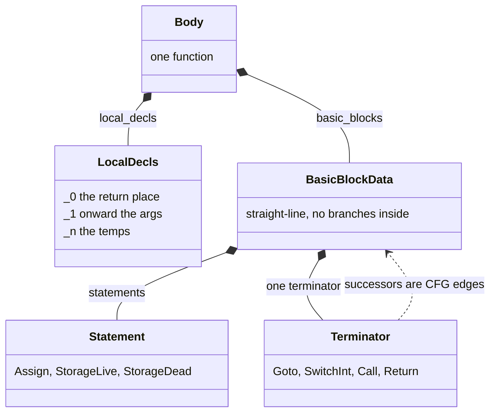
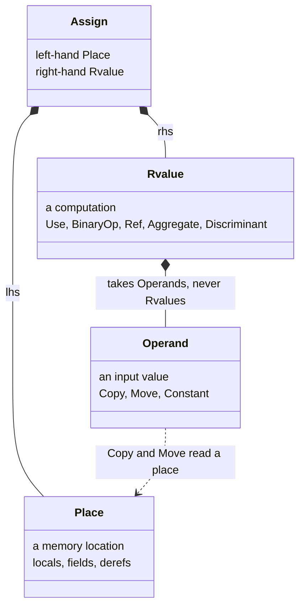
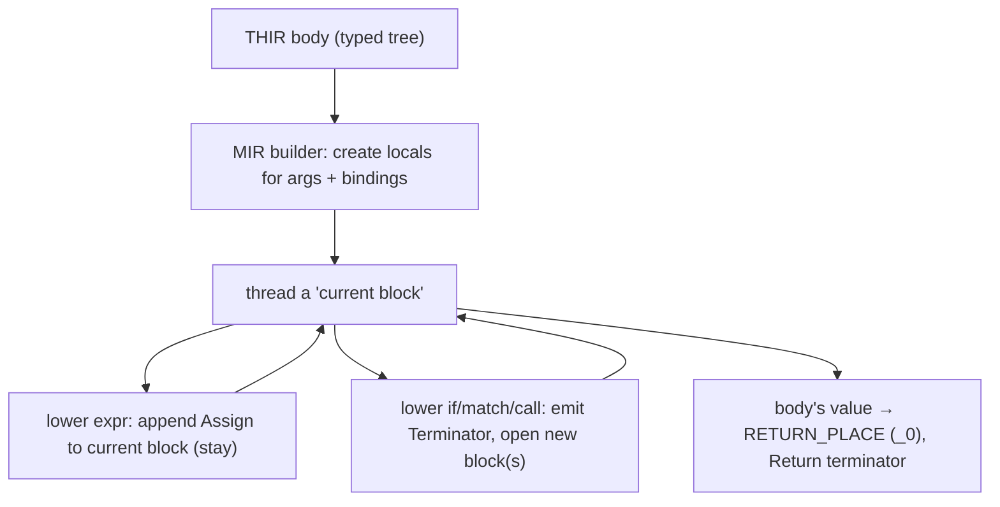
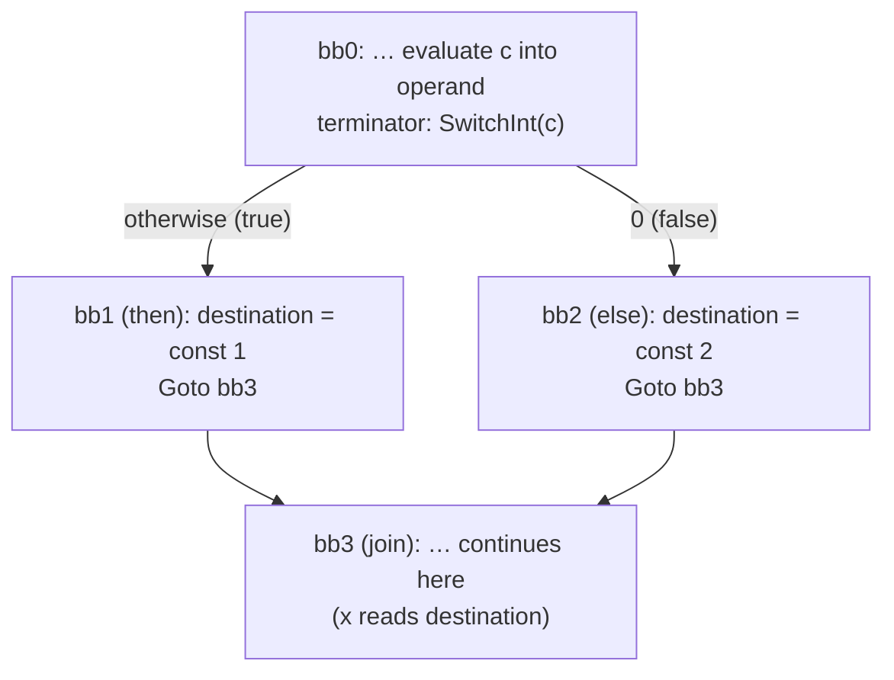
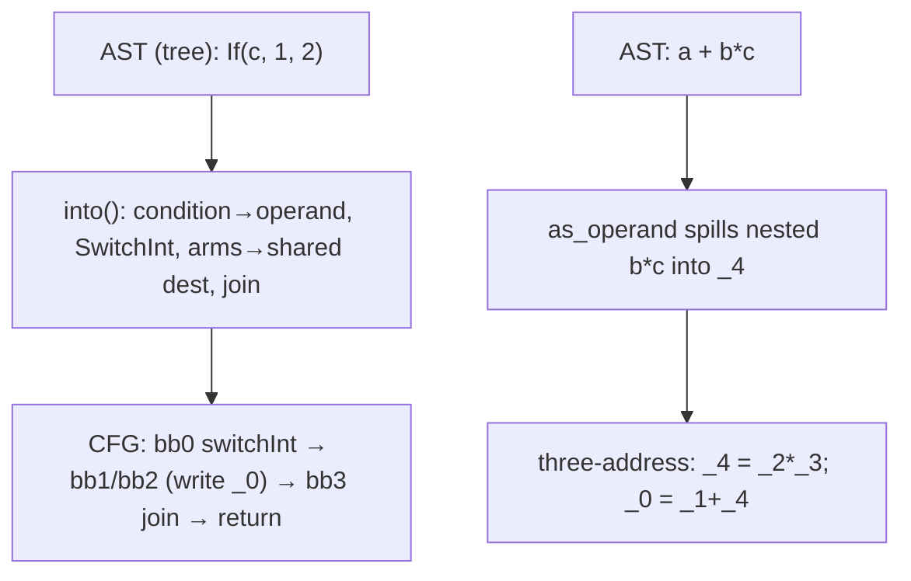

```admonish abstract title="What you'll learn"
- Why [MIR](../glossary.md#mir) exists: tree-shaped IRs cannot answer flow-sensitive questions, so `rustc_mir_build` lowers the [THIR](../glossary.md#thir) into a **control-flow graph** of basic blocks over `Local`s and [`Place`](../glossary.md#place)s.
- The anatomy of a `Body` in `rustc_middle::mir`: `basic_blocks`, `local_decls` (with `_0` as `RETURN_PLACE`), `arg_count`, and the `MirPhase` field that records which lowering invariants currently hold.
- The **place / operand / rvalue trichotomy** that enforces three-address flatness: `Rvalue`s take `Operand`s, never other `Rvalue`s, so `a + b * c` *must* spill into a temporary.
- How the MIR builder threads a **current block** through the THIR walk using `BlockAnd<T>` and the `unpack!` macro, appending `Statement`s or emitting `Terminator`s as it goes.
- How `ExprKind::If` lowers via `expr_into_dest`: condition to operand, `SwitchInt` fork, both arms writing the **same destination** in their own blocks, then a fresh **join block** where control reconverges.
- Why borrowck-only constructs like `FakeRead` and `FalseEdge` are valid only in the early `MirPhase` and how `TerminatorKind::if_` and `SwitchTargets::static_if` are the helpers that actually build the fork.
```

## 14.1 MIR: The Mid-level Intermediate Representation

### When a tree is no longer enough

Every IR so far in this book has been a **tree**. The [AST](../glossary.md#ast) was a tree of syntax; the [HIR](../glossary.md#hir) a tree with the sugar removed; the THIR a typed tree. Trees are the natural shape for *reading* a program; nesting expresses containment directly. But the compiler is about to do things a tree cannot express well. It must ask: along *every path of execution*, does this reference outlive the thing it points to? Is this variable definitely initialized before it is read? Can this temporary be dropped here? These are **flow-sensitive** questions: questions about *paths through control flow* and *locations in memory*, and a tree, which represents *containment* rather than *sequence*, is the wrong tool. A `match` is one tree node but several control-flow paths; an `if` is one node but a fork. To reason about what happens *in what order, along which branch*, the compiler needs a representation shaped like *execution itself*.

That representation is the **MIR**, the **Mid-level Intermediate Representation**, and it is the rung of the IR ladder this book has been climbing toward since Chapter 1. The dev-guide's framing is exact: MIR is "a radically simplified form of Rust that is used for certain flow-sensitive safety checks, notably the [borrow checker](../glossary.md#borrow-checker)!, and also for optimization and code generation." Where the tree-shaped IRs served *understanding*, MIR serves *verification of safety* and *translation to machine code*. With MIR, the front-and-middle end's tree finally becomes a **graph**.

### The classic theory: control-flow graphs and three-address code

MIR is a textbook structure wearing Rust's clothes. Two classic ideas define it.

The first is the **control-flow graph (CFG)**. Compiler theory represents a procedure's possible executions as a directed graph whose nodes are **basic blocks**, maximal straight-line sequences of instructions with *no branches in the middle*, and whose edges are the possible jumps between them. Execution enters a block at the top, runs every instruction in order with no escape, and leaves only at the bottom, where a single branching instruction decides which block comes next. The Dragon Book builds every dataflow analysis on this structure precisely because its "no branches inside a block" property makes reasoning local: within a block, statement *n* always follows statement *n−1*; only at block boundaries does control fork or merge. MIR is, structurally, exactly a CFG.

The second is **three-address code**: the discipline of breaking complex expressions into a sequence of simple operations, each computing one value into one temporary from at most two operands. `a + b * c` is not one nested expression but two steps: `t1 = b * c; t2 = a + t1`. This flattening is what lets each operation be analyzed in isolation, and MIR adopts it: in MIR, as the verified docs stress, **rvalues cannot be nested**: every intermediate value is named and stored before it is used, so there are no expressions-within-expressions to untangle. The tree's nesting is gone, replaced by a flat sequence of assignments.

### What MIR is: a `Body` of basic blocks over places

The MIR for one function is a `Body` (verified: "the lowered representation of a single function"). Its anatomy, all verified from `rustc_middle::mir`:

- **Basic blocks.** `Body::basic_blocks` is an `IndexVec` of `BasicBlockData`, each a list of `Statement`s ending in exactly one `Terminator`. A `BasicBlock` is just a newtype index into that vector; code indexes into `Body::basic_blocks` rather than holding direct references. The verified key property: no branches (`if`s, calls, etc.) within a basic block, which makes data-flow analyses tractable; branches are *edges*, represented by the terminator's successors.
- **Locals.** Every variable, argument, and temporary is a `Local`, a newtype index, written `_1`, `_2`, …, whose declaration lives in `Body::local_decls`. One local is special: `RETURN_PLACE`, the local `_0`, which holds the function's return value. Arguments are the locals `_1..=arg_count`.
- **Places.** A `Place` is an expression identifying a *location in memory*: a `Local` plus a chain of **projections** (`ProjectionElem`): `_1.f` is `_1` projected by field `f`; `*_1` is `_1` projected by `Deref`. Places are the *left-hand sides* of assignments and the things the borrow checker reasons about: "does this place outlive that borrow?"
- **Rvalues.** An `Rvalue` is an expression that *produces* a value: the *right-hand side* of an assignment (the "R" is for right). `_2 + const 1`, `&_3`, `[move _4, move _5]`. Rvalues reference places and constants but, crucially, do not nest.
- **Statements and terminators.** A `Statement` is a non-branching action: most commonly `Assign(place, rvalue)`, but also storage markers (`StorageLive`/`StorageDead`, bracketing a local's stack lifetime) and others. A `Terminator` ends the block and chooses the next: `Goto` (unconditional), `SwitchInt` (the lowering of `if` and `match`, branch on an integer discriminant to one of several blocks), `Call` (call a function, then continue at a target block), `Return`, and unwinding terminators.




### Radically simplified: everything is explicit

The dev-guide calls MIR "radically simplified," and the radicalism is *explicitness*: things the source language leaves implicit are spelled out as ordinary MIR operations. An arithmetic `a + b` becomes a checked operation plus an `assert` terminator that branches to a panic block on overflow, the overflow check that was invisible in the source is now a visible edge in the graph. A value going out of scope becomes an explicit `Drop` terminator. A local's stack storage is bracketed by `StorageLive`/`StorageDead` statements. The implicit dereferences and field accesses the THIR already made explicit (§13.1) survive as `Place` projections. By the time code is MIR, *nothing is hidden*: every operation, every check, every drop, every branch is a node or edge you can point at, which is exactly what makes the flow-sensitive analyses possible. You cannot check that drops happen correctly along every path unless drops are *in the graph*; MIR puts them there.

```admonish tip title="Pro-Tip, reading MIR shows what your Rust code actually does at the operational level"
`rustc --emit=mir` (or the playground's "MIR" output) prints this representation, and it is the ground truth for surprising behavior. Where does that hidden `clone` come from? Why does this overflow panic? When exactly does this temporary drop? The MIR answers all three by showing them as explicit statements and terminators. Reading MIR feels foreign at first (`_1`, `bb3`, `SwitchInt`) but it is just the CFG above, and a few minutes with the MIR of a small function tends to clarify Rust's operational semantics more concretely than reading the source. When the source is ambiguous about *order* or *drops* or *checks*, drop to MIR.
```

### Where MIR comes from, and what consumes it

MIR is **constructed from the THIR** (Chapter 13), not the HIR, the verified rationale being that the THIR's inline types, desugared method calls, and explicit derefs make the lowering tractable (the §13.1 Pro-Tip). The MIR builder (in the `rustc_mir_build` crate) walks the THIR recursively, creating locals for arguments and bindings and emitting basic blocks; the verified construction note describes it creating "local variables for every argument," then for every binding, then generating the field accesses and the recursive body lowering that writes its result into `RETURN_PLACE`. An `if` or fieldless-enum `match` becomes a `SwitchInt` terminator with one target block per value (§14.2/§14.3 will read this).

And MIR is the **substrate for the entire back half of the compiler**. The major consumers, each a coming chapter or section, all operate on MIR rather than any tree: **borrow checking** (Chapter 15, the flow-sensitive analysis MIR was largely designed to enable), **MIR optimizations and const evaluation** (Chapter 16, dataflow-based transforms that simplify the CFG), and **code generation** (Chapter 17 onward, lowering MIR to [LLVM IR](../glossary.md#llvm-ir) or Cranelift). MIR is built once and then *used* by all of them; it is the meeting point of the middle and back ends.

```admonish warning title="Warning, MIR exists in phases, and which analyses are valid depends on the phase"
A `Body` carries a `MirPhase` field, because MIR is not static: it is *progressively lowered and transformed*. Freshly built MIR (`built`) still contains constructs (like fake borrows and unsimplified drops) that later phases remove; borrow checking runs on an early phase, optimizations on later ones, and codegen on the final `runtime` phase where, for example, overflow checks may have been lowered differently. The consequence for anyone working on MIR: a pass written assuming one phase's invariants will break on another's. You cannot ask "what does MIR look like?" without asking "at which phase?": the same function has a *different, valid* MIR at `built`, after borrowck, and at `runtime`. The phase field is the compiler tracking which simplifications have happened so each pass sees the invariants it expects.
```

### Where this leaves us

MIR is the IR the whole book has been ascending toward: the point where the tree becomes a **graph**. Tree-shaped IRs cannot express the *flow-sensitive*, *memory-located* questions (does a reference outlive its referent? is this initialized along every path?) that borrow checking, optimization, and codegen must answer, so the compiler lowers to a **control-flow graph** of **basic blocks** (straight-line `Statement`s ending in one branching `Terminator`, branches as edges) over `Local`s and `Place`s (memory locations, with `_0` the return place), with `Rvalue`s that, in three-address-code fashion, **cannot nest**. MIR is "radically simplified" by being radically *explicit*: overflow checks become `assert` edges, scope-exits become `Drop` terminators, storage becomes `StorageLive`/`StorageDead`: nothing hidden, everything analyzable. It is **built from the THIR** and is the shared **substrate** for borrow checking (Chapter 15), optimization and const eval (Chapter 16), and codegen (Chapter 17 onward), existing in progressive **phases** whose invariants each pass depends on.

§14.2 takes the architecture deep-dive: the `Body` and its fields in detail, `BasicBlockData`/`Statement`/`Terminator`/`Place`/`Rvalue` as data types, the MIR builder's recursive lowering from THIR, how `SwitchInt` realizes control flow, and the `MirPhase` progression. Then §14.3 reads the real lowering of an `if` into a `SwitchInt` and its blocks, and §14.4 has you build a small AST-to-CFG lowerer that turns a tree of expressions into basic blocks over temporaries.

## 14.2 The Architecture: the `Body`, the CFG, and MIR Construction

### The shape of a lowered function

Each piece of the CFG MIR sketched in §14.1 is a concrete data type, and the MIR builder assembles them from the THIR. The throughline is the **place / operand / rvalue trichotomy**: three categories whose separation is what makes MIR's grammar tractable, and the **current-block** discipline by which a tree is unspooled into a graph.

### The `Body` and its blocks

The container is `Body`, with around nineteen fields; the load-bearing few:

```rust
// rustc_middle::mir  (faithful; representative fields, abridged)
pub struct Body<'tcx> {
    pub basic_blocks: BasicBlocks<'tcx>, // the CFG: IndexVec<BasicBlock, BasicBlockData>
    pub local_decls: IndexVec<Local, LocalDecl<'tcx>>, // _0 (return), _1.._arg (args), temps
    // how many of the locals are arguments
    pub arg_count: usize,
    // which lowering stage this Body is in (§14.1)
    pub phase: MirPhase,
    pub source: MirSource<'tcx>,
    // … source_scopes, var_debug_info, span, … …
}
```

`basic_blocks` is the graph; `local_decls` is the storage. Recall the conventions (§14.1): `_0` is `RETURN_PLACE`, locals `_1..=arg_count` are the arguments, and the rest are bindings and temporaries. A `BasicBlockData` is the node:

```rust
pub struct BasicBlockData<'tcx> {
    pub statements: Vec<Statement<'tcx>>, // straight-line, no branches
    pub terminator: Option<Terminator<'tcx>>, // the single branching exit
    pub is_cleanup: bool, // is this an unwind-path block?
    // … (abridged; one debuginfos field omitted) …
}
```

### Statements: the straight-line actions

A `Statement` is a non-branching action. The workhorse is `Assign(place, rvalue)`: "store this computed value into this location." A handful of other variants matter for later chapters: `StorageLive(Local)` and `StorageDead(Local)` bracket a local's lifetime on the stack (§14.1), and `FakeRead` is a no-op at runtime that exists *purely* to give the borrow checker (Chapter 15) something to point at. The full `StatementKind` variant list lives in `rustc_middle::mir::syntax` and the dev-guide MIR chapter; statements never branch, that is the terminator's job.

### Terminators: the branching exits

A `Terminator` ends a block and selects its successor(s). The three that anchor the rest of this chapter:

```rust
pub enum TerminatorKind<'tcx> {
    Goto { target: BasicBlock }, // unconditional jump
    SwitchInt { discr: Operand<'tcx>, targets: SwitchTargets }, // branch on an integer (if / match)
    Return, // return _0 to caller
    // … Call, Assert, Drop, Unreachable, FalseEdge, FalseUnwind, Yield, …
}
```

This is where §14.1's "branches are edges" becomes literal: the `target`/`targets` fields *are* the CFG edges. `Goto` has one successor; `SwitchInt` has several (one per value in its `SwitchTargets`, plus an "otherwise"); `Return` has none, it leaves the function. The full set (`Call`, `Assert`, `Drop`, the unwind variants, and the rest) is in `TerminatorKind`'s rustdoc and the dev-guide MIR page; later sections introduce `Assert` (overflow), `Drop` (destructors), and `Call` (with its unwind edge) when they are actually used. Every control-flow construct in Rust becomes some arrangement of these.

### The trichotomy: place, operand, rvalue

Here is the distinction that makes MIR legible, all three verified types:

- A **`Place`** is *a location*: a `Local` plus `ProjectionElem`s (`_1`, `_1.f`, `*_1`, `_1[_2]`). It is a left-hand side: where a value lives, what a borrow refers to.
- An **`Operand`** is *a value used as input*. The everyday variants are `Copy(place)` (read a place, leaving it valid), `Move(place)` (read it, invalidating it, Rust's move semantics, explicit at last), and `Constant(c)`. (A fourth, `RuntimeChecks`, exposes session flags as operand-shaped values and is rarely seen in practice.) Operands are what statements and rvalues *consume*.
- An **`Rvalue`** is *a computation producing a value*: `Use(operand)`, `BinaryOp(op, (a, b))`, `Ref(region, kind, place)` (take a reference, the borrow operation), `Aggregate(..)` (build a struct/tuple/array), `Discriminant(place)` (read an enum's tag), `Cast`, and so on. Rvalues are right-hand sides.

The grammar is strict and is the §14.1 three-address-code rule made structural: a `Statement::Assign` is `place = rvalue`; an `Rvalue` is built from `Operand`s; an `Operand` is a `Place` or constant. **Rvalues cannot contain rvalues.** `a + b * c` *must* become two assignments (`_t = b * c; _r = a + _t`) because `BinaryOp` takes `Operand`s, not `Rvalue`s: there is nowhere to nest a multiplication inside an addition. The trichotomy *enforces* flatness: each layer can only reference the layer below, never itself.




```admonish tip title="Pro-Tip, Copy vs Move on operands is where Rust's ownership becomes visible"
In the source, `let y = x;` looks the same whether `x` is an `i32` (copied) or a `String` (moved), the difference is type-driven and invisible. In MIR it is *right there*: the operand is `Copy(_x)` for the `i32` and `Move(_x)` for the `String`. Reading MIR is therefore the way to settle "is this a move or a copy here?", the question that confuses every Rust beginner. And it is exactly this `Move`-vs-`Copy` distinction, explicit on every operand, that the borrow checker (Chapter 15) reads to track which places are still valid. Ownership stops being a source-level abstraction and becomes a concrete annotation on each use.
```

### Building MIR from the THIR

The MIR builder (the MIR-build crate, [VERIFY] currently `rustc_mir_build`) constructs a `Body` by walking the **THIR** recursively (§13/§14.1). The verified construction sequence: it "creates local variables for every argument as specified in the signature," then for every binding (a pattern like `(a, b): (i32, String)` makes three locals, one argument, two bindings), generates the field accesses that read the argument into the bindings, and finally "triggers a recursive call to a function that generates the MIR for the body... and writes the result into the `RETURN_PLACE`."

The recursion threads a **current block**. The builder holds "the block we are currently appending statements to," and the MIR-generating functions (the dev-guide notes they "fall into one of two patterns") either *append a statement* to the current block and stay, or *emit a terminator* and start a fresh block for what follows. Lowering `x + 1` evaluates `x` into an operand, evaluates `1`, emits `_t = Add(x, const 1)` into the current block. Lowering an `if` is where a new block must open, the next subsection's subject. This "thread a current block, append or branch" loop is precisely how a *tree* (the THIR, with its nesting) is serialized into a *graph* (the CFG, with its explicit edges): the recursion's depth becomes the block's statement order, and the recursion's branches become the terminator's edges.




### How `SwitchInt` realizes branching

The verified construction note states it directly: "`if` conditions and `match` statements for enums with variants that have no fields are lowered to `TerminatorKind::SwitchInt`. Each possible value (so 0 and 1 for `if` conditions) has a corresponding `BasicBlock`." So an `if c { A } else { B }` becomes: evaluate `c` into an operand, end the current block with `SwitchInt { discr: c, targets: {1 → bbA, otherwise → bbB} }`, lower `A` into `bbA` and `B` into `bbB`, and have both jump (`Goto`) to a common *join* block `bbJoin` where execution reconverges. A `match` over an enum is the same idea with one target per discriminant. The fork-and-join that was a single `if` *node* in the tree is now four blocks and a fistful of edges in the graph, flow-sensitive analyses can now walk it.

```admonish warning title="Warning, FakeRead and false edges exist for the borrow checker, not for execution, don't optimize them away early"
MIR contains constructs that do *nothing* at runtime: `FakeRead` statements, and `FalseEdge`/`FalseUnwind` terminators. They are not mistakes and not dead code: they exist so the borrow checker (Chapter 15) sees control-flow and read patterns it must police but that the *optimized* program would not literally perform. A `match` guard, for instance, gets fake edges so borrowck treats the guard as able to inspect the matched place. The consequence: these constructs are valid only in the *early* (pre-borrowck) `MirPhase`, and a later pass removes them; an optimization that ran too early and deleted a `FakeRead` as "useless" would blind the borrow checker. This is the §14.1 phase warning made concrete: the same `Body` legitimately contains borrowck scaffolding at one phase and not at another, and *which* constructs are present is part of the phase's contract.
```

### `MirPhase`: the same body, progressively lowered

The `phase` field tracks where a `Body` sits in a pipeline of lowering. The progression [VERIFY shape against current rustc, phases may have sub-states]: **`Built`**, fresh from the THIR, with all the borrowck scaffolding (fake reads, false edges, unsimplified drops); the **analysis** phase on which **borrow checking** runs; and **`Runtime`**, after borrowck and the drop-elaboration and optimization passes, the form **codegen** consumes, where overflow checks and drops have been lowered to their final shapes. Each phase guarantees different invariants (which rvalues are allowed, whether drops are elaborated, whether fake constructs remain), and every MIR pass declares the phase it operates on. This is why §14.1 insisted you cannot speak of "the" MIR of a function: it is a *sequence* of valid Bodies, each a further-lowered version of the last, and the phase field is the compiler's record of how far down that sequence a given `Body` has traveled.

### How this builds, and what is next

The architecture is concrete now. A `Body` holds the CFG in `basic_blocks` and the storage in `local_decls` (with `_0` the return place and `_1..=arg_count` the arguments), tagged with a `MirPhase`. Each `BasicBlockData` is straight-line `Statement`s (overwhelmingly `Assign(place, rvalue)`, plus `StorageLive`/`Dead` and the borrowck-only `FakeRead`) ending in one `Terminator` (`Goto`, `SwitchInt`, `Call`, `Return`, `Assert`, `Drop`) whose target fields *are* the CFG edges. The **place / operand / rvalue trichotomy** enforces three-address flatness (rvalues take operands, operands read places, and rvalues cannot nest) and makes ownership visible as `Copy` vs `Move` on every operand. The **MIR builder** lowers the THIR by threading a **current block**, appending statements or emitting terminators, turning the tree's nesting into the graph's edges; `if`/`match` become `SwitchInt` forks that rejoin at a join block. Borrowck-only constructs (`FakeRead`, false edges) live in the early phase, and the `MirPhase` progression (`Built` → analysis → `Runtime`) records how far a `Body` has been lowered, each phase with its own invariants.

§14.3 reads the real lowering of an `if` expression: the THIR `If` arm in the MIR builder, evaluating the condition into an operand, emitting the `SwitchInt`, lowering the two arms into their blocks, and joining, so you can watch one tree node become a fork-and-join in the graph. Then §14.4 has you build a small lowerer that turns a toy expression-and-`if` AST into basic blocks over numbered temporaries.

## 14.3 Reading the Source: Lowering an `if` into a `SwitchInt`

### One node becomes a fork and a join

A single `if` *node* in the THIR becomes a fork-and-join of basic blocks in MIR, and the code that does it lives in the MIR builder (in `rustc_mir_build`). Lower

```rust
let x = if c { 1 } else { 2 };
```

and watch one tree node turn into four blocks and a fan of edges. First, though, we need the idiom that makes the builder's "thread a current block" discipline (§14.2) actually work in code: `BlockAnd`.

### `BlockAnd`: threading the current block

A MIR-building method takes the block it should append to and returns the block control ends up in (which may differ, if the method emitted a terminator and opened new blocks). That pairing is the verified type **`BlockAnd<T>`**: "a value `T`, and the block you are now in." The companion macro **`unpack!`** binds the value and updates the current-block variable in one move:

```rust
// the idiom, everywhere in the builder
let mut block = START_BLOCK;
// lower `expr` into `block`;
let operand = unpack!(block = this.as_operand(block, expr));
//            ^^^^^^^^^^^^^^ // `block` is now wherever we ended up
```

This is the §14.2 "current block" made concrete: every lowering step *consumes* a block and *yields* the block to continue in, so a straight-line sequence keeps `block` pointing at one growing basic block, while a branching step reassigns `block` to a freshly-opened one. The whole builder is this single variable being threaded through the recursion.

The builder also has the category cascade §14.2 hinted at: `into(place)` lowers an expression *into a destination place*, falling back to `as_rvalue` (build an `Rvalue`), which falls back to `as_operand` (build an `Operand`), which falls back to `as_temp` (spill into a fresh temporary). Each expression is implemented at its most natural level and the others cycle around it. For an `if`, the relevant entry is `into` (real method: `expr_into_dest`): an `if` *produces a value*, so it is lowered into the destination place that will hold its result.

### The `if` lowering

Faithful to the builder's `into` for `ExprKind::If`:

```rust
// rustc_mir_build/src/builder/expr/into.rs: expr_into_dest, ExprKind::If arm
// (illustrative; real condition lowering routes through `then_else_break`, which
//  handles scopes/let-chains and internally builds the SwitchInt terminator)
ExprKind::If { cond, then, else_opt, .. } => {
    // 1. Open the two arm blocks and split control flow on `cond`.
    //    The real call `this.then_else_break(block, cond, …, DeclareLetBindings::Yes)`
    //    builds, on `block`, a terminator semantically equivalent to
    //      SwitchInt { discr: cond, targets: { 0 → else_blk, otherwise → then_blk } }
    //    and yields the two split-point blocks.
    let then_blk = /* then-side block from then_else_break */;
    let mut else_blk = /* else-side block from then_else_break */;

    // 2. Lower the `then` arm INTO the destination place.
    let then_blk = this.expr_into_dest(destination, then_blk, then).into_block();

    // 3. Lower the `else` arm (or assign `()` if it's absent) INTO the same destination.
    if let Some(else_expr) = else_opt {
        else_blk = this.expr_into_dest(destination, else_blk, else_expr).into_block();
    } else {
        this.cfg.push_assign_unit(else_blk, source_info, destination, this.tcx);
    }

    // 4. Both arms jump to a fresh JOIN block; control reconverges there.
    let join_blk = this.cfg.start_new_block();
    this.cfg.goto(then_blk, source_info, join_blk);
    this.cfg.goto(else_blk, source_info, join_blk);

    // 5. Continue in the join block.
    join_blk.unit()
}
```

Read it as five moves, each mapping to §14.2 machinery:

1. **Condition to operand.** `as_local_operand` lowers `c` into an `Operand` (a `Copy`/`Move` of a place, or a constant), appending whatever statements that needs to the current `block` and threading `block` forward via `unpack!`.
2. **The fork.** Two new blocks are opened, and the *current* block is terminated with a `SwitchInt` on the condition operand, the verified `TerminatorKind::if_` helper builds exactly `SwitchInt { discr, targets: {0 → else, otherwise → then} }`. This is the §14.2 claim literal: the `if` *node* has become a `SwitchInt` *terminator*, and its two targets are CFG edges.
3. **The arms, into one place.** Each arm is lowered with `into(destination, …)`, crucially, into the *same* `destination` place, because both arms of an `if` must produce the value the whole expression yields. The `then` arm writes `1` into `destination` in `then_blk`; the `else` arm writes `2` into `destination` in `else_blk`. This is why `if` is an expression in Rust: both branches assign the one result place.
4. **The join.** A fresh `join_blk` is opened and *both* arm blocks are terminated with `Goto join_blk`. Control that forked at the `SwitchInt` reconverges here, the diamond closes.
5. **Continue.** The method returns `join_blk.unit()`: a `BlockAnd<()>` saying "the value is unit-ish (already written to `destination`), and you are now in `join_blk`." The caller's `block` variable becomes `join_blk`, and lowering continues from the merge point.




For `let x = if c { 1 } else { 2 };`, the result is exactly four blocks: `bb0` evaluates `c` and switches; `bb1` assigns `1`; `bb2` assigns `2`; `bb3` is the join where `x` takes the destination's value. The single THIR `If` node is gone, replaced by a diamond in the graph, and now a flow-sensitive analysis can ask "what is true along the `then` edge versus the `else` edge?", which is exactly what borrow checking (Chapter 15) will do.

```admonish tip title="Pro-Tip, both arms writing the same destination is why if-without-else must be unit"
Step 3 lowers both arms into one `destination` place, which only typechecks if both arms have the same type, the source-level rule "both branches of an `if` expression must have the same type." And it explains the asymmetry of `if` *without* an `else`: there is no second arm to write the destination, so the only sound value for the missing branch is `()`, which is why `let x = if c { 5 };` is an error ("expected `()` , found integer") unless the `then` arm is also `()`. The MIR shape, one shared destination, both arms assigning it, is the operational reason behind a rule that otherwise looks arbitrary at the source level.
```

### How `match` generalizes this

An `if` is the two-way case; a `match` is the n-way generalization, and the verified construction note gives the extra wrinkle. For an enum `match`, the discriminant must first be *read*: "match statements for enums with variants that have fields are lowered to `TerminatorKind::SwitchInt`, too, but the `Operand` refers to a `Place` where the discriminant of the value can be found. This often involves reading the discriminant to a new temporary." So `match opt { Some(x) => …, None => … }` lowers to: read `Discriminant(opt)` into a temp (an `Rvalue::Discriminant`, §14.2), `SwitchInt` on that temp with one target block per variant, lower each arm into its block (binding `x` from `opt`'s field in the `Some` block via place projections), and `Goto` a common join. The `if` diamond becomes a wider fan, but the skeleton (evaluate a discriminant, `SwitchInt`, lower arms into blocks, join) is identical. (Fieldless enums and `if` skip the discriminant read since the value *is* the integer to switch on.)

```admonish warning title="Warning, the join block is mandatory even when one arm diverges, and forgetting it corrupts the CFG"
It is tempting to think that if the `else` arm is `return x;` (it diverges, never reaches the join), you can skip wiring it to the join block. You cannot reason that way while *building*: the builder still lowers each arm and only the arm that *actually* diverges ends in a diverging terminator (`Return`, or a `Goto` to an unreachable block) instead of a `Goto join`. The join block must still exist for the *converging* arms, and the CFG must remain well-formed: every non-returning block ends in a terminator with valid successors. A subtle class of MIR-builder bugs is producing a block with *no* terminator (the builder "forgot" to close it) or an edge to a block that was never started; the `BlockAnd` discipline exists precisely to make this hard, by forcing every lowering step to hand back the block it leaves you in. When you read or write builder code, the invariant to hold is: *every block gets exactly one terminator, and every `unpack!` accounts for where control went.*
```

### How this builds, and what is next

We have watched a tree node become a graph fragment. The builder threads the **current block** through every step via `BlockAnd<T>` and `unpack!`, each lowering consumes a block and yields the block to continue in, and chooses how to lower each expression through the `into`/`as_rvalue`/`as_operand`/`as_temp` category cascade. Lowering `ExprKind::If` via `into` is five moves: evaluate the condition to an `Operand`, terminate the current block with a `SwitchInt` (its targets the CFG edges), lower **both arms into the same destination place** (the operational root of "both branches must agree, and `else`-less `if` is `()`"), `Goto` both arm-blocks to a fresh **join block**, and continue there. `let x = if c { 1 } else { 2 };` becomes four blocks and a diamond. `match` generalizes the same skeleton n ways, reading an enum's `Discriminant` into a temp first. The `BlockAnd` discipline guarantees the CFG stays well-formed: every block gets exactly one terminator.

§14.4 turns this into a build. You will write a small lowerer that takes a toy AST, arithmetic plus an `if`/`else` expression, and produces a list of basic blocks over numbered temporaries: flattening nested arithmetic into three-address assignments (§14.1), and lowering each `if` into a `SwitchInt`-style fork with two arm blocks writing a shared destination and a join block, exactly as you just read. You will turn a tree into a CFG with your own hands.

## 14.4 Hands-On Lab: Build an AST-to-CFG Lowerer

### Turning a tree into a graph

This lab builds the transformation at the heart of the chapter: a **lowerer** that takes a tree of expressions, arithmetic and `if`/`else`, and produces a **control-flow graph** of basic blocks over numbered temporaries, exactly as the MIR builder does (§14.3). You will flatten nested arithmetic into **three-address** assignments (§14.1, no nested rvalues), thread a **current block** through the recursion (the `BlockAnd` idiom of §14.3), and lower each `if` into a `SwitchInt` fork with two arm-blocks writing a shared destination and a join block. When your lowerer turns `if c { 1 } else { 2 }` into a four-block diamond and prints it, you will have built the tree-to-graph hinge with your own hands.

`cargo new`, pure `std`.

### The MIR-like data types

A faithful miniature of §14.2: locals (`_0`, `_1`, …), places, operands, rvalues, statements, terminators, and basic blocks.

```rust
// src/main.rs

type Local = usize; // _0, _1, _2, …  (_0 is the return place, §14.2)
type BlockId = usize; // bb0, bb1, …

#[derive(Clone, Debug)]
enum Operand { Copy(Local), Const(i64) } // an input value (§14.2 trichotomy)

#[derive(Clone, Debug)]
enum Rvalue { // a computation (right-hand side)
    Use(Operand),
    // takes OPERANDS, never Rvalues → no nesting
    BinOp(char, Operand, Operand),
}

#[derive(Clone, Debug)]
enum Stmt { Assign(Local, Rvalue) } // place = rvalue (§14.2 core statement)

#[derive(Clone, Debug)]
enum Terminator {
    Goto(BlockId), // unconditional edge
    /// n-way switch: jump to `targets[i].1` if `discr == targets[i].0`, else
    /// to `otherwise`. The shape mirrors rustc's `SwitchInt { discr, targets:
    /// SwitchTargets }` where `SwitchTargets { values, targets }` keeps an
    /// extra trailing block for the otherwise fallback
    /// (`rustc_middle/src/mir/syntax.rs:1005-1029`,
    ///  `rustc_middle/src/mir/terminator.rs:13-29`). `if`-lowering uses the
    /// 2-way case `static_if(0, else, then)`; `match` (and the §14.4 `while`
    /// extension) would fill `targets` with more entries.
    SwitchInt { discr: Operand, targets: Vec<(i64, BlockId)>, otherwise: BlockId },
    Return,
}

impl Terminator {
    /// The 2-way case used by `if`-lowering: discr==value goes to `then`,
    /// everything else falls through to `otherwise`. Mirrors
    /// `SwitchTargets::static_if` (`rustc_middle/src/mir/terminator.rs:13-29`)
    /// wrapped by `TerminatorKind::if_` (`:507-509`).
    fn static_if(discr: Operand, value: i64, then: BlockId, otherwise: BlockId) -> Terminator {
        Terminator::SwitchInt { discr, targets: vec![(value, then)], otherwise }
    }
}

// `term` starts as `None` (block not yet closed); `terminate` asserts it is still
// `None` before writing, mirroring rustc's `cfg.terminate` invariant
// (`compiler/rustc_mir_build/src/builder/cfg.rs:124-130`).
struct BasicBlock { stmts: Vec<Stmt>, term: Option<Terminator> }

/// A value paired with the block control ends up in (§14.3 `BlockAnd<T>`,
/// `rustc_mir_build/src/builder/mod.rs:412-451`).
#[must_use = "if you don't use one of these results, you're leaving a dangling edge"]
struct BlockAnd<T>(BlockId, T);

/// The `unpack!` macro from rustc: bind the value, update the current-block
/// variable in one move (§14.3).
macro_rules! unpack {
    ($x:ident = $c:expr) => {{ let BlockAnd(b, v) = $c; $x = b; v }};
}
```

### The source AST

The tree we lower: numbers, variables, binary operations (which nest), and an `if`/`else` expression (which forks):

```rust
enum Expr {
    Num(i64),
    Var(Local), // a pre-existing local, e.g. an argument
    BinOp(char, Box<Expr>, Box<Expr>), // a + b * c  -- nested!
    If(Box<Expr>, Box<Expr>, Box<Expr>), // if cond { then } else { els }
}
```

### The lowerer: a CFG, a temp counter, and a current block

The `Lowerer` mints fresh temporaries and owns an inner `CFG` that owns the growing block list. That split mirrors `rustc_mir_build`'s `Builder { ..., cfg: CFG<'tcx>, ... }` where `struct CFG<'tcx> { basic_blocks: IndexVec<BasicBlock, BasicBlockData<'tcx>> }` and every block mutation routes through `self.cfg.start_new_block()`, `self.cfg.push(...)`, `self.cfg.terminate(...)`, `self.cfg.goto(...)` (`rustc_mir_build/src/builder/mod.rs:392-394`, `rustc_mir_build/src/builder/cfg.rs:9-137`). Every lowering method follows the §14.3 `BlockAnd` discipline: it takes the **current block** to append to and returns `BlockAnd<T>` (the value plus the block control ends up in), threaded with `unpack!` exactly as rustc does.

```rust
/// The graph itself: just a vector of blocks, indexed by `BlockId`.
/// Mirrors `rustc_mir_build::builder::CFG` (`builder/mod.rs:392-394`).
struct CFG { blocks: Vec<BasicBlock> }

impl CFG {
    fn start_new_block(&mut self) -> BlockId {
        self.blocks.push(BasicBlock { stmts: vec![], term: None });
        self.blocks.len() - 1
    }
    fn push(&mut self, b: BlockId, s: Stmt) { self.blocks[b].stmts.push(s); }
    fn terminate(&mut self, b: BlockId, t: Terminator) {
        // mirrors `cfg.terminate`'s "exactly one terminator per block" assert
        // (`rustc_mir_build/src/builder/cfg.rs:124-130`)
        assert!(self.blocks[b].term.is_none(), "block bb{b} already terminated");
        self.blocks[b].term = Some(t);
    }
    /// `goto(origin, target)` collapses "build a Goto then terminate" into one
    /// call, mirroring `CFG::goto` (`rustc_mir_build/src/builder/cfg.rs:134-136`).
    fn goto(&mut self, origin: BlockId, target: BlockId) {
        self.terminate(origin, Terminator::Goto(target));
    }
}

struct Lowerer { cfg: CFG, next_temp: Local }

impl Lowerer {
    fn new(n_args: Local) -> Lowerer {
        // +1 to reserve _0 = return place
        Lowerer { cfg: CFG { blocks: vec![] }, next_temp: n_args + 1 }
    }
    // In real rustc, a fresh `Local` is minted by
    // `self.local_decls.push(LocalDecl::new(ty, span))`, returning the new
    // `IndexVec` index; the lab elides the `LocalDecl` (no types) and just
    // tracks the next index. See `rustc_mir_build/src/builder/misc.rs::temp`.
    fn fresh_temp(&mut self) -> Local { let t = self.next_temp; self.next_temp += 1; t }

    /// Lower `expr` as an OPERAND: returns `BlockAnd<Operand>`.
    /// Flattens nested arithmetic into three-address temporaries (§14.1).
    fn as_operand(&mut self, mut block: BlockId, expr: &Expr) -> BlockAnd<Operand> {
        match expr {
            Expr::Num(n)  => BlockAnd(block, Operand::Const(*n)),
            Expr::Var(l)  => BlockAnd(block, Operand::Copy(*l)),
            // a nested computation must be spilled into a fresh temp first:
            _ => {
                let rv = unpack!(block = self.as_rvalue(block, expr));
                let t = self.fresh_temp();
                self.cfg.push(block, Stmt::Assign(t, rv));
                BlockAnd(block, Operand::Copy(t))
            }
        }
    }

    /// Lower `expr` as an RVALUE: returns `BlockAnd<Rvalue>`.
    fn as_rvalue(&mut self, mut block: BlockId, expr: &Expr) -> BlockAnd<Rvalue> {
        match expr {
            Expr::Num(_) | Expr::Var(_) => {
                let op = unpack!(block = self.as_operand(block, expr));
                BlockAnd(block, Rvalue::Use(op))
            }
            Expr::BinOp(op, l, r) => {
                let lo = unpack!(block = self.as_operand(block, l)); // operands, not rvalues:
                let ro = unpack!(block = self.as_operand(block, r)); // forces the flattening
                BlockAnd(block, Rvalue::BinOp(*op, lo, ro))
            }
            // an `if` yields a value via a temp
            Expr::If(..) => {
                let dest = self.fresh_temp();
                unpack!(block = self.expr_into_dest(dest, block, expr));
                BlockAnd(block, Rvalue::Use(Operand::Copy(dest)))
            }
        }
    }

    /// Lower `expr` INTO a destination local: returns `BlockAnd<()>` (§14.3
    /// `expr_into_dest`, `rustc_mir_build/src/builder/expr/into.rs:28-33`; the
    /// colloquial name in the dev-guide is "into"). Argument order mirrors
    /// rustc: destination first, then the current block.
    fn expr_into_dest(&mut self, dest: Local, mut block: BlockId, expr: &Expr) -> BlockAnd<()> {
        match expr {
            Expr::If(cond, then, els) => {
                let c = unpack!(block = self.as_operand(block, cond));
                let then_blk = self.cfg.start_new_block();
                let else_blk = self.cfg.start_new_block();
                // 2-way `static_if`: discr == 0 → else_blk, otherwise → then_blk.
                // Mirrors `TerminatorKind::if_` wrapping
                // `SwitchTargets::static_if(0, false_blk, true_blk)`.
                self.cfg.terminate(block, Terminator::static_if(c, 0, else_blk, then_blk));
                // both arms write the SAME dest (§14.3): that is the join.
                let mut then_end = then_blk;
                unpack!(then_end = self.expr_into_dest(dest, then_blk, then));
                let mut else_end = else_blk;
                unpack!(else_end = self.expr_into_dest(dest, else_blk, els));
                let join = self.cfg.start_new_block();
                self.cfg.goto(then_end, join);
                self.cfg.goto(else_end, join);
                BlockAnd(join, ())
            }
            _ => {
                // a value-producing expr: compute its rvalue and assign to dest
                let rv = unpack!(block = self.as_rvalue(block, expr));
                self.cfg.push(block, Stmt::Assign(dest, rv));
                BlockAnd(block, ())
            }
        }
    }

    /// Lower a whole function body: result goes to _0 (RETURN_PLACE), then Return.
    fn lower_body(&mut self, body: &Expr) {
        let mut entry = self.cfg.start_new_block();
        unpack!(entry = self.expr_into_dest(0 /* _0 */, entry, body));
        self.cfg.terminate(entry, Terminator::Return);
    }
}
```

### A printer

```rust
fn fmt_operand(o: &Operand) -> String { match o { Operand::Copy(l) => format!("_{l}"), Operand::Const(n) => format!("const {n}") } }
fn fmt_rvalue(r: &Rvalue) -> String {
    match r {
        Rvalue::Use(o) => fmt_operand(o),
        Rvalue::BinOp(c, a, b) => format!("{} {c} {}", fmt_operand(a), fmt_operand(b)),
    }
}
fn print_cfg(lo: &Lowerer) {
    for (i, b) in lo.cfg.blocks.iter().enumerate() {
        println!("bb{i}:");
        for Stmt::Assign(l, r) in &b.stmts { println!("_{l} = {};", fmt_rvalue(r)); }
        match &b.term {
            Some(Terminator::Goto(t)) => println!(" goto -> bb{t};"),
            Some(Terminator::SwitchInt { discr, targets, otherwise }) => {
                let mut arms: Vec<String> =
                    targets.iter().map(|(v, b)| format!("{v}: bb{b}")).collect();
                arms.push(format!("otherwise: bb{otherwise}"));
                println!("switchInt({}) -> [{}];", fmt_operand(discr), arms.join(", "));
            }
            Some(Terminator::Return) => println!("    return;"),
            None => println!("    <unset>"),
        }
    }
}
```

### Running it

```rust
fn main() {
    // _1 = a, _2 = b, _3 = c  (three arguments)
    let a = || Box::new(Expr::Var(1));
    let b = || Box::new(Expr::Var(2));
    let c = || Box::new(Expr::Var(3));

    println!("=== body: a + b * c  (nested arithmetic → three-address) ===");
    let mut lo = Lowerer::new(3);
    lo.lower_body(&Expr::BinOp('+', a(), Box::new(Expr::BinOp('*', b(), c()))));
    print_cfg(&lo);

    println!("\n=== body: if c {{ 1 }} else {{ 2 }}  (fork → four-block diamond) ===");
    let mut lo = Lowerer::new(3);
    lo.lower_body(&Expr::If(c(), Box::new(Expr::Num(1)), Box::new(Expr::Num(2))));
    print_cfg(&lo);
}
```

````admonish example title="Expected output" collapsible=true
```text
=== body: a + b * c  (nested arithmetic → three-address) ===
bb0:
    _4 = _2 * _3;
    _0 = _1 + _4;
    return;

=== body: if c { 1 } else { 2 }  (fork → four-block diamond) ===
bb0:
    switchInt(_3) -> [0: bb2, otherwise: bb1];
bb1:
    _0 = const 1;
    goto -> bb3;
bb2:
    _0 = const 2;
    goto -> bb3;
bb3:
    return;
```
````

`a + b * c` is flattened into **three-address** form: the nested `b * c` could not stay inside the `+` (an `Rvalue::BinOp` takes `Operand`s, not `Rvalue`s, §14.2), so it spilled into the temporary `_4`, and the addition consumes `_4`, exactly the §14.1 "rvalues cannot nest." And `if c { 1 } else { 2 }` became the **four-block diamond** of §14.3: `bb0` switches on `_3`; `bb1` and `bb2` each write the *same* destination `_0` and jump to the join; `bb3` is where control reconverges and returns. The single `If` tree node is now a fork and a join in the graph, a CFG, built by your code, ready for the flow-sensitive analyses to come.




### What the lab stripped from real rustc

The lab's `BasicBlock`, `Stmt`, `Terminator`, `Rvalue`, and `Operand` are deliberately minimal. Real MIR (in `rustc_middle::mir`) keeps the same five names and fans each into the full vocabulary the language actually needs. The concepts the lab omits that matter most for later chapters: the **`MirPhase`** progression on a `Body` (§14.2), so each pass sees the invariants it expects; **`Place` projections** (`*p`, `.field`, `[i]`, `as Variant`), so the borrow checker can reason about paths like `v.0.field` rather than whole locals; **`Move` vs `Copy` on operands**, the explicit signal that drives borrowck's move analysis; and **[regions](../glossary.md#region) on `Rvalue::Ref`**, every borrow tagged with the region it must outlive. For the full vocabulary (the rest of `StatementKind`, the unwind and async variants of `TerminatorKind`, `Cast`/`Discriminant`/`Aggregate`/`Repeat`/`RawPtr` on `Rvalue`, the `newtype_index!` and `IndexVec` machinery), see the dev-guide MIR chapter and the `rustc_middle::mir` rustdoc.

One structural shortcut is worth naming explicitly: every `Local` appearing as an assignment lhs or inside `Operand::Copy` in the lab stands in for a real `Place` (a `Local` plus `&'tcx List<ProjectionElem>`); the lab elides the projection list entirely. Real `Assign` is `Assign(Box<(Place, Rvalue)>)` (`rustc_middle/src/mir/syntax.rs:341`), and real `Operand::Copy(Place)` carries the same projection chain. When a future extension adds projections, both the assignment lhs and every `Operand::Copy` change shape together.

A second shortcut is the integer indices: the lab writes `type Local = usize; type BlockId = usize;`, but in real rustc these are distinct newtypes minted by `newtype_index!` and indexed via `IndexVec`, so `BasicBlock` cannot accidentally be used where a `Local` is wanted. The two newtypes carry the named constants the chapter has been citing, `Local { const RETURN_PLACE = 0; }` (`rustc_middle/src/mir/mod.rs:842`) and `BasicBlock { const START_BLOCK = 0; }` (`:1271`), so the lab's "`_0` is the return place" convention is, in real rustc, the constant `RETURN_PLACE` on the `Local` newtype. The lab uses bare `usize` because the type-safety win is not what we are teaching here.

Chapter 15 picks up where the lab stops: the moment a `Rvalue::Ref` enters the graph, regions enter with it, and the next chapter checks them.

### Cross-check against real rustc

Save your lab's example function as a `.rs` file and ask rustc for the real MIR:

```bash
rustc +nightly -Zunpretty=mir foo.rs
# or, for a Graphviz CFG you can render:
rustc +nightly -Zunpretty=mir-cfg foo.rs > foo.dot
```

```admonish example title="What you should see" collapsible=true
The dump is verbose, but past the locals table you find the same shape your lab produced: numbered basic blocks, three-address statements, terminators branching on `switchInt` / `goto` / `return`.
```

Compare how a `for` becomes a back-edge, where rustc inserts cleanup edges your lab elides, and how `Place` projections (`(_5 as Some).0`, `_4.field`) refine what the lab represents as a flat local. The CFG is the same object; what rustc adds is the production scaffolding §14.3 walks through.

### Extension exercises

1. **`while` loops and back-edges.** Add `Expr::While(cond, body)` and lower it: a header block that evaluates the condition and `SwitchInt`s to either the body or the exit, with the body ending in a `Goto` *back* to the header. That back-edge makes the CFG cyclic, the structure dataflow analyses (Chapter 16) and the borrow checker iterate over.
2. **Storage markers.** Emit `StorageLive(_t)` before a temporary's first use and `StorageDead(_t)` after its last, bracketing each temp's lifetime as real MIR does (§14.1/§14.2). Print them and watch the stack discipline become explicit.
3. **`Move` vs `Copy`.** Tag each `Var` with whether its type is `Copy`. Lower a *moved* operand as `Move(_l)` and a copied one as `Copy(_l)` (§14.2), and add a check that errors if a local is used after it was moved, a tiny preview of the borrow checker's job (Chapter 15).
4. **Wire to your parser.** Feed the lowerer the output of your §7.4 parser (extended with `if`), so you have lex → parse → … → CFG: the front half of a compiler producing a real control-flow graph.
5. **Source spans.** Tag every `Expr` variant with `span: (line: u32, col: u32)` and thread the span through `as_operand`/`as_rvalue`/`expr_into_dest` into a new `SourceInfo` field on `Stmt` and `Terminator`. Have your printer prefix each statement with `// L:C` so the dump pins every operation to a source location. This is the scaffolding rustc threads through `cfg.push_assign(block, source_info, place, rvalue)`, the `SourceInfo` field on `rustc_middle::mir::statement::Statement@59807616e1fa`, and the borrow checker (Chapter 15) reads it to point its diagnostics at the source line that caused the error.
6. **Category dispatch.** Add `enum Category { Place, Const, Rvalue }` and `fn category(expr: &Expr) -> Category` mirroring `rustc_mir_build::builder::expr::category::Category::of@59807616e1fa`. Route `as_operand` through it: `Place`/`Const` shortcut directly to an operand, `Rvalue` spills via `as_temp`. You will have built the dispatch table that drives every MIR-lowering decision in rustc, the central cascade §14.3 sketched as `into` → `as_rvalue` → `as_operand` → `as_temp`.

### Where Chapter 14 leaves us

Chapter 14 is complete. §14.1 framed MIR as the rung where the **tree becomes a graph**: a control-flow graph of basic blocks over typed places, radically simplified by being radically explicit (overflow checks, drops, storage all visible), built from the THIR and serving as the substrate for borrow checking, optimization, and codegen. §14.2 opened the `Body`, the `Statement`/`Terminator`/`Place`/`Operand`/`Rvalue` data types and the trichotomy that enforces three-address flatness, the builder's current-block discipline, and the `MirPhase` progression. §14.3 read the real lowering of an `if` into a `SwitchInt` fork-and-join via `BlockAnd`. And in this lab you built a lowerer that flattens arithmetic and turns an `if` into a CFG diamond.

The compiler now holds the program as a graph of explicit operations over memory places, and that graph exists, more than for any other reason, to make possible the next analysis. Every reference (`Rvalue::Ref`), every move (`Operand::Move`), every place and every control-flow edge is now spelled out, which means the compiler can finally answer the questions that define Rust's safety guarantee: does every borrow end before the value it points to is moved or dropped? Is any value ever mutated while another reference to it is live? Is anything used after it is moved? This is **borrow checking**, the flow-sensitive analysis over MIR that statically enforces ownership and lifetimes, the reason MIR was built in the shape it has. Chapter 15 opens there: the borrow checker, [NLL](../glossary.md#nll) (non-lexical lifetimes), the region inference beneath it, and a look ahead at [Polonius](../glossary.md#polonius). The graph is built; next, the compiler proves it memory-safe.

### The picture so far

The tree has become a graph (Chapter 14). The IR that the proofs of safety and the engine of optimization both need, a control-flow graph of basic blocks with explicit places, moves, and references, exists in the form rustc actually uses. Chapter 15 walks the borrow checker over it; Chapter 16 walks the optimizer.

`fn sum`'s MIR (the one §1.4's lab printed) has the same shape this chapter built: a few basic blocks, a `switchInt` on the `next()` discriminant, a back-edge from the `Some` arm to the loop header, and a `return` on `None`. The `for` loop's structure now lives in the edges, not in any node.

## Test yourself

```admonish question title="Anchor the chapter"
Six quick questions on the key claims of Chapter 14. Answer first, then expand the explanation. Quizzes are not graded; they are a recall checkpoint between chapters.
```

{{#quiz ../../quizzes/ch14.toml}}

---

*End of Chapter 14. Next: Chapter 15, §15.1 Borrow Checking and the Theory of Ownership.*