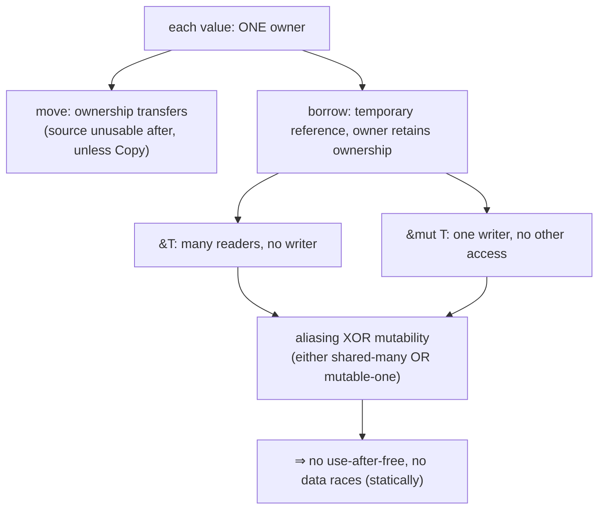
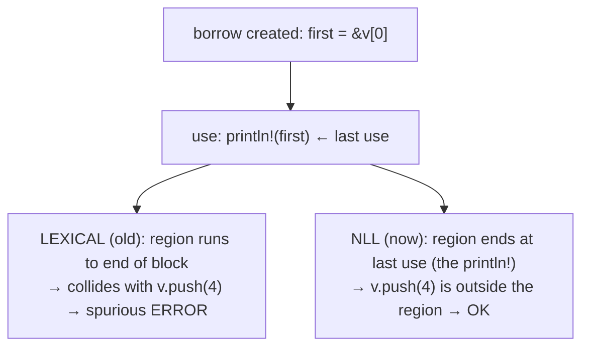
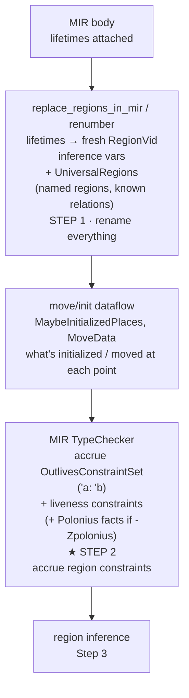
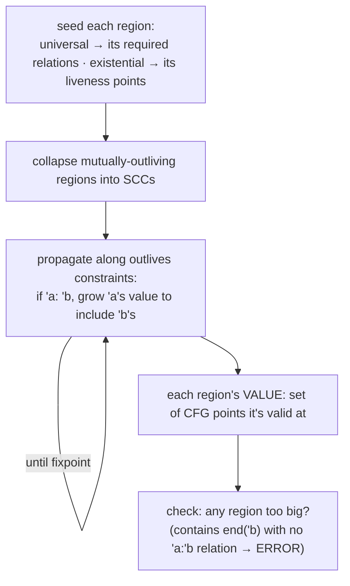
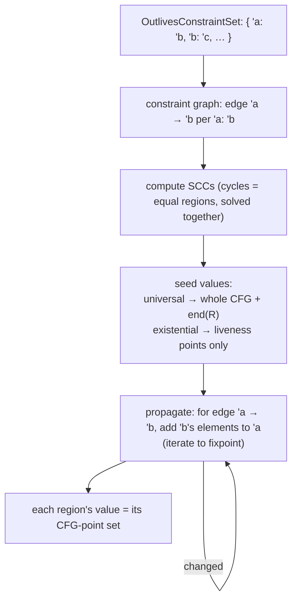
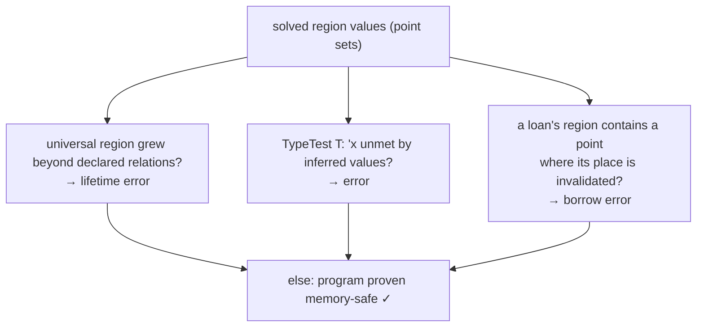
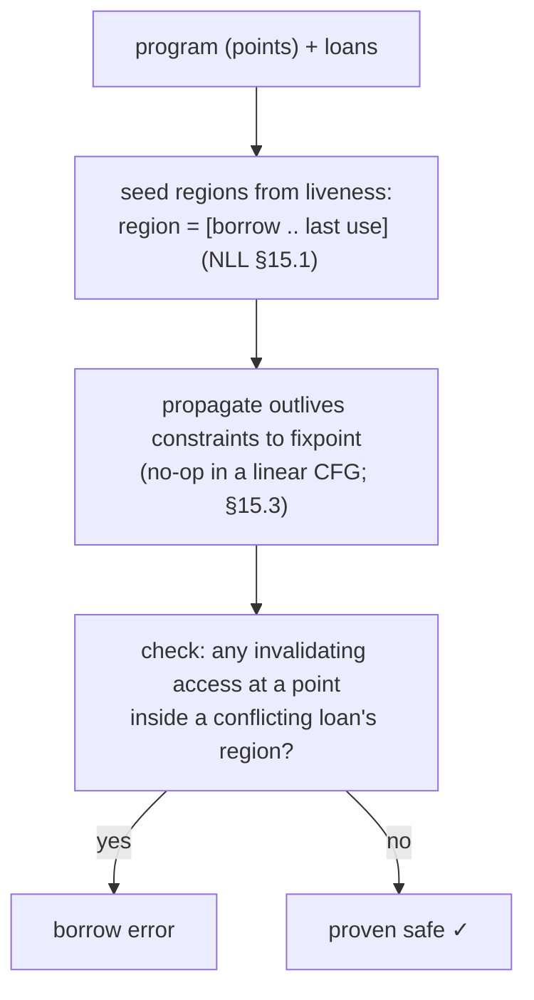

```admonish abstract title="What you'll learn"
- Why borrow checking runs on [**MIR**](../glossary.md#mir) rather than the [AST](../glossary.md#ast): dataflow needs a control-flow graph, and the MIR of Chapter 14 was shaped for this analysis.
- The property the borrow checker actually proves in safe Rust: no use-after-free / use-after-move, **aliasing XOR mutability**, and therefore no data races.
- Why [**Non-Lexical Lifetimes (NLL)**](../glossary.md#nll) replaced the lexical checker, and how a borrow's region is derived from *last use on the CFG*, not from `{}` scope.
- The five-step `mir_borrowck` pipeline: `replace_regions_in_mir`, move/init dataflow, the second-pass `TypeChecker` accruing outlives constraints, `RegionInferenceContext` propagating them to a fixpoint, and the [`BorrowSet`](../glossary.md#borrowset) loan check.
- The split between **universal** regions (signature lifetimes, assumed) and **existential** regions (local borrows, inferred), and why that explains where Rust forces explicit lifetime annotations.
- Where [**Polonius**](../glossary.md#polonius) fits: facts like `loan_issued_at` and `subset_base` feeding a Datalog solver, gated behind `-Zpolonius`, accepting strictly more programs than NLL.
```

## 15.1 Borrow Checking and the Theory of Ownership

### The analysis that defines the language

The [**borrow checker**](../glossary.md#borrow-checker) proves a program memory-safe at compile time. No reference is used after the thing it points to is gone. No value is mutated while another part of the program is looking at it. Both facts are established statically, before a single line is translated.

Most languages buy memory safety another way. A garbage collector traces live data at runtime; a C programmer assumes the obligation by hand and hopes. Rust takes a third route, and it is the harder one: a static proof that no reference outlives its referent and no value is mutated while observed. This chapter is how that proof is constructed.

The MIR of Chapter 14 was built in its exact shape for this one purpose. Explicit places, explicit moves, explicit control-flow edges: each was put there so this analysis could run. Now we use it.

### The property being proved

What, precisely, does the borrow checker guarantee? Three intertwined things. Together they are the absence of the classic memory-safety bugs:

- **No use-after-free / use-after-move.** A reference must never outlive the value it points to; a value must never be used after it has been moved away. In safe Rust this rules out dangling pointers (`unsafe` and raw pointers deliberately opt out, and the surrounding code takes on the obligation by hand).
- **No aliasing-plus-mutation.** At any moment, a value may have *either* any number of shared references (`&T`) *or* exactly one mutable reference (`&mut T`), never both. This is the **aliasing XOR mutability** rule, and in safe Rust it rules out the bugs (iterator invalidation, data races, unexpected mutation) that come from mutating something another part of the code assumes is stable.
- **No data races.** The aliasing-XOR-mutability rule, extended across threads, means two threads can never simultaneously access the same data with one of them mutating, a data race is, by construction, unrepresentable in safe Rust.

The RFC that defines the modern borrow checker states the kernel plainly: "values may not be mutated or moved while they are borrowed." The whole subsystem is the machinery for answering, at every point in the program, *is this value borrowed right now, and if so, how?*

### Ownership, moves, and borrows

The model resting underneath is **ownership**, and it has three rules taught to every Rust beginner. Each value has exactly one **owner**. Assigning or passing a value **moves** ownership, and the source can no longer be used, unless the type is `Copy`. A value can also be **borrowed**: lent out as a reference, temporarily, without transferring ownership.

Borrowing is where the rules bite. A shared borrow `&T` grants read access and may be duplicated; a mutable borrow `&mut T` grants write access and must be unique. The owner cannot move or mutate the value while it is borrowed, because the borrow is a promise that the value will stay put and stay valid for as long as the reference lives.

That "for as long as the reference lives" is the crux, and it has a name: a **lifetime**, or, in the compiler's internals, a [**region**](../glossary.md#region). A region is the span of program execution during which a reference must remain valid. The borrow checker's central job is to figure out, for every borrow, *how long its region must be*: long enough to cover every use of the reference, but no longer. Then it checks that nothing invalidates the borrowed value anywhere within that region. Almost everything hard about the analysis is hidden in that one word, *how long*. Get the region exactly right and the safety check is a near-mechanical walk; get it wrong in either direction and you either reject good code or admit unsafe code.




```admonish tip title="Pro-Tip, borrow errors are almost always about region length, not the borrow itself"
When the compiler says "cannot borrow `x` as mutable because it is also borrowed as immutable," the immutable borrow is rarely the problem, its *region* being longer than you expected is. The reference is still considered live somewhere later, so its region stretches over the point where you want to mutate. The fix is usually to *shorten* the region: use the reference and drop it before the conflicting access, or restructure so the two borrows do not overlap in the control-flow graph. Reading borrow errors as "this region is too long, and it collides with that operation" , rather than "this borrow is illegal", points you at the real lever: where the reference is *last used*, which is what determines how far its region extends.
```

### Why static checking is hard, and why MIR

Proving "no value is mutated while borrowed" statically is genuinely difficult. Borrows and uses are scattered across *control flow*: a reference created in one branch, used in another, dropped on a third path. To decide whether a mutation collides with a borrow, you have to reason about every path through the function at once.

The classic-compiler way to reason about anything flow-sensitive is the structure Chapter 14 built: the **control-flow graph** of MIR. Every borrow (`Rvalue::Ref`), every move (`Operand::Move`), every use is an explicit operation at an explicit point. "Later" and "along this branch" stop being vague and become precise graph relationships. The dev-guide is explicit that the borrow checker runs on MIR for this reason: "using the MIR enables non-lexical lifetimes, which are regions derived from the control-flow graph." The borrow checker could not be this precise on a tree. It needs the graph, and the entire MIR was built to hand it one.

### NLL: regions from the control-flow graph

This is the pivotal idea of the modern borrow checker, and it is best understood against what it replaced. The *original* borrow checker used **lexical** lifetimes: a borrow lasted until the end of its enclosing `{}` block, whether or not the reference was actually used that long. Stop using a reference halfway through a block, and the old checker still considered it borrowed until the closing brace.

That choice was simple to implement and wrong about real programs. It rejected code that was plainly safe, for no better reason than where a curly brace happened to sit. The fix is **Non-Lexical Lifetimes (NLL)**: a borrow's region is derived from *where the reference is actually used in the CFG*, not from lexical scope. A region extends exactly as far as the last use of the reference along each path, and not one statement further. The shift sounds small. It is the difference between a checker that tracks the *text* of your program and one that tracks its *behavior*, and that is the whole reason the analysis moved down onto MIR.

The canonical example NLL fixed:

```rust
let mut v = vec![1, 2, 3];
let first = &v[0]; // shared borrow of v begins
println!("{first}"); // …last use of `first` is HERE
// ← old (lexical) checker: ERROR (first still "borrowed" to block end)
v.push(4);
 //   NLL: FINE (first's region ended at the println!)
```

Under lexical lifetimes, `first`'s borrow lasted to the end of the block. The `v.push(4)` needs `&mut v`, so it collided with the still-live shared borrow: a spurious error, forcing awkward rewrites. Under NLL, the borrow checker sees in the CFG that `first` is *last used* at the `println!`. Its region ends there. The later `push` is fine.

NLL made the borrow checker reason about *actual use* rather than *syntactic scope*, and that one change retired a huge class of false rejections. It is the production borrow checker today. Lexical lifetimes are the kind of design that looks defensible on paper and turns out to fight the programmer on every other function, and the move off them is one of the clearest wins in the compiler's history.




### How the borrow checker works: constraints, then inference

The mechanism, at a high level, is two phases over the MIR. It is the subject of §15.2 to §15.3, but the shape is worth holding now.

First, **constraint generation**. A second type-check pass over the MIR (the verified `TypeChecker` in `rustc_borrowck`) walks the body. Wherever the types or control flow demand that one region outlive another (`'a: 'b`, read "`'a` must last at least as long as `'b`"), it records an **outlives constraint**. A reference assigned into a longer-lived place generates one. A function call with lifetime parameters generates more. So does liveness, the simple fact that a variable is still going to be used.

Second, **region inference**: the verified process that *solves* those constraints, computing for each region the set of CFG points where it must be valid (its "value"). With every region's extent known, the checker makes its final pass. For each borrow it asks one question: does anything invalidate the borrowed value at any point within the borrow's region? If so, error. If not, the program is proven safe.

The whole thing is entered through the verified `mir_borrowck` [query](../glossary.md#query). It replaces the MIR's regions with fresh inference variables (`replace_regions_in_mir`), runs the move/initialization dataflow analyses, runs the constraint-generating type-check, does region inference, and reports any violations.

```admonish warning title="Warning, the borrow checker proves safety soundly, which means it rejects some safe programs"
A static analysis that guarantees "no memory-safety bug ever slips through" must, by the nature of static analysis, also reject some programs that would *actually* have been fine, the checker errs on the side of caution because it cannot run the program to find out. This is not a bug; it is the deliberate, necessary trade of soundness. When the borrow checker rejects code you are *certain* is safe, you are usually right that it is safe *at runtime*, but the checker cannot *prove* it within its rules, so it refuses. The correct responses are to restructure so the proof goes through (often shortening a region, see the Pro-Tip earlier in §15.1), or, where you truly know better and can uphold the invariants manually, to use `unsafe`, which is precisely the escape hatch for "I can prove this safe but the borrow checker cannot." Never read a borrow error as "the compiler thinks this crashes"; read it as "the compiler cannot *prove* this safe under its rules."
```

### A look ahead: Polonius

NLL is precise, but not maximally so. A residue of safe programs still gets rejected, mostly ones that return references through complex control flow. **Polonius** is a reformulation of the borrow checker, more precise than NLL, that the project has developed as the next step (gated behind `-Zpolonius`, either `=legacy` or `=next`).

The difference is in what each one tracks. NLL thinks in terms of *regions*: sets of CFG points where a reference is valid. Polonius thinks in terms of **loans** and **facts**. It generates Datalog-style facts from the MIR (which loans exist, which are live at which points), then runs a Datalog solver to compute, precisely, which loans are in scope where. Because loan liveness is tracked directly rather than reconstructed from region values, the loan-centric formulation accepts strictly more correct programs than NLL.

That inversion is the interesting part. NLL answers "where is this region valid?" and infers loan conflicts from the answer; Polonius answers "which loans are live here?" directly. The second question is the one the safety property actually asks, so moving the model closer to it is the right instinct, or at least it is the instinct that lets more genuinely-safe programs through. The cost is a Datalog engine in the middle of the borrow checker, which is why it remains the future direction rather than the present one. NLL is the production reality this chapter focuses on.

### Where this leaves us

Borrow checking is the analysis Rust is built around: a *static proof* of memory safety with no garbage collector, guaranteeing (in safe Rust) no use-after-free or use-after-move, **aliasing XOR mutability** (many shared borrows *or* one mutable borrow, never both), and therefore no data races. It rests on **ownership**: one owner per value, moves transfer it, borrows lend it temporarily, and on **regions** (lifetimes), the spans of execution for which references must stay valid. Because the property is flow-sensitive, the checker runs on the **MIR** CFG of Chapter 14, which made every borrow, move, and edge explicit precisely for this. **NLL** is the key modern idea: a borrow's region is derived from *where the reference is actually used in the CFG*, not from lexical scope, eliminating a huge class of false rejections (the `&v[0]` … `v.push` example). Mechanically it is **constraint generation** (a second MIR type-check accruing outlives constraints) followed by **region inference** (solving them to each region's extent) and a final validity check, all driven by the `mir_borrowck` query. It is *sound*, so it rejects some safe programs by design: `unsafe` is the escape hatch. And **Polonius**, a more precise loan-and-facts reformulation, is the future direction beyond NLL.

§15.2 takes the architecture deep-dive: the `mir_borrowck` pipeline in detail: `replace_regions_in_mir` and `UniversalRegions`, the move/init dataflow, the `TypeChecker` that generates region constraints, the `BorrowSet` of loans, and region inference computing region values, plus where Polonius's fact generation slots in. Then §15.3 reads the real outlives-constraint generation and a region-inference step, and §15.4 has you build a tiny region-based borrow checker over a toy CFG.

## 15.2 The Architecture: `mir_borrowck`, Region Inference, and the Loan Set

### A pipeline over the MIR

The `mir_borrowck` query runs five steps over a function's MIR, and they map exactly onto the "generate constraints, infer extents, check borrows" sketch from §15.1. The shape, all verified from `rustc_borrowck`: rename regions to inference variables, run move/init dataflow, type-check the MIR to accrue region constraints, solve those constraints with region inference, and check loans against the solved regions. We take each in turn.

### Step 1: `replace_regions_in_mir`: lifetimes become variables

The MIR arrives from Chapter 14 with lifetimes still attached to its types (`&'a T` and so on), but those named lifetimes are not yet *solved*. The borrow checker must compute their extents itself. So the first move, verified, is `replace_regions_in_mir` (via `renumber`): it walks the MIR and "replaces all of the regions with fresh inference variables." Each lifetime becomes a `RegionVid`, an inference variable whose value, its extent, is to be determined. This is the same trick type inference plays when it replaces unknowns with `?T` (Chapter 11), now applied to lifetimes.

It also returns a `UniversalRegions` struct, "all the free regions in the given MIR along with any relationships known to hold between them": the function's *named* lifetime parameters (`'a`, `'static`) and the relations from `where` clauses and implied bounds.

That split is the one to hold onto. **Universal** regions are the lifetime parameters, fixed by the signature, *assumed* true here and checked at the caller. **Existential** regions are the local borrows, whose extents the checker must *infer*. The signature's promises are givens; the body's borrows are unknowns. The whole inference problem is to fill in the unknowns without ever weakening a given, and naming the two kinds apart on day one is what keeps that bookkeeping honest.

### Move and initialization dataflow

Before constraints can be solved, the checker needs to know *what is initialized and what has been moved*. A use of a moved-out value is itself an error, and a borrow of an uninitialized place is nonsense. Both questions have to be settled first.

The `MoveData`/move-path machinery is built before type-checking, by `MoveData::gather_moves`, recording where moves and initializations happen. During type-checking, a liveness sub-pass lazily runs `MaybeInitializedPlaces` dataflow (which places might be initialized at each point) to drive drop-aware liveness. Dataflow analysis is the classic CFG technique here, the Dragon Book's fixpoint over a lattice: propagate facts forward through the graph until they stabilize. The result is, for every program point, the set of places that are definitely-initialized, maybe-initialized, or moved-out. That is the substrate for both move errors and the region work to come.

### Step 2: the MIR type-check: accruing region constraints

Now the heart of constraint generation. The borrow checker runs a *second* type-check over the MIR, the verified `TypeChecker` in `rustc_borrowck::type_check`. Its own doc says it "visits the MIR and enforces all the constraints needed for it to be valid and well-typed; **along the way, it accrues region constraints**."

The surprise is that this is not the Chapter 11 type check. That one already passed. This is a re-check whose *purpose* is not to find type errors at all but to extract the relationships between regions. The type-checking is a means; the constraints are the end.

It fires wherever the MIR demands that one region outlive another. Assigning `&'a T` into a place expecting `&'b T` requires `'a: 'b`. Calling a function with lifetime parameters relates its regions. A reference's referent must outlive the reference. Each such demand records an **outlives constraint** into an `OutlivesConstraintSet`. The pass also records **liveness** constraints: wherever a variable is live, every region in its type must be valid there, because a borrow must last at least as long as it is used. The output, verified as `MirTypeckResults`, bundles the outlives constraints and liveness for the next step. (If Polonius is enabled, this same pass also emits the Datalog *facts*.)




### Step 3: region inference: solving the constraints

With constraints in hand, the verified `RegionInferenceContext` *solves* them. Conceptually, each region's **value** is a *set*. The dev-guide describes it as "all points in the MIR where the region is valid, along with any regions that are outlived by this region."

Inference starts each region at a minimum: universal regions seeded with what their relations require, existential regions with their liveness points. Then it **propagates** along the outlives constraints. If `'a: 'b`, everything required of `'b` must be in `'a`, so `'a`'s set grows to include `'b`'s. Repeat until nothing changes. This is a plain fixpoint computation, expanding region values along constraints until the dust settles.

One efficiency move is worth pausing on. The implementation collapses mutually-outliving regions into **strongly-connected components** (the verified `constraint_sccs`/`scc_values`). Regions in a cycle of `'a: 'b, 'b: 'a` must be equal, so they are solved together as one SCC rather than chased around the loop forever. It is the obvious move once you see the constraints as a graph, and it is the difference between an inference pass that scales and one that does not. When propagation settles, every region has a concrete value: the exact set of CFG points (and outlived regions) over which it is valid. That is the "how long is this borrow's region" answer §15.1 promised, computed.




### Step 4: the loan set, and checking loans against regions

The other half of the picture is the `BorrowSet`, the verified "set of borrows extracted from the MIR." Every `Rvalue::Ref` in the body creates a **loan**: a record of *what place* was borrowed, *how* (shared or mutable), and *which region* governs it. With region inference done, each loan's region is a known set of CFG points, the points where the loan is "in scope" and the borrow is still live.

The final check is §15.1's property made mechanical. Walk the MIR. At each point where a place is *written, moved, or otherwise invalidated*, ask one thing: is there a loan of that place (or an overlapping place) whose region *includes this point*? A `&mut`-conflicting access inside a loan's region is the borrow violation. The verified `RegionInferenceContext` "lets us find out which CFG points are contained in each borrow region," and the check consults exactly that. A region being valid at a point where the borrowed value is invalidated *is* the error. There is no separate "is this safe?" judgment; the geometry of the point sets already contains the verdict.

Region inference also performs the universal-region check the dev-guide describes. After solving, a universal region's value may have grown to require an outlives relation that was never declared: `'#1` ends up needing `'a: 'b` with no such `where` clause or implied bound. That is an error too. The body quietly assumed a lifetime relationship the signature did not promise, and the signature is the contract. This is how "returning a reference that doesn't live long enough" and "missing lifetime bound" errors arise.

```admonish tip title="Pro-Tip, universal vs. existential regions explains why signatures need explicit lifetimes"
The split in Step 0 is the operational reason Rust makes you annotate lifetimes on function signatures but never inside bodies. **Existential** regions (local borrows) are *inferred*, the checker computes their extents from use, so you never write them. **Universal** regions (the `'a` in `fn f<'a>(x: &'a T) -> &'a T`) are *assumed* true while checking the body and *verified at each call site*, they are the contract between caller and callee, and a contract cannot be inferred from one side. That is why "missing lifetime specifier" appears only on signatures: the body's regions are solved, but the signature's regions are *promises*, and a promise must be stated. When lifetime elision fails and the compiler demands an explicit `'a`, it is asking you to write down the contract it cannot infer.
```

### Where Polonius fits

The verified pipeline carries Polonius hooks throughout. The `TypeChecker` can emit `PoloniusFacts`, and there is a `PoloniusContext`/`PoloniusOutput` path. When `-Zpolonius` is enabled, the constraint-generation pass emits Datalog **facts** like `loan_issued_at`, `loan_invalidated_at`, and `subset_base` (with `loan_live_at` then computed as a Polonius output), and a Datalog solver computes which loans are live where. This runs instead of, or alongside, the region-value computation above.

The §15.1 distinction now has an architectural shape. NLL computes *region values*, point sets, and checks invalidation against them. Polonius computes *loan liveness* directly, via facts and a solver. The plumbing for both lives in one pipeline, with Polonius gated behind the flag and NLL the default. That the two coexist in the same code is the tell that this is a migration in progress, not a settled choice.

```admonish warning title="Warning, region inference computes a region's value, but a too-big region is the error, not a stuck solver"
A natural misreading is that borrow-check failure means region inference "couldn't solve" the constraints. It is the opposite: inference *always* solves, it expands every region to the minimum value its constraints force. The error is discovered *after* solving, when a region's computed value is found to be **larger than allowed**: it reaches a CFG point where the borrowed value is invalidated, or it requires an undeclared universal-region relation. The solver does not get stuck; it computes a value, and then a *check* finds that value impossible to honor. This matters for reading the compiler: borrow errors are reported by the post-inference checks (`RegionInferenceContext::check_*`, loan invalidation), not by inference failing, which is why the diagnostics can be so specific about *where* a region became too large and *what* it collided with. The region's value is computed; the verdict is whether that value is sound.
```

### How this builds, and what is next

The `mir_borrowck` pipeline is now mapped. `replace_regions_in_mir` renames every lifetime to a fresh `RegionVid` inference variable and captures the function's `UniversalRegions` (named, assumed lifetime parameters) versus the existential ones to be inferred. Move/initialization **dataflow** (`MaybeInitializedPlaces`, `MoveData`) computes what is live and moved at each point. A second MIR `TypeChecker` re-checks the body to **accrue outlives and liveness constraints** into an `OutlivesConstraintSet` (and Polonius facts if enabled). The `RegionInferenceContext` **solves** those constraints, seeding, collapsing cycles into SCCs, and propagating along `'a: 'b` edges to a fixpoint, giving each region a concrete **value** (the CFG points where it is valid). Finally, the `BorrowSet` of loans is checked against those values: a loan whose region includes a point where its borrowed place is invalidated is a violation, and a universal region that grew beyond its declared relations is a lifetime error. Polonius is the same pipeline with a facts-and-Datalog formulation behind a flag.

§15.3 reads the real code: a slice of the `TypeChecker` generating an outlives constraint, and a step of region-value propagation in the `RegionInferenceContext`, so you can watch a borrow's region grow to cover its uses and a conflict be detected. Then §15.4 has you build a tiny region-based borrow checker over a toy CFG (loans, outlives constraints, region propagation, and conflict detection).

## 15.3 Reading the Source: Outlives Constraints and Region Propagation

### Watching a region grow

Two steps sit at the core of the pipeline, and this section reads both in the source. First, where an **outlives constraint** is born during the MIR type-check. Second, how **region inference** then grows each region's value until it covers exactly the program points it must. We will follow a single borrow: its reference is assigned into a longer-lived place, the constraint `'a: 'b` gets recorded, and inference expands the region to match. The source is `rustc_borrowck`'s `type_check` and `region_infer` modules.

### Where a constraint is born: `relate_types` in the `TypeChecker`

The borrowck `TypeChecker` (§15.2) walks every MIR statement. At each assignment it *relates* the type of the right-hand side to the type of the place the value flows into. When the rhs is `&'a T` and the destination expects `&'b T`, that relation requires `'a: 'b`: the source reference must live at least as long as the place that now holds it. The relating goes through the inference context, and any region relationships it produces are funnelled, via the verified `ConstraintConversion`, into the constraint set. In faithful outline:

```rust
// rustc_borrowck/src/type_check (mod.rs + relate_tys.rs)  (illustrative; relate_types body abridged)
// At `dest = rvalue`, the assignment-visit subtype-relates rv_ty <: place_ty:
self.sub_types(rv_ty, place_ty, location.to_locations(), category)?;
//        ↑ subtyping `&'a T <: &'b T` requires `'a: 'b` (references are covariant in the region)

// sub_types delegates to relate_types with the variance swap that puts place_ty
// on the "expected" side (better diagnostics):
fn relate_types(
    &mut self,
    a: Ty<'tcx>,
    v: ty::Variance,
    b: Ty<'tcx>,
    locations: Locations,
    category: ConstraintCategory<'tcx>,
) -> Result<(), NoSolution> {
    // Run the relation in the inference context (the Chapter-11 relate API);
    // produced outlives obligations are pushed directly into the
    // `OutlivesConstraintSet` (canonical queries elsewhere go via
    // `constraint_conversion::ConstraintConversion`).
    // …
}
```

The verified `TypeChecker` doc says it plainly: it "accrues region constraints" along the way. Each one is an `OutlivesConstraint`, verified as the unit of the `OutlivesConstraintSet`. It records "`'a: 'b` holds at this location," tagged with a `ConstraintCategory` (assignment, call, return, and so on) that is used later to phrase the error. By the end of the type-check, the `MirTypeckRegionConstraints` holds the full set of `'a: 'b` facts the body imposes, plus the **liveness** constraints, where each variable, and thus each region in its type, is live.

```admonish tip title="Pro-Tip, the ConstraintCategory is why borrow errors can say why a region must be long"
Each outlives constraint is tagged with the kind of operation that produced it: an assignment, a function-call argument, a `return`, a closure capture. When region inference later finds a region is too big and reports an error, it can walk back along the constraints that made it big and name the *operation* responsible: "returning this value requires that `'1` outlive `'2`," "argument requires that…". That precise, causal phrasing, telling you not just *that* a lifetime is too short but *which operation* demanded it be longer, comes directly from the category stamped on each constraint at the moment it was generated. If you ever wonder how the compiler reconstructs the *story* of a lifetime error, it is reading these tags back.
```

### Building the constraint graph and SCCs

`RegionInferenceContext::new` takes the `OutlivesConstraintSet` and, per the verified dev-guide, converts it into a **graph**: "the nodes are region variables (`'a`, `'b`) and each constraint `'a: 'b` induces an edge `'a → 'b`." Once the constraints are a graph, the rest of inference is graph algorithms, which is exactly why the conversion comes first.

The first step is to find **strongly-connected components**: cycles. If `'a: 'b` *and* `'b: 'a`, the two regions must have *equal* values, so they collapse into one SCC and are solved together. The verified `constraint_sccs` field holds this. Working per-SCC rather than per-region is the efficiency that lets region inference scale, because a mutually-outliving cluster is computed once instead of chased to a fixpoint region by region.

### Seeding and propagating region values

Now the values. Each region's value is a `RegionValues` set of `RegionElement`s: CFG points, and `end(R)` markers for universal regions. The seeding [VERIFY against current rustc]:

- **Universal** regions (the lifetime parameters) start *large*: their value begins containing "the entire CFG and `end(R)`", they are valid everywhere, because they outlive the whole function by contract.
- **Existential** regions (local borrows) start *small*: seeded only with their **liveness** points, the CFG locations where the reference is actually live (used).

Then **propagation** walks the SCC graph along the `'a: 'b` edges, growing values to a fixpoint. The verified rule comes from the dev-guide's worked example: "we use the outlives constraints to expand each region: we know that `'#2: '#3`," so everything in `'#3`'s value must also be in `'#2`'s. Concretely, for each edge `'a → 'b` (meaning `'a: 'b`), add `'b`'s elements into `'a`. A region that must outlive another must be valid wherever that other is. Iterate until no region's value changes.

When it settles, each region's value is exactly the set of points over which it must be valid. The existential borrow regions have grown from their seed liveness points outward, along every constraint that forces them larger and no further. That last clause is the whole game: the region is as small as it can be while still satisfying every constraint, which is precisely the "long enough but no longer" goal §15.1 set.




### The check after the fact: too-big regions and type tests

Inference always produces *a* value for every region. The verdict comes after. This is the point §15.2's Warning insisted on: the solver never gets stuck, it computes, and only then do three post-solve checks decide whether the computed values are sound:

1. **Universal-region containment.** For a universal region `'a`, its value should not have grown to require outliving something it was not declared to outlive. The dev-guide example: if `'#1` ends up containing `end('#3)` but there is no `where`-clause or implied bound saying `'a: 'b`, "that's an error", the body inferred a lifetime relationship the signature never promised.
2. **Type tests.** Some outlives relationships are not ordinary region constraints but `TypeTest`s, `T: 'x` or `<T as Foo>::Bar: 'x`. As the docs note, a type test "does not influence the inference result, but instead just examines the values we ultimately inferred for each region variable and checks they meet certain extra criteria." So after inference, each type test is checked against the solved region values; an unmet one is an error.
3. **Loan check** (§15.2): with each borrow's region now a concrete point-set, the checker asks at every invalidating access whether a conflicting loan's region contains that point. A region whose value reaches a point where its borrowed place is written or moved is the borrow violation, discovered here, against the *computed* values, not during solving.




```admonish warning title="Warning, the constraint that makes a region too big is often far from where the error is reported"
Because region values propagate transitively along the constraint graph, the *operation* that forced a region to be too large can be many statements, or a whole function call, away from the *point* where the conflict is detected. A borrow created early, threaded through an assignment, and stored into a struct field can have its region blown up by the *store*, while the error surfaces at a later mutation. This is why borrow-checker diagnostics work so hard to *trace the path*: the compiler walks the constraint chain (using the `ConstraintCategory` tags above) from the conflict back to the operation that demanded the long region, because the two are routinely far apart in the source. When debugging a borrow error, do not assume the cause is at the line of the error, follow the compiler's "requires that … to outlive …" notes back to the constraint's origin. The graph is transitive; the blame is upstream.
```

### How this builds, and what is next

We have read the two core steps. During the MIR type-check, relating an assignment's types (`relate_types`, via the Chapter 11 `relate` API) produces region obligations that `ConstraintConversion` records as `OutlivesConstraint`s (`'a: 'b`, tagged with a `ConstraintCategory` that later explains the error) into the `OutlivesConstraintSet`. Region inference turns that set into a **constraint graph** (edge `'a → 'b` per `'a: 'b`), collapses cycles into **SCCs**, **seeds** values (universal regions large: whole CFG plus `end(R)`; existential regions small, just liveness points), and **propagates** along the edges to a fixpoint, growing each region's value to the exact set of CFG points it must cover. The verdict is rendered *after* solving: a universal region grown beyond its declared relations, a `TypeTest` unmet by the inferred values, or a loan whose region reaches an invalidating point, each an error, traced back through the constraint chain to the operation responsible.

§15.4 turns this into a build. You will write a tiny region-based borrow checker over a toy CFG: represent loans (place, kind, region), generate `'a: 'b` outlives constraints, seed and propagate region values to a fixpoint over the CFG points, and then detect conflicts: a write to a place at a point inside a live shared loan's region. You will reproduce, in code you wrote, the constraint-then-inference machine you just read, and watch it accept the NLL `&v[0]`…`v.push` example and reject the genuinely-unsafe version.

## 15.4 Hands-On Lab: Build a Region-Based Borrow Checker

### Proving memory safety by hand

This lab builds the analysis that defines Rust: an **NLL-style borrow checker** that, over a toy control-flow graph, computes how long each borrow's region must be and rejects any program that mutates or moves a value while it is borrowed. You will represent **loans** (a place, a borrow kind, a region), **seed** each region from where its reference is last used, **propagate** region values to a fixpoint (§15.3), and **check** that no conflicting access falls inside a live loan's region. When your checker *accepts* the NLL `&v[0]; println!; v.push(4)` program (because the borrow's region ends at the `println!`) but *rejects* the version that uses the borrow after the mutation, you will have built, in miniature, the constraint-and-region engine that rustc's borrow checker runs over MIR.

`cargo new`, pure `std`. The first two programs use a *linear* CFG (a straight sequence of points); the third adds a branch so the lab demonstrates the **flow-sensitivity** that is the whole reason regions exist in real `rustc`.

### The program: points, places, and statements

A program is a sequence of **points** (statement indices, our CFG locations). Each statement either borrows a place, accesses a place (read/write), or uses a reference:

```rust
// src/main.rs
use std::collections::{HashMap, HashSet};

type Location = usize; // a CFG location (statement index)
 // rustc: struct Location { block: BasicBlock, statement_index: usize }
type Place = String; // a memory location: "v", "x"
type Loan = usize; // a loan id (rustc: BorrowIndex)

#[derive(Clone, Copy, Debug, PartialEq, Eq)]
enum AccessKind { Read, Write } // real rustc: enum ReadOrWrite { Read, Reservation, Activation, Write }

#[derive(Clone, Debug)]
enum Stmt {
    // r = &place  (or &mut)
    Borrow { loan: Loan, place: Place, mutable: bool, into: String },
    // use the reference `r`
    UseRef { reference: String },
    // read/write the place directly
    Access { place: Place, kind: AccessKind },
    // a CFG label: branch/join/empty block
    NoOp,
}
```

### Loans and the checker state

A **loan** records what was borrowed and how; the checker computes each loan's **region**, the set of points where that loan is still live (its reference still to be used):

```rust
#[derive(Debug)]
struct BorrowData { // rustc: BorrowData<'tcx>
    borrowed_place: Place, // rustc: borrowed_place
    assigned_place: String, // rustc: assigned_place (the destination ref variable)
    mutable: bool,
}

struct Checker {
    program: Vec<Stmt>,
    // CFG edges; if absent for a point, defaults to pt + 1 (linear)
    successors: HashMap<Location, Vec<Location>>,
    loans: HashMap<Loan, BorrowData>,
    // loan → its region (set of points), §15.3 region values
    region: HashMap<Loan, HashSet<Location>>,
    errors: Vec<String>,
}
```

### Step 1: seed regions from liveness (NLL)

This is the heart of NLL (§15.1): a loan's region covers the program points from which the reference is still *live*, that is, from which some execution path still reaches a use. We compute this with a backward dataflow over the CFG: start from each `UseRef` of the reference and walk backward along predecessor edges until we hit the borrow. Points after every reachable use are *not* in the region, which is exactly why NLL accepts `v.push` after the final use of `first`. On a linear CFG this degenerates to "borrow..=last_use", and on a branching CFG it gives the per-path liveness that real `rustc` computes.

```rust
impl Checker {
    fn seed_regions(&mut self) {
        // 1. Build predecessor lookups from the successors map; default each point's
        //    successor to pt + 1, so linear programs need no successors entries at all.
        let n = self.program.len();
        let mut preds: HashMap<Location, Vec<Location>> = HashMap::new();
        for pt in 0..n {
            let succs = self.successors.get(&pt).cloned()
                .unwrap_or_else(|| if pt + 1 < n { vec![pt + 1] } else { vec![] });
            for s in succs { preds.entry(s).or_default().push(pt); }
        }

        // 2. Per loan: borrow point + assigned_place + every UseRef of that ref variable.
        let loan_ids: Vec<Loan> = self.loans.keys().copied().collect();
        let mut new_regions: Vec<(Loan, HashSet<Location>)> = Vec::new();
        for loan in loan_ids {
            let refvar = self.loans.get(&loan).map(|d| d.assigned_place.clone());
            let borrow_pt = self.program.iter().enumerate().find_map(|(pt, s)| match s {
                Stmt::Borrow { loan: l, .. } if *l == loan => Some(pt),
                _ => None,
            });
            let (borrow_pt, refvar) = match (borrow_pt, refvar) {
                (Some(b), Some(r)) => (b, r),
                _ => { new_regions.push((loan, HashSet::new())); continue; }
            };
            let uses: HashSet<Location> = self.program.iter().enumerate().filter_map(|(pt, s)| match s {
                Stmt::UseRef { reference } if *reference == refvar => Some(pt),
                _ => None,
            }).collect();

            // 3. Backward sweep from each use point along predecessor edges, clamped to
            //    points at or after the borrow. The region is `live ∪ {borrow_pt}`.
            let mut live = uses.clone();
            let mut worklist: Vec<Location> = uses.into_iter().collect();
            while let Some(pt) = worklist.pop() {
                if let Some(ps) = preds.get(&pt) {
                    for &p in ps {
                        if p >= borrow_pt && live.insert(p) { worklist.push(p); }
                    }
                }
            }
            live.insert(borrow_pt);
            new_regions.push((loan, live));
        }
        for (loan, region) in new_regions { self.region.insert(loan, region); }
    }
}
```

```admonish tip title="Pro-Tip, NLL reduces to one substitution: end = last_use, computed along the CFG"
Everything subtle about non-lexical lifetimes reduces to "the region ends at the last use", computed by walking backward over the CFG. The old lexical checker would have set the end to the closing brace of the enclosing block; NLL sets it to where the reference is last live along each path. On a straight line this is just `[borrow .. last_use]` (Programs A and B). On a branching CFG (Program C, below) it is the union of per-path last-uses, the genuine flow-sensitivity that real `rustc` computes.
```

### Step 2: propagate (trivial here, essential in general)

In this lab, backward liveness in Step 1 already produces the complete region for both linear and branching CFGs, so propagation has nothing to do. In a real checker (§15.3) this is where `'a: 'b` outlives constraints would grow region values to a fixpoint; we keep the hook to mirror the architecture even though the lab has no outlives constraints of its own:

```rust
impl Checker {
    fn propagate(&mut self) {
        // In real rustc: `liveness::generate` seeds liveness points into `LivenessValues`
        // during the type-check, then `RegionInferenceContext::propagate_constraints`
        // expands along `'a: 'b` SCC edges
        // (`for &scc_b in successors(scc_a) { scc_values.add_region(scc_a, scc_b); }`).
        // The lab folds both jobs into `seed_regions` because the lab has no `'a: 'b`
        // constraints to propagate along.
    }
}
```

### Step 3: check conflicts

Now the §15.2/§15.3 verdict: walk the program, and at each access that *invalidates* a place (a write, or a `&mut` borrow, or a move), ask whether any *conflicting* loan's region contains this point. A write to `v` at a point inside a live shared loan of `v` is the violation:

```rust
impl Checker {
    fn check(&mut self) {
        for (pt, stmt) in self.program.iter().enumerate() {
            // What place is touched at this point, and how?
            // real rustc: match (ReadOrWrite, BorrowKind), see check_access_for_conflict
            let access: Option<(&Place, AccessKind)> = match stmt {
                Stmt::Access { place, kind } => Some((place, *kind)),
                Stmt::Borrow { place, mutable: true, .. } => Some((place, AccessKind::Write)),
                Stmt::Borrow { place, mutable: false, .. } => Some((place, AccessKind::Read)),
                _ => None,
            };
            if let Some((place, access_kind)) = access {
                // Is there a loan of this place whose region includes `pt`?
                for (loan, data) in &self.loans {
                    if &data.borrowed_place != place || !self.region[loan].contains(&pt) {
                        continue;
                    }
                    // The two-axis conflict table: (this access, existing loan).
                    let conflict = match (access_kind, data.mutable) {
                        (AccessKind::Write, _) => true,        // write vs any loan → conflict
                        (AccessKind::Read, true) => true,      // read vs &mut loan  → conflict
                        (AccessKind::Read, false) => false,    // read vs & loan     → fine
                    };
                    if conflict {
                        let verb = if access_kind == AccessKind::Write { "write" } else { "read" };
                        self.errors.push(format!(
                            "point {pt}: cannot {verb} `{place}`: loan {loan} ({}) of `{place}` is live here (region {:?})",
                            if data.mutable { "&mut" } else { "&" },
                            { let mut pts: Vec<_> = self.region[loan].iter().collect(); pts.sort(); pts }
                        ));
                    }
                }
            }
        }
    }

    fn run(&mut self) {
        self.seed_regions();
        self.propagate();
        self.check();
        if self.errors.is_empty() { println!("  borrow check PASSED ✓"); }
        else { for e in &self.errors { println!("  ERROR: {e}"); } }
    }
}
```

### Running it: the NLL example, accepted and rejected

```rust
fn build(program: Vec<Stmt>) -> Checker {
    build_with_cfg(program, HashMap::new())
}

/// As `build`, but with an explicit CFG (branches/joins). Any point not listed in
/// `successors` defaults to the linear successor `pt + 1`, so callers only specify edges
/// that depart from straight-line flow.
fn build_with_cfg(program: Vec<Stmt>, successors: HashMap<Location, Vec<Location>>) -> Checker {
    let mut loans = HashMap::new();
    for s in &program {
        if let Stmt::Borrow { loan, place, mutable, into } = s {
            loans.insert(*loan, BorrowData {
                borrowed_place: place.clone(),
                assigned_place: into.clone(),
                mutable: *mutable,
            });
        }
    }
    Checker { program, successors, loans, region: HashMap::new(), errors: vec![] }
}

fn main() {
    // ── ACCEPTED (NLL): first = &v; use first; THEN v.push (write v) ──
    //   pt0: first = &v
    //   pt1: use first ← last use of `first`
    //   pt2: write v ← outside first's region [0..=1] → OK
    println!("Program A:  let first = &v;  println!(first);  v.push(4);");
    let mut a = build(vec![
        Stmt::Borrow { loan: 0, place: "v".into(), mutable: false, into: "first".into() },
        Stmt::UseRef { reference: "first".into() },
        Stmt::Access { place: "v".into(), kind: AccessKind::Write },
    ]);
    a.run();

    // ── REJECTED: write v BETWEEN the borrow and a later use of first ──
    //   pt0: first = &v
    //   pt1: write v ← inside first's region [0..=2] → CONFLICT
    //   pt2: use first ← last use keeps the region alive across pt1
    println!("\nProgram B:  let first = &v;  v.push(4);  println!(first);");
    let mut b = build(vec![
        Stmt::Borrow { loan: 0, place: "v".into(), mutable: false, into: "first".into() },
        Stmt::Access { place: "v".into(), kind: AccessKind::Write },
        Stmt::UseRef { reference: "first".into() },
    ]);
    b.run();

    // ── ACCEPTED (flow-sensitive): branching CFG; first is used only on path A;
    //    after both branches join, the borrow is dead, so a write to v is safe. ──
    //   pt0: first = &v
    //   pt1: branch ─┬─→ pt2 (path A) ─→ pt4 (join)
    //                └─→ pt3 (path B) ─→ pt4 (join)
    //   pt2: use first ← only use of `first`, on path A
    //   pt3: (path B has no use of first)
    //   pt4: join
    //   pt5: write v ← outside first's region {0,1,2}; both paths are dead by now → OK
    println!("\nProgram C:  let first = &v;  if cond {{ println!(first); }}  v.push(4);");
    let mut successors_c = HashMap::new();
    successors_c.insert(1, vec![2, 3]);  // branch
    successors_c.insert(2, vec![4]); // path A joins
    successors_c.insert(3, vec![4]); // path B joins
    let mut c = build_with_cfg(
        vec![
            // pt0
            Stmt::Borrow { loan: 0, place: "v".into(), mutable: false, into: "first".into() },
            // pt1 (branch)
            Stmt::NoOp,
            // pt2 (path A)
            Stmt::UseRef { reference: "first".into() },
            // pt3 (path B)
            Stmt::NoOp,
            // pt4 (join)
            Stmt::NoOp,
            // pt5
            Stmt::Access { place: "v".into(), kind: AccessKind::Write },
        ],
        successors_c,
    );
    c.run();
}
```

````admonish example title="Expected output" collapsible=true
```text
Program A:  let first = &v;  println!(first);  v.push(4);
  borrow check PASSED ✓

Program B:  let first = &v;  v.push(4);  println!(first);
  ERROR: point 1: cannot write `v`: loan 0 (&) of `v` is live here (region {0, 1, 2})

Program C:  let first = &v;  if cond { println!(first); }  v.push(4);
  borrow check PASSED ✓
```
````

```admonish example title="What you should see" collapsible=true
**Program A** accepts. `first` is last used at point 1, so loan 0's region is `{0, 1}`. The write to `v` at point 2 lands *outside* that region. That is exactly the NLL acceptance of `v.push(4)` after the final use of `first`.

**Program B** rejects. Here `first` is used at point 2, so its region stretches to `{0, 1, 2}`. The write to `v` at point 1 now falls *inside* it: a shared loan live across a mutation. The conflict is real, and the checker says so.

**Program C** is the case the linear lab cannot represent: a branching CFG where `first` is used on one path and not the other. Backward liveness propagates `pt2` (the use on path A) to its predecessor `pt1` (the branch) and from there to `pt0` (the borrow). On path B there is no use, so liveness never reaches `pt3`. The region settles at `{0, 1, 2}`. The join at `pt4` and the write at `pt5` are both *after* the borrow is dead on every path, so the write is accepted.
```

That is **flow-sensitivity**, and it is the whole point. The same write that would conflict if the only use sat after it is fine when the only use sits on a branch that has already ended. Real `rustc` performs the same backward liveness over MIR (§15.3), which is what makes Programs A, B, and C all behave the way a Rust programmer expects, rather than the way a curly brace happens to fall.




### What the lab stripped from real rustc

The lab packs a checker into a `Checker` struct with one `region: HashMap<Loan, HashSet<Location>>`. The real `[rustc_borrowck/src/lib.rs](https://github.com/rust-lang/rust/blob/1.95.0/compiler/rustc_borrowck/src/lib.rs)`, `[rustc_borrowck/src/borrow_set.rs](https://github.com/rust-lang/rust/blob/1.95.0/compiler/rustc_borrowck/src/borrow_set.rs)`, `[rustc_middle/src/ty/region.rs](https://github.com/rust-lang/rust/blob/1.95.0/compiler/rustc_middle/src/ty/region.rs)`, and `[rustc_type_ir/src/region_kind.rs](https://github.com/rust-lang/rust/blob/1.95.0/compiler/rustc_type_ir/src/region_kind.rs)` keep the same four-step pipeline but thread it across a borrow set, a region-inference context, a Polonius location table, and move-data dataflow. What the real implementation adds on top of `Checker { program, loans, region, errors }`:

- `mir_borrowck(tcx, def_id)` is a Chapter 3 query: incremental, opaque-type-aware, and returns a typed token proving a diagnostic was emitted on failure; see `rustc_borrowck::mir_borrowck` for the exact signature. The lab's `Checker::run` prints errors.
- `MirBorrowckCtxt` wires together the same four pieces (inference context from Chapter 11, move/init dataflow, region inference, loan set), plus diagnostics buffering and the Polonius alternative; see `rustc_borrowck/src/lib.rs`. The lab keeps only the loan map and region.
- `BorrowSet` indexes loans several ways and `BorrowData` carries more (two-phase activation, several borrow kinds, the borrowed and assigned places); see `rustc_borrowck::borrow_set` and the dev-guide for the full shape. The lab's `BorrowData { borrowed_place, assigned_place, mutable }` mirrors the two-place pairing but collapses everything else.
- `BorrowKind` has three variants, `Shared`, `Fake` (for index expressions and match guards), and `Mut { kind: MutBorrowKind }`, with the `Mut` arm further distinguishing `Default`, `TwoPhaseBorrow`, and `ClosureCapture`; the lab collapses all of this into one `mutable: bool`.
- `RegionValues` is keyed by SCC index (`scc_values: RegionValues<'tcx, ConstraintSccIndex>`), not by region, so mutually-outliving regions share one value. Elements are not just CFG locations but also `end(R)` markers and placeholders, `enum RegionElement { Location(Location), RootUniversalRegion(RegionVid), PlaceholderRegion(...) }`. The lab collapses both: one map per loan, elements are bare points.
- `RegionInferenceContext` builds the `'a: 'b` outlives graph, Tarjan-condenses SCCs, seeds from `ReStatic` and universal regions, and iterates a fixpoint over branching CFGs with `type_test`s. The lab's `propagate` is a no-op on linear code.
- Real `RegionKind` covers many more kinds than just inference variables (universal parameters, bound, `'static`, erased, etc.); see the dev-guide's region chapter and `rustc_type_ir::region_kind` for the full enumeration. The lab's `Loan = usize` is only the inference-variable analogue and misses universal, bound, late-bound, `'static`, and post-borrowck erasure.
- The `Borrowck` dataflow is three parallel sub-analyses (`Borrows`, `MaybeUninitializedPlaces`, `EverInitializedPlaces`) joined into one `BorrowckDomain` at every point. The lab tracks only loan regions; the move/init half of the analysis (which produces the "used after move" and "borrow of uninitialized place" errors) is absent. The Polonius alternative (`loan_issued_at` / `loan_invalidated_at` / `subset_base` input facts with `loan_live_at` as output, accepting strictly more programs) is also absent in the lab.

Chapter 16 picks up where the lab stops: the same MIR, now proven safe, becomes the substrate for the optimizer and the interpreter.

### Extension exercises

1. **Universal regions and a signature check.** Add named regions (`'a`) on a toy function signature, seed them with "the whole CFG" (§15.3), and check that no inferred region grows to require an *undeclared* outlives relation, reproducing the "lifetime may not live long enough" error for a function returning a too-short reference.
2. **Loops.** Program C added one branch; extend the CFG with a back-edge (a loop) and watch the backward-liveness sweep iterate until it stabilises. A reference borrowed inside a loop body and used on the next iteration must have a region covering the back-edge, the case that turns the worklist from a one-pass walk into a real fixpoint.
3. **Two-phase borrows.** Model `v.push(v.len())`: a `&mut` borrow that is "reserved" but not "activated" until the argument is evaluated, by giving mutable loans a two-stage region. This mirrors a real NLL refinement that makes common method-call patterns compile.
4. **Polonius-style loans.** Reframe the checker around *loan liveness* instead of regions: emit facts (`loan_issued_at`, `loan_invalidated_at`, `loan_live_at`) and compute which loans are live where by propagation, the §15.1/§15.2 Polonius formulation, which accepts strictly more programs.
5. **Outlives constraints and propagation.** Add an `outlives: Vec<(Loan, Loan)>` field to `Checker` meaning `loan_a`'s region must contain `loan_b`'s. Make `propagate` a real worklist: for each `(a, b)`, union `region[b]` into `region[a]` and re-enqueue everything that outlives `a` whenever `a` grows; iterate to fixpoint. Optionally compute SCCs first so mutually-outliving loans share one set, which is what `RegionInferenceContext::propagate_constraints@59807616e1fa` does over `constraint_sccs`. You will have written the SCC-condensation step the lab currently stubs out, turning the no-op `propagate` hook into the actual `for &scc_b in successors(scc_a) { scc_values.add_region(scc_a, scc_b); }` loop.
6. **A two-axis conflict matrix with `TwoPhaseActivation`.** Refine Extension 3 by splitting access into `enum AccessKind { Read, Reservation, Activation, Write }` and adding a `TwoPhaseActivation { NotTwoPhase, NotActivated, ActivatedAt(Location) }` field on each loan. Rewrite the conflict check as one `match (access_kind, loan.kind, loan.activation)` table, so a read between reservation and activation on a two-phase mut borrow is fine but a read after activation conflicts. This is the exact shape of `check_access_for_conflict@59807616e1fa` in `rustc_borrowck::lib`, keyed on `(ReadOrWrite, BorrowKind)` with the `Mut` arm consulting `BorrowData.activation_location`; your match arms become a row-for-row mirror of that table.

### Where Chapter 15 leaves us

Chapter 15 is complete. §15.1 framed borrow checking as a static proof of memory safety in safe Rust: no use-after-free, aliasing-XOR-mutability, no data races, built on ownership and regions, made precise by **NLL**'s regions-from-the-CFG. §15.2 opened the `mir_borrowck` pipeline: rename regions to inference variables, run move/init dataflow, type-check the MIR to accrue outlives constraints, infer region values, and check loans, with Polonius as the facts-and-Datalog future. §15.3 read the real outlives-constraint generation and region propagation. And in this lab you built a region-based checker that accepts and rejects the NLL example on the strength of *where a reference is last used*.

With borrow checking, the middle end's *verification* is complete. The program is named, typed, trait-resolved, pattern-checked, and now proven memory-safe. Everything the compiler does from here is about making it *fast* and turning it into *machine code*: the back end.

But one transformation straddles the line. The MIR the borrow checker validated is correct, yet naive: redundant assignments, unreachable blocks, un-evaluated constant expressions, calls that could be inlined. Before lowering to a backend, the compiler runs a suite of **MIR optimizations**, dataflow-driven transforms that simplify the CFG, and performs **const evaluation**, actually *executing* constant expressions at compile time via a MIR interpreter. Chapter 16 opens there: the MIR optimization pipeline, the dataflow framework beneath it, and the const-evaluation engine (Miri) that runs your `const` code inside the compiler. The program is proven safe; next, the compiler makes it lean, and runs the parts that can run before the program ever does.

### The picture so far

Borrow checking is done. The borrow checker, a dataflow analysis over the MIR CFG of Chapter 14, decides memory safety on every path. Everything from here is *translation*: optimize the MIR (Chapter 16), monomorphize the generics (Chapter 17), and codegen to machine code (Chapter 18+).

Borrow-check `fn sum` and the shared borrow of `slice` (held by the iterator's receiver) is live for the whole loop body; nothing writes to `slice` inside the loop, so the program is accepted in one straight-line sweep, the same linear case Program A in the lab demonstrates.

## Test yourself

```admonish question title="Anchor the chapter"
Six quick questions on the key claims of Chapter 15. Answer first, then expand the explanation. Quizzes are not graded; they are a recall checkpoint between chapters.
```

{{#quiz ../../quizzes/ch15.toml}}

---

*End of Chapter 15. Next: Chapter 16, §16.1 MIR Optimizations and Const Evaluation.*