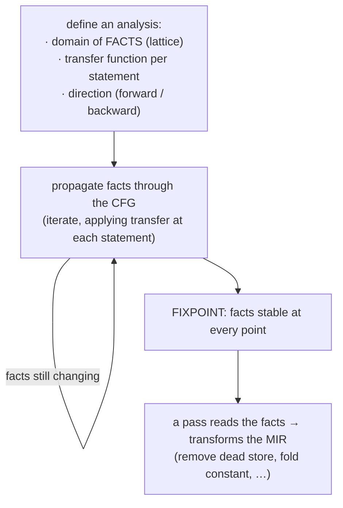
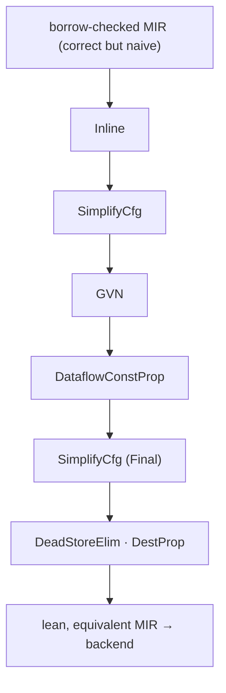
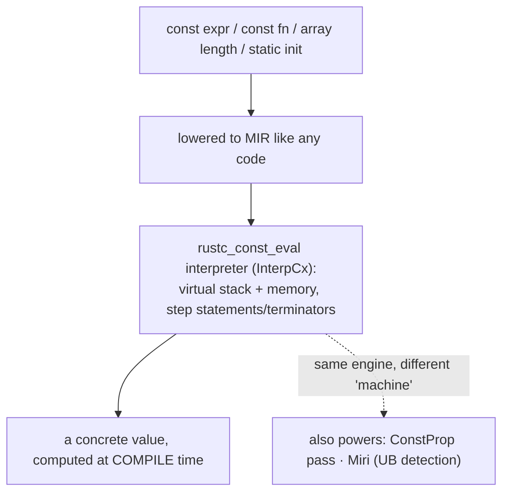
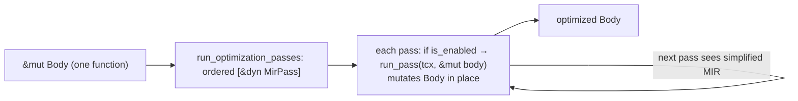
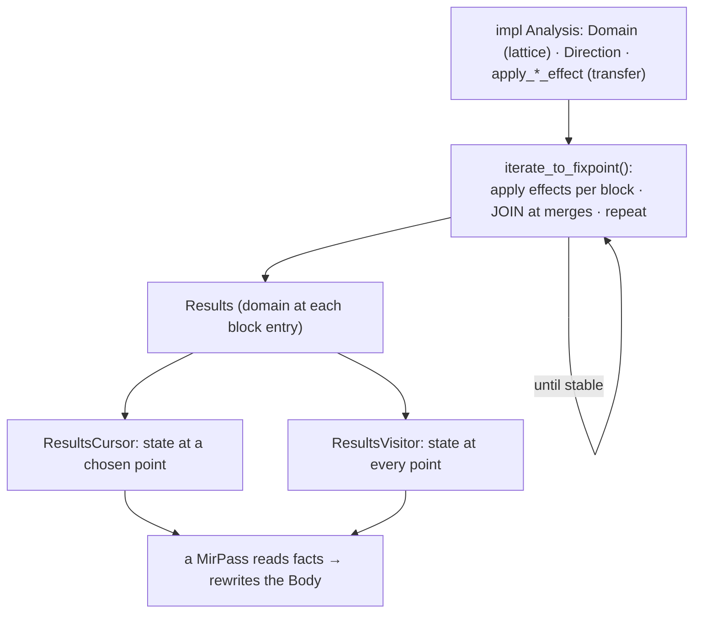
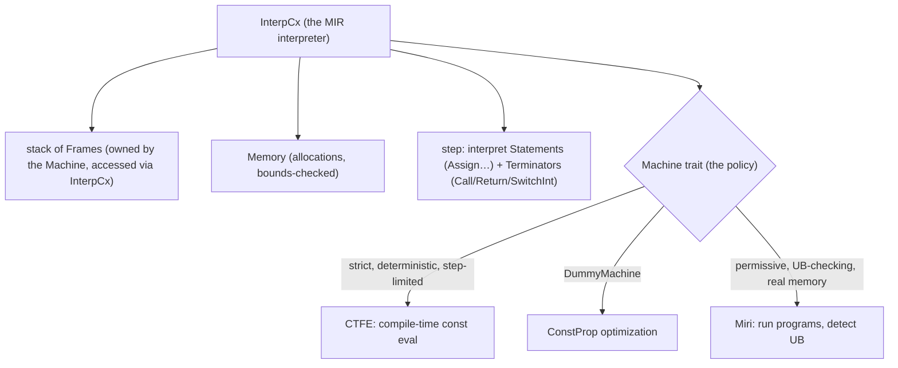
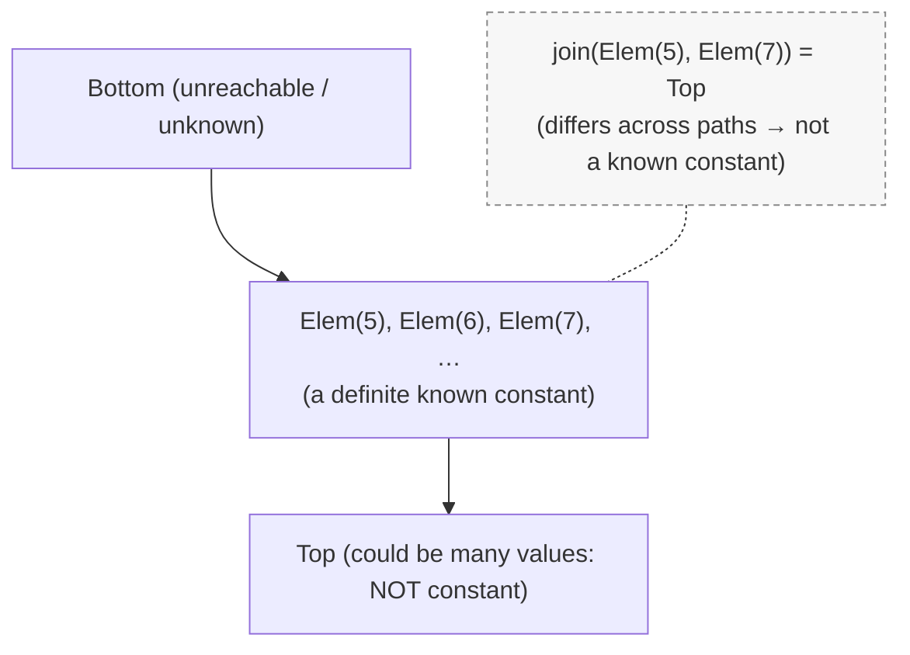
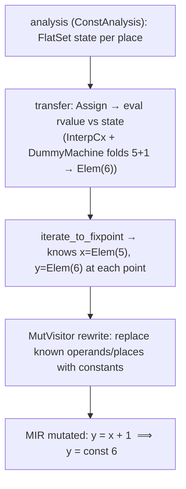
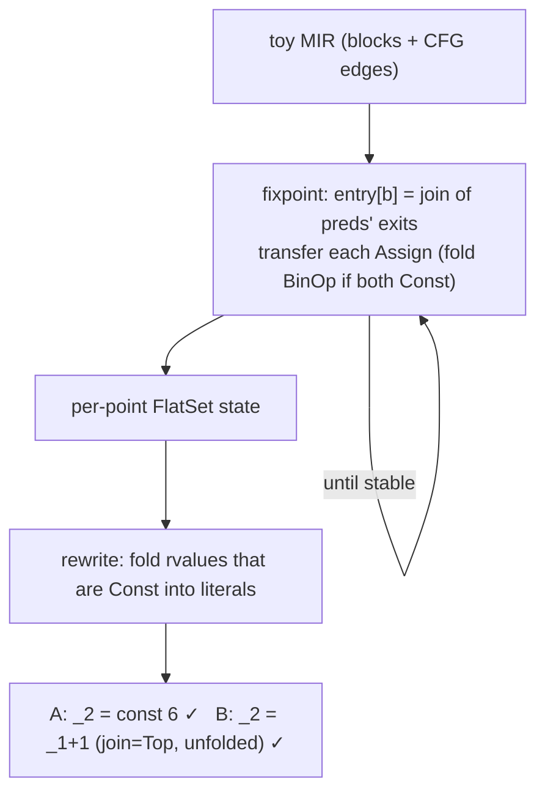

```admonish abstract title="What you'll learn"
- Why `rustc` optimizes [MIR](../glossary.md#mir) before handing it to LLVM: better final code where Rust-level knowledge still survives, and substantially faster compilation by giving LLVM less to chew on.
- How `run_optimization_passes` drives an ordered array of `&dyn MirPass` trait objects (in `compiler/rustc_mir_transform/src/pass_manager.rs`), each `run_pass` mutating the `Body` in place, gated by `is_enabled` against `-Z mir-opt-level`.
- The `rustc_mir_dataflow` `Analysis` trait: a `JoinSemiLattice` `Domain`, a `Direction`, and `apply_primary_statement_effect` transfer functions driven to a fixpoint by `iterate_to_fixpoint`.
- How `DataflowConstProp` (in `compiler/rustc_mir_transform/src/dataflow_const_prop.rs`) uses the `FlatSet` lattice (`Bottom` / `Elem(v)` / `Top`) and a `Collector` plus `Patch` `MutVisitor` split to fold `5 + 1` into `6`.
- The `rustc_const_eval::interpret` `InterpCx` and `Machine` trait: one interpreter serving CTFE, the `ConstProp` `DummyMachine`, and Miri's UB checker through different policy plug-ins.
- How to build a miniature `DataflowConstProp` by hand: a `Flat` lattice with a sound `join`, a transfer over `Stmt::Assign`, a worklist fixpoint, and a two-phase `Collector` plus `Patch` rewrite.
```

## 16.1 MIR Optimizations and Const Evaluation

### Two jobs on the validated graph

The MIR that emerged from [borrow checking](../glossary.md#borrow-checker) (Chapter 15) is *correct and proven safe*, but it is not *good*. It is full of redundancy the lowering introduced: temporaries assigned once and immediately copied, blocks that are always jumped over, arithmetic on values already known at compile time, calls to tiny functions that could be pasted inline. Before this MIR descends to a code-generation backend, the compiler does two things to it, and this chapter is about both. First, it **optimizes** the MIR: a pipeline of transformations that simplify the control-flow graph into leaner, faster, equivalent MIR. Second, and interleaved, it performs **constant evaluation**: actually *running* the constant parts of the program, at compile time, inside the compiler, via a MIR interpreter. The first makes the program lean; the second runs the parts that can run before the program ever does.

These are the last transformations of the middle end. After them, MIR is handed to the back end (Part 3) for translation to machine code.

### Why optimize MIR at all?

LLVM (Chapter 19) is itself an optimizer; why optimize the MIR *before* handing it over? The dev-guide gives the two verified reasons. First, **better final code**: some optimizations are easier or only possible with Rust-level knowledge the MIR still carries (which LLVM, seeing only its own lower-level IR, has lost). Second, and pragmatically large, **faster compilation**: every redundancy removed at the MIR level is work LLVM does not have to do. A function that MIR inlining and constant propagation shrink to a few instructions is a few instructions for LLVM to chew on instead of hundreds. MIR optimization is partly about the output and substantially about *compile times*, a perennial Rust concern. (MIR opts are also what make const-evaluation tractable and what produce the clean MIR the back end expects.)

### The classic theory: dataflow analysis

Almost every MIR optimization rests on one classical technique: **dataflow analysis**, the Dragon Book's framework for computing facts about a program at every point in its control-flow graph. The shape is always the same: pick a set of **facts** (which variables are live? which hold known constants? which assignments are dead?), define how each statement **transfers** facts (an assignment kills the old value of its target and generates a new one), and **propagate** those facts through the CFG, forward (from entry, for "what is known here") or backward (from exit, for "what will be used"), iterating until the facts reach a **fixpoint** (stop changing). The mathematics underneath is a **lattice**: facts are ordered, the transfer functions are monotonic, and the iteration is guaranteed to terminate at the least fixed point.

This is the same fixpoint-over-a-CFG machinery the borrow checker used (region propagation, §15.3) and the same the move/initialization analysis used (§15.2), `rustc` has a dedicated dataflow framework, `rustc_mir_dataflow`, with a verified `Analysis` trait and lattice types (e.g. `FlatSet`) that optimization passes build on. Dataflow is the workhorse of the whole MIR-and-borrowck back half: define the facts and the transfer, and the framework does the fixpoint.




### The optimization pipeline: a sequence of `MirPass`es

The optimizations themselves are a *pipeline*: an ordered list of passes, each a small, focused transformation, run one after another so that each can exploit the simplifications the previous made. The verified structure: each pass is a struct implementing the `MirPass` trait (with `run_pass` doing the transformation, `is_enabled` deciding when it runs), and the verified `run_optimization_passes` holds the ordered array of `&dyn MirPass` trait objects.

Three exemplars the chapter teaches against:

- **Constant propagation** (`DataflowConstProp`): propagate values known at compile time, replacing `_2 = _1 + 1` (where `_1` is known to be `5`) with `_2 = 6`. Built directly on the dataflow framework.
- **Inlining** (`Inline`): paste a called function's body into the caller, eliminating call overhead and exposing further optimization, governed by cost heuristics that avoid inlining huge functions.
- **SimplifyCfg**: straighten and merge basic blocks, removing blocks that just jump elsewhere, shrinking the graph.

The full roster (dead-store elimination, destination propagation, GVN, jump threading, and more) lives in the rustc-dev-guide's MIR optimisations index. [VERIFY against current rustc]

The passes are gated by the `-Z mir-opt-level` flag and the optimization level; some are gated as experimental [VERIFY status against current rustc], and the opt level is tunable so they can be turned off.



*Schematic only; the real ordering lives in `compiler/rustc_mir_transform/src/lib.rs::run_optimization_passes`.*


```admonish tip title="Pro-Tip, pass ordering matters because passes feed each other"
A single MIR pass in isolation often does little; the power is in the sequence. In real rustc, `Inline` runs first, pasting callee bodies into the caller so later passes see the newly visible code; an interleaved `SimplifyCfg` cleans up the resulting graph; `GVN` then collapses redundant expressions; `DataflowConstProp` folds the constants now in plain sight; a final `SimplifyCfg` merges the now-trivial blocks; and `DeadStoreElimination` plus `DestinationPropagation` finish the cleanup. This cascade is why `run_optimization_passes` is an *ordered* array and why `SimplifyCfg` appears multiple times: cleanup passes are interleaved to let later analyses see simpler MIR. When you read or write a MIR pass, the question is rarely just "what does this pass do?" but "what does it enable for the passes after it?"
```

### Constant evaluation: running code at compile time

The second job runs code at compile time. Rust lets you compute things *at compile time*: array lengths (`[u8; N * 2]`), `const` and `static` initializers, `const fn` calls, const generics, enum discriminants. Evaluating these is **constant evaluation**, or **CTFE** (compile-time function evaluation), and the way `rustc` does it: it **interprets the MIR**. The constant expression is lowered to MIR like any other code, and then an *interpreter*, a virtual machine inside the compiler, *executes* that MIR, stepping through its statements and terminators, maintaining a virtual stack and memory, until it produces a value.

That interpreter is the `rustc_const_eval::interpret` module, an interpreter for MIR used in CTFE and by Miri [VERIFY against current rustc]. It has the pieces of a real machine: a memory subsystem, stack frames, operand evaluation, place projection, an executor of MIR semantics. The same engine, parameterized by a "machine" trait, backs three things: CTFE (evaluating consts during compilation), the constant-propagation optimization above (which evaluates known sub-expressions using the same interpreter), and **Miri**, the standalone interpreter that runs whole Rust programs to detect undefined behavior. The compile-time machines (CTFE and ConstProp) reuse the same interpreter instance [VERIFY source].




```admonish warning title="Warning, const evaluation must be deterministic and pure, which is why const fn is restricted"
Running code at compile time imposes hard constraints the interpreter enforces. A const evaluation must produce the *same* answer on every machine and every compile, so it cannot read the clock, the filesystem, random numbers, or anything environment-dependent; it cannot have observable side effects; and it must *terminate* (the interpreter enforces a step limit to avoid an infinite `const fn` hanging the compiler forever). This is the deep reason `const fn` is a *restricted subset* of Rust: not every operation is permitted in a const context, because not every operation is deterministic and pure. When the compiler rejects something in a `const fn` ("cannot call non-const function," "trait bound not satisfied in const"), it is enforcing the discipline that makes compile-time evaluation sound: the result must be a mathematical function of the inputs, computable by the interpreter, with no window onto the outside world. The restrictions are not arbitrary; they are what make "run it at compile time" a coherent idea.
```

### Where this leaves us

This chapter is the middle end's final pair of jobs on the validated MIR. **MIR optimization** is a *pipeline* of `MirPass`es, constant propagation, inlining, dead-store elimination, GVN, jump-threading, CFG simplification, most built on classical **dataflow analysis** (facts + transfer functions + fixpoint over the CFG, the same `rustc_mir_dataflow` framework borrowck uses), run in a carefully *ordered* sequence (gated by `-Z mir-opt-level`) where each pass enables the next, producing leaner equivalent MIR both for better codegen and, substantially, for faster compilation by giving LLVM less to do. **Constant evaluation (CTFE)** runs the program's constant parts at compile time by *interpreting their MIR* in the `rustc_const_eval` virtual machine, the same interpreter that powers constant propagation and the standalone Miri UB-checker, which is why `const fn` must be deterministic, pure, and terminating. After these, the middle end is done: the program is parsed, resolved, typed, trait-solved, pattern-checked, lowered to MIR, borrow-checked, optimized, and const-evaluated.

§16.2 takes the architecture deep-dive: the `MirPass` trait and `run_optimization_passes` pipeline in detail, the `rustc_mir_dataflow` `Analysis` framework (lattices, transfer functions, the fixpoint engine), and the `rustc_const_eval` interpreter (`InterpCx`, the machine trait, memory and stack model). Then §16.3 reads a real dataflow-based pass (constant propagation) and a step of the const interpreter, and §16.4 has you build a small dataflow constant-folding pass over a toy MIR.

This also closes **Part 2, the middle end.** §16.4's "Part 2 retrospective" subsection will trace the whole arc from [HIR](../glossary.md#hir) to optimized MIR before Part 3 opens the back end.

## 16.2 The Architecture: the Pass Pipeline, the Dataflow Framework, and the Interpreter

### Three machines, one MIR

Three things act on the validated MIR (§16.1): a **pipeline of passes**, a **dataflow framework** most passes are built on, and an **interpreter** that executes constant MIR. Each is a concrete architecture. The relationship to hold throughout: the **dataflow framework computes facts** about the MIR, a **pass reads those facts and rewrites** the MIR, and the **interpreter executes** MIR to produce values: three distinct capabilities that compose into optimization and const-evaluation.

### The pass pipeline: `MirPass` and `run_optimization_passes`

An optimization is a `MirPass`: the verified trait every pass implements:

```rust
// rustc_mir_transform/src/pass_manager.rs  (faithful; 3 of 7 methods shown, `pub(super)` simplified to `pub`)
pub trait MirPass<'tcx> {
    fn is_enabled(&self, sess: &Session) -> bool { true } // ① gate
    fn run_pass(&self, tcx: TyCtxt<'tcx>, body: &mut Body<'tcx>); // ② transform
    fn is_required(&self) -> bool; // ③ correctness vs optional
    // ... also: name, profiler_name, can_be_overridden, is_mir_dump_enabled
}
```

The shape tells the story. `run_pass` takes the `Body` **by mutable reference** and rewrites it *in place*: a pass is a `Body → Body` transformation that mutates rather than rebuilds. `is_enabled` gates the pass on the session: the verified `DataflowConstProp`, for instance, returns `sess.mir_opt_level() >= 3`, so it runs only at higher optimization levels. And `is_required` distinguishes *correctness* passes (which must always run, e.g. drop elaboration, which makes the MIR codegen-able) from *optional* optimizations (run only when optimizing).

The passes are sequenced by the verified `run_optimization_passes`, an ordered array of `&dyn MirPass` trait objects executed top to bottom. The ordering is deliberate (§16.1's Pro-Tip): cleanup passes like `SimplifyCfg` are interleaved between heavier optimizations so each analysis sees MIR the previous pass simplified. Adding a pass means writing the struct, implementing the trait, and inserting it at the right point in this array: the verified contributor workflow.




### The dataflow framework: the `Analysis` trait

Most interesting passes need *facts*: which values are constant here, which stores are dead, which variables are live, and those come from the verified `rustc_mir_dataflow` framework. A dataflow analysis is the verified `Analysis` trait:

```rust
// rustc_mir_dataflow/src/framework/mod.rs  (faithful; 4 of 14 trait items shown)
pub trait Analysis<'tcx> {
    type Domain: Clone + JoinSemiLattice; // ① FACTS: must be a lattice
    type Direction: Direction = Forward; // ② Forward or Backward
    fn bottom_value(&self, body: &Body<'tcx>) -> Self::Domain; // ③ initial state
    fn apply_primary_statement_effect(&self, state: &mut Self::Domain, // ④ TRANSFER
        statement: &Statement<'tcx>, location: Location);
    // ... also: type SwitchIntData, const NAME, initialize_start_block,
    //     apply_{early,primary}_{statement,terminator}_effect (early-variants default to no-op),
    //     apply_call_return_effect, get_switch_int_data, apply_switch_int_edge_effect,
    //     and the extension method iterate_to_fixpoint
}
```

Every piece of §16.1's theory is a member here. The `Domain` is the facts, and the bound `JoinSemiLattice` is the verified requirement that they form a lattice with a well-behaved join, the mathematical guarantee the analysis terminates. The `Direction` is `Forward` or `Backward` (verified: forward runs entry→exit for "what is known here," backward runs exit→entry for "what will be used"). `bottom_value` is the starting state. And the verified `apply_primary_statement_effect` (and the terminator variant) *is* the transfer function: the framework calls it for each statement to evolve the facts; the dev-guide calls these per-statement transfer functions "effects."

The framework then does the fixpoint *for you*. You call the verified `iterate_to_fixpoint`, which propagates the domain through the CFG, applying each block's effects, **joining** incoming states at control-flow merges (where two edges meet, the facts are the lattice-join of both predecessors' facts), and iterating until nothing changes, and returns a `Results`. You consume those results with a verified `ResultsCursor` (random access to the state at a chosen point) or a `ResultsVisitor` (the state at every point). The division of labor is clean: you supply the domain, the direction, and the per-statement effect; the framework supplies the fixpoint engine, the join logic, and the result consumers.




```admonish tip title="Pro-Tip, a sound join is what makes a dataflow analysis correct, not just terminating"
The `JoinSemiLattice` bound does two jobs. It guarantees *termination* (a monotone function over a finite-height lattice reaches a fixpoint). But it also guarantees *soundness at merges*: when control flow joins (after an `if`, at a loop header), the analysis must combine the facts from all incoming edges *conservatively*: the join must produce a state that is true no matter which edge was taken. Get the join wrong (say, intersect when you should union, or vice versa) and your analysis will "prove" things that are only true on *one* path, leading a pass to make a transformation that is wrong on another path, a miscompile. When designing a dataflow analysis, the join operator deserves more care than the transfer function: the transfer function is local and easy to reason about; the join is where soundness across the whole CFG is won or lost.
```

### The interpreter: `InterpCx` and the `Machine` trait

Const evaluation needs not facts but *execution*, and that is the verified `rustc_const_eval::interpret` module's `InterpCx`: the interpreter context, a virtual machine that runs MIR. Its anatomy mirrors a real CPU: a **stack** of `Frame`s (one per active call, each holding its locals), a `Memory` subsystem (allocations, addressed and bounds-checked), and the operand/place machinery (§14.2) for reading values and writing to locations. To evaluate a constant, the `InterpCx` pushes a frame for the constant's MIR body and **steps**, interpreting each `Statement` (an `Assign` evaluates the rvalue and writes the place) and each `Terminator` (a `Call` pushes a new frame, a `Return` pops one, a `SwitchInt` picks the next block), until the body returns, yielding the computed value.

The `Machine` trait [VERIFY against compiler/rustc_const_eval/src/interpret/machine.rs] is the abstraction that lets one interpreter serve three callers. `InterpCx` is generic over a `Machine` that supplies host-specific decisions: what to do on a foreign-function call, how memory behaves, what counts as undefined behavior, whether non-deterministic operations are allowed. **CTFE** plugs in a strict machine (no clock, no FFI, deterministic, step-limited, §16.1's purity rules *are* this machine's policies); **Miri** plugs in a permissive machine (simulates real memory, FFI, threads, and rigorously checks for UB). The §16.1 note that the compile-time machines (CTFE and ConstProp) reuse a single interpreter instance is this trait at work: the *interpreter* is shared; the *machine* differs. The constant-propagation pass uses the same `InterpCx` with a `DummyMachine` to fold known sub-expressions.




```admonish warning title="Warning, the const interpreter enforces UB rules more strictly than runtime, so const code can fail where the same runtime code would not"
Because the `InterpCx` has perfect knowledge of memory and types, it can, and does, detect undefined behavior that a real CPU would silently let slide. Reading an uninitialized value, forming an out-of-bounds pointer, a misaligned access, an invalid enum discriminant: at runtime these are UB that *might* happen to work; in const evaluation they are *hard errors*, caught and reported. This is why some `unsafe` code that "works" at runtime is rejected when forced into a `const` context: the interpreter holds it to the actual rules of the abstract machine, with none of the slack a physical CPU provides. (It is also exactly why Miri, using the same interpreter with its UB-checking machine, is the tool for *finding* such bugs in ordinary code.) The lesson: const-eval is not just "runtime, but earlier." It is "runtime, but under a microscope that enforces every rule." Code that passes const-eval is held to a stricter standard than code that merely runs.
```

### How this builds, and what is next

The three architectures are in hand. The **pass pipeline** is `run_optimization_passes`, an ordered array of `MirPass` trait objects, each `run_pass` mutating the `Body` in place, gated by `is_enabled`, sequenced so cleanup interleaves with optimization. The **dataflow framework** is the `Analysis` trait: a `JoinSemiLattice` `Domain` of facts, a `Direction`, and `apply_primary_statement_effect` transfer functions, which `iterate_to_fixpoint` drives to a fixpoint (joining at merges) into `Results` that a pass consumes via cursor or visitor; the lattice/join is where correctness lives. The **interpreter** is `InterpCx`: a stack of `Frame`s, a `Memory` model, and a step loop over statements and terminators, made reusable by the `Machine` trait, which lets the *same* interpreter serve CTFE (strict), constant propagation (dummy), and Miri (UB-checking). Dataflow computes facts; passes rewrite MIR; the interpreter executes MIR, and together they optimize and const-evaluate.

§16.3 reads real code: a dataflow-based constant-propagation pass (its `Analysis` domain and transfer, then the rewrite that folds a known value) and a step of the const interpreter executing a small `const fn`. Then §16.4 has you build a working dataflow constant-folding pass over a toy MIR: a lattice domain, a transfer function, a fixpoint, and a rewrite, closing both the chapter and Part 2.

## 16.3 Reading the Source: A Dataflow Pass and an Interpreter Step

### Folding `5 + 1` into `6`, two ways

Watch the two machines of §16.2 do real work on one tiny computation:

```rust
let x = 5;
let y = x + 1; // the optimizer should turn this into `y = 6`
```

through the **dataflow constant-propagation pass** (which *discovers* that `x` is `5` and rewrites `y = x + 1` into `y = 6`) and through the **interpreter** (which, asked to evaluate `5 + 1`, *executes* the addition). Same arithmetic; two completely different mechanisms: facts-and-rewrite versus execution. The source is `rustc_mir_transform::dataflow_const_prop` and `rustc_const_eval::interpret`.

### The pass shell: `DataflowConstProp`

The verified entry point, almost verbatim:

```rust
// rustc_mir_transform/src/dataflow_const_prop.rs  (faithful; coroutine-bail and is_required elided)
const BLOCK_LIMIT: usize = 100;
const PLACE_LIMIT: usize = 100;

pub(super) struct DataflowConstProp;

impl<'tcx> crate::MirPass<'tcx> for DataflowConstProp {
    fn is_enabled(&self, sess: &Session) -> bool {
        sess.mir_opt_level() >= 3 // off below -Copt-level=3
    }
    fn run_pass(&self, tcx: TyCtxt<'tcx>, body: &mut Body<'tcx>) {
        // (real also bails early when body is a coroutine to avoid query cycles)
        if tcx.sess.mir_opt_level() < 4 && body.basic_blocks.len() > BLOCK_LIMIT {
            return; // bail on huge bodies (skipped above mir_opt_level=4)
        }
        // 1. run the ConstAnalysis dataflow to a fixpoint
        // 2. visit the results and rewrite the MIR with discovered constants
    }
    // fn is_required(&self) -> bool { false } // it's an optimization, not soundness
}
```

This is the §16.2 `MirPass` contract in the flesh: `is_enabled` gates on a high enough `mir_opt_level`, and `run_pass` mutates `body` in place. The `BLOCK_LIMIT`/`PLACE_LIMIT` guards are a pragmatic touch: constant propagation can get expensive, so on large functions the pass simply declines, trading a missed optimization for compile speed (the §16.1 compile-time concern, made literal).

### The analysis: a `FlatSet` lattice

The pass's brain is `ConstAnalysis`, which implements the `Analysis` trait (§16.2). Its `Domain`, the facts, tracks, for each tracked place, what we know about its value, using the `FlatSet` lattice from `rustc_mir_dataflow`. `FlatSet` is the textbook constant-propagation lattice with three states:

- `Bottom`: "unreachable / no information yet" (the `bottom_value`, §16.2).
- `Elem(value)`: "this place definitely holds *this specific* constant here."
- `Top`: "this place could hold different values on different paths; not a known constant."

The ordering is flat (hence the name): `Bottom < Elem(v) < Top`, and crucially the **join** of two *different* constants is `Top`. That join is the soundness heart §16.2's Pro-Tip flagged: if `x` is `5` coming from one branch and `7` from another, the merge says `Top`, *not* a constant, because no single value is true on both paths. The state for the whole body is the verified `value_analysis::State`, mapping each tracked `PlaceIndex` (via the verified `Map`) to its `FlatSet`.




### The transfer function: evaluating an assignment

The transfer is the verified `apply_primary_statement_effect` (§16.2's "effect"). For an `Assign(place, rvalue)`, it evaluates the rvalue *against the current state* and updates `place`'s entry. The faithful shape:

```rust
// ConstAnalysis  (illustrative; stitched across apply_primary_statement_effect →
//  handle_statement → handle_assign general arm; real `state.assign` handles both
//  ValueOrPlace variants directly)
fn apply_primary_statement_effect(
    &self,
    state: &mut Self::Domain,
    stmt: &Statement<'tcx>,
    _loc: Location,
) {
    if !state.is_reachable() { return; }
    if let StatementKind::Assign((place, rvalue)) = &stmt.kind {
        // fold the rvalue against `state`'s current facts → ValueOrPlace<FlatSet<Scalar>>
        let result = self.handle_rvalue(rvalue, state);
        // single `assign` records either a Value or a Place alias under `place`
        state.assign(place.as_ref(), result, &self.map);
    }
}
```

`handle_rvalue` is where the small interpreter is borrowed: to fold `x + 1`, it reads each operand's current `FlatSet` from the state (`x` is `Elem(5)`; `1` is the literal `Elem(1)`), and if *both* are known constants, it uses the verified `rustc_const_eval` `InterpCx` with a `DummyMachine` to actually compute the `BinaryOp`, `5 + 1`, yielding `Elem(6)`. (If either operand were `Top`, the result is `Top`. You cannot fold what you do not know.) This is the §16.2 sharing made concrete: the optimization pass invokes the *same interpreter* the const-evaluator uses, just behind a `DummyMachine`, to evaluate the one operation it has constant inputs for. The fact "`y = Elem(6)`" flows on.

The framework runs this effect across the CFG via `iterate_to_fixpoint` (§16.2), joining at merges, until every place's `FlatSet` stabilizes. After the fixpoint, the analysis *knows*, at each point, which places hold which constants.

### The rewrite: a `MutVisitor` folds the constants in

Knowing is not enough: the pass must *change* the MIR. It walks the fixpoint results with a verified `ResultsVisitor`/`MutVisitor` (the verified `dataflow_const_prop` imports `MutVisitor`): wherever the analysis says an operand or place holds a known constant, the visitor *replaces* it with that constant literal in the `Body`. So `y = x + 1`, at a point where the analysis knows `x = Elem(5)`, first becomes `y = 5 + 1`, and then, since both operands are now constants, folds to `y = const 6`. The MIR is mutated in place; later passes (and the backend) see `y = 6` with no trace of `x` in that computation. The verified `Collector` walks the fixpoint results to identify which [`Place`](../glossary.md#place)s hold known constants (`try_make_constant`), feeds them into a `Patch` whose `impl MutVisitor for Patch` mutates the MIR via `patch.visit_body_preserves_cfg(body)` (in `compiler/rustc_mir_transform/src/dataflow_const_prop.rs`).




```admonish tip title="Pro-Tip, the analysis and the rewrite are separate phases, and that separation is deliberate"
Notice the two-step shape: first run the dataflow to a *fixpoint* over the whole body, *then* walk the results and rewrite. The pass does **not** rewrite as it analyzes, and for good reason. Rewriting mid-analysis would change the MIR underneath the fixpoint iteration, which may not have converged, and could make the analysis observe a state that is true on only some paths. By computing *all* the facts first (soundly joined at every merge) and only then mutating, the rewrite always acts on information valid at every reachable execution. This analyze-then-transform split is the standard, safe structure for *every* dataflow-based optimization, not just this one: never let the transformation perturb the analysis it depends on. When you write a dataflow pass, resist the temptation to fold as you go.
```

### The other mechanism: an interpreter step

Now the same arithmetic by *execution*. When the const-evaluator (or the fold above) needs `5 + 1`, the verified `InterpCx` does not reason about lattices: it *runs* the MIR. Evaluating the statement `_2 = _1 + 1` (with `_1` holding `5`) is a step of the verified interpreter loop: it interprets the `Assign` by evaluating the rvalue *into the destination place*: reading the operands (`_1` from the current frame's locals → the value `5`; the constant `1`), performing the `BinaryOp::Add` on them (`5 + 1 = 6` as an `ImmTy`/`Scalar`, the verified immediate-value types), and writing the result into the place `_2`. The faithful skeleton:

```rust
// rustc_const_eval/src/interpret/step.rs: eval_rvalue_into_place, BinaryOp arm
// (faithful; layout-hint args to eval_operand + result-layout assert elided)
let left  = self.read_immediate(&self.eval_operand(left_op, /*layout hint*/ None)?)?; // _1 → Scalar(5)
let right = self.read_immediate(&self.eval_operand(right_op, /*layout hint*/ None)?)?; // const 1 → Scalar(1)
let result = self.binary_op(BinOp::Add, &left, &right)?; // Scalar(6) as an ImmTy
self.write_immediate(*result, &dest)?; // _2 ← 6
```

Where the dataflow pass *deduced* `6` by tracking facts and folding once it had constant inputs, the interpreter *obtained* `6` by literally adding two values on its simulated machine. That is the §16.1/§16.2 distinction, facts versus execution, visible in two code paths that both reduce `5 + 1`.

```admonish warning title="Warning, constant propagation only fires when both inputs are known; one Top operand stops the fold cold"
It is easy to over-expect from const-prop. The transfer can fold `x + 1` only because *both* `x` and `1` resolve to `Elem` values. If `x`'s value comes from a function argument, a `match` over runtime data, or any join of differing constants, its `FlatSet` is `Top`, and `x + 1` cannot be folded: the result is `Top`, the rewrite leaves the statement alone, and the addition survives to the backend. This is why a constant "obvious" to a human is sometimes not folded by `DataflowConstProp`: the value must be a *known constant on every path reaching that point*, not merely constant on the path the programmer is imagining. (It is also why richer optimizations like GVN and LLVM's own passes still matter: they catch cases this scalar, path-joined analysis cannot.) When const-prop "fails" to fold something, the question to ask is: is this value *really* the same constant on every incoming edge? Often it is not.
```

### How this builds, and what is next

We have read both machines reduce `5 + 1`. `DataflowConstProp` is a `MirPass` (`is_enabled` at `mir_opt_level >= 3`, with `BLOCK_LIMIT` guards for compile time) whose `ConstAnalysis` implements `Analysis` over a `FlatSet` lattice (`Bottom` / `Elem(constant)` / `Top`, with the join of differing constants = `Top` carrying the soundness). Its transfer, `apply_primary_statement_effect`, folds each `Assign`'s rvalue against the current state, borrowing the `rustc_const_eval` `InterpCx` with a `DummyMachine` to actually compute `BinaryOp`s on known operands, and the framework drives it to a **fixpoint**. A separate `MutVisitor` rewrite phase then folds the discovered constants into the MIR (`y = x + 1` ⟹ `y = const 6`), the analyze-then-transform split keeping the rewrite sound. The **interpreter** reaches the same `6` by a different route entirely: `eval_rvalue_into_place` *reads the operands, performs the `Add`, and writes the place*: execution, not deduction. Facts-and-rewrite versus run-it: two code paths, one answer.

§16.4 closes the chapter and Part 2. You will build a working dataflow constant-folding pass over a toy MIR: a `FlatSet`-style lattice (`Top`/`Const(n)`/`Bottom`), a transfer function over assignments, a fixpoint with a join at merges, and a rewrite that folds constants into the code, reproducing, in miniature, the pass you just read. §16.4's "Part 2 retrospective" subsection will then trace the whole of Part 2, from HIR lowering to optimized MIR, before Part 3 opens the back end.

## 16.4 Hands-On Lab: Build a Dataflow Constant-Folding Pass

### Deducing a constant by fixpoint

This lab builds the optimization you read in §16.3: a **dataflow constant-propagation pass** over a toy MIR. You will define a **`FlatSet`-style lattice** (`Bottom` / `Const(n)` / `Top`), a **transfer function** that folds assignments against the current state, a **fixpoint** that joins predecessor states at control-flow merges (where soundness lives, §16.2), and a **rewrite** that folds the discovered constants into the code. When your pass turns `y = x + 1` into `y = 6` on a straight line, but *refuses* to fold where two branches assign `x` different values, because the merge is `Top`, you will have built `DataflowConstProp` in miniature, lattice, join, and all. This is the last lab of Part 2.

`cargo new`, pure `std`.

### A toy MIR: blocks, statements, a tiny CFG

We reuse the MIR shape of Chapter 14 (locals, places, rvalues, statements) and add explicit successors so we can have branches and merges:

```rust
// src/main.rs
use std::collections::HashMap;

type Local = usize;
type BlockId = usize;

#[derive(Clone, Debug, PartialEq)]
enum Operand { Copy(Local), Const(i64) } // §14.2 trichotomy collapsed: Copy/Move are equivalent for value tracking, so we keep one variant

#[derive(Clone, Debug, PartialEq)]
enum Rvalue { Use(Operand), BinOp(char, Operand, Operand) } // no nesting

#[derive(Clone, Debug)]
enum Stmt { Assign(Local, Rvalue) }

#[derive(Clone, Debug)]
struct Block { stmts: Vec<Stmt>, succs: Vec<BlockId> } // succs = CFG edges
```

### The lattice: `FlatSet`

The verified §16.3 lattice, by hand. Three kinds of element, with a flat order `Bottom < Const(n) < Top` and, the crucial part, a **join** where two *different* constants meet at `Top`:

```rust
#[derive(Clone, Copy, Debug, PartialEq)]
// Bottom = no info yet (in real rustc, "block unreachable" is a separate
// State::Unreachable wrapper around FlatSet; we collapse both into Bottom for the lab)
enum Flat { Bottom, Const(i64), Top }

/// In-place join: mutate `*self_` to `join(*self_, *other)` and return
/// whether `*self_` actually changed. This is rustc's `JoinSemiLattice::join`
/// signature (`fn join(&mut self, other: &Self) -> bool`); the returned bool
/// is what drives the work-list in `iterate_to_fixpoint` (push a successor
/// only when its entry state moved).
fn join(self_: &mut Flat, other: &Flat) -> bool {
    let new = match (*self_, *other) {
        (Flat::Bottom, x) | (x, Flat::Bottom) => x, // bottom is identity
        // same constant: keep it
        (Flat::Const(x), Flat::Const(y)) if x == y => Flat::Const(x),
        // DIFFERENT constants → Top (§16.3)
        (Flat::Const(_), Flat::Const(_)) => Flat::Top,
        _ => Flat::Top, // anything with Top → Top
    };
    let changed = new != *self_;
    *self_ = new;
    changed
}

/// The dataflow state: each local's current FlatSet. (§16.3 `State`)
type State = HashMap<Local, Flat>;

/// In-place join of `*self_state` with `other`. Returns whether `*self_state` changed.
fn join_state(self_state: &mut State, other: &State) -> bool {
    let mut changed = false;
    for (&local, &fb) in other {
        let mut cur = *self_state.get(&local).unwrap_or(&Flat::Bottom);
        if join(&mut cur, &fb) { changed = true; }
        self_state.insert(local, cur);
    }
    changed
}
```

### The transfer function

The §16.3 "effect": evaluate an `Assign`'s rvalue against the current state and update the target local. Folding a `BinOp` succeeds only when *both* operands are known constants. Otherwise the result is `Top`:

```rust
fn eval_operand(op: &Operand, state: &State) -> Flat {
    match op {
        Operand::Const(n) => Flat::Const(*n),
        Operand::Copy(l)  => *state.get(l).unwrap_or(&Flat::Bottom),
    }
}

fn eval_rvalue(rv: &Rvalue, state: &State) -> Flat {
    match rv {
        Rvalue::Use(op) => eval_operand(op, state),
        Rvalue::BinOp(c, l, r) => {
            match (eval_operand(l, state), eval_operand(r, state)) {
                // both known → actually compute (this is our DummyMachine, §16.3)
                (Flat::Const(x), Flat::Const(y)) => Flat::Const(dummy_machine_eval(*c, x, y)),
                _ => Flat::Top, // any operand unknown → can't fold
            }
        }
    }
}

/// Stand-in for `ConstAnalysis::binary_op`, which in real rustc routes through
/// `InterpCx::binary_op` with a `DummyMachine` so the const-evaluator's arithmetic
/// is reused.
fn dummy_machine_eval(op: char, x: i64, y: i64) -> i64 {
    match op { '+' => x + y, '-' => x - y, '*' => x * y, '/' => x / y, _ => panic!() }
}

/// Apply one statement's effect to the state. (§16.2 apply_primary_statement_effect)
fn transfer(stmt: &Stmt, state: &mut State) {
    let Stmt::Assign(local, rv) = stmt;
    let v = eval_rvalue(rv, state);
    state.insert(*local, v);
}
```

### The fixpoint

Compute the entry state of every block by iterating: a block's entry is the **join** of its predecessors' exit states; its exit is its entry run through every statement's transfer. Repeat until nothing changes (§16.2 `iterate_to_fixpoint`):

```rust
fn fixpoint(blocks: &[Block]) -> Vec<State> {
    let n = blocks.len();
    let mut entry: Vec<State> = vec![HashMap::new(); n]; // all Bottom initially
    // predecessor map
    let mut preds: Vec<Vec<BlockId>> = vec![vec![]; n];
    for (b, blk) in blocks.iter().enumerate() {
        for &s in &blk.succs { preds[s].push(b); }
    }
    loop {
        let mut changed = false;
        for b in 0..n {
            // entry[b] = join of all predecessors' EXIT states (block 0 keeps empty entry)
            if preds[b].is_empty() { continue; }
            // The bool returned by `join_state` (and ultimately by `join`) is the
            // changed-bit; in real rustc this is what re-pushes a successor onto
            // the work-list.
            for &p in &preds[b] {
                let exit = exit_state(&blocks[p], &entry[p]);
                if join_state(&mut entry[b], &exit) { changed = true; }
            }
        }
        if !changed { break; }
    }
    entry
}

/// Run a block's statements from its entry state to compute its exit state.
fn exit_state(block: &Block, entry: &State) -> State {
    let mut s = entry.clone();
    for stmt in &block.stmts { transfer(stmt, &mut s); }
    s
}
```

### The rewrite: `Collector` then `Patch`

The separate phase (§16.3 Pro-Tip, analyze fully, *then* transform) mirrors real rustc's two-substep split: a `Collector` walks the fixpoint results and stashes every `(BlockId, stmt-index)` location whose rvalue evaluates to a known constant, then a `Patch` walks the body and substitutes from the stash. Your `Collector` is rustc's `ResultsVisitor` (`visit_reachable_results` + `try_make_constant`); your `Patch` is rustc's `MutVisitor` (`visit_body_preserves_cfg`). Two visitors, two passes, two MIR walks:

```rust
/// (BlockId, stmt-index) → the known constant value at that point.
/// Mirrors `Patch::assignments: FxHashMap<Location, Const<'tcx>>` in real rustc.
type ConstMap = HashMap<(BlockId, usize), i64>;

/// `Collector` in miniature: walks the fixpoint results and records, per
/// statement location, the constant the analysis proved (if any).
/// In real rustc this is a `ResultsVisitor<'_, ConstAnalysis>`.
fn collect_constants(blocks: &[Block], entry: &[State]) -> ConstMap {
    let mut found = ConstMap::new();
    for b in 0..blocks.len() {
        let mut state = entry[b].clone();
        for (i, stmt) in blocks[b].stmts.iter().enumerate() {
            let Stmt::Assign(local, rv) = stmt;
            let v = eval_rvalue(rv, &state);
            if let Flat::Const(n) = v {
                found.insert((b, i), n);
            }
            state.insert(*local, v);
        }
    }
    found
}

/// `Patch` in miniature: walks the body and substitutes from the stash.
/// In real rustc this is an `impl MutVisitor<'tcx> for Patch<'tcx>` driven by
/// `patch.visit_body_preserves_cfg(body)`.
fn apply_patches(blocks: &mut [Block], found: &ConstMap) {
    for b in 0..blocks.len() {
        for (i, stmt) in blocks[b].stmts.iter_mut().enumerate() {
            let Stmt::Assign(_, rv) = stmt;
            if let Some(&n) = found.get(&(b, i)) {
                *rv = Rvalue::Use(Operand::Const(n)); // y = x + 1  ⟹  y = const 6
            }
        }
    }
}

/// The two-step analyze-then-rewrite, top-level.
fn rewrite(blocks: &mut [Block], entry: &[State]) {
    let found = collect_constants(blocks, entry);
    apply_patches(blocks, &found);
}

fn print_blocks(blocks: &[Block]) {
    for (bi, blk) in blocks.iter().enumerate() {
        println!("  bb{bi}: (succs {:?})", blk.succs);
        for Stmt::Assign(l, rv) in &blk.stmts {
            let s = match rv {
                Rvalue::Use(Operand::Const(n)) => format!("const {n}"),
                Rvalue::Use(Operand::Copy(c))  => format!("_{c}"),
                Rvalue::BinOp(c, a, b) => format!("{} {c} {}", opd(a), opd(b)),
            };
            println!("_{l} = {s};");
        }
    }
}
fn opd(o: &Operand) -> String { match o { Operand::Const(n) => format!("const {n}"), Operand::Copy(l) => format!("_{l}") } }
```

### Wrapping it in a `MirPass`

The free functions above are the analysis. Real rustc wraps every pass in a struct that impls `MirPass<'tcx>` (§16.2), so the pipeline can drive them uniformly. Mirror that shape:

```rust
trait MirPass { fn run_pass(&self, body: &mut Vec<Block>); }

struct DataflowConstProp;

impl MirPass for DataflowConstProp {
    fn run_pass(&self, body: &mut Vec<Block>) {
        let entry = fixpoint(body);
        rewrite(body, &entry);
    }
}
```

This is the real `MirPass` shape in miniature (sans [`tcx`](../glossary.md#tyctxt-tcx), `is_enabled`, `is_required`). With it in place, you have literally built the type §16.2 and §16.3 read about: `DataflowConstProp` as a struct, with a `run_pass` that drives the analysis to a fixpoint and then walks the results with the `Collector`/`Patch` split.

### Running it

```rust
fn main() {
    // ── Straight line: _1 = 5; _2 = _1 + 1;  → should fold _2 = 6 ──
    println!("Program A (straight line):  _1 = 5;  _2 = _1 + 1;");
    let mut a = vec![Block {
        stmts: vec![
            Stmt::Assign(1, Rvalue::Use(Operand::Const(5))),
            Stmt::Assign(2, Rvalue::BinOp('+', Operand::Copy(1), Operand::Const(1))),
        ],
        succs: vec![],
    }];
    DataflowConstProp.run_pass(&mut a);
    println!("after const-prop:"); print_blocks(&a);

    // ── Branch + merge: _1 differs on the two paths → merge is Top → NOT folded ──
    //   bb0 → bb1, bb2 ; bb1: _1=5 ; bb2: _1=7 ; bb3: _2 = _1 + 1  (join of 5 and 7 = Top)
    println!("\nProgram B (branch/merge):  bb1:_1=5  bb2:_1=7  bb3:_2=_1+1");
    let mut b = vec![
        // bb0
        Block { stmts: vec![], succs: vec![1, 2] },
        // bb1
        Block { stmts: vec![Stmt::Assign(1, Rvalue::Use(Operand::Const(5)))], succs: vec![3] },
        // bb2
        Block { stmts: vec![Stmt::Assign(1, Rvalue::Use(Operand::Const(7)))], succs: vec![3] },
        // bb3
        Block { stmts: vec![Stmt::Assign(2, Rvalue::BinOp('+', Operand::Copy(1), Operand::Const(1)))], succs: vec![] },
    ];
    DataflowConstProp.run_pass(&mut b);
    println!("after const-prop:"); print_blocks(&b);
}
```

Output:

````admonish example title="Expected output" collapsible=true
```text
Program A (straight line):  _1 = 5;  _2 = _1 + 1;
  after const-prop:
  bb0: (succs [])
      _1 = const 5;
      _2 = const 6;

Program B (branch/merge):  bb1:_1=5  bb2:_1=7  bb3:_2=_1+1
  after const-prop:
  bb0: (succs [1, 2])
  bb1: (succs [3])
      _1 = const 5;
  bb2: (succs [3])
      _1 = const 7;
  bb3: (succs [])
      _2 = _1 + const 1;
```

In **Program A**, the analysis learns `_1 = Const(5)`, the transfer folds `_1 + 1` to `Const(6)`, and the rewrite turns `_2 = _1 + 1` into `_2 = const 6`, the exact §16.3 example, deduced and rewritten by your code. In **Program B**, `_1` is `Const(5)` exiting `bb1` and `Const(7)` exiting `bb2`; at `bb3`, whose entry is the **join** of both, `join(Const(5), Const(7)) = Top`, so `_1` is *not* a known constant there, `_1 + 1` cannot be folded, and the statement is correctly left untouched. That single join, refusing to invent a constant that holds on only one path, is exactly the soundness §16.2 located in the lattice. Fold what is provably constant on *every* path; leave the rest.
````




### What the lab stripped from real rustc

The lab built three things by hand: a `Flat` lattice with a `join`, a `transfer` over `Stmt::Assign`, and a `fixpoint` over a `Vec<Block>`. The real `[rustc_mir_transform/src/pass_manager.rs](https://github.com/rust-lang/rust/blob/1.95.0/compiler/rustc_mir_transform/src/pass_manager.rs)`, `[rustc_mir_dataflow/src/framework/mod.rs](https://github.com/rust-lang/rust/blob/1.95.0/compiler/rustc_mir_dataflow/src/framework/mod.rs)`, `[rustc_mir_dataflow/src/framework/lattice.rs](https://github.com/rust-lang/rust/blob/1.95.0/compiler/rustc_mir_dataflow/src/framework/lattice.rs)`, `[rustc_mir_transform/src/dataflow_const_prop.rs](https://github.com/rust-lang/rust/blob/1.95.0/compiler/rustc_mir_transform/src/dataflow_const_prop.rs)`, `[rustc_const_eval/src/interpret/eval_context.rs](https://github.com/rust-lang/rust/blob/1.95.0/compiler/rustc_const_eval/src/interpret/eval_context.rs)`, and `[rustc_const_eval/src/interpret/machine.rs](https://github.com/rust-lang/rust/blob/1.95.0/compiler/rustc_const_eval/src/interpret/machine.rs)` make each a trait so any pass plugs in. What the real framework adds on top of `fn rewrite`, `fn fixpoint`, and `enum Flat { Bottom, Const(i64), Top }`:

The real framework adds, in spirit: per-`MirPhase` pipelines driven by `run_optimization_passes` with `-Z mir-opt-level` gating, a generic `Analysis` trait with a `JoinSemiLattice` domain whose in-place `join` returns a changed-bit that feeds a work-list (push only successors that moved), a lattice library where `FlatSet<T>` is one shape among several, a place-tree projection so `ConstAnalysis` can track nested `place.field.field` and actually run each `BinOp` through an interpreter borrowed via `InterpCx`, and the full `Machine` trait that makes the same interpreter the substrate for both CTFE and Miri's runtime UB detection. Our `fixpoint` is a round-robin over all blocks; real rustc uses a `WorkQueue<BasicBlock>` seeded by `traversal::reverse_postorder` for forward analyses, and re-enqueues a successor only when `join` returned true (the changed-bit above). The rustc-dev-guide pages on `rustc_mir_dataflow` and `rustc_const_eval` enumerate the exact members [VERIFY against current rustc].

The lab proves the algorithm; the real implementation makes it the substrate for both optimization *and* compile-time execution.

### Cross-check against real rustc

Run the same example at two optimization levels and watch the real folder at work:

```bash
rustc +nightly -Copt-level=0 --emit=mir -o foo-O0.mir foo.rs
rustc +nightly -Copt-level=3 --emit=mir -o foo-O3.mir foo.rs
diff foo-O0.mir foo-O3.mir
```

```admonish example title="What you should see" collapsible=true
The `-O0` MIR is close to what `rustc_mir_build` first produced; the `-O3` MIR is what `rustc_mir_transform`'s pass list leaves behind. The diff is the optimizer talking. Look for: constant-folded arithmetic the lab's dataflow would also catch, dead blocks pruned by `SimplifyCfg`, and unreachable arms collapsed when a `switchInt`'s discriminant is known. The lab is the dataflow framework; rustc's pass list is what makes it production-grade.
```

### Extension exercises

1. **Dead-store elimination.** Add a *backward* liveness analysis (a local is live if it will be read before being overwritten) and delete `Assign`s to locals that are never live afterward, a second classic pass (§16.1) on the same framework, in the opposite direction.
2. **Copy propagation.** When `_2 = _1` and `_1` is not reassigned, replace later uses of `_2` with `_1`. Track a "copy-of" relation in the state alongside the `FlatSet`.
3. **Widen the lattice.** Handle more rvalues (comparisons producing `Const(0/1)`, unary negation), and add a `SwitchInt`-style terminator whose target is known when its discriminant is `Const`, enabling you to prune unreachable branches (`bb2` above would become dead if `bb0` switched on a known constant).
4. **Wire to your lowerer.** Feed the output of your §14.4 [AST](../glossary.md#ast)-to-CFG lowerer into this pass, so you have: tree → CFG → *optimized* CFG. You will have built a miniature front-and-middle end that lowers *and* optimizes.
5. **`apply_primary_terminator_effect` + `State::Unreachable`.** Extend Exercise 3 by making the terminator effect *itself* return which successor edges are taken, mirroring rustc's `ConstAnalysis::handle_switch_int@59807616e1fa` (in `compiler/rustc_mir_transform/src/dataflow_const_prop.rs`), which returns `TerminatorEdges::Single(target)` when the discriminant resolves to `FlatSet::Elem`. Then split your `Flat::Bottom` into a separate per-block `Reachable | Unreachable` wrapper around the local-level `FlatSet`, like rustc's `value_analysis::State@59807616e1fa`; only joined-and-still-`Unreachable` blocks should stay pruned. The fixpoint should now skip propagation into the un-taken branch entirely, leaving its entry state `Unreachable`, the same way `apply_primary_terminator_effect` is a no-op on unreachable blocks in real rustc. You will have learned why rustc's `State` has two tiers (block-reachability *and* per-place facts) and how that two-tier shape is what lets a constant-folded `SwitchInt` actually delete a branch.

### Where Chapter 16 leaves us

Chapter 16 is complete. §16.1 framed the two final jobs on validated MIR: **optimization** (a dataflow-driven pipeline) and **const evaluation** (interpreting MIR at compile time). §16.2 opened the three architectures: the `MirPass` pipeline, the `rustc_mir_dataflow` `Analysis` framework, and the `rustc_const_eval` interpreter with its `Machine` trait. §16.3 read `DataflowConstProp`'s `FlatSet` analysis and rewrite, and an interpreter step, reducing `5 + 1` two ways. And in this lab you built a constant-folding pass with a real lattice, join, fixpoint, and rewrite.

### Part 2 retrospective: from a typed tree to optimized machine-ready MIR

With Chapter 16, **Part 2, the Middle End, is complete.** Step back and see the whole arc. The front end (Part 1) handed us a name-resolved AST. The middle end transformed it, in seven chapters, into optimized MIR ready for code generation:

- **Ch. 10. HIR lowering.** The resolved AST was desugared into the HIR: a smaller, more uniform tree where `for`, `?`, `if let`, and other sugar became their core forms, and the stable [`HirId`](../glossary.md#hirid) was born.
- **Ch. 11. Type system & inference.** The compiler turned *translator into prover*: interned `Ty`s, Hindley-Milner inference filling `?T` holes via unification, `FnCtxt` checking bodies, results written back into `TypeckResults`.
- **Ch. 12. Trait solving.** Bounds became theorems: the next-gen solver treating `impl`s as Horn clauses, proving [obligations](../glossary.md#obligation) by matching heads and recursing on where-clauses, with [coherence](../glossary.md#coherence) guaranteeing at most one answer.
- **Ch. 13. THIR & exhaustiveness.** A fully-typed [THIR](../glossary.md#thir) made pattern analysis tractable; the usefulness algorithm proved every `match` exhaustive and every arm reachable, with witnesses for the gaps.
- **Ch. 14. MIR.** The tree became a *graph*: a control-flow graph of basic blocks over typed places, radically explicit (drops, overflow checks, storage all visible), the substrate for everything after.
- **Ch. 15. Borrow checking.** The graph was proven *memory-safe* without a garbage collector: [NLL](../glossary.md#nll) [regions](../glossary.md#region) inferred from the CFG, outlives constraints solved, loans checked, Rust's defining guarantee.
- **Ch. 16. Optimization & const eval.** The validated MIR was made *lean* (dataflow passes) and its constant parts *executed* at compile time (the MIR interpreter).

The throughline of Part 2 is the Chapter 1 thesis realized: a Rust compiler spends most of its effort not *translating* but *proving*: proving types consistent, bounds satisfiable, matches exhaustive, memory safe. By the end of the middle end, the program has been checked from every angle and reduced to a clean, explicit, optimized CFG that says exactly what to do, with every guarantee already established.

### The picture so far

The middle end is complete. Every program that reaches Part 3 has been parsed, resolved, typed, trait-solved, exhaustiveness-checked, lowered to MIR, borrow-checked, and optimized (Ch.16). The proving end of the compiler is done; what follows is translation, and Chapter 17 begins it.

On `fn sum`, the optimizer typically inlines `Iterator::next` and the `Option` discriminant check, then folds the small bb of arithmetic into a tight loop the codegen backend can hand straight to LLVM. From a ten-line tree, three rungs down, to native arithmetic.

### Bridge to Part 3: the Back End

What remains is the part every compiler must do and the part this book has deferred until the proving was done: turning that MIR into **machine code**. The MIR we have is still *generic*: a `Vec<T>::push` is one body of MIR with `T` unbound, a single `fn max<T: Ord>` standing for every type it will ever be called with. Real machine code cannot be generic; the CPU needs concrete types with concrete sizes and concrete layouts. So the back end's first act is **[monomorphization](../glossary.md#monomorphization)**: discovering every concrete instantiation the program actually uses (`Vec<i32>::push`, `Vec<String>::push`, `max::<u8>`, …) and stamping out a specialized copy of the MIR for each. This is why each generic call site compiles to a specialized routine with no indirection, and why Rust binaries can be large; it is the hinge between the generic middle end and the concrete back end. Part 3 opens there: **Chapter 17. Monomorphization and the collection of all the code the program needs**, before Chapters 18 to 21 take that concrete MIR through the codegen abstraction, into LLVM and the alternative backends, and finally through the linker into an executable. The program is proven; now we make it run.

## Test yourself

```admonish question title="Anchor the chapter"
Six quick questions on the key claims of Chapter 16. Answer first, then expand the explanation. Quizzes are not graded; they are a recall checkpoint between chapters.
```

{{#quiz ../../quizzes/ch16.toml}}

---

*End of Chapter 16. End of Part 2. Next: Part 3, Chapter 17, §17.1 Monomorphization: From Generic to Concrete.*