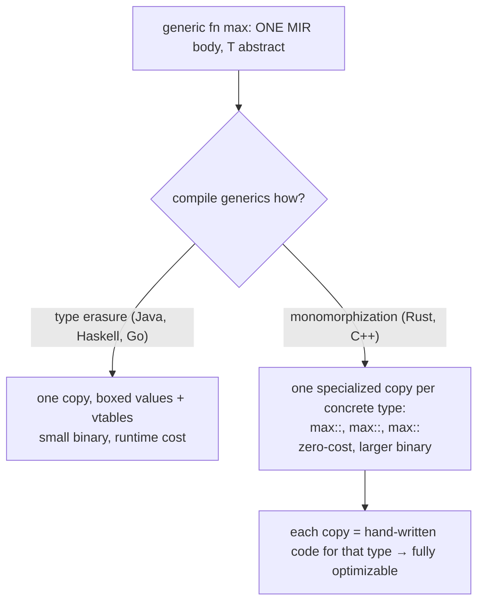
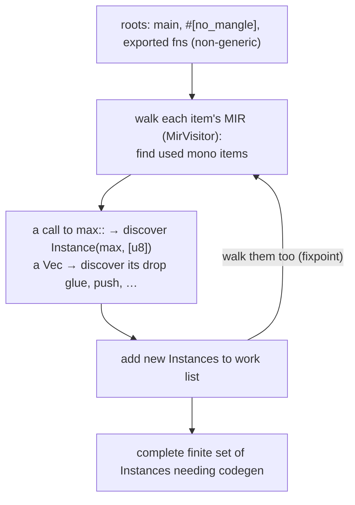
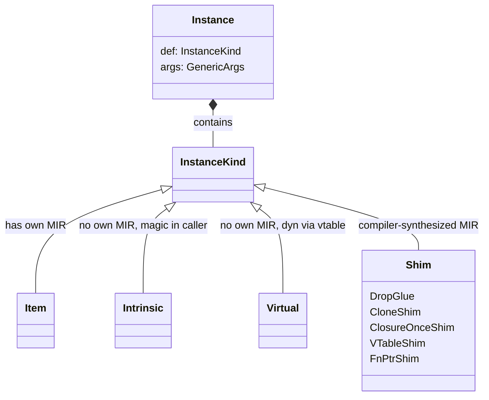
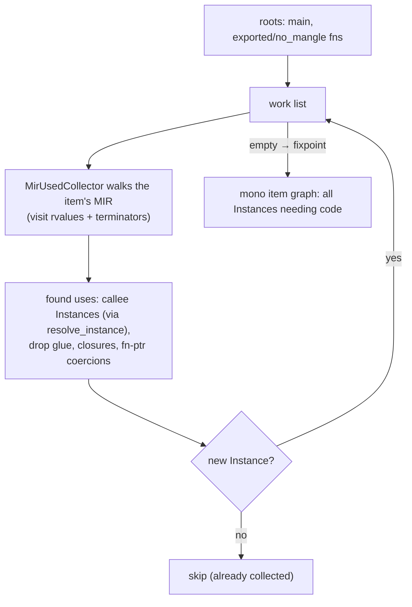
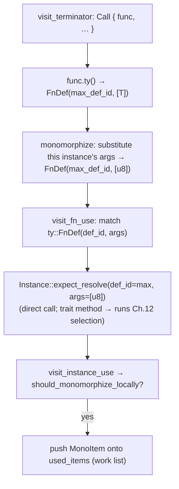
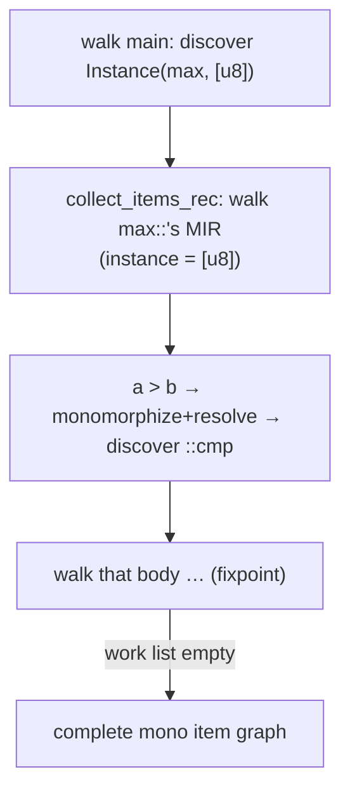
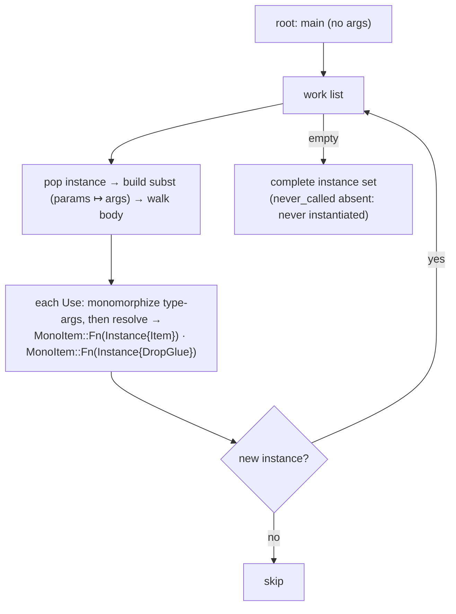

```admonish abstract title="What you'll learn"
- Why machine code cannot be generic, and why rustc chose [monomorphization](../glossary.md#monomorphization) over type erasure to keep the zero-cost-abstraction promise.
- The shape of [`Instance<'tcx>`](../glossary.md#instance) (a [`DefId`](../glossary.md#defid)-plus-`GenericArgsRef` recipe) and the 15 `InstanceKind` variants that span ordinary `Item`s, [MIR](../glossary.md#mir)-less `Intrinsic`/`Virtual` kinds, and compiler-synthesized shims like `DropGlue`.
- How `rustc_monomorphize::collector::collect_crate_mono_items` discovers the [mono item](../glossary.md#monoitem) graph: roots from [`tcx.hir_crate_items`](../glossary.md#tyctxt-tcx), the `MirUsedCollector` walking each body, and a parallel work-list iterated to a fixpoint.
- The two-step **monomorphize then resolve** invariant: `MirUsedCollector::monomorphize` substitutes the current instance's args, then `Instance::try_resolve` (backed by `resolve_instance_raw`) picks the concrete impl (cashing out Chapter 12's trait solving).
- Why the collector tracks both `UsedItems` and `MentionedItems`, and how `collect_and_partition_mono_items` packages instances into [codegen units](../glossary.md#cgu) that trade optimization quality against build parallelism.
- How to read the collector's output with `rustc -Zprint-mono-items` and confirm that uncalled generics never get instantiated.
```

## 17.1 Monomorphization: From Generic to Concrete

### Part 3 begins: making it run

The first two parts of this book were about *understanding* and *proving*. The front end turned text into a name-resolved tree; the middle end turned that tree into typed, trait-resolved, pattern-checked, [borrow-checked](../glossary.md#borrow-checker), optimized MIR: a representation that says, precisely and safely, what the program does. **Part 3 is about the last mile: turning that MIR into machine code that a CPU actually executes.** This is the back end, the part every compiler must do. Rust's back end opens with a step this chapter names: turning generic MIR into concrete instances a CPU can execute.

### The problem: machine code cannot be generic

Consider the generic function every Rust programmer has written:

```rust
fn max<T: Ord>(a: T, b: T) -> T {
    if a > b { a } else { b }
}
```

There is *one* MIR body for `max`, with `T` left abstract. But a CPU cannot execute "compare two values of some type `T`": it needs to know whether `T` is a 1-byte `u8` (compared with one instruction), an 8-byte `i64`, or a 24-byte `String` (compared by calling `String`'s comparison code). The *size* of `T` determines how arguments are passed and how much stack to allocate; the *operations* on `T` (its `Ord::cmp`) are different functions for different types. Generic MIR is a *template*: complete except for the one thing machine code most needs, concrete types with concrete sizes and concrete operations. The same is true of `Vec<T>::push`, of every `impl<T> Trait for T`, of every closure. The middle end could leave types abstract because it was *reasoning*; the back end cannot, because it is *generating instructions*.

### Two ways to compile generics

Every language with generics faces this, and there are two classic answers.

The first is **type erasure**: compile the generic code *once*, and make all types share a single representation, typically a pointer to heap-allocated data, plus a runtime table of operations (a "dictionary" or "vtable"). Java generics, Haskell type classes, and Go interfaces work this way. One copy of the code serves all types, so binaries stay small and compilation is fast, but every value is boxed and every operation is an indirect call, so there is a *runtime cost*, and the concrete type is not known to the optimizer.

The second is **monomorphization**: for each distinct set of type arguments the generic code is *actually used with*, generate a separate, specialized copy with the types filled in. `max::<u8>`, `max::<i64>`, and `max::<String>` become three different functions, each compiled as if it had been written by hand for that type. This is what C++ templates do, and it is what **Rust** does. The payoff is *zero-cost*: `max::<u8>` is exactly the code you would write by hand, fully optimizable, no boxing, no indirection. The price is *more code*, three copies instead of one, paid in compile time and binary size.

rustc chose monomorphization to keep generic code as cheap as the hand-written equivalent: zero overhead at the cost of duplicated code. This chapter is how that choice is implemented.




### What monomorphization is

**Monomorphization** is the transformation that takes the generic, polymorphic MIR of the middle end and produces, for every concrete instantiation the program actually uses, a specialized monomorphic copy. "Mono" = one; the output is code where every type is *one* concrete type, nothing abstract left. The unit of this is the `Instance`: a `DefId` (which generic item) paired with its concrete type arguments (which instantiation). `max` is a `DefId`; `max::<u8>` is an `Instance`. Codegen does not work on `DefId`s, it works on `Instance`s, concrete, specialized things that map directly to functions in the output.

The key word is *actually uses*. Monomorphization is **demand-driven**: it does not generate `max::<T>` for every conceivable `T`, that would be infinite. It generates a copy only for each `T` the program actually instantiates `max` with. So the first job of the back end is *discovery*: walk the program and find every concrete instantiation that codegen will need.

### Collection: building the mono item graph

That discovery is **collection**, performed by the **monomorphization collector** (`rustc_monomorphize::collector`, entry point `collect_crate_mono_items`). Its job, in the verified words of the source, is "discovering all items that will contribute to code generation of the crate," not just syntax-level items but "all their monomorphized instantiations."

The algorithm is a graph reachability over **mono items** (verified: functions, methods, closures, statics, drop glue, each "something that results in a function or global in the [LLVM IR](../glossary.md#llvm-ir)"). It starts from **roots**: the non-generic, definitely-needed items, `main`, `#[no_mangle]` functions, exported symbols. From each root, the collector walks the item's MIR (via a `MirVisitor`) looking for *uses* of other mono items: a function call names a callee `Instance`; a generic call with concrete arguments names a specific instantiation; constructing a value may require its drop glue. Each newly-discovered `Instance` is added to the work list and its MIR walked in turn. The verified framing: mono items and their uses form a directed **mono item graph**, and collection is the transitive closure: keep discovering until no new instances appear, a fixpoint (the same demand-driven, reachability shape as the [query](../glossary.md#query) system of Part 0). The result is the complete, finite list of every `Instance` the program needs machine code for.




```admonish tip title="Pro-Tip, collection is why an unused generic function is never an error for its instantiations, but a used one with a bad instantiation is"
Because monomorphization is demand-driven, a generic function you define but never call is never instantiated: the collector never reaches it, so no concrete copy is made. This is why some errors only appear *at the call site that triggers a particular instantiation*: a generic function might be fine for most `T` but fail to compile for a specific one (e.g. a `T` that does not actually satisfy an operation the body needs, surfacing post-monomorphization), and you only see it when you write the call that instantiates it that way. It is also why heavily-generic library code can compile clean in isolation but produce errors when *you* use it with your types: your usage is the demand that collects the failing instance. Reading a "post-monomorphization error," the mental model is: the collector reached this instantiation because *some call* in your program demanded it: find that call.
```

### The cost: code bloat, and what is done about it

Monomorphization's zero-cost runtime comes at a verified price: "monomorphization produces fast code, but it comes at the cost of compile time and binary size." A function instantiated with twenty types becomes twenty copies to compile, optimize, and embed, the **code bloat** that makes Rust binaries larger and Rust builds slower than the type-erased alternative. Several things push back. The MIR optimizations of Chapter 16 shrink each copy before it is duplicated. Identical instantiations are deduplicated within a crate. And cross-crate sharing through the `upstream_monomorphizations` mechanism lets a downstream crate reuse a generic instance its dependency already compiled, instead of re-monomorphizing it. (Rust also type-erases deliberately where you ask it to, via `dyn Trait` trait objects, the vtable path.) An earlier experimental pass, **polymorphization**, aimed to go further by detecting generic parameters that do not actually affect the generated code (a function generic over `T` whose body never depends on `T`'s specifics) and sharing one copy across those instantiations; its implementation was removed as a maintenance burden (rust-lang/rust#128830, Aug 2024), though the idea remains of interest for a future redesign.

### Codegen units: packaging the work

Collection produces the full set of instances; before codegen, they are *partitioned* into **codegen units (CGUs)**. The verified `collect_and_partition_mono_items` query (called by `rustc_codegen_ssa`'s `codegen_crate`) does collection and then hands the mono items to the verified `rustc_monomorphize::partitioning` module, which groups them into named units, each CGU "a named set of (mono-item, [linkage](../glossary.md#linkage)) pairs." This partitioning is what enables **parallel codegen** (different CGUs compiled on different threads) and **incremental rebuilds** (only CGUs whose contents changed are re-codegenned, the verified rationale for splitting volatile generic instances from stable non-generic code into separate CGUs per module). The CGU is the unit of work the backend (LLVM, Chapter 19) actually chews on, and partitioning is the bridge from "here is every instance" to "here are the compilation jobs."

```admonish warning title="Warning, monomorphization happens after the middle end, so a generic that type-checks can still fail here, and these errors are notoriously confusing"
The middle end checks a generic function *once*, against its declared bounds (`T: Ord`). But some properties are only checkable *per instantiation*, most visibly anything involving the *size* or *layout* of `T`, recursion that only terminates for some types, or const-evaluation that only some type arguments make valid. Such failures surface during or after monomorphization, far from the generic's definition, often with messages mentioning types the programmer never wrote explicitly (the collector's discovered instances). The deep point: type-checking a generic proves it correct *for all `T` satisfying the bounds*, but monomorphization can still hit a wall on a *specific* `T` for properties the bounds did not capture. When a Rust error references a wild concrete type deep in a library you are using, you are almost certainly looking at a post-monomorphization error: the collector instantiated that library's generic with your type, and *that* copy is what failed. The fix is usually at *your* call site (the demand), not in the library.
```

### Where this leaves us

Part 3 opens with the step that bridges the generic middle end and the concrete back end. **Machine code cannot be generic**: a CPU needs concrete sizes and concrete operations, so Rust, choosing **monomorphization** over type erasure for its zero-cost-abstraction promise, generates a specialized copy of the MIR for every concrete instantiation the program *actually uses*. The unit is the `Instance` (`DefId` + concrete type arguments). Finding the needed instances is **collection**: the monomorphization collector starts from roots (`main`, exported functions), walks each item's MIR to discover used mono items (calls, drop glue, …), and computes the transitive closure, the **mono item graph**, to a fixpoint, yielding the complete finite set of instances needing code. The cost is **code bloat** (compile time and binary size), mitigated by MIR optimization, identical-instantiation deduplication, and cross-crate sharing through `upstream_monomorphizations`. Finally, `collect_and_partition_mono_items` groups the instances into **codegen units** for parallel and incremental compilation. Post-monomorphization errors (surfacing per-instantiation, far from the definition) are the characteristic confusing failures of this stage.

§17.2 takes the architecture deep-dive: `Instance` and `InstanceKind` in detail, how a generic `DefId` plus `GenericArgs` becomes a concrete instance, the collector's roots and `MonoItem`/`MirUsedCollector` walk, instance resolution (`Instance::try_resolve` turning a trait-method call into the concrete impl method, paying off Chapter 12's trait solving), and the CGU partitioning scheme. Then §17.3 reads the real collector walking MIR and resolving an instance, and §17.4 has you build a small mono-item collector over a toy generic IR.

## 17.2 The Architecture: `Instance`, the Collector, and Codegen Units

### From a generic definition to a concrete job

Three pieces make the machinery concrete: the `Instance` type that names an instantiation, the **collector** that discovers them, and the **partitioner** that packages them. The key realization, verified and slightly surprising, is that "monomorphization happens *on-the-fly*": no fully-monomorphized MIR is ever materialized as a separate artifact. An `Instance` is a lightweight *recipe* that codegen and const-eval instantiate as they run.

### `Instance`: a recipe, not a copy

The verified `Instance` is tiny:

```rust
// rustc_middle/src/ty/instance.rs  (faithful; derives omitted)
pub struct Instance<'tcx> {
    pub def: InstanceKind<'tcx>, // WHICH item (a DefId, wrapped, see below)
    pub args: GenericArgsRef<'tcx>, // the concrete type/const arguments
}
```

Two fields: *which* generic item, and *what* to fill its parameters with. `max::<u8>` is `Instance { def: Item(max_def_id), args: [u8] }`. The verified doc is explicit that this "simply couples a potentially generic `InstanceKind` with some args, and codegen and const eval will do all required instantiations as they run": the `Instance` is the *plan* to specialize `max`'s MIR with `T = u8`, and the actual substitution happens lazily during codegen by reading the generic MIR body and applying `args`. This is why a program with thousands of instances does not balloon memory with thousands of MIR copies: each instance is a `DefId` plus a small argument list until the moment its code is generated.

### `InstanceKind`: not every instance is a normal function

The `def` field is an `InstanceKind` (historically `InstanceDef`), and it is richer than "a function," because codegen must produce machine code for things the programmer never wrote as functions. Two contrasting cases carry the teaching point:

- `Item(DefId)`: the ordinary case, a user-written function, method, or `const`. Its MIR is the body you wrote.
- A **shim** such as `DropGlue`: compiler-synthesized MIR for code with no source. Dropping a `Vec<String>` requires generated code to drop each `String` then free the buffer, code no one wrote, which the compiler must synthesize and monomorphize like any other.

`InstanceKind` also has MIR-less kinds (intrinsics evaluated in the caller, `Virtual` for `dyn Trait` vtable slots) and additional shims (clone, closure adapters, function-pointer adapters). The full catalogue (15 variants at 1.95.0) lives in `rustc_middle::ty::InstanceKind` and the rustc-dev-guide backend chapter; the diagram below shows a representative subset. This taxonomy matters because collection (below) must discover all of these, not just `Item`s: a `Vec<String>` going out of scope demands its `DropGlue` instance even though there is no `drop` call in the source.




### Resolution: from a call to a concrete `Instance`

When the collector sees a call in the MIR, it has a `DefId` and some generic `args`, but turning that into a concrete `Instance` can require *work*, and that work is the payoff of Chapter 12. Consider a call to `<T as Ord>::cmp` where, at this instantiation, `T = u8`. The MIR names the *trait method* `Ord::cmp`; but the code that must actually run is `<u8 as Ord>::cmp`, the method from `u8`'s `impl Ord`. Finding it means **resolving the trait obligation `u8: Ord` to its impl** and selecting that impl's `cmp`, exactly the trait solving of Chapter 12, now invoked to pick concrete code. This is the verified `Instance::try_resolve` method (backed by the `resolve_instance_raw` query): given a `DefId` and `args`, it returns the `Instance` that should actually be called, an `Item` for the concrete impl method when the type is known, or it stays a `Virtual` instance when the call is through `dyn Trait` (where the type is *not* known until runtime and the vtable decides).

So `Instance` resolution is where the middle end's trait solving cashes out as concrete dispatch: static calls resolve to specific impl methods (and can be inlined and optimized); `dyn` calls resolve to `Virtual` and become vtable lookups. The §17.1 distinction between monomorphization and type-erasure lives right here, per call.

```admonish tip title="Pro-Tip, resolve_instance is the path by which generic calls become direct, inlinable calls"
When `T` is statically known, resolving `<T as Trait>::method` yields an `Item` instance pointing at the *exact* function to call. That means the call is a direct call (not an indirect vtable jump), which means the optimizer can *inline* it, which means a generic function calling a trait method on a concrete `T` optimizes down to exactly what hand-written monomorphic code would produce, no dispatch overhead at all. This is the mechanical reason "zero-cost abstraction" is true for generics but not for `dyn Trait`: the generic path goes through `resolve_instance` to a concrete `Item` (inlinable), while the `dyn` path goes to `Virtual` (a runtime vtable call the optimizer usually cannot see through). When you choose `impl Trait`/generics over `dyn Trait` for performance, this resolution step is the difference you are buying.
```

### The collector: roots, the work-list, and the graph

With `Instance` and resolution defined, the collector (§17.1) is precise. It begins from **roots**, the items that need code regardless of any generic instantiation: `main`, `#[no_mangle]` and exported functions, and (for libraries) externally-reachable items. Then it processes a **work list**, and for each item walks its MIR with a verified `MirUsedCollector` (a `MirVisitor`): visiting every rvalue and terminator to find *used* mono items: a `Call` terminator's callee (resolved via `resolve_instance`), a function-pointer coercion, a `Vec<String>` construction that implies drop glue, a closure. Each newly-found `Instance` not seen before is pushed onto the work list. Iterating until the work list empties computes the transitive closure, the verified **mono item graph**, and yields every instance needing code.

A verified subtlety: the collector distinguishes **used** items from **mentioned** items. *Used* items are reached through actual calls/constructions and definitely need code. *Mentioned* items are referenced in ways that might be optimized away, but are collected anyway, so that const-evaluation errors they would trigger are not "hidden" by an optimization removing the call. This is why a const-eval failure in a function that gets optimized out can *still* be reported: the item was mentioned, so it was checked.




### Partitioning into codegen units

The complete instance set is then partitioned by the verified `collect_and_partition_mono_items` query into **codegen units**, the verified `rustc_monomorphize::partitioning` module produces "a named set of (mono-item, linkage) pairs" per unit. The partitioning scheme is driven by *incremental compilation*: the verified rationale is that a CGU is the granularity of recompilation, so the partitioner separates **stable** code (non-generic items, which change rarely) from **volatile** code (monomorphized instances, which appear and disappear as references are added), on the order of one or two CGUs per module depending on size [VERIFY partitioning heuristic against current rustc], so that adding one generic call does not invalidate an entire module's compiled output. Each instance is also assigned a **linkage** (internal, external) determining its visibility across CGUs and crates.

Cross-crate sharing appears here too: the verified `upstream_monomorphizations` mechanism lets an instance already monomorphized in an upstream crate be *linked to* rather than re-generated, avoiding duplicate copies of, say, `Vec<i32>::push` in every crate that uses it. The CGU is the unit the backend (Chapter 19) compiles, and partitioning is the bridge from the abstract instance set to concrete, parallelizable, incrementally-rebuildable compilation jobs.

```admonish warning title="Warning, codegen-unit count trades optimization quality against build parallelism, and the default is a compromise"
More CGUs mean more parallelism (each compiled on its own thread) and better incremental rebuilds (smaller units to recompile), but *worse* optimization, because optimizations like inlining mostly happen *within* a CGU, so splitting related functions across units hides them from each other. Fewer CGUs (the extreme being one, via `codegen-units = 1`) let the optimizer see everything together for the best code, but serialize compilation and make every change recompile more. This is why release builds for maximum performance often set `codegen-units = 1` (slow build, fastest binary) while debug builds use many (fast build, unoptimized). The partitioner's default is a middle ground tuned for development. The lesson: if you are chasing either build speed *or* runtime speed, CGU count is a real lever, but it is a genuine trade-off, not a free win in either direction, and the right setting depends on which you are optimizing for.
```

### How this builds, and what is next

The architecture of monomorphization is now concrete. An `Instance` is a lightweight recipe, an `InstanceKind` (a `DefId`, possibly a shim or a `Virtual` vtable slot) plus concrete `GenericArgs`, that codegen instantiates *on the fly*, never materializing standalone monomorphic MIR. `InstanceKind` spans ordinary `Item`s, MIR-less `Intrinsic`/`Virtual` kinds, and compiler-synthesized **shims** (drop glue, clone, closure adapters) that collection must also discover. `resolve_instance` turns a `DefId`-plus-`args` (often a trait-method call) into the concrete instance to run, cashing out Chapter 12's trait solving as either a direct, inlinable `Item` (the basis of zero-cost generics) or a `Virtual` vtable call (`dyn`). The **collector** starts from roots, walks each body's MIR with `MirUsedCollector` to find used (and mentioned) instances, and iterates the **mono item graph** to a fixpoint. Finally, `collect_and_partition_mono_items` groups instances into **codegen units** (stable vs volatile, with linkage, sharing upstream monomorphizations): the parallel, incremental compilation jobs the backend consumes, with CGU count trading optimization against build speed.

§17.3 reads the real collector: the `MirUsedCollector` visiting a call terminator, `resolve_instance` selecting a concrete impl method, and an instance being added to the work list: the discovery loop in actual code. Then §17.4 has you build a small mono-item collector over a toy generic IR: instances as (function, type-args), a visitor that finds calls, instance resolution, and a work-list fixpoint that produces the full set of needed monomorphizations.

## 17.3 Reading the Source: The Collector Walks the MIR

### Discovering `max::<u8>` from a single call

Here is the collector finding work, traced through one call:

```rust
fn main() {
    let m = max(3u8, 7u8); // a call to max::<u8>
}
```

And watch the `MirUsedCollector` walk `main`'s MIR, reach the `Call` to `max`, *monomorphize* its type arguments, *resolve* it to the concrete `Instance(max, [u8])`, and push it onto the work list, from which `max::<u8>`'s own body will then be walked, discovering `<u8 as Ord>::cmp` in turn. The source is `rustc_monomorphize::collector`.

### The visitor and its state

The verified `MirUsedCollector` is a `MirVisitor` carrying the context it needs:

```rust
// rustc_monomorphize/src/collector.rs (faithful; used_mentioned_items field elided)
struct MirUsedCollector<'a, 'tcx> {
    tcx: TyCtxt<'tcx>,
    body: &'a mir::Body<'tcx>,
    used_items: &'a mut MonoItems<'tcx>, // ① output: instances discovered here
    // used_mentioned_items: &'a mut UnordSet<MentionedItem<'tcx>>, // (elided)
    instance: Instance<'tcx>, // ② the instance whose body we walk now
}
```

The crucial field is `instance`: the collector is walking the MIR of *some specific instantiation*, say `Instance(foo, [u8])`, and that context is what lets it turn the generic types *inside* that body into concrete ones. The verified helper:

```rust
fn monomorphize<T: TypeFoldable<TyCtxt<'tcx>>>(&self, value: T) -> T {
    // instantiate `value`'s generic params using THIS instance's args, then normalize
    self.instance.instantiate_mir_and_normalize_erasing_regions(self.tcx, /* env */, value)
}
```

`monomorphize` is the bridge from generic to concrete: applied to a type that mentions `T`, it substitutes the current instance's argument for `T`. Inside `Instance(foo, [u8])`, `monomorphize(T)` yields `u8`. Every type the collector inspects is run through this first.

### Visiting a `Call` terminator

The collector's `visit_terminator` (verified to exist on the visitor) handles a `Call` by extracting the callee from the `func` operand. A function in MIR has type `ty::FnDef(def_id, args)` (Chapter 11), and `visit_fn_use` is what processes it:

```rust
// faithful, abridged: finding the callee of a Call (source-span plumbing
// and the #[track_caller] tail-call branch elided)
fn visit_terminator(&mut self, terminator: &Terminator<'tcx>, location: Location) {
    let source = self.body.source_info(location).span;
    if let TerminatorKind::Call { ref func, .. } = terminator.kind {
        let callee_ty = func.ty(self.body, self.tcx); // the function operand's type
        // ← substitute THIS instance's args
        let callee_ty = self.monomorphize(callee_ty);
        visit_fn_use(self.tcx, callee_ty, /* is_direct_call */ true,
                     source, &mut self.used_items);
    }
    self.super_terminator(terminator, location);
}

// visit_fn_use (faithful):
fn visit_fn_use<'tcx>(
    tcx: TyCtxt<'tcx>,
    ty: Ty<'tcx>,
    is_direct_call: bool,
    source: Span,
    output: &mut MonoItems<'tcx>,
) {
    if let ty::FnDef(def_id, args) = *ty.kind() {
        // ← resolution: two paths, picked by is_direct_call
        let instance = if is_direct_call {
            Instance::expect_resolve(tcx, env, def_id, args, source)
        } else {
            match Instance::resolve_for_fn_ptr(tcx, env, def_id, args) {
                Some(instance) => instance,
                _ => bug!("failed to resolve instance for {ty}"),
            }
        };
        visit_instance_use(tcx, instance, is_direct_call, source, output);
    }
}
```

Read the three moves. First, `func.ty(...)` gives the callee's type: for our call, `FnDef(max_def_id, [T])` where `T` is still generic *as written in `max`'s signature*, but seen from inside `main` (a non-generic root) the argument is already `u8` from the call. Second, and this is the engine, `monomorphize` substitutes the current instance's args so the type is fully concrete: `FnDef(max_def_id, [u8])`. Third, `visit_fn_use` matches the verified `ty::FnDef(def_id, args)` shape and resolves: direct calls take the `Instance::expect_resolve` path; function-pointer coercions take `Instance::resolve_for_fn_ptr`. Both ultimately funnel into the same `Instance::try_resolve` machinery (`expect_resolve` is a panicking wrapper around it), so the conceptual model "name the concrete code via `try_resolve`" is the right one to carry forward.

### Resolution: the Chapter 12 payoff

`Instance::try_resolve(tcx, env, def_id, args)` is where a generic reference becomes a concrete callable (§17.2). For `max` it is straightforward: `def_id` is `max`, `args` is `[u8]`, and resolution yields `Instance { def: Item(max_def_id), args: [u8] }`: the `Item` instance for `max::<u8>`. But the same call path does the hard case too: when the callee is a *trait method* like `<T as Ord>::cmp` and the concrete `T` is known, `Instance::try_resolve` runs trait selection, Chapter 12's machinery, to find *which impl* provides `cmp` for `u8`, and returns the `Item` instance for `<u8 as Ord>::cmp`. (If the receiver were `dyn Ord`, resolution would instead yield a `Virtual` instance, the vtable call.) This is the moment the middle end's trait solving is *spent*: it ran during type-checking to prove `u8: Ord`; it runs again here, via `resolve`, to *name the code*.

`visit_instance_use` then checks the verified `should_codegen_locally` (is this instance one *this* crate must generate, versus link from upstream, §17.2) and, if so, pushes the corresponding `MonoItem` onto `used_items`: the work list. `Instance(max, [u8])` is now discovered.




### Drop glue: discovering code no one wrote

The collector also finds instances that appear in *no call*. The `visit_drop_use` hook handles values going out of scope: when the MIR drops a `Vec<String>`, the collector calls `Instance::resolve_drop_in_place(tcx, ty)` to obtain the `DropGlue` instance (§17.2): the synthesized destructor for `Vec<String>`, which itself uses the drop glue for `String`, which uses the deallocation function. None of this is written as a function in the source, yet each is a mono item needing code, discovered because the collector visits `Drop` terminators (and the implicit drops the MIR makes explicit, §14.1) and resolves their glue. This is why §17.2 insisted collection must find shims, not just `Item`s: a program that never writes `drop` still generates a tree of drop-glue instances.

### The recursion: closing the graph

Pushing `Instance(max, [u8])` onto the work list is not the end: the verified `collect_items_rec` then takes that instance and walks *its* MIR with a fresh `MirUsedCollector` whose `instance` field is now `Instance(max, [u8])`. Inside `max`'s body is the comparison `a > b`, which lowers to a call to `<T as PartialOrd>::cmp` (or `Ord::cmp`); with the collector's `instance` now bound to `[u8]`, `monomorphize` turns that `T` into `u8`, `resolve` finds `<u8 as Ord>::cmp`, and *it* is pushed. The process repeats, each discovered instance's body walked, its callees discovered, until the work list drains. That transitive closure is the mono item graph (§17.1) computed in code: start at `main`, discover `max::<u8>`, discover `<u8 as Ord>::cmp`, discover whatever *that* calls, and stop when nothing new appears.




```admonish tip title="Pro-Tip, monomorphize-then-resolve is the two-step that turns generic MIR into concrete instances, and the order matters because resolution requires concrete types"
Notice the invariant: the collector *first* substitutes the current instance's type arguments (`monomorphize`), and *only then* resolves. Resolution needs *concrete* types to do its job: you cannot select which `impl Ord` provides `cmp` for `T` while `T` is still abstract; you must know it is `u8`. This is why `Instance::try_resolve` can fail (return "too generic") when called on un-monomorphized types, and why the collector always monomorphizes first against its current instance's args. When you read collector or codegen code, this `monomorphize` → `resolve` pairing is everywhere: make the types concrete using the enclosing instance, then resolve the now-concrete reference to the specific code. Reverse the order and resolution has nothing to bite on.
```

```admonish warning title="Warning, the collector's mentioned-items pass exists so optimizations cannot hide errors, and conflating it with used leads to wrong conclusions"
§17.2 introduced the used/mentioned split; the source makes the hazard concrete. The collector runs in two modes: `CollectionMode::UsedItems` (what is actually needed for codegen, which *depends on optimization level* because MIR opts can remove calls) and `CollectionMode::MentionedItems` (computed *before* optimizations, deliberately optimization-independent). The reason both exist: if a function containing a const-eval error is optimized away, the *used* set would no longer include it, and the error would silently vanish at higher opt levels, a program that fails to compile in debug but "works" in release, or vice versa. The *mentioned* set is collected from un-optimized MIR precisely to pin those errors regardless of optimization. The lesson for anyone reasoning about what gets compiled: "used" is not a stable set, it shifts with `-O`, so never assume a particular instance is or isn't generated based on optimization-dependent reasoning; the mentioned-items machinery is the compiler's defense against exactly that instability.
```

### How this builds, and what is next

We have watched the collector discover an instance from a call. The `MirUsedCollector` walks an instance's MIR carrying that `instance` as context; at a `Call`, it takes the callee's `FnDef(def_id, args)` type, `monomorphize`s it against the current instance's args to make it concrete (`[T]` → `[u8]`), and calls `visit_fn_use` → `Instance::try_resolve`, which turns the concrete `def_id`+`args` into an `Item` instance, running Chapter 12's trait selection when the callee is a trait method, to name the exact impl code (or yielding a `Virtual` instance for `dyn`). The resolved instance, if local, is pushed onto the work list. `visit_drop_use` likewise discovers synthesized `DropGlue` for dropped values. `collect_items_rec` then walks each newly-discovered instance's body, repeating until the work list drains: the mono item graph closed to a fixpoint. The invariant throughout is **monomorphize then resolve**: make types concrete, then name the code; and the **used/mentioned** two-mode collection keeps optimization from hiding errors.

§17.4 turns this into a build. You will write a small monomorphization collector over a toy generic IR: functions with type parameters, calls carrying type arguments, instances as `(fn, type-args)` pairs, a `monomorphize` step that substitutes the current instance's args into a call's arguments, a `resolve` step that picks concrete code, and a work-list fixpoint that, starting from `main`, produces the complete set of monomorphic instances, reproducing, in code you wrote, the discovery loop you just read.

## 17.4 Hands-On Lab: Build a Monomorphization Collector

### Discovering every concrete instance

This lab builds the collector you read in §17.3: starting from `main`, it discovers every concrete `Instance` the program needs, by walking each function's body, **monomorphizing** call type-arguments against the current instance, **resolving** trait-method calls to concrete impls, and iterating a **work list** to a fixpoint. When your collector turns a program that calls `max` on both `u8` and `String` into the instance set `{ main, max::<u8>, max::<String>, <u8 as Ord>::cmp, <String as Ord>::cmp, drop::<u8>, drop::<String> }`, and *never* collects a generic function nobody calls, you will have built the monomorphization collector in miniature, `monomorphize`-then-`resolve` and all.

`cargo new`, pure `std`.

### A toy generic IR

A function has type parameters and a body of "uses": calls (with type arguments that may mention the function's own type params) and drops:

```rust
// src/main.rs
//
// Lab modeled on:
//   compiler/rustc_monomorphize/src/collector.rs (MirUsedCollector, collect_items_rec, the work-list loop)
//   compiler/rustc_middle/src/ty/instance.rs (Instance, InstanceKind, Instance::try_resolve)
//   compiler/rustc_middle/src/ty/sty.rs::TyKind (real rustc Ty variants we collapse to Concrete/Param)
// Real rustc walks the MIR `Body` of each instance and calls `Instance::try_resolve(tcx, env, def_id, args)`,
// which queries the trait solver (Chapter 12) to pick the impl. We use a hand-rolled `body: Vec<Use>` of
// call sites + drops, and a string-keyed program map, to stay std-only and exhibit the algorithm without
// 'tcx arenas, TyCtxt, GenericArgs, DefId, or the MIR data structures.

use std::collections::{HashMap, HashSet, VecDeque};

#[derive(Clone, Debug, PartialEq)]
enum Type { Concrete(String), Param(String) } // u8 / String  vs  T (a type parameter)

#[derive(Clone, Debug)]
enum Callee {
    // a free function named by its identifier
    Free(String),
    // a trait method called on a receiver type (resolves to a concrete impl, §17.3)
    TraitMethod { trait_name: String, method: String, recv: Type },
}

#[derive(Clone, Debug)]
enum Use {
    // call a (possibly generic) callee with these type-args; both free fns and
    // trait-method calls flow through here, mirroring rustc's single `visit_fn_use`
    Call { callee: Callee, type_args: Vec<Type> },
    // a value of this type goes out of scope → drop glue (§17.3)
    Drop { ty: Type },
}

#[derive(Clone)]
struct Func { name: String, type_params: Vec<String>, body: Vec<Use> }
```

### The program: `main` calls `max` two ways

```rust
fn program() -> HashMap<String, Func> {
    let mut p = HashMap::new();
    // fn main() { max::<u8>(..); max::<String>(..); } (non-generic root)
    p.insert("main".into(), Func {
        name: "main".into(), type_params: vec![],
        body: vec![
            Use::Call {
                callee: Callee::Free("max".into()),
                type_args: vec![Type::Concrete("u8".into())],
            },
            Use::Call {
                callee: Callee::Free("max".into()),
                type_args: vec![Type::Concrete("String".into())],
            },
        ],
    });
    // fn max<T: Ord>(a: T, b: T) -> T { T::cmp(..); /* String drops temp */ }
    p.insert("max".into(), Func {
        name: "max".into(), type_params: vec!["T".into()],
        body: vec![
            Use::Call {
                callee: Callee::TraitMethod {
                    trait_name: "Ord".into(),
                    method: "cmp".into(),
                    recv: Type::Param("T".into()),
                },
                type_args: vec![],
            },
            Use::Drop { ty: Type::Param("T".into()) }, // drop a temporary of type T
        ],
    });
    // fn never_called<U>() { ... }   ← generic, but no one calls it → never collected
    p.insert("never_called".into(), Func {
        name: "never_called".into(), type_params: vec!["U".into()],
        body: vec![Use::Call {
            callee: Callee::TraitMethod {
                trait_name: "Ord".into(),
                method: "cmp".into(),
                recv: Type::Param("U".into()),
            },
            type_args: vec![],
        }],
    });
    p
}
```

### The work-list element: `MonoItem`, `Instance`, `InstanceKind`

Rustc's collector pushes `MonoItem`s onto its work list; each `MonoItem::Fn` wraps an `Instance`, which pairs an `InstanceKind` (the kind-of-MIR axis) with the concrete generic arguments. The lab mirrors that two-level shape so the §17.2 architecture diagram runs as code:

```rust
// what gets pushed onto the work list (rustc's MonoItem<'tcx>)
#[derive(Clone, PartialEq, Eq, Hash, Debug)]
enum MonoItem {
    Fn(Instance),     // max::<u8>, <u8 as Ord>::cmp, drop_in_place::<String>
    Static(String),   // a non-fn global; unused in this lab, listed for shape parity
}

// what *kind* of code is inside a MonoItem::Fn (rustc's Instance<'tcx>)
#[derive(Clone, PartialEq, Eq, Hash, Debug)]
struct Instance {
    def: InstanceKind,
    args: Vec<String>, // the concrete type arguments
}

// the kind-of-MIR axis (rustc's InstanceKind<'tcx>, 15 variants; we keep three)
#[derive(Clone, PartialEq, Eq, Hash, Debug)]
enum InstanceKind {
    Item(String),     // an ordinary function or method: identifier of the item
    Virtual(String),  // a dyn-Trait vtable slot (placeholder; see Extension 2)
    DropGlue(String), // compiler-synthesized destructor for this type
}
```

A free call `max::<u8>` is `MonoItem::Fn(Instance { def: InstanceKind::Item("max"), args: vec!["u8"] })`. A trait call `<u8 as Ord>::cmp` is *also* `MonoItem::Fn(Instance { def: InstanceKind::Item("Ord::cmp@u8"), args: vec![] })`, identical in shape to the free call: the trait-vs-not distinction lives inside resolution, never in the work-list element type, exactly as rustc carries it.

### `monomorphize`: substitute the current instance's args

The §17.3 engine: given the current instance's type-parameter bindings (e.g. `T = u8`), turn a `Type` that may be a `Param` into a concrete type name. This is the step that *must come before resolution*:

```rust
fn monomorphize(ty: &Type, subst: &HashMap<String, String>) -> String {
    match ty {
        Type::Concrete(name) => name.clone(),
        Type::Param(p) => subst.get(p)
            .unwrap_or_else(|| panic!("unbound type param {p}: should be monomorphic by now"))
            .clone(),
    }
}
```

### `visit_fn_use` / `visit_drop_use`: name the concrete code

Resolution (§17.3) turns a monomorphized reference into a concrete `MonoItem`. The visitor side has two hooks (`visit_fn_use` for calls, `visit_drop_use` for dropped values), each calling a small `Instance::resolve*` constructor; *both* free calls and trait-method calls flow through the *same* `visit_fn_use`, paying off §17.3's "the same call path does the hard case too" beat. The trait-vs-not distinction lives inside the resolver, not in the visitor.

```rust
// the visitor's single entry point for any callee, free or trait-method
fn visit_fn_use(callee: &Callee, type_args: &[Type], subst: &HashMap<String, String>) -> MonoItem {
    let args: Vec<String> = type_args.iter().map(|t| monomorphize(t, subst)).collect();
    let inst = match callee {
        Callee::Free(name) => Instance::resolve(name.clone(), args),
        Callee::TraitMethod { trait_name, method, recv } => {
            // Real rustc calls `Instance::try_resolve`, which queries the trait
            // solver (Chapter 12) to pick the impl. Our toy uses the receiver's
            // concrete type as the impl key.
            let ty = monomorphize(recv, subst);
            Instance::resolve(format!("{trait_name}::{method}@{ty}"), vec![])
        }
    };
    MonoItem::Fn(inst)
}

// dropped values become DropGlue instances (rustc's Instance::resolve_drop_in_place)
fn visit_drop_use(ty: &Type, subst: &HashMap<String, String>) -> MonoItem {
    MonoItem::Fn(Instance::resolve_drop_in_place(monomorphize(ty, subst)))
}

impl Instance {
    // the small constructor the visitor calls (rustc's Instance::expect_resolve)
    fn resolve(item: String, args: Vec<String>) -> Self {
        Instance { def: InstanceKind::Item(item), args }
    }
    // synthesized destructor (rustc's Instance::resolve_drop_in_place)
    fn resolve_drop_in_place(ty: String) -> Self {
        Instance { def: InstanceKind::DropGlue(ty.clone()), args: vec![ty] }
    }
}
```

Notice the two-layer split: `visit_*_use` does the monomorphize-then-construct work on the visitor side; the `Instance::resolve*` constructors do the resolution. Rustc carries the same split (`visit_fn_use` in `collector.rs`, `Instance::expect_resolve` / `Instance::resolve_drop_in_place` in `instance.rs`).

### `collect_items_rec`: roots, work list, fixpoint

Start from the non-generic root `main`; for each instance on the work list, build its substitution (bind its function's type params to its args), walk its body discovering new instances, and push any not seen before, until the list drains. This is exactly the verified `collect_items_rec` of §17.3:

```rust
fn collect_items_rec(program: &HashMap<String, Func>) -> Vec<MonoItem> {
    let mut seen: HashSet<MonoItem> = HashSet::new();
    let mut worklist: VecDeque<MonoItem> = VecDeque::new();

    // ROOT: main, with no type args (§17.2's roots discussion).
    // Real rustc's `collect_roots` walks `tcx.hir_crate_items` and pushes
    // every non-generic free item, impl item, and (in Eager mode) #[no_mangle]
    // fn / exported fn / ADT drop-glue. We use a single hard-coded `main`
    // for clarity; the work-list shape below is identical.
    let root = MonoItem::Fn(Instance::resolve("main".into(), vec![]));
    worklist.push_back(root.clone()); seen.insert(root);

    while let Some(item) = worklist.pop_front() {
        // The body-walk gate, mirroring rustc's `collect_items_rec` arm at
        // `collector.rs:467`: only `MonoItem::Fn(Instance { def: Item(_), .. })`
        // has a user-written MIR body. `Virtual` and `DropGlue` are leaves here;
        // real rustc walks shim MIR for the latter.
        let MonoItem::Fn(Instance { def: InstanceKind::Item(func), args }) = &item else { continue };
        let Some(callee) = program.get(func) else { continue };

        // build the substitution: this instance's type params ↦ its concrete args.
        // Real rustc carries this implicitly in `self.instance.args` and passes
        // `value` through `instantiate_mir_and_normalize_erasing_regions`; we build
        // an explicit `HashMap` so the data flow is visible.
        let subst: HashMap<String, String> =
            callee.type_params.iter().cloned().zip(args.iter().cloned()).collect();

        // walk the body, discovering used MonoItems (§17.3 MirUsedCollector::visit_*).
        // In real rustc this is a `Visitor` walk over the MIR `Body`; the visitor's
        // hooks (`visit_terminator` for calls, `visit_rvalue` for sized drops, ...)
        // do `monomorphize` then construct an Instance, just like the match below.
        for use_site in &callee.body {
            let discovered = match use_site {
                Use::Call { callee, type_args } => visit_fn_use(callee, type_args, &subst),
                Use::Drop { ty } => visit_drop_use(ty, &subst),
            };
            // Real rustc gates this push on `tcx.should_codegen_locally(instance)`,
            // which returns false when the instance is already monomorphized in an
            // upstream crate (the `upstream_monomorphizations` mechanism, §17.2).
            // Our single-crate toy collects everything.
            if seen.insert(discovered.clone()) { // dedup the work-list
                worklist.push_back(discovered); // enqueue for its own walk
            }
        }
    }
    let mut out: Vec<_> = seen.into_iter().collect();
    // sort by display form so output matches the printed list
    out.sort_by_key(|i| pretty(i));
    out
}
```

### Running it

```rust
fn pretty(item: &MonoItem) -> String {
    match item {
        MonoItem::Static(name) => format!("static {name}"),
        MonoItem::Fn(Instance { def, args }) => match def {
            InstanceKind::Item(name) => {
                // Trait-method items are tagged "Trait::method@RecvTy" by `visit_fn_use`;
                // render as <RecvTy as Trait>::method. Free items render directly.
                if let Some((path, recv)) = name.rsplit_once('@') {
                    let (trait_name, method) = path.rsplit_once("::").unwrap();
                    format!("<{recv} as {trait_name}>::{method}")
                } else if args.is_empty() {
                    name.clone()
                } else {
                    format!("{name}::<{}>", args.join(", "))
                }
            }
            InstanceKind::Virtual(name) => format!("<dyn>::{name}"),
            InstanceKind::DropGlue(ty) => format!("core::ptr::drop_in_place::<{ty}>"),
        },
    }
}

fn main() {
    let p = program();
    println!("Collected mono items (starting from `main`):");
    for item in collect_items_rec(&p) {
        println!(" • {}", pretty(&item));
    }
}
```

````admonish example title="Expected output" collapsible=true
Output:

```text
Collected mono items (starting from `main`):
  • <String as Ord>::cmp
  • <u8 as Ord>::cmp
  • core::ptr::drop_in_place::<String>
  • core::ptr::drop_in_place::<u8>
  • main
  • max::<String>
  • max::<u8>
```
````

There it is: the monomorphization collector, in code you wrote. From the single root `main`, the collector discovered `max::<u8>` and `max::<String>` (two `MonoItem::Fn(Instance { def: Item(_), .. })` items from the same generic `max`); then, walking *each* of those bodies with its own substitution (`T = u8`, then `T = String`), it monomorphized the `Ord::cmp` trait call through the *same* `visit_fn_use` path the free calls take, resolving it per receiver type (rendered by `pretty` as `<u8 as Ord>::cmp` and `<String as Ord>::cmp`), and discovered the drop glue `core::ptr::drop_in_place::<u8>` and `core::ptr::drop_in_place::<String>` from the `Drop` use via `visit_drop_use`. Crucially, **`never_called` does not appear**: it is generic and nothing instantiates it, so the collector never reaches it, exactly §17.1's demand-driven property. The `monomorphize`-then-resolve order (§17.3) is visible in `visit_fn_use` and `visit_drop_use`: substitute the enclosing instance's args first, *then* hand the now-concrete reference to an `Instance::resolve*` constructor.




### What the lab stripped from real rustc

The lab's collector fits on one screen. The real algorithm lives in `[rustc_middle/src/ty/instance.rs](https://github.com/rust-lang/rust/blob/1.95.0/compiler/rustc_middle/src/ty/instance.rs)` and `[rustc_monomorphize/src/collector.rs](https://github.com/rust-lang/rust/blob/1.95.0/compiler/rustc_monomorphize/src/collector.rs)`. What it adds on top of the lab's `MonoItem`/`Instance`/`InstanceKind` three-type shape, `String`-named items, and a `Vec<Use>` walk:

The collector algorithm is the same; the real version differs mainly in plumbing. Real `Instance` is [arena](../glossary.md#arena)-allocated and [`'tcx`](../glossary.md#tcx-lifetime)-threaded; `InstanceKind` has fifteen variants instead of three (the lab keeps `Item`, `Virtual`, and `DropGlue`; rustc adds `Intrinsic`, `ReifyShim`, `FnPtrShim`, `ClosureOnceShim`, several others); `GenericArgsRef` replaces the lab's `Vec<String>`. Real `Ty` and `GenericArgsRef` likewise replace the lab's strings and `Type::{Concrete, Param}`. `Instance::try_resolve` calls the [trait solver](../glossary.md#trait-solver) (Chapter 12) to pick the impl, where the lab's `visit_fn_use` cheats with the receiver type as the impl key (the `"Trait::method@RecvTy"` tag). The walk traverses a MIR `Body` via the `Visitor` machinery [VERIFY which chapter introduces MIR visitors] instead of iterating a `Vec<Use>`. See `rustc_middle::ty::instance` and the rustc-dev-guide's monomorphization chapter for the full surface.

### Cross-check against real rustc

Write a small program with a generic function instantiated at several types, then ask rustc which mono items it collected:

```rust
fn id<T>(x: T) -> T { x }
fn main() {
    let _a = id(1_i32);
    let _b = id(2_u8);
    let _c = id("three");
    let _d = id(4.0_f64);
}
```

```bash
rustc +nightly -Zprint-mono-items=lazy foo.rs 2>&1 | grep -E 'MONO_ITEM|fn '
```

```admonish example title="What you should see" collapsible=true
Each line names one `MonoItem::Fn` or `MonoItem::Static` the real collector discovered, with concrete generic arguments substituted in. `id` is one source function and appears four times: `id::<i32>`, `id::<u8>`, `id::<&str>`, `id::<f64>`, four distinct `Instance`s reachable from `main`, exactly the set the lab walked from its own roots. The traversal is the one §17.3 reads; rustc's adds `should_codegen_locally`, CGU partition, and `Lazy` vs `Eager` mode on top.
```

### Extension exercises

1. **Deduplication is already there: now count copies.** Add a counter showing that `max` produced *two* `MonoItem::Fn(Instance { def: Item(_), .. })` items. Then add a third call `max::<u8>` elsewhere and confirm it does *not* create a third instance (the `seen` set dedups), the basis of cross-crate `upstream_monomorphizations` (§17.2).
2. **`dyn` dispatch: a `Virtual` instance that stops collection.** Add a `Callee::DynTraitMethod { trait_name, method }` variant that resolves to a single `Instance { def: InstanceKind::Virtual(_), .. }` *without* a concrete receiver type, and note that it does *not* trigger collection of any specific impl (the vtable decides at runtime). Observe how `dyn` shrinks the instance set compared to generics, the §17.2 size/speed trade made visible.
3. **Drop-glue trees.** Make `DropGlue { ty }` itself have a body: dropping `Vec<String>` should discover `drop::<String>`. Give composite types fields and have the collector recurse into drop glue, reproducing the §17.3 drop-glue tree.
4. **Partition into codegen units.** Group the collected instances into CGUs, e.g. one for non-generic `Item`s ("stable") and one for monomorphized instances ("volatile"), per §17.2, and print each unit. You will have built collection *and* partitioning.
5. **Used vs mentioned: the two-mode collector.** Add a `Mode { Used, Mentioned }` and a second pass that walks each body in `Mentioned` mode, collecting every callee into a separate `mentioned` set without recursing. Add a simulated optimization (`fn optimize(body: &mut Vec<Use>)`) that drops a particular `Use`, then show that `used` shrinks but `mentioned` does not, and explain why a const-eval error inside the dropped call must still be reported via `mentioned`. You will have reproduced rustc's `CollectionMode::{UsedItems, MentionedItems}` split at `compiler/rustc_middle/src/mir/mono.rs::CollectionMode@59807616e1fa`, the defense against optimizations silently hiding errors that §17.3 warned about.

### Where Chapter 17 leaves us

Chapter 17 is complete. §17.1 opened Part 3 by framing the back end's first problem, machine code cannot be generic, and Rust's answer, **monomorphization**: a specialized copy per concrete instantiation, chosen over type erasure for zero-cost abstraction, discovered demand-driven. §17.2 detailed the `Instance` (a `DefId`-plus-args recipe, with `InstanceKind`s spanning items, MIR-less intrinsics/virtuals, and synthesized shims), `resolve_instance`, the collector, and codegen-unit partitioning. §17.3 read the real `MirUsedCollector` monomorphizing and resolving a call. And in this lab you built a collector that discovers every needed instance from `main`, while never touching an uninstantiated generic.

### The picture so far

The two halves of the compiler meet here. Behind you, the proving end is complete: a program has been parsed (Ch.7), resolved (Ch.9), typed (Ch.11), trait-solved (Ch.12), exhaustiveness-checked (Ch.13), lowered to MIR (Ch.14), borrow-checked (Ch.15), and optimized (Ch.16), all on *uninstantiated* generics. Ahead of you, the translating end begins, and it cannot work on generics. Chapter 17's monomorphization is the joint between the two halves: the finite list of concrete instances the back end will turn into machine code.

Compiling `fn sum` collects at least these mono items, walked outward from `fn main`'s call: `<&[i32] as IntoIterator>::into_iter`, `<Iter<'_, i32> as Iterator>::next`, and the drop-glue connecting them. Each is a distinct `Instance` keyed by its concrete generic arguments; codegen will emit each one's body as a separate function in the output object.

### Bridge to Chapter 18: the codegen abstraction

We now have the complete, finite list of monomorphic instances, each with a concrete MIR body (instantiated on the fly) and no generics left. The next question is: *how* do we turn one such MIR body into machine code, and crucially, into machine code for *which* backend? Rust does not hard-code LLVM. It defines an **abstraction layer**: a set of traits (`rustc_codegen_ssa` and the `BackendTypes`/builder traits) describing what *any* code generator must provide: how to declare a function, build a basic block, emit an add, a call, a branch. LLVM is one implementation of that interface; Cranelift and GCC are others (Chapter 20). This is the same decoupling pattern this book has seen throughout, `rustc_pattern_analysis` behind `PatCx` (§13.2), the trait solver behind `SolverDelegate` (§12.2), applied to code generation, so the bulk of codegen logic is written once against the abstraction and each backend just fills in the primitives. Chapter 18 opens there: the codegen abstraction, the SSA form backends target, and how a monomorphic MIR `Body` is walked to drive backend calls, before Chapter 19 dives into the LLVM backend specifically. The instances are collected; now we generate their code.

## Test yourself

```admonish question title="Anchor the chapter"
Six quick questions on the key claims of Chapter 17. Answer first, then expand the explanation. Quizzes are not graded; they are a recall checkpoint between chapters.
```

{{#quiz ../../quizzes/ch17.toml}}

---

*End of Chapter 17. Next: Chapter 18, §18.1, The Codegen Abstraction: One Frontend, Many Backends.*