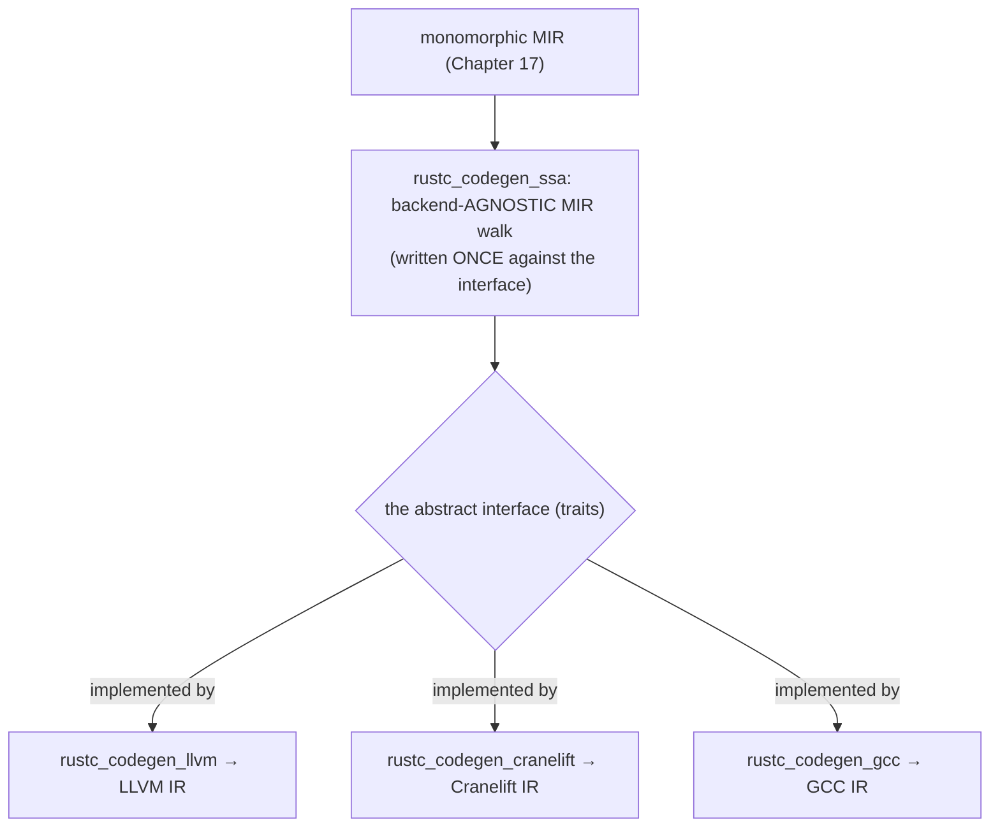
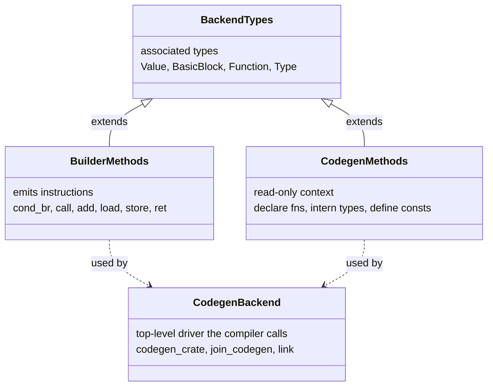
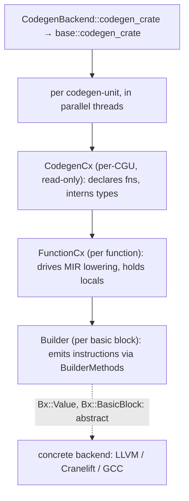
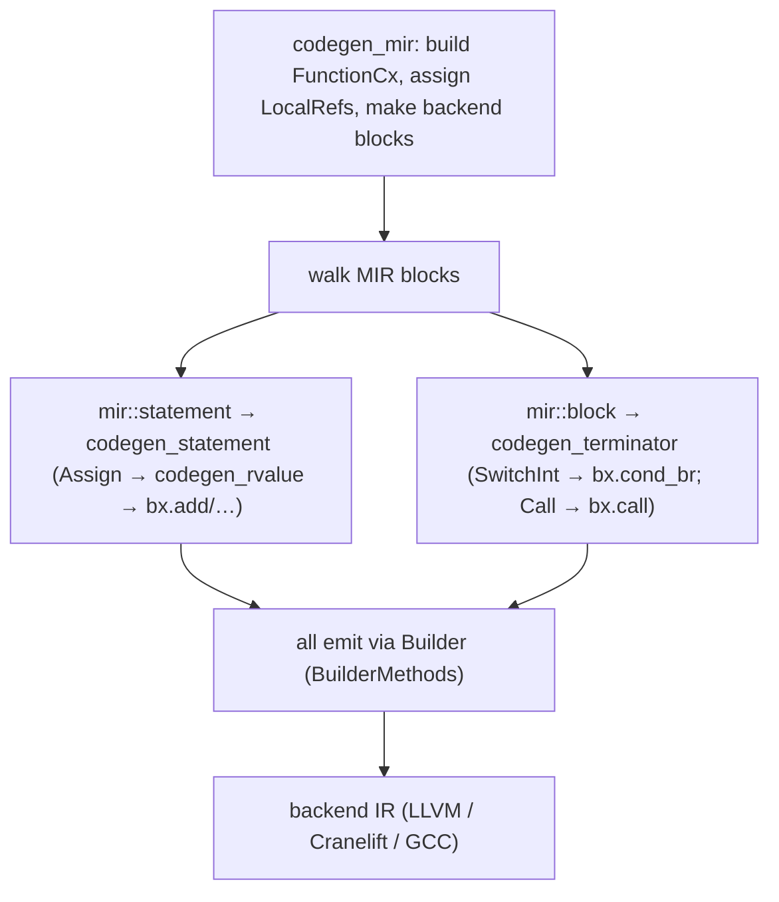
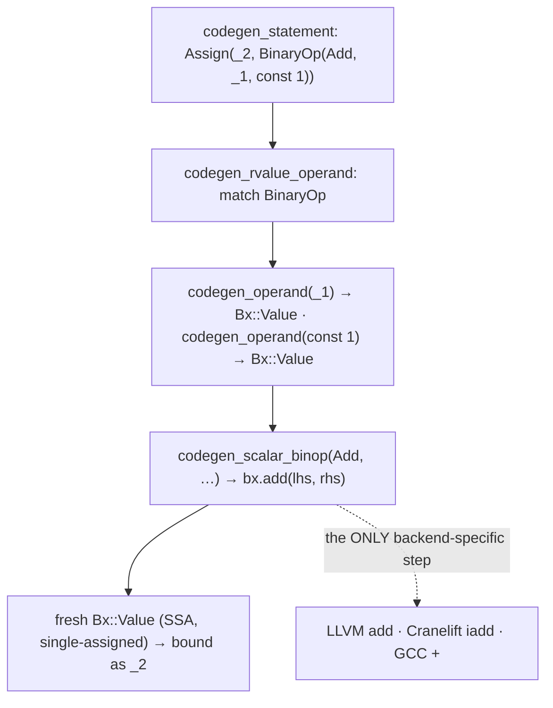
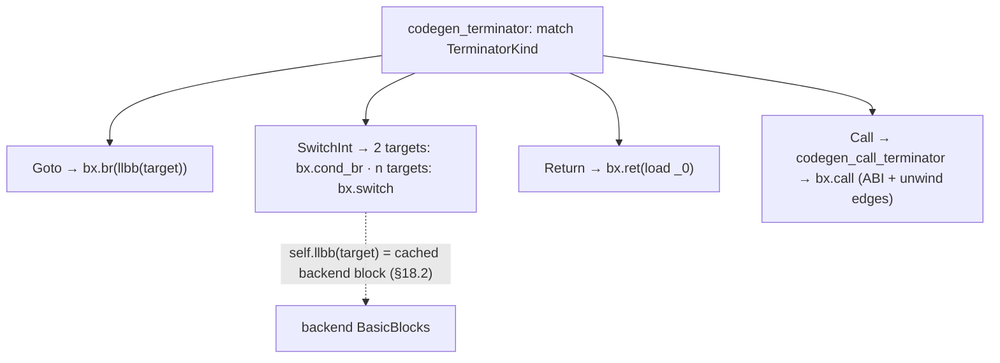
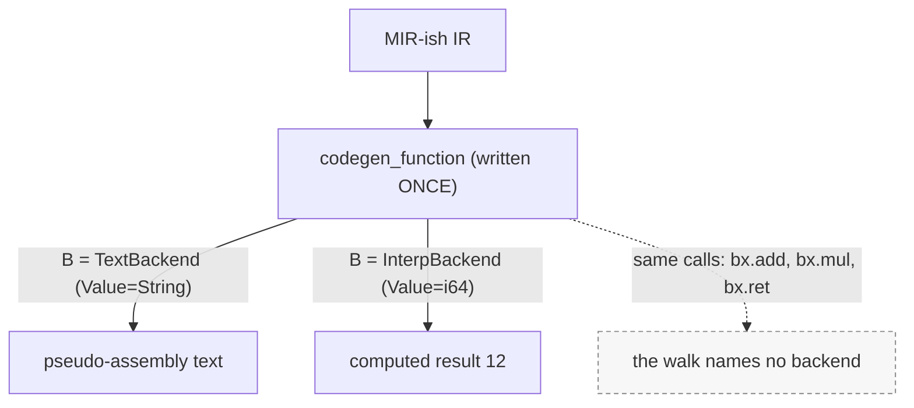

```admonish abstract title="What you'll learn"
- Why `rustc` defines codegen against an abstract interface in `rustc_codegen_ssa` so LLVM, Cranelift, and GCC can all serve as the final stage, and how this is the same dependency-inversion pattern as `PatCx` and `SolverDelegate`.
- The context-versus-builder split (`CodegenCx` per [codegen unit](../glossary.md#cgu), `Builder` per basic block) and how `BackendTypes`'s associated types (`Value`, `BasicBlock`, `Function`, `Type`) keep the [MIR](../glossary.md#mir) walk truly backend-agnostic via [monomorphization](../glossary.md#monomorphization) rather than dynamic dispatch.
- How `codegen_crate` parallelizes per CGU, how `FunctionCx` (17 fields, generic over `Bx: BuilderMethods`) drives one function's lowering, and how `LocalRef` chooses between a memory [`Place`](../glossary.md#place) (alloca) and an SSA `Operand` for each MIR local.
- How `codegen_statement`, `codegen_rvalue_operand`, and `codegen_terminator` in `rustc_codegen_ssa::mir` lower a MIR `Assign` into `bx.add` and a `SwitchInt` into `bx.cond_br` or `bx.switch` without ever naming a backend.
- Why codegen re-checks nothing, so an upstream bug surfaces here as a miscompile or an ICE, and why `Call` (with its ABI and unwinding obligations) is the genuinely complex terminator.
- How to build a tiny one-frontend-many-backends layer in pure Rust: a `BuilderCx` plus `Builder` trait pair, a generic `codegen_function`, and two interchangeable backends (text emitter and interpreter) driven by the same walk.
```

## 18.1 The Codegen Abstraction: One Frontend, Many Backends

### Decoupling codegen from any one backend

`rustc` targets several instruction emitters (LLVM for optimized code, Cranelift for fast debug builds, GCC for broader architectures), so the code that turns monomorphic MIR (Chapter 17) into a backend's IR is written **once, against an abstract interface**, and any number of concrete backends, LLVM, Cranelift, GCC, implement that interface. One frontend, many backends. This section is the *why* and the *shape*; §18.2 to §18.4 are the mechanism.

### The problem: one lowering, several targets

By the end of monomorphization we have a finite set of concrete MIR bodies, each saying exactly what to compute. Turning a MIR `Body` into machine code is a big, intricate walk: for each basic block, emit the backend's notion of a block; for each `Statement::Assign`, evaluate the rvalue
and emit the corresponding instructions; for each `Terminator`, emit a branch, a call, a return. This logic, *how MIR maps onto generic instructions*, is the same no matter what eventually consumes it. What differs is only the *vocabulary*: LLVM calls an addition `LLVMBuildAdd`, Cranelift calls it `iadd`, GCC has its own. If you write the MIR-walking logic directly against LLVM's API, you cannot reuse a line of it for Cranelift; you would write the whole intricate walk again.

The classic fix is an **interface boundary**: define an abstract notion of "a thing that can build instructions," write the MIR walk against *that*, and let each backend supply a concrete implementation. The MIR walk never names LLVM; it names the interface. This is **dependency inversion**: the high-level codegen logic depends on an abstraction, and the low-level backends depend on that same abstraction by implementing it, rather than the logic depending on any one backend.

### A pattern this book has seen before

This is not a new idea in `rustc`; it is the *same* decoupling pattern recurring at every layer where the compiler wants to swap an implementation. The pattern-analysis engine (§13.2) is generic over a `PatCx` so it can run inside or outside the compiler. The next-generation [trait solver](../glossary.md#trait-solver) (§12.2) sits behind a `SolverDelegate` so the solver logic is independent of the compiler's specifics. Codegen applies the identical move: the verified `rustc_codegen_ssa` crate holds the **backend-agnostic** codegen code, and it "provides an abstract interface for all backends to implement, namely LLVM, Cranelift, and GCC." The backend-specific code lives in separate crates, `rustc_codegen_llvm`, `rustc_codegen_cranelift`, `rustc_codegen_gcc`, each implementing the interface. The verified split is exact: "`rustc_codegen_ssa` contains backend-agnostic code, while the `rustc_codegen_llvm` crate contains code specific to LLVM codegen."




### The two structures: context and builder

The interface is, per the verified docs, "designed around two backend-specific data structures, the **codegen context** and the **builder**." The division is clean and worth internalizing:

- The **codegen context** (`CodegenCx`) is "read-only after its creation and during the actual codegen." It holds the per-codegen-unit state: declared functions, type mappings, constants, the module being built. One context compiles one codegen unit (§17.2), which may hold many functions.
- The **builder** (`Builder`) "stores the information about the function during codegen and is used to produce the instructions of the backend IR." A builder is positioned at a basic block and emits instructions into it. The verified note: the context compiles a codegen unit; the builder is created to compile *one basic block*.

The split mirrors how backends like LLVM actually work: a module-level context you populate with declarations, and a positioned instruction builder you push operations through. By matching that shape, the abstraction maps cheaply onto each backend.

### The associated types: the backend's vocabulary

The crucial trick that makes the MIR walk truly backend-independent is **associated types**. The verified `BackendTypes` trait declares the handle types each backend names its own way: `Value` (a computed value, an `&Value` reference in LLVM), `BasicBlock`, `Function`, `Type`, and so on. The MIR-walking code never says "an LLVM value"; it says `Self::Value`, *the backend's value type, whatever that is*. When the code holds the result of an addition, its static type is `B::Value` for the current backend `B`; LLVM fills that in with its value reference, Cranelift with its own. The generic code manipulates opaque handles whose concrete types only the backend knows, so the same source compiles correctly against any backend's representation.

### The trait hierarchy

On top of `BackendTypes`, the interface is a family of traits, each covering one capability. The two pillars:

- `BuilderMethods`, the big one (over a hundred methods): every instruction the MIR walk needs to emit. `append_block` (make a basic block), `cond_br` (conditional branch, the verified signature takes a condition `Value` and two target `BasicBlock`s), `call`, arithmetic, loads, stores, returns. To implement a backend, you implement these against your IR. The MIR walk calls `bx.cond_br(cond, then, else)` and the backend turns it into its branch instruction.
- `CodegenMethods` / the `CodegenCx` traits, the read-only context capabilities: declaring functions, interning types, defining constants.

And driving the whole thing, the verified `CodegenBackend` trait is the top-level entry point a backend implements: `codegen_crate(tcx)` (generate code for the whole crate), `join_codegen` (collect the results), `link` (produce the final binary). This is what the compiler driver calls; everything below it is the abstraction at work. (The verified `ExtraBackendMethods` covers high-level codegen-driving helpers.)




```admonish tip title="Pro-Tip, associated types, not trait objects, drive the abstraction"
A natural way to write "code generic over a backend" would be dynamic dispatch, a `dyn Builder` whose methods are virtual calls. `rustc` does *not* do that for the hot codegen path; it uses *generics with associated types* (`B: BuilderMethods` with `B::Value`), which monomorphize (Chapter 17) into direct, inlinable calls to the specific backend's methods. The backend-agnostic MIR walk, instantiated for LLVM, compiles to the code you would write calling LLVM directly. Monomorphization erases the indirection: the trait-based organization is a source-level device the type system resolves before any code is generated. When you see `Self::Value` threaded through hundreds of methods, that is not runtime polymorphism; it is a statically-resolved placeholder the backend fills in.
```

### What backends target: SSA form

The crate is named `rustc_codegen_ssa` for a reason. The backends it targets, [LLVM IR](../glossary.md#llvm-ir) especially, are in **Static Single Assignment** form: an IR discipline where every value is assigned *exactly once*, and a "variable" reassigned in the source becomes a series of distinct SSA values. SSA makes optimization dramatically easier (every use of a value points to its single definition, so data flow is explicit), which is why essentially every modern optimizing backend uses it. MIR is *not* SSA: its places (`_1`, `_2`) are mutable locations assigned repeatedly. So part of what codegen does, and part of why the abstraction is shaped as it is, is bridging MIR's place-based form to the backend's SSA value-based form: MIR locals become stack slots or SSA values, and the builder's value-producing methods (`add` returns a *new* `Value`) reflect the single-assignment target. The "ssa" in the crate name marks the form on the other side of the boundary.

```admonish warning title="Warning, backend is overloaded; here it means codegen backend, not the whole back end"
The word "backend" is used two ways and confusing them derails understanding. The compiler's *back end* (Part 3 of this book) is everything after the middle end: monomorphization, codegen, linking. A *codegen backend* is specifically one of the pluggable instruction-emitters: LLVM, Cranelift, or GCC. When the dev-guide and this chapter say "backend," they almost always mean the *codegen* backend, the thing behind the `CodegenBackend` trait. So "Rust supports multiple backends" does *not* mean multiple back ends (there is one back-end pipeline); it means the *last stage* of that one pipeline can be served by different codegen libraries. Keep the two senses separate: one back-end *pipeline*, several interchangeable *codegen backends* plugged into its final stage.
```

### The three backends, and why more than one

Why support three? Each verified backend trades differently:

- **LLVM,** the default: a mature optimizing backend covering a wide range of targets, at the cost of compile time (LLVM optimization is much of a release build's duration).
- **Cranelift** (`rustc_codegen_cranelift`), designed for *fast compilation* in debug mode: it optimizes far less than LLVM but generates code much faster, so the edit-compile-run loop is quicker. It is the verified counterpoint to LLVM's "slow but optimal."
- **GCC** (`rustc_codegen_gcc`), uses GCC's backend, valued for the *architectures* GCC supports that LLVM does not, broadening where Rust can run.

The abstraction is what makes this affordable: because the MIR-to-IR walk is written once against the interface, adding Cranelift or GCC did not mean rewriting codegen: it meant implementing `BuilderMethods` and friends for a new IR. The cost of a new backend is the cost of the interface, not the cost of all of codegen.

### Where this leaves us

`rustc` does not hard-code its backend. The intricate logic that walks monomorphic MIR and emits instructions is written **once, in `rustc_codegen_ssa`, against an abstract interface**, the **dependency-inversion / interface** pattern this book has seen behind `PatCx` (§13.2) and `SolverDelegate` (§12.2). The interface is built around two structures, the read-only `CodegenCx` (per-codegen-unit state) and the per-block `Builder` (emits instructions), and made truly backend-independent by `BackendTypes` associated types (`Value`, `BasicBlock`, `Function`, `Type`, the backend's own vocabulary, named abstractly as `Self::Value`). A trait family, `BuilderMethods` (over a hundred instruction-emitting methods like `cond_br` and `call`), the `CodegenCx` traits, and the top-level `CodegenBackend` driver (`codegen_crate`/`join_codegen`/`link`), defines what a backend must provide; **associated-type generics** keep it zero-cost (monomorphized to direct calls). Backends target **SSA** form, so codegen bridges MIR's mutable places to single-assignment values. Three backends, **LLVM** (optimal, slow), **Cranelift** (fast debug builds), **GCC** (broad architecture support), implement the interface, each cheap to add precisely because the walk is written once.

§18.2 takes the architecture deep-dive: `CodegenCx` and `Builder` in detail, the `BackendTypes`/`BuilderMethods`/`CodegenMethods` trait hierarchy, the `FunctionCx` that drives per-function MIR lowering, and how `codegen_crate` parallelizes across codegen units. Then §18.3 reads the real backend-agnostic code lowering a MIR statement and terminator through `BuilderMethods`, and §18.4 has you build a tiny backend-agnostic codegen layer with two interchangeable "backends."

## 18.2 The Architecture: `CodegenCx`, `Builder`, and the Backend Traits

### From the interface to the machine that drives it

§18.1 named the interface; the machinery sits on top of it. `rustc` walks a monomorphic MIR `Body` and emits a backend's IR through that interface, all without ever naming a specific backend. The chain is: `codegen_crate` launches the work, a `CodegenCx` holds per-codegen-unit state, a `FunctionCx` drives one function's MIR lowering, and a `Builder` emits the instructions of one basic block. Every one of these is generic over the backend.

### `codegen_crate`: launching the work, in parallel

The top of the back end is the verified `rustc_codegen_ssa::base::codegen_crate`, the entry the `CodegenBackend::codegen_crate` (§18.1) hands off to. It takes the codegen units the partitioner produced (§17.2) and codegens each. Crucially, this happens *asynchronously*: the verified dev-guide notes "codegen happens asynchronously in another thread for performance", different codegen units are lowered and optimized concurrently, which is the practical payoff of CGU partitioning (§17.2) and a major reason Rust builds parallelize at all. Each CGU becomes a backend module compiled largely independently. `codegen_crate` is the orchestrator; the per-CGU and per-function work is where the abstraction does its job.

### `CodegenCx` and `Builder`: the two backend structures

§18.1 introduced the division; here it is concretely. For LLVM the verified structures are:

```rust
// rustc_codegen_llvm/src/context.rs  (faithful; FullCx fields abridged)
pub(crate) type CodegenCx<'ll, 'tcx> = GenericCx<'ll, FullCx<'ll, 'tcx>>;
pub(crate) struct FullCx<'ll, 'tcx> {
    pub tcx: TyCtxt<'tcx>,
    pub scx: SimpleCx<'ll>, // holds llmod + llcx + isize_ty
    pub codegen_unit: &'tcx CodegenUnit<'tcx>,
    pub instances: RefCell<FxHashMap<Instance<'tcx>, &'ll Value>>, // declared fns
    pub type_lowering: RefCell<FxHashMap<(Ty<'tcx>, Option<VariantIdx>), &'ll Type>>, // type cache
    pub const_globals: RefCell<FxHashMap<&'ll Value, &'ll Value>>,    // const cache
    // … ~20 more (vtables, intrinsics, coverage, debuginfo, EH, ObjC, offload, …)
}

// rustc_codegen_llvm/src/builder.rs  (faithful)
pub(crate) type Builder<'a, 'll, 'tcx> = GenericBuilder<'a, 'll, FullCx<'ll, 'tcx>>;
pub(crate) struct GenericBuilder<'a, 'll, CX: Borrow<SCx<'ll>>> {
    pub llbuilder: &'ll mut llvm::Builder<'ll>,  // LLVM IRBuilder, positioned at a block
    pub cx: &'a GenericCx<'ll, CX>, // = CodegenCx<'ll,'tcx> when CX = FullCx<'ll,'tcx>
}
```

The verified roles: `CodegenCx` "is used to compile one codegen-unit that can contain multiple functions" and is read-only during codegen; `Builder` "is created to compile one basic block" and holds a reference back to its `cx`. The `'ll` lifetime threads through both: it is the lifetime of the LLVM objects (`&'ll Value`, the verified parametrization). The backend-agnostic code never sees `'ll` or `CodegenCx<'ll, 'tcx>`; it sees `Bx::CodegenCx` and `Bx`, the abstract forms. The LLVM crate's job is to make its concrete `Builder` *implement* `BuilderMethods` so that the abstract code, instantiated for LLVM, becomes calls on this struct.

### The trait split, precisely

The interface is layered exactly along the context/builder division:

- `BackendTypes`, the associated types (§18.1): `Value`, `BasicBlock`, `Function`, `Type`, `Funclet`, debug-info handles. The shared vocabulary.
- `CodegenMethods` (the trait alias bundles `TypeCodegenMethods`, `ConstCodegenMethods`, `StaticCodegenMethods`, `PreDefineCodegenMethods`, `DebugInfoCodegenMethods`, `AsmCodegenMethods`; `MiscCodegenMethods` is a sibling trait also implemented on `CodegenCx`): operations on the read-only context: intern a type, define a constant, declare a function. These are what `CodegenCx` provides.
- `BuilderMethods`, the instruction-emitting methods (over a hundred), what `Builder` provides: `build`/`append_block` to make blocks, `cond_br`/`br`/`ret`/`switch` for control flow, `add`/`mul`/`load`/`store`/`call` for computation. The verified bound shows `BuilderMethods` requires `Deref<Target = Self::CodegenCx>`, a builder can reach its context, and pulls in the ABI, intrinsic, asm, and debug-info builder sub-traits.
- `CodegenBackend` / `ExtraBackendMethods`, the top-level driver (§18.1).

A backend is "implement these traits for your IR." The MIR walk is "call these traits, never the backend."




### `FunctionCx`: the master context for one function

The heart of the backend-agnostic MIR walk is the verified `FunctionCx`, "master context for codegenning from MIR." It is generic over `Bx: BuilderMethods`, and its fields (verified) are everything needed to lower one function:

```rust
// rustc_codegen_ssa/src/mir/mod.rs  (faithful; 7 of 17 fields shown)
pub struct FunctionCx<'a, 'tcx, Bx: BuilderMethods<'a, 'tcx>> {
    instance: Instance<'tcx>, // WHICH monomorphic instance (Ch.17)
    mir: &'tcx mir::Body<'tcx>, // its MIR body
    // the backend function being built
    llfn: Bx::Function,
    cx: &'a Bx::CodegenCx, // the per-CGU context
    fn_abi: &'tcx FnAbi<'tcx, Ty<'tcx>>, // calling convention / ABI
    // MIR block → backend block (lazily filled in)
    cached_llbbs: IndexVec<mir::BasicBlock, CachedLlbb<Bx::BasicBlock>>,
    locals: locals::Locals<'tcx, Bx::Value>, // where each MIR local lives
    // … debug context, cleanup/landing pads for unwinding, caller_location, … …
}
```

Note the types: `llfn: Bx::Function`, `locals: ... Bx::Value`, `cached_llbbs: ... Bx::BasicBlock`. Every backend-specific thing is `Bx::Something`: `FunctionCx` is *entirely* generic. The same `FunctionCx` code, monomorphized for LLVM's `Builder`, drives LLVM; monomorphized for Cranelift's, drives Cranelift. It carries the [`Instance`](../glossary.md#instance) (so it can monomorphize-on-the-fly, §17.2) and a `cached_llbbs` mapping each MIR `BasicBlock` to the backend block created for it.

### `LocalRef`: a place, or an SSA value

A subtle and important piece is how MIR locals map to the backend. A MIR local (`_1`) is a mutable memory location; an SSA backend wants values assigned once (§18.1). The verified `LocalRef` captures the two ways a local can live:

```rust
// rustc_codegen_ssa/src/mir/mod.rs  (faithful; doc comments omitted)
enum LocalRef<'tcx, V> {
    Place(PlaceRef<'tcx, V>), // lives in memory: an alloca (stack slot)
    UnsizedPlace(PlaceRef<'tcx, V>),
    Operand(OperandRef<'tcx, V>), // lives as a direct SSA value: no alloca!
    PendingOperand,
}
```

The verified optimization: a local "is usually a `PlaceRef` representing an alloca, but not always: sometimes we can skip the alloca and just store the value directly using an `OperandRef`, which makes for tighter LLVM IR", the condition being that the local's type is "immediate" (a scalar that fits in a register). So a `u64` local can be a pure SSA `Operand` (no memory traffic), while a large struct local gets a stack `Place`. This decision, made per local before block codegen, is the codegen layer bridging MIR's uniform "everything is a place" model to SSA's "values in registers where possible." `PlaceRef` and `OperandRef` wrap the backend's `V` (its `Value`), carrying layout info alongside.

```admonish tip title="Pro-Tip, the Operand-vs-Place choice in LocalRef"
For locals whose type fits in a register, `LocalRef::Operand` keeps the value in SSA form so no stack slot is allocated; `x` becomes a single SSA value flowing directly into its next use without touching memory. Only locals that need an address (large types, address-taken, live across complex control flow) get an `alloca`. The codegen layer makes this triage per local before block codegen, so idiomatic Rust with many small `let` bindings keeps them in registers: places only when necessary, values everywhere else.
```

### `codegen_mir`: the driver and its module split

The function that ties it together is the verified `codegen_mir` (in `rustc_codegen_ssa::mir`). It builds a `FunctionCx`, decides each local's `LocalRef` (place or operand), creates a backend basic block for each MIR block, and then walks the blocks in order, emitting code. The verified module split mirrors MIR's structure: `mir::block` translates basic blocks and their **terminators** (the verified note: "the most complicated and most interesting thing is generating code for function calls, including unwinding handling"); `mir::statement` translates **statements**; `mir::rvalue` translates **rvalues**; `mir::operand` and `mir::place` translate **operands and places**. Each is an `impl` block on `FunctionCx` with methods like `codegen_block`, `codegen_statement`, `codegen_rvalue`, `codegen_place`, all generic over `Bx`, all emitting through the builder. Monomorphization happens *as they go* (the verified `FunctionCx::monomorphize`, the §17.3 instantiate-and-normalize), so the walk always sees concrete types.




```admonish warning title="Warning, codegen re-checks nothing; an upstream bug produces a miscompile or an ICE, not a nice error"
By the time `codegen_mir` runs, every check is done: types proven (Ch.11), traits resolved (Ch.12), patterns exhaustive (Ch.13), borrows sound (Ch.15), constants evaluated (Ch.16). Codegen *assumes* all of this and simply translates; it has no error-reporting path for "this MIR is wrong," because correct MIR is a precondition. The consequence: if a bug in an *earlier* phase produces malformed MIR, codegen does not catch it gracefully: it either emits subtly wrong machine code (a miscompilation, the worst kind of compiler bug) or hits an `assert`/`bug!` and produces an *internal compiler error* (ICE) deep in the backend with an inscrutable backtrace. This is why ICEs in `rustc_codegen_*` are taken so seriously and why the earlier phases are so defensive: codegen is the point of no return for correctness. When you see a codegen-stage ICE, the bug is almost never *in* codegen: it is upstream, in whatever produced the MIR that violated codegen's assumptions. Codegen is the messenger.
```

### How this builds, and what is next

The machine driving the abstraction is now visible. `codegen_crate` launches per-codegen-unit work across threads. Each unit gets a read-only `CodegenCx` (declares functions, interns types: the `CodegenMethods` traits). For each function, a `FunctionCx` (entirely generic over `Bx: BuilderMethods`, holding the `Instance`, the MIR `Body`, the backend `llfn`, and a `LocalRef` per local (a `PlaceRef` alloca or, for immediates, a direct SSA `OperandRef`, the tighter-IR optimization)) drives the walk. `codegen_mir` assigns locals, creates a backend block per MIR block, and walks blocks via the verified module split (`block`/`statement`/`rvalue`/`operand`/`place`), every method emitting through a `Builder` that implements `BuilderMethods`, monomorphizing types on the fly. Nothing names a backend; `Bx::Value`/`Bx::BasicBlock` are filled in by LLVM, Cranelift, or GCC. And codegen *re-checks nothing*: it assumes correct MIR, so upstream bugs surface here as miscompiles or ICEs.

§18.3 reads the real backend-agnostic code: `codegen_statement` lowering an `Assign` through `codegen_rvalue` into `bx.add`, and `codegen_terminator` lowering a `SwitchInt` into `bx.cond_br` / a `Call` into `bx.call`, the abstract MIR walk in actual source. Then §18.4 has you build a tiny backend-agnostic codegen layer: a `Builder`-style trait, a MIR-ish walk written once against it, and *two* interchangeable backends (say, a text-emitter and an interpreter) proving the same walk drives both.

## 18.3 Reading the Source: Lowering a Statement and a Terminator

### One walk, emitting through an abstraction

The backend-agnostic MIR walk emits code through the methods on `FunctionCx` (§18.2) that turn a `Statement` and a `Terminator` into builder calls. The thing to watch is that *not one line names a backend*: every instruction is emitted by calling a `BuilderMethods` method on `bx: Bx`, producing `Bx::Value` handles. The same source, monomorphized for LLVM's `Builder`, becomes LLVM IR; for Cranelift's, Cranelift IR. We will lower the assignment `_2 = _1 + 1` and an `if`-style `SwitchInt` fork. The source is `rustc_codegen_ssa::mir`'s `statement`, `rvalue`, and `block` modules.

### Lowering a statement

`codegen_statement` (in `mir/statement.rs`) dispatches on `StatementKind` (§14.2). The case that matters is `Assign`:

```rust
// rustc_codegen_ssa/src/mir/statement.rs  (faithful; uses the `box_patterns` feature internally)
// The Assign arm; see mir/statement.rs for the rest.
mir::StatementKind::Assign(box (ref place, ref rvalue)) => {
    if let Some(index) = place.as_local() {
        match self.locals[index] {
            LocalRef::Place(cg_dest) => self.codegen_rvalue(bx, cg_dest, rvalue),
            LocalRef::PendingOperand => {
                // ① produce an SSA value
                let op = self.codegen_rvalue_operand(bx, rvalue);
                // ② bind the local to it (and emit its debuginfo)
                self.overwrite_local(index, LocalRef::Operand(op));
                self.debug_introduce_local(bx, index);
            }
            LocalRef::UnsizedPlace(_) => span_bug!(/* dynamic alloca not supported */),
            LocalRef::Operand(op) => {
                // already assigned: only valid for ZSTs (re-codegen for side-effects).
                if !op.layout.is_zst() { span_bug!(/* operand already assigned */); }
                let _ = self.codegen_rvalue_operand(bx, rvalue);
            }
        }
    } else {
        let cg_dest = self.codegen_place(bx, place.as_ref()); // a memory place
        // store the rvalue into it
        self.codegen_rvalue(bx, cg_dest, rvalue);
    }
}
// StorageLive/StorageDead mark stack-slot liveness; Nop and FakeRead (and five
// other "no-codegen" kinds: Retag, AscribeUserType, ConstEvalCounter, PlaceMention,
// BackwardIncompatibleDropHint) codegen to nothing. FakeRead was borrowck-only (§14.2).
```

This is the §18.2 `LocalRef` distinction *in action*: if `_2` is an `Operand` local, the rvalue is codegen'd straight to an SSA value and the local *becomes* that value: no alloca, no store. If `_2` is a `Place` local, the rvalue is stored into its memory. `FakeRead` and `Nop` codegen to nothing: the borrowck scaffolding of §14.2 has no machine-code existence.

### Lowering the rvalue: `_1 + 1`

`_2 = _1 + 1` is an `Assign` whose rvalue is `BinaryOp(Add, _1, const 1)`. The verified `codegen_rvalue_operand` (in `mir/rvalue.rs`) handles it:

```rust
// rustc_codegen_ssa/src/mir/rvalue.rs  (faithful; wide-ptr and checked-binop arms elided)
pub(crate) fn codegen_rvalue_operand(
    &mut self,
    bx: &mut Bx,
    rvalue: &mir::Rvalue<'tcx>,
) -> OperandRef<'tcx, Bx::Value> {
    match *rvalue {
        mir::Rvalue::BinaryOp(op, box (ref lhs, ref rhs)) => {
            let lhs = self.codegen_operand(bx, lhs);   // _1 → an OperandRef (a Bx::Value)
            let rhs = self.codegen_operand(bx, rhs);   // const 1 → an OperandRef
            // The Immediate-Immediate case; a separate arm dispatches to
            // codegen_wide_ptr_binop when both operands are Pair.
            let llresult = self.codegen_scalar_binop(
                bx, op, lhs.immediate(), rhs.immediate(),
                lhs.layout.ty, rhs.layout.ty,
            );
            OperandRef {
                val: OperandValue::Immediate(llresult),
                layout: bx.cx().layout_of(op.ty(bx.tcx(), lhs.layout.ty, rhs.layout.ty)),
                move_annotation: None,
            }
        }
        mir::Rvalue::Use(ref operand) => self.codegen_operand(bx, operand),
        // … Ref, Reborrow, RawPtr, Cast, UnaryOp, Discriminant, Aggregate, Repeat, … …
    }
}
```

And `codegen_scalar_binop` is where the abstraction meets the backend: it matches the MIR `BinOp` and calls the corresponding *builder method*:

```rust
fn codegen_scalar_binop(&mut self, bx: &mut Bx, op: mir::BinOp, lhs: Bx::Value, rhs: Bx::Value, lhs_ty: Ty<'tcx>, rhs_ty: Ty<'tcx>)
    -> Bx::Value
{
    match op {
        // ← abstract: LLVM emits `add`, Cranelift `iadd`, GCC its own
        mir::BinOp::Add => bx.add(lhs, rhs),
        mir::BinOp::Sub => bx.sub(lhs, rhs),
        mir::BinOp::Mul => bx.mul(lhs, rhs),
        mir::BinOp::Eq  => bx.icmp(IntPredicate::IntEQ, lhs, rhs),
        // … the rest … …
    }
}
```

`bx.add(lhs, rhs)` returns a `Bx::Value`, a fresh SSA value (the `+`'s result), single-assigned (§18.1). The code says *add these two values*; **which instruction that becomes is entirely the backend's**. `_1` and `1` were turned into `Bx::Value`s by `codegen_operand` (reading the operand local or materializing the constant), `bx.add` combines them, and the result is bound as `_2`'s operand. The whole of `_2 = _1 + 1` is three abstract builder interactions and not a single mention of LLVM.




### Lowering a terminator: the `SwitchInt` fork

`codegen_terminator` (in `mir/block.rs`) dispatches on `TerminatorKind` (§14.2). The control-flow cases map straight onto builder methods:

```rust
// rustc_codegen_ssa/src/mir/block.rs  (faithful; const-fold + branch-weight + bool fast path elided)
// codegen_terminator delegates SwitchInt to codegen_switchint_terminator:
mir::TerminatorKind::SwitchInt { ref discr, ref targets } => {
    self.codegen_switchint_terminator(helper, bx, discr, targets);
    MergingSucc::False
}

// codegen_switchint_terminator (simplified shape):
fn codegen_switchint_terminator(
    &mut self,
    helper: TerminatorCodegenHelper<'tcx>,
    bx: &mut Bx,
    discr: &mir::Operand<'tcx>,
    targets: &SwitchTargets,
) {
    let discr = self.codegen_operand(bx, discr); // ① switch value → Bx::Value
    let discr_value = discr.immediate();
    let switch_ty = discr.layout.ty;
    // (Elided: constant-discriminant fast path that does a direct `br`,
    //  and the cold-block branch-weight variants `cond_br_with_expect` /
    //  `switch_with_weights` chosen when block coldness differs.)

    let mut target_iter = targets.iter();
    if target_iter.len() == 1 {
        // two-way (the `if` case, §14.3): cmp then conditional branch
        let (test_value, target) = target_iter.next().unwrap();
        let lltarget    = helper.llbb_with_cleanup(self, target);
        let llotherwise = helper.llbb_with_cleanup(self, targets.otherwise());
        let cond = if switch_ty == bx.tcx().types.bool {
            discr_value // already an i1
        } else {
            let llty  = bx.immediate_backend_type(bx.layout_of(switch_ty));
            let llval = bx.const_uint_big(llty, test_value);
            bx.icmp(IntPredicate::IntEQ, discr_value, llval)
        };
        bx.cond_br(cond, lltarget, llotherwise); // ② abstract conditional branch
        // (real uses bx.cond_br_with_expect when branch weights differ; its default impl calls cond_br)
    } else {
        // n-way (a `match`): a switch
        bx.switch(
            discr_value,
            helper.llbb_with_cleanup(self, targets.otherwise()),
            target_iter.map(|(v, t)| (v, helper.llbb_with_cleanup(self, t))),
        );
    }
}
// Other terminators in codegen_terminator, each dispatched to its own helper:
// Goto → helper.funclet_br(...) (→ bx.br(target))
// Return → self.codegen_return_terminator(bx) (→ bx.ret(...) or ret_void, ABI-dependent)
// Call → self.codegen_call_terminator(...)  (the most complex case, §18.2)
// Drop / Assert / Unreachable / UnwindResume / UnwindTerminate / InlineAsm / TailCall:
//   each routes through its own codegen_*_terminator helper.
```

Read the §14.3 lowering *coming back the other way*. There, an `if` *became* a `SwitchInt` with two targets and a join block; here, that `SwitchInt` *becomes* `bx.cond_br(cond, then_block, else_block)`, a single abstract conditional-branch call, where `self.llbb(target)` looks up the backend `BasicBlock` cached for that MIR block (the §18.2 `cached_llbbs`). A `match`'s many-way `SwitchInt` becomes `bx.switch`. `Return` loads `_0` and calls `bx.ret`. `Call`, the verified "most complicated and most interesting" case, goes through `codegen_call_terminator` to emit `bx.call` with the right ABI and unwinding edges. Each terminator variant is a small dispatch to one or two builder methods; the edges (`target`s) become looked-up backend blocks.




```admonish tip title="Pro-Tip, the MIR to builder mapping is so direct that reading codegen is the fastest way to learn a backend's IR"
Notice how nearly *mechanical* the lowering is: `Goto` → `br`, two-way `SwitchInt` → `cond_br`, `BinOp::Add` → `add`, `Return` → `ret`. MIR was designed (Chapter 14) to be close to the abstract machine a backend wants, so codegen is mostly a one-to-one or one-to-few translation, not a creative compilation. The practical upshot: if you want to understand what LLVM IR (or Cranelift's) actually looks like for a Rust construct, read the corresponding `codegen_*` method: it tells you exactly which backend instructions a given MIR shape produces. And conversely, `--emit=llvm-ir` on a small function, read alongside `--emit=mir`, shows this mapping concretely: each MIR statement and terminator becomes the handful of IR instructions these methods emit. The directness is not an accident; it is why MIR exists between [THIR](../glossary.md#thir) and codegen.
```

```admonish warning title="Warning, Call carries ABI and unwinding obligations the simple cases don't, and getting them wrong is silent"
The arithmetic and branch cases above are clean one-liners, which can give the impression all of codegen is that simple. `Call` is where the real complexity lives (the verified "most complicated" terminator), because a function call must honor the **ABI**, how arguments are passed (in registers? by pointer? split across both?), how the return value comes back, what the calling convention demands, *and* the unwinding machinery: a call that might panic needs an edge to a landing pad so destructors run during stack unwinding. `codegen_call_terminator` handles all of this, and the `FunctionCx` fields for it (`funclets`, `landing_pads`, `cleanup_kinds`, §18.2) exist solely for the unwinding case. The lesson for anyone reading or modifying codegen: the simple statements lull you, but calls and unwinding are where ABI bugs hide, and an ABI mismatch does not produce a compile error: it produces a *miscompile* (wrong values passed, corrupted stack) that manifests as a crash far from its cause. Treat the `Call` path with the respect its complexity warrants.
```

### How this builds, and what is next

We have read the abstract walk emit code. `codegen_statement` dispatches `StatementKind`; an `Assign` either codegens its rvalue straight to an SSA `OperandRef` (for immediate locals, §18.2) or stores it into a `PlaceRef`, while `FakeRead`/`Nop` emit nothing. `codegen_rvalue_operand` lowers a `BinaryOp` by codegenning both operands to `Bx::Value`s and calling `codegen_scalar_binop`, which maps the MIR `BinOp` to an abstract builder method, `bx.add(lhs, rhs)` returning a fresh single-assigned `Bx::Value`. `codegen_terminator` dispatches `TerminatorKind`: `Goto` → `bx.br`, two-way `SwitchInt` → `bx.cond_br` (the §14.3 `if` fork, recovered), n-way → `bx.switch`, `Return` → `bx.ret`, and `Call` → `codegen_call_terminator` → `bx.call` with ABI and unwinding edges. Every emission is a generic `Bx` method producing `Bx::Value`/`Bx::BasicBlock` handles, *the* single source compiled, via monomorphization, into a driver for LLVM, Cranelift, or GCC. The mapping is nearly mechanical (so reading codegen teaches a backend's IR), and the genuine complexity concentrates in `Call`'s ABI and unwinding.

§18.4 turns this into a build. You will write a tiny backend-agnostic codegen layer: a `Builder`-style trait with associated `Value`/`Block` types and methods like `add`, `cond_br`, `ret`; a small MIR-ish walk written *once* against that trait; and **two interchangeable backends**, say, a text-emitter that prints pseudo-assembly and an interpreter that executes, proving that the same walk, monomorphized for each, drives both. You will reproduce, in code you wrote, the one-frontend-many-backends architecture you just read.

## 18.4 Hands-On Lab: Build a Backend-Agnostic Codegen Layer

### One walk, two backends

This lab builds the architecture of the whole chapter: a **codegen walk written once against an abstract builder interface**, plus *two* interchangeable backends that implement it. You will define a `Builder`-style trait (the `BuilderMethods` analogue, §18.2) with associated `Value` and `Block` types and methods like `add`, `cond_br`, and `ret`; write a single generic walk over a MIR-ish IR that never names a backend; and then implement **two** backends, a *text emitter* that prints pseudo-assembly and an *interpreter* that executes, and watch the *same* walk drive both. When `_2 = _1 + 1` becomes `%2 = add %1, 1` under one backend and the number `6` under the other, from one unchanged walk, you will have built one-frontend-many-backends in miniature.

`cargo new`, pure `std`.

### The abstract builder interface

The heart: a trait family with **associated types** (§18.2, the backend names its own `Value`/`Block`) and instruction-emitting methods. The §18.2 context/builder split lands here as a supertrait split: `BuilderCx` is the read-only context capability (constant materialization, the place type interning would go if we had it), and `Builder: BuilderCx` is the instruction-emitting capability that extends it. `const_int` does not require a builder positioned at a block, so it sits on the context side, exactly as rustc puts it on `ConstCodegenMethods` rather than `BuilderMethods`. The walk will be generic over any `B: Builder`:

```rust
// src/main.rs

/// Integer comparison predicate (the IntPredicate analogue, rustc_codegen_ssa::common).
#[derive(Copy, Clone)]
enum ICmp { Eq, Ne, Lt, Le, Gt, Ge }

/// The context-side capability (the ConstCodegenMethods / CodegenMethods analogue, §18.2):
/// associated types and operations that do NOT need a positioned builder.
trait BuilderCx {
    type Value: Copy; // the backend's notion of a computed value (Bx::Value)
    type Block: Copy; // the backend's notion of a basic block (Bx::BasicBlock)

    fn const_int(&mut self, n: i64) -> Self::Value;
}

/// The BuilderMethods analogue (§18.2): emit instructions, in the backend's vocabulary.
/// Extends BuilderCx, so `bx.const_int(...)` is reachable on any `B: Builder` too.
trait Builder: BuilderCx {
    fn arg(&mut self, idx: usize) -> Self::Value; // read an argument
    fn add(&mut self, a: Self::Value, b: Self::Value) -> Self::Value;
    fn mul(&mut self, a: Self::Value, b: Self::Value) -> Self::Value;
    fn icmp(&mut self, op: ICmp, a: Self::Value, b: Self::Value) -> Self::Value;
    fn cond_br(&mut self, cond: Self::Value, then_blk: Self::Block, else_blk: Self::Block);
    fn ret(&mut self, v: Self::Value);
    fn append_block(&mut self, name: &str) -> Self::Block;
    fn switch_to_block(&mut self, blk: Self::Block);
}
```

### A MIR-ish IR

A tiny IR mirroring §14.2: locals, operands, rvalues, statements, terminators, blocks:

```rust
type Local = usize;

#[derive(Clone)]
enum Operand { Local(Local), Const(i64), Arg(usize) }

#[derive(Clone)]
enum Rvalue { Use(Operand), Add(Operand, Operand), Mul(Operand, Operand), Eq(Operand, Operand) }

#[derive(Clone)]
enum Stmt { Assign(Local, Rvalue) }

#[derive(Clone)]
enum Term { Return(Operand), CondBr { cond: Operand, then_b: usize, else_b: usize } }

#[derive(Clone)]
struct BlockIR { stmts: Vec<Stmt>, term: Term }
struct FunctionIR { n_locals: usize, blocks: Vec<BlockIR> }
```

### The generic codegen walk: written ONCE

This is the `FunctionCx` analogue (§18.2/§18.3): it walks the IR and emits through `B: Builder`, holding a `Vec<Option<B::Value>>` for the locals (the `LocalRef` analogue). **It names no backend.**

*Real rustc uses an `IndexVec<mir::Local, LocalRef<...>>` (a `Vec` indexed by the typed `Local` newtype) wrapped in a `Locals` type that disallows direct `IndexMut`, forcing mutation through `FunctionCx::overwrite_local`; we use a plain `Vec<Option<B::Value>>` for brevity, with `None` standing in for `LocalRef::PendingOperand`.*

```rust
struct CodegenCx<'b, B: Builder> {
    bx: &'b mut B,
    // local → its current Value (LocalRef::Operand, §18.2)
    locals: Vec<Option<B::Value>>,
}

impl<'b, B: Builder> CodegenCx<'b, B> {
    fn codegen_operand(&mut self, op: &Operand) -> B::Value {
        match op {
            Operand::Const(n) => self.bx.const_int(*n),
            Operand::Arg(i) => self.bx.arg(*i),
            Operand::Local(l) => self.locals[*l].expect("local used before assigned"),
        }
    }

    // codegen_rvalue (§18.3): operands → a Value via the abstract builder methods
    fn codegen_rvalue(&mut self, rv: &Rvalue) -> B::Value {
        match rv {
            Rvalue::Use(o) => self.codegen_operand(o),
            Rvalue::Add(a, b) => { let a = self.codegen_operand(a); let b = self.codegen_operand(b); self.bx.add(a, b) }
            Rvalue::Mul(a, b) => { let a = self.codegen_operand(a); let b = self.codegen_operand(b); self.bx.mul(a, b) }
            Rvalue::Eq(a, b)  => { let a = self.codegen_operand(a); let b = self.codegen_operand(b); self.bx.icmp(ICmp::Eq, a, b) }
        }
    }

    // codegen_statement (§18.3): Assign → codegen rvalue, bind the local
    fn codegen_statement(&mut self, s: &Stmt) {
        let Stmt::Assign(local, rv) = s;
        let v = self.codegen_rvalue(rv);
        self.locals[*local] = Some(v); // LocalRef::Operand(Some(v))
    }

    // codegen_terminator (§18.3): dispatch on the terminator
    fn codegen_terminator(&mut self, t: &Term, blocks: &[B::Block]) {
        match t {
            Term::Return(o) => { let v = self.codegen_operand(o); self.bx.ret(v); }
            Term::CondBr { cond, then_b, else_b } => {
                let c = self.codegen_operand(cond);
                // edges → backend blocks (§18.3); Block: Copy lets us pass by value.
                self.bx.cond_br(c, blocks[*then_b], blocks[*else_b]);
            }
        }
    }
}

/// Drive a whole function: the codegen_mir analogue (§18.2). Generic over ANY backend.
fn codegen_function<B: Builder>(bx: &mut B, func: &FunctionIR) {
    // create a backend block per IR block (the cached_llbbs analogue, §18.2)
    let blocks: Vec<B::Block> = (0..func.blocks.len()).map(|i| bx.append_block(&format!("bb{i}"))).collect();
    let mut cx = CodegenCx { bx, locals: vec![None; func.n_locals] };
    // Real rustc walks blocks in reverse postorder via traversal::mono_reachable_reverse_postorder(mir, tcx, instance), skipping unreachable blocks and respecting dominance; index order works here because the lab has a single block.
    for (i, blk) in func.blocks.iter().enumerate() {
        cx.bx.switch_to_block(blocks[i]);
        for s in &blk.stmts { cx.codegen_statement(s); }
        cx.codegen_terminator(&blk.term, &blocks);
    }
}
```

`codegen_function` is the entire frontend half, and it is *complete* without any backend existing. That is the point of §18.1.

### Backend #1: a text emitter

`Value` is a register name (a `String`); each method appends a pseudo-assembly line:

```rust
// Reg is a small Copy handle (a register id); names are stored in a side-table.
// This mirrors LLVM's pattern: &'ll Value is Copy, the printed name lives on
// LLVM's side. Same trick for BlockId.
#[derive(Copy, Clone)]
struct Reg(usize);
#[derive(Copy, Clone)]
struct BlockId(usize);

struct TextBackend {
    next_reg: usize,
    reg_names: Vec<String>, // Reg(i) → its printed name (e.g. "%3" or "%arg0")
    block_names: Vec<String>, // BlockId(i) → its label
    lines: Vec<String>,
}
impl TextBackend {
    fn fresh(&mut self) -> Reg {
        let name = format!("%{}", self.next_reg);
        self.next_reg += 1;
        self.reg_names.push(name);
        Reg(self.reg_names.len() - 1)
    }
    fn name(&self, r: Reg) -> &str { &self.reg_names[r.0] }
    fn block_name(&self, b: BlockId) -> &str { &self.block_names[b.0] }
}

impl BuilderCx for TextBackend {
    type Value = Reg;
    type Block = BlockId;
    fn const_int(&mut self, n: i64) -> Reg {
        let r = self.fresh(); self.lines.push(format!("{} = const {n}", self.name(r))); r
    }
}

impl Builder for TextBackend {
    fn arg(&mut self, i: usize) -> Reg {
        self.reg_names.push(format!("%arg{i}"));
        Reg(self.reg_names.len() - 1)
    }
    fn add(&mut self, a: Reg, b: Reg) -> Reg {
        let r = self.fresh();
        let line = format!("{} = add {}, {}", self.name(r), self.name(a), self.name(b));
        self.lines.push(line); r
    }
    fn mul(&mut self, a: Reg, b: Reg) -> Reg {
        let r = self.fresh();
        let line = format!("{} = mul {}, {}", self.name(r), self.name(a), self.name(b));
        self.lines.push(line); r
    }
    fn icmp(&mut self, op: ICmp, a: Reg, b: Reg) -> Reg {
        let opstr = match op { ICmp::Eq=>"eq", ICmp::Ne=>"ne", ICmp::Lt=>"lt", ICmp::Le=>"le", ICmp::Gt=>"gt", ICmp::Ge=>"ge" };
        let r = self.fresh();
        let line = format!("{} = icmp {opstr} {}, {}", self.name(r), self.name(a), self.name(b));
        self.lines.push(line); r
    }
    fn cond_br(&mut self, c: Reg, t: BlockId, e: BlockId) {
        let line = format!("cond_br {} -> {}, {}", self.name(c), self.block_name(t), self.block_name(e));
        self.lines.push(line);
    }
    fn ret(&mut self, v: Reg) { let line = format!("ret {}", self.name(v)); self.lines.push(line); }
    fn append_block(&mut self, name: &str) -> BlockId {
        // Real rustc has two variants: a static `append_block(cx, llfn, name)` and an
        // instance `append_sibling_block(name)`; we collapse them since the lab has no `Function` handle.
        self.block_names.push(name.to_string());
        BlockId(self.block_names.len() - 1)
    }
    fn switch_to_block(&mut self, blk: BlockId) {
        let line = format!("{}:", self.block_name(blk));
        self.lines.push(line);
    }
}
```

### Backend #2: an interpreter

`Value` is an actual `i64`; each method *computes*. (We assume a single straight-line block for the interpreter to keep control flow simple; an extension handles branching.)

```rust
struct InterpBackend { args: Vec<i64>, result: Option<i64> }
impl BuilderCx for InterpBackend {
    type Value = i64;
    type Block = (); // the interpreter ignores block identity here
    fn const_int(&mut self, n: i64) -> i64 { n }
}

impl Builder for InterpBackend {
    fn arg(&mut self, i: usize) -> i64 { self.args[i] }
    fn add(&mut self, a: i64, b: i64) -> i64 { a + b }
    fn mul(&mut self, a: i64, b: i64) -> i64 { a * b }
    fn icmp(&mut self, op: ICmp, a: i64, b: i64) -> i64 {
        let r = match op { ICmp::Eq=>a==b, ICmp::Ne=>a!=b, ICmp::Lt=>a<b, ICmp::Le=>a<=b, ICmp::Gt=>a>b, ICmp::Ge=>a>=b };
        r as i64
    }
    fn cond_br(&mut self, _c: i64, _t: (), _e: ()) { /* (extension: real branching) */ }
    fn ret(&mut self, v: i64) { self.result = Some(v); }
    fn append_block(&mut self, _: &str) {}
    fn switch_to_block(&mut self, _: ()) {}
}
```

### Running the same walk through both

```rust
fn main() {
    // fn f(arg0) { _0 = arg0 + 1; _1 = _0 * 2; return _1; }
    let func = FunctionIR {
        n_locals: 2,
        blocks: vec![BlockIR {
            stmts: vec![
                Stmt::Assign(0, Rvalue::Add(Operand::Arg(0), Operand::Const(1))),
                Stmt::Assign(1, Rvalue::Mul(Operand::Local(0), Operand::Const(2))),
            ],
            term: Term::Return(Operand::Local(1)),
        }],
    };

    println!("=== Backend #1: TEXT EMITTER ===");
    let mut text = TextBackend { next_reg: 0, reg_names: vec![], block_names: vec![], lines: vec![] };
    codegen_function(&mut text, &func); // SAME walk
    for l in &text.lines { println!("  {l}"); }

    println!("\n=== Backend #2: INTERPRETER (arg0 = 5) ===");
    let mut interp = InterpBackend { args: vec![5], result: None };
    codegen_function(&mut interp, &func); // SAME walk
    println!("  result = {}", interp.result.unwrap());
}
```

````admonish example title="Expected output" collapsible=true
```text
=== Backend #1: TEXT EMITTER ===
  bb0:
  %0 = const 1
  %1 = add %arg0, %0
  %2 = const 2
  %3 = mul %1, %2
  ret %3

=== Backend #2: INTERPRETER (arg0 = 5) ===
  result = 12
```
````

`codegen_function` ran *unchanged* for both: it called `bx.add`, `bx.mul`, `bx.ret` exactly the same way each time. The `TextBackend` turned those calls into pseudo-assembly (`Value` = register names); the `InterpBackend` turned the identical calls into arithmetic (`Value` = `i64`), computing `(5 + 1) * 2 = 12`. Neither the walk nor the IR knows which backend ran: the associated `Value`/`Block` types (§18.2) let each backend supply its own representation, and Rust's monomorphization (Chapter 17) compiled `codegen_function` into two specialized, direct-call versions. This is `rustc_codegen_ssa` driving LLVM versus Cranelift in miniature: the same MIR walk, different `BuilderMethods` implementors.




### What the lab stripped from real rustc

The lab proved the pattern with a two-trait split (`BuilderCx` + `Builder`, 9 methods total: const/arg, three arithmetic, icmp, branch/return, and block helpers) and two backends. What `[rustc_codegen_ssa/src/traits/backend.rs](https://github.com/rust-lang/rust/blob/1.95.0/compiler/rustc_codegen_ssa/src/traits/backend.rs)`, `[rustc_codegen_ssa/src/traits/builder.rs](https://github.com/rust-lang/rust/blob/1.95.0/compiler/rustc_codegen_ssa/src/traits/builder.rs)`, and `[rustc_codegen_ssa/src/mir/mod.rs](https://github.com/rust-lang/rust/blob/1.95.0/compiler/rustc_codegen_ssa/src/mir/mod.rs)` add on top of one tiny context trait, one instruction trait, and a single `codegen<B: Builder>` walk: more associated types (debug-info handles, funclets, type/signature kinds), many `BuilderMethods` across roughly a dozen supertraits (layout, ABI, debug, coverage, intrinsics, ASM), a dyn-safe top seam `CodegenBackend` loaded at runtime by the `-Zcodegen-backend` flag, and a `FunctionCx` carrying the unwinding/debug/ABI state codegen actually needs (`Instance`, `Body`, `FnAbi`, funclets, landing pads, cleanup kinds, a `Locals` side table whose entries are `LocalRef::Place`/`UnsizedPlace`/`Operand`/`PendingOperand`). The dev-guide catalogs them in full; the file links above let you read the real traits.

Chapter 19 turns this stripped sidebar into bytes by reading the LLVM `Builder` implementing every method the lab elided.

### Extension exercises

1. **A third backend.** Add a `CountBackend` whose `Value = ()` and which just counts instructions emitted, a trivial "backend" proving the walk truly does not care. This is how you might gather codegen statistics.
2. **The `Place` vs `Operand` distinction (§18.2).** Add a `LocalRef`-style enum so some locals are stack "places" (with `alloca`/`load`/`store` builder methods) and others are direct values, and have the walk choose per local. Watch the text backend emit `alloca`/`store`/`load` only for the place locals.
3. **Real branching.** Give the interpreter actual control flow: make `cond_br` and a block-indexed execution loop work, so the interpreter can run multi-block functions (an `if`). Now both backends handle the full `SwitchInt`-style fork of §18.3.
4. **Wire to the optimized CFG.** Feed the output of your §16.4 constant-folding pass into this codegen layer: lower → optimize → codegen, through your own one-frontend-many-backends layer. You will have a miniature middle-and-back end end to end.
5. **Add `Function` and per-function block scoping.** Add `type Function;` to the `Builder` trait and a `define_function(&mut self, name: &str) -> Self::Function` method, then change `append_block` to take a `&Self::Function` and create the block inside it. Now you can codegen multiple functions and your blocks are scoped to their parent, matching rustc's `BuilderMethods::append_block(cx, llfn, name)` at `compiler/rustc_codegen_ssa/src/traits/builder.rs::append_block@59807616e1fa`. You've lit up the third of the four core associated types §18.2 promised (`Value`, `BasicBlock`, `Function`, `Type`), bringing the lab one step closer to rustc's `BackendTypes` quartet.
6. **Default-method delegation.** Give `Builder` a default-implemented `unchecked_add(&mut self, a: Self::Value, b: Self::Value) -> Self::Value { self.add(a, b) }`, then override it in one backend (have the text emitter print `[unchecked]` alongside the result) and watch the other backend pick up the default for free. This is the mechanism rustc uses at `compiler/rustc_codegen_ssa/src/traits/builder.rs::unchecked_sadd@59807616e1fa` (and `cond_br_with_expect`, `switch_with_weights`, …) to grow new specialized variants without breaking every backend on every change. You've learned how `BuilderMethods` stays extensible at a hundred-plus methods.

### Where Chapter 18 leaves us

Chapter 18 is complete. §18.1 framed the central choice: `rustc` does not hard-code its backend; the MIR-to-IR walk is written once against an abstract interface (the dependency-inversion pattern of `PatCx`/`SolverDelegate`), so LLVM, Cranelift, and GCC are interchangeable implementations. §18.2 detailed the machinery: `codegen_crate`'s parallel per-CGU work, the read-only `CodegenCx` and per-block `Builder`, the `BackendTypes`/`BuilderMethods` trait family, and the `FunctionCx` driving MIR lowering with `LocalRef` choosing places vs SSA operands. §18.3 read the real `codegen_statement`/`codegen_rvalue`/`codegen_terminator` emitting through abstract builder calls. And in this lab you built the whole pattern, one generic walk, two backends, proving it concretely.

### The picture so far

Two of Part 3's pieces are in: a finite set of concrete monomorphic instances (Ch.17) and an abstract interface that says how *any* backend turns one MIR body into machine code (Ch.18). LLVM, Cranelift, and GCC are about to fill that interface in three different ways. Chapter 19 starts with the LLVM one.

### Bridge to Chapter 19: into LLVM

We have seen *how* codegen stays backend-independent. Now we follow the default backend all the way down. When `codegen_function`'s analogue calls `bx.add` in `rustc`, and the backend is LLVM, what *happens*? It calls into **LLVM**, a massive, mature C++ optimizing-compiler library that `rustc` links against and drives through its C API. The `rustc_codegen_llvm` crate's `Builder` wraps an LLVM `IRBuilder`; `bx.add` becomes `LLVMBuildAdd`; the `Bx::Value` handles are `&'ll Value` references into LLVM's world. Once the backend-agnostic walk has populated an LLVM **module** with IR, `rustc` hands it to LLVM's optimization pipeline (the passes that do the heavy lifting Chapter 16's MIR opts only previewed) and then to LLVM's code generator, which produces actual machine code for the target architecture. Chapter 19 opens there: what LLVM IR is, how `rustc_codegen_llvm` builds it, the LLVM optimization and codegen pipeline, and the object files that come out, before Chapter 20 looks at the alternatives (Cranelift, GCC) and Chapter 21 covers linking it all into an executable. The abstraction is built; now we meet the backend behind it.

## Test yourself

```admonish question title="Anchor the chapter"
Six quick questions on the key claims of Chapter 18. Answer first, then expand the explanation. Quizzes are not graded; they are a recall checkpoint between chapters.
```

{{#quiz ../../quizzes/ch18.toml}}

---

*End of Chapter 18. Next: Chapter 19, §19.1, The LLVM Backend: Into LLVM IR.*