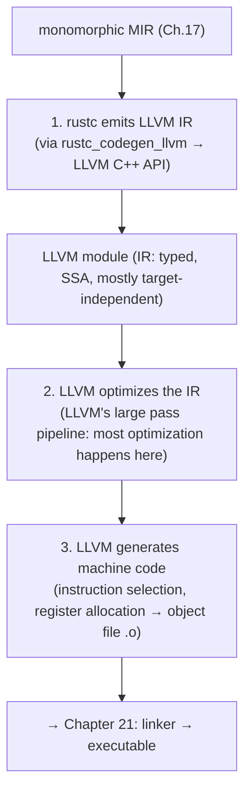
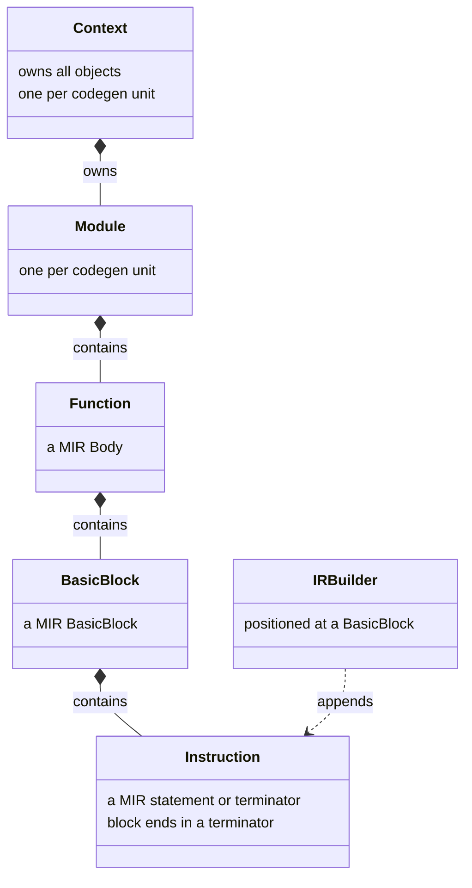
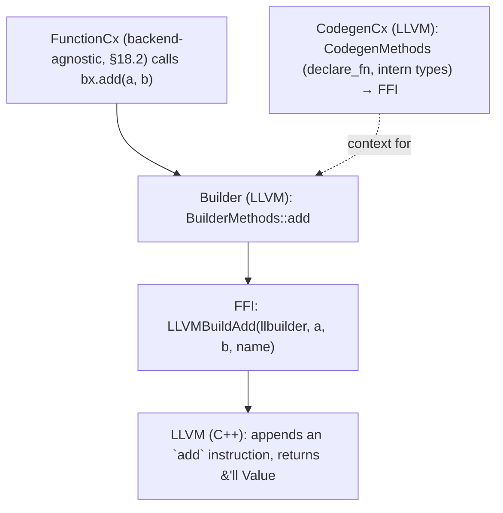
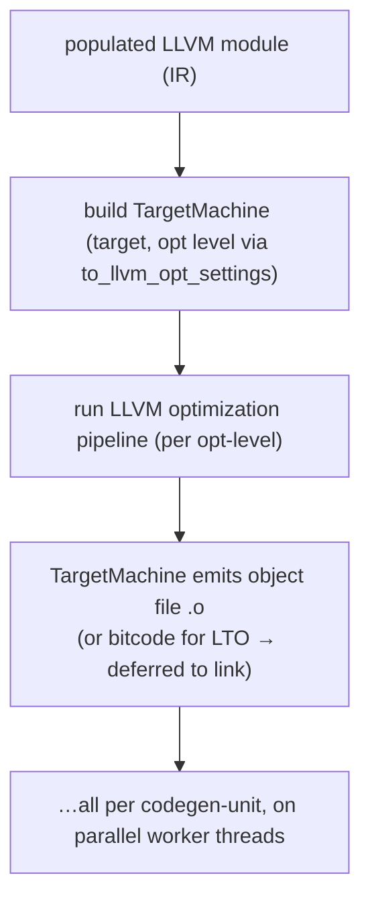
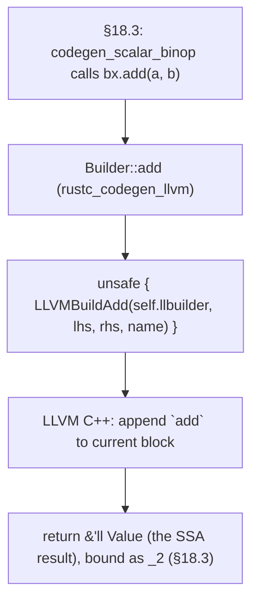
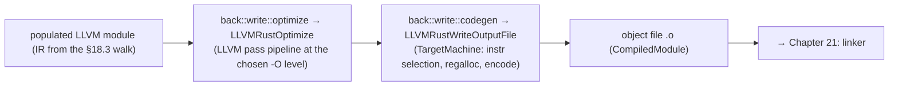
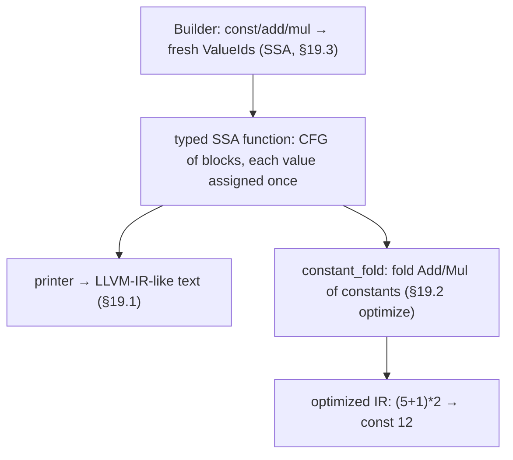

```admonish abstract title="What you'll learn"
- Why `rustc`'s default backend hands the program to LLVM rather than implementing its own optimizer and code generator, and what the trade-off costs.
- The three defining properties of [LLVM IR](../glossary.md#llvm-ir) (typed, SSA-form, mostly target-independent) and why the abstraction crate above it is named `rustc_codegen_ssa`.
- The three-stage LLVM flow per [codegen unit](../glossary.md#cgu): `rustc_codegen_llvm` emits IR, `LLVMRustOptimize` runs the pass pipeline, and `LLVMRustWriteOutputFile` drives the `TargetMachine` to a `.o`.
- How the `'ll` lifetime on `&'ll Value` lets Rust's [borrow checker](../glossary.md#borrow-checker) police LLVM's C++-owned object graph through the FFI in `rustc_codegen_llvm/src/llvm/ffi.rs`.
- How `CodegenCx` and `Builder` implement the §18 traits as thin `unsafe` wrappers (e.g. `add` becomes one `LLVMBuildAdd` call), so the abstract `bx.add(a, b)` collapses to a single FFI call.
- How to use `--emit=llvm-ir` (with `-C codegen-units=1` and `-O`) to inspect the IR `rustc` hands LLVM, and why opt-level-dependent miscompiles point at latent UB first, an LLVM bug second.
```

## 19.1 The LLVM Backend: Into LLVM IR

### Why rustc reuses LLVM

`rustc` does not contain an optimizer that turns intermediate code into fast machine instructions, and it does not contain a code generator that knows the instruction encodings of x86-64, ARM64, RISC-V, WebAssembly, and a dozen other targets. Writing those would be a multi-decade effort, and it has already been done. **LLVM** is a reusable compiler-backend library: an optimizer plus code generators for x86-64, ARM64, RISC-V, WebAssembly, and many other targets, packaged as a reusable component. Clang (the C/C++ compiler), Swift, Julia, and many others are built on it. `rustc`'s default backend, the subject of this chapter, is the layer that hands Rust's program to LLVM and lets LLVM do the heavy lifting of optimization and machine-code generation. The §18 abstraction's most important implementation bottoms out here.

### What LLVM IR is

The currency between `rustc` and LLVM is **LLVM IR**: LLVM's intermediate representation, the language `rustc` must produce. LLVM IR is the classic "middle" IR of compiler theory made into a real, shared artifact, with three defining properties:

- **Typed.** Every value has an explicit type (`i32`, `i64`, `ptr`, `[4 x i8]`, struct types). It is lower-level than Rust's types, no traits, no generics, no lifetimes, but richer than raw assembly.
- **SSA form.** As §18.1 noted, LLVM IR is in **Static Single Assignment** form: every value is assigned exactly once, and control-flow merges are reconciled with explicit `phi` nodes. This is *why* the codegen abstraction is called `rustc_codegen_ssa`: the form on the far side of the boundary.
- **Target-independent (mostly).** LLVM IR reads like a typed, structured assembly language, but it is not tied to one CPU. The *same* IR can be lowered to x86-64 or ARM64; LLVM's code generator handles the target specifics. (Some target details, pointer sizes, ABI, do leak in, but the bulk is portable.)

A small Rust function like `fn add(x: u32, y: u32) -> u32 { x + y }` becomes LLVM IR roughly resembling `define i32 @add(i32 %x, i32 %y) { %sum = add i32 %x, %y; ret i32 %sum }`, recognizably the `add` and `ret` the §18.3 builder methods emit, now in LLVM's textual form. You can see this for any program with the verified `--emit=llvm-ir` flag.

### The three-stage LLVM flow

Once `rustc` has produced LLVM IR for a codegen unit, the work proceeds in three stages, all inside LLVM:

1. **`rustc` emits LLVM IR.** The backend-agnostic [MIR](../glossary.md#mir) walk (§18.3), instantiated for the LLVM backend, builds an LLVM **module**, a container of functions, globals, and types in LLVM IR, by calling LLVM through `rustc_codegen_llvm`.
2. **LLVM optimizes the IR.** LLVM runs its own **optimization pipeline**: a large suite of passes (inlining, loop optimization, vectorization, dead-code elimination, instruction combining, and far more) over the IR. This is where the vast majority of optimization happens; it is much larger and more powerful than the MIR optimizations of Chapter 16.
3. **LLVM generates machine code.** LLVM's **code generator** lowers the optimized IR to the target architecture's machine instructions, performing instruction selection, register allocation, and scheduling, and emits an **object file** (`.o`), machine code not yet linked into a runnable program.

The output of stage 3 (object files, one per codegen unit) is what Chapter 21's linker combines into the final executable. Chapter 19 covers stages 1 and 2; the object files lead into linking.




### How `rustc` talks to LLVM: FFI

LLVM is written in C++; `rustc` is written in Rust. They communicate through a **foreign function interface (FFI)**: `rustc` calls LLVM's C/C++ API directly. The verified structure of `rustc_codegen_llvm` makes this concrete: the **`llvm` folder** "defines the FFI necessary to communicate with LLVM using the C++ API," with `extern "C"` declarations of LLVM functions like the verified `LLVMCreateBuilderInContext`. The §18 abstraction bottoms out exactly here: the LLVM backend's `Builder` (§18.2) wraps an LLVM IR builder, and when the backend-agnostic code calls `bx.add(lhs, rhs)`, the LLVM `Builder`'s implementation calls the LLVM FFI function that appends an `add` instruction to the current block. The abstract `Bx::Value` is, concretely, an `&'ll Value`, a reference to an LLVM-owned value object, where `'ll` (the verified third lifetime, alongside [`'tcx`](../glossary.md#tcx-lifetime) and `'a`) is "the lifetime of references to LLVM objects."

The verified breakdown of `rustc_codegen_llvm`'s parts (each "thousands of lines"; exact counts drift release-to-release): the `mir` folder "implements the actual lowering from MIR to LLVM IR"; `builder.rs` "contains all the functions generating individual LLVM IR instructions inside a basic block"; the `back` folder "implements the mechanisms for creating the different object files... and the communication mechanisms for parallel code generation"; and `base.rs` "launches the code generation and distributes the work." That is the whole backend: lower MIR to IR (calling LLVM), let LLVM optimize and emit, collect the object files.

```admonish tip title="Pro-Tip, --emit=llvm-ir is the flag for seeing the IR rustc hands to LLVM"
Passing `--emit=llvm-ir` makes `rustc` write out the LLVM IR for your crate as a `.ll` text file, the exact IR produced by the codegen of Chapter 18, before (or after) LLVM's optimizations depending on flags. Reading it answers questions MIR cannot: what does this actually compile to *after* [monomorphization](../glossary.md#monomorphization) and lowering? Is this abstraction getting optimized away? Why is this function so large? For maximum readability, combine it with `-C codegen-units=1` (so the IR is not split across parallel units) and `-O` to see optimized IR. The companion `--emit=llvm-bc` produces *bitcode*, the compact binary form of the same IR, which is what actually flows between compilation stages (and what LTO consumes). `--emit=llvm-ir` sits between MIR and disassembly: MIR shows the compiler's model, LLVM IR shows what you handed the optimizer, and disassembly shows the final result.
```

### Why this is the right trade

Targeting LLVM is a deliberate exchange. `rustc` gives up *control* over and *speed* of the back end, and gets, for free, a mature optimizer and code generation for dozens of targets it would otherwise have to implement and maintain itself. The verified framing from the dev-guide is blunt: "rustc doesn't implement codegen itself." The cost is real: LLVM optimization and codegen are a large fraction of a release build's compile time, and `rustc` is at the mercy of LLVM's own bugs and release cadence, which is exactly *why* the §18 abstraction and the alternative backends (Cranelift for fast debug builds, Chapter 20) exist. But the default is LLVM because the optimization quality and target coverage are worth the price for production builds. This is the same "reuse an industrial component" decision Clang, Swift, and Julia all made.

### LLVM's optimizer versus `rustc`'s MIR opts

Chapter 16's MIR optimizations and LLVM's pipeline are not redundant. The MIR opts (Chapter 16) are *small* and serve two narrow purposes: shrink the IR before it is duplicated by monomorphization (so LLVM has less to chew on, a compile-time win), and exploit Rust-level knowledge LLVM has lost by the time it sees plain IR. The *bulk* of optimization, the aggressive inlining, loop transformations, vectorization, and the hundreds of analyses that make the final code fast, is **LLVM's**, run in stage 2 over the IR. So the division is: `rustc` does a little Rust-aware cleanup on MIR; LLVM does the heavy, general-purpose optimization on IR. A programmer wondering "why is my code fast/slow" is, for the most part, asking about LLVM's pipeline, not `rustc`'s.

```admonish warning title="Warning, rustc's LLVM is a specific, patched version, and LLVM IR is not a stable interchange format"
Two practical hazards follow from `rustc` linking against LLVM. First, `rustc` ships with and links a *particular* LLVM version (often with Rust-specific patches), not whatever LLVM is installed on your system, so the IR `rustc` emits, and the optimizations it gets, are tied to *that* LLVM, and upgrading `rustc` can change codegen because it changed LLVM. Second, LLVM IR is explicitly *not* a stable format across LLVM versions: the textual `.ll` and bitcode `.bc` that one LLVM version emits may not be readable by a different version, and the IR `rustc` produces is shaped for the LLVM it ships with. The lesson: do not treat LLVM IR as a durable interchange artifact between toolchains, and when reproducing a codegen issue, the LLVM *version* matters: a bug present in `rustc` built against LLVM 18 may vanish against LLVM 19. (This version-coupling is also why building `rustc` from source involves building or linking a specific LLVM, and why the dev-guide has a whole section on rebuilding it.)
```

### Where this leaves us

`rustc`'s default backend hands the program to **LLVM**, a mature reusable optimizer-and-code-generator that `rustc` does not reimplement. The interchange is **LLVM IR**: a **typed**, **SSA-form**, mostly **target-independent** assembly-like language (the reason the abstraction crate is named `rustc_codegen_ssa`). The flow is three stages: `rustc` **emits LLVM IR** (the §18 backend-agnostic walk, instantiated for LLVM, building an LLVM module by calling LLVM's C++ API through the **FFI** in `rustc_codegen_llvm`'s `llvm` folder, with `Bx::Value` = `&'ll Value`); **LLVM optimizes the IR** with its large pass pipeline (where the bulk of optimization happens, far beyond Chapter 16's MIR opts); and **LLVM generates machine code** into object files. The trade, surrendering back-end control and compile speed for a mature optimizer and dozens of targets, is the standard reuse decision Clang, Swift, and Julia also made, and the reason `--emit=llvm-ir` is the key flag for seeing what Rust compiles to. The LLVM `rustc` uses is a specific, patched version, and its IR is not a cross-version-stable format.

§19.2 takes the architecture deep-dive: `rustc_codegen_llvm`'s `CodegenCx` and `Builder` wrapping LLVM objects, the FFI layer and how `&'ll Value` handles work, the LLVM module/function/basic-block structure being populated, and the `back::write` machinery that runs LLVM's optimization and emits object files. Then §19.3 reads the real LLVM `Builder` implementing a `BuilderMethods` method via an FFI call, and §19.4 has you build a tiny typed-SSA-IR emitter and "optimizer" to feel how a real backend IR is constructed and transformed.

## 19.2 The Architecture: `rustc_codegen_llvm`, the FFI, and the LLVM Module

### Where the abstraction meets the C++ library

`rustc_codegen_llvm` wraps LLVM's object model behind the §18 traits, talks to it over FFI, and then hands the populated module to LLVM's optimizer and code generator via `back::write`. That is the machinery of §19.1's first stage and the launch of its second. The throughline: every `Bx::Value` the §18 walk manipulates is, here, a real pointer into LLVM's memory, and every builder call crosses the language boundary into C++.

### The FFI layer: opaque LLVM objects as `&'ll` references

LLVM owns its own data structures in C++ memory; `rustc` reaches them through **opaque pointers** declared in the verified `llvm` folder. The pattern: each LLVM type is an opaque Rust type (`Value`, `Type`, `BasicBlock`, `Module`, `Context`, `Builder`) that exists only behind a reference, and LLVM's C API functions are declared `extern "C"`:

```rust
// rustc_codegen_llvm/src/llvm/ffi.rs  (faithful; extern syntax is the Rust 2024 edition form)
unsafe extern "C" {
    pub(crate) fn LLVMContextCreate() -> &'static mut Context;
    pub(crate) fn LLVMCreateBuilderInContext(C: &Context) -> &mut Builder<'_>;
    pub(crate) fn LLVMBuildAdd<'a>(B: &Builder<'a>, LHS: &'a Value, RHS: &'a Value, Name: *const c_char) -> &'a Value;
    pub(crate) fn LLVMAppendBasicBlockInContext<'a>(C: &'a Context, Fn: &'a Value, Name: *const c_char) -> &'a BasicBlock;
    // … hundreds more … …
}
```

The crucial design choice (verified from the traitification history) is the **`'ll` lifetime**. An LLVM `Value` is referenced as `&'ll Value`, a borrow whose lifetime `'ll` is tied to the LLVM `Context` that owns it. This lets Rust's borrow checker police the use of LLVM objects: a `Value` cannot outlive its `Context`, enforced statically by the same mechanism (Chapter 15) that policed Rust programs. The verified note from the refactoring is telling: making the code generic "uncovered situations where the borrow-checker was passing only due to the special nature of the LLVM objects manipulated (they are extern pointers)." So `Bx::Value` (§18.2), for the LLVM backend, is concretely `&'ll Value`: a checked borrow of a C++-owned object.

### LLVM's object model

The FFI gives access to LLVM's hierarchy, which `rustc` populates:

- A **`Context`** owns everything, types, constants, the lot, and is the root of an isolated LLVM world (one per codegen unit, enabling parallel codegen).
- A **`Module`** is a translation unit: a container of functions, global variables, and type definitions, all in LLVM IR. `rustc` builds one module per **codegen unit** (§17.2).
- A **`Function`** (an LLVM `Value` of function type) holds a list of `BasicBlock`s.
- A **`BasicBlock`** holds a list of instructions, ending in a terminator, the same CFG shape as MIR (§14.1), now in LLVM's representation.
- An **IR builder** (`Builder`) is positioned at a basic block and appends instructions to it.

The mapping to MIR is direct: a MIR `Body` → an LLVM `Function`; a MIR `BasicBlock` → an LLVM `BasicBlock`; a MIR `Statement`/`Terminator` → LLVM instructions. The §18.3 walk drives exactly this construction.




### `CodegenCx` and `Builder`: the LLVM implementations of the §18 traits

The two §18.2 structures, for LLVM, are the concrete wrappers around this model:

```rust
// rustc_codegen_llvm/src/{context.rs, builder.rs}  (faithful; type aliases, FullCx fields abridged)
pub type CodegenCx<'ll, 'tcx> = GenericCx<'ll, FullCx<'ll, 'tcx>>;
pub struct FullCx<'ll, 'tcx> {
    pub tcx: TyCtxt<'tcx>,
    pub scx: SimpleCx<'ll>, // wraps SCx<'ll> { llmod: &'ll Module, llcx: &'ll Context, isize_ty }
    // type cache, const cache, declared-function map, ~20 more fields …
}
pub type Builder<'a, 'll, 'tcx> = GenericBuilder<'a, 'll, FullCx<'ll, 'tcx>>;
pub struct GenericBuilder<'a, 'll, CX: Borrow<SCx<'ll>>> {
    pub llbuilder: &'ll mut llvm::Builder<'ll>, // the LLVM IR builder
    pub cx: &'a GenericCx<'ll, CX>, // = CodegenCx<'ll,'tcx> when CX = FullCx (the §18.2 Deref target)
}
```

`CodegenCx` implements the verified `CodegenMethods` family (§18.2), `declare_fn` adds a function to `llmod`, type/const methods intern LLVM types and constants, by calling the FFI. `Builder` implements the verified `BuilderMethods`, and *this* is the bottom of the §18 abstraction. The verified `Builder::append_block(cx, llfn: &'ll Value, name) -> &'ll BasicBlock` calls `LLVMAppendBasicBlockInContext`; `Builder::add(lhs, rhs)` calls `LLVMBuildAdd`. When the backend-agnostic `FunctionCx` (§18.2) calls `bx.add(a, b)`, monomorphized for this `Builder`, it is a direct call to this method, which is one FFI call into LLVM. The "traitification" the verified history describes, "encapsulate all functions calling the LLVM FFI inside a set of traits", is exactly this: `CodegenCx`/`Builder` are where the abstract traits become LLVM C-API calls.




```admonish tip title="Pro-Tip, the 'll lifetime is the borrow checker policing a foreign heap, and it is why this FFI is safe Rust to use"
FFI is usually a place where safety guarantees evaporate: you hold raw pointers into another language's memory with no help from the type system. `rustc_codegen_llvm`'s `'ll` design recovers much of that safety: by modeling every LLVM object as `&'ll T` borrowed from the `Context`, the *Rust* borrow checker ensures no LLVM `Value` is used after its `Context` is freed, no `Builder` outlives its module, and so on: the lifetimes encode LLVM's own ownership invariants, so the borrow checker (Chapter 15) polices a C++ heap. When you design FFI bindings to a library with an ownership model (a context owning objects), encoding that model in lifetimes, as `'ll` does, is how you make the unsafe boundary safe to build on.
```

### `back::write`: optimizing and emitting

Once the §18.3 walk has populated a module with IR, the second and third stages of §19.1 happen in the verified `rustc_codegen_llvm::back::write` module. The sequence:

1. **Build a `TargetMachine`.** LLVM needs a description of the target (architecture, CPU features, code model, relocation model). `rustc` constructs one from the target spec and codegen options, using helpers (`to_llvm_opt_settings`, `to_pass_builder_opt_level`, `to_llvm_relocation_model`, `to_llvm_code_model`, `to_llvm_float_abi`) that map Rust's `-O`/`-C opt-level` to LLVM's optimization-level enums and translate the code-model setting.
2. **Run the optimization pipeline.** `rustc` invokes LLVM's pass pipeline over the module, the large suite of §19.1 stage-2 optimizations. The opt level chosen above selects how aggressive this is: `-O0` runs almost nothing (fast compile, slow code), `-O2`/`-O3` run the full pipeline (slow compile, fast code).
3. **Emit the object file.** `rustc` asks the `TargetMachine` to emit the optimized module as a target object file (`.o`), LLVM's code generator doing instruction selection, register allocation, and encoding. (Depending on flags, it may instead emit assembly, bitcode, or, for LTO, defer emission.)

The verified dev-guide note adds a wrinkle: with **LTO** (link-time optimization), "the optimization might happen at the linking time instead", bitcode is carried to the link stage and optimized across crate boundaries there (Chapter 21). And the whole of `back::write` is built to run **per codegen unit in parallel** (§18.2): each CGU's module is optimized and emitted on its own worker thread, which is the verified payoff of partitioning and a primary reason multi-CGU builds are faster (at some cost to cross-CGU optimization, the §17.2 trade).




```admonish warning title="Warning, opt-level affects correctness-adjacent behavior, not just speed, and LLVM bugs surface as opt-level-dependent miscompiles"
It is tempting to think `-O` only changes how fast the code runs. But the optimization level changes *which LLVM passes run*, and that has consequences beyond speed. Undefined behavior in your code (out-of-bounds via `unsafe`, data races, invalid values) may be *invisible* at `-O0` and produce wrong results at `-O2`, because optimizations exploit the assumption that UB never happens, the classic 'it worked in debug, broke in release' bug, which is almost always *your* latent UB being exposed, not an LLVM bug. *Separately*, genuine LLVM bugs do exist, and they characteristically manifest as miscompiles that appear only at certain opt levels (the buggy pass only runs at `-O2`+). The diagnostic discipline: when behavior differs between debug and release, first suspect UB in your own (or a dependency's) `unsafe` code, run under Miri (Chapter 16's interpreter) or sanitizers; only after ruling that out consider an LLVM codegen bug, and reproduce it with a specific opt level and LLVM version (§19.1's version-coupling warning). Opt-level-dependent behavior is a signal, and the first hypothesis should be latent UB, not a compiler bug.
```

### How this builds, and what is next

`rustc_codegen_llvm` is the §18 abstraction's LLVM implementation, sitting on an **FFI** layer (the `llvm` folder) that declares LLVM's C++ API and models every LLVM object as an `&'ll`-borrowed opaque pointer, the **`'ll` lifetime** letting the borrow checker police LLVM's foreign object graph (a `Value` cannot outlive its `Context`). LLVM's object model, `Context` owns all, a `Module` per codegen unit, `Function`s of `BasicBlock`s of instructions, built by a positioned **IR builder**, maps directly onto MIR's structure. `CodegenCx` implements the `CodegenMethods` traits (declaring functions, interning types) and `Builder` implements `BuilderMethods` (each method one FFI call: `add` → `LLVMBuildAdd`), so the backend-agnostic `FunctionCx` drives concrete LLVM construction. Then `back::write` builds a `TargetMachine`, runs **LLVM's optimization pipeline** (aggressiveness set by `-O`/`to_llvm_opt_settings`), and **emits the object file**, all **per codegen unit in parallel**, with LTO deferring optimization to link time. Opt level changes which passes run, so opt-level-dependent misbehavior signals latent UB first, an LLVM bug second.

§19.3 reads the real code: the LLVM `Builder` implementing a `BuilderMethods` method (say `add` or `cond_br`) as an FFI call returning an `&'ll Value`, and a slice of `back::write` invoking the optimization pipeline, the abstraction touching C++ in actual source. Then §19.4 has you build a tiny typed-SSA IR: a value/instruction/block model, an emitter, a `phi`-aware structure, and a trivial optimization, to feel how a real backend IR is constructed and transformed.

## 19.3 Reading the Source: A Builder Method and the Optimization Pipeline

### One method, one FFI call

The LLVM `Builder`'s implementation of `BuilderMethods::add` (the method the §18.3 walk calls for `_2 = _1 + 1`) is a thin wrapper over an `extern "C"` LLVM function. This is the exact point where Rust's abstract codegen becomes a call into a C++ library. After it, `back::write` runs the optimization pipeline over the populated module. The source is `rustc_codegen_llvm`'s `builder.rs` and `back/write.rs`.

### The FFI declaration

First, the foreign function. LLVM's C API exposes instruction-building functions; `rustc` declares them `extern "C"` (§19.2). The verified historical signature, modernized with the `'ll` lifetime:

```rust
// rustc_codegen_llvm/src/llvm/ffi.rs  (faithful; lifetime renamed 'a → 'll for chapter narrative)
unsafe extern "C" {
    // LLVM's C API: append an `add` to the builder's current block, return the result value.
    pub(crate) fn LLVMBuildAdd<'ll>(
        B: &Builder<'ll>, // the LLVM IR builder (positioned at a block)
        LHS: &'ll Value, // left operand
        RHS: &'ll Value, // right operand
        Name: *const c_char, // a name hint for the result (SSA values are named)
    ) -> &'ll Value; // the freshly-created result value
}
```

This is LLVM's own `LLVMBuildAdd`, the same function Clang and every other LLVM client calls. It takes the builder, two operand values, and a name, and returns a *new* `Value` (the result of the addition), which LLVM has appended as an instruction to whatever block the builder is positioned at. The single-assignment discipline (§18.1) is right here: `add` does not mutate an operand; it *produces* a new value.

### The `Builder` method: a thin wrapper

Now the Rust side. The LLVM `Builder`'s implementation of the abstract `BuilderMethods::add` (§18.2/§18.3) is almost nothing but the FFI call:

```rust
// rustc_codegen_llvm/src/builder.rs  (faithful; macro-expanded for `add`)
impl<'a, 'll, 'tcx> BuilderMethods<'a, 'tcx> for Builder<'a, 'll, 'tcx> {
    fn add(&mut self, a: &'ll Value, b: &'ll Value) -> &'ll Value {
        // generated by the math_builder_methods! macro in builder.rs
        unsafe {
            llvm::LLVMBuildAdd(self.llbuilder, a, b, UNNAMED) // ← the FFI call
        }
    }
    fn cond_br(&mut self, cond: &'ll Value, then_llbb: &'ll BasicBlock, else_llbb: &'ll BasicBlock) {
        unsafe {
            // conditional branch
            llvm::LLVMBuildCondBr(self.llbuilder, cond, then_llbb, else_llbb);
        }
    }
    fn ret(&mut self, v: &'ll Value) {
        unsafe { llvm::LLVMBuildRet(self.llbuilder, v); }
    }
    // … 133 more (the BuilderMethods trait has 136 methods total), each a similarly thin wrapper … …
}
```

Read how *thin* this is. `add` takes the two `&'ll Value` operands, passes them and `self.llbuilder` to `LLVMBuildAdd` inside an `unsafe` block (the FFI is unsafe, we are calling C++), and returns the `&'ll Value` LLVM hands back. That is the entire implementation. The §18.3 backend-agnostic `codegen_scalar_binop` calls `bx.add(a, b)`; monomorphized for this `Builder`, that becomes this method; this method is one FFI call; LLVM appends the `add` instruction and returns the result handle. The whole abstraction, `BuilderMethods`, `Bx::Value`, the generic `FunctionCx`, collapses, at this leaf, into "call the C function." `cond_br` (the §18.3 `SwitchInt` fork's two-way case) is the same: pass the condition and the two target blocks to `LLVMBuildCondBr`. `ret` to `LLVMBuildRet`.




```admonish tip title="Pro-Tip, the thinness of these wrappers tells you where the real code lives"
Each `BuilderMethods` method is essentially `unsafe { LLVMBuildX(...) }`, no logic, just a typed, lifetime-checked door into LLVM. This matters for two reasons. First, each wrapper monomorphizes and inlines to the bare FFI call, so the backend-agnostic layer adds no runtime overhead. Second, it tells you where to look when codegen produces something surprising: it is almost never in these wrappers (they are trivial): it is either *upstream* in the backend-agnostic walk (§18.3, which decided to emit an `add` here at all) or *downstream* in LLVM (which decided what machine code the `add` becomes). The `rustc_codegen_llvm` builder is a translation layer so thin it rarely harbors bugs; when you debug codegen, skip past it to the walk that called it or the LLVM that consumed its output.
```

### After the walk: `back::write` optimizes

Once the §18.3 walk has called these methods for every statement and terminator of every function, the codegen unit's LLVM **module** is fully populated with IR. Now `back::write` (§19.2) runs LLVM's optimizer over it. Faithfully:

```rust
// rustc_codegen_llvm/src/back/write.rs  (faithful; private wrapper hop + LLVMRustOptimize args abridged)
pub(crate) fn optimize(
    cgcx: &CodegenContext,
    prof: &SelfProfilerRef,
    shared_emitter: &SharedEmitter,
    module: &mut ModuleCodegen<ModuleLlvm>,
    config: &ModuleConfig,
) {
    if let Some(opt_level) = config.opt_level {
        // Dispatch to the private `llvm_optimize` helper, which marshals all flags
        // and makes the FFI call into LLVM's PassBuilder:
        //   llvm::LLVMRustOptimize(llmod, tm.raw(),
        //       to_pass_builder_opt_level(opt_level), // ① -O{0,1,2,3,s,z} pipeline selection
        //       opt_stage, // pre-link / ThinLTO / FatLTO
        //       /* … ~25 more args: sanitizer opts, PGO paths, pass flags … */)
        unsafe { llvm_optimize(cgcx, prof, /* dcx */, module, /* thin-lto bufs */,
                               config, opt_level, /* opt_stage */, /* autodiff_stage */) };
    }
}
```

`LLVMRustOptimize` is `rustc`'s FFI entry to LLVM's modern **pass-builder** pipeline: it constructs the standard optimization pipeline for the chosen level (`-O2`, `-Os`, etc., via the §19.2 opt-level-derived setting) and runs every pass over the module: inlining, GVN, loop transforms, vectorization, dead-code elimination, the lot (§19.1 stage 2). When it returns, `llmod` holds *optimized* IR. The dev-guide's "Debugging LLVM" page enumerates the current `-C`/`-Z` flags for skipping, listing, or timing the passes. This single FFI call is the bulk of where a release build's time goes.

### And then: emit the object file

With the module optimized, the final step asks the `TargetMachine` to lower it to machine code and write an object file:

```rust
// rustc_codegen_llvm/src/back/write.rs  (faithful; private wrapper hop + emit_* branches abridged)
pub(crate) fn codegen(
    cgcx: &CodegenContext,
    prof: &SelfProfilerRef,
    shared_emitter: &SharedEmitter,
    module: ModuleCodegen<ModuleLlvm>, // by value: consumed by `into_compiled_module`
    config: &ModuleConfig,
) -> CompiledModule {
    let llmod = module.module_llvm.llmod();
    let tm = &*module.module_llvm.tm;
    // Multiple emit branches (bitcode / IR / asm / object). Showing the object case:
    if let EmitObj::ObjectCode(_) = config.emit_obj {
        let obj_out = cgcx.output_filenames.temp_path_for_cgu(OutputType::Object, &module.name);
        // The private `write_output_file` helper sets up the PassManager and calls the FFI:
        //   let pm = llvm::LLVMCreatePassManager();
        //   llvm::LLVMAddAnalysisPasses(target, pm);
        //   llvm::LLVMRustAddLibraryInfo(target, pm, m, no_builtins);
        //   llvm::LLVMRustWriteOutputFile(target, pm, m, output_path,
        //       dwo_output_ptr, file_type, verify_llvm_ir)
        // (TargetMachine emits the object: instruction selection, register allocation, encoding.)
        write_output_file(/* dcx */, tm.raw(), config.no_builtins, llmod, &obj_out,
                          /* dwo_out */, llvm::FileType::ObjectFile, prof, config.verify_llvm_ir);
    }
    // … emit_ir / emit_asm / EmitObj::Bitcode / EmitObj::None branches elided …
    module.into_compiled_module(
        config.emit_obj != EmitObj::None,
        /* dwarf_object_emitted */ false,
        config.emit_bc, config.emit_asm, config.emit_ir,
        &cgcx.output_filenames,
    )
}
```

`LLVMRustWriteOutputFile` drives LLVM's code generator (the §19.1 stage 3): instruction selection turns IR operations into target machine instructions, the register allocator assigns physical registers, and the result is encoded into an object file (`.o`). `rustc` records the path in a `CompiledModule`. That object file, machine code for this one codegen unit, is what Chapter 21's linker will combine with the others into the final binary. And all of `optimize` + `codegen` runs *per codegen unit on a worker thread* (§19.2), so many modules are optimized and emitted in parallel.




```admonish warning title="Warning, these FFI calls are unsafe for real reasons; a wrong handle or lifetime crosses into C++ where Rust's guarantees end"
Every method here is `unsafe { LLVMBuildX(...) }`, and the `unsafe` is not ceremonial. On the Rust side of the boundary, the `'ll` lifetimes (§19.2) keep the handles valid; but the *moment* a call enters LLVM, Rust's checks are gone: LLVM trusts that the `Value`s you pass belong to the right `Context`, that the builder is positioned at a valid block, that types match what the instruction expects. Pass a value from the wrong context, or a builder pointing at a finished block, and LLVM will *not* return a nice `Result`: it will assert, segfault, or silently build malformed IR that crashes a later pass. This is why the `'ll`-lifetime design (§19.2) is load-bearing rather than decorative: it is the *only* thing standing between the codegen logic and a class of crashes that would otherwise be trivial to write. When modifying `rustc_codegen_llvm`, the discipline is that the type-and-lifetime contract must encode LLVM's runtime invariants, because once you call across the FFI, those invariants are on you: the C++ side will enforce them with a crash, not a compile error.
```

### How this builds, and what is next

We have read the abstraction touch C++. The LLVM `Builder`'s `BuilderMethods` implementations are each a **thin `unsafe` wrapper over one FFI call**: `add` → `LLVMBuildAdd(self.llbuilder, lhs, rhs, name)` returning a fresh `&'ll Value`; `cond_br` → `LLVMBuildCondBr`; `ret` → `LLVMBuildRet`. The §18.3 backend-agnostic walk, monomorphized for this builder, collapses at each leaf into "call the C function," so the abstraction is genuinely free (and the wrappers are too trivial to harbor bugs, look upstream or in LLVM). Once the walk has populated the module, `back::write::optimize` calls `LLVMRustOptimize` to run LLVM's full pass pipeline at the chosen `-O` level (the bulk of a release build's time), and `back::write::codegen` calls `LLVMRustWriteOutputFile` to drive the `TargetMachine`'s code generator, instruction selection, register allocation, encoding, into an **object file**, all per codegen unit in parallel. The FFI is genuinely `unsafe`: past the boundary, the `'ll` lifetimes are the only thing encoding LLVM's invariants, and violating them crashes rather than fails to compile.

§19.4 turns the *idea* into a build (we cannot link LLVM in the sandbox). You will construct a tiny **typed SSA IR** in pure Rust, values, typed instructions, basic blocks with a terminator, a function, emit it with a builder-style API, and run a trivial optimization (constant folding or dead-instruction elimination) over it, to feel concretely how a backend IR is structured (SSA, typed, CFG of blocks) and transformed. It is the §19.1 to §19.3 LLVM IR model in miniature, built by hand.

## 19.4 Hands-On Lab: Build a Typed SSA IR and a Peephole Optimizer

### A backend IR by hand

We cannot link LLVM into the sandbox, but we can build the *thing* LLVM IR is: a **typed, SSA-form, CFG-structured intermediate representation** with a builder API and an optimization pass. This lab constructs exactly that: values that are each assigned once (§18.1), typed instructions, basic blocks ending in terminators, a function of blocks, a builder that emits into the current block (the §19.3 `Builder` analogue), a printer that produces LLVM-IR-like text, and a constant-folding pass that rewrites the IR (the §19.2 optimize stage in miniature). When your emitter turns `(x + 1) * 2` into typed SSA text and your optimizer folds the arithmetic into constants (with DCE left as an exercise to collapse it to a single `ret`), you will have built the §19.1 to §19.3 model with your own hands.

`cargo new`, pure `std`.

### The typed SSA value model

Every value is identified by a `ValueId` and produced *exactly once* by an instruction, the SSA discipline (§18.1). Types are explicit (§19.1):

```rust
// src/main.rs
use std::collections::HashMap;

type ValueId = usize; // %0, %1, %2 …  (each assigned once)
// in real rustc_codegen_llvm this is &'ll Value (§19.2); we use an index because there is no LLVM Context to borrow from.
type BlockId = usize;

#[derive(Clone, Copy, PartialEq, Debug)]
enum Type { I1, I32, I64 } // explicit, low-level types (§19.1)

#[derive(Clone, Copy, PartialEq, Debug)]
enum IntPredicate { Eq, Ne, Slt, Sle } // rustc's IntPredicate has 10 variants; we take 4.

#[derive(Clone, Debug)]
enum Inst { // each Inst PRODUCES a new ValueId: single assignment
    Const(Type, i64),
    Add(ValueId, ValueId),
    Mul(ValueId, ValueId),
    ICmp(IntPredicate, ValueId, ValueId), // → I1, one opcode parametrized by predicate, mirroring rustc's `icmp(op, ...)`
}

#[derive(Clone, Debug)]
enum Term {  // a block ends in exactly one terminator (§14.1, mirrored)
    Br(BlockId),
    CondBr { cond: ValueId, then_b: BlockId, else_b: BlockId },
    Ret(ValueId),
}
```

### Blocks and functions

```rust
#[derive(Clone)]
struct Block {
    insts: Vec<(ValueId, Inst)>, // (result value, instruction)
    term: Option<Term>,
}
struct Function {
    name: String,
    args: Vec<Type>, // params live on the function (cf. LLVMGetParam), not as block instructions
    values: Vec<(Type, Inst)>, // value table: ValueId → (type, defining instruction)
    blocks: Vec<Block>,
}
```

### The builder API

The §19.3 `Builder` analogue: positioned at a block, each method emits an instruction and returns the fresh `ValueId` it produces, exactly the shape of `LLVMBuildAdd` returning a new value:

```rust
struct Builder {
    func: Function,
    cur: BlockId, // the block we are appending to (the IRBuilder position, §19.2)
}

impl Builder {
    fn new(name: &str, args: Vec<Type>) -> Builder {
        Builder { func: Function { name: name.into(), args, values: vec![], blocks: vec![] }, cur: 0 }
    }
    // associated fn (no self), matching rustc's BuilderMethods::append_block(cx, llfn, name): a block belongs to a function, not to a builder.
    fn append_block(func: &mut Function, _name: &str) -> BlockId {
        func.blocks.push(Block { insts: vec![], term: None });
        func.blocks.len() - 1
    }
    fn position_at(&mut self, b: BlockId) { self.cur = b; }

    // emit an instruction: record its type+def, append to current block, return the new ValueId
    fn emit(&mut self, ty: Type, inst: Inst) -> ValueId {
        let id = self.func.values.len();
        self.func.values.push((ty, inst.clone()));
        self.func.blocks[self.cur].insts.push((id, inst));
        id
    }
    fn const_int(&mut self, ty: Type, n: i64) -> ValueId { self.emit(ty, Inst::Const(ty, n)) }
    fn add(&mut self, a: ValueId, b: ValueId) -> ValueId {
        let ty = self.func.values[a].0;
        self.emit(ty, Inst::Add(a, b)) // ← like LLVMBuildAdd: returns a NEW value (§19.3)
    }
    fn mul(&mut self, a: ValueId, b: ValueId) -> ValueId {
        let ty = self.func.values[a].0;
        self.emit(ty, Inst::Mul(a, b))
    }
    // one method parametrised by predicate, mirroring rustc's `fn icmp(op: IntPredicate, ...)`
    fn icmp(&mut self, op: IntPredicate, a: ValueId, b: ValueId) -> ValueId {
        self.emit(Type::I1, Inst::ICmp(op, a, b))
    }
    fn ret(&mut self, v: ValueId) { self.func.blocks[self.cur].term = Some(Term::Ret(v)); }
    fn cond_br(&mut self, c: ValueId, t: BlockId, e: BlockId) {
        self.func.blocks[self.cur].term = Some(Term::CondBr { cond: c, then_b: t, else_b: e });
    }
}
```

### A printer: LLVM-IR-like text

```rust
fn ty(t: Type) -> &'static str { match t { Type::I1 => "i1", Type::I32 => "i32", Type::I64 => "i64" } }

fn pred(p: IntPredicate) -> &'static str {
    match p { IntPredicate::Eq => "eq", IntPredicate::Ne => "ne", IntPredicate::Slt => "slt", IntPredicate::Sle => "sle" }
}

fn print_function(f: &Function) {
    // lab printer guesses the return type from the last value-table entry; a real printer would
    // read it from the terminator's Ret target (§19.2). Good enough while the last value IS the return.
    let ret_ty = ty(f.values.last().map(|(t,_)| *t).unwrap_or(Type::I32));
    let args = f.args.iter().enumerate()
        .map(|(i, t)| format!("{} %arg{i}", ty(*t))).collect::<Vec<_>>().join(", ");
    println!("define {ret_ty} @{}({args}) {{", f.name);
    for (bi, blk) in f.blocks.iter().enumerate() {
        println!("bb{bi}:");
        for (id, inst) in &blk.insts {
            // real LLVM-IR text prints the operand type next to each binary opcode (e.g. `add i32 %a, %b`); match that convention.
            let t = f.values[*id].0;
            let line = match inst {
                Inst::Const(t, n) => format!("%{id} = const {} {n}", ty(*t)),
                Inst::Add(a, b) => format!("%{id} = add {} %{a}, %{b}", ty(t)),
                Inst::Mul(a, b) => format!("%{id} = mul {} %{a}, %{b}", ty(t)),
                Inst::ICmp(op, a, b) => format!("%{id} = icmp {} {} %{a}, %{b}", pred(*op), ty(f.values[*a].0)),
            };
            println!("  {line}");
        }
        match &blk.term {
            Some(Term::Ret(v)) => println!("  ret %{v}"),
            Some(Term::Br(t)) => println!("  br bb{t}"),
            Some(Term::CondBr{cond,then_b,else_b}) => println!("  br %{cond}, bb{then_b}, bb{else_b}"),
            None => println!("  <no terminator>"),
        }
    }
    println!("}}");
}
```

### A constant-folding pass: the optimize stage in miniature

The §19.2 optimization stage, scaled down: walk the instructions, and where an `Add`/`Mul` has two constant operands, replace it with a constant. We track each value's known constant in a map and rewrite the value table:

```rust
fn constant_fold(f: &mut Function) {
    let mut known: HashMap<ValueId, i64> = HashMap::new();
    for id in 0..f.values.len() {
        let (ty, inst) = f.values[id].clone();
        let folded: Option<i64> = match inst {
            Inst::Const(_, n) => Some(n),
            Inst::Add(a, b) => known.get(&a).zip(known.get(&b)).map(|(x, y)| x + y),
            Inst::Mul(a, b) => known.get(&a).zip(known.get(&b)).map(|(x, y)| x * y),
            _ => None,
        };
        if let Some(n) = folded {
            known.insert(id, n);
            // rewrite the instruction to a constant
            f.values[id] = (ty, Inst::Const(ty, n));
        }
    }
    // rewrite the instructions inside blocks to match the folded value table
    for b in &mut f.blocks {
        for (id, inst) in &mut b.insts { *inst = f.values[*id].1.clone(); }
    }
}
```

### Running it

```rust
fn main() {
    // f() { %0 = const 5; %1 = const 1; %2 = add %0,%1; %3 = const 2; %4 = mul %2,%3; ret %4 }
    // i.e. (5 + 1) * 2: fully constant, should fold to 12.
    let mut b = Builder::new("f", vec![]);
    let entry = Builder::append_block(&mut b.func, "entry"); b.position_at(entry);
    let c5 = b.const_int(Type::I32, 5);
    let c1 = b.const_int(Type::I32, 1);
    let sum = b.add(c5, c1);
    let c2 = b.const_int(Type::I32, 2);
    let prod = b.mul(sum, c2);
    b.ret(prod);
    let mut f = b.func;

    println!("=== before optimization ===");
    print_function(&f);

    constant_fold(&mut f);

    println!("\n=== after constant folding ===");
    print_function(&f);
}
```

````admonish example title="Expected output" collapsible=true
```text
=== before optimization ===
define i32 @f() {
bb0:
  %0 = const i32 5
  %1 = const i32 1
  %2 = add i32 %0, %1
  %3 = const i32 2
  %4 = mul i32 %2, %3
  ret %4
}

=== after constant folding ===
define i32 @f() {
bb0:
  %0 = const i32 5
  %1 = const i32 1
  %2 = const i32 6
  %3 = const i32 2
  %4 = const i32 12
  ret %4
}
```
````

The builder emitted single-assignment values (`%0`…`%4`), each produced once, exactly like the §19.3 `LLVMBuildAdd` returning a fresh value; the printer rendered it in LLVM-IR-like text; and `constant_fold` walked the value table and folded `add i32 %0, %1` (5 + 1) into `const 6` and `mul i32 %2, %3` (6 × 2) into `const 12`; `ret %4` now returns a value known at compile time. This is the §19.1 to §19.3 model entire: emit typed SSA into a CFG of blocks (the LLVM module/function/block structure), then transform it with a pass (the LLVM optimizer). The only thing missing versus `rustc_codegen_llvm` is that *its* `add` crosses an FFI into a C++ library that does this folding (and a thousand harder optimizations), but the *shape* is exactly what you built.




### What the lab stripped from real rustc

The lab's typed SSA values are owned indices into a `Vec`. The categorical gaps versus real rustc are real FFI handles with lifetimes (`[rustc_codegen_llvm/src/llvm/ffi.rs](https://github.com/rust-lang/rust/blob/1.95.0/compiler/rustc_codegen_llvm/src/llvm/ffi.rs)`, `[rustc_codegen_llvm/src/builder.rs](https://github.com/rust-lang/rust/blob/1.95.0/compiler/rustc_codegen_llvm/src/builder.rs)`), LLVM's full optimization pipeline driven through `LLVMRustOptimize` rather than one constant-folding walk, and real object-file emission (ELF/Mach-O/COFF, sections, debug info, symbol mangling) via `LLVMRustWriteOutputFile` rather than `println!`. Real rustc also builds one LLVM `Module` per codegen unit containing many `Function`s plus globals and type declarations (§19.2's `SCx<'ll>` wrapping `llmod` + `llcx`); the lab models a single `Function`. The rustc-dev-guide's backend chapter and the `rustc_codegen_llvm` rustdoc enumerate the full surface.

Chapter 20 takes the same `BuilderMethods` trait and watches Cranelift implement it in pure safe Rust, no FFI at all.

### Extension exercises

1. **`phi` nodes.** Add `Inst::Phi(Vec<(ValueId, BlockId)>)` (value first, block second, matching LLVM-IR text `phi i32 [ %v0, %b0 ], [ %v1, %b1 ]`) and build an `if`/merge: two blocks each computing a value, a join block with a `phi` selecting based on which predecessor ran. This is how SSA reconciles control-flow merges (§19.1), the thing that makes `if`-expressions work in SSA.
2. **Dead-instruction elimination.** After folding, sweep for instructions whose result `ValueId` is never used by any other instruction or terminator, and delete them, so the folded `%0`, `%1`, `%3` (now unused) disappear, leaving just `%4 = const 12; ret %4`. This is LLVM's DCE in miniature.
3. **A verify pass.** Write a checker that confirms SSA validity: every used `ValueId` is defined before use (dominance, simplified to "earlier in the value table"), and every block ends in exactly one terminator. This mirrors LLVM's IR verifier (`-Z verify-llvm-ir`, §19.3).
4. **Drive it from the §18.4 backend trait.** Make this IR the `Value`/`Block` types of a backend implementing your §18.4 `Builder` trait, so your backend-agnostic codegen walk (§18.4) emits *this* SSA IR, which you then optimize. You will have lower → emit-SSA → optimize, your own `rustc_codegen_ssa` + `rustc_codegen_llvm` in miniature.
5. **Fold `icmp` too.** Extend `constant_fold` to handle `Inst::ICmp(op, a, b)`: when both operands are known constants, evaluate the predicate (`Eq`, `Ne`, `Slt`, `Sle`) and materialise an `I1` constant (0 or 1). Combined with the cond-br terminator, this is the seed of LLVM's `SimplifyCFG`: once a `cond_br`'s condition folds to a constant `I1`, the branch collapses to an unconditional jump and one successor becomes dead. You've now seen folding generalise beyond arithmetic, mirroring `rustc_codegen_llvm::builder::Builder::icmp@59807616e1fa` and the constant-folding LLVM's IRBuilder performs on `LLVMBuildICmp`.
6. **Count the surface you didn't build.** Open `compiler/rustc_codegen_ssa/src/traits/builder.rs` in the rustc clone and grep the `BuilderMethods` trait body for `fn `: real rustc's trait declares 136 methods, your lab implements roughly five (`add`, `mul`, `icmp`, `cond_br`, `ret`). Pick three methods from the real trait you don't have (a load, a `gep`, a float op) and add stubs to your `Builder`, even if only as `unimplemented!()`, to feel the *width* of the abstraction. What you've learned: the shape of `rustc_codegen_ssa::traits::builder::BuilderMethods@59807616e1fa` is exactly what you built; rustc's version is the same shape, ~27× wider.

### Where Chapter 19 leaves us

Chapter 19 is complete. §19.1 framed the default backend as standing on **LLVM**, a reusable industrial optimizer and code generator, with **LLVM IR** (typed, SSA, mostly target-independent) as the interchange, and the three-stage flow: emit IR, optimize, generate machine code. §19.2 detailed `rustc_codegen_llvm`: the **FFI** layer modeling LLVM objects as `&'ll`-borrowed pointers (the borrow checker policing a foreign heap), `CodegenCx`/`Builder` implementing the §18 traits, and `back::write` building a `TargetMachine`, optimizing, and emitting. §19.3 read a `Builder` method as a thin `unsafe` FFI wrapper (`add` → `LLVMBuildAdd`) and `back::write` calling `LLVMRustOptimize`/`LLVMRustWriteOutputFile`. And in this lab you built the IR model, typed SSA, CFG, builder, optimizer, by hand.

### The picture so far

Three of Part 3's pieces are in: the mono instances (Chapter 17), the codegen abstraction (Chapter 18), and the LLVM backend that fills it for production builds (Chapter 19). The compiler can now turn a MIR body into native code via LLVM's IR. Chapter 20 shows two more backends (Cranelift, GCC); Chapter 21 takes the resulting object files and links them into an executable.

`fn sum`'s MIR has become LLVM IR: a function with an entry block, a header that calls `next`, an SSA-form accumulator threading through the loop, and (if the optimizer was kind) a vectorised reduction over the slice. The lifetimes are gone, the generics are concrete, the proof is finished, the translation is the part LLVM does.

### Bridge to Chapter 20: the alternative backends

LLVM is the default, but Chapter 18's whole point was that it is *not* the only option: the abstraction makes the backend swappable, and two alternatives exist. **Cranelift** (`rustc_codegen_cranelift`) is a code generator written *in Rust*, designed for **fast compilation** rather than optimal code: it skips most of LLVM's expensive optimization, generating mediocre machine code very quickly, ideal for debug builds where you recompile constantly and do not care about runtime speed. **GCC** (`rustc_codegen_gcc`) routes through GCC's mature backend, valued for the **architectures** GCC supports that LLVM does not, extending Rust's reach to more hardware. Both implement the same §18 `BuilderMethods`/`CodegenBackend` traits LLVM does, so the entire backend-agnostic walk of Chapter 18 drives them unchanged, and `bx.add` that became `LLVMBuildAdd` here becomes Cranelift's `ins().iadd()` or GCC's equivalent there. Chapter 20 explores both: what they are, why they exist, how they plug into the abstraction, and the trade-offs (compile speed vs runtime speed vs target coverage) that motivate having more than one. Then Chapter 21 takes the object files all three produce and links them into an executable. The default backend is understood; now we meet its siblings.

## Test yourself

```admonish question title="Anchor the chapter"
Six quick questions on the key claims of Chapter 19. Answer first, then expand the explanation. Quizzes are not graded; they are a recall checkpoint between chapters.
```

{{#quiz ../../quizzes/ch19.toml}}

---

*End of Chapter 19. Next: Chapter 20, §20.1, Alternative Backends: Cranelift and GCC.*