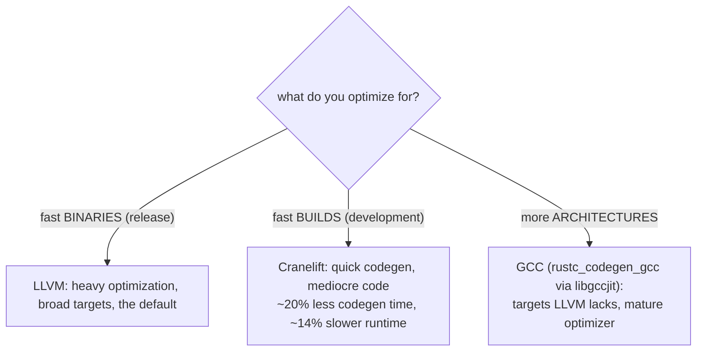
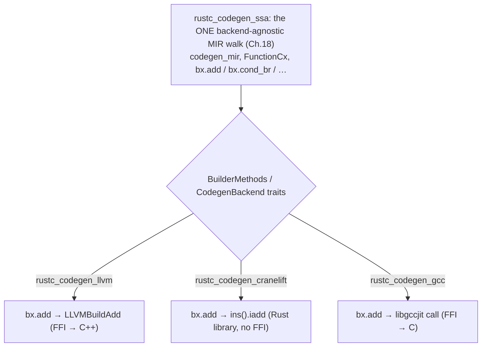
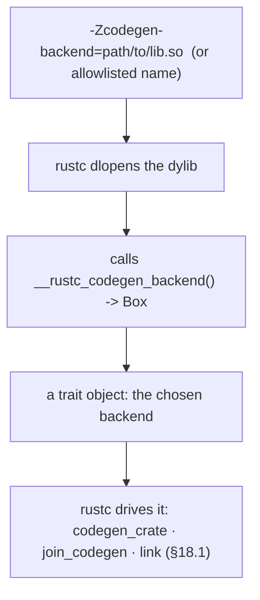
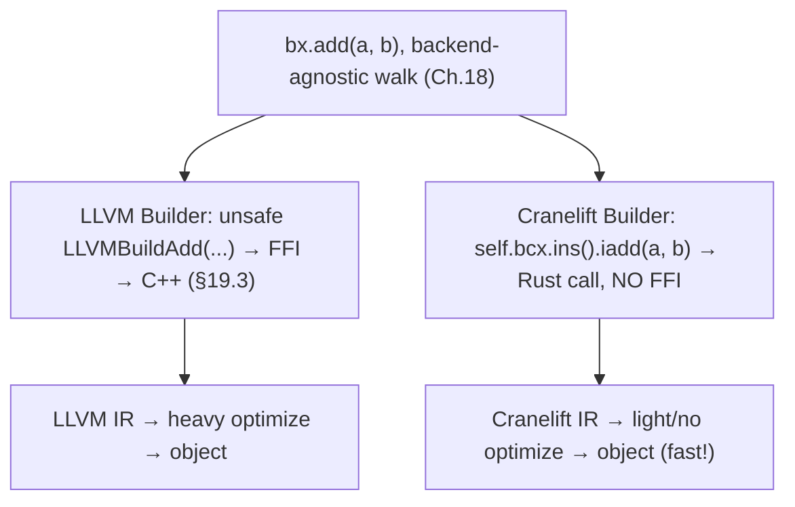
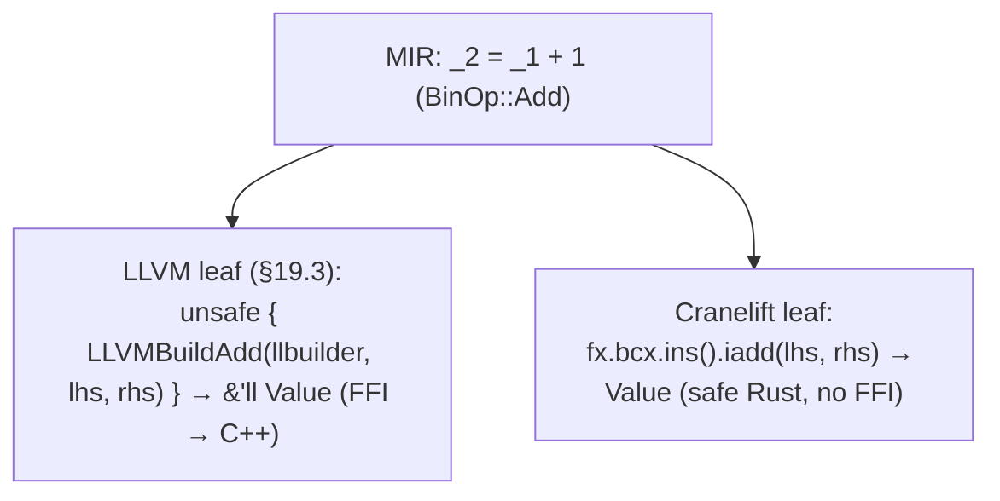
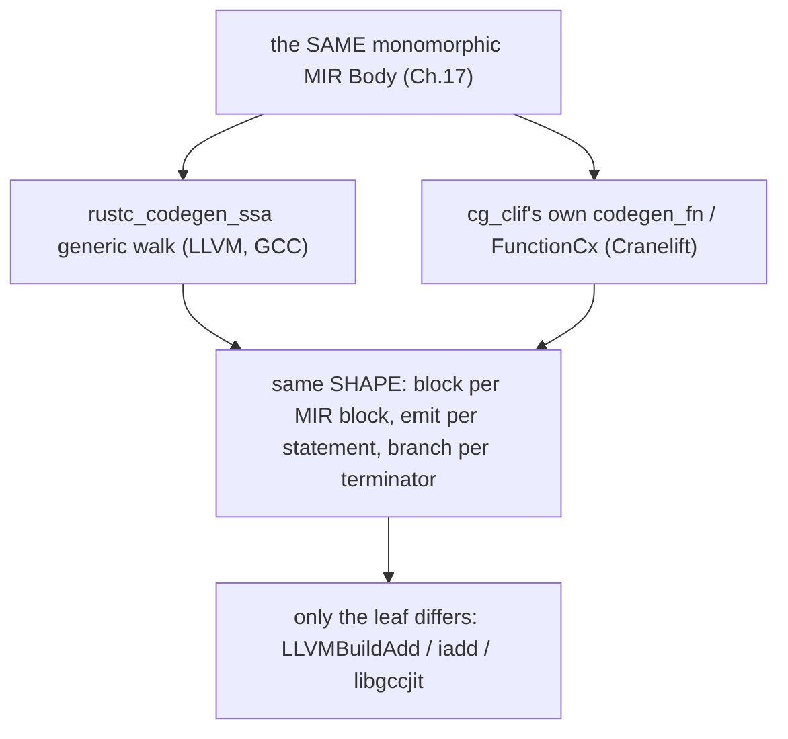
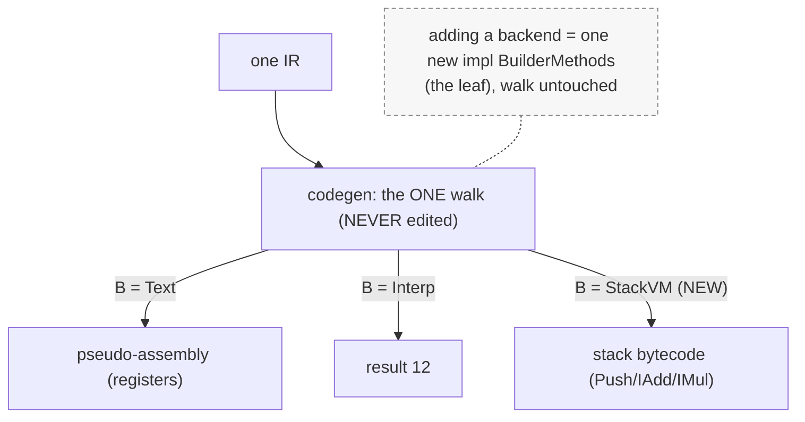

```admonish abstract title="What you'll learn"
- Why `rustc` ships three codegen backends and which axis each one wins on: LLVM for runtime speed of the output, `rustc_codegen_cranelift` for fast dev-build codegen, `rustc_codegen_gcc` (via `libgccjit`) for target coverage.
- How to switch a project's debug builds to Cranelift with two lines of `Cargo.toml` (`cargo-features = ["codegen-backend"]` and `[profile.dev] codegen-backend = "cranelift"`) plus the `rustc-codegen-cranelift-preview` rustup component.
- The two seams a backend plugs into and why their dispatch strategies differ: the dyn-safe top seam `CodegenBackend` loaded as a dylib via `-Zcodegen-backend` and the `__rustc_codegen_backend` export, versus the generic hot-loop seam `BuilderMethods` from `rustc_codegen_ssa`.
- How `rustc` resolves `-Zcodegen-backend` arguments by `.`-presence: a path goes through `load_backend_from_dylib`, a bare name scans the sysroot's `codegen-backends/` directory for `rustc_codegen_<name>`.
- Why cg_clif does *not* implement `BuilderMethods` and instead writes its own `FunctionCx` and `codegen_fn` walk in `compiler/rustc_codegen_cranelift/src/base.rs`, while `rustc_codegen_gcc` does implement the trait and reuses the shared [MIR](../glossary.md#mir) walk.
- How the same MIR `BinOp::Add` lowers two ways: LLVM's `unsafe { LLVMBuildAdd(...) }` FFI call versus Cranelift's safe `fx.bcx.ins().iadd(lhs, rhs)` through `codegen_int_binop` in `src/num.rs`, with `CValue`/`CPlace` playing the role of `OperandRef`/`PlaceRef`.
```

## 20.1 Alternative Backends: Cranelift and GCC

### Why a compiler would want more than one backend

LLVM is designed to **produce fast binaries**, not to **produce binaries fast**. For a release build that ships to users, "fast binaries" is exactly right, and LLVM's heavy optimization earns its compile-time cost. But during *development*, the edit, compile, run-the-tests loop you do hundreds of times a day, you mostly do not care how fast the resulting binary runs; you care how fast you get *back* to coding. The edit-compile-test loop demands fast codegen far more than fast output code. That demand is why alternative backends exist, and Chapter 18's swappable-code-generator abstraction is what makes building them tractable. This chapter covers the *other* backends that abstraction enables, the ones beyond the default LLVM of Chapter 19.

### Cranelift: produce binaries fast

The verified `rustc_codegen_cranelift` (often "cg_clif") is built on **Cranelift**, a code generator with a revealing origin: it was created for **wasmtime**, a WebAssembly runtime, where code must be generated *at runtime* (JIT) and so generation speed matters enormously. Cranelift is itself written **in Rust** (by the Bytecode Alliance), and its design priority follows from that origin: generate acceptable code quickly, since JIT codegen has no time for heavy optimization.

For `rustc`, this makes Cranelift the natural backend for **debug builds**. The current cg_clif Readme states the goal directly: "This has the potential to improve compilation times in debug mode." Reported measurements from earlier cg_clif blog posts have suggested roughly a 20% reduction in codegen time and a 14% slowdown in runtime versus LLVM for typical workloads; treat the exact figures as illustrative and remeasure on your own project, since the gap closes on both sides over time. For development, that trade is exactly right: faster iteration, slower (but who-cares) test binaries.

Its status: a **nightly preview**, distributed as the `rustc-codegen-cranelift-preview` rustup component (currently available on Linux x86_64/AArch64, macOS x86_64/AArch64, and Windows x86_64; Linux Riscv64 and s390x exist but you build them yourself), enabled per-project in `Cargo.toml`:

```toml
# Cargo.toml, use Cranelift for dev (debug) builds only.
# This line needs to come before anything else in Cargo.toml.
cargo-features = ["codegen-backend"]

[profile.dev]
codegen-backend = "cranelift"
```

It is the subject of an open Rust Project Goals item aiming to make cg_clif production-ready for local development and CI on Linux/macOS (x86_64 and aarch64), with Windows further out. A practical caveat confirmed in the current cg_clif Readme: unwinding on panics is "experimental and not supported on Windows and macOS, `-Cpanic=abort` is enabled by default." So if you use Cranelift on Windows or macOS your dev builds run with abort-on-panic; on Linux unwinding is opt-in via the `unwinding` feature. Cranelift is the answer to "I recompile constantly and want my edit-test loop fast."

### GCC: reach more hardware

The verified `rustc_codegen_gcc` is the second alternative, and its motivation is entirely different: **target coverage**. It routes Rust's codegen through **GCC's** backend (via `libgccjit`, GCC's library interface), and the reason to want it is that some architectures, older or more exotic CPUs, embedded targets, platforms where GCC is the only mature toolchain, are only reachable through GCC's backend. Where Cranelift trades runtime speed for compile speed, the GCC backend trades nothing about speed in particular; it extends *where Rust can run*. For a platform that has only a GCC port, `rustc_codegen_gcc` is the difference between Rust being available there and not. (It also benefits from GCC's own decades-mature optimizer, a different optimization character than LLVM's.) Like Cranelift, it is an in-progress, non-default backend.




### The abstraction pays off: same traits, different IR

The crucial point, and the partial vindication of Chapter 18, is that **the alternatives plug into the same architectural seams as LLVM**: both implement `rustc_codegen_ssa`'s `CodegenBackend` (the §18.1 dylib top seam), and the rustc-dev-guide notes that `rustc_codegen_ssa` still "contains a fair amount of code specific to the LLVM backend" (`src/doc/rustc-dev-guide/src/backend/codegen.md`), with the backend-agnostic refactor history showing roughly ten kLOC reused across LLVM and alternatives (`backend/backend-agnostic.md`). The hot-loop seam is where the picture splits. The GCC backend follows the §18.2 pattern, implementing `BuilderMethods`, so the entire backend-agnostic MIR walk of Chapter 18, `codegen_mir`, `FunctionCx`, `codegen_statement`, `codegen_terminator`, drives it unchanged, and only the leaf differs (`bx.add(a, b)` becomes a call into `libgccjit` instead of `LLVMBuildAdd`). Cranelift takes a different path: it reuses `rustc_codegen_ssa` for [monomorphization](../glossary.md#monomorphization) collection and driver scaffolding but writes its own per-function walk, calling Cranelift's instruction builder directly (`fx.bcx.ins().iadd(a, b)`) rather than going through a `BuilderMethods` trait method (§20.3 details the nuance). So the §18 abstraction's promise of one walk and three leaves is fully met by LLVM and GCC, and partially met by Cranelift, which uses the top seam but rolls its own inner loop because the shared core is still LLVM-shaped.

For LLVM and GCC, this is the §19.3 picture generalized: each backend's `Builder` is a thin layer implementing `BuilderMethods` over its own IR-building API. LLVM's calls C++ over FFI; GCC's calls `libgccjit` over FFI; the backend-agnostic code does not know or care which. Cranelift's `FunctionCx` plays the same *structural* role (a context holding a Cranelift `FunctionBuilder`), but it is plain code rather than a `BuilderMethods` impl, so the shared walk does not drive it; cg_clif's own walk does.




```admonish tip title="Pro-Tip, try Cranelift for your dev builds"
If you are on nightly Rust on Linux or macOS and your edit-test loop feels slow, switching debug builds to Cranelift is two lines in `Cargo.toml` (above) plus the rustup component, and it commonly shaves a meaningful chunk off codegen time, the part of compilation LLVM dominates, with *zero* change to your source. The catch: it is a preview, some crates using unsupported features won't build under it, and your test binaries run a bit slower (irrelevant for most test suites). Because it is scoped to `[profile.dev]`, your *release* builds still go through LLVM and ship optimized. Measure it on your project; the gain scales with how codegen-bound your build is.
```

```admonish warning title="Warning, alternative backends are not feature-complete"
"It compiles under LLVM" does not mean "it compiles under Cranelift/GCC." Both alternatives are works in progress, and each has a list of things it does not yet support (the verified Cranelift readme maintains an explicit "Not yet supported" section; inline assembly, certain SIMD intrinsics, some unwinding scenarios, and platform-specific features are the usual gaps). The consequence: a crate that builds cleanly under LLVM may fail under Cranelift or GCC, not because your code is wrong but because the backend hasn't implemented some construct yet. This is why they are *non-default previews*, why Cranelift is scoped to dev builds (where the blast radius of a missing feature is small), and why production and release builds stay on LLVM. The mental model: LLVM is the complete, reference backend; the others are specialized tools that cover *most* of the language for *specific* benefits (compile speed, target reach). Before relying on an alternative backend for anything load-bearing, check its support status for the features you use, and keep LLVM as the fallback, which the `[profile]`-scoped configuration makes trivial. Feature coverage, not just performance, is the axis on which these backends differ from LLVM.
```

### The general principle

A compiler's code generator is not one fixed thing but a *choice along several axes*: **runtime speed** of the output (LLVM wins), **compile speed** to produce it (Cranelift wins), and **target coverage** (LLVM is broad, GCC covers its own set). No single backend is best on all three, so a mature compiler benefits from being able to *pick*, release builds want runtime speed, dev builds want compile speed, exotic targets want coverage. Rust gets to make that choice per build because Chapter 18's abstraction decoupled the bulk of codegen from any one backend. The expensive, intricate MIR-lowering logic is written once, and the replaceable part, the leaf that emits instructions, is small enough that maintaining three of them is feasible. The project notes even mention reducing the LLVM-specific over-fitting in `rustc_codegen_ssa` to make the shared code serve all backends better, the abstraction improving *because* multiple backends exist to pull it straight.

### Where this leaves us

`rustc` has three codegen backends because code generation is a trade-off with no single winner. **LLVM** (default) optimizes hard, "produce fast binaries," at a compile-time cost. **Cranelift** (`rustc_codegen_cranelift`, written in Rust, born from wasmtime) inverts that, "produce binaries fast," generating mediocre code quickly, ~20% less codegen time for ~14% slower runtime, a nightly preview ideal for development builds (scoped via `[profile.dev] codegen-backend = "cranelift"`), and the subject of a production-ready project goal. **GCC** (`rustc_codegen_gcc` via `libgccjit`) extends Rust to architectures only GCC's toolchain reaches. All three implement the *same* §18 `BuilderMethods`/`CodegenBackend` traits and reuse `rustc_codegen_ssa`, so the entire backend-agnostic walk drives them unchanged, only the leaf differs (`bx.add` → `LLVMBuildAdd` / Cranelift `iadd` / `libgccjit`). The alternatives are non-default previews with incomplete feature coverage, so LLVM remains the reference; but the ability to pick a backend per build, trading runtime speed, compile speed, and target coverage, is the concrete payoff of Chapter 18's decoupling.

§20.2 takes the architecture deep-dive: how `rustc_codegen_cranelift` structures its `BuilderMethods` implementation over Cranelift's IR (and what differs from LLVM's, JIT origins, the lack of FFI, Cranelift's own SSA IR), how the backend is selected and loaded (`-Zcodegen-backend`, the dynamic-library plug-in mechanism), and where `rustc_codegen_gcc` fits. Then §20.3 reads a real Cranelift `BuilderMethods` method beside its LLVM counterpart, and §20.4 has you extend your §18.4 multi-backend layer with a third backend, feeling the abstraction absorb it.

## 20.2 The Architecture: How a Backend Plugs In

### Two seams, two dispatch strategies

A backend connects to `rustc` through two distinct seams, and they use opposite dispatch strategies for good reason. At the **top**, where `rustc` selects and loads an entire backend, the interface is a **trait object** (`dyn CodegenBackend`) loaded from a dynamic library, runtime-flexible, called rarely. In the **hot loop**, where the backend-agnostic walk emits millions of instructions, the interface is **generics** (`Bx: BuilderMethods`, §18.2), statically dispatched, monomorphized to direct calls (§19.3). Dynamic dispatch at the boundary; static dispatch in the inner loop. Understanding this split is understanding the architecture.

### The top seam: a pluggable dynamic library

`rustc` does not hard-code the set of backends; it can load one at *runtime* from a shared library. The verified mechanism is the `-Zcodegen-backend=<path>` flag: it points `rustc` at a `dylib` that must export a single function with a fixed signature:

```rust
// the plug-in contract (rustc_interface/src/util.rs)
use rustc_codegen_ssa::traits::CodegenBackend;

struct MyBackend;
impl CodegenBackend for MyBackend { /* codegen_crate, join_codegen, link, … (§18.1) */ }

// Rust ABI, NOT `extern "C"`: the loader's signature is
//   type MakeBackendFn = fn() -> Box<dyn CodegenBackend>;
// so rustc and the backend must share an rustc_driver version (else UB).
#[unsafe(no_mangle)]
pub fn __rustc_codegen_backend() -> Box<dyn CodegenBackend> {
    Box::new(MyBackend)
}
```

That is the entire contract for a new backend at the top level: be a `dylib`, export `__rustc_codegen_backend` (plain Rust-ABI `fn`, `#[unsafe(no_mangle)]`), return a boxed `dyn CodegenBackend`. `rustc` resolves the symbol via `load_symbol_from_dylib::<MakeBackendFn>(path, "__rustc_codegen_backend")`, calls the function, and gets a trait object it drives through the `CodegenBackend` interface (`codegen_crate`, `join_codegen`, `link`, §18.1). This is how the Cranelift backend plugs in: cg_clif lives in-tree but is built as a separate dylib excluded from the main workspace, and is consumed through `-Zcodegen-backend`. Cranelift is not compiled into `rustc`; it is a separate dylib loaded on demand. The flag accepts two forms, dispatched by whether the argument contains a `.`: a path (`-Zcodegen-backend=./libfoo.so` → `dlopen` directly) or a bare name (`-Zcodegen-backend=cranelift` → scan the sysroot's `codegen-backends/` directory for `rustc_codegen_cranelift` or `rustc_codegen_cranelift-<CFG_RELEASE>` with the platform's `lib`/`.so`/`.dll`/`.dylib` decoration, then `dlopen` that). Only `"llvm"` (gated on the `llvm` feature) and a built-in `"dummy"` are compiled into rustc itself; `"cranelift"` and `"gcc"` resolve through the sysroot scan, not a hardcoded allowlist. The currently unstable `-Zcodegen-backend` would be promoted to a `-C` flag on stabilization (the typical path for codegen-related `-Z` options) once the alternative backends are production-ready.




```admonish tip title="Pro-Tip, the dyn-at-the-top, generics-in-the-loop split"
It might look odd that `CodegenBackend` is a trait *object* (dynamic dispatch) while `BuilderMethods` is a generic *bound* (static dispatch), why not both the same? The answer is call frequency. `CodegenBackend`'s methods are called a handful of times per compilation (once to codegen the crate, once to link), so the cost of a virtual call and the flexibility of runtime loading is a pure win, it is what lets a backend be a separate, swappable dylib. `BuilderMethods`' methods are called *millions* of times (every instruction of every function), so they *must* be static, monomorphized, inlinable, a virtual call per emitted instruction would be a serious slowdown in the compiler itself. The architecture uses each dispatch strategy exactly where it pays: dynamic where flexibility matters and calls are rare, static where speed matters and calls are hot. When you design a plugin system with a performance-critical inner loop, this two-seam pattern, dyn boundary, generic core, is the template.
```

### Cranelift's implementation: Rust all the way down

The verified `rustc_codegen_cranelift` implements the **top seam** (the `CodegenBackend` dylib entry point above) but, unlike LLVM and GCC, does **not** implement `rustc_codegen_ssa`'s `BuilderMethods` (the §18.2 hot-loop seam): it writes its own per-function walk, with a `FunctionCx` holding `bcx: FunctionBuilder<'clif>` and `module: &'m mut dyn Module` as the structural analogue of §18.2's `Builder`. The defining difference from LLVM, regardless of seam choice, is that there is **no FFI**, because Cranelift is itself written in Rust (§20.1). When cg_clif lowers MIR's `BinOp::Add` on integers, it dispatches through `crate::num::codegen_int_binop`, a free function (not a trait method) that calls Cranelift's instruction-builder API directly:

```rust
// rustc_codegen_cranelift/src/num.rs (faithful, abridged)
// cg_clif does NOT implement BuilderMethods; free functions like this take
// `fx: &mut FunctionCx` and emit through `fx.bcx.ins()` directly.
pub(crate) fn codegen_int_binop<'tcx>(
    fx: &mut FunctionCx<'_, '_, 'tcx>,
    bin_op: BinOp,
    in_lhs: CValue<'tcx>,
    in_rhs: CValue<'tcx>,
) -> CValue<'tcx> {
    let lhs = in_lhs.load_scalar(fx);
    let rhs = in_rhs.load_scalar(fx);
    let b = fx.bcx.ins();
    let val = match bin_op {
        BinOp::Add | BinOp::AddUnchecked => b.iadd(lhs, rhs), // ← integer add: a plain Rust call,
        BinOp::Sub | BinOp::SubUnchecked => b.isub(lhs, rhs), //   no `unsafe`, no FFI
        BinOp::Mul | BinOp::MulUnchecked => b.imul(lhs, rhs),
        // BitAnd, BitOr, BitXor, Shl, Shr, Div, Rem, …
        _ => unreachable!(),
    };
    CValue::by_val(val, in_lhs.layout())
}
```

Compare directly to §19.3: where LLVM's `add` was `unsafe { LLVMBuildAdd(...) }` crossing into C++, cg_clif's is `fx.bcx.ins().iadd(lhs, rhs)`, a safe Rust method call into a Rust library. The values here are Cranelift's own `Value` type (a Rust handle, not an FFI pointer); contrast with LLVM's `&'ll Value` (§19.2). Cranelift has its own **SSA IR**, typed, with blocks and values, the same family as [LLVM IR](../glossary.md#llvm-ir) (§19.1), built through its `FunctionBuilder`. The structural difference users feel: Cranelift does *little* optimization (its quick-codegen design, §20.1), so there is no heavyweight equivalent of LLVM's `back::write::optimize` pass pipeline; Cranelift lowers to machine code almost directly, which is *why* it is fast. Object files come out via the `cranelift-object` library (confirmed in cg_clif's `Cargo.toml`).




### GCC's implementation: FFI to libgccjit

The verified `rustc_codegen_gcc` plugs in the same way at the top (a `CodegenBackend` dylib) but, like LLVM, talks to a C library over **FFI**, specifically `libgccjit`, GCC's library interface for programmatic code generation. Its `Builder` methods call `libgccjit` functions to build GCC's internal representation, which GCC then optimizes (with its own mature, decades-old optimizer, a different character than LLVM's) and lowers to machine code for whatever architecture GCC targets. So GCC's backend resembles LLVM's *architecturally* (thin `BuilderMethods` wrappers over an FFI to a C/C++optimizing backend) while serving the different goal of §20.1: target coverage. The contrast across the three is clean, LLVM and GCC are FFI bridges to external optimizing C/C++ backends; Cranelift is a native-Rust quick code generator with no FFI.

### The shared core, and the LLVM over-fit

All three implementations sit on the *same* `rustc_codegen_ssa` (Chapter 18), the backend-agnostic MIR walk, `FunctionCx`, the trait definitions. This is the architectural payoff stated concretely: a new backend writes a `CodegenBackend` impl (the dylib entry) and a `BuilderMethods`/`CodegenMethods` impl (the hot-loop leaf), and inherits *everything else*, monomorphization collection (Chapter 17), the MIR walk (Chapter 18), the per-[CGU](../glossary.md#cgu) parallel structure, for free. But the rustc-dev-guide's caveat is honest: `rustc_codegen_ssa` still "contains a fair amount of code specific to the LLVM backend" (`src/doc/rustc-dev-guide/src/backend/codegen.md`). The abstraction was *extracted from* the LLVM backend (the §19.2 traitification history), so it inherited LLVM-shaped assumptions, and part of the ongoing alternative-backend work (the §20.1 project goal) is straightening those out, making the shared core truly neutral. The abstraction improves precisely because more than one backend now exercises it; a second and third implementation reveal where the "agnostic" layer was secretly LLVM-specific.

```admonish warning title="Warning, a backend is selected at build-configuration time"
A backend applies to a whole compilation; you cannot mix backends within one binary's codegen. The `-Zcodegen-backend` choice (or the `[profile.dev] codegen-backend` setting) selects *one* backend for the entire compilation of a crate, every codegen unit goes through the same backend. You cannot, for instance, codegen the hot functions with LLVM and the cold ones with Cranelift in a single build. The selection is per-*profile* (dev vs release) and per-*compilation*, which is why the standard pattern is "Cranelift for `[profile.dev]`, LLVM for release", the *profile* switches the whole backend, not individual functions. A subtler consequence: because the backend is chosen before codegen and applies uniformly, a feature unsupported by your chosen backend (§20.1's coverage gaps) fails the *whole* build, not just the offending function, there is no per-function fallback to LLVM. This is the right model (mixing object code from different codegen backends raises ABI and optimization-boundary hazards), but it means committing to a backend's full feature coverage for everything in that compilation. Plan backend choice at the profile level, and keep release on the reference backend.
```

### How this builds, and what is next

A backend connects to `rustc` through **two seams with opposite dispatch**. The **top seam** is a runtime-pluggable `dyn CodegenBackend` trait object: a backend is a `dylib` exporting `#[unsafe(no_mangle)] __rustc_codegen_backend() -> Box<dyn CodegenBackend>`, loaded via `-Zcodegen-backend` (with allowlisted names, `cranelift`/`gcc`/`llvm`, the stable plan) and driven through `codegen_crate`/`join_codegen`/`link`, dynamic dispatch, called rarely, maximally flexible. The **hot-loop seam** is the generic `BuilderMethods` (§18.2), statically dispatched and monomorphized, called per instruction, maximally fast. **Cranelift**'s implementation wraps its Rust `FunctionBuilder` (`bx.add` → `self.bcx.ins().iadd`, a plain Rust call, **no FFI**, its own SSA IR, little optimization hence fast). **GCC**'s wraps `libgccjit` over FFI (like LLVM, an external optimizing C backend, for target coverage). All three reuse `rustc_codegen_ssa`, writing only the `CodegenBackend` entry and the `BuilderMethods` leaf, though that shared core is still being de-LLVM-ified as the alternatives exercise it. Backend choice is per-profile and per-compilation, uniform across all codegen units, with no per-function mixing.

§20.3 reads real code side by side: the Cranelift backend's `BuilderMethods::add` (and a terminator) next to LLVM's §19.3 version, making the "same trait, different leaf" concrete, one a safe Rust call, one an `unsafe` FFI call, both driven by the identical Chapter 18 walk. Then §20.4 has you extend the §18.4 multi-backend codegen layer with a *third* backend, watching the unchanged walk absorb it, the abstraction's promise, demonstrated by you adding to it.

## 20.3 Reading the Source: The Same Operation, Two Backends

### `_1 + 1`, in two languages of instruction

§19.3 read LLVM's `add` as `unsafe { LLVMBuildAdd(...) }`, a call across FFI into C++. This section reads the *same* MIR operation, `_2 = _1 + 1`, lowered by the Cranelift backend, and sets the two side by side. The MIR is identical; the leaf that emits the instruction is not. The source lives in `rustc_codegen_cranelift`'s `src/num.rs` (the binary-op dispatch), `src/base.rs` (the per-function walk and terminators), and `src/value_and_place.rs` (the `CValue`/`CPlace` definitions).

### Cranelift's `add`: a safe Rust call

In the Cranelift backend, lowering an integer addition dispatches from `Rvalue::BinaryOp` in `base.rs` to `crate::num::codegen_binop` and then `codegen_int_binop`, which calls Cranelift's instruction builder for the chosen op. The Add arm, zoomed in (faithful, abridged from the real `codegen_int_binop`):

```rust
// rustc_codegen_cranelift/src/num.rs (codegen_int_binop, BinOp::Add arm)
// lowering BinOp::Add on integers: load the operands and emit a Cranelift `iadd`
let lhs = in_lhs.load_scalar(fx); // CValue → a Cranelift Value
let rhs = in_rhs.load_scalar(fx);
// ← Cranelift FunctionBuilder: emit an integer add
let res = fx.bcx.ins().iadd(lhs, rhs);
CValue::by_val(res, in_lhs.layout()) // wrap the result Value back into a CValue
```

`fx.bcx` is Cranelift's `FunctionBuilder` (the §20.2 IR builder); `.ins()` returns its instruction-inserter; `.iadd(lhs, rhs)` appends an integer-add instruction to the current block and returns the result `Value`. Now set it against §19.3's LLVM:

```rust
// LLVM  (§19.3): unsafe { llvm::LLVMBuildAdd(self.llbuilder, lhs, rhs, UNNAMED) } // FFI → C++
// Cranelift: fx.bcx.ins().iadd(lhs, rhs) // safe Rust call
```

Same MIR `BinOp::Add`. The LLVM leaf is an `unsafe` foreign-function call returning an `&'ll Value` (an FFI pointer into C++ memory, §19.2); the Cranelift leaf is a *safe* Rust method call returning a Cranelift `Value` (a plain Rust handle). No `unsafe`, no FFI, no `'ll` lifetime, because Cranelift *is* Rust (§20.1). The §18.2 abstraction's `Bx::Value` is, here, Cranelift's `Value`; there, LLVM's `&'ll Value`. Two concrete types behind one abstract one.




### The CValue/CPlace wrappers: Cranelift's operand-vs-place

Note `CValue` and `load_scalar` above. Cranelift's backend has its own analogue of the §18.2 `OperandRef`/`PlaceRef`: a verified `CValue` (a value, held in a register/SSA value, or by reference) and `CPlace` (a place, a memory location or a variable). `in_lhs.load_scalar(fx)` is "get this `CValue` as a single Cranelift `Value`," exactly as LLVM's backend turns an `OperandRef` into an `&'ll Value`. The §18.2 immediate-vs-memory distinction (`LocalRef::Operand` vs [`Place`](../glossary.md#place)) recurs here under different names, every backend needs it, because every backend must decide what lives in a register and what lives in memory.

### Cranelift's terminators: `jump`, `brif`, `return_`

The terminator lowering mirrors §19.3's structure with Cranelift's vocabulary. A `Goto` becomes `fx.bcx.ins().jump(target_block, &[])`; a two-way `SwitchInt` becomes a conditional branch (`brif`, branch-if, to two blocks; multi-way switches dispatch through `cranelift_frontend::Switch::emit` instead); a `Return` is emitted by `crate::abi::codegen_return(fx)` (which itself ends in a `fx.bcx.ins().return_(&[ret_val])`). Side by side with §19.3:

```text
MIR terminator        LLVM (§19.3)              Cranelift
─────────────────     ────────────────────      ──────────────────────────
Goto { target }       LLVMBuildBr               fx.bcx.ins().jump(block, &[])
SwitchInt (2-way)     LLVMBuildCondBr           fx.bcx.ins().brif(cond, then, &[], else, &[])
Return                LLVMBuildRet              fx.bcx.ins().return_(&[val])
```

The §14.3 `if`-fork-to-`SwitchInt`, then §18.3's `SwitchInt`-to-builder-call, here bottoms out in `brif` instead of `LLVMBuildCondBr`, but it is the *same* MIR `SwitchInt` driving it, the same fork-and-join structure (§14.3), the same two target blocks. Only the instruction-emitting verb changed.

### An honest nuance: cg_clif's own walk

Here the picture has a wrinkle worth being precise about, because it is exactly the §20.2 "still LLVM-shaped" caveat made concrete. The `rustc_codegen_cranelift` backend reuses *parts* of `rustc_codegen_ssa`, [`MonoItem`](../glossary.md#monoitem) collection (Chapter 17), driver scaffolding, much shared infrastructure, but its per-function MIR walk is its *own* code: a `codegen_fn` and a Cranelift-specific `FunctionCx` (note the `fx: &mut FunctionCx` in `codegen_stmt(fx, cur_block, stmt)`), rather than driving through `rustc_codegen_ssa`'s generic `FunctionCx`/`codegen_mir` (§18.2). Why? Because, as the Cranelift team noted (§20.2), the "backend-agnostic" walk is still over-fit to LLVM in places, and Cranelift's JIT-derived model differs enough that writing its own walk was easier than bending the shared one. So the abstraction's reuse is real but *partial*: the `CodegenBackend` top seam, monomorphization collection (Chapter 17), and driver scaffolding are shared, while the entire per-function lowering, the very `BuilderMethods` seam the §18.2 abstraction was built around, is cg_clif's own code rather than a trait impl. This is the truth behind §20.2's caveat, the ideal (every backend drives the identical walk, only the leaf differing) is the *direction*, and LLVM and GCC are closer to it than Cranelift, whose independent walk is both a pragmatic choice and one of the things the "production-ready" project goal (§20.1) aims to reduce by making the shared core more neutral.

But the *shape* is identical regardless of code sharing: take the same MIR `Body`, create a backend block per MIR block, visit each statement emitting instructions, visit the terminator emitting a branch, whether through `rustc_codegen_ssa`'s generic walk (LLVM, GCC) or cg_clif's own (Cranelift), the algorithm is the Chapter 18 algorithm. The verified `codegen_stmt` even handles `StorageLive`/`StorageDead` by doing nothing ("Those are not very useful"), the same no-op decision LLVM's backend makes (§18.3), reached independently.




```admonish tip title="Pro-Tip, when an abstraction is partial"
The shared *shape* matters more than the shared *code*. Cranelift duplicating the per-function walk could look like the abstraction failing, if everyone reimplements the walk, what was the point? But notice what *is* shared and what the duplication costs. Shared: the MIR input (one representation all backends consume), the `BuilderMethods` vocabulary, monomorphization, partitioning, the driver. Duplicated: a few hundred lines of "visit blocks, emit instructions." The expensive, correctness-critical, slowly-evolving parts (everything before codegen) are shared once; the cheap, mechanical, backend-shaped part is occasionally rewritten. That is still a huge win, the alternative (each backend reimplementing type-checking, borrow-checking, monomorphization) is unthinkable. The lesson for your own designs: a decoupling boundary does not have to be *perfectly* clean to be valuable. If the hard 90% is shared and only the easy 10% is sometimes duplicated, the abstraction is doing its job.
```

```admonish warning title="Warning, Cranelift emits nearly straight to machine code"
Do not expect LLVM-quality output or LLVM-style optimization behavior. §20.2 noted Cranelift does little optimization; the source shows why it matters in practice. There is no Cranelift equivalent of the LLVM pass pipeline (§19.3's `LLVMRustOptimize`), `iadd` and the rest lower almost directly to machine instructions. The consequences are concrete: code that *relies* on LLVM optimizing away an abstraction (a zero-cost iterator chain compiling to a tight loop, an `inline` collapsing call overhead) may *not* get that treatment under Cranelift, the abstraction's runtime cost, which LLVM erases, can survive. This is fine for debug builds (you are not measuring performance) but it means **micro-benchmarks run under Cranelift are meaningless as a guide to release performance**, and behavior that *depends* on optimization (rare, but it happens, e.g. tail-call-like patterns that LLVM turns into loops) can differ. The discipline: use Cranelift to compile fast, not to measure speed; never benchmark on a Cranelift build and conclude anything about your shipped (LLVM) binary. The backends are not interchangeable for *performance reasoning*, only for *producing a working binary*.
```

### How this builds, and what is next

We have read the same MIR operation lowered two ways. `_2 = _1 + 1`'s `BinOp::Add` becomes, in LLVM, `unsafe { LLVMBuildAdd(...) }` (an FFI call returning an `&'ll Value`); in Cranelift, `fx.bcx.ins().iadd(lhs, rhs)` (a *safe* Rust call into Cranelift's `FunctionBuilder`, returning a plain Cranelift `Value`, no FFI, no `unsafe`). Cranelift has its own `CValue`/`CPlace` wrappers (its `OperandRef`/`PlaceRef`, §18.2) and lowers terminators with its own verbs (`jump`, `brif`, `return_` vs LLVM's `LLVMBuildBr`/`CondBr`/`Ret`). An honest nuance: cg_clif reuses much of `rustc_codegen_ssa` but writes its **own per-function walk** (`codegen_fn`/its `FunctionCx`) because the shared core is still LLVM-shaped (§20.2), so reuse is real but partial, and the *shape* (block per block, emit per statement, branch per terminator) is identical even where the *code* is not. Cranelift does almost no optimization, emitting near-directly to machine code, fast to compile, not LLVM-quality, so never use it to reason about release performance.

§20.4 closes the chapter with a build. You will take the §18.4 multi-backend codegen layer (the abstract `BuilderMethods` trait and the walk written once against it) and add a *third* backend, proving, by extension, the architecture's promise: the unchanged walk absorbs a new backend that emits in a different "instruction language." You will feel what it is to be the person adding Cranelift-or-GCC to a working `rustc_codegen_ssa`, implement the leaf, inherit the walk.

## 20.4 Hands-On Lab: Add a Third Backend

### Proving the abstraction by extending it

The truest test of a swappable-backend architecture is this: can you add a *new* backend without touching the code that drives it? In §18.4 you built a backend-agnostic codegen layer, a `BuilderMethods` trait and a `codegen_function` walk written *once* against it, and two backends (a text emitter and an interpreter). This lab adds a **third** backend, a stack-machine bytecode emitter, and runs the *same, unchanged* walk through all three. The lab mirrors what adding the **GCC backend** required of `rustc_codegen_ssa`: implement the leaf as a `BuilderMethods` impl, reuse the walk. (Cranelift, as §20.3's honest nuance covered, does *not* use the §18.2 hot-loop seam at all; it writes its own per-function walk. The extension exercises below let you reshape Backend #3 into the cg_clif structure once the trait-impl analogue is in hand.)

We extend the §18.4 code. (If you did not build it, the trait and walk are reproduced compactly below.) We strip §18.4's `Block`, `cond_br`, `arg`, `new_block`, and `position_at` to keep the third-backend point uncluttered; the §18.4 trait kept those because real `BuilderMethods` has them, and `rustc_codegen_ssa` names the trait `BuilderMethods<'a, 'tcx>` (we drop the lifetimes for compactness).

`cargo new`, pure `std`.

### Recap: the trait and the walk (unchanged from §18.4)

The abstract interface and the single generic walk, *this code does not change when we add a backend*:

```rust
// src/main.rs, the §18.4 interface and walk, verbatim (the part we DON'T touch)

trait BuilderMethods {
    type Value: Clone;
    fn const_int(&mut self, n: i64) -> Self::Value;
    fn add(&mut self, a: Self::Value, b: Self::Value) -> Self::Value;
    fn mul(&mut self, a: Self::Value, b: Self::Value) -> Self::Value;
    fn ret(&mut self, v: Self::Value);
}

// a tiny IR (one straight-line block)
// operands index prior results
enum Op { Const(i64), Add(usize, usize), Mul(usize, usize), Ret(usize) }

// the ONE generic walk (the codegen_function analogue, §18.4)
fn codegen<B: BuilderMethods>(bx: &mut B, ir: &[Op]) {
    let mut vals: Vec<B::Value> = vec![];
    for op in ir {
        match op {
            Op::Const(n)  => { let v = bx.const_int(*n); vals.push(v); }
            Op::Add(a, b) => { let v = bx.add(vals[*a].clone(), vals[*b].clone()); vals.push(v); }
            Op::Mul(a, b) => { let v = bx.mul(vals[*a].clone(), vals[*b].clone()); vals.push(v); }
            Op::Ret(a)    => bx.ret(vals[*a].clone()),
        }
    }
}
```

### The two existing backends (compact, from §18.4)

```rust
// Backend #1: text emitter (Value = register name)
struct Text { n: usize, out: Vec<String> }
impl BuilderMethods for Text {
    type Value = String;
    fn const_int(&mut self, n: i64) -> String { let r = format!("%{}", self.n); self.n += 1; self.out.push(format!("{r} = const {n}")); r }
    fn add(&mut self, a: String, b: String) -> String { let r = format!("%{}", self.n); self.n += 1; self.out.push(format!("{r} = add {a}, {b}")); r }
    fn mul(&mut self, a: String, b: String) -> String { let r = format!("%{}", self.n); self.n += 1; self.out.push(format!("{r} = mul {a}, {b}")); r }
    fn ret(&mut self, v: String) { self.out.push(format!("ret {v}")); }
}

// Backend #2: interpreter (Value = i64)
struct Interp { result: Option<i64> }
impl BuilderMethods for Interp {
    type Value = i64;
    fn const_int(&mut self, n: i64) -> i64 { n }
    fn add(&mut self, a: i64, b: i64) -> i64 { a + b }
    fn mul(&mut self, a: i64, b: i64) -> i64 { a * b }
    fn ret(&mut self, v: i64) { self.result = Some(v); }
}
```

### The NEW third backend: a stack-machine bytecode emitter

This is the lab's point. We add a backend that targets a **stack machine**, like WebAssembly or the JVM, where instructions push and pop a value stack rather than naming registers. Its `Value` is `()` (the stack is implicit; values are positional), and it emits a `Vec<Bytecode>`. This flavor is *as different* from the text emitter and interpreter as Cranelift's `iadd` is from LLVM's `LLVMBuildAdd`, yet it implements the identical trait:

```rust
// Backend #3: stack-machine bytecode (NEW, the only code we add)
#[derive(Debug)]
enum Bytecode { Push(i64), IAdd, IMul, Return }

struct StackVM { code: Vec<Bytecode> }
impl BuilderMethods for StackVM {
    // values live on the implicit stack, not in named handles
    type Value = ();
    fn const_int(&mut self, n: i64) { self.code.push(Bytecode::Push(n)); }
    // pops 2, pushes sum
    fn add(&mut self, _a: (), _b: ()) { self.code.push(Bytecode::IAdd); }
    // pops 2, pushes product
    fn mul(&mut self, _a: (), _b: ()) { self.code.push(Bytecode::IMul); }
    fn ret(&mut self, _v: ()) { self.code.push(Bytecode::Return); }
}
```

That is the *entire* addition, one enum and one `impl BuilderMethods`. The `codegen` walk above is untouched. (Note: this backend assumes the IR's operand order matches stack order, true for our straight-line examples; a real stack-machine backend would emit loads/dups to reorder, an extension.)

### Running the same walk through all three

```rust
fn main() {
    // IR for (5 + 1) * 2:
    //   0: const 5   1: const 1   2: add 0,1   3: const 2   4: mul 2,3   ret 4
    let ir = vec![
        Op::Const(5), Op::Const(1), Op::Add(0, 1), Op::Const(2), Op::Mul(2, 3), Op::Ret(4),
    ];

    let mut t = Text { n: 0, out: vec![] };
    codegen(&mut t, &ir); // SAME walk
    println!("=== Backend #1: TEXT ===");
    for line in &t.out { println!("  {line}"); }

    let mut i = Interp { result: None };
    codegen(&mut i, &ir); // SAME walk
    println!("\n=== Backend #2: INTERPRETER ===\n  result = {}", i.result.unwrap());

    let mut s = StackVM { code: vec![] };
    codegen(&mut s, &ir); // SAME walk, NEW backend
    println!("\n=== Backend #3: STACK BYTECODE ===");
    for op in &s.code { println!("  {op:?}"); }
}
```

````admonish example title="Expected output" collapsible=true
```text
=== Backend #1: TEXT ===
  %0 = const 5
  %1 = const 1
  %2 = add %0, %1
  %3 = const 2
  %4 = mul %2, %3
  ret %4

=== Backend #2: INTERPRETER ===
  result = 12

=== Backend #3: STACK BYTECODE ===
  Push(5)
  Push(1)
  IAdd
  Push(2)
  IMul
  Return
```
````

The same codegen call drove three backends; adding the third required only the new `impl BuilderMethods`. The *same* `codegen(&mut bx, &ir)` produced register-based pseudo-assembly (Backend #1), a computed result (Backend #2), and stack-machine bytecode (Backend #3), three completely different "instruction languages," from one unchanged driver. Adding Backend #3 meant writing *only* the leaf: an `enum Bytecode` and an `impl BuilderMethods for StackVM`. This matches what adding the **GCC backend** to `rustc` is (§20.2/§20.3): the `BuilderMethods` leaf differs (`libgccjit` calls vs `LLVMBuildAdd` vs, here, `Bytecode::IAdd`), and the backend-agnostic walk, `codegen_function` here, `rustc_codegen_ssa`'s walk there, drives all of them. Cranelift's choice (writing its own walk, not implementing the trait) is the variant Extension #2 below has you build.




### Step 2: a `dyn` top seam (the chapter's central beat)

Backend #3 proved the §18 hot-loop seam absorbs another leaf. Now try the *other* seam, the §20.2 top-level `dyn CodegenBackend` boundary, and feel why two seams exist. The natural first attempt is "pick a backend by name at runtime":

```rust
// the naive attempt: select a backend from a string flag, like -Zcodegen-backend
fn select_backend(name: &str) -> Box<dyn BuilderMethods> { /* … */ }
```

It does not compile. `BuilderMethods` has an associated type `Value`, so `dyn BuilderMethods` is not object-safe; the compiler asks *which* `Value` you mean, and `Box<dyn BuilderMethods>` has no answer. This is exactly the problem `rustc_codegen_ssa` solves by splitting the seams: `CodegenBackend` (the top seam, §20.2) is dyn-safe because its signatures hide the per-backend `Value`/`BasicBlock` types behind `Box<dyn Any>` returns; `BuilderMethods` (the hot-loop seam) keeps the associated type so the inner loop monomorphizes to direct calls (§19.3). Dynamic dispatch where calls are rare and types must hide; static dispatch where calls are hot.

Make it work with a dyn-safe driver:

```rust
// a dyn-safe top-level seam: hides B::Value behind an opaque driver method
trait CodegenDriver {
    fn run(&mut self, ir: &[Op]) -> String; // returns a printable summary
}

impl<B: BuilderMethods + Default> CodegenDriver for B
where
    B: BackendReport, // a small helper trait each backend implements to summarize itself
{
    fn run(&mut self, ir: &[Op]) -> String {
        codegen(self, ir);    // the SAME §18.4 walk, monomorphized at the inner trait
        self.report()
    }
}

trait BackendReport { fn report(&self) -> String; }
// impl BackendReport for Text { … }   joins the lines
// impl BackendReport for Interp { … } prints the result
// impl BackendReport for StackVM { … } prints the bytecode

fn select_backend(name: &str) -> Box<dyn CodegenDriver> {
    match name {
        "text"    => Box::new(Text { n: 0, out: vec![] }),
        "interp"  => Box::new(Interp { result: None }),
        "stack"   => Box::new(StackVM { code: vec![] }),
        _         => panic!("unknown backend: {name}"),
    }
}

// main now picks the backend by string, like `-Zcodegen-backend`:
let mut bx = select_backend("stack");
println!("{}", bx.run(&ir));
```

`CodegenDriver` is the lab's miniature `CodegenBackend`: it is dyn-safe because its signature returns a concrete `String`, not the per-backend `B::Value`. The driver's `run` *body* still calls the generic `codegen<B>` walk, so the inner loop stays monomorphized and inlinable. That is the §20.2 split in 30 lines: a `dyn` boundary where flexibility matters and calls are rare, generics in the loop where speed matters and calls are hot. The reason the two seams in `rustc_codegen_ssa` look different is not historical accident; it is what falls out the moment you try to load a backend by name.

### What the lab stripped from real rustc

The lab proved a third backend slots into an unchanged walk. What `[rustc_codegen_ssa/src/mir/mod.rs](https://github.com/rust-lang/rust/blob/1.95.0/compiler/rustc_codegen_ssa/src/mir/mod.rs)` and `[rustc_codegen_cranelift/src/common.rs](https://github.com/rust-lang/rust/blob/1.95.0/compiler/rustc_codegen_cranelift/src/common.rs)` add on top of one generic `fn codegen<B: BuilderMethods>(bx: &mut B, ir: &[Op])` driving all three lab backends:

- There are *two* `FunctionCx` shapes in tree, not one: `rustc_codegen_ssa`'s generic driver for LLVM, and cg_clif's own per-function walk. The §20.3 honest nuance is that cg_clif had to write its own because the shared core is LLVM-shaped; the lab's walk is uniform only because the lab has one IR.
- cg_clif's `FunctionCx` holds `bcx: FunctionBuilder<'clif>` (a Cranelift builder, no FFI), a `'clif` lifetime tying it to a Cranelift function, a `Module` trait for emitter dispatch, and `CValue`/`CPlace` operand-vs-place wrappers (cg_clif's `OperandRef`/`PlaceRef`). The lab's `StackVM` is a flat `Vec<Bytecode>`.
- The per-instruction call is asymmetric across backends: LLVM does `unsafe { llvm::LLVMBuildAdd(...) }` returning `&'ll Value`; Cranelift does the *safe* `fx.bcx.ins().iadd(lhs, rhs)` returning a Cranelift `Value` checked by the SSA verifier; GCC routes through `libgccjit`. The lab pushes a `Bytecode::IAdd`.
- `-Zcodegen-backend=cranelift` loads `librustc_codegen_cranelift.so` (or `-<CFG_RELEASE>` variant, platform-decorated) at runtime by scanning the sysroot's `codegen-backends/` directory, then `dlopen`ing and resolving the no-mangle `fn() -> Box<dyn CodegenBackend>` symbol `__rustc_codegen_backend` through the dyn-safe `CodegenBackend` top seam. The lab picks its backend statically by which `Builder` impl you instantiate.
- cg_clif's current Readme lists the gaps explicitly: SIMD is partial (`std::simd` fully works, `std::arch` is partially supported), and unwinding on panics is experimental and unsupported on Windows/macOS (so `-Cpanic=abort` is the default). Inline asm is further constrained inside cg_clif's own walk (rejecting `MAY_UNWIND` and label-bearing assembly, per `base.rs`). So some crates fail under it; this is the real shape of the partial-backend exercise.
- Real `BuilderMethods` factors its associated types into a supertrait `BackendTypes` (`Value`, `BasicBlock`, `Type`, `Function`, `Funclet`, plus three debug-info handles), and the lab keeps only `Value`. The split exists so `CodegenMethods` and `BuilderMethods` can share the same `Value`/`BasicBlock` types without re-declaring them; the lab's lone `type Value` is a stand-in for that whole family.

The Chapter 18 abstraction holds in all three; the §20.3 "code is different even when the shape is identical" is what the lab makes literal.

### Extension exercises

1. **A partial backend (coverage gaps).** Add a backend that supports `add` but `panic!`s on `mul` ("unsupported"), mirroring §20.1's real coverage gaps, then observe that a program using `mul` fails under it but not under the others, exactly as a crate using inline asm fails under Cranelift. This makes the §20.2 "feature coverage differs" warning concrete.
2. **The Cranelift shape (its own walk, no trait impl).** Reshape Backend #3 so it does *not* implement `BuilderMethods`. Write a parallel `fn codegen_stack(cx: &mut StackVM, ir: &[Op])` that walks the IR itself and emits bytecode, then call it directly instead of through the generic `codegen<B>`. The driver picks between "generic walk for Text/Interp" and "stack walk for StackVM". This is cg_clif's actual choice (§20.3): the top seam is shared, the per-function walk is the backend's own. You will feel exactly how much duplication that costs and what it buys (no LLVM-shaped assumption in the walk).
3. **Real stack reordering.** Make `StackVM` correct for non-straight-line IR: when operands are not in stack order, emit `Dup`/`Swap`/local-slot loads. This is the genuine work a Wasm/JVM backend does that a register backend does not, the same MIR, a structurally different lowering.
4. **Wire to your optimizer.** Run the §16.4 / §19.4 constant-folder over the IR *before* `codegen`, and watch all three backends emit the folded result (`Push(12); Return` for the StackVM). Optimize once, emit three ways.
5. **A real plug-in dylib.** Move Backend #3 into its own crate, expose `#[unsafe(no_mangle)] pub fn __my_backend() -> Box<dyn CodegenDriver>` (the dyn-safe top seam from Step 2), and write a 30-line `dlopen` loader. This is the §20.2 top seam in miniature: a separate crate loaded at runtime, driven through a `dyn` boundary, exactly the shape `-Zcodegen-backend=cranelift` resolves.
6. **Type-routed dispatch (the missing middle layer).** Extend `Op::Const` into `Op::ConstInt(i64)` and `Op::ConstFloat(f64)`, give the trait both `add` (integer) and `fadd` (float), and tag each Add op with its operand type so the walk picks the right leaf. The `codegen` walk now grows a small `match` that inspects the type before calling `bx.add` or `bx.fadd`, a typing decision *before* the leaf. That match is the shape of rustc's `rustc_codegen_ssa::mir::rvalue::codegen_scalar_binop@59807616e1fa`, which routes `BinOp::Add` to `bx.add` for ints, `bx.fadd` for floats, and `bx.unchecked_sadd` / `bx.unchecked_uadd` for `AddUnchecked`; once you have written your own three-arm match you will recognise the 200+ lines of type-driven dispatch real rustc does before any builder call.

### Where Chapter 20 leaves us

Chapter 20 is complete. §20.1 explained *why* alternatives exist, LLVM "produces fast binaries, not binaries fast," so **Cranelift** (Rust-native, quick codegen, for dev builds) and **GCC** (`libgccjit`, for target coverage) fill the gaps the §18 abstraction makes reachable. §20.2 detailed *how* a backend plugs in, the `dyn CodegenBackend` dylib top seam (`-Zcodegen-backend`, `__rustc_codegen_backend`) versus the generic `BuilderMethods` hot loop, dynamic dispatch where calls are rare, static where they are hot. §20.3 read Cranelift's `iadd` (a safe Rust call) beside LLVM's `LLVMBuildAdd` (an `unsafe` FFI call), with the honest nuance that cg_clif writes its own per-function walk because the shared core is still LLVM-shaped. And in this lab you added a third backend to your own multi-backend layer, touching only the leaf, being, briefly, the person who extends `rustc_codegen_ssa`.

### The picture so far

The codegen abstraction has three implementations: LLVM (Chapter 19), Cranelift (Chapter 20), GCC (Chapter 20). One frontend, three backends. What remains in Part 3 is binding the object files together. Chapter 21 is the last rung of the ladder: linking.

### Bridge to Chapter 21: linking it all together

Whichever backend ran, LLVM, Cranelift, or GCC, the output is the same *kind* of thing: **object files** (`.o`), one per codegen unit (§19.3), each containing machine code with unresolved references to symbols defined elsewhere. A call from one codegen unit to a function in another is, in the object file, a *hole*, "call the function named `_ZN3foo3barE`, wherever it ends up." `main` calling a library function, your crate calling `std`, one CGU calling another: all unresolved cross-references. Turning this pile of object files (plus the precompiled `std` and other crates, plus the C runtime) into a single runnable executable, resolving every symbol, laying out the final memory image, wiring up the entry point, is the job of the **linker**, and it is the last step of compilation. Chapter 21 covers it: what object files and symbols are, how `rustc` invokes the system (or LLVM's) linker, static versus dynamic linking, name mangling (why `bar` became `_ZN3foo3barE`), and how the program finally becomes a file the operating system can load and run. The code is generated; now we assemble it into a program.

## Test yourself

```admonish question title="Anchor the chapter"
Six quick questions on the key claims of Chapter 20. Answer first, then expand the explanation. Quizzes are not graded; they are a recall checkpoint between chapters.
```

{{#quiz ../../quizzes/ch20.toml}}

---

*End of Chapter 20. Next: Chapter 21, §21.1. Linking: From Object Files to an Executable.*