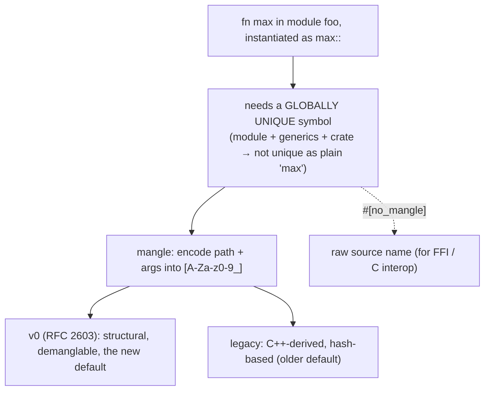
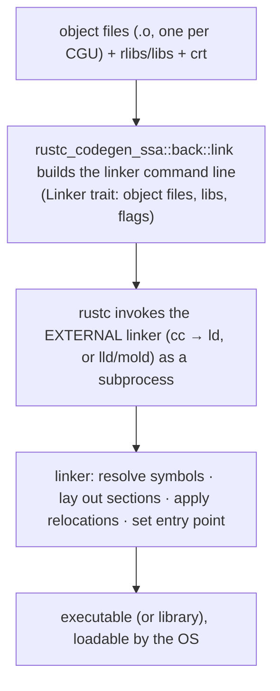
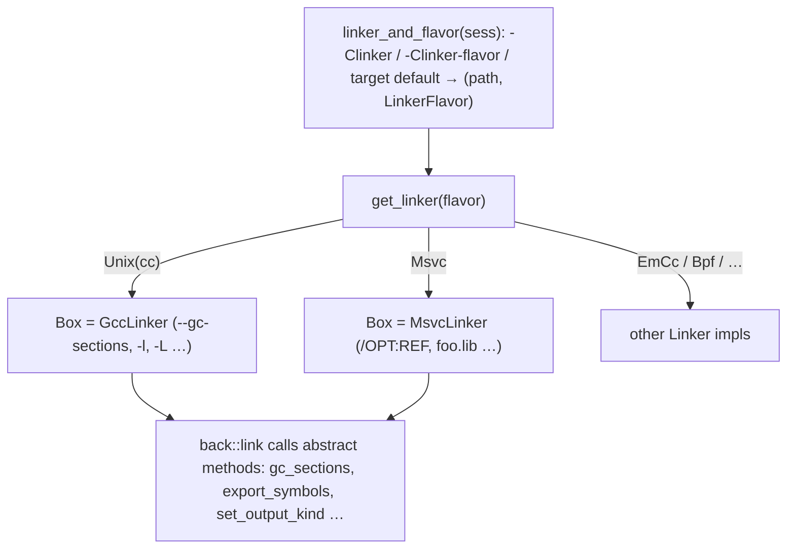
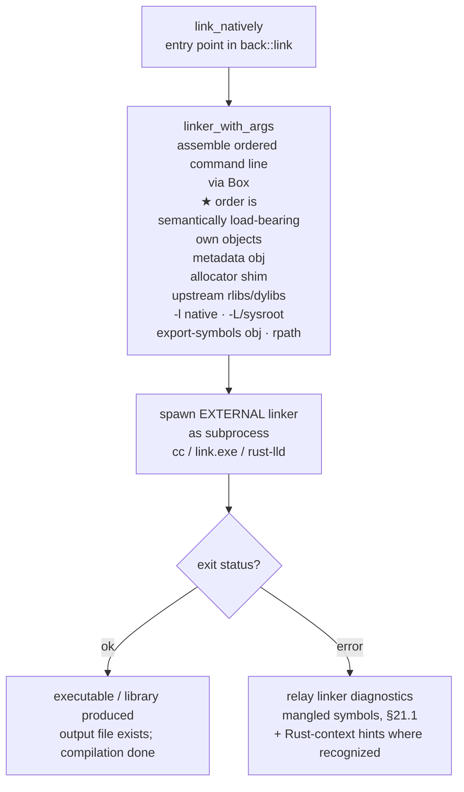
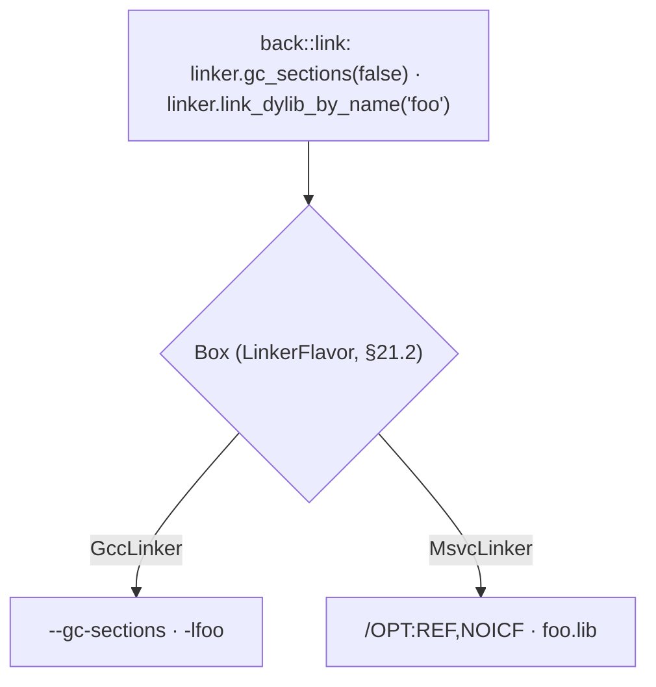
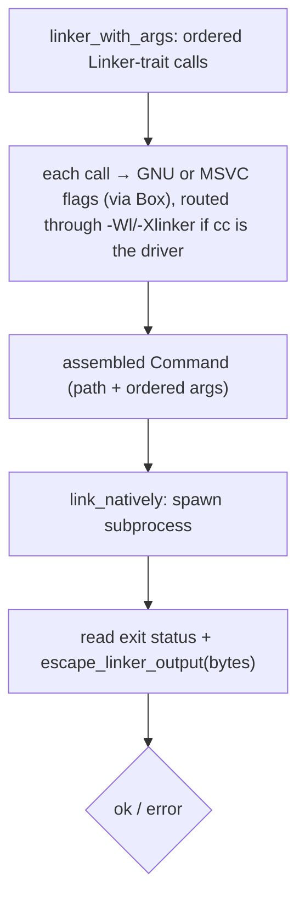
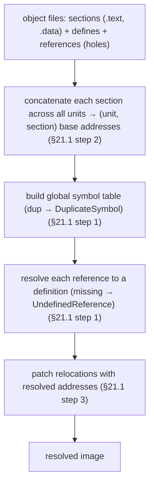

```admonish abstract title="What you'll learn"
- Why `rustc` does *not* implement linking itself: it builds a command line and invokes an external linker (`cc` -> `ld`, or `lld`/`mold`), driven by `rustc_codegen_ssa::back::link::link_binary` and `link_natively`.
- How symbols, relocations, and name mangling solve the cross-unit reference problem, including Rust's two schemes (legacy C++-derived and the demanglable v0 of RFC 2603) and the `#[no_mangle]` FFI opt-out.
- How `linker_and_flavor` and `get_linker` choose a `LinkerFlavor` and return a `Box<dyn Linker>`, the same dyn-top-seam pattern as the codegen backends, so one abstract call emits GNU or MSVC flags.
- Why the order of arguments in `linker_with_args` is semantically load-bearing (left-to-right archive resolution), and how the `-Wl,` / `-Xlinker` cc-wrapper routing distinguishes driver flags from underlying-linker flags.
- How Rust mixes static linking of crates (including `std`) with dynamic linking of `libc`, and how the crate type (`bin`, `rlib`, `staticlib`, `dylib`, `cdylib`) decides what kind of artifact link_binary produces.
- How to read a linker error: demangle the symbol (with `rustfilt` or `c++filt`), and use `rustc --print link-args` to see the exact command that was handed to the linker.
```

## 21.1 Linking: From Object Files to an Executable

### The last mile: assembling a program

Chapters 17 to 20 took monomorphic [MIR](../glossary.md#mir) all the way to **object files**, one per [codegen unit](../glossary.md#cgu), each a chunk of machine code. But an object file is not a program. It is full of *holes*: a function in one object file that calls a function defined in another has no idea, at codegen time, *where* that other function will live in memory, so it leaves a placeholder, "call whatever address the symbol `foo` ends up at." Your `main` calling `println!` (which lives in `std`), one codegen unit calling another, your crate calling a dependency: every one of these is, in the object file, an unresolved cross-reference. **Linking** is the step that fills the holes, collecting all the object files and libraries, matching every reference to its definition, laying out the final memory image, and producing a single file the operating system can load and run. It is the last step of compilation, and the subject of this chapter, which closes Part 3.

### Symbols: the names that connect the pieces

The mechanism that lets separately-compiled pieces refer to each other is the **symbol**. Every function and static that codegen produces gets a **globally unique name**, its symbol, and the object file records two kinds of fact: *definitions* ("this object file defines the symbol `foo` at this location") and *references* ("this instruction needs the address of the symbol `bar`, defined elsewhere"). Put another way: each item (functions, statics, and so on) must have a globally unique symbol identifying it, and those encoded names are what the linker uses to associate a name with the thing it refers to. A reference is recorded as a **relocation**, a marked spot in the machine code saying "patch in the address of symbol `X` once it is known." The linker's core job is to match every reference-symbol to its definition-symbol and fill in the real addresses. Symbols are the glue; relocations are the holes; linking is the gluing.

### Name mangling: why `bar` becomes `_ZN3foo3barE`

In C, a function's symbol *is* its source name, `strcmp` is the symbol `strcmp`. That works because C requires every external name to be globally unique already. Rust cannot do that, and the reason is everything this book has covered: Rust has **modules** (two modules can each have a `bar`), **generics** (one `fn max<T>` becomes many monomorphic instances, `max::<u8>`, `max::<String>`, §17, each needing its *own* distinct symbol), **traits** (`<u8 as Ord>::cmp` and `<i32 as Ord>::cmp` are different functions), and **multiple crates** (two crates may both define `helper`). A plain source name is nowhere near unique. So Rust **mangles** names, encodes the full path, generic arguments, and disambiguating information into one flat symbol string. Mangled symbols use a restricted alphabet (letters, digits, underscore, and a few delimiters), the lowest common denominator linkers accept across ELF, Mach-O, COFF, and WASM, so the rich type-system information must be encoded into that limited alphabet.

`rustc` has two mangling schemes. The **legacy** scheme reuses C++'s mangling (historically the default), but it is hard to demangle and bakes in compiler-internal hashes. The newer **v0** scheme (introduced by RFC 2603, *Rust symbol name mangling v0*) is Rust's own: it encodes the *actual* path and generic arguments structurally, so `<Foo<u32, char> as SomeTrait<Quux>>::some_method` round-trips to a readable, demanglable, even hand-predictable symbol. v0 has been the rustc-internal default for some time, and as it stabilizes for end users it is becoming the default users see in their own symbols too; check `-Csymbol-mangling-version` for the current default at your toolchain version. When you need a *stable, unmangled* symbol, to call a Rust function from C, or to define one C will call, you use the `#[no_mangle]` attribute, which makes the symbol exactly the source name (so it can be `dlsym`'d or matched by a C `extern` declaration).




```admonish tip title="Pro-Tip, when you see an unreadable _ZN... symbol in a backtrace or nm output, demangle it instead of decoding by hand"
Mangled symbols look like line noise (`_ZN4core3fmt9Formatter3pad17h...E`), but they are mechanical encodings, and `rustc` ships demanglers: `rustfilt` (a tool), or piping through `c++filt` for legacy symbols, turns them back into readable Rust paths like `core::fmt::Formatter::pad`. Backtraces, profiler output, `nm`/`objdump` symbol listings, and linker errors ("undefined reference to `_ZN...`") all become legible this way. The v0 scheme is designed to demangle unambiguously, where legacy could lose information. So when a linker error names a missing mangled symbol, demangle it first: it usually tells you *exactly* which Rust function (which generic instantiation, in which crate) failed to resolve, which points straight at the cause (a missing crate, an FFI signature mismatch, a `#[no_mangle]` typo). Reading mangled symbols by hand is a waste; demangling is one command.
```

### The linker's job

A **linker** takes a set of object files plus libraries and produces one output (an executable or a library). Its classic responsibilities:

1. **Symbol resolution.** For every reference (relocation) to a symbol, find the object file or library that *defines* it. An unmatched reference is the infamous "undefined reference" error; two definitions of the same symbol is a "duplicate symbol" error.
2. **Section layout.** Object files contain *sections*, code (`.text`), initialized data (`.data`), zero-initialized data (`.bss`), read-only data (`.rodata`). The linker concatenates and lays out all the sections from all inputs into the final memory image, assigning each a real address.
3. **Relocation.** With addresses now known, the linker goes back and *patches* every relocation, filling each hole with the actual address of the symbol it referenced.
4. **Entry point and wiring.** It sets the program's entry point and includes the runtime startup code (the C runtime, `crt`, which sets up the stack and eventually calls `main`).

The output is a complete executable: every address resolved, every section placed, ready for the OS loader.

### `rustc` does not link, it *invokes* a linker

Here is the key architectural fact: just as `rustc` does not implement codegen (it uses LLVM, §19.1), it does not implement *linking*. It **invokes an external linker**, typically the system's C compiler driver (`cc`/`gcc`/`clang`) which in turn calls the system linker (`ld`), or a faster linker like `lld` or `mold`. The verified `rustc_codegen_ssa::back::link` module ("performs the linkage portion of the compilation phase") and its verified `Linker` trait (with methods like `link_staticlib_by_name`, `gc_sections`, `export_symbols`, `set_output_kind`) build the *command line* for that external linker, assembling the list of object files, libraries, search paths, and flags, and then `rustc` runs it as a subprocess. The `Linker` trait abstracts over the different linkers' flag syntaxes (GNU `ld`, MSVC's `link.exe`, etc.), the same decoupling pattern as the codegen backends (§18), applied to linkers.




### Static versus dynamic linking

Linking comes in two flavors, and Rust mixes them. **Static linking** copies the needed code from libraries *into* the final executable, the result is self-contained (no external dependencies at runtime) but larger, and each program carries its own copy of the libraries. **Dynamic linking** leaves references to *shared libraries* (`.so`/`.dll`/`.dylib`) that the OS loads at runtime, smaller executables that share one copy of a library in memory, but with a runtime dependency on those libraries being present.

The verified Rust default is a *hybrid*: `rustc` "prefers to statically link dependencies", Rust crates (including `std`) are statically linked into the binary by default, which is why a Rust executable "just runs" without needing a matching `std` installed. But the **C runtime** and system libraries (`libc`) are typically *dynamically* linked, since they are part of the OS. The verified `-C prefer-dynamic` flag flips Rust dependencies to dynamic where possible. This static-Rust/dynamic-libc default is why a Rust binary is self-contained enough to run on a machine without a Rust toolchain installed, at the cost of carrying its own copy of `std`.

```admonish warning title="Warning, linker errors are downstream of rustc and often the hardest to diagnose, because they speak a different language"
When linking fails, the error comes from the *external linker* (`ld`, `link.exe`), not from `rustc`, and it speaks in mangled symbols, object-file paths, and platform-specific jargon, not in Rust terms. "undefined reference to `_ZN...`" means a symbol was referenced but never defined: a missing crate or library, an FFI function whose `extern` signature names a symbol nothing provides, a `#[no_mangle]` function you forgot to compile in, or a C library you did not link (`-l`). "duplicate symbol" means two definitions collided, often two versions of the same crate, or two `#[no_mangle]` functions with the same name. The diagnostic discipline: *demangle the symbol* (the Pro-Tip above) to learn which Rust item is involved; check whether it is an FFI boundary (most linker errors in pure Rust are about C interop or build configuration, since `rustc` resolves Rust-to-Rust symbols itself); and remember the error is from a *subprocess*, the fix is usually in build configuration (which libraries, which search paths) rather than in Rust source. Linker errors feel alien because they *are* from a different tool; treat them as "the external linker could not assemble what `rustc` asked for," and the demangled symbol names point at what.
```

### The crate output types

Finally, what linking produces depends on the **crate type** `rustc` is building, the verified outputs include: a `bin` (an executable), an `rlib` (Rust's static library format, used between Rust crates, carrying metadata and bitcode), a `staticlib` (a C-compatible static archive `.a` for embedding Rust in a non-Rust program), a `dylib` (a Rust dynamic library), and a `cdylib` (a C-compatible dynamic library `.so`/`.dll` for use from other languages). Each demands different linking work, an `rlib` is essentially archived object files plus metadata (minimal linking), while a `bin` is the full link-to-executable above. The crate type is the answer to "what kind of artifact, and so what kind of linking."

### Where this leaves us

Linking is compilation's last mile. Codegen produced **object files** full of **holes**, relocations referencing **symbols** (globally unique names) defined elsewhere. Because Rust's modules, generics, traits, and multiple crates make plain source names non-unique, symbols are **mangled**, the full path and generic arguments encoded into a restricted alphabet, via the older **legacy** scheme or Rust's own demanglable **v0** scheme (RFC 2603, the new default), with `#[no_mangle]` opting out for FFI. The **linker** resolves every symbol reference to a definition, lays out the sections into a memory image, applies relocations, and sets the entry point, and `rustc` does *not* implement it but **invokes an external linker** (`cc`→`ld`, or `lld`/`mold`), building its command line through `rustc_codegen_ssa::back::link` and the `Linker` trait. Rust defaults to **static** linking of Rust crates (self-contained binaries) and **dynamic** linking of `libc`. The output depends on the **crate type** (`bin`, `rlib`, `staticlib`, `dylib`, `cdylib`). Linker errors are downstream, from a different tool, and demangling their symbols is the key to reading them.

§21.2 takes the architecture deep-dive: `rustc_codegen_ssa::back::link`'s `link_binary`/`link_natively`, the `Linker` trait abstracting linker flavors, how the command line is assembled (objects, rlibs, native libs, search paths), the rlib/crate-metadata format, and how the linker is chosen and run. Then §21.3 reads the real link-command construction, and §21.4 closes Part 3 with a lab, a tiny symbol resolver and "linker" that resolves references across object-file-like units, plus the Part 3 retrospective and the bridge to Part 4 (the cross-cutting concerns: incremental compilation, parallelism, diagnostics).

## 21.2 The Architecture: `back::link`, the `Linker` Trait, and Invoking the Linker

### Building a command line for someone else's program

Because `rustc` invokes a linker rather than linking itself, the architecture of its linking is, mostly, the architecture of **assembling a correct command line** for an external program and running it. This section is that machinery: the verified `rustc_codegen_ssa::back::link` module that drives the linkage phase, how it *chooses* which linker to run, the verified `Linker` trait that abstracts the chosen linker's flag dialect, how the full command line is assembled, and how the linker is finally invoked as a subprocess. The throughline: `rustc` never resolves a symbol or lays out a section itself, it tells another tool how to.

### `link_binary`: the entry to the linkage phase

The verified `back::link` module "performs the linkage portion of the compilation phase" through its entry point, `link_binary`. It loops over the requested crate types (§21.1, `bin`, `rlib`, `staticlib`, `dylib`, `cdylib`) and dispatches each to the right routine:

```rust
// rustc_codegen_ssa::back::link  (faithful, abridged)
pub fn link_binary(
    sess: &Session,
    archive_builder_builder: &dyn ArchiveBuilderBuilder,
    codegen_results: CodegenResults,
    metadata: EncodedMetadata,
    outputs: &OutputFilenames,
    codegen_backend: &'static str,
) {
    for &crate_type in &codegen_results.crate_info.crate_types {
        match crate_type {
            // archive objects + metadata (no real link)
            CrateType::Rlib => link_rlib(...).build(&out_filename),
            // C-compatible static archive
            CrateType::StaticLib => link_staticlib(...),
            // Executable, Dylib, Cdylib, ProcMacro, Sdylib all invoke the EXTERNAL linker
            _ => link_natively(...),
        }
    }
}
```

The split matters: an `rlib` does not invoke the system linker at all, it is essentially an `ar`-style archive containing the crate's object files alongside a metadata blob (see `rustc_codegen_ssa::back::link::link_rlib`), used only between Rust crates. Only the cases that produce a real binary or shared library, `Executable`, `Dylib`, `Cdylib`, go through `link_natively`, which is where the external linker gets invoked. So most Rust-to-Rust linking work (carrying metadata, object code between crates) uses the rlib format and `rustc`'s own machinery; the external linker is reserved for producing the final loadable artifact.

### Choosing the linker: `linker_and_flavor`

Before building a command line, `rustc` must decide *which* linker to run and *which dialect* it speaks. The verified `linker_and_flavor(sess) -> (PathBuf, LinkerFlavor)` resolves this from, in priority order: explicit flags (`-C linker=...` for the path, `-C linker-flavor=...` for the dialect), then the **target specification**'s default (every rustc target spec declares a default `LinkerFlavor`). The `LinkerFlavor` is the key abstraction: it encodes *what kind* of linker this is, `Gnu(Cc, Lld)` (GNU `ld` with or without a `cc` driver, with or without `lld`), `Darwin(Cc, Lld)` (Apple linker), `Unix(Cc)` (other unix linkers), `Msvc(Lld)` (Microsoft's `link.exe`), `WasmLld(Cc)`, `EmCc` (Emscripten), `Bpf`, `Llbc`, each of which determines the flag syntax. On `x86_64-unknown-linux-gnu`, the default at 1.95.0 is still `cc` + GNU `ld`; opting in to the **self-contained `rust-lld`** (a bundled copy of LLVM's `lld` linker) is done via the linker-features mechanism (`-Clinker-features=+lld` and the per-flavor `with_lld_enabled`/`with_lld_disabled` adjustments visible in `linker_and_flavor`). The longer-term Rust-team plan is for `rust-lld` to become the default on this target, so the link step does not depend on whatever `ld` the host happens to have.

### The `Linker` trait: one interface, many flag dialects

Different linkers want different flags for the same request, "garbage-collect unused sections" is `--gc-sections` for GNU `ld` but `/OPT:REF` for MSVC `link.exe`. The `Linker` trait abstracts exactly this: it is "the total list of requirements needed by `back::link`," with around 30 methods (`set_output_kind`, `link_staticlib_by_name`, `gc_sections`, `export_symbols`, `link_dylib_by_name`/`_by_path`, `framework_path`, `full_relro`/`partial_relro`/`no_relro`, `optimize`, `pgo_gen`, `control_flow_guard`, `ehcont_guard`, `debuginfo`, `no_crt_objects`, `no_default_libraries`, `windows_subsystem`, `linker_plugin_lto`, `add_eh_frame_header`, `add_no_exec`, `add_as_needed`, `reset_per_library_state`, ...) representing the *meaning* of each linker option, and it "is then used to dispatch on whether a GNU-like linker or an MSVC linker is being used." The `get_linker` function builds the right implementation as a trait object:

```rust
// rustc_codegen_ssa::back::linker  (faithful, abridged)
pub(crate) fn get_linker<'a>(
    sess: &'a Session,
    linker: &Path,
    flavor: LinkerFlavor,
    self_contained: bool,
    target_cpu: &'a str,
    codegen_backend: &'static str,
) -> Box<dyn Linker + 'a> {
    // ... cmd setup elided (handles .bat scripts, UWP, msvc tool discovery, PATH) ...
    match flavor {
        // a few special cases (L4Re bender, AIX, pure-LLD wasm) come first
        LinkerFlavor::Unix(Cc::No) if sess.target.os == Os::L4Re => Box::new(L4Bender::new(cmd, sess)),
        LinkerFlavor::Unix(Cc::No) if sess.target.os == Os::Aix  => Box::new(AixLinker::new(cmd, sess)),
        LinkerFlavor::WasmLld(Cc::No)                            => Box::new(WasmLd::new(cmd, sess)),
        // GNU/Darwin/WasmLld(with-cc)/Unix(with-cc) all share GccLinker, which carries
        // is_ld/is_gnu/uses_lld flags to drive the cc-wrapper layer (§21.3)
        LinkerFlavor::Gnu(cc, _) | LinkerFlavor::Darwin(cc, _) | LinkerFlavor::WasmLld(cc) | LinkerFlavor::Unix(cc) => {
            Box::new(GccLinker {
                cmd, sess, target_cpu, hinted_static: None,
                is_ld: cc == Cc::No, is_gnu: flavor.is_gnu(), uses_lld: flavor.uses_lld(),
                codegen_backend,
            })
        }
        LinkerFlavor::Msvc(..) => Box::new(MsvcLinker { cmd, sess }),
        LinkerFlavor::EmCc => Box::new(EmLinker { cmd, sess }),
        LinkerFlavor::Bpf => Box::new(BpfLinker { cmd, sess }),
        LinkerFlavor::Llbc => Box::new(LlbcLinker { cmd, sess }),
        LinkerFlavor::Ptx => Box::new(PtxLinker { cmd, sess }),
    }
}
```

This is the **dyn-trait-object top-seam pattern again**, the exact shape of §20.2's `dyn CodegenBackend`. Linking happens once per artifact, so dynamic dispatch is free, and `Box<dyn Linker>` lets `back::link` build the command line through one interface (`linker.gc_sections(...)`, `linker.export_symbols(...)`) while each implementation (`GccLinker`, `MsvcLinker`) translates those abstract calls into its linker's actual flags. The verified honest nuance: a few helpers must live *outside* the trait because "adding these functions to `trait Linker` make it `dyn`-incompatible", the same object-safety constraint the §20.4 lab's extension exercise discovers. `GccLinker`'s flags carry booleans like `is_ld`, `is_gnu`, `uses_lld` because GNU-like covers a family with small differences; `MsvcLinker` is its own world.




### Assembling the command line: `linker_with_args`

The heart of `link_natively` is building the argument list, the verified work of producing "the linker command line containing linker path and arguments." It is a careful, *ordered* accumulation (order matters to linkers, many resolve symbols left-to-right). The teaching shape: the crate's **own object files** first, then **local native libraries** (the `-l` flags from `#[link]` / build scripts on the local crate), then the **upstream Rust crates** (each dependency's rlib or dylib), then **upstream native libraries**, with **search paths** (`-L`, including the sysroot so `std` is found), **rpath** entries, and an **export-symbols object** added alongside. Each is added by calling the `Linker` trait, so the same logical step emits GNU or MSVC syntax depending on the implementation. See `linker_with_args` in `rustc_codegen_ssa::back::link` for the full sequence (metadata object, allocator shim, target-spec pre/post-link args, and the rest).

A verified detail showing the care involved: `rustc` disables *localized* linker messages, because "such messages may cause issues with text encoding on Windows and prevent inspection of linker output in case of errors", `rustc` wants to parse the linker's output, so it forces it into English.

```admonish tip title="Pro-Tip, rustc --print link-args shows you the exact command rustc hands the linker, which demystifies most link problems"
Because linking is "build a command line and run a subprocess," the single most useful debugging move is to *see that command line*. Passing `--print link-args` makes `rustc` dump the full linker invocation, every object file, every `-l`, every `-L`, every flag, in order. When a link fails or produces something unexpected, this tells you concretely what `rustc` asked for: is the missing library's `-l` present? Is its directory in a `-L`? Are the object files in the order you expect? Did a build script's `cargo:rustc-link-lib` actually reach the command line? It also lets you *reproduce the link by hand*, copy the command, tweak it, rerun the linker directly, which is how you isolate whether a problem is in `rustc`'s command construction or in the linker/libraries themselves. For FFI and native-dependency issues (the bulk of real linker trouble, §21.1), seeing the actual `-l`/`-L` flags is usually the whole diagnosis. The linkage phase is unusually inspectable precisely because its output is just a command line; use that.
```

### Invoking the linker, and handling its result

With the `Box<dyn Linker>`'s command fully built, `link_natively` runs it as a **subprocess**, literally spawning `cc` (or `link.exe`, or `rust-lld`) with the assembled arguments, and inspects the exit status and output. On success, the output file (executable or shared library) exists and compilation is done. On failure, `rustc` surfaces the linker's error, which, as §21.1 warned, is in the *linker's* language (undefined references in mangled symbols, etc.), not Rust's. `rustc` does some massaging (the source has an explicit hook for MSVC `link.exe`, filtering three known progress lines and surfacing LNK error-code hints, and `escape_linker_output` handles MSVC's OEM-codepage output on Windows; otherwise the linker's stderr/stdout is relayed to the user as a `LINKER_MESSAGES` [lint](../glossary.md#lint)), and the verified `link_natively` even retries the link in specific known-failure cases (`-no-pie`, `-fuse-ld=lld`, `-static-pie` rejected by older toolchains) by stripping the offending flag and re-running. But fundamentally it is relaying a subprocess's diagnostics. The split-linking work (emitting a `.rlink` to defer the link to a second `rustc` invocation, for caching) underscores the model: the link step is cleanly separable *because* it is just "run the linker on these inputs."




```admonish warning title="Warning, argument order on the linker command line is semantically significant; library not found and undefined reference can both stem from ordering, not absence"
Traditional Unix linkers process their inputs **left to right** and, for static archives, only pull in the object members that resolve symbols *referenced by inputs seen so far*. The practical consequence is brutal and non-obvious: if a library appears on the command line *before* the object that needs it, the linker may discard the library's symbols as "unused" at that point and then fail with "undefined reference" when the later object asks for them, even though the library *is* present. This is why `rustc` (and `cc`) are careful about ordering, and why manually-added link args via `-C link-arg` can break things if inserted at the wrong position (the verified source even has `FIXME`s about exactly *where* user args should go). When you hit an "undefined reference" to a symbol you *know* is in a library you *did* link, suspect ordering before absence: the library may need to come *after* its users on the command line, or `--start-group`/`--end-group` may be needed for circular dependencies. This left-to-right archive semantics is decades-old linker behavior `rustc` must accommodate, and it is the single most counterintuitive thing about diagnosing link failures, the symbol is there; the order is wrong.
```

### How this builds, and what is next

`rustc`'s linking architecture is "assemble a command line and run an external program." The verified `back::link`'s `link_binary` dispatches per crate type, `rlib`/`staticlib` use `rustc`'s own archiving (an rlib is object files plus crate metadata, no system linker), while `Executable`/`Dylib`/`Cdylib` go through `link_natively`, which invokes the external linker. `linker_and_flavor` chooses the linker path and `LinkerFlavor` (from `-C` flags or the target default; increasingly the bundled `rust-lld`), and `get_linker` builds a `Box<dyn Linker>` (`GccLinker`/`MsvcLinker`/…), the §20.2 dyn-top-seam pattern, abstracting each linker's flag dialect behind a couple dozen meaning-bearing methods. `linker_with_args` assembles the *ordered* command line (own objects, metadata object, allocator shim, upstream rlibs/dylibs, native `-l` libs, `-L`/sysroot search paths, the export-symbols object, rpath), each step emitting the right dialect through the trait. Then the linker runs as a **subprocess**, and `rustc` relays its result. The link step is inspectable (`--print link-args`) and separable, and linker argument *order* is semantically load-bearing.

§21.3 reads the real source: a slice of `linker_with_args` adding objects and libraries through the `Linker` trait, and a `GccLinker` method translating an abstract request (say `gc_sections` or `link_dylib_by_name`) into actual GNU flags, the command-line construction in actual code. Then §21.4 closes Part 3 with the lab: a tiny symbol resolver / "linker" that resolves references across object-file-like units into a single resolved image, plus the Part 3 retrospective and the bridge to Part 4.

## 21.3 Reading the Source: Constructing the Link Command

### One request, two dialects

This section reads the point where an abstract linking request becomes concrete linker flags, the `Linker` trait's implementations (§21.2). We will read a `GccLinker` method and the *same* method on `MsvcLinker`, side by side, to see one interface produce two flag dialects; then the cc-wrapper arg-routing that handles `rustc` invoking `cc` rather than `ld` directly; then a slice of the command-line assembly calling these methods in order. The source is `rustc_codegen_ssa`'s `back/linker.rs` and `back/link.rs`. The pattern is the now-familiar one (§18, §20): shared logic up top, a per-implementation leaf at the bottom.

### The same method, GNU versus MSVC

Take a single abstract request: "garbage-collect unused sections" (`gc_sections`, one of the `Linker` trait's methods, §21.2). Each linker implementation translates it to its own flag (faithful, abridged from `rustc_codegen_ssa/src/back/linker.rs`):

```rust
// rustc_codegen_ssa::back::linker  (faithful, abridged)

impl Linker for GccLinker<'_> {
    fn gc_sections(&mut self, keep_metadata: bool) {
        if self.sess.target.is_like_darwin {
            self.link_arg("-dead_strip"); // ← Darwin: -dead_strip (ld64)
        } else if (self.is_gnu || self.sess.target.is_like_wasm) && !keep_metadata {
            self.link_arg("--gc-sections"); // ← GNU / wasm-ld
        }
        // Other platforms (Solaris, etc.): no-op; the linker may not support it safely.
    }
    fn link_dylib_by_name(&mut self, name: &str, verbatim: bool, as_needed: bool) {
        // (illumos `libc` skipped here, late-linked instead; hint_dynamic / with_as_needed elided)
        let colon = if verbatim && self.is_gnu { ":" } else { "" };
        self.link_or_cc_arg(format!("-l{colon}{name}")); // ← GNU: -l[:]foo
    }
}

impl Linker for MsvcLinker<'_> {
    fn gc_sections(&mut self, _keep_metadata: bool) {
        if self.sess.opts.optimize != config::OptLevel::No {
            self.link_arg("/OPT:REF,ICF"); // ← MSVC: optimizing build → enable ICF
        } else {
            self.link_arg("/OPT:REF,NOICF"); // ← MSVC: debug build → suppress slow ICF
        }
    }
    fn link_dylib_by_name(&mut self, name: &str, verbatim: bool, _as_needed: bool) {
        // try the alt `libfoo.a`-style import-library naming first; otherwise `foo[.lib]`
        if let Some(path) = try_find_native_dynamic_library(self.sess, name, verbatim) {
            self.link_arg(path);
        } else {
            self.link_arg(format!("{}{}", name, if verbatim { "" } else { ".lib" }));
        }
    }
}
```

Set them against each other directly:

```text
abstract Linker request      GccLinker emits                     MsvcLinker emits
─────────────────────────    ────────────────────────────────    ────────────────────────────
gc_sections(false)           --gc-sections (gnu/wasm) or         /OPT:REF,ICF (when optimizing)
                             -dead_strip (darwin)                /OPT:REF,NOICF (at OptLevel::No)
link_dylib_by_name("foo")    -lfoo (or `-l:foo` if verbatim)     foo.lib (or just `foo` if verbatim)
```

This is the §21.2 abstraction made concrete, and it is *exactly* the §18/§20 pattern one more time. `back::link` calls `linker.gc_sections(false)` once; the `Box<dyn Linker>` dispatches to whichever implementation the `LinkerFlavor` selected (§21.2); GNU gets `--gc-sections` (or `-dead_strip` on Darwin), MSVC gets `/OPT:REF,ICF` (or `,NOICF` at OptLevel::No). The verified `MsvcLinker::link_dylib_by_path` shows a real-world subtlety, for a Rust dylib it checks whether the `.dll.lib` import library actually exists before adding it ("the MSVC linker may not actually emit a `foo.lib` file if the dll doesn't actually export any symbols"); the sibling `_by_name` falls back through `try_find_native_dynamic_library` to handle alternate import-library naming schemes. One logical operation, several faithful translations.




### The cc-wrapper layer: `-Wl` and `-Xlinker`

There is a real complication the source handles carefully. `rustc` usually does not invoke the linker (`ld`) *directly*, it invokes the C compiler driver (`cc`/`gcc`/`clang`), which *then* invokes `ld` (§21.1). That means a flag meant for the *underlying linker* (like `--gc-sections`) cannot just be passed to `cc` as-is, `cc` would try to interpret it itself. It must be *wrapped* so `cc` forwards it to `ld`. The verified arg-routing helpers encode this distinction precisely:

- `link_arg`: an underlying-linker flag, wrapped in `-Wl,` or `-Xlinker` when going through `cc` so the driver forwards it to `ld`; passed bare when invoking `ld` directly. A `--gc-sections` becomes `-Wl,--gc-sections` through `cc`.
- `cc_arg`: an argument for the `cc` driver *itself*, not forwarded to `ld`.

See `back/linker.rs` for the full set including `link_or_cc_args` (flags both understand, like `-lfoo`) and `verbatim_args`.

The `GccLinker` holds the verified `is_ld` boolean (§21.2, `is_ld: cc == Cc::No`) precisely so these helpers know whether they are talking to `cc` (wrap with `-Wl`) or to `ld` directly (pass bare). This is why `gc_sections` above uses `link_arg` (an underlying-linker flag, needs wrapping) while `link_dylib_by_name` uses `link_or_cc_arg` (`-lfoo`, understood by both, no wrapping). The trait method expresses *intent*; the helper handles the *routing* through whatever process layer is in play.

```admonish tip title="Pro-Tip, -Wl is the prefix you use to pass a flag through the compiler driver to the linker, and recognizing it explains a lot of build incantations"
Every time you see `-Wl,--gc-sections` or `-Wl,-rpath,/some/path` or `RUSTFLAGS="-C link-arg=-Wl,..."` in a build script or Makefile, you are watching exactly the routing this source does: the `-Wl,` prefix tells `cc`/`gcc`/`clang` "don't interpret this yourself, forward it (comma-separated) to `ld`." (`-Xlinker FOO` is the equivalent for a single arg with spaces.) This matters in practice because when you need to pass a *linker* flag from Rust, you go through `-C link-arg=`, and whether you need the `-Wl,` wrapper depends on whether `rustc`'s linker flavor invokes `cc` or `ld` directly, which is the exact `is_ld` distinction the source tracks. If a linker flag "does nothing," a common cause is that it reached `cc` unwrapped and `cc` silently ignored or mis-handled it. Knowing that `cc` is usually the middleman, and `-Wl,` is how you reach past it, turns a class of mysterious build failures into a one-token fix. The compiler driver sits between you and the linker far more often than people realize.
```

### Assembling the command, in order

With the per-flag translation understood, the assembly in `linker_with_args` is a sequence of these calls in a deliberate order (§21.2, order is load-bearing). The actual function body in `rustc_codegen_ssa/src/back/link.rs` is hundreds of lines (handling pre-link args, self-contained CRT objects, sanitizers, debuginfo strip, target-specific late link args, plugin LTO, raw-dylib import libs, and more); the *teaching shape* of the order is:

```text
// rustc_codegen_ssa::back::link::linker_with_args (teaching shape, NOT the verbatim signature;
//                                                 see the real function for the full sequence)
let mut cmd = get_linker(sess, &linker_path, flavor, ...);   // Box<dyn Linker> (§21.2)
cmd.set_output_kind(output_kind, crate_type, out_filename);  // -shared / -pie / etc.

// 1. the crate's own object files (CGUs from §17.4) and metadata/allocator-shim objects
//    go first so their symbols are the anchors the linker resolves against
// 2. then LOCAL native libraries (-l flags from #[link] / build scripts on this crate)
// 3. then each upstream Rust dependency: rlib or dylib, in dependency-format order
// 4. then UPSTREAM native libraries the deps pulled in, with their search paths
//    (-L, including sysroot)
// 5. then runtime search paths (rpath, back::rpath)
// 6. and finally pass-level flags (gc_sections, optimize, debuginfo strip, etc.) near the end

// Each step calls one or more `Linker`-trait methods, so the *same* sequence
// emits GNU syntax (--gc-sections, -lfoo, -L) or MSVC syntax (/OPT:REF, foo.lib, /LIBPATH:)
// depending on the implementation `get_linker` chose.
```

Each line is one or more `Linker`-trait calls; each emits GNU or MSVC syntax depending on the implementation; and the *order*, local objects, then local native libs, then upstream Rust crates, then upstream native libs, then search paths, respects the left-to-right symbol-resolution semantics (§21.2's warning). The verified comment about upstream rlibs is illustrative of the care: "We really only need symbols from upstream rlibs to end up in the linked symbols list. The rest are in separate object files which the linker will always link in." `back::link` knows the linker's resolution model intimately and orders its inputs to match.

### Invoking, and reading the linker's bytes

Finally `link_natively` runs the assembled `Command` as a subprocess and handles the result. A subtlety the source attends to: the linker's *output* (its error text) is raw bytes in some encoding, and the verified `escape_linker_output(s: &[u8], flavor: LinkerFlavor) -> String` cleans it for display, paired with the §21.2 trick of forcing the linker into English so the bytes are parseable. On nonzero exit, `rustc` surfaces this (cleaned) linker output as the error, adding Rust-context hints where it recognizes patterns. The compiler's involvement ends at "ran the subprocess, read its result"; the actual symbol resolution and section layout happened entirely inside `ld`/`link.exe`/`rust-lld`.




```admonish warning title="Warning, a flag added at the wrong layer (cc vs linker) silently does nothing or does the wrong thing; match the flag to its intended recipient"
The cc-wrapper routing means there are *two* programs that might receive a flag, the `cc` driver and the underlying `ld`, and a flag aimed at the wrong one fails quietly. Pass a linker flag (say `--gc-sections`) to `cc` *without* `-Wl,` and `cc` may treat it as an unknown driver option (warning or error) or pass it somewhere unintended; pass a `cc` driver flag *with* `-Wl,` and `ld` gets a flag it does not understand. When using `-C link-arg=` from Rust, you must know which program your flag is for: linker flags need the `-Wl,` wrapper (if the flavor uses `cc`), driver flags do not. This is the human-facing version of exactly the distinction the `link_arg` / `cc_arg` / `link_or_cc_arg` helpers encode internally, `rustc`'s own code is careful to route each flag to the right recipient, and when you inject flags manually you take on that responsibility yourself. The failure mode is insidious because it is often *silent*: the build succeeds but the flag had no effect, or the binary is subtly different from what you intended. When a manually-added link flag "doesn't work," check first whether it reached the right program at the right layer.
```

### How this builds, and what is next

We have read the link command being built. Each abstract `Linker` request, `gc_sections`, `link_dylib_by_name`, is translated by the chosen implementation into its dialect: `GccLinker` emits `--gc-sections` / `-lfoo`, `MsvcLinker` emits `/OPT:REF` / `foo.lib`, dispatched through the `Box<dyn Linker>` the `LinkerFlavor` selected, the §18/§20 shared-logic-plus-leaf pattern once more. Because `rustc` usually invokes `cc`, not `ld` directly, the verified routing helpers (`link_arg` wraps underlying-linker flags in `-Wl`/`-Xlinker`; `cc_arg` targets the driver; `link_or_cc_arg` for flags both accept) send each flag to the right program, gated by the `is_ld` boolean. `linker_with_args` calls these methods in a deliberate, resolution-order-respecting sequence (local objects → local metadata object → local allocator shim → local native libraries → upstream Rust crates → upstream native libraries → raw-dylib import libs → search paths → rpath → set_output_kind/gc_sections/optimize/debuginfo), then `link_natively` spawns the subprocess and cleans its output with `escape_linker_output`. The compiler builds and runs a command; `ld` does the linking.

§21.4 closes Chapter 21, and Part 3, with the lab: you will build a tiny **symbol resolver / "linker"** in pure Rust, modeling object-file-like units with defined and referenced symbols, resolving every reference to a definition across units (catching "undefined" and "duplicate" symbol errors), and producing a single resolved image, the linker's *core job* (§21.1) in miniature. Then the **Part 3 retrospective** traces the whole back-end arc (generic MIR → [monomorphization](../glossary.md#monomorphization) → codegen abstraction → LLVM/alternatives → linked executable), and the bridge opens **Part 4, Cross-Cutting Concerns**, beginning with Chapter 22, incremental compilation.

## 21.4 Hands-On Lab: Build a Symbol Resolver, and the Part 3 Retrospective

### The linker's core job, in miniature

The linker does four things (§21.1): resolve symbols, lay out sections, apply relocations, set an entry point. This lab builds the heart of that, a **symbol resolver** in pure Rust that takes object-file-like units, builds a global symbol table (catching *duplicate* definitions), resolves every reference to a definition (catching *undefined* references), assigns addresses by laying sections out in sequence, and patches the relocations with the resolved addresses. When your linker turns three separate units, each defining some symbols and referencing others, into one resolved image, and *correctly rejects* a missing symbol and a doubly-defined one, you will have built the linker's core algorithm (§21.1) and felt exactly what produces "undefined reference" and "duplicate symbol" errors.

`cargo new`, pure `std`.

### Modeling object files

An object file (§21.1) defines some symbols (each at an offset within a named section of the unit) and references others via relocations (each a spot in the code needing a symbol's final address patched in). Crucially, object files do not have *one* blob of bytes; they have **sections** (`.text`, `.data`, `.rodata`, `.bss`, §21.1), and the linker concatenates *each section* across all inputs, not whole units:

```rust
// src/main.rs
use std::collections::HashMap;

#[derive(Clone)]
// a section within a unit (e.g. ".text", ".data"), with its size in bytes
struct Section { name: String, size: u64 }

#[derive(Clone)]
// a symbol defined at `offset` within the named `section` of this unit
struct SymbolDef { name: String, section: String, offset: u64 }

#[derive(Clone)]
// patch the address of `symbol` into our code at `offset`
struct Relocation { offset: u64, symbol: String }

#[derive(Clone)]
struct ObjectFile {
    name: String,
    sections: Vec<Section>, // .text / .data / etc., each contributing bytes
    defines: Vec<SymbolDef>, // symbols this unit DEFINES (each tagged with its section)
    references: Vec<Relocation>, // symbols this unit USES (holes to patch)
}
```

*rustc's analogue is `CompiledModule` (one per codegen unit, §17.4), bundled into `CodegenResults.modules` for `link_binary` to consume.*

### The resolved image

```rust
#[derive(Debug)]
struct ResolvedImage {
    // (unit, section) → its assigned base address; the linker concatenates
    // each section across all units, so a unit has one base per section
    base_addresses: HashMap<(String, String), u64>,
    symbols: HashMap<String, u64>, // symbol name → its final absolute address
    patches: Vec<AppliedRelocation>, // the applied relocations
}

#[derive(Debug)]
struct AppliedRelocation { unit: String, offset: u64, symbol: String, addr: u64 }

#[derive(Debug)]
enum LinkError {
    DuplicateSymbol(String),
    UndefinedReference { symbol: String, referenced_by: String },
}
```

### The linker

The four steps, in §21.1's canonical numbering: symbol resolution (step 1) is separate from layout (step 2) and relocation (step 3), with the entry point (step 4) on top. The lab does layout first so it knows the addresses to put in the symbol table, then resolution and relocation in one pass; real linkers go the other way because archive-extraction in step 1 changes the input set Extension #1 explores, flipping the order is part of that exercise.

```rust
fn link_binary(units: &[ObjectFile], entry: &str) -> Result<ResolvedImage, LinkError> {
    // §21.1 step 2 (layout): the linker concatenates *each section* across all
    // inputs (all `.text` first, then all `.data`, etc.), not whole units. We do
    // it section-by-section in a fixed order so addresses match that promise.
    // Done first here so we know absolute addresses for the symbol table.
    let base: u64 = 0x1000; // a pretend load address
    let mut cursor = base;
    let mut base_addresses: HashMap<(String, String), u64> = HashMap::new();
    for section_name in [".text", ".data"] {
        for u in units {
            if let Some(s) = u.sections.iter().find(|s| s.name == section_name) {
                base_addresses.insert((u.name.clone(), s.name.clone()), cursor);
                // next contribution starts after this one
                cursor += s.size;
            }
        }
    }

    // §21.1 step 1 (symbol resolution, part A): collect every DEFINED symbol, with its absolute address.
    // A symbol's address is `(its unit, its section)`'s base plus its in-section offset.
    // A second definition of the same symbol is the "duplicate symbol" error.
    let mut symbols: HashMap<String, u64> = HashMap::new();
    for u in units {
        for d in &u.defines {
            let key = (u.name.clone(), d.section.clone());
            let sbase = base_addresses[&key];
            let addr = sbase + d.offset;
            if symbols.insert(d.name.clone(), addr).is_some() {
                // ← defined twice
                return Err(LinkError::DuplicateSymbol(d.name.clone()));
            }
        }
    }

    // §21.1 step 1 (symbol resolution, part B) + step 3 (relocation): every reference must find
    // a definition; missing → "undefined reference"; found → patch the hole with the address.
    let mut patches = vec![];
    for u in units {
        for r in &u.references {
            match symbols.get(&r.symbol) {
                Some(&addr) => patches.push(AppliedRelocation {
                    unit: u.name.clone(), offset: r.offset, symbol: r.symbol.clone(), addr,
                }),
                None => return Err(LinkError::UndefinedReference {
                    symbol: r.symbol.clone(), referenced_by: u.name.clone(),
                }),
            }
        }
    }

    // §21.1 step 4 (entry point): the entry symbol must exist too.
    if !symbols.contains_key(entry) {
        return Err(LinkError::UndefinedReference { symbol: entry.into(), referenced_by: "<entry>".into() });
    }

    Ok(ResolvedImage { base_addresses, symbols, patches })
}
```

### Running it: success, and two failures

```rust
fn main() {
    // main() calls helper(); helper() calls add(); add() is defined.  All resolvable.
    // main.o and helper.o also carry a small .data section, so we can watch
    // the linker concatenate all .text first, then all .data.
    let main_o = ObjectFile {
        name: "main.o".into(),
        sections: vec![
            Section { name: ".text".into(), size: 0x40 },
            Section { name: ".data".into(), size: 0x08 },
        ],
        defines: vec![
            SymbolDef { name: "main".into(), section: ".text".into(), offset: 0 },
            SymbolDef { name: "GREETING".into(), section: ".data".into(), offset: 0 },
        ],
        references: vec![Relocation { offset: 0x10, symbol: "helper".into() }],
    };
    let helper_o = ObjectFile {
        name: "helper.o".into(),
        sections: vec![
            Section { name: ".text".into(), size: 0x30 },
            Section { name: ".data".into(), size: 0x04 },
        ],
        defines: vec![
            SymbolDef { name: "helper".into(), section: ".text".into(), offset: 0 },
            SymbolDef { name: "COUNTER".into(), section: ".data".into(), offset: 0 },
        ],
        references: vec![Relocation { offset: 0x08, symbol: "add".into() }],
    };
    let math_o = ObjectFile {
        name: "math.o".into(),
        sections: vec![Section { name: ".text".into(), size: 0x20 }],
        defines: vec![SymbolDef { name: "add".into(), section: ".text".into(), offset: 0 }],
        references: vec![],
    };

    println!("=== link [main, helper, math] ===");
    match link_binary(&[main_o.clone(), helper_o.clone(), math_o.clone()], "main") {
        Ok(img) => {
            let mut ordered: Vec<_> = img.symbols.iter().collect();
            // print in address (layout) order, not HashMap order
            ordered.sort_by_key(|(_, &a)| a);
            for (s, a) in ordered { println!("  symbol {s:>8} @ {a:#06x}"); }
            for p in &img.patches {
                println!("  patch {}+{:#04x}: {} -> {:#06x}", p.unit, p.offset, p.symbol, p.addr);
            }
        }
        Err(e) => println!("  link error: {e:?}"),
    }

    println!("\n=== link without math.o (undefined!) ===");
    println!("  {:?}", link_binary(&[main_o.clone(), helper_o.clone()], "main"));

    println!("\n=== link with helper defined twice (duplicate!) ===");
    let dup = ObjectFile {
        name: "dup.o".into(),
        sections: vec![Section { name: ".text".into(), size: 0x10 }],
        defines: vec![SymbolDef { name: "helper".into(), section: ".text".into(), offset: 0 }],
        references: vec![],
    };
    println!("  {:?}", link_binary(&[main_o, helper_o, math_o, dup], "main"));
}
```

````admonish example title="Expected output" collapsible=true
Output:

```text
=== link [main, helper, math] ===
  symbol     main @ 0x1000
  symbol   helper @ 0x1040
  symbol      add @ 0x1070
  symbol GREETING @ 0x1090
  symbol  COUNTER @ 0x1098
  patch main.o+0x10: helper -> 0x1040
  patch helper.o+0x08: add -> 0x1070

=== link without math.o (undefined!) ===
  Err(UndefinedReference { symbol: "add", referenced_by: "helper.o" })

=== link with helper defined twice (duplicate!) ===
  Err(DuplicateSymbol("helper"))
```
````

There it is, a working linker core. Note the address layout: all three units' `.text` sections come first as one contiguous run (`main` at `0x1000`, `helper` at `0x1040`, `add` at `0x1070`), then both units' `.data` sections (`GREETING` at `0x1090`, `COUNTER` at `0x1098`). The linker concatenated `.text` across all inputs before starting `.data`, exactly what §21.1 promised. It built a global symbol table mapping each name to its absolute address, resolved every relocation (`main.o`'s reference to `helper` patched to `0x1040`; `helper.o`'s reference to `add` patched to `0x1070`), and produced a resolved image. And it reproduced the two canonical linker errors *exactly*: drop `math.o` and `add` is an **undefined reference** (the §21.1/§21.2 "undefined reference" error); define `helper` twice and it is a **duplicate symbol**. This is the algorithm inside `ld`, what `rustc`'s `back::link` (§21.2) hands to the external linker, and what that linker actually does with it. The mangled names of §21.1 are just what the `symbol` strings would be in reality; demangling (the §21.1 Pro-Tip) is reading those strings back.

Note: rustc does not raise these errors; the external linker subprocess does. `link_natively` relays the bytes via `escape_linker_output` (§21.3). The lab is the *linker's* core, which is exactly what `back::link` *hands off* to.




### What the lab stripped from real rustc

The lab is a linker core (lay out sections, resolve symbols, patch relocations); `rustc` does not implement that core. What `[rustc_codegen_ssa/src/back/link.rs](https://github.com/rust-lang/rust/blob/1.95.0/compiler/rustc_codegen_ssa/src/back/link.rs)` and `[rustc_codegen_ssa/src/back/linker.rs](https://github.com/rust-lang/rust/blob/1.95.0/compiler/rustc_codegen_ssa/src/back/linker.rs)` add on top of `link_binary(units: &[ObjectFile]) -> Result<Image, LinkError>` is, in categories: per-`CrateType` dispatch and subprocess management around `link_natively` (`Command::spawn`, exit-code interpretation, retry-on-OOM); the flag-dialect breadth of `trait Linker` (dozens of methods, each implemented twice by `GccLinker` and `MsvcLinker`, with `GccLinker` carrying booleans like `is_gnu` / `uses_lld` to drive the cc-wrapper layer); static-vs-dylib-vs-framework distinctions (`link_staticlib_by_name` / `link_dylib_by_name` / `link_framework_by_name`, `--whole-archive`, `verbatim` name handling); and per-platform export formats (`export_symbols` emits GNU version scripts, MSVC `.def`, or macOS `-exported_symbols_list`), with symbols arriving already v0-mangled and the external linker parsing real ELF / Mach-O / COFF objects. Our `SymbolDef { name, offset }` is the linker-side view; on the rustc side the equivalent vocabulary is `ExportedSymbol` (a [`DefId`](../glossary.md#defid) + generic args), tagged with `SymbolExportInfo { level, kind, used, ... }` where `SymbolExportKind` is `Text` / `Data` / `Tls`, see `rustc_middle::middle::exported_symbols`. See `rustc_codegen_ssa::back::linker` and the rustc-dev-guide's backend chapter for the catalog.

Part 3 ends here; Part 4 turns to the cross-cutting concerns (incremental, parallel, diagnostics) that wrap everything you have built so far.

### Extension exercises

1. **Left-to-right archive semantics (§21.2's warning).** Add "archive" units that only contribute their symbols *if* something already-seen references them, and process inputs in order, then reproduce the famous "library before its user → undefined reference" failure, and fix it by reordering. You will *feel* why link order matters.
2. **Weak symbols.** Add a `weak: bool` to `SymbolDef` so a weak definition is overridable by a strong one (and two weaks do not conflict), the mechanism behind [`#[linkage]`](../glossary.md#linkage) and how `std` allows overriding things like the allocator.
3. **Static vs dynamic (§21.1).** Mark some units as "dynamic", instead of resolving their symbols to addresses now, record them as runtime imports (an unresolved-at-link-time table), modeling dynamic linking versus static.
4. **Mangled names + a demangler.** Make the symbols realistic mangled strings (`_ZN4main6helperE`-ish) and write a tiny demangler, reproducing §21.1's readability point, then print link errors with demangled names, exactly as `rustfilt` would.
5. **Wire to your codegen (§19.4 / §20.4).** Have your earlier emitters produce units in *this* format, each function a defined symbol, each call a relocation, and link the result. You will have lower → codegen → **link**, a miniature end-to-end back end you built entirely yourself.
6. **Mangling versus `#[no_mangle]`.** Add a `mangled: bool` to `SymbolDef`; for mangled symbols, prefix the lab's `name` with the unit name so cross-unit clashes never happen; for non-mangled symbols, leave the name raw so two `no_mangle`'d `bar`s collide. You will reproduce §21.1's `#[no_mangle]`-causes-link-errors story, with the same `DuplicateSymbol` error the lab already builds, the same deduplication race rustc itself flags at `compiler/rustc_codegen_ssa/src/codegen_attrs.rs::provide@59807616e1fa` ("either rustc deduplicates the symbol or llvm, or it's random/order-dependent"). What you have learned: how the `#[no_mangle]` opt-out from §21.1 turns a per-crate guarantee of symbol uniqueness into a global one the linker enforces, the rustc analogue lives in `rustc_codegen_ssa::codegen_attrs::provide@59807616e1fa`.
7. **Trait-object the linker command-line builder.** Define `trait MyLinker { fn gc_sections(&mut self); fn link_dylib_by_name(&mut self, name: &str); fn finish(self: Box<Self>) -> Vec<String>; }` with `GccBuilder` (emits `--gc-sections`, `-lfoo`) and `MsvcBuilder` (emits `/OPT:REF,NOICF`, `foo.lib`); drive both through one `Box<dyn MyLinker>` and print the two command lines side by side. The §21.2-§21.3 abstraction in thirty lines, the same dyn-top-seam pattern as §20.2's `dyn CodegenBackend`. What you have learned: how one abstract request becomes two flag dialects through dynamic dispatch, the rustc analogue is `trait Linker` with thirty-odd methods at `rustc_codegen_ssa::back::linker::Linker@59807616e1fa`, dispatched as `Box<dyn Linker>` from `get_linker`.

### Where Chapter 21 leaves us

Chapter 21 is complete. §21.1 framed linking as compilation's last mile: object files full of **holes** (relocations referencing **symbols**), names **mangled** for global uniqueness (legacy vs the demanglable **v0** scheme), resolved by a **linker** that `rustc` *invokes* rather than implements. §21.2 detailed the architecture, `back::link`'s `link_binary` dispatching per crate type, `link_natively` for real binaries, `linker_and_flavor` choosing the linker, the `Box<dyn Linker>` abstracting flag dialects, `linker_with_args` assembling the ordered command line. §21.3 read the source, `GccLinker` vs `MsvcLinker` emitting `--gc-sections` vs `/OPT:REF` for one abstract call, the `-Wl` cc-wrapper routing, the subprocess invocation. And in this lab you built the resolver at the linker's heart, reproducing its successes and its two signature errors.

### Part 3 retrospective, the Back End, end to end

Part 3 is complete, and it traced one continuous transformation: **from generic MIR to a running executable.** Recall the arc.

- **Chapter 17. Monomorphization.** Generic MIR cannot be machine code; machine code is concrete. The collector walks from roots, and [`Instance`](../glossary.md#instance) (a `DefId` + concrete `GenericArgs`) names each monomorphic version. `resolve_instance` turns each generic call into a concrete one (the Chapter 12 trait-solving payoff), and the result is partitioned into codegen units. Generics became a finite set of concrete functions.
- **Chapter 18. The Codegen Abstraction.** `rustc` does not hard-code its backend. The backend-agnostic MIR walk (`FunctionCx`, `codegen_statement`, `codegen_terminator`) is written *once* against the `BuilderMethods`/`CodegenBackend` traits, with `LocalRef` choosing alloca-vs-SSA per local. Codegen became swappable.
- **Chapter 19. The LLVM Backend.** The default backend hands the program to **LLVM** via FFI: the abstract `bx.add` becomes `LLVMBuildAdd` over `&'ll Value` handles, `back::write` runs LLVM's optimization pipeline and emits object files. The walk became [LLVM IR](../glossary.md#llvm-ir), then machine code.
- **Chapter 20. Alternative Backends.** Because the backend is swappable, **Cranelift** (Rust-native, fast compiles for dev) and **GCC** (`libgccjit`, target coverage) implement the same traits, `bx.add` becomes `iadd` or a `libgccjit` call instead. The abstraction proved its worth.
- **Chapter 21. Linking.** Each backend produced **object files** with unresolved symbols; the linker (which `rustc` *invokes*) resolves them, lays out sections, applies relocations, and produces the executable. The object files became a program.

Step back and the whole pipeline of the book is now visible end to end: source text → tokens (Ch. 5) → AST (Ch. 7) → resolved names (Ch. 9) → HIR (Ch. 10) → typed/trait-checked (Ch. 11 and 12) → THIR (Ch. 13) → MIR (Ch. 14) → borrow-checked (Ch. 15) → optimized MIR (Ch. 16) → **monomorphized (Ch. 17) → codegen IR (Ch. 18 to 20) → object files → linked executable (Ch. 21)**. The "prove, then translate" thesis of Chapter 1 is fulfilled: Parts 1 and 2 *proved* the program correct (types, traits, exhaustiveness, borrows); Part 3 *translated* the proven program into machine code and assembled it into something the operating system can run. A `.rs` file has become an executable, and you have followed every step.

### The picture so far

Part 3 is complete. A program has descended every rung of the IR ladder, parsed (Ch.7), resolved (Ch.9), typed (Ch.11), trait-solved (Ch.12), lowered to MIR (Ch.14), borrow-checked (Ch.15), optimized (Ch.16), monomorphized (Ch.17), backend-emitted (Ch.18-20), and linked into an executable (Ch.21). The pipeline is whole. Part 4 explains the cross-cutting machinery that makes it production-grade.

### Bridge to Part 4, the cross-cutting concerns

The core pipeline is complete, but a production compiler is more than a pipeline run once, start to finish. Real `rustc` must be *fast on rebuilds* (you change one function; it should not recompile the world), *parallel* (use all your cores), and produce diagnostics readers can act on. These are not stages *in* the pipeline; they are concerns that cut *across* all of it, and they are Part 4.

**Chapter 22. Incremental Compilation** is first, and it returns to a thread from the very beginning of the book. Chapter 3 introduced the [**query system**](../glossary.md#query) and its [red-green](../glossary.md#red-green-algorithm) dependency tracking; incremental compilation is what that machinery was *for*. When you recompile after a small edit, `rustc` does not redo the whole pipeline we just traced, it consults the saved [dependency graph](../glossary.md#depgraph), figures out which queries' inputs actually changed, reuses the cached results of everything unaffected, and re-runs only what is genuinely stale. The object files and even much of the codegen for unchanged code can be reused wholesale. §22.1 opens by asking how a compiler can *remember* what it did last time and safely skip the work that does not need redoing, the question that makes the difference between a 2-second rebuild and a 2-minute one. Everything we traced in Parts 1 to 3 happens *once*; incremental compilation is how it avoids happening *again* unnecessarily.

## Test yourself

```admonish question title="Anchor the chapter"
Six quick questions on the key claims of Chapter 21. Answer first, then expand the explanation. Quizzes are not graded; they are a recall checkpoint between chapters.
```

{{#quiz ../../quizzes/ch21.toml}}

---

*End of Chapter 21, and of Part 3, The Back End. Next: Part 4, Cross-Cutting Concerns, Chapter 22, §22.1. Incremental Compilation: Remembering What You Did.*