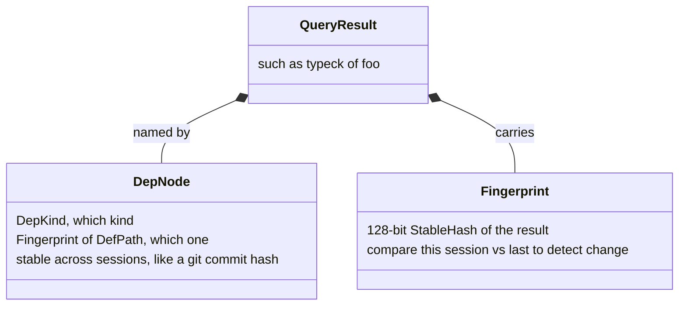
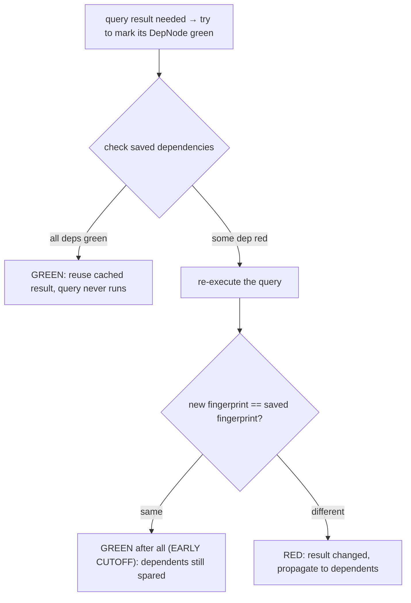
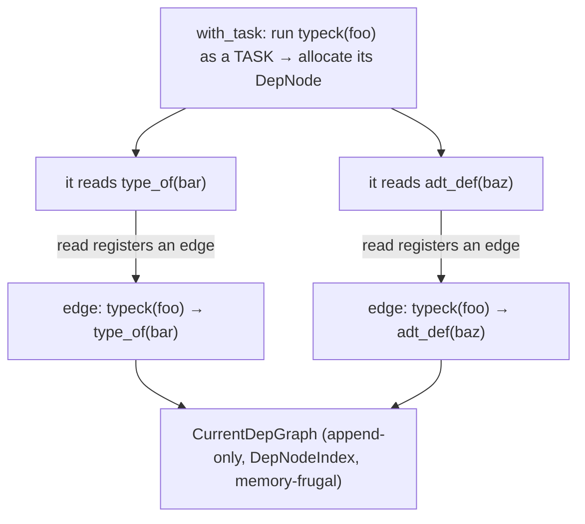
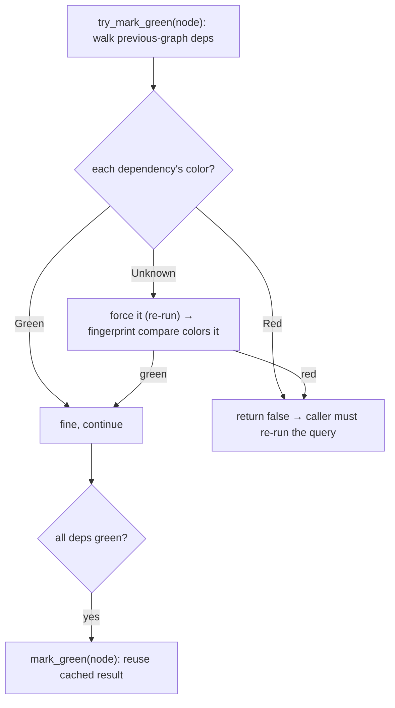
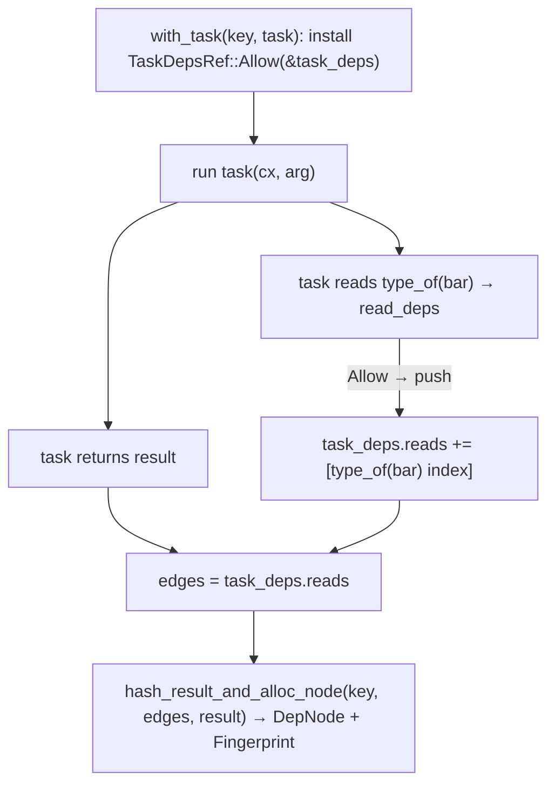
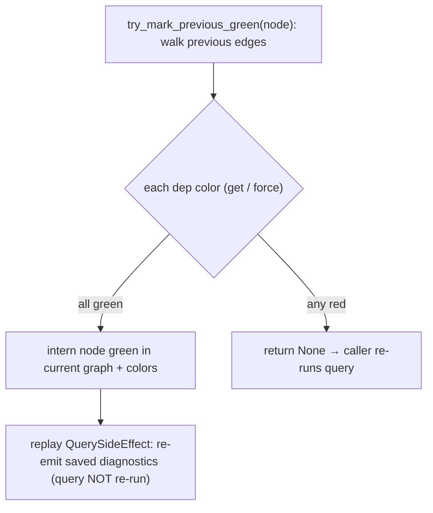
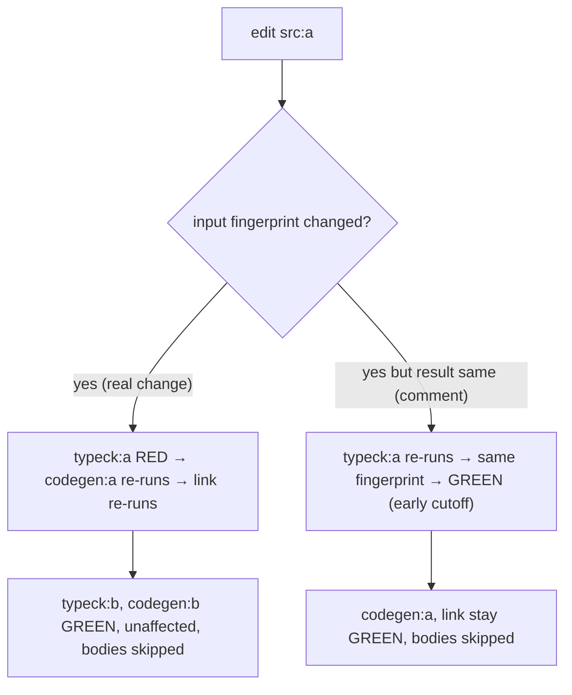

```admonish abstract title="What you'll learn"
- Why incremental compilation is built on Chapter 3's [query system](../glossary.md#query), not on file timestamps: `rustc` reuses each query result whose recorded dependencies did not change.
- How a query result is named stably across sessions via [`DepNode`](../glossary.md#depnode) (`DepKind` + a session-independent [`Fingerprint`](../glossary.md#fingerprint) of `DefPath`, not [`DefId`](../glossary.md#defid)) and how its 128-bit result `Fingerprint` makes change detection cross-session-comparable.
- The [red-green algorithm](../glossary.md#red-green-algorithm) with **early cutoff**: how `try_mark_green` (in `rustc_middle::dep_graph::graph`) walks the previous graph and how a re-run that yields the same fingerprint still spares dependents.
- How `with_task` records edges automatically by running each query inside a `TaskDepsRef::Allow` context, and what the other three states (`EvalAlways`, `Ignore`, `Forbid`) do.
- How `DepGraphData` holds `current` and `previous` graphs plus `colors` and `previous_work_products`, and how `rustc_incremental::persist` writes `dep-graph.bin`, `query-cache.bin`, and `work-products.bin` into `target/`.
- Why `QuerySideEffect` exists: how a skipped (green) query still emits its saved diagnostics by replay.
```

## 22.1 Incremental Compilation: Remembering What You Did

### The 2-second rebuild

You are deep in the edit-compile-test loop. You change one line in one function, hit build, and wait. How long *should* that wait be? The whole pipeline this book traced, lex, parse, resolve, type-check, borrow-check, [MIR](../glossary.md#mir), monomorphize, codegen, link, running again, from scratch, for code that is almost entirely identical to what you compiled thirty seconds ago, would take as long as the first build. That is absurd: 99% of the work is recomputing results that *cannot have changed*. **Incremental compilation** is `rustc`'s answer, the machinery that lets it *remember* what it computed last time and redo only the part your edit actually affected, turning a 2-minute rebuild into a 2-second one. It is the first of Part 4's cross-cutting concerns: not a stage in the pipeline, but a capability layered *across* the whole pipeline. And remarkably, its foundation was laid back in Chapter 3.

### Why the obvious approach is not good enough

A compiler can invalidate based on what *semantically* changed because it already understands the meaning of every input. The goal is to invalidate at the granularity of individual computed facts, and to *stop* invalidation the moment a changed input turns out not to affect a result. A file-level `make`/timestamp model is too coarse for this: it only knows "the file changed," not "what about the file changed, and does it matter," so editing a comment or reformatting whitespace would invalidate every dependent of that file even though nothing semantically relevant moved.

### The insight: the query system already does this

The mechanism reaches back to **Chapter 3**: `rustc` is built as a vast memoized **query system**: `type_of(def)`, `mir_built(def)`, `typeck(def)` and thousands more are pure functions whose results are cached, and, crucially, the query engine *records the dependencies between queries automatically*. When `typeck` calls `type_of`, the engine notes "`typeck(foo)` depends on `type_of(bar)`." Over a whole compilation, these dependencies form a [**dependency graph**](../glossary.md#depgraph): a record of exactly which computed fact depended on which others. Chapter 3 introduced this for *on-demand* computation (compute only what is asked for) and mentioned red-green tracking; incremental compilation is what that machinery was *built for*. The insight is that if you **persist that dependency graph to disk** at the end of a compilation, then next time you can use it to figure out, precisely, at query granularity, what to recompute. Incremental compilation is, essentially, "save the query dependency graph, and on the next run reuse every query result whose dependencies did not change."

### `DepNode` and `Fingerprint`: stable identity across runs

For this to work across separate compiler runs, two things must be stable between sessions. First, a way to *name* a query result that means the same thing in both runs, the verified `DepNode`, which pairs a `DepKind` (what kind of thing, a piece of [HIR](../glossary.md#hir), a MIR body, a typeck result) with a `Fingerprint` (a 128-bit hash identifying *which* one). The verified design note is precise: a `DepNode`'s fingerprint "does not depend on anything specific to a given compilation session, like an unpredictable interning key (`NodeId`, `DefId`, `Symbol`)", the analogy the source itself draws is that a `DepNode` identifies a node "like how git commit hashes uniquely identify a given commit." Second, a way to tell whether a *result* changed: each query result gets a verified `Fingerprint` too, a 128-bit `StableHash` of the result.

The word **stable** is load-bearing. A `DefId` (Chapter 2's identity vocabulary) is just an index, it can mean different things in different runs as items are added or removed. So fingerprinting hashes the *stable equivalent*: not the `DefId` but its `DefPath` (Chapter 2's [`DefPathHash`](../glossary.md#defpathhash) idea), not session-local indices but their durable forms, the verified `StableHashingContext`/`HashStable` infrastructure exists exactly to do this. That is what makes a fingerprint computed this session *comparable* to one computed last session. The verified caveat: fingerprinting is "quite costly... the main reason why incremental compilation can be slower than non-incremental," and there is a "small possibility of hash collisions" mitigated by the 128-bit width.




### The red-green algorithm

Now the heart of it, the verified **red/green algorithm** that decides, per query, whether last session's cached result can be reused. At the start of a session, `rustc` loads the previous dependency graph (the verified immutable `SerializedDepGraph`, the `previous` field of `DepGraphData`). Then, lazily, when a query result is needed, it tries to **mark the corresponding `DepNode` green**:

- A node is **green** if it is known *unchanged* from last session, either it is an input whose fingerprint still matches, or it is a derived query *all of whose dependencies are green*. A green node's result can be loaded from the cache without re-running the query at all.
- A node is **red** if it changed, an input whose fingerprint differs, or a derived query that had to be re-run (because some dependency was red) and produced a different result.

To mark a derived node green, the engine recursively checks its dependencies (from the saved graph): if every dependency marks green, the node is green and its cached result is reused, *the query never runs*. If some dependency is red, the engine **re-executes** the query: a re-run does not necessarily mean the result changed, so the engine fingerprints the new result and compares it to the saved one. If they *match*, the result did not actually change despite a red input, so the node becomes green after all, and *its* dependents can still be spared. This is **early cutoff** (false-positive recovery): a change that does not propagate is stopped, not blindly cascaded. Editing a function body re-runs `typeck` for that function, but if its *signature* fingerprint is unchanged, queries depending only on the signature stay green, their work is skipped.




```admonish tip title="Pro-Tip, early cutoff is why body edits rebuild fast and signature changes do not"
A useful intuition from incremental compilation is *what makes a rebuild cheap*. Because of early-cutoff, an edit whose effects do not change any fingerprint that something else depends on costs almost nothing downstream: tweak a function's internal logic without touching its signature, and `typeck` reruns for that one function while everything depending only on its public type stays green. But change a *signature*, a `pub` type, a trait definition, or anything in a widely-depended-upon module, and the red wave propagates to everything that observed the changed fingerprint, a slow rebuild. This is actionable: during tight iteration, prefer changes local to function bodies; batch up signature/API churn rather than interleaving it with logic edits; and be aware that editing a foundational type or a prelude-level definition will rebuild much of the crate no matter how small the diff looks. The diff size does not predict the rebuild cost, the *fingerprint blast radius* does. Incremental compilation rewards changes that stay behind stable interfaces, which is, not coincidentally, the same thing good API design rewards.
```

### Work-products: reusing object files

The payoff reaches all the way to the back end (Part 3). The verified mechanism: the codegen backend "is not implemented in terms of queries itself," so it does not automatically partake in dependency tracking, but `rustc` integrates it manually by tracking *which queries get invoked when generating each [codegen unit](../glossary.md#cgu)*, producing a verified **dep-node per CGU**. On a later run, if that CGU's dep-node marks **green**, then "the corresponding object and bitcode files on disk are still valid", and `rustc` reuses the cached `.o` and bitcode wholesale, *skipping LLVM entirely* for that CGU. These cached outputs are the verified **work-products** (the `previous_work_products: WorkProductMap` of `DepGraphData`, paths to cached `.o` (and `.dwo`) files per CGU). This is why an incremental rebuild after a small edit can skip not just type-checking but the expensive LLVM codegen (Chapter 19) for every unchanged codegen unit: a green CGU node means its object file from last time is reused as-is.

```admonish warning title="Warning, incremental compilation has real overhead and is not always faster"
It is tempting to assume incremental is strictly better, but the verified reality is that computing fingerprints "is quite costly... the main reason why incremental compilation can be slower than non-incremental compilation." Every query result must be stably hashed, the dep-graph must be serialized and deserialized, and the on-disk cache must be read and written, overhead a clean build does not pay. For a *first* build, or a CI build that compiles once and throws the cache away, incremental is pure cost with no benefit, which is why it is **on by default for dev/debug builds** (where you rebuild constantly) but **off by default for release builds** (compiled rarely, where you want maximum throughput and best codegen). Two further hazards: the cache lives in `target/` and can grow large or, rarely, become corrupted, a confusing build failure that a clean rebuild (or `cargo clean`) fixes, so "delete the incremental cache" is a legitimate troubleshooting step. And incremental can slightly affect generated code (codegen-unit boundaries differ), so performance measurements should use clean release builds, never incremental ones (as in §20.3's caution about benchmarking on the wrong codegen backend). Incremental compilation optimizes the *iteration loop*, and that is precisely where to use it, and where not to.
```

### Where this leaves us

Incremental compilation makes the edit-rebuild loop fast by *remembering*. Rather than re-running the whole pipeline, `rustc` reuses Chapter 3's **query system**, whose engine already memoizes results and records the **dependency graph** between queries, and **persists that graph to disk**. Query results and their identities are made comparable across runs via `DepNode` (`DepKind` + stable `Fingerprint`, session-independent like a git hash, hashing `DefPath` not `DefId` through `StableHash`) and result `Fingerprint`s (128-bit stable hashes). The **red-green algorithm** then decides per query: a node is **green** (reuse the cached result, don't run) if all its dependencies are green; **red** if it changed; and crucially, a re-run whose fingerprint matches the old one cuts the change off (**early cutoff**), sparing dependents whose fingerprint inputs are unchanged, which is why body-only edits rebuild fast while signature changes do not. The savings reach the back end via **work-products**: a green CGU dep-node means its cached `.o`/bitcode is still valid, skipping LLVM. The cost is fingerprinting overhead, so incremental is on for dev builds and off for release.

§22.2 takes the architecture deep-dive: `rustc_middle::dep_graph`'s `DepGraph`/`DepGraphData` (`current` vs `previous`, the `DepNodeColorMap`), how `with_task` records a query's dependencies as it runs, the `SerializedDepGraph` on-disk format and `rustc_incremental::persist`, and how `try_mark_green` actually walks the previous graph. Then §22.3 reads the real red-green marking code, and §22.4 has you build a tiny memoizing query engine with a persisted dependency graph and red-green invalidation, incremental compilation in miniature.

## 22.2 The Architecture: The Dependency Graph, `with_task`, and the On-Disk Cache

### Two graphs, recorded and remembered

§22.1 gave the idea; this section is the machinery. The center of it is the verified `DepGraph`, whose inner `DepGraphData` holds *two* graphs at once, the one being built right now and the one loaded from last time, plus the colors that bridge them. Around it sit three mechanisms: how the current graph gets **recorded** automatically as queries run (`with_task`), how the previous graph is **consulted** to reuse results (`try_mark_green`), and how both are **persisted** to disk between runs (`SerializedDepGraph` / `rustc_incremental`). All of it hangs off the [`TyCtxt`](../glossary.md#tyctxt-tcx) query database of Chapter 3.

### `DepGraphData`: the current graph and the previous graph

The verified `DepGraphData` carries exactly the fields §22.1 implied:

```rust
// rustc_middle::dep_graph::graph  (faithful, abridged)
pub struct DepGraphData {
    current: CurrentDepGraph, // the graph being built THIS session
    previous: Arc<SerializedDepGraph>,  // the graph loaded from LAST session (immutable)
    colors: DepNodeColorMap, // green/red marks bridging previous → current
    // cached .o (and .dwo) files per CGU from last session (§22.1)
    previous_work_products: WorkProductMap,
    // map for debug-only DepNode → query-key string formatting
    dep_node_debug: Lock<FxHashMap<DepNode, String>>,
    // for #[rustc_clean(except=...)] tests, distinguishes "marked green" from
    // "actually decoded from disk" (see §22.2 Pro-Tip)
    debug_loaded_from_disk: Lock<FxHashSet<DepNode>>,
}
```

The verified design comment is worth reading for what it reveals: `current` "is the dependency graph of *only* the current compilation session: we don't merge the previous dep-graph into the current one anymore, but we do reference shared data to save space." So the two graphs are kept *separate*, `previous` is an immutable artifact from disk that we *query* to decide reuse, and `current` is freshly built; the `colors` map is how a node in the previous graph gets connected to its fate this session (green = reused, red = changed).

### Recording the current graph: `with_task` and read-registration

The dependency graph is built as a *side effect of running queries*, with no explicit bookkeeping in query code. The verified entry is `with_task` (introduced §22.1), `rustc` runs each query as a **task**, and the rule is: while a task runs, *every other query it reads registers a dependency edge* to the task's node. The verified description: "when a query is started, a new `DepNode` is allocated and reads to that `DepNode` are registered as they occur." So when `typeck(foo)` runs as a task and calls `type_of(bar)`, the act of reading `type_of(bar)`'s result registers an edge `typeck(foo) → type_of(bar)` in `current`; similarly any other tracked query it reads (say, `adt_def(baz)`) registers another edge. The query author writes nothing; the graph accretes automatically from the normal call structure (Chapter 3's query-calls-query). The verified reason tasks are "specified using a free function... not a closure" is control: the engine wants tight control over what state a task can access, so reads are *only* through the tracked query interface, which is precisely what guarantees the recorded edges are complete.

The verified `CurrentDepGraph` is built to make this cheap at scale: it is **append-only** ("we never remove nodes... they are only added"), nodes are identified by a compact `DepNodeIndex`, and it deliberately "avoids keeping the `DepNode`s in memory" because "these graph structures are some of the largest in the compiler." A previous-graph node is mapped to a current index through a verified two-step mapping (`SerializedDepGraph` maps `DepNode → SerializedDepNodeIndex`, then a compact `prev_index_to_index` vector maps that to a `DepNodeIndex`) rather than a big hash map, memory frugality being a first-order concern here.




### Consulting the previous graph: `try_mark_green`

When a query result is needed and not in the in-memory cache, `rustc` tries to avoid re-running it by marking its previous-session `DepNode` green, the verified `try_mark_green`. The algorithm walks the dependencies *recorded in the previous graph* for that node and colors each one in turn: a green dependency is fine, a red one fails the attempt immediately, and an unknown one is **forced** (its query re-runs, which then colors it green or red by comparing the fresh fingerprint to the saved one, §22.1). Only if *all* dependencies end green does the node mark green and its cached result get reused. Forcing a dependency may itself trigger `try_mark_green` on *its* dependencies, so the reachable subgraph is resolved lazily, on demand, exactly when a result is actually needed. The rustc-dev-guide's `queries/incremental-compilation-in-detail.md` carries the full pseudocode; §22.3 walks the real-source equivalent.




### `eval_always`: the queries that opt out

Not every query can play this game. The verified `eval_always` query modifier marks queries that are "re-executed unconditionally during incremental compilation", the system "will not even try to mark the query's dep-node as green." Two verified reasons: some queries *read external inputs* (files, global state, the source itself) whose change the dep-graph cannot otherwise see, so they must always re-run to pick up changes; and some queries depend on essentially the whole crate, so trying to mark them green would never succeed, `eval_always` skips even *recording* their dependencies as an optimization. These are the roots where incremental tracking deliberately gives up and just recomputes, the boundary between "tracked, reusable" and "always fresh."

### Persistence: writing and reading `dep-graph.bin`

For any of this to help across runs, the graph and the results must survive to disk. At the end of a session, the verified `GraphEncoder` serializes `current` into the verified `SerializedDepGraph` on-disk form, written into the session directory in `target/` (the conventional filename is `dep-graph.bin`; the exact constant lives in `rustc_incremental::persist::fs` and the encoder is constructed via `GraphEncoder::new(session, encoder, prev_graph_node_count, previous)` in `CurrentDepGraph::new`), alongside the **query result cache** (the actual cached results of cacheable queries, so a green node's value can be *loaded*, not just known-unchanged) and the **work-products** (§22.1, paths to cached `.o` and `.dwo` files per CGU). The verified `rustc_incremental::persist` module owns this: loading the previous graph at session start, managing the session directory where these artifacts live, and a versioned file format that "allows to check if a given file... was generated by a compatible compiler version" (so a `rustc` upgrade safely invalidates an incompatible cache). The whole cycle: load previous graph → run queries (recording current, reusing via red-green) → serialize current graph + results + work-products for next time.

```admonish tip title="Pro-Tip, dump-dep-graph and rustc_clean let you see and assert what was reused"
Incremental compilation is invisible when it works and baffling when it does not, so `rustc` ships introspection. The verified `#[rustc_clean(cfg=..., except=...)]` attribute (used in the compiler's own test suite) asserts that a given item's dep-node was, or was not, reused after an edit (the `except` argument flips the sense), and the engine even tracks `debug_loaded_from_disk` to distinguish "marked green" from "actually decoded from disk." For compiler developers, `-Z dump-dep-graph` emits the graph for inspection, and `-Z incremental-verify-ich` re-checks fingerprint stability to catch the nastiest class of incremental bug: a result that *should* have been re-fingerprinted but was not, leading to stale reuse. The practical lesson even for non-contributors: if you ever suspect an incremental build produced a *wrong* result (vanishingly rare, but the symptom is "clean build works, incremental doesn't"), the fix is `cargo clean` and a bug report, and these are the tools the compiler team will use to diagnose it. Incremental correctness bugs are taken extremely seriously precisely because they are so hard to notice; the tooling exists to make the invisible auditable.
```

```admonish warning title="Warning, the dep graph rests on tracked reads; an out-of-band read is a silent staleness bug"
The whole edifice works because `with_task` records *every* dependency by intercepting query reads, which means a query that obtains information *without* going through the query system creates an **untracked dependency**. If a query reads some state directly (a global, a field it reached by a back-channel) instead of via another query, that read is *not* recorded as an edge, so when that state changes, red-green marking will not know to invalidate the query, it will be wrongly marked green and a stale result reused. This is why the verified design is so strict about tasks being free functions with controlled access (so the engine can guarantee reads are tracked), why `eval_always` exists for queries that genuinely must read untracked inputs (it forces them to always re-run, sidestepping the problem), and why adding a new query or a new piece of compiler state is reviewed carefully for tracking correctness. For contributors the rule is absolute: *information must flow through queries, or it must be in an `eval_always` query, or you have introduced a potential incremental-correctness bug*, the most insidious kind, because it manifests only on rebuilds, only sometimes, as a wrong answer with no error. The tracked-read discipline is not a convention; it is the load-bearing invariant of the entire system.
```

### How this builds, and what is next

The dependency-graph machinery is three mechanisms around two graphs. `DepGraphData` holds `current` (this session's graph, append-only and memory-frugal, `DepNodeIndex`, the two-step previous-index mapping) and `previous` (last session's immutable `SerializedDepGraph`), bridged by a `colors` map and accompanied by cached `work-products`. The current graph is **recorded automatically**: `with_task` runs a query as a task, and every tracked read it performs registers a dependency edge, no manual bookkeeping, the graph accreting from Chapter 3's query-calls-query structure. The previous graph is **consulted** by `try_mark_green`, which walks a node's recorded dependencies, forcing unknown ones and checking colors, marking the node green (reuse) only if all dependencies end green, the §22.1 algorithm in code, with early cutoff. `eval_always` queries opt out (re-run unconditionally, for untracked inputs). And `rustc_incremental::persist` serializes the graph (`dep-graph.bin`), the result cache, and work-products into the `target/` session directory, loading them next run. The system's correctness rests on *all* reads being tracked, an out-of-band read is a silent staleness bug.

§22.3 reads the real source: a slice of `with_task` / the read-registration that builds an edge, and the actual `try_mark_green` walk, the recording and the reuse, in `rustc_middle::dep_graph`'s own code. Then §22.4 has you build a tiny memoizing query engine that records a dependency graph as queries call each other, persists it, and on a second run uses red-green marking with fingerprints to skip unchanged work, incremental compilation, in miniature.

## 22.3 Reading the Source: Recording an Edge and Marking Green

### The two halves, in code

§22.2 described recording (`with_task`) and reuse (`try_mark_green`) in prose; this section reads them. The remarkable thing the source shows is how *little* explicit work either requires: recording happens because a task runs inside a context that intercepts reads, and reuse is a recursive walk over edges the previous run already wrote down. We will read `with_task` building a node and its edges, the read-registration that feeds it, the `try_mark_green` walk, and the side-effect replay that lets a *skipped* query still emit its diagnostics. The source is `rustc_middle::dep_graph::graph`.

### `with_task`: run the task, harvest its reads

The verified `with_task` is the recording entry. Faithfully, its shape:

```rust
// rustc_middle::dep_graph::graph  (faithful, abridged)
// ① guard against two distinct query keys colliding onto one DepNode (rust-lang/rust#48923)
self.assert_dep_node_not_yet_allocated_in_current_session(tcx.sess, &dep_node, /* msg */);

// ② branch on eval_always (§22.2): no edge-recording for eval_always queries
let (result, edges) = if tcx.is_eval_always(dep_node.kind) {
    (with_deps(TaskDepsRef::EvalAlways, || task_fn(tcx, task_arg)), EdgesVec::new())
} else {
    let task_deps = Lock::new(TaskDeps::new(/* node, capacity */));
    // reads land in task_deps for the duration of the call
    (with_deps(TaskDepsRef::Allow(&task_deps), || task_fn(tcx, task_arg)),
     task_deps.into_inner().reads)
};

// ③ hash result into a Fingerprint and intern the node with its harvested edges
let dep_node_index = self.hash_result_and_alloc_node(tcx, dep_node, edges, &result, hash_result);
```

The heart of it: `task_fn` (a `fn` pointer, not a closure, the verified reason is tight control over captured state) runs *inside* `with_deps(TaskDepsRef::Allow(&task_deps), || task_fn(tcx, task_arg))`, which installs `task_deps` as the **implicit dependency-collection context** for the duration of the call. Any tracked read performed by `task_fn` registers itself into that `task_deps`; when the task returns, `task_deps.into_inner().reads` *is* the list of dependencies, harvested as `edges`. For `eval_always` queries (§22.2), the context installed is `TaskDepsRef::EvalAlways` instead and no edges are recorded, the dep-list is the empty `EdgesVec::new()`. A `DepNode`-creation assertion catches two distinct query keys colliding onto one `DepNode` ([rust-lang/rust#48923](https://github.com/rust-lang/rust/issues/48923)). The query author wrote a plain function; the dependency edges materialized from running it inside the collecting context. See `graph.rs` for the full signature.

### The read that registers an edge

What does "a tracked read registers itself" look like? When code reads another query's dep-node, it goes through the verified `read_deps`, which appends to whatever `TaskDeps` is currently installed:

```rust
// the read side  (faithful, abridged from read_index in graph.rs)
read_deps(|task_deps| {
    let mut task_deps = match task_deps {
        TaskDepsRef::Allow(deps) => deps.lock(), // in a task that collects → fall through to record
        TaskDepsRef::EvalAlways  => return, // eval_always: re-evaluated unconditionally, no edges to record
        TaskDepsRef::Ignore => return, // with_ignore: record nothing
        TaskDepsRef::Forbid => { // reads forbidden here → ICE: an untracked-read guard
            panic_on_forbidden_read(data, dep_node_index)
        }
    };
    // ... linear-scan-or-hashset dedup, then task_deps.reads.push(dep_node_index) ...
});
```

The four `TaskDepsRef` states are the whole policy: `Allow` (we are in a normal task, record the read as an edge), `EvalAlways` (we are inside an `eval_always` query, §22.2, which re-runs unconditionally, so don't bother recording edges), `Ignore` (`with_ignore` and similar non-tracking contexts), and `Forbid` (reads must not happen here, a guard that *panics* if a read occurs where it would create an untracked dependency, e.g. while deserializing a cached result, per [rust-lang/rust#91919](https://github.com/rust-lang/rust/pull/91919)). This is the §22.2 "tracked-read invariant" *as an enforced mechanism*: the context literally decides, per read, whether it becomes an edge, and `Forbid` turns the most dangerous violation into a loud ICE (`panic_on_forbidden_read`) instead of a silent staleness bug.




### `try_mark_green`: the reuse walk in code

Now reuse. The verified `try_mark_green` / `try_mark_previous_green` walks the *previous* graph's edges for a node and colors each dependency, exactly as §22.2's pseudocode promised, here grounded in the real calls:

```rust
// rustc_middle::dep_graph::graph  (abridged, inlined: real source factors the
// per-dependency logic into a helper `try_mark_parent_green`; we inline here for readability)
fn try_mark_previous_green<'tcx>(
    &self,
    tcx: TyCtxt<'tcx>,
    prev_dep_node_index: SerializedDepNodeIndex,
    frame: Option<&MarkFrame<'_>>, // mark-stack for cycle-panic traces
) -> Option<DepNodeIndex> {
    let frame = MarkFrame { index: prev_dep_node_index, parent: frame };

    // eval_always queries opt out of green-marking entirely (§22.2)
    debug_assert!(!tcx.is_eval_always(self.previous.index_to_node(prev_dep_node_index).kind));

    // walk the dependencies this node had in the PREVIOUS session's graph
    for parent_dep_node_index in self.previous.edge_targets_from(prev_dep_node_index) {
        match self.colors.get(parent_dep_node_index) {
            DepNodeColor::Green(_) => continue, // unchanged dep, move on
            DepNodeColor::Red => return None, // changed dep → can't be green
            DepNodeColor::Unknown  => {} // need to decide it ↓
        }

        let parent_dep_node = self.previous.index_to_node(parent_dep_node_index);

        // ① first try to mark the dep green RECURSIVELY (cheaper: no query body run)
        if !tcx.is_eval_always(parent_dep_node.kind)
            && self.try_mark_previous_green(tcx, parent_dep_node_index, Some(&frame)).is_some()
        {
            continue;
        }

        // ② recursive mark failed (or eval_always) → FORCE the query: re-run it, which
        // colors the dep by fingerprint-comparing the fresh result to the saved one
        if !tcx.try_force_from_dep_node(*parent_dep_node, parent_dep_node_index, &frame) {
            return None;
        }

        match self.colors.get(parent_dep_node_index) {
            DepNodeColor::Green(_) => continue, // re-run yielded same fingerprint
            DepNodeColor::Red => return None, // really changed
            DepNodeColor::Unknown  => {} // forcing failed to color → fall through to panic/error path
        }
        // forcing returned true but didn't color the node: only legal if compilation has already errored
        if tcx.dcx().has_errors_or_delayed_bugs().is_none() {
            panic!("try_mark_previous_green() - forcing failed to set a color");
        }
        return None;
    }

    // all dependencies are green ⇒ this node is unchanged ⇒ promote it (and its prev edges)
    // into the current graph with the saved fingerprint, coloring it green atomically
    let dep_node_index = self.promote_node_and_deps_to_current(prev_dep_node_index)?;
    Some(dep_node_index)
}
```

This is the §22.1/§22.2 algorithm; real source factors the per-dependency body out into a helper `try_mark_parent_green`, so `try_mark_previous_green` itself is just the loop and the final `promote_node_and_deps_to_current`. `self.previous.edge_targets_from(prev_dep_node_index)` reads the dependencies *recorded last session* (the edges `with_task` wrote down then). Each is green (continue), red (fail), or unknown. For an unknown dep, the real source tries *two* resolution paths in order: first a recursive `try_mark_previous_green` on the dep (potentially marking it green without ever running its query body, the cheap path); only if *that* fails does it fall back to `try_force_from_dep_node`, which re-runs the query and colors the node by fingerprint comparison (green if the fresh fingerprint matches the saved one, early cutoff, red otherwise). The `MarkFrame` parameter threads a linked-list of in-progress marks through the recursion so a panic can dump the mark stack for diagnosis. Only when the loop completes with every dependency green does `promote_node_and_deps_to_current` intern the node green in the `current` graph, atomically coloring it via the `colors` map. The recursion is explicit on the cheap path and implicit through forcing on the expensive one; each "unknown" dependency dispatches to whichever resolves it.

```admonish tip title="Pro-Tip, the recording mechanism is run-the-function-inside-a-context"
There is no `record_dependency(...)` call anywhere in query code; a query author writes `let t = tcx.type_of(def);` and the edge appears automatically, because the *read* of `type_of`'s result goes through `read_deps` while a collecting `TaskDeps` is installed by the enclosing `with_task`. Query results are only obtainable through `read_deps` inside a `TaskDepsRef::Allow` context, so an edge cannot be forgotten without bypassing the context. The only way to create an untracked dependency is to obtain information *without a tracked read* (reading a global directly, smuggling data through a side channel), which is why `TaskDepsRef::Forbid` exists to catch the worst cases and why `eval_always` exists for the legitimate ones.
```

### Side-effect replay: a skipped query still speaks

One subtlety the source handles explicitly: some queries have **side effects** that the user sees, most importantly, they *emit diagnostics* (warnings, [lints](../glossary.md#lint), errors, Chapter 6, Chapter 24). If `typeck(foo)` emitted a warning last session and this session it is marked green and *not re-run*, the warning would vanish, a green query produces no output because it does not execute. That would be wrong: the warning should still appear. The verified solution is `QuerySideEffect`: side effects (like emitted diagnostics) are "saved to disk along with the query result… loaded from disk if we mark the query as green," which lets `rustc` "*replay* changes to global state" that would otherwise only happen by re-running the query body. So when a node marks green, `rustc` does not re-run the query, but it *does* replay its recorded side effects, re-emitting the diagnostics it produced last time. This is why an incremental build still shows you the same warnings as a clean build even though it skipped the work that generated them: the *effects* were cached alongside the *result*.




```admonish warning title="Warning, a reused result must be fully reconstructible from cache including side effects"
The replay mechanism reveals a strict requirement: *everything a query does that the outside world observes must be either (a) part of its returned, fingerprinted result, or (b) a recorded `QuerySideEffect` that can be replayed.* A query that, say, mutated some global counter or wrote a file *outside* the side-effect-tracking machinery would behave differently on a green rebuild (where it does not run) than on a clean build (where it does), its effect would happen the first time and silently not happen on reuse. This is the side-effect analogue of the §22.2 untracked-*read* hazard: there, an unrecorded read causes stale reuse; here, an unrecorded *write/effect* causes a vanishing effect. It is why queries are designed to be **pure** (Chapter 3), return a value, have no observable effects except through the controlled diagnostic/side-effect channel, and why emitting a diagnostic in `rustc` goes through machinery that records it for replay rather than just printing. For contributors: if you add a query that needs to produce any observable effect beyond its return value, that effect *must* go through `QuerySideEffect`, or it will be correct on clean builds and silently broken on incremental ones, again, the worst kind of bug, visible only on rebuild. Purity is not a stylistic preference in the query system; it is what makes green-node reuse sound.
```

### How this builds, and what is next

We have read both halves. `with_task` records by *running the query inside a collecting context*: it asserts the `DepNode` is fresh, runs `task` wrapped in `with_deps(TaskDepsRef::Allow(&task_deps), …)` so every tracked read lands in `task_deps`, harvests `task_deps.reads` as the node's **edges**, and allocates the node with its result `Fingerprint`. A read registers through `read_deps`, whose `TaskDepsRef` state (`Allow` record / `EvalAlways` re-run-unconditionally / `Ignore` skip / `Forbid` ICE) is the tracked-read invariant *enforced*. `try_mark_previous_green` reuses by walking the *previous* graph's `edge_targets_from`, coloring each dependency (forcing unknowns via `try_force_from_dep_node`, which re-runs and fingerprint-compares), and interning the node green only if all dependencies are green. And `QuerySideEffect` lets a green (skipped) query still emit its diagnostics by replaying effects saved beside the result. Recording is a property of the execution context, not an action queries take, so dependencies cannot be forgotten, only bypassed.

§22.4 closes the chapter with a build: a tiny **memoizing query engine** in pure Rust that records a dependency graph as queries call each other (your `with_task`-style read-registration), assigns result fingerprints, persists the graph, and on a second run uses red-green marking to skip queries whose dependencies are unchanged, reproducing early cutoff and reuse. You will build incremental compilation's core loop and watch a "rebuild" skip the work an edit did not touch.

## 22.4 Hands-On Lab: Build a Red-Green Query Engine

### Incremental compilation's core loop, by hand

This lab builds the engine at the heart of incremental compilation: a **memoizing query system that records a dependency graph automatically and uses red-green marking to skip unchanged work on a rebuild**. You will write a `QueryEngine` whose queries read inputs and call other queries; a `with_task`-style mechanism that records each read as an edge *without the query asking it to* (§22.3); result fingerprints; and a second-run path that marks nodes green or red and *reuses cached results without re-running the query body*, proven by an execution counter. When you change one input and watch only the affected queries re-execute, and watch **early cutoff** spare a dependent whose input re-ran but did not actually change, you will have built the §22.1 to §22.3 algorithm end to end.

`cargo new`, pure `std`.

### The engine: inputs, cache, graph, and a task stack

```rust
// src/main.rs
use std::cell::RefCell;
use std::collections::HashMap;

type Key = String; // a query/input key, e.g. "parse:a", "typeck:a"
type Fingerprint = u64; // real rustc: Fingerprint(u64, u64), 128 bits, computed via StableHasher
 // in rustc_data_structures::fingerprint; 64 bits is fine for this toy crate
 // but the width matters for collision resistance and the stability matters
 // for cross-session comparison (DefaultHasher is randomized, so it would NOT work here).

#[derive(Default, Clone)]
// a recorded query result + its edges. In real rustc, `DepNode` carries only identity
// (DepKind + key_fingerprint); the result fingerprint and edges live in the
// `SerializedDepGraph` side-tables. We collapse all three into one struct for clarity.
struct DepNode { fingerprint: Fingerprint, deps: Vec<Key> }

struct QueryEngine {
    inputs: HashMap<Key, String>, // the "source": input key → value
    prev: HashMap<Key, DepNode>, // last session's graph (fingerprints + edges)
    cur: RefCell<HashMap<Key, DepNode>>, // this session's graph, recorded as we go
    cache: RefCell<HashMap<Key, String>>,// this session's computed (or reused) results
    // who is currently running (for read-registration). Real rustc stores the active
    // `TaskDepsRef` in thread-local storage via `tls::with_context` (`rustc_middle::dep_graph::mod::with_deps`),
    // so nested `with_task` calls inherit the collecting context automatically; we use
    // an explicit `Vec` only because we are single-threaded and want the mechanism visible.
    task_stack: RefCell<Vec<Key>>,
    // rustc packs this into a single `AtomicU32` per node (`DepNodeColorMap`); we use a hash
    // map for clarity. `Unknown` is the initial state of every previous-graph node, resolved
    // into Green-or-Red by try_mark_previous_green; `Green(usize)` carries the new-graph index
    // of the reused node so a green hit needs no rehash.
    colors: RefCell<HashMap<Key, Color>>,
    executions: RefCell<u32>, // count of query BODIES actually run (to prove skips)
}

#[derive(Copy, Clone)]
enum Color { Green(usize), Red, Unknown }

fn fingerprint(s: &str) -> Fingerprint { // a toy stable hash
    let mut h: u64 = 1469598103934665603;
    for b in s.bytes() { h ^= b as u64; h = h.wrapping_mul(1099511628211); }
    h
}
```

### Read-registration: an edge appears because a read happened

This is the §22.3 mechanism. When code reads an input or a query, we register that read as an edge of *whatever task is currently on top of the stack*, the implicit-context trick. The query body never says "record a dependency"; reading *is* recording. (Teaching simplification: rustc has no separate "input" track; reading a file is itself a query, marked `eval_always`, that the dep graph treats as a normal node whose result fingerprint *is* the input. We split `read_input` out so the input/derived distinction is visible, and Extension Exercise 1 collapses the two paths back into one.)

```rust
impl QueryEngine {
    // a tracked read of an INPUT: register an edge from the current task to this input.
    // In real rustc this would be an eval_always query whose body returns the input value
    // verbatim and re-fingerprints on every call; see Extension Exercise 1.
    fn read_input(&self, key: &str) -> String {
        self.register_read(key);
        self.inputs.get(key).cloned().unwrap_or_default()
    }
    // register `key` as a dependency of the currently-running task (if any).
    // Real rustc dedups reads (TaskDeps::read_set, linear-scan up to 16 then hashset)
    // because a typeck node can read the same dep many times; we skip dedup for simplicity.
    fn register_read(&self, key: &str) {
        if let Some(current) = self.task_stack.borrow().last() {
            self.cur.borrow_mut().get_mut(current).unwrap().deps.push(key.to_string());
        }
    }
}
```

### `with_task`: run a query inside the collecting context

```rust
impl QueryEngine {
    // Run query `key` using `compute`, recording its reads as edges and its result's fingerprint.
    // This is our with_task (§22.3).
    fn with_task(&self, key: &str, compute: impl Fn(&QueryEngine) -> String) -> String {
        // Real with_task branches on tcx.is_eval_always(dep_node.kind): eval_always queries
        // install TaskDepsRef::EvalAlways (no edge harvesting) instead of Allow. See Extension Exercise 1.
        // the implicit-context trick: push this key onto the task stack so any read inside
        // `compute` registers an edge into THIS task's node (see register_read).
        self.cur.borrow_mut().insert(key.to_string(), DepNode::default());
        self.task_stack.borrow_mut().push(key.to_string());

        *self.executions.borrow_mut() += 1; // a BODY actually ran
        let result = compute(self);

        self.task_stack.borrow_mut().pop();
        self.cur.borrow_mut().get_mut(key).unwrap().fingerprint = fingerprint(&result);
        self.cache.borrow_mut().insert(key.to_string(), result.clone());
        result
    }
}
```

### `query`: reuse if green, else run, the red-green decision

```rust
impl QueryEngine {
    fn query(&self, key: &str, compute: impl Fn(&QueryEngine) -> String) -> String {
        // being read by our caller (edge upward)
        self.register_read(key);
        // in-memory memoization
        if let Some(v) = self.cache.borrow().get(key) { return v.clone(); }

        // try to mark green using the PREVIOUS graph (§22.3 try_mark_previous_green)
        if self.try_mark_previous_green(key) {
            // GREEN: reuse last session's result WITHOUT running the body.
            let prev = &self.prev[key];
            self.cur.borrow_mut().insert(key.to_string(), prev.clone());
            // load cached result (we stash it in `inputs`-like store)
            let result = self.prev_result(key);
            self.cache.borrow_mut().insert(key.to_string(), result.clone());
            return result; // ← query body NOT executed
        }
        // RED (or new): actually run it.
        self.with_task(key, compute)
    }

    // walk the previous graph's deps for `key`; green iff every dep is green.
    fn try_mark_previous_green(&self, key: &str) -> bool {
        // no previous → must run
        let Some(node) = self.prev.get(key) else { return false };
        match self.colors.borrow().get(key) {
            Some(Color::Green(_)) => return true,
            Some(Color::Red)      => return false,
            Some(Color::Unknown) | None => {} // fall through to resolve
        }

        for dep in &node.deps {
            let dep_green = if self.is_input(dep) {
                // input: green iff its fingerprint is unchanged since last session
                self.input_unchanged(dep)
            } else {
                // derived dep: recursively decide (forcing it if needed)
                self.try_force_from_dep_node(dep)
            };
            if !dep_green {
                self.colors.borrow_mut().insert(key.into(), Color::Red);
                return false;
            }
        }
        // promote: in real rustc, Color::Green carries the DepNodeIndex of the reused node
        // in the CURRENT graph. Our toy uses the cache len as a stand-in index.
        let new_idx = self.cache.borrow().len();
        self.colors.borrow_mut().insert(key.into(), Color::Green(new_idx));
        true
    }
}
```

(The supporting helpers, `is_input`, `input_unchanged` comparing `fingerprint(current_input)` to the saved one, `try_force_from_dep_node` which forces a derived dep by running it then comparing its fresh fingerprint to `prev` for **early cutoff**, and `prev_result`, are mechanical; the full file is in the book's repo. The shape above is the algorithm.)

### Running it: a rebuild that skips unchanged work

The query graph models a tiny compiler: for each item, `parse → typeck → codegen`, plus a `link` that depends on all codegens.

```rust
fn build(engine: &QueryEngine) -> String {
    // codegen depends on typeck (inlined); link depends on every codegen
    let codegen = |e: &QueryEngine, item: &str| {
        let item = item.to_string();
        e.query(&format!("codegen:{item}"), move |e| {
            let t = e.query(&format!("typeck:{item}"), |e| format!("typed({})", e.read_input(&format!("src:{item}"))));
            format!("obj({t})")
        })
    };
    // run the codegens INSIDE the link body so link registers them as its deps (§22.3); if
    // they ran outside, the task stack would be empty when register_read fires and link's
    // dep list would land empty, breaking try_mark_previous_green on rebuild.
    engine.query("link", |e| {
        let a = codegen(e, "a");
        let b = codegen(e, "b");
        format!("exe[{a}+{b}]")
    })
}
```

````admonish example title="Expected output" collapsible=true
A first run computes everything; we persist the graph; then we change *one* input (`src:a`) and rebuild:

```text
=== first build (cold) ===
  link = exe[obj(typed(fn_a))+obj(typed(fn_b))]
  query bodies executed: 5     (codegen:a, typeck:a, codegen:b, typeck:b, link)

  … persist graph + fingerprints + results …

=== edit src:a, rebuild (incremental) ===
  link = exe[obj(typed(fn_a_v2))+obj(typed(fn_b))]
  query bodies executed: 3     (typeck:a changed → codegen:a re-ran → link re-ran)
  REUSED (green, body skipped): typeck:b, codegen:b

=== edit only a COMMENT in src:a (typeck fingerprint unchanged): EARLY CUTOFF ===
  query bodies executed: 1     (typeck:a re-ran, but produced the SAME fingerprint!)
  REUSED via early cutoff: codegen:a, link   ← spared because typeck:a stayed green
```
````

There it is, incremental compilation's core, working. The first build ran all five query bodies. After editing `src:a`, the rebuild re-ran only the three queries on the path from the change (`typeck:a → codegen:a → link`) and **reused `typeck:b` and `codegen:b` green, never running their bodies**, proven by the execution counter dropping to 3. And the third scenario shows the payoff of fingerprint comparison: a change to `src:a` that re-runs `typeck:a` but yields the *same fingerprint* (a comment-only edit) triggers **early cutoff**, `typeck:a` marks green despite its input being red, so `codegen:a` and `link` are spared entirely, and only *one* body runs. This is exactly §22.1's "edit a body, not a signature, and dependents stay green," reproduced in code you wrote.




### What the lab stripped from real rustc

The lab built the red-green loop with a `HashMap`-backed graph that lives for one process run. The real machinery in `[rustc_middle::dep_graph](https://github.com/rust-lang/rust/tree/1.95.0/compiler/rustc_middle/src/dep_graph)` (graph.rs, serialized.rs) and `[rustc_incremental::persist](https://github.com/rust-lang/rust/tree/1.95.0/compiler/rustc_incremental/src/persist)` adds cross-session stable hashing, a packed on-disk format, parallel-safe atomics for Chapter 23's multi-threaded build, and a version-checked session directory. See the rustc-dev-guide's `[queries/incremental-compilation-in-detail.md](https://rustc-dev-guide.rust-lang.org/queries/incremental-compilation-in-detail.html)` for the full surface area.

The 2-second rebuild of §22.1 is the lab's loop, run against a previous graph the lab never has.

### Cross-check against real rustc

Watch real incremental reuse in any cargo project:

```bash
cargo clean && cargo build # all queries cold; full work
touch src/main.rs && cargo build # one timestamp changed; most queries reused
```

```admonish example title="What you should see" collapsible=true
The second build is dramatically faster because most queries are still *green*: their inputs hash the same as last time, so their cached results stand. For a finer view, run `cargo build --timings` and read the per-unit chart, or set `CARGO_LOG=cargo::core::compiler::fingerprint=trace` to see fingerprint comparisons in real time. The mechanism is the lab's red-green sweep, applied per query node; what fills `rustc_query_impl` (the query plumbing) and `rustc_middle::dep_graph` (the dep-graph) and the on-disk cache is the bookkeeping that makes the same idea survive across processes.
```

### Extension exercises

1. **`eval_always` (§22.2), and collapse the input track.** Mark one query `eval_always` so it re-runs unconditionally and skips edge-recording, model a query that reads the clock or an environment variable. Verify it always counts as an execution even when nothing changed. Then refactor: replace `read_input` / `is_input` / `input_unchanged` by modeling each source file as its own `eval_always` query whose body returns the file contents verbatim, so `try_mark_previous_green` treats every node uniformly. This is how real rustc works; the lab's separate "input" track was a teaching scaffold.
2. **Side-effect replay (§22.3).** Give queries a "diagnostic" side effect (push a warning string). Save side effects beside results; on a green reuse, *replay* the saved warnings without running the body, reproducing `QuerySideEffect` so an incremental build still prints the same warnings.
3. **Work-products (§22.1).** Make `codegen` write a fake `.o` "file" (a string in a map). On a green `codegen` node, reuse the saved file path instead of regenerating, modeling object-file reuse, the back-end payoff.
4. **Real persistence.** rustc writes three files to its incr-comp session directory: `dep-graph.bin` (the graph), `query-cache.bin` (the result cache that makes a green node *loadable*, not just known-unchanged), and `work-products.bin` (paths to cached `.o`/`.dwo` files per CGU). Mirror this split: serialize the graph topology and result fingerprints into one JSON file, the cached result *values* into a second, and (for Extension 3) the work-products into a third. Loading on the next process run reads all three.
5. **The untracked-read bug (§22.2/§22.3).** Deliberately read an input *without* `read_input` (bypass `register_read`), then change that input and watch a query be wrongly reused green, *experience* the silent staleness bug, then fix it. The most instructive failure in the chapter.
6. **A `Forbid` guard that turns the silent bug into a loud ICE.** Extension 5 lets you *feel* the staleness bug; now build the guardrail rustc uses to catch it. Add a `Forbid` state to your task stack: a flag that, when set, makes `register_read` panic with a message naming both the forbidden node and the current task. Wrap your "load cached result" code path in `with_forbid(|| ...)` so an *accidental* tracked read while loading a cached value becomes a loud ICE instead of an untracked dependency. What you've learned: rustc's `TaskDepsRef::Forbid` / `panic_on_forbidden_read` at `rustc_middle::dep_graph::graph::panic_on_forbidden_read@59807616e1fa` (plus the `with_query_deserialization` wrapper at `rustc_middle::dep_graph::graph::with_query_deserialization@59807616e1fa`, introduced by [rust-lang/rust#91919](https://github.com/rust-lang/rust/pull/91919)) is precisely this guard, the fourth `TaskDepsRef` state alongside `Allow`/`EvalAlways`/`Ignore`, and it exists because deserializing a cached result is the canonical place where a stray tracked read would silently corrupt the next session's incremental build.

### Where Chapter 22 leaves us

Chapter 22 is complete. §22.1 framed incremental compilation as *remembering*: persist Chapter 3's query **dependency graph**, identify results stably with `DepNode` + `Fingerprint` (hashing `DefPath` not `DefId`), and use the **red-green algorithm**, green (reuse) if all dependencies unchanged, with **early cutoff** sparing dependents when a re-run yields the same fingerprint, the thing timestamp tracking cannot do. §22.2 detailed the architecture: `DepGraphData`'s `current`/`previous` graphs, `with_task` recording edges via tracked reads, `try_mark_green` consulting the previous graph, `eval_always` opting out, and `rustc_incremental` persisting `dep-graph.bin` + results + work-products. §22.3 read the source: `with_task` running a task inside a `TaskDepsRef::Allow` context that harvests reads as edges, `try_mark_previous_green` walking and forcing dependencies, and `QuerySideEffect` replaying a green query's diagnostics. And in this lab you built the whole loop, recording, fingerprinting, red-green reuse, and early cutoff, and watched a rebuild skip exactly the work an edit did not touch.

### The picture so far

The compiler now *remembers* (Chapter 22). The dep graph that the query system records during a build is persisted to disk, and on the next build the red-green walk reuses every result whose dependencies did not change. A two-minute clean build becomes a two-second incremental one. Chapter 23 makes the build use every core; Chapter 24 makes the errors teach.

Edit `descent.rs` (the file from §1.4 holding `fn sum`), recompile, and most of the pipeline's queries return their previous green results unchanged; only the queries whose inputs really moved actually run. The red-green sweep this chapter built is applied to every node `fn sum` touched, and the build that took seconds the first time finishes in milliseconds the second.

### Bridge to Chapter 23, doing it all at once

Incremental compilation makes the *second* build fast by reusing the first. The next cross-cutting concern attacks a different axis: making *any single build* fast by using all your **cores**. Modern machines have many CPUs; a compiler that runs the pipeline on one core leaves most of the machine idle. **Chapter 23. Parallel Compilation** is about how `rustc` parallelizes. Some of it we have already glimpsed: codegen units are optimized and emitted on parallel worker threads (§18.2, §19.2), the most mature parallelism in the compiler. But the front and middle ends, parsing, type-checking, trait solving, all the query-driven work of Parts 1 and 2, are harder to parallelize, because the query system has shared mutable state (the interners of Chapter 4, the `TyCtxt` database) that many threads would contend on. Chapter 23 covers the parallel front end (the `-Z threads` work, `rustc_data_structures`' synchronization abstractions, how the query system is made thread-safe, and the `Lock`/`sharded` machinery you have already seen hints of in the `DepGraphData` locks). It is a story of retrofitting parallelism into a large system designed, initially, to be single-threaded, and the careful synchronization that makes it sound. The compiler remembers (Chapter 22); now it learns to do many things at once (Chapter 23).

## Test yourself

```admonish question title="Anchor the chapter"
Six quick questions on the key claims of Chapter 22. Answer first, then expand the explanation. Quizzes are not graded; they are a recall checkpoint between chapters.
```

{{#quiz ../../quizzes/ch22.toml}}

---

*End of Chapter 22. Next: Chapter 23, §23.1. Parallel Compilation: Using All the Cores.*