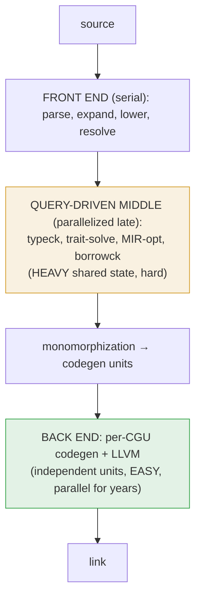
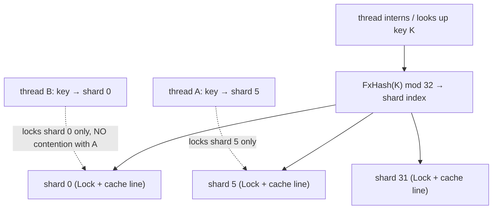
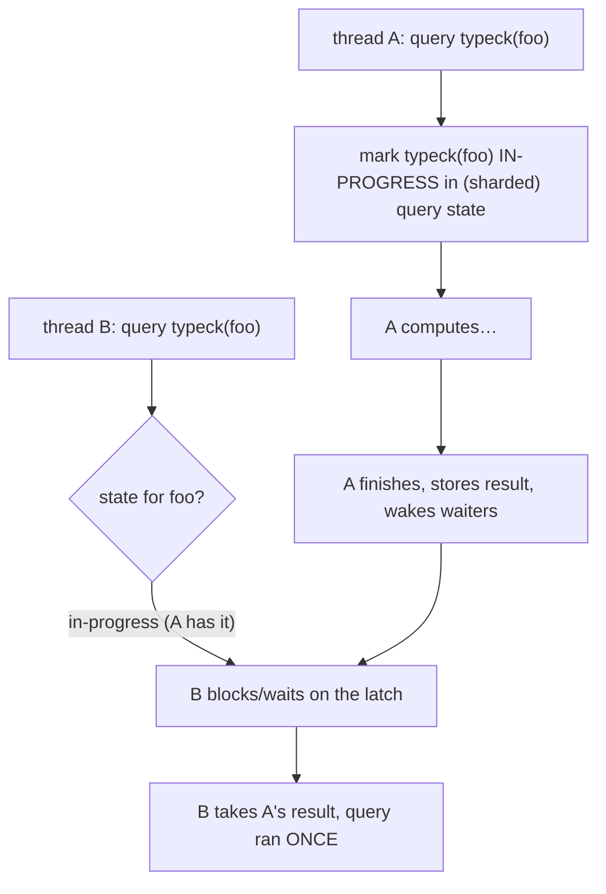
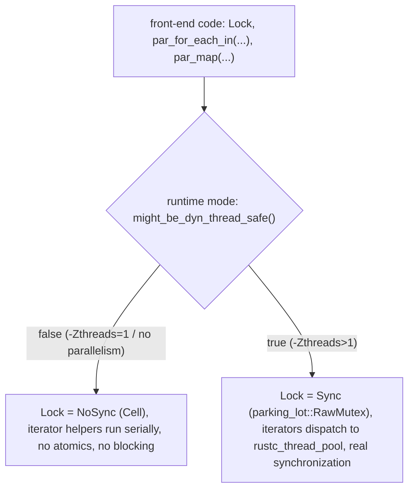
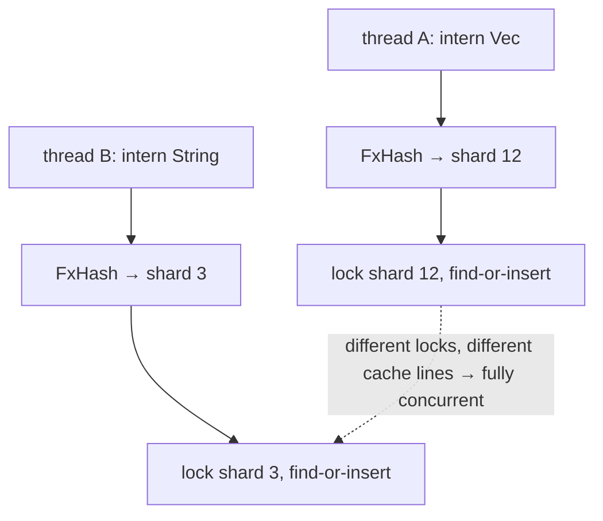
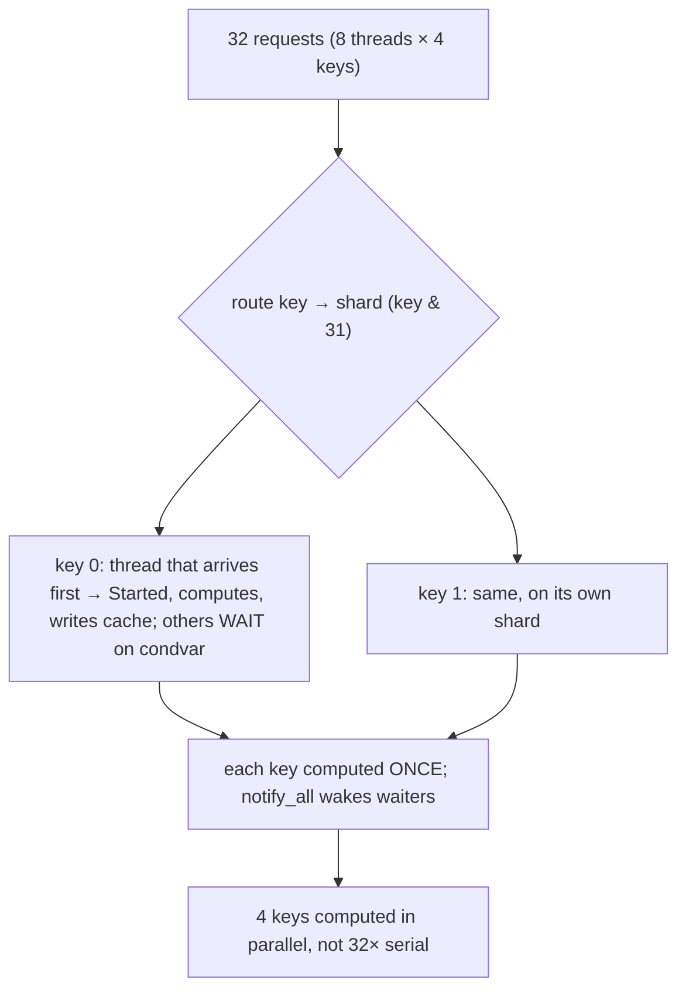

```admonish abstract title="What you'll learn"
- Why the rustc back end (per-[CGU](../glossary.md#cgu) codegen) parallelized easily while the query-driven middle end (typeck, trait solving, [MIR](../glossary.md#mir) opt, [borrowck](../glossary.md#borrow-checker)) was retrofitted with great difficulty, and which front-end phases (parsing, expansion, [HIR](../glossary.md#hir) lowering, name resolution) stay serial under `-Zthreads=N`.
- How `rustc_data_structures::sync` ships one `Lock<T>` whose `Mode::NoSync`/`Mode::Sync` is chosen at construction by `might_be_dyn_thread_safe()`, so a parallel-capable build still pays no cost when run with `-Zthreads=1`.
- How `Sharded<T>` (`SHARD_BITS = 5`, `SHARDS = 32`, `CacheAligned` per shard) routes each key to one shard via `FxHash` so the Chapter 4 [interners](../glossary.md#interner) and Chapter 3 query caches become 32-way concurrent with the algorithm unchanged.
- How `QueryState.active: Sharded<HashTable<(K, ActiveKeyStatus)>>` plus the per-job latch makes a query execute exactly once under concurrent demand: the second thread releases its shard lock and blocks on the latch rather than recomputing.
- Why `rustc_thread_pool` (the in-tree fork of rayon) needs a dedicated **deadlock handler** thread to catch cross-thread query cycles that no single stack reveals, and why lock-ordering across `Sharded` and `Lock` uses is a whole-program invariant.
- How to build a parallel memoizing query engine with `std::thread`, `Arc`, `Mutex`, and `Condvar` that demonstrates exactly-once execution, parallel speedup, and the contention sharding relieves.
```

## 23.1 Parallel Compilation: Using All the Cores

### The idle cores problem

Open a system monitor while you compile a large Rust crate, and for much of the build you will see one core pinned at 100%, the other seven (or fifteen, or thirty-one) nearly idle. Your machine is mostly *not working*. The pipeline this book traced, lex, parse, resolve, type-check, trait-solve, MIR, borrow-check, runs, classically, on a single thread, while the rest of the CPU sits unused. **Parallel compilation** is the cross-cutting concern that fixes this: making a *single* build faster by spreading its work across all your cores. It is a different axis from Chapter 22, incremental compilation makes the *next* build fast by reusing the last; parallelism makes *this* build fast by doing more at once, and the two compose (a parallel incremental rebuild uses many cores *and* skips unchanged work). This chapter covers how `rustc` parallelizes the query-driven middle end.

### The asymmetry: an easy half and a hard half

The **back end was parallelized first, and relatively easily** (§18.2, §19.2). After [monomorphization](../glossary.md#monomorphization), the code is partitioned into **codegen units** (§17.2), and CGUs are largely *independent*, each is optimized by LLVM and emitted to an object file on its own worker thread, with little shared state to coordinate. This is the mature parallelism in the compiler; it has worked for years and is why even an otherwise-serial build uses multiple cores during codegen. Independent units, parallel by construction.

The **query-driven middle end was parallelized late, and with great difficulty.** Type-checking, trait solving, MIR optimization, borrow-checking, all the query-driven work of Part 2 that runs *after* HIR lowering, runs against a web of *shared mutable state*: the interners of Chapter 4 (every type, every `GenericArgs`, interned into one shared table), the [`TyCtxt`](../glossary.md#tyctxt-tcx) database of Chapter 3 (the query caches), the [dependency graph](../glossary.md#depgraph) of Chapter 22. Many threads doing query work would all be reading and writing these shared structures at once, and naively, that is a data race. The post-lowering query-driven parallelism is the subject the rest of this chapter wrestles with; it is the long-running **parallel front-end** effort (the name predates its current scope; the work has shipped piecewise under `-Zthreads=N` and the rust-lang tracking issue collects the still-open subtle bugs). **Parsing, [macro expansion](../glossary.md#macro-expansion), HIR lowering, and name resolution remain serial** under `-Zthreads=N`; parallelizing them is a longer-term project goal listed alongside the rest of the parallel-front-end work.




### The retrofit: parallelism added, not designed in

The crucial fact about `rustc`'s front-end parallelism is that it was **retrofitted** into a compiler designed, for years, as single-threaded. This shaped everything about how it was done. The verified approach, from the parallel-front-end work, was *not* to rewrite the compiler around a parallel architecture, but to make the existing **shared data structures thread-safe** and parallelize a few hot loops, the verified summary: "the addition of parallelism was done by modifying a relatively small number of key points in the code. The vast majority of the front-end code did not need to be changed." The query system turned out to be a remarkably good foundation for this (more below), so most query *code* was untouched; what changed was the *data structures underneath*, interners, caches, the dep-graph, which had to learn to be accessed from many threads at once.

This is a profoundly different engineering problem from "design a parallel compiler from scratch." It is "take a large, working, single-threaded system and make it safely concurrent by changing as little as possible", and Rust's own guarantees (the `Send`/`Sync` machinery, the borrow checker) are both the constraint and the tool. The result is a measurable but sub-linear speedup, real, but not the 8× a naive hope might expect on an 8-core machine, for reasons that are themselves the lesson of this chapter (contention, dependency-web stalls, and the new correctness costs of being concurrent).

### Why the query system is a good parallel foundation

Reaching back to Chapter 3: [the query system](../glossary.md#query) is built from **pure, memoized functions**, which parallelize naturally because they do not interfere with each other except through their inputs and outputs. Two independent queries, `typeck(foo)` and `typeck(bar)`, can simply run on two threads at once; nothing in their logic conflicts. The query system even handles the one tricky case for free: if two threads both need `typeck(foo)`, the verified behavior is that one thread computes it while "we release the lock, and just block the thread until the other invocation has computed the result we are waiting for", the *memoization* that made queries efficient single-threaded *also* deduplicates concurrent work, so a query is computed once even if many threads want it. Purity (Chapter 3) bought thread-friendliness almost for free. What remains hard is not the query *logic* but the shared *infrastructure* the queries touch, the caches, interners, and graph that must be safely shared.

### The machinery: `rustc_data_structures::sync`

The thread-safety lives in one verified place: `rustc_data_structures::sync`, which abstracts the synchronization primitives, `Lock`, `RwLock`, atomics, with implementations that *differ depending on whether thread-safe mode is enabled at runtime*. The key trick is that `Lock<T>` is a single struct with an internal `mode: Mode` field (`NoSync` or `Sync`) plus, abridged, a `mode_union: ModeUnion { no_sync: Cell<bool>, sync: RawMutex }` (each variant is actually wrapped in `ManuallyDrop`, with the protected value in a separate `UnsafeCell<T>`); at construction it checks `might_be_dyn_thread_safe()` and picks NoSync (cheap, no real mutex, just a `Cell<bool>` flag that *panics* if locked twice) or Sync (real `parking_lot::RawMutex`). So front-end code uses `Lock` uniformly, and a process that ends up running with `-Zthreads=1` pays no synchronization cost even in a parallel-capable build. `RwLock<T>` is simpler and always synchronized (`pub struct RwLock<T>(parking_lot::RwLock<T>);`), with a constant `ERROR_CHECKING: bool = false` that, if flipped to `true`, would make every read/write panic on a held lock, currently disabled in source but kept as a manually-toggleable debugging aid. The verified parallel-iteration helpers, `par_for_each_in`, `par_map`, `par_fns`, `par_join`, `broadcast`, run loops in parallel when thread-safe and serially otherwise, built on a **custom fork of rayon** (historically the external `rustc-rayon` dependency, since vendored in-tree as `rustc_thread_pool`). And the verified `WorkerLocal<T>` provides per-thread values (used for parallel [**arena**](../glossary.md#arena) allocation, Chapter 4, each thread arena-allocates without contending).

```admonish tip title="Pro-Tip, -Zthreads=8 on nightly can meaningfully speed up your clean builds today, but it is a front-end win"
The parallel front-end ships in nightly behind `-Zthreads=N` (commonly recommended: 8), default 1. If your builds are slow and you are on nightly, try it; the speedup is measurable but sub-linear (closer to 2-4× on real crates than to the core count). But understand *what* it parallelizes so your expectations are right: it speeds the **query-driven middle end** (typeck, trait solving, MIR optimization, borrow-checking), which the back end's per-CGU parallelism (§18.2) already handled. Parsing, macro expansion, HIR lowering, and name resolution stay single-threaded. So the win is largest for crates where *middle-end* work dominates, heavy generics and trait resolution, much type-checking, and smaller for crates already bottlenecked on LLVM codegen (where adding `codegen-units` or trying Cranelift, §20.1, helps more) or on the still-serial front end. It composes with incremental (Chapter 22) and with release vs debug independently. The realistic mental model: parallel front-end turns the long single-threaded stretch at the *start* of a build into a multi-threaded one; if that stretch was your bottleneck, you win big; if codegen was, less so. Measure on your actual project, and remember it is still experimental, so a clean build to compare against (and a bug report if something breaks) is the right posture.
```

### Why not 8× on 8 cores: contention and the deadlock handler

The reality is that parallel front-end does *not* scale linearly, and the reasons are instructive. First, **lock contention**: the shared structures (interners, caches) are *hot*, every query touches them, so many threads spend time waiting on the same locks, and the rustc-dev-guide's parallel-compilation chapter observes that these thread-safe data structures can cause enough lock contention that performance degrades past a small number of threads. Adding threads past a point makes things *worse*, not better, until contention is reduced (which is why `Sharded` locks, splitting one lock into many shards keyed by hash, §23.2, exist: to cut contention on the hottest structures). Second, the **dependency web**: queries depend on each other densely, so threads frequently stall waiting for a result another thread is still computing; a high-core-count machine can fail to gain over fewer threads because of the complex dependencies between queries. Third, a genuinely hard correctness problem: **cycle detection**. Single-threaded, a query cycle (a query that, transitively, asks for itself) is detected by walking the call stack; in parallel, the cycle may span *threads* (thread A waits on B, B waits on A). `rustc` solves this with a verified dedicated **deadlock handler** thread (the closure passed to `rustc_thread_pool::ThreadPoolBuilder::deadlock_handler` in `rustc_interface::util::run_in_thread_pool_with_globals`) that detects, removes, and reports the cycle when worker threads stop making progress. Parallelism did not just speed things up; it created new *kinds* of bugs (deadlocks, races) the serial compiler could never have.

```admonish warning title="Warning, works single-threaded is not works parallel"
The deepest hazard of retrofitting parallelism is that a single-threaded program can harbor assumptions that are *invisible* until threads expose them: that things happen in a fixed order, that some shared structure is only touched by one logical task at a time, that a side effect lands before another read. Single-threaded, these hold by accident; parallel, they become **races**, and races are nondeterministic, so a parallel-front-end bug may appear on one run in a hundred, on one machine, under one thread count, and vanish when you try to reproduce it. The parallel-front-end tracking issue is a long list of subtle bugs (deadlocks, 'attempted to read from stolen value,' 'no `ImplicitCtxt` stored in tls,' incremental-compilation race conditions), which is why it stayed experimental for years and why it defaults to *one* thread even in nightly. When parallelizing existing code, the bugs are not in the parts you parallelize but in the shared state you *forgot* was shared, and they will not show up in testing reliably. The discipline that makes it tractable is exactly Rust's: `Send`/`Sync` as compiler-checked contracts about what may cross threads, locks that encode access discipline in types, and treating every piece of shared mutable state as guilty until proven safe. Parallel correctness is not a performance concern bolted on at the end; it is a property the type system must help you carry from the start, which is why even with Rust's `Send`/`Sync` discipline encoding thread-safety as a typed contract, retrofitting parallelism proved *hard*.
```

### Where this leaves us

Parallel compilation makes a single build use all the cores. The work splits into an **easy half**, the back end, where independent **codegen units** have been optimized and emitted on parallel worker threads for years (§18.2), and a **hard half**, the query-driven **middle end** (typeck, trait solving, MIR opt, borrowck), whose shared state (Chapter 4 interners, the Chapter 3 `TyCtxt` caches, the Chapter 22 dep-graph) makes naive parallelism a data race. Parsing, macro expansion, HIR lowering, and name resolution stay serial; parallelizing those is a longer-term project goal. The front end was **retrofitted** by making those shared structures thread-safe and parallelizing a few hot loops, changing little query code, and the **query system's purity** (Chapter 3) made it a good foundation, since independent queries parallelize freely and concurrent requests for the same query deduplicate via memoization. The machinery is `rustc_data_structures::sync` (`Lock` with runtime NoSync/Sync mode dispatch, `RwLock` as `parking_lot::RwLock`, atomics, the `rustc_thread_pool` fork driving `par_for_each_in`/`par_map`/`par_join`/`broadcast`, `WorkerLocal` arenas). It does not scale linearly: **lock contention** degrades past a small number of threads (motivating `Sharded` locks), the dense query-dependency web stalls threads, and cross-thread query **cycles** need a dedicated **deadlock handler**, so `-Zthreads=N` (nightly, default 1, commonly 8) yields a measurable but sub-linear speedup on clean builds, not 8×. Retrofitted parallelism turns latent assumptions into nondeterministic races, which is why it stayed experimental.

§23.2 takes the architecture deep-dive: `rustc_data_structures::sync`'s dual implementations in detail, how `Sharded` splits a lock into shards to cut interner contention, how the query system blocks-and-waits on an in-progress query (the `JobId`/latch machinery), the `rustc_thread_pool` job model and `WorkerLocal`, and the deadlock-handler design. Then §23.3 reads the real `Sharded`/`Lock` source, and §23.4 has you build a tiny parallel memoizing query engine, sharded cache, block-on-in-progress, parallel execution of independent queries, feeling both the speedup and the contention.

## 23.2 The Architecture: `sync`, `Sharded`, and the Parallel Query System

### Making shared state safe without rewriting the compiler

Making the shared structures thread-safe rather than rewriting the compiler (§23.1) rests on four pillars: the `sync` module's dual-implementation primitives (sync cost only when parallel), the `Sharded` lock that cuts contention on the hottest structures, the **parallel query system** that runs independent queries concurrently and deduplicates concurrent requests, and the **deadlock handler** that catches cross-thread query cycles. All of it sits under the `TyCtxt` of Chapter 3.

### `rustc_data_structures::sync`: one API, two implementations

The foundational trick (§23.1) is **runtime-dispatched synchronization**: a single `Lock<T>` struct that picks its locking strategy at construction time based on `might_be_dyn_thread_safe()`. In `Mode::NoSync` it uses an internal `Cell<bool>` flag, no atomic ops, no blocking, and panics if locked twice (a deterministic single-threaded "you-would-deadlock-here" detector). In `Mode::Sync` it uses a real `parking_lot::RawMutex`. The dispatch is per-`Lock`-instance, not compile-time forked, so the parallel-capable `rustc` binary still pays NoSync's near-zero cost when actually run with `-Zthreads=1` (the default). `RwLock<T>` is simpler: `pub struct RwLock<T>(parking_lot::RwLock<T>);` always uses parking_lot, with a constant `ERROR_CHECKING: bool = false` that, if flipped to `true`, would make every read/write panic on a held lock, currently disabled in source but kept as a manually-toggleable debugging aid. The single-thread regression from making this parallel-capable had to be kept small enough that the team felt comfortable shipping it as the default-on path; the runtime gate is what makes that practical.

Two further verified pieces enforce thread-safety in the type system. The `DynSend`/`DynSync` auto-traits (declared via `unsafe impl<T: DynSend> DynSend for Lock<T> {}` and similar) are `rustc`'s own analogues of `Send`/`Sync`, gating what may cross thread boundaries in the parallel compiler, the type system carrying the proof that a value is safe to share. And `WorkerLocal<T>` holds a per-thread value, accessed only on the thread pool that created it; it is how arenas (Chapter 4) work in parallel, each worker thread arena-allocates into *its own* arena, so allocation never contends.

### `Sharded`: splitting one lock into many

The headline problem of §23.1 was *contention*: hot shared structures (the Chapter 4 interners, the Chapter 3 query caches) are touched by every query, so a single lock around one would serialize all threads on it. The verified solution is `Sharded<T>`:

```rust
// rustc_data_structures::sharded  (faithful, abridged)
pub enum Sharded<T> {
    // serial / single-thread: just one lock
    Single(Lock<T>),
    // parallel: SHARDS (= 1 << SHARD_BITS = 32) independent locks
    Shards(Box<[CacheAligned<Lock<T>>; SHARDS]>),
}
```

The idea: instead of *one* lock protecting the whole structure, use **32 locks**, each protecting a *shard* of it, and route each operation to a shard by hashing its key. The verified `get_shard_by_value` / `lock_shard_by_value` "select the shard by hashing `val` with `FxHasher`." So when thread A interns `Vec<u8>` and thread B interns `String`, their keys hash to (probably) *different* shards, so they lock *different* locks and *do not contend*, they proceed truly in parallel. Only when two threads happen to touch keys in the *same* shard do they serialize, and with 32 shards that is rare. The verified `CacheAligned` wrapper ensures each shard's lock sits on its own cache line, avoiding *false sharing* (two locks on one cache line would ping-pong between cores even when logically independent). And the `Single` variant means the serial compiler uses exactly one lock with no sharding overhead, the dual-implementation principle again.

`Sharded` is precisely what makes the Chapter 4 interner and the query caches parallel-friendly: the verified `Sharded<HashTable<(K, V)>>` carries the very `intern` / `get_or_insert_with` / `intern_ref` methods an interner needs, now spread across 32 shards. The Chapter 4 "intern a type into one shared table" becomes "intern into one of 32 shards, chosen by the type's hash", 32× less contention, almost for free.




### The parallel query system: run concurrently, deduplicate

With the shared structures sharded and thread-safe, the query system itself parallelizes naturally (§23.1, pure functions). Independent queries run on different threads via the verified `rustc_thread_pool` fork's job model (and `par_for_each_in`/`par_map`/`par_join`/`broadcast` for parallel loops, all of which check `mode::is_dyn_thread_safe()` and degrade to a plain `for_each` when only one thread is in play). The interesting case is *contention on the same query*: two threads both needing `typeck(foo)`. The verified behavior makes this safe and efficient via the query's **state map** (itself sharded). When a thread starts a query, it records an *in-progress* marker in the query state (under the relevant shard's lock); a second thread looking up the same key finds that marker, and rather than computing the result redundantly, the verified behavior is to release the shard lock and just block the thread until the other invocation has computed the result it is waiting for, then takes the first thread's result. So a query executes **exactly once** no matter how many threads want it, the §23.1 concurrent-deduplication, implemented as "find in-progress marker → wait on it → use the produced result." This is the memoization of Chapter 3 extended across threads: not just "compute once and cache," but "compute once *even under concurrent demand*."




```admonish tip title="Pro-Tip, sharding is the general cure for one hot lock"
The `Sharded` design is a reusable technique, not a `rustc` quirk. Whenever you have a single shared structure (a cache, a counter map, an interner, a connection pool) that many threads hammer through one lock, that lock becomes the bottleneck, threads spend their time queued on it, and adding cores makes it *worse* (§23.1's 'degrades past 4 threads'). The fix is almost always sharding: split into N independent sub-structures, route each key to a shard by its hash, and now N operations on different keys proceed in parallel because they touch different locks. The details `rustc` gets right are worth copying: a *power-of-two* shard count (32) so `hash % 32` is a cheap mask; **cache-line alignment** of each shard's lock (the `CacheAligned` wrapper) so independent shards don't false-share a cache line; and a *single-lock fast path* for when concurrency is off (the `Single` variant) so you don't pay sharding overhead when you don't need it. The trade is that operations spanning *all* shards (clearing the whole structure, counting total size) must lock every shard and are slower, but those are rare, and the verified `lock_shards()` iterator handles them. If profiling ever shows your threads contending on one `Mutex<HashMap>`, reach for a sharded map; sharding is the standard fix when a single mutex becomes the bottleneck, and rustc's 32-shard interner is a worked example you can read.
```

### The deadlock handler: cross-thread cycle detection

Parallelism creates a problem that *cannot exist* single-threaded. A **query cycle**, query A needs B, B needs C, C needs A, is a bug `rustc` must detect and report (not hang on). Single-threaded, it is easy: the query stack contains A, B, C, and when C asks for A again, A is already on the stack, cycle found by inspection. But in parallel, the cycle can span *threads*: thread 1 is computing A and blocked waiting for B; thread 2 is computing B and blocked waiting for A. Neither thread's *own* stack shows a cycle, each just sees itself waiting on a query another thread owns. No single stack reveals the deadlock. The verified solution is a dedicated **deadlock handler** thread: when all worker threads have stopped making progress (all blocked waiting on each other), this extra thread wakes, examines the global *waits-for* graph (which thread waits on which query, owned by which thread), finds the cycle, and "detect[s], remove[s], and report[s] the cycle error." It is a thread whose entire job is to notice that everyone else is stuck and figure out why, a piece of machinery with no single-threaded analogue, existing purely because parallelism made cycles distributed.

```admonish warning title="Warning, lock ordering is a new global invariant"
Sharding and fine-grained locking solve contention but introduce a classic concurrency hazard: **lock-ordering deadlock**. If one code path locks structure X then structure Y, and another path locks Y then X, two threads can each hold one and wait forever for the other, a deadlock that has nothing to do with query cycles (so the deadlock handler, which understands the *query* waits-for graph, may not even catch it). The verified dev-guide is explicit that this is an active concern: the use of these data structures must be audited 'covering invariants, atomicity, and lock orderings,' and that figuring out 'what other invariants during compilation might not hold in parallel compilation' is ongoing work. For a contributor the rule is the standard one, now load-bearing: establish and document a *global lock acquisition order*, and never acquire locks in a different order on any path. This is genuinely hard in a large codebase where locks are acquired deep in call stacks far from each other, which is part of why parallel front-end took years and why every new `Lock`/`Sharded` use is scrutinized. The broader lesson: fine-grained locking trades one bottleneck (contention on a coarse lock) for one risk (deadlock from inconsistent ordering of fine locks), and managing that risk is a *whole-program* discipline, not a local one, no single function can be checked in isolation for lock-ordering safety. It is the tax that comes with the contention cure.
```

### How this builds, and what is next

Parallel `rustc` rests on four pillars under `TyCtxt`. `rustc_data_structures::sync` gives one API (`Lock`/`RwLock`/atomics, `DynSend`/`DynSync`, `WorkerLocal`) with **two implementations**, `RefCell`-cheap serially, `parking_lot`-real in parallel, so synchronization costs nothing when off. `Sharded<T>` (`Single` serially; `Shards([CacheAligned<Lock<T>>; 32])` in parallel) cuts contention by routing each key to one of 32 cache-line-aligned locks via `FxHash`, making the Chapter 4 interners and Chapter 3 caches parallel-friendly (32× less contention) through its `intern`/`get_or_insert_with` methods. The **parallel query system** runs independent queries on `rustc_thread_pool` worker threads and, when two threads want the same query, makes the second find an in-progress marker and **block on a latch** until the first finishes, so each query runs exactly once even under concurrent demand. And the **deadlock handler** thread detects cross-thread query cycles that no single stack reveals. The new global hazard is **lock ordering**, inconsistent acquisition order across the codebase is a latent deadlock the query-cycle handler won't catch, making parallel correctness a whole-program discipline.

§23.3 reads the real source: the `Sharded` enum and its `lock_shard_by_value` picking a shard by hash, the dual-implementation `Lock`, and a glimpse of the query in-progress/latch wait, the contention-cutting and dedup machinery in actual code. Then §23.4 has you build a parallel memoizing query engine: a sharded result cache, independent queries running on threads, and block-on-in-progress deduplication, and you will *measure* both the speedup and the contention that sharding relieves.

## 23.3 Reading the Source: `Sharded`, `Lock`, and Blocking on a Query

### Two implementations, one source

The dual-implementation trick and the sharding that make parallel `rustc` work both live in `rustc_data_structures`' `sync.rs` and `sharded.rs`. The thing to watch is how *one* piece of front-end code compiles to either cheap-serial or real-parallel synchronization with no source changes, and how `Sharded` routes concurrent operations to independent locks.

### The `sync` type table: serial cheap, parallel real

The heart of `sync.rs` is a documented conceptual mapping from each abstract type to its *NoSync-mode* and *Sync-mode* behavior. The module's own doc comment gives one illustrative row: `Lock<T>` is RefCell-like under NoSync and a `parking_lot::Mutex<T>`-like real mutex under Sync. (The actual implementation is more compact: `Lock<T>` is a single struct holding `mode: Mode` and, abridged, a `mode_union: ModeUnion { no_sync: Cell<bool>, sync: RawMutex }` (each in `ManuallyDrop`, with the data in a separate `UnsafeCell<T>`), dispatched at lookup time, not two separate types.) `RwLock<T>` is always `parking_lot::RwLock<T>` regardless of mode, with a constant `ERROR_CHECKING: bool = false` that, if flipped to `true`, would make every read/write panic on a held lock, currently disabled in source but kept as a manually-toggleable debugging aid.

Read what this buys. Front-end code that writes `Lock<HashMap<K, V>>` gets, when the lock is in NoSync mode, a path that just flips a `Cell<bool>` and hands out a `LockGuard`, no atomic operations, no blocking, and with a panic if locked twice. In Sync mode it locks the real `RawMutex`. The parallel-iteration helpers (`par_for_each_in`, `par_map`, `par_fns`, `par_join`, `broadcast`, `spawn`, all in `sync::parallel`) likewise check `mode::is_dyn_thread_safe()` at entry and dispatch to a serial `for_each`/iterator path or to `rustc_thread_pool::{scope, join, spawn, broadcast}` for real parallelism. One source, two runtime paths: a parallel-capable rustc isn't taxed for synchronization it cannot use, the property that lets the team ship the parallel-front-end binary as the default without forcing every single-threaded user to pay locking overhead.

There is an even finer verified touch: a `Lock` constructed when `might_be_dyn_thread_safe()` is false uses NoSync mode permanently. So even a parallel-capable build, when actually run with `-Zthreads=1` (the default), creates locks in NoSync mode at startup and never pays atomic/blocking cost. The verified NoSync `Lock` panics if locked while already held (`panic!("lock was already held")` in `lock_assume` → `lock_held`), turning a would-be-deadlock into an immediate single-threaded bug report. And the verified `DynSend`/`DynSync` auto-traits replace `Send`/`Sync` at the parallel boundary (declared via `unsafe impl<T: DynSend> DynSend for Lock<T> {}` and similar), so the type system checks what may cross threads.




### `Sharded`: pick a shard by hash

Now the contention-cutter. The `Sharded` spine, exactly as it appears in `compiler/rustc_data_structures/src/sharded.rs`:

```rust
// rustc_data_structures::sharded  (faithful, abridged)
const SHARD_BITS: usize = 5;
const SHARDS: usize = 1 << SHARD_BITS; // = 32

pub enum Sharded<T> {
    Single(Lock<T>), // ① single-threaded: one lock
    Shards(Box<[CacheAligned<Lock<T>>; SHARDS]>), // ② parallel: 32 cache-aligned locks
}

// lock_shard_by_value(val): hash with FxHasher, pick a shard, lock just that one
//   let hash = make_hash(val); // FxHasher-based
//   let i    = get_shard_hash(hash); // shift high bits into the low SHARD_BITS
//   shards[i & (SHARDS - 1)].0.lock() // mask into 0..SHARDS, then lock that one
```

Trace it. `SHARD_BITS = 5` gives `SHARDS = 32`. For a sharded structure, `lock_shard_by_value(val)` hashes the key with `FxHash`, picks a shard index via `get_shard_hash` (the private helper that shifts the hash so the chosen bits don't collide with hashbrown's own use of the top 7 and bottom bits), and locks *only that shard*. Two threads operating on keys that hash to different indices lock different `Lock`s and never block each other; the `CacheAligned` wrapper (a `pub struct CacheAligned<T>(pub T)` with `#[repr(align(64))]`) keeps those locks on separate cache lines so even the *hardware* does not serialize them (no false sharing). The `Single` variant short-circuits to one lock when `is_dyn_thread_safe()` is false at construction, the same runtime-dispatch philosophy as `sync.rs`, inside `Sharded` itself.

### An interner, sharded

This is exactly how the Chapter 4 interner becomes parallel-safe. An interner is a `ShardedHashMap<K, ()> = Sharded<HashTable<(K, ())>>`, and interning locks one shard:

```rust
// rustc_data_structures::sharded::ShardedHashMap (faithful, abridged)
pub fn intern<Q>(&self, value: Q, make: impl FnOnce(Q) -> K) -> K
where K: Borrow<Q>, Q: Hash + Eq,
{
    let hash = make_hash(&value);
    let mut shard = self.lock_shard_by_hash(hash); // lock ONLY this value's shard
    match table_entry(&mut shard, hash, &value) {
        Entry::Occupied(e) => e.get().0, // already interned → return K
        Entry::Vacant(e)   => { // intern fresh
            let v = make(value);
            e.insert((v, ()));
            v
        }
    }
}
```

The Chapter 4 "look up in the shared table; if absent, allocate and insert" is unchanged in *logic*, but the table is 32 shards (via the hashbrown `HashTable::entry` API through the `table_entry` helper), and a thread interning `Vec<u8>` locks a different shard than one interning `String`, so they intern *concurrently*. The interner that was a single-threaded bottleneck (§23.1) becomes 32-way concurrent with a one-line change to its storage type. This is the entire trick of parallel front-end made concrete: the *algorithm* stays; the *container* shards. (The sibling `intern_ref` does the same for borrowed lookup keys, and `get_or_insert_with` for non-interner sharded caches.)




```admonish tip title="Pro-Tip, compile-time-capable, runtime-decided"
A subtle but important design choice is that parallelism is not purely a *compile-time* decision in the modern compiler, the parallel-capable `rustc` checks `might_be_dyn_thread_safe` at *runtime* and skips real synchronization when only one thread is active. This is what lets the Rust team build *one* `rustc` binary that is parallel-capable yet imposes near-zero overhead on the default single-threaded run: the locks are real `parking_lot` mutexes, but they short-circuit to uncontended fast paths (or skip entirely) when the runtime knows there is no second thread. The general pattern, *make a feature compile-time-possible but runtime-gated, so the binary supports it without everyone paying for it*, is broadly useful: it is how you ship an opt-in capability without forking your build or burdening users who do not opt in. It is also why the rollout strategy (§23.1) could be 'enable parallel in nightly builds, default threads to 1': the capability is present in the binary, dormant until `-Z threads=N` wakes it. When you have an expensive capability that only some users want, consider whether it can be a runtime gate on an always-compiled path rather than a compile-time fork; rustc's parallel front-end uses this pattern even for whole-program concurrency, with the runtime gate keeping single-threaded callers from paying for locks.
```

### Blocking on an in-progress query

Finally, a glimpse of the §23.2 concurrent-dedup in code. The query state for each key is held in a `Sharded<HashTable<(Key, ActiveKeyStatus)>>` (so the in-progress map is itself sharded), where `ActiveKeyStatus` is either `Started(QueryJob)` (some thread is computing it, with a latch reachable via `job.latch()`) or `Poisoned` (the in-progress query already panicked). When a thread enters `try_execute_query` and hashes the key into a shard, the dispatch is:

```rust
// rustc_query_impl::execution::try_execute_query (Occupied arm, faithful, abridged)
match state_lock.entry(key_hash, equivalent_key(key), |(k, _)| sharded::make_hash(k)) {
    Entry::Vacant(entry) => { /* claim the key, run the query, complete it via ActiveJobGuard */ }
    Entry::Occupied(mut entry) => match &mut entry.get_mut().1 {
        // another thread is computing it
        ActiveKeyStatus::Started(job) => {
            if sync::is_dyn_thread_safe() {
                let latch = job.latch();
                drop(state_lock); // ① release the shard lock FIRST
                wait_for_query(query, tcx, span, key, latch, current_job_id)
                //   ↳ inside wait_for_query: latch.wait_on(tcx, current, span)
                //     then query.cache.lookup(&key) to take the produced (value, dep_node_index)
            } else {
                // single-threaded → can't be waiting on someone else → must be a cycle
                let id = job.id; drop(state_lock);
                cycle_error(query, tcx, id, span)
            }
        }
        // in-progress query panicked → propagate
        ActiveKeyStatus::Poisoned => FatalError.raise(),
    }
}
```

The shape is the §23.2 description as code: a thread that finds an `Entry::Occupied` with `ActiveKeyStatus::Started(job)` *releases the shard lock* (`drop(state_lock)`, crucial: holding it while waiting would block everyone) and then waits via `latch.wait_on(tcx, current, span)`; when the computing thread signals completion, the waiter calls `query.cache.lookup(&key)` to take the produced `(value, dep_node_index)` rather than re-running the body. The query runs exactly once; the careful lock-release before waiting is the kind of discipline the §23.2 lock-ordering warning is about, hold the shard lock only long enough to read/update state, never across the wait. Two further details the source surfaces: a single-threaded run that finds `Started` is necessarily a query cycle (a single thread cannot be waiting on its own future result), so the engine dispatches to `cycle_error` directly, sidestepping the latch entirely; and an `ActiveJobGuard` RAII wrapper poisons the entry if the query body panics, which is why the `Poisoned` arm exists, waiters on a poisoned entry raise `FatalError` rather than wait forever.

```admonish warning title="Warning, the serial Lock panics when double-locked, and that is a feature"
The verified detail that the serial `Lock` (a `RefCell` underneath, which panics on a second borrow) *panics if already held* is easy to read as a limitation but is actually a deliberate safety net. A code path that locks the same `Lock` twice (directly, or via re-entrant calls) is a **deadlock** in the parallel compiler, thread holds the lock, then tries to take it again, and waits forever for itself. That bug is nearly impossible to find in a parallel run (it just hangs, nondeterministically, deep in some call stack). But in a *serial* run, the same path hits the `RefCell`'s 'already borrowed' panic *immediately and deterministically*, with a clean backtrace pointing at the double-lock. So running the test suite in serial mode acts as a cheap, deterministic detector for a whole class of would-be parallel deadlocks, the re-entrant-lock bugs, before they ever reach a parallel build. This is why the dual implementation is not just a performance trick but a *correctness* tool: the serial mode is the parallel mode's debugger for lock-discipline bugs. When building a dual serial/parallel system, make the serial version *strict* (panic on the things that would deadlock in parallel) rather than permissive, so cheap serial testing catches expensive parallel bugs. A forgiving serial mode hides the bugs until production; a strict one surfaces them in CI.
```

### How this builds, and what is next

The source shows the runtime-dispatch principle twice over. `sync.rs` carries one `Lock<T>` struct whose constructor picks `Mode::NoSync` (a `Cell<bool>` flag, no atomics, panics on double-lock) or `Mode::Sync` (a real `parking_lot::RawMutex`) based on `might_be_dyn_thread_safe()` at runtime, so a parallel-capable build run with one thread pays no synchronization cost. `RwLock<T>` is always `parking_lot::RwLock<T>` with an `ERROR_CHECKING: bool = false` constant that, if flipped on, would make every read/write panic on a held lock (a manually-toggleable debugging aid, off in source); `par_for_each_in`/`par_map`/`par_join`/`broadcast` likewise dispatch to `rustc_thread_pool` when thread-safe and to a serial `for_each` otherwise; `DynSend`/`DynSync` type-check what crosses threads. `Sharded` (`SHARD_BITS = 5` → 32 cache-aligned shards via `CacheAligned`'s `#[repr(align(64))]`, `Single` for the single-thread case) routes each operation to one shard via `FxHash` (`get_shard_hash` shifts the high bits, then the index is masked to `SHARDS - 1`), so the Chapter 4 interner, now a `ShardedHashMap<K, ()>` whose `intern` locks one shard via the hashbrown `Entry` API, becomes 32-way concurrent with the *algorithm unchanged*. And the query lookup, on finding an `InProgress` latch, *releases the shard lock* and waits, so a query runs exactly once under concurrent demand. The NoSync-mode `Lock`'s panic-on-double-lock turns parallel deadlock bugs into cheap deterministic serial failures.

§23.4 closes the chapter with a build: a tiny **parallel memoizing query engine** in real threads, a `Sharded`-style result cache (N shard locks, key routed by hash), independent queries computed concurrently on a thread pool, and block-on-in-progress dedup via a latch, and you will *measure* the speedup from parallelism and *observe* the contention that sharding relieves by comparing one lock to many. Incremental compilation in §22.4 was simulated across two passes; this one runs real threads.

## 23.4 Hands-On Lab: Build a Parallel Memoizing Query Engine

### Real threads this time

§22.4's incremental engine simulated two passes in one thread. This lab uses *real* threads. You will build a **parallel memoizing query engine**: a **sharded** result cache (N independent locks, key routed by hash, §23.3), queries computed *concurrently* across worker threads, and **block-on-in-progress** deduplication via a condition-variable latch (§23.2/§23.3), so a query runs exactly once even when many threads demand it at once. Then you will *measure* three things: that each query body runs exactly once under concurrent demand (an execution counter), that parallelism actually speeds up independent work (wall time), and that **sharding relieves contention** (one global lock vs many shards). Pure `std`, `std::thread`, `Arc`, `Mutex`, `Condvar`. No external crates.

`cargo new`, pure `std`.

### Two collaborating containers: an active map and a result cache

The engine holds **two** sharded structures, one for keys currently being computed, one for completed results, just as rustc does (`QueryState.active: Sharded<HashTable<(K, ActiveKeyStatus)>>` for in-progress markers and a separate `query.cache` for finished values, joined by `try_execute_query` in `rustc_query_impl`). Each shard of the active map records `Started` (some thread is computing) or `Poisoned` (the computing thread panicked, ready for Extension 2); each shard of the cache holds the produced `u64`. A query first looks in the cache (fast path); on a miss it claims a slot in the active map, computes, inserts into the cache, removes the active slot, and signals waiters. This is the two-container split that surprises readers when they first open `try_execute_query` after seeing a single-map lab.

```rust
// src/main.rs
use std::collections::HashMap;
use std::sync::{Arc, Mutex, Condvar};
use std::time::{Duration, Instant};

type Key = u64;

// the in-progress marker; rustc's `ActiveKeyStatus::{Started, Poisoned}`
enum ActiveStatus { Started, Poisoned }

struct ActiveShard {
    map: Mutex<HashMap<Key, ActiveStatus>>,
    // the latch: waiters block here, the computing thread notify_alls
    cv: Condvar,
}

struct CacheShard {
    map: Mutex<HashMap<Key, u64>>, // a value is u64 for simplicity
}

const SHARDS: usize = 32; // §23.3: SHARD_BITS = 5 → 32

// rustc's split: `QueryState.active` for in-progress markers, `query.cache` for done values
struct QueryEngine {
    active: Vec<ActiveShard>,
    cache: Vec<CacheShard>,
    executions: Mutex<u64>,
}

impl QueryEngine {
    fn new() -> Self {
        QueryEngine {
            active: (0..SHARDS)
                .map(|_| ActiveShard { map: Mutex::new(HashMap::new()), cv: Condvar::new() })
                .collect(),
            cache: (0..SHARDS)
                .map(|_| CacheShard { map: Mutex::new(HashMap::new()) })
                .collect(),
            executions: Mutex::new(0),
        }
    }
    fn shard_index(&self, key: Key) -> usize {
        // FxHash-ish: just mask the key. Real rustc hashes with `FxHasher`, then
        // `get_shard_hash` shifts the high bits down before masking, because hashbrown
        // reserves the top 7 bits as H2 tags and reuses the low bits, see
        // `rustc_data_structures::sharded::get_shard_hash`.
        (key as usize) & (SHARDS - 1)
    }
    fn active_shard(&self, key: Key) -> &ActiveShard { &self.active[self.shard_index(key)] }
    fn cache_shard(&self, key: Key)  -> &CacheShard  { &self.cache[self.shard_index(key)] }
}
```

### The query: compute once, dedup the rest

This is the §23.3 lookup as real threaded code. A thread first checks the **cache** for a finished value (fast path); on a miss it locks the **active** shard and either waits on the condvar (someone else is computing it), or claims the slot, computes *outside the lock*, writes the cache, removes the active marker, and notifies waiters. The ordering (write cache *before* clearing active *before* notify) matches `ActiveJobGuard::complete` in `rustc_query_impl::execution`.

```rust
impl QueryEngine {
    fn query(&self, key: Key, compute: impl Fn(Key) -> u64) -> u64 {
        // ① Cache hit fast-path: a finished value lives in the result cache.
        if let Some(&v) = self.cache_shard(key).map.lock().unwrap().get(&key) {
            return v;
        }

        // ② Cache miss: look at the active map for an in-progress marker.
        let shard = self.active_shard(key);
        let mut active = shard.map.lock().unwrap();
        loop {
            match active.get(&key) {
                Some(ActiveStatus::Started) => {
                    // someone else is computing it: WAIT on the latch (releases `active` while blocked)
                    active = shard.cv.wait(active).unwrap();
                    // looping is load-bearing here; we share one condvar per shard, so a wake
                    // can mean *some* key landed, not necessarily ours. Real rustc puts a
                    // `QueryLatch` on each `QueryJob` so wakes are per-key
                    // (`rustc_middle::query::job::QueryLatch`).

                    // On a wake, the result may now be in the cache. Re-check it.
                    if let Some(&v) = self.cache_shard(key).map.lock().unwrap().get(&key) {
                        return v;
                    }
                    // Otherwise fall through and re-inspect the active map.
                }
                Some(ActiveStatus::Poisoned) => {
                    // (Extension 2) the computing thread panicked; in rustc this raises FatalError.
                    panic!("query for key {key} was poisoned by a panicking compute");
                }
                None => {
                    active.insert(key, ActiveStatus::Started); // claim it
                    // release shard lock BEFORE computing (§23.3)
                    drop(active);

                    *self.executions.lock().unwrap() += 1; // a body actually ran
                    // the expensive work, UNLOCKED
                    let v = compute(key);

                    // ③ store-before-signal: write the cache first so waking waiters see the result.
                    self.cache_shard(key).map.lock().unwrap().insert(key, v);

                    // ④ then clear the in-progress marker and notify waiters on this shard.
                    let mut active = shard.map.lock().unwrap();
                    active.remove(&key);
                    shard.cv.notify_all();
                    return v;
                }
            }
        }
    }
}
```

Four things mirror real `rustc` (§23.3): the two-container split (active markers separate from the result cache) matches `QueryState.active` + `query.cache`; the active shard lock is held only to read/update *state*, never across the expensive `compute` (which would serialize everything); `Condvar::wait` atomically releases the lock and blocks, so waiters do not spin or hold the lock; and the **store-before-signal** ordering (write the cache, *then* clear the active marker and `notify_all`) is the same invariant `ActiveJobGuard::complete` enforces, so a waiter that wakes is guaranteed to see the result.

### Proving "exactly once" under concurrent demand

Spawn many threads all requesting overlapping keys, and check the execution counter:

```rust
fn expensive(key: Key) -> u64 {
    // Real CPU work (not a sleep): hash a chunk so threads actually compete for cores.
    // Real compiler work is CPU-bound, not blocked; a sleep would make the contention
    // measurements meaningless. Tune ROUNDS so one call takes a perceptible fraction of
    // a second on your machine.
    use std::hash::{Hasher, DefaultHasher};
    const ROUNDS: u64 = 2_000_000;
    let mut h = DefaultHasher::new();
    for i in 0..ROUNDS {
        h.write_u64(key.wrapping_add(i));
    }
    h.finish()
}

fn main() {
    // ---- Test 1: dedup. 8 threads each request the SAME 4 keys. ----
    let cache = Arc::new(QueryEngine::new());
    let start = Instant::now();
    std::thread::scope(|s| {
        for _ in 0..8 {
            let cache = Arc::clone(&cache);
            s.spawn(move || {
                // overlapping demand
                for key in 0..4u64 { cache.query(key, expensive); }
            });
        }
    });
    println!("=== Test 1: dedup under concurrent demand ===");
    println!(" 8 threads x 4 keys = 32 requests");
    println!(" query bodies actually executed: {}", *cache.executions.lock().unwrap());
    println!(" elapsed: {:?}", start.elapsed());
    // (continued below; fn main stays open through Tests 2 and 3)
```

````admonish example title="Expected output" collapsible=true
Output (timings depend on your CPU; the *ratios* are what matter):

```text
=== Test 1: dedup under concurrent demand ===
  8 threads x 4 keys = 32 requests
  query bodies actually executed: 4        ← exactly once per key, despite 32 requests!
  elapsed: T                                ← roughly one body's runtime, not 32 of them
```

Thirty-two requests, **four executions**, each key computed exactly once even though eight threads demanded it concurrently, because whichever thread arrives first claims the key (writing `ActiveStatus::Started` into the active map) and the other seven *wait on the latch* rather than recompute. And the four independent keys ran *in parallel* (roughly one body's wall time, not 32 times it), because they live in different shards and are claimed by different threads. This is §23.2's concurrent-deduplication and parallel execution, in real threads you can time.
````

### Measuring speedup, and observing contention

```rust
    // (continuing inside `fn main` from above)

    // ---- Test 2: parallel speedup over INDEPENDENT expensive queries ----
    let n = 16u64;
    let serial = {
        let c = QueryEngine::new();
        let t = Instant::now();
        for k in 0..n { c.query(k, expensive); }
        t.elapsed()
    };
    let parallel = {
        let c = Arc::new(QueryEngine::new());
        let t = Instant::now();
        std::thread::scope(|s| {
            for k in 0..n {
                let c = Arc::clone(&c);
                s.spawn(move || { c.query(k, expensive); });
            }
        });
        t.elapsed()
    };
    println!("\n=== Test 2: parallel speedup (16 independent queries) ===");
    println!("  serial:   {serial:?}"); // ≈ 16 × T (one body after another)
    // ≈ T × ⌈16 / cores⌉ (bounded by core count)
    println!("  parallel: {parallel:?}");

    // ---- Test 3: one global lock vs 32 shards, CONTENTION ----
    // (Sketch: repeat Test 1 with SHARDS = 1 vs SHARDS = 32 and a compute that does
    //  brief CPU work while NOT holding the lock; with one shard, the Started/wait
    //  serializes more keys onto one lock+condvar; with 32, distinct keys proceed freely.)
}
```

````admonish example title="Expected output" collapsible=true
```text
=== Test 2: parallel speedup (16 independent queries) ===
  serial:   ≈ 16 × T          ← every body runs back-to-back on one core
  parallel: ≈ T × ⌈16 / cores⌉ ← bodies overlap across cores; speedup is bounded by core count
```

Test 2 shows the parallel speedup: independent queries that take roughly *T* each finish in ≈ 16 × *T* serially, and in ≈ *T* × ⌈16 / cores⌉ in parallel, the bound is the core count, not the work. On an 8-core box that is about an 8× speedup; on a 4-core box, about 4×. Test 3 (sketched; full code in the repo) is the §23.2/§23.3 contention lesson: with a *single* shard, all keys share one lock and one condvar, so threads serialize on shard access and waiters all contend; with 32 shards, distinct keys touch distinct locks and proceed freely, you watch throughput rise as shards go from 1 to 32, then plateau (more shards than threads stops helping), reproducing the verified "contention degrades past N threads / sharding relieves it" story.
````




### What the lab stripped from real rustc

The lab ran sharded dedup against 32 shards and 8 threads. Two conceptual lessons the lab strips out (see `[rustc_data_structures/src/sharded.rs](https://github.com/rust-lang/rust/blob/1.95.0/compiler/rustc_data_structures/src/sharded.rs)` and `[rustc_data_structures/src/sync/lock.rs](https://github.com/rust-lang/rust/blob/1.95.0/compiler/rustc_data_structures/src/sync/lock.rs)` for the API-surface details):

- The **`Single` runtime gate**: `enum Sharded<T> { Single(Lock<T>), Shards(...) }` picks at runtime via `is_dyn_thread_safe()`, so `-Zthreads=1` takes one lock not 32. The lab is always parallel.
- **`CacheAligned`**: each shard's lock sits on its own cache line to kill false sharing. The lab never pads.
- The **per-waiter `Condvar`** inside `QueryLatch`: rustc's `QueryLatchInfo` holds `Vec<Arc<QueryWaiter>>` where each waiter owns its own `Condvar`, so completion is signalled per-key with no shard-wide thundering herd, our shared shard condvar is the simplification.

The cross-thread cycle detection (`JobOwner` / `QueryLatch` reported by §23.2's deadlock handler), the dual `NoSync` / `Sync` `Lock<T>` dispatch, and the `ShardedHashMap`/`HashTable` hash-reuse machinery live in those source files.

The sub-linear speedup of §23.1 comes from `Sharded` plus the latch waits on shared cache slots, the design pattern the lab made literal.

### The production version of `Sharded`

Once you've built the lab's per-shard map, read `[Sharded` in `rustc_data_structures/src/sharded.rs](https://github.com/rust-lang/rust/blob/1.95.0/compiler/rustc_data_structures/src/sharded.rs)`. Two optimisations the lab couldn't show: the shift-vs-modulo trick (`SHARDS = 32 = 1 << 5` is a power-of-two so the shard index comes from one shift, not a modulo) and the cache-line padding (`CacheAligned<Lock<T>>` so threads on different shards never false-share the mutex word). The exact bit-shift formula and the hashbrown H2-tag interaction live in `sharded.rs` itself. The Chapter 3 query caches, the Chapter 4 interners (every `Ty`, `GenericArgs`, `Symbol`), and the Chapter 22 incremental dep-graph all sit on top of this one primitive.

### Extension exercises

1. **Cache-line padding.** Wrap each `Shard` so it occupies its own cache line (pad to 64/128 bytes), reproducing `rustc`'s `CacheAligned` (§23.3), and measure whether it helps under heavy contention, false sharing is real but subtle.
2. **Re-entrant deadlock (and the serial detector).** Make a `compute` that calls `query` for the *same* key (a cycle). In your parallel engine it *deadlocks* (the thread waits on the `Started` marker it set itself). Then write a serial variant using a `Cell<bool>` flag (or `RefCell` if you want borrow-checked ergonomics), reproducing the `Cell<bool>`-based NoSync mode in `rustc_data_structures::sync::lock::Lock` whose double-lock panics with `"lock was already held"`, and watch it *panic immediately* instead of deadlocking, reproducing §23.3's "serial mode catches parallel deadlocks cheaply."
3. **A deadlock handler (§23.2).** Add a watchdog thread that, if no query completes for T seconds, scans the `active` map and the waits-for relation, detects a cycle, and reports it, your own miniature deadlock handler.
4. **Parallel + incremental.** Combine this engine with §22.4's red-green graph: record dependencies as queries call each other across threads (mind the shared graph, it now needs a lock!), persist, and on a second run skip green work *in parallel*. You will have built both cross-cutting concerns at once, and feel why the shared dep-graph is a contention point (the contention concern of §23.2).
5. **Poison on panic.** Wrap your claim+compute+complete sequence in a `JobGuard` struct whose `Drop` impl writes `ActiveStatus::Poisoned` into the shard entry and `notify_all`s on the condvar, then have the waiter loop's `Poisoned` arm re-panic (or raise a typed error) instead of blocking forever. Make `compute` panic on one specific key and watch a sibling thread waiting on that key wake up and propagate, rather than the slot staying `Started` forever and waiters hanging. This reproduces rustc's `ActiveJobGuard` (`rustc_query_impl::execution::ActiveJobGuard@59807616e1fa`) and the `Poisoned` arm of `try_execute_query`, you have built the panic-poison-propagate discipline that keeps a real query system from leaking deadlocks when a query body unwinds.

### Where Chapter 23 leaves us

Chapter 23 is complete. §23.1 framed parallel compilation: an *easy half* (independent codegen units, parallel for years) and a *hard half* (the query-driven front end over shared interners/caches/dep-graph), parallelized by **retrofitting** thread-safety into shared structures rather than rewriting, the query system's **purity** making it a good foundation. §23.2 detailed the architecture: `rustc_data_structures::sync`'s dual implementations, `Sharded` cutting contention 32 ways, the parallel query system's block-on-in-progress dedup, and the **deadlock handler** for cross-thread cycles. §23.3 read the source: the serial-vs-parallel type table, `Sharded`'s `lock_shard_by_value` picking a shard by `FxHash`, the sharded interner, and the query latch wait. And in this lab you built it with real threads, proving exactly-once dedup, measuring real speedup, and observing the contention sharding relieves.

### The picture so far

The compiler remembers (Ch.22) and now uses every core (Ch.23). The back end's independent codegen units run in parallel, the front end's thread-safe interners and `Sharded` query caches let many threads consult the same `TyCtxt`, and the deadlock handler catches cross-thread query cycles. Chapter 24 closes Part 4 with the diagnostics system: the part of rustc that explains itself.

### Bridge to Chapter 24, the compiler that explains itself

We have made the compiler *remember* (Chapter 22) and *do many things at once* (Chapter 23). The last cross-cutting concern is the one users notice most: how the compiler *talks to them*. Rust's diagnostics are a deliberate, engineered system that runs *across* the whole pipeline: precise spans pointing at the exact code, plain-English explanations, concrete suggestions ("help: try adding a `&`"), and a tone that teaches rather than scolds. An error can arise anywhere, the lexer, the parser, the resolver, the type checker, the borrow checker, and all of them feed one diagnostics machine. **Chapter 24. Diagnostics and Lints** covers it: how `DiagCtxt` and the `Diag` structure (which we first met in Chapter 6) collect and render errors with their spans (Chapter 6's `Span`), how suggestions and structured diagnostics work, how the **lint** system (a separate, extensible framework for style and correctness warnings, `unused_variables`, `dead_code`, Clippy's hundreds of lints) is built and run, and how error codes and `--explain` provide deeper help. §24.1 opens by asking what makes an error message *good*, and how a compiler is architected to produce good ones systematically rather than by accident. The compiler remembers, parallelizes, and, finally, teaches.

## Test yourself

```admonish question title="Anchor the chapter"
Six quick questions on the key claims of Chapter 23. Answer first, then expand the explanation. Quizzes are not graded; they are a recall checkpoint between chapters.
```

{{#quiz ../../quizzes/ch23.toml}}

---

*End of Chapter 23. Next: Chapter 24, §24.1. Diagnostics and Lints: The Compiler That Teaches.*