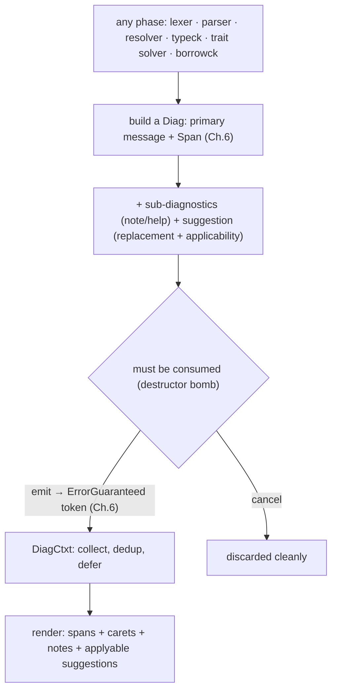
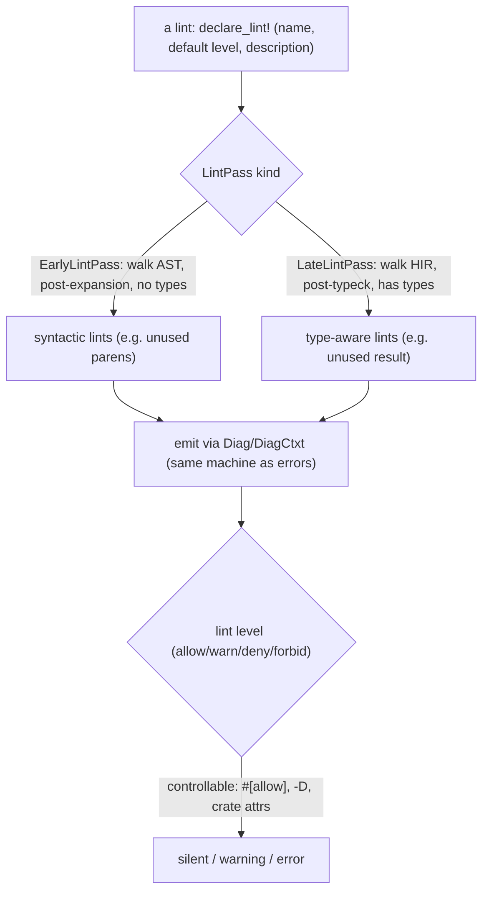
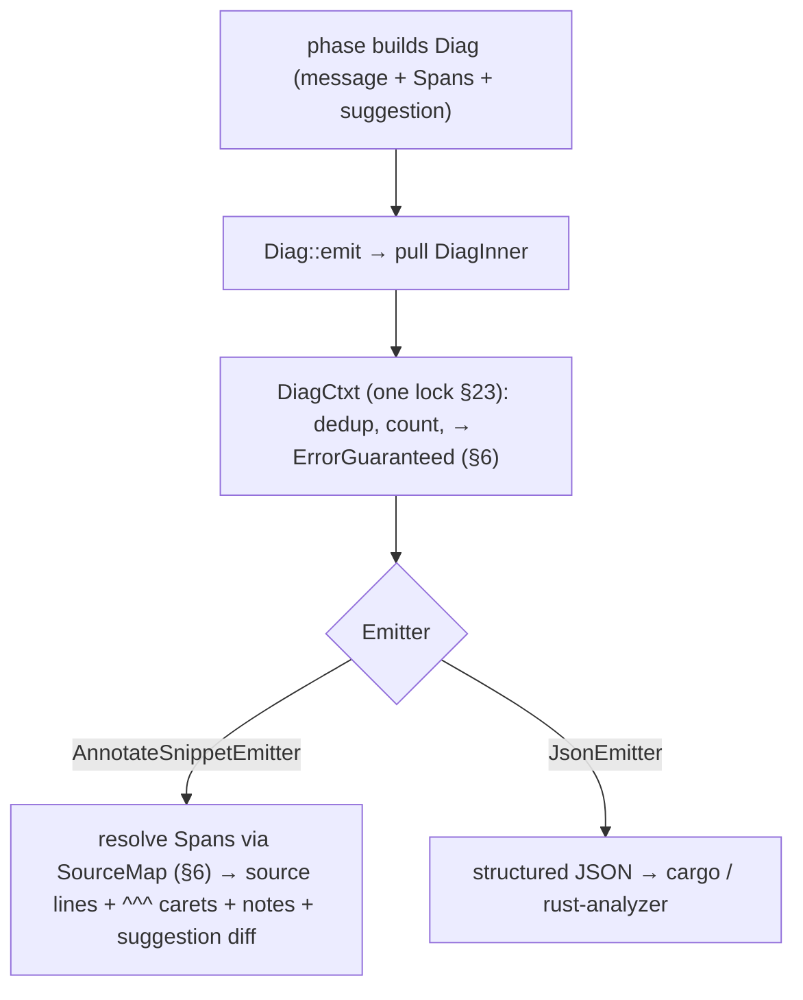
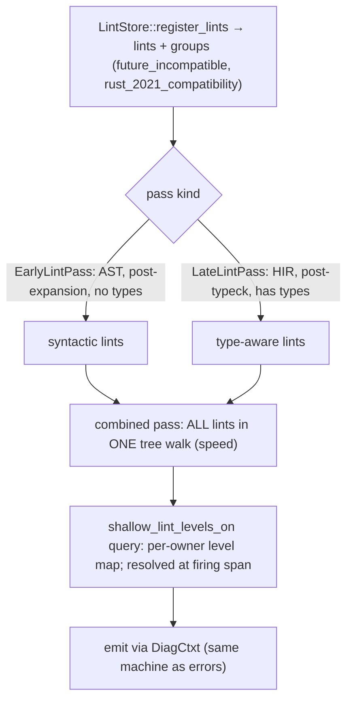
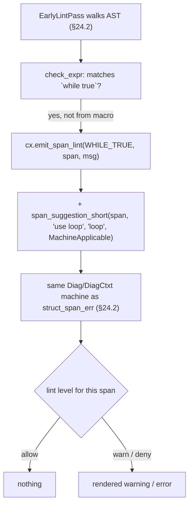
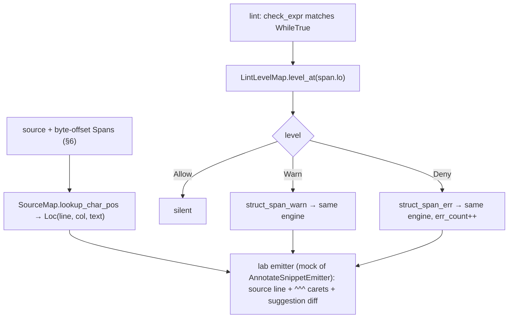

```admonish abstract title="What you'll learn"
- Why diagnostics are a cross-cutting concern: every phase (lexer, parser, resolver, `rustc_hir_typeck`, [the trait solver](../glossary.md#trait-solver), [`rustc_borrowck`](../glossary.md#borrow-checker)) feeds one machine, the `DiagCtxt` sink in `rustc_errors`.
- The role of the [`Diag`](../glossary.md#diag) builder: the destructor-bomb invariant (every `Diag` must be `emit`-ed or `cancel`-led, enforced by `Diag::drop`) and the [`ErrorGuaranteed`](../glossary.md#errorguaranteed) token that proves at the type level an error was reported.
- How a built diagnostic reaches your terminal: `Diag::emit` hands a `DiagInner` to `DiagCtxt` (one lock for the parallel compiler, dedup via a `FxHashSet<Hash128>`), which dispatches to `AnnotateSnippetEmitter` for caret snippets or `JsonEmitter` for tools.
- Why `--error-format=json` is the stable structured API editors consume, and why `rustfix`/`cargo fix` act only on `Applicability::MachineApplicable` suggestions.
- The `rustc_lint` framework: `LintStore` registration, `EarlyLintPass` ([AST](../glossary.md#ast), post-expansion) vs `LateLintPass` (typed [HIR](../glossary.md#hir)), the combined-pass walk, and the `shallow_lint_levels_on` [query](../glossary.md#query) that resolves each [lint](../glossary.md#lint)'s level at its firing span.
- How to read the real `WHILE_TRUE` `EarlyLintPass` (which matches `ast::ExprKind::While`, guards with `from_expansion()`, and emits `BuiltinWhileTrue` via `cx.emit_span_lint`) and contrast it with the late `UNUSED_MUST_USE` pass that needs `LateContext::typeck_results`.
```

## 24.1 Diagnostics and Lints

### What a good error looks like

Here is a diagnostic from `rustc`:

```text
error[E0382]: borrow of moved value: `s`
 --> src/main.rs:4:20
  |
2 |     let s = String::from("hi");
  |         - move occurs because `s` has type `String`, which does not implement the `Copy` trait
3 |     let t = s;
  |             - value moved here
4 |     println!("{}", s);
  |                    ^ value borrowed here after move
  |
help: consider cloning the value if the performance cost is acceptable
  |
3 |     let t = s.clone();
  |              ++++++++
```

A good diagnostic points at the *exact* spans (where the move happened, where the use happened, why the type matters), explains *why* in plain English, and offers a *concrete, applyable* fix. That quality is *engineered*: the product of a deliberate system spanning every phase of the compiler. This chapter is that system. §24.1 asks what makes an error good, and how a compiler is *architected* to produce good ones by design.

### Diagnostics are a cross-cutting concern

The first architectural fact: errors arise *everywhere* in the pipeline this book traced. The lexer finds an unterminated string (Chapter 5); the parser finds a missing `;` (Chapter 7); the resolver finds an unknown name (Chapter 9); the type checker finds a mismatch (Chapter 11); the trait solver finds an unsatisfied bound (Chapter 12); the borrow checker finds a use-after-move (Chapter 15). Every phase produces diagnostics. So diagnostics cannot live *in* any one phase; they are a **cross-cutting concern** (which is why this chapter sits in Part 4 beside incremental and parallel). All phases feed *one* diagnostics machine, built on the [`Span`](../glossary.md#span) infrastructure of Chapter 6 (every diagnostic points at code via spans) and centered on a single sink. That sink is `DiagCtxt`.

### `DiagCtxt`: the central error sink

We met `DiagCtxt` (the diagnostics context) in Chapter 6; here is its role in full. The verified description: "a `DiagCtxt` deals with errors and other compiler output. Certain errors (fatal, bug, unimpl) may cause immediate exit, others log errors for later reporting." It is the one place all diagnostics flow to. Three of its design choices matter:

- **It defers most errors for batch reporting.** A *fatal* error stops the compiler immediately, but ordinary errors are *collected*, so the compiler keeps going and reports *many* errors at once. This is why `rustc` shows you ten type errors in one run instead of making you fix-and-recompile ten times, which requires the compiler to *recover* from errors and continue (Chapter 7's error recovery in the parser, and similar throughout).
- **It is behind a single lock, for the parallel compiler.** The note ties to Chapter 23: the `DiagCtxt`'s inner state exists to keep it all behind a single lock to prevent possible deadlocks in a multi-threaded compiler, as well as inconsistent state observation. Many threads emit diagnostics; one lock serializes them so output is coherent.
- **It tracks emission for incremental replay.** Diagnostics are recorded so they can be *replayed*: the hook ties to Chapter 22's `QuerySideEffects`: a query marked green and skipped still re-emits its diagnostics, because they were saved as side effects. The warning you saw last build appears this build even though the work was reused.

### `Diag`: building one structured diagnostic

A single diagnostic is constructed with the `Diag` builder, `Diag<'a, G: EmissionGuarantee = ErrorGuaranteed>`, which wraps a `DiagInner` and is built up fluently: a primary message and span, then **sub-diagnostics** (notes, help lines), **suggestions** (replacement text the user can apply), and metadata. Two design choices matter:

- **The destructor bomb.** A `Diag` must be consumed by `emit` or `cancel` (other consumption methods include `delay_as_bug`, `stash`, `cancel_into_message`). A panic occurs if a `Diag` is dropped without being consumed. This is a *type-level guarantee that no error is silently lost*: if you build a diagnostic and forget to emit or explicitly cancel it, the compiler ICEs rather than swallowing it. The destructor enforces "every error you started, you must finish."
- **The `EmissionGuarantee` token.** `Diag`'s type parameter `G` (defaulting to `ErrorGuaranteed`) determines what `emit` returns, and for an error, that is the `ErrorGuaranteed` token we met in Chapter 6: a value that *proves at the type level that an error was reported*. Code paths that must only run after an error has been emitted demand an `ErrorGuaranteed`, so you cannot fake "an error happened." You must actually have emitted one to get the token.

A **suggestion** is the part that makes Rust's errors teach: it carries replacement text *and* an **applicability** (is this fix machine-applicable, or just a maybe?), so tools like `cargo fix` and rust-analyzer can *automatically apply* the machine-applicable ones. The `s.clone()` suggestion above is structured data, not just prose. That is why your editor can offer to apply it.




### Structured diagnostics, error codes, and `--explain`

Writing diagnostics by hand is error-prone, so `rustc` increasingly uses **structured diagnostics**: the verified `#[derive(Diagnostic)]` macro lets a phase declare a diagnostic as a *struct* (with `#[primary_span]` on the span field, message text supplied as the literal string inside `#[diag("...")]`), and the macro generates the emission code. The messages used to live in **Fluent** files (`.ftl`) per crate, separated from code, to support translation. In 1.95 the compiler converted them back to inline strings on the diagnostic structs themselves (`#[diag("...")]`), via `DiagMessage::Inline` in `rustc_error_messages`; the translation infrastructure is awaiting a redesign (see rustc-dev-guide's `diagnostics/translation.md`). The `#[derive(Diagnostic)]` macro and the translation layer still exist, but the messages themselves are no longer in separate files. And many errors carry an **error code** (`E0382` above); `rustc --explain E0382` prints a long-form explanation with examples, a built-in textbook of error explanations. The architecture pushes diagnostics from ad-hoc `println`-style emission toward *declared, structured* data.

### Lints: a separate, extensible framework

Errors are one thing; **lints** are another. A lint is not a hard error but a *warning about style or likely-incorrect-but-legal code*: `unused_variables`, `dead_code`, `unreachable_code`, `non_snake_case`, and hundreds more (plus Clippy's). Lints are a *separate framework* from error diagnostics, designed to be **extensible**. You can add a lint without touching the phases. The verified architecture:

- **Each lint is a `LintPass`.** A lint is a struct implementing the verified `LintPass` trait, more specifically `EarlyLintPass` (runs on the AST *after* [macro expansion](../glossary.md#macro-expansion) but *before* type checking, for purely syntactic lints like `UNUSED_PARENS`) or `LateLintPass` (runs on the HIR, *after* type checking, for lints needing type information). The pass "walks the AST" (or HIR) and emits a lint at constructs it cares about, "in a very similar way to compile errors," through the same `Diag`/`DiagCtxt` machinery. (A separate, smaller `pre_expansion_passes` hook exists for the handful of lints that must run *before* expansion runs, see §24.2's `LintStore` fields.)
- **Metadata via `declare_lint!`.** The verified `declare_lint!` macro declares a lint's name, **default level**, and description. The verified `WHILE_TRUE` example declares a warn-by-default lint that flags `while true { }` and suggests `loop { }`; it is an `EarlyLintPass`, since detecting `while true` is purely syntactic, and §24.3 walks it line by line.
- **Lint levels.** Every lint has a **level** (`allow`, `warn`, `deny`, or `forbid`) and the level is *controllable*: via attributes (`#[allow(dead_code)]`, `#[deny(...)]`), command-line flags (`-W`, `-D`, `-A`, `-F`), or crate-level settings. `warn` prints but compiles; `deny` makes it an error; `forbid` is `deny` that cannot be overridden. This is how the *same* lint can be a hard error in one crate and silent in another. The level, not the lint, decides.
- **Clippy.** The verified ecosystem extends this: **Clippy** is a separate lint driver with hundreds of additional lints (correctness, style, complexity, performance), built on the *same* `LintPass` framework, proof the framework is genuinely extensible.




```admonish tip title="Pro-Tip, lint levels are your project's adjustable strictness dial"
Because every lint has a controllable level, you can tune `rustc`'s strictness to your project. Common moves: `#![warn(missing_docs)]` to nudge documentation, `#![deny(unsafe_op_in_unsafe_fn)]` to enforce a safety discipline, `-D warnings` in CI to make *any* warning fail the build (keeping the codebase warning-clean). But two cautions from how the system works. First, `#![deny(warnings)]` *in source* is risky for libraries: a future `rustc` may add a new warn-by-default lint, and your previously-fine code suddenly fails to compile on the new compiler. Prefer `-D warnings` in *CI* (where you control the toolchain) over baking it into the crate. Second, when you *intentionally* trip a lint (an intentionally-unused variable, say), reach for `#[expect(unused_variables)]` rather than `#[allow(...)]`: `expect` warns you if the lint *stops* firing (the situation you were suppressing went away), so your suppressions do not silently rot. `allow` is permanent and forgettable, `expect` is self-cleaning. The level system is not just on/off; it is a vocabulary for expressing *how much you care* about each class of issue, per scope, and using it well (warn for guidance, deny for invariants, expect for known exceptions) turns lints from noise into a tailored quality gate.
```

```admonish warning title="Warning, a suggestion is only as good as its applicability"
The structured-suggestion system carries an **applicability** precisely because not all suggestions are safe to apply blindly, and conflating the levels causes broken code. `MachineApplicable` means "this fix is correct and can be applied automatically" (what `cargo fix` and `cargo clippy --fix` act on); `MaybeIncorrect` means "this is probably what you meant, but verify"; `HasPlaceholders` means "this contains `/* type */`-style holes you must fill in"; `Unspecified` means "shown for guidance only." A tool (or a human in a hurry) that treats a `MaybeIncorrect` suggestion as machine-applicable will confidently rewrite code into something that does not compile or, worse, compiles but is wrong. This is why `cargo fix` applies *only* `MachineApplicable` suggestions, and why diagnostic authors are expected to label applicability honestly. Over-claiming `MachineApplicable` for a suggestion that is merely plausible is a real bug that breaks `cargo fix` for users. The lesson cuts both ways: as a *user*, trust auto-fix only for the green machine-applicable fixes and read the `Maybe` ones before applying; as someone *writing* diagnostics (in `rustc`, Clippy, or a proc-macro that emits diagnostics), label applicability conservatively, because downstream tooling acts on that label mechanically. The applicability field is a *contract* between the diagnostic and the tools that consume it, and a dishonest contract produces confidently-wrong automated edits, the worst kind, because the user trusted the tool.
```

### Where this leaves us

Good diagnostics are *engineered*, not incidental: precise **spans** (Chapter 6) at the exact code, plain-English *why*, and concrete *applyable* fixes, a system, because errors arise in **every** phase (lexer through borrowck) and all feed one machine. `DiagCtxt` is the central sink: it **defers** ordinary errors for batch reporting (many errors per run, requiring error recovery), sits **behind one lock** for the parallel compiler (Chapter 23), and **records diagnostics for incremental replay** (Chapter 22). `Diag` builds one structured diagnostic (primary message + span, sub-diagnostics, and **suggestions** with **applicability**), guarded by a **destructor bomb** (every `Diag` must be emitted or cancelled) and yielding the `ErrorGuaranteed` token (Chapter 6) that proves an error was reported. **Structured diagnostics** (`#[derive(Diagnostic)]`, with messages inline on the struct as `#[diag("...")]`; the per-crate Fluent `.ftl` files were folded back into inline strings in 1.95 pending a translation-layer redesign) make them declarative, and **error codes** + `--explain` add depth. **Lints** are a separate extensible framework: each a `LintPass` (`EarlyLintPass` on the AST, `LateLintPass` on the typed HIR), declared via `declare_lint!` with a **level** (`allow`/`warn`/`deny`/`forbid`) that is controllable per scope, the foundation Clippy's hundreds of lints build on.

§24.2 takes the architecture deep-dive: `rustc_errors`' `DiagCtxt`/`Diag`/`DiagInner` and the emitter that renders to the terminal (or JSON), how spans become the caret-underlined snippets, the suggestion/applicability types, and `rustc_lint`'s pass infrastructure: `LintPass` registration, the combined-pass optimization, and how lint levels are computed per span. Then §24.3 reads a real diagnostic being built and a real lint pass, and §24.4 closes Part 4 with a lab: a tiny diagnostic engine (spans → rendered snippets with carets and suggestions) and a lint pass over a small AST, plus the Part 4 retrospective and the bridge to Part 5.

## 24.2 The Architecture: `DiagCtxt`, the Emitter, and the Lint Passes

### From a built diagnostic to pixels on your terminal

§24.1 introduced the players; this section is the pipeline. A diagnostic's life has three stages: a phase **builds** a `Diag`, the `DiagCtxt` **collects** it (deferring, deduplicating), and an `Emitter` **renders** it, turning byte-offset `Span`s (Chapter 6) into the caret-underlined snippets you read, or into JSON for tools. Then the parallel track: how `rustc_lint` runs **lint passes** over the AST and HIR and computes the **levels** that decide whether each lint is silent, a warning, or an error. All of it threads back to Chapter 6's `SourceMap`, Chapter 3's queries, and Chapter 23's lock.

### `DiagCtxt`, `Diag`, and the handoff to the emitter

The structure (§24.1): a `Diag` is the fluent builder, wrapping a `DiagInner` (the actual data: message, spans, sub-diagnostics, suggestions). The `DiagCtxt` keeps its mutable state in a `DiagCtxtInner` behind a single lock (Chapter 23), holding the running error count, the set of already-emitted diagnostics (for deduplication), and the `Emitter` itself. When a `Diag` is `emit`ted, its `DiagInner` is pulled out and handed to the `DiagCtxt`, which (after dedup and bookkeeping) passes it to the emitter:

```rust
// the handoff  (faithful shape)
// emit is generic over G: EmissionGuarantee; for G = ErrorGuaranteed it
// dispatches to the impl below via EmissionGuarantee::emit_producing_guarantee.
impl<'a, G: EmissionGuarantee> Diag<'a, G> {
    fn emit(self) -> G::EmitResult { G::emit_producing_guarantee(self) }
}
impl<'a> Diag<'a, ErrorGuaranteed> {
    fn emit_producing_error_guaranteed(mut self) -> ErrorGuaranteed {
        let diag = *self.diag.take().unwrap(); // deref Box<DiagInner>
        debug_assert!(matches!(diag.level, Level::Error | Level::DelayedBug));
        self.dcx.emit_diagnostic(diag).unwrap() // None only for non-errors
    }
}
// DiagCtxt: dedup, count, then render  (one lock guards all state, §23)
fn emit_diagnostic(&self, diag: DiagInner) -> Option<ErrorGuaranteed> {
    let mut inner = self.inner.lock();
    // dedup via stable hash into FxHashSet<Hash128>
    if inner.emitted_diagnostics.insert(stable_hash(&diag)) {
        inner.emitter.emit_diagnostic(diag); // ← render it
    }
    /* update err_count, return Some(ErrorGuaranteed) iff it was an error */
}
```

This is where §24.1's pieces connect: the destructor bomb fires if `emit`/`cancel` is never called (the `Diag` is dropped with `diag` still `Some`); the `ErrorGuaranteed` token (§6) is the return; the lock serializes all threads' diagnostics (§23); and deduplication ensures the same error from two code paths is shown once.

### The `Emitter`: rendering spans into snippets

The verified `Emitter` trait "takes care of generating the output from a `Diag` struct." Its core is one required method, `emit_diagnostic(&mut self, diag: DiagInner)` (the `Emitter` trait in `rustc_errors::emitter`), plus access to the `SourceMap`. There are several verified implementations, two of which matter:

- `AnnotateSnippetEmitter` (in `rustc_errors::annotate_snippet_emitter_writer`, built on the external `annotate-snippets` crate): renders the human-readable, caret-underlined terminal output (the §24.1 example). The rendering step: a diagnostic's spans are just *byte offsets* (Chapter 6's `Span` = a range in the `SourceMap`). The emitter resolves each span through the `SourceMap` (Chapter 6) into a file, line, and column; gathers the source lines touched (one annotated-span collector per source file); and draws the snippet: the source line, then `^^^` carets under the primary span and `---` under secondary spans, then notes and help, then the suggestion as a diff. Supporting machinery (`OutputTheme`, `ColorConfig` for color, Unicode handling via the `annotate-snippets` crate) all serves rendering a `Span` into readable pixels. The Chapter 6 promise, that compact byte-offset spans can always be expanded to file/line/column via the `SourceMap`, is *cashed in* here. (`rustc` retired its in-tree caret renderer, formerly `HumanEmitter`, in favor of `annotate-snippets` before the 1.95 cut.)
- `JsonEmitter`: renders the same diagnostic as structured **JSON** (`--error-format=json`), which is what `cargo`, rust-analyzer, and other tools consume to show errors in your editor with clickable spans and applyable fixes. Same `DiagInner`, machine-readable output.

A rendering subtlety: the `Emitter`'s `primary_span_formatted` collapses a *single* suggestion inline into the span display (the neat `s.clone()` shown right in the snippet), while multiple suggestions are listed separately, and a cap on shown suggestions (`MAX_SUGGESTIONS = 4`, in `rustc_errors::emitter`) keeps the output from exploding.




```admonish tip title="Pro-Tip, --error-format=json is the same diagnostics, machine-readable"
The dual-emitter design (`AnnotateSnippetEmitter` for terminals, `JsonEmitter` for tools) is worth understanding because it explains the entire editor experience. When rust-analyzer underlines an error in your IDE and offers a one-click fix, it is not re-implementing `rustc`'s analysis. It is running `cargo check --message-format=json` (or its own `rustc` integration) and *parsing the `JsonEmitter` output*: each diagnostic's spans become the squiggle locations, its message becomes the hover text, and its **machine-applicable suggestions** (§24.1) become the quick-fixes. Editor diagnostics are literally `rustc`'s, serialized. Practical consequences: if you want to build tooling over Rust errors (a custom linter dashboard, a CI annotation, a codemod), consume `--error-format=json` rather than scraping the human output (which is for humans and can change formatting freely). And if an editor's error differs from a terminal build, it is usually a *configuration* difference (different features, different target) feeding the same emitter, not a different analysis. The JSON emitter is the stable, structured API to everything the compiler knows about your errors; the human emitter is just one of its consumers.
```

### `rustc_lint`: passes over the tree

Lints (§24.1) run in their own framework, `rustc_lint`, but emit through the *same* `DiagCtxt`. The architecture has three parts.

**The `LintStore` and registration.** All lints are registered in the `LintStore` (via `register_lints`), which also organizes them into **lint groups**: automatic groups include `future_incompatible` (lints for code that will break in a future release) and edition groups like `rust_2021_compatibility` (auto-generated from each `@future_incompatible = FutureIncompatibleInfo { reason: fcw!(EditionError 2021 ...) }` annotation). A group lets `#[warn(future_incompatible)]` control many lints at once.

**Early vs late passes.** A lint is a `LintPass`. The diagram below shows the two dominant kinds; a smaller pre-expansion category exists too (`LintStore::pre_expansion_passes`, currently just `KeywordIdents`):

- `EarlyLintPass` walks the **AST** (Chapter 7), *after* macro expansion but *before* type checking, so it has no type information, for purely syntactic lints (`unused_parens`, keyword-identifier checks). A separate, smaller pre-expansion hook on `LintStore` holds the handful of lints that must fire *before* expansion runs.
- `LateLintPass` walks the **HIR** (Chapter 10), *after* type checking, so it has access to types, trait resolutions, everything. Type-aware lints (unused `Result`, unnecessary casts) must be late. A `late_lint_mod` runs the late passes per module.

**The combined-pass optimization.** Running dozens of lint passes as separate walks of the tree would be slow: dozens of traversals. The solution: a `declare_combined_late_lint_pass!` macro (and `declare_combined_early_lint_pass!` for the early side) build *one* combined pass whose each `check_`* method simply calls `check_foo` once per pass, so all built-in lints run in a **single walk** of the tree. One traversal, every lint, combined at compile time for speed.




### Lint levels: a query over attributes and flags

Whether a fired lint becomes silent, a warning, or an error is the **level** (§24.1), and computing it is itself query-driven (Chapter 3). The level at any point in the code depends on: the lint's *default* level (from `declare_lint!`), command-line flags (`-W`/`-D`/`-A`/`-F`), and `#[allow]`/`#[warn]`/`#[deny]`/`#[forbid]` attributes, which *nest*, so the level can differ between a module and a function inside it. The verified `shallow_lint_levels_on` query (in `rustc_middle/src/queries.rs`) computes, per-owner, a `ShallowLintLevelMap` of lint specs from the attributes on that owner; level resolution then walks from the firing span up through enclosing owners, so that when a lint fires at a span, the system looks up the level *in effect at that span* (respecting the innermost enclosing attribute) and acts accordingly. `forbid` is special: it is `deny` that *cannot* be overridden by a more-nested `allow`.

A verified wrinkle ties to ordering: some lints must fire *before* the level machinery exists (during parsing or macro expansion, before `shallow_lint_levels_on` has run). The verified solution is **buffered early lints**: these lints are *buffered* and emitted later, once levels are computed, "because we need to have computed lint levels to know whether we should emit a warning or an error or nothing at all." The architecture defers them rather than guessing.

```admonish warning title="Warning, lint level is determined at the lint's span"
Two facts about levels routinely confuse. First, the level is resolved at the *span where the lint fires*, using the innermost enclosing `allow`/`warn`/`deny`/`forbid`. So `#[allow(dead_code)]` on a *function* silences the lint for code in that function even if the crate denies it, and conversely a crate-level `#![deny(...)]` is overridden by a local `#[allow(...)]` on the offending item. People expecting "I denied it at the crate root, so it is denied everywhere" are surprised when a nested `allow` wins; the *nearest* attribute governs. Second, `forbid` is not just a louder `deny`. It is a `deny` that makes any nested attempt to *lower* the level (an `#[allow]` inside) itself an error. This is deliberate (it lets a crate enforce an invariant no module can opt out of), but it means adding `#![forbid(unsafe_code)]` can break a dependency-free build the moment any file contains `#[allow(unsafe_code)]`, even with good intentions. The mental model that avoids surprises: a lint level is not a global setting but a *scoped, nested, span-resolved* property, like a CSS cascade, the most specific enclosing declaration wins, except `forbid` which locks the cascade. When a lint "won't turn off" or "won't stay on," the answer is almost always a nested attribute at a scope you forgot, resolved at the firing span, not a bug in the lint. Check the innermost attribute over the actual code, not just the crate root.
```

### How this builds, and what is next

The diagnostics pipeline runs **build → collect → render**. A phase builds a `Diag` (wrapping `DiagInner`); `emit` hands the `DiagInner` to `DiagCtxt`, which behind **one lock** (Chapter 23) deduplicates, counts, returns the `ErrorGuaranteed` token (Chapter 6), and passes it to an `Emitter`. `AnnotateSnippetEmitter` resolves the byte-offset `Span`s through the `SourceMap` (Chapter 6) into file/line/column and draws the caret-underlined snippet with notes and an inline suggestion diff; `JsonEmitter` emits the same as structured JSON for editors and `cargo`, the stable machine API to the compiler's errors. `rustc_lint` runs its own passes that emit through the same `DiagCtxt`: lints register in the `LintStore` (with groups like `future_incompatible`), run as `EarlyLintPass` (AST, pre-types) or `LateLintPass` (HIR, post-types), and, for speed, are **combined into one tree walk**. Whether a fired lint is silent/warning/error is its **level**, computed by the query-driven `shallow_lint_levels_on` from defaults + flags + nested attributes (resolved at the firing span, with `forbid` un-overridable), and lints that fire too early are **buffered** until levels exist.

§24.3 reads the real source: a `Diag` being built with a span and a machine-applicable suggestion and emitted, and a real `LateLintPass` (the `while true` lint or similar) checking a HIR node and emitting through the lint machinery, diagnostics and lints in actual code. Then §24.4 closes Chapter 24 *and Part 4* with a lab: a tiny diagnostic engine that turns spans into caret-underlined rendered snippets with an applyable suggestion, plus a small lint pass over a toy AST with controllable levels, followed by the Part 4 retrospective and the bridge to Part 5, the Contributor's Practicum.

## 24.3 Reading the Source: Building a Diagnostic and a Lint Pass

### A diagnostic and a lint, in code

This section reads the two things §24.1 to §24.2 described: a `Diag` built with a structured, applyable suggestion and emitted, and a real `EarlyLintPass` that walks the AST and emits a lint. A lint emits through the *exact same* `Diag`/`DiagCtxt` machinery as a hard error. A lint is, mechanically, just a diagnostic with a level. The source is `rustc_errors`' suggestion API and `rustc_lint`'s built-in lints.

### Building a diagnostic with a suggestion

Recall the §24.1 `E0382` message with its `s.clone()` fix. Here is the shape that produces a diagnostic-plus-suggestion: a primary error at a span, then a structured suggestion:

```rust
// faithful shape of building an error with an applyable suggestion
// primary message + span
let mut err = dcx.struct_span_err(use_span, "borrow of moved value: `s`");
err.span_label(move_span, "value moved here"); // a secondary labelled span
err.span_suggestion(
    use_span, // where the fix applies
    "consider cloning the value if the performance cost is acceptable", // the help text
    "s.clone()",  // the REPLACEMENT code
    Applicability::MachineApplicable,  // ← the contract (§24.1): safe to auto-apply
);
let _: ErrorGuaranteed = err.emit(); // consume the Diag → get the proof token (§6)
```

Read how the §24.2 pipeline is engaged. `struct_span_err` builds a `Diag` (wrapping a `DiagInner`) with the primary message and span; `span_label` adds a secondary labelled span (the `---` annotation); the verified `span_suggestion`, whose role the rustc-dev-guide describes as: "Suggestions point to one or more spans with corresponding code that will replace their current content," carrying the replacement text *and* the `Applicability`. Then `emit` consumes the `Diag` (satisfying the destructor bomb, §24.1), hands its `DiagInner` to the `DiagCtxt`, and returns the `ErrorGuaranteed` token (§6). The emitter (§24.2) later renders the suggestion inline as the `+ s.clone()` diff. Every piece of §24.1 to §24.2 is in these few lines.

### The four applicabilities: the contract, named

`span_suggestion`'s last argument is the `Applicability` (`MachineApplicable` / `MaybeIncorrect` / `HasPlaceholders` / `Unspecified`, defined in `rustc_lint_defs`): only `MachineApplicable` is what `cargo fix` and `rustfix` auto-apply (consuming the §24.2 `JsonEmitter` output). See the rustc-dev-guide's suggestion section for full variant semantics. This single argument *is* the §24.1 warning's contract, here in the API: over-claim `MachineApplicable` and you break `cargo fix` for users.

### A real lint pass: `WHILE_TRUE`

Now the lint. The verified built-in `WHILE_TRUE` flags `while true { ... }` and suggests `loop { ... }`. It has three parts: declare the lint, declare the pass, implement the check.

```rust
// rustc_lint::builtin  (teaching shape: real rustc passes a #[derive(Diagnostic)]
// struct, BuiltinWhileTrue in rustc_lint::lints, as the third argument to
// emit_span_lint, not a (msg, closure) pair; the closure form below is the legacy
// shape from the opt_span_lint API, shown here for clarity of the moving parts)

// (1) declare the lint: name, default level, description (§24.1)
declare_lint! {
    WHILE_TRUE,
    Warn, // warn-by-default
    "suggest using `loop { }` instead of `while true { }`"
}

// (2) declare the pass and tie it to the lint(s) it emits
declare_lint_pass!(WhileTrue => [WHILE_TRUE]);

// (3) implement the check: an EarlyLintPass walks the AST (§24.2). `while true` is
// purely syntactic, no types needed, so this is the natural early-pass example.
impl EarlyLintPass for WhileTrue {
    fn check_expr(&mut self, cx: &EarlyContext<'_>, e: &ast::Expr) {
        // match the AST shape of `[label:] while true { ... }` directly
        if let ast::ExprKind::While(cond, _, label) = &e.kind
            && let ast::ExprKind::Lit(token_lit) = cond.peel_parens().kind
            && let token::Lit { kind: token::Bool, symbol: kw::True, .. } = token_lit
            // don't lint code generated by a macro
            && !cond.span.from_expansion()
        {
            // span of `[label:] while true` only, not the body
            let condition_span = e.span.with_hi(cond.span.hi());
            // labelled loops need their label preserved in the suggestion
            let replace = format!(
                "{}loop",
                label.map_or_else(String::new, |l| format!("{}: ", l.ident)),
            );
            let msg = "denote infinite loops with `loop { ... }`";
            cx.emit_span_lint(WHILE_TRUE, condition_span, msg, |diag| {
                diag.span_suggestion_short(
                    condition_span, "use `loop`", replace, Applicability::MachineApplicable,
                );
            });
        }
    }
}
```

Read the three pieces against §24.1 to §24.2. **(1)** `declare_lint!` records the metadata: name `WHILE_TRUE`, default level `Warn`, description (§24.1). **(2)** `declare_lint_pass!(WhileTrue => [WHILE_TRUE])` declares the pass struct and the lints it can emit (so the `LintStore`, §24.2, knows the linkage). **(3)** the `impl EarlyLintPass` is the actual work: `check_expr` is called for every AST expression as the combined pass walks the tree (§24.2), and on matching the `while true` shape it calls `cx.emit_span_lint(WHILE_TRUE, span, msg, ...)`, *the lint analogue of `struct_span_err`*, and attaches a `span_suggestion_short` proposing `loop` with `MachineApplicable` applicability. The verified `from_expansion` guard is important: the lint skips code produced by macros (you should not be warned about `while true` inside a macro you did not write, [hygiene](../glossary.md#hygiene), Chapter 8, reaching into diagnostics).

The crucial observation: `emit_span_lint` produces a `Diag` and emits it through the *same* `DiagCtxt` as `struct_span_err`. The *only* differences between this lint and a hard error are (a) it goes through the lint-level machinery (§24.2) so its `Warn` default can be turned to `deny`/`allow`/`forbid` per scope, and (b) it is gated on a lint being enabled. Mechanically, **a lint is a diagnostic with a level.** The `WHILE_TRUE` warning and the `E0382` error are built and rendered by the identical machine. (The diagram below collapses `forbid` into the `deny` branch, since at the firing span it renders as an error.)




### When a lint must be *late*: types at hand

`WhileTrue` is purely syntactic, the AST already says "this is a `while` with a boolean-true condition", so an `EarlyLintPass` is enough; that is why rustc registers it in `BuiltinCombinedEarlyLintPass` rather than the late one. Most interesting lints are *not* like that. Consider the verified built-in `UNUSED_MUST_USE`, which warns when you discard a value whose type is `#[must_use]` (the canonical case is dropping a `Result` without inspecting it). That lint *cannot* be written early. It needs to know the discarded expression's type, and the type is computed by Chapter 11's typeck, which has not yet run when the early passes fire. Its `impl<'tcx> LateLintPass<'tcx> for UnusedResults` reaches into the typed program through the verified `LateContext`: `cx.typeck_results()` for the types of expressions (Chapter 11), [`cx.tcx`](../glossary.md#tyctxt-tcx) for the whole query database (Chapter 3), `cx.tcx.is_diagnostic_item(...)` to recognize standard-library types like `Result` and `Option`. *Most* lints look like this, not like `WHILE_TRUE`. Late passes pay the cost of running after typeck but gain the entire typed HIR to reason over, and Clippy's hundreds of lints are overwhelmingly late, for exactly this reason.

```admonish tip title="Pro-Tip, from_expansion guards are why good lints don't fire on macro-generated code"
The verified guard in `WHILE_TRUE`, skipping when the span comes from a macro expansion, is a small line with a big purpose, and it connects directly to Chapter 8's hygiene. A lint that fires on code a *macro* generated punishes the user for code they did not write and often cannot change (it is inside someone else's macro). So well-behaved lints check the span's expansion context and stay quiet about generated code, linting only what the user actually typed. This matters to you in two ways. If you *write* a lint (in Clippy, or a custom driver), guarding on `from_expansion()` is usually mandatory. Forgetting it produces the classic "this lint fires a thousand times inside a popular macro" bug. And if you *write a proc-macro* (Chapter 8), the spans you assign to generated tokens determine whether downstream lints (and error messages) point at your macro's call site or its internals, using `Span::call_site()` vs `Span::def_site()` deliberately is how you control whether a user sees a clean error at their code or a confusing one inside your expansion. The span's hygiene context (Chapter 8) flows all the way through to diagnostics: it decides what code an error or lint is *allowed to talk about*. Respecting it is the difference between a lint that helps and one that spams.
```

```admonish warning title="Warning, lints emitted from a query become that query's incremental side effects"
Because lints and errors emit through `DiagCtxt`, and `DiagCtxt` is integrated with incremental compilation's side-effect replay (§22.3, §24.1), *where* in the query graph you emit a diagnostic matters. A diagnostic emitted inside query `Q` is recorded as one of `Q`'s `QuerySideEffects`, so on a rebuild where `Q` is green and skipped, the diagnostic is *replayed* from cache (good, the warning still appears). But this creates two failure modes for compiler and lint authors. If you emit the *same* logical diagnostic from two different queries (or a query and a non-query path), it can appear *twice* on a clean build and behave inconsistently on incremental ones. And if you emit a diagnostic from a place that is *not* properly tracked as a query side effect, it can *vanish* on a green rebuild, the §22.3 vanishing-effect hazard, now specifically about diagnostics. This is why the dev-guide stresses "try not to emit multiple error messages for the same error" and why diagnostics are increasingly funneled through structured, query-attributed paths. The practical rule for anyone adding diagnostics to `rustc` or a lint driver: emit a given diagnostic from exactly *one* well-defined point in the query graph, so it is recorded once and replayed correctly. Diagnostics are not free-floating `println`s, they are tracked effects of the queries that produce them, and the incremental system treats them as such. Get the emission site wrong and the bug shows up only on rebuilds, as a doubled or missing warning.
```

### How this builds, and what is next

We have read both. A **diagnostic** is built fluently: `struct_span_err` for the primary message and span, `span_label` for secondary spans, `span_suggestion` for an applyable fix carrying replacement text and an `Applicability` (`MachineApplicable`/`MaybeIncorrect`/`HasPlaceholders`/`Unspecified`, the contract that decides whether `cargo fix` auto-applies it), then `emit` consuming the `Diag` (destructor bomb, §24.1) and returning `ErrorGuaranteed` (§6). A **lint**, the verified `WHILE_TRUE`, is three parts: `declare_lint!` (name, default `Warn`, description), `declare_lint_pass!` (the pass and its lints), and an `impl EarlyLintPass` whose `check_expr` walks the **AST** (`while true` is purely syntactic, so no types are needed; the type-aware `UNUSED_MUST_USE` is the canonical *late* counterpart, walking the typed HIR via `LateContext::typeck_results`, Chapter 11), matches the pattern, guards against macro-generated code (`from_expansion`, hygiene, Chapter 8), and calls `emit_span_lint` + `span_suggestion_short`, emitting through the **same `DiagCtxt`** as an error, gated only by its **level** (§24.2). Mechanically, a lint is a diagnostic with a level. And because diagnostics are query side effects (§22), *where* one is emitted determines its incremental replay.

§24.4 closes Chapter 24, *and Part 4*, with a lab: a tiny **diagnostic engine** that turns byte-offset spans into caret-underlined rendered snippets with an applyable suggestion (a hand-built mock of rustc's `AnnotateSnippetEmitter`), plus a small **lint pass** over a toy AST with a controllable level. Then the **Part 4 retrospective** ties the three cross-cutting concerns (incremental, parallel, diagnostics) together, and the bridge opens **Part 5. The Contributor's Practicum** (Chapter 25, setting up to hack on `rustc`; Chapter 26, the guided capstone contribution).

## 24.4 Hands-On Lab: Build a Diagnostic Engine and a Lint

### The diagnostic engine in miniature

This lab builds the diagnostic engine the rest of the chapter described: a **diagnostic engine** that turns byte-offset spans into caret-underlined source snippets with an applyable suggestion (a hand-built mock of rustc's `AnnotateSnippetEmitter`), and a **lint pass** that emits through the *same* engine, gated by a controllable level. When your engine renders a borrow-of-moved-value error pointing at the exact code with a `+ s.clone()` fix (and your `while true` lint prints a warning, becomes an error under `Deny`, and goes silent under `Allow`, all through one machine), you will have demonstrated §24.3's claim that *a lint is a diagnostic with a level*.

`cargo new`, pure `std`.

### A `SourceMap`: byte offsets → file/line/column

The §6 foundation: a span is just byte offsets; the `SourceMap` turns them into a location for rendering.

```rust
// src/main.rs
#[derive(Clone, Copy)]
struct Span { lo: usize, hi: usize } // byte offsets into the source (§6)

// rustc's SourceMap::lookup_char_pos returns a Loc with file, line, col, col_display;
// here we keep the bare line/col plus the source line for rendering.
struct Loc<'a> { line: usize, col: usize, text: &'a str }

struct SourceMap { src: String }
impl SourceMap {
    // resolve a byte offset to a Loc (line, column, full line text), what the emitter needs (§24.2)
    fn lookup_char_pos(&self, offset: usize) -> Loc<'_> {
        let mut line_start = 0;
        for (lineno, line) in self.src.lines().enumerate() {
            let line_end = line_start + line.len();
            if offset <= line_end {
                return Loc { line: lineno + 1, col: offset - line_start, text: line };
            }
            line_start = line_end + 1; // +1 for the '\n'
        }
        Loc { line: 1, col: 0, text: "" }
    }
}
```

### Applicability and the suggestion

```rust
#[derive(Clone, Copy, PartialEq)]
// §24.3
enum Applicability { MachineApplicable, MaybeIncorrect, HasPlaceholders, Unspecified }

#[derive(Clone)]
struct Suggestion { span: Span, msg: String, replacement: String, applicability: Applicability }
```

### `Diag`: the builder with a destructor bomb

```rust
#[derive(PartialEq, Clone, Copy)]
enum Level { Warning, Error }

// real rustc: Diag<'a, G: EmissionGuarantee = ErrorGuaranteed>; emit returns G::EmitResult,
// so error builders yield ErrorGuaranteed (the §6 token) and warning builders yield ().
// The lab keeps a runtime Level for simplicity.
struct Diag<'a> {
    dcx: &'a DiagCtxt,
    level: Level,
    message: String,
    primary: Span,
    labels: Vec<(Span, String)>,
    suggestion: Option<Suggestion>,
    emitted: bool,  // the destructor-bomb flag (§24.1)
}

impl<'a> Diag<'a> {
    fn span_label(mut self, span: Span, msg: &str) -> Self { self.labels.push((span, msg.into())); self }
    fn span_suggestion(mut self, span: Span, msg: &str, replacement: &str, a: Applicability) -> Self {
        self.suggestion = Some(Suggestion { span, msg: msg.into(), replacement: replacement.into(), applicability: a });
        self
    }
    fn emit(mut self) { // consume → render via DiagCtxt (§24.2)
        self.emitted = true;
        self.dcx.emit(&self);
    }
}

impl<'a> Drop for Diag<'a> {
    fn drop(&mut self) {
        // §24.1: a Diag dropped without emit is a compiler bug.
        // real rustc Drop additionally emits the un-emitted diag as a Level::Bug before
        // panicking, and guards with std::thread::panicking() to avoid double-panic during
        // unwinding (see Diag::drop in rustc_errors).
        if !self.emitted { panic!("BUG: Diag dropped without being emitted"); }
    }
}
```

### `DiagCtxt` and the lab emitter

The context counts errors and renders; the emitter (a hand-built mock of rustc's `AnnotateSnippetEmitter`) resolves spans through the `SourceMap` and draws the caret snippet (§24.2):

```rust
use std::cell::Cell;

// hand-built analogue of rustc_errors::annotate_snippet_emitter_writer::AnnotateSnippetEmitter
struct LabAnnotateSnippetEmitter { sm: SourceMap }

impl LabAnnotateSnippetEmitter {
    fn emit_diagnostic(&self, d: &Diag) {
        let tag = match d.level { Level::Error => "error", Level::Warning => "warning" };
        let Loc { line, col, text } = self.sm.lookup_char_pos(d.primary.lo);
        let width = d.primary.hi - d.primary.lo;

        println!("{tag}: {}", d.message);
        println!("  --> src/main.rs:{line}:{}", col + 1);
        println!(" |");
        println!("{line:>2} | {text}");
        println!(" | {}{}", " ".repeat(col), "^".repeat(width.max(1)));
        for (span, lmsg) in &d.labels {
            let Loc { col: lcol, .. } = self.sm.lookup_char_pos(span.lo);
            let lw = span.hi - span.lo;
            println!(" | {}{} {lmsg}", " ".repeat(lcol), "-".repeat(lw.max(1)));
        }
        if let Some(s) = &d.suggestion {
            let Loc { line: sl, col: sc, text: st } = self.sm.lookup_char_pos(s.span.lo);
            println!("   |");
            println!("help: {}", s.msg);
            // show the fixed line as a diff (the §24.2 inline suggestion)
            let fixed = format!("{}{}{}", &st[..sc], s.replacement, &st[sc + (s.span.hi - s.span.lo)..]);
            println!("{sl:>2} | {fixed}");
        }
        println!();
    }
}

// real DiagCtxt: behind a Lock (§23), wraps a DiagCtxtInner carrying
// emitted_diagnostics: FxHashSet<Hash128> for dedup and err_guars: Vec<ErrorGuaranteed>
// rather than a bare counter.
struct DiagCtxt { emitter: LabAnnotateSnippetEmitter, err_count: Cell<u32> }

impl DiagCtxt {
    fn struct_span_err(&self, span: Span, msg: &str) -> Diag<'_> {
        Diag { dcx: self, level: Level::Error, message: msg.into(), primary: span,
               labels: vec![], suggestion: None, emitted: false }
    }
    fn struct_span_warn(&self, span: Span, msg: &str) -> Diag<'_> {
        Diag { dcx: self, level: Level::Warning, message: msg.into(), primary: span,
               labels: vec![], suggestion: None, emitted: false }
    }

    fn emit(&self, d: &Diag) {
        if d.level == Level::Error { self.err_count.set(self.err_count.get() + 1); }
        self.emitter.emit_diagnostic(d);
    }
}
```

### Rendering an error

```rust
fn main() {
    let src = "fn main() {\n let s = String::from(\"hi\");\n let t = s;\n println!(\"{}\", s);\n}".to_string();
    let dcx = DiagCtxt {
        emitter: LabAnnotateSnippetEmitter { sm: SourceMap { src: src.clone() } },
        err_count: Cell::new(0),
    };

    // span of the final `s` (the use-after-move), byte offsets into `src`
    let i = src.rfind("s)").unwrap_or_else(|| src.rfind('s').unwrap());
    let use_span = Span { lo: i, hi: i + 1 };

    dcx.struct_span_err(use_span, "borrow of moved value: `s`")
        .span_suggestion(use_span, "consider cloning the value", "s.clone()", Applicability::MachineApplicable)
        .emit();
}
```

````admonish example title="Expected output" collapsible=true
Output:

```text
error: borrow of moved value: `s`
  --> src/main.rs:4:20
   |
 4 |     println!("{}", s);
   |                    ^
   |
help: consider cloning the value
 4 |     println!("{}", s.clone());

```
````

Your diagnostic engine produces the §24.1-style message: the primary span resolved through the `SourceMap` to line 4, the source line printed with a `^` caret under the exact offending byte, and the suggestion rendered as the fixed line. This is the §24.2 `AnnotateSnippetEmitter` in miniature: spans are byte offsets, the `SourceMap` turns them into lines and columns, and rendering draws carets and the suggestion diff.

### A lint, through the same engine

Now §24.3's claim, demonstrated. A tiny lint over a toy AST, emitting through the *same* `DiagCtxt`, gated by a level:

```rust
use std::collections::BTreeMap;

enum Expr { WhileTrue(Span), Other } // a toy AST node

#[derive(PartialEq, Clone, Copy)] enum LintLevel { Allow, Warn, Deny } // §24.2 lint levels

// Per-span level resolution, the seam to rustc's ShallowLintLevelMap (keyed by HirId,
// populated by the shallow_lint_levels_on query). The lab keys by byte offset and walks
// to the innermost (largest-offset) scope at or before the firing span, the analog of
// LintLevelsBuilder::lint_level walking the nested attribute stack (§24.2).
struct LintLevelMap(BTreeMap<usize, LintLevel>);
impl LintLevelMap {
    fn level_at(&self, offset: usize) -> LintLevel {
        self.0.range(..=offset).next_back().map(|(_, l)| *l).unwrap_or(LintLevel::Warn)
    }
}

struct WhileTrueLint;
impl WhileTrueLint {
    // level is resolved per firing span (analog of LintContext::lint_level_at_node),
    // not stored on the pass struct.
    fn check_expr(&self, dcx: &DiagCtxt, levels: &LintLevelMap, e: &Expr) {
        if let Expr::WhileTrue(span) = e {
            match levels.level_at(span.lo) {
                LintLevel::Allow => {} // silent
                LintLevel::Warn => dcx.struct_span_warn(*span, "denote infinite loops with `loop`")
                                       .span_suggestion(*span, "use `loop`", "loop", Applicability::MachineApplicable).emit(),
                // SAME engine, error level
                LintLevel::Deny => dcx.struct_span_err(*span, "denote infinite loops with `loop`")
                                       .span_suggestion(*span, "use `loop`", "loop", Applicability::MachineApplicable).emit(),
            }
        }
    }
}
```

````admonish example title="Expected output" collapsible=true
Running the lint over `while true` (whose span covers the `while true`), with a one-entry `LintLevelMap` set to each level in turn:

```text
=== Warn ===
warning: denote infinite loops with `loop`
  --> src/main.rs:1:1
   | ...   ← rendered, err_count unchanged

=== Deny ===
error: denote infinite loops with `loop`
  --> src/main.rs:1:1
   | ...   ← rendered, err_count = 1

=== Allow ===
(no output)
```
````

This is §24.3's thesis, proven in code you wrote: the *same* `Diag`/`DiagCtxt`/emitter renders the lint, and the **level alone** decides whether it is silent (`Allow`), a warning (`Warn`), or a hard error that bumps the error count (`Deny`). A lint *is* a diagnostic with a level. Change `Warn` to `Deny` and the identical diagnostic becomes a build-failing error, exactly what `#[deny(...)]` does in real Rust (§24.2).




### What the lab stripped from real rustc

The lab built a destructor-bomb `Diag` builder plus a swappable-emitter `DiagCtxt` plus a level-gated lint. Real `rustc_errors` adds a typed `EmissionGuarantee` parameter on `Diag`, a much larger `DiagInner` (error codes, expect-tracking, Fluent args, sort keys, sub-diagnostics), a parallel-safe `Lock`-guarded `DiagCtxtInner` with dedup and stash state, a richer `LintStore` pipeline (more pass categories, per-HIR-kind `check_*` defaults, a `LateContext` carrying `TyCtxt`), per-span level resolution walking the nested attribute stack (`forbid` unoverridable), and pluggable emitters beyond `AnnotateSnippetEmitter` and `JsonEmitter`. See the rustc-dev-guide chapter on Diagnostics and the source under `[compiler/rustc_errors/](https://github.com/rust-lang/rust/tree/1.95.0/compiler/rustc_errors)` and `[compiler/rustc_lint/](https://github.com/rust-lang/rust/tree/1.95.0/compiler/rustc_lint)` for the exhaustive shape.

The "compiler that explains itself" of §24.1 is the lab's loop, multiplied by every borrow-checker error message rustc ships and statically tracked all the way through the codebase.

### Extension exercises

1. **JSON emitter.** Add a `JsonEmitter` that prints each diagnostic as JSON (message, span, suggestion, applicability), the §24.2 machine-readable form editors consume. Same `Diag`, different output.
2. **Actually apply the fix.** Use a `MachineApplicable` suggestion to *rewrite* the source string (splice the replacement into the span) and print the fixed file, your own `cargo fix`. Refuse to auto-apply `MaybeIncorrect`/`HasPlaceholders` (§24.3's contract).
3. **Multi-span and notes.** Extend `Diag` to carry several primary spans and `note`/`help` sub-diagnostics, and render the borrow-of-moved-value error with *both* the move span and the use span labelled (the full §24.1 example).
4. **Nested lint levels and `forbid`.** Extend `LintLevelMap` from a flat byte-offset map into a stack of `(scope, level)` ranges, resolve the firing-span level by the innermost enclosing scope (the analog of `LintLevelsBuilder::lint_level` walking nested `#[allow]`/`#[deny]` attributes), and add a `Forbid` variant that makes any nested attempt to lower the level itself an error (§24.2's un-overridable rule).
5. **Wire to a real AST.** Point the lint at one of the ASTs you built earlier (Chapter 7's parser output, say) and lint actual parsed code, closing the loop from source to diagnostic.
6. **Structured diagnostics.** Define a struct `WhileTrueDiag { suggestion: Span, replace: String }` and a small `trait IntoDiag` that builds a `Diag` from such a struct, then refactor `WhileTrueLint::check_expr` to construct the struct and pass it to a new `DiagCtxt::emit_structured` method. No proc macro, just a trait plus impl, so you experience the macro's output in plain Rust. You will have hand-coded the shape of rustc's `#[derive(Diagnostic)]`, see `rustc_lint::lints::BuiltinWhileTrue@59807616e1fa` for the real struct (with `#[diag(...)]` + `#[suggestion(...)]`) and `rustc_macros::diagnostics@59807616e1fa` for the macro that generates this code.

### Where Chapter 24 leaves us

Chapter 24 is complete. §24.1 framed good diagnostics as *engineered*: precise spans, plain-English why, applyable fixes, a cross-cutting system (errors arise in every phase) centered on `DiagCtxt`, with `Diag`'s destructor bomb and the `ErrorGuaranteed` token, structured `#[derive(Diagnostic)]` (with `#[diag("...")]` messages inline on the struct after the 1.95 fold-back from Fluent `.ftl` files), and a separate extensible *lint* framework with controllable levels. §24.2 detailed the architecture: the `DiagCtxt → Diag → Emitter` pipeline (one lock §23, dedup, incremental replay §22), `AnnotateSnippetEmitter` resolving spans through the `SourceMap` §6 vs `JsonEmitter` for tools, and `rustc_lint`'s `LintStore`, early-vs-late passes, combined-pass walk, and query-driven level computation. §24.3 read the source: `span_suggestion` with its four `Applicability` levels, and the `WHILE_TRUE` `EarlyLintPass` (with `UNUSED_MUST_USE` as the late counterpart) emitting through the same `DiagCtxt`. And in this lab you built both: a span-resolving emitter and a level-gated lint, proving a lint is a diagnostic with a level.

### Part 4 retrospective: the cross-cutting concerns

Part 4 is complete, and it covered the three things that make `rustc` a *production* compiler rather than a textbook pipeline, concerns that cut *across* every stage of Parts 0 to 3.

- **Chapter 22. Incremental Compilation.** The compiler *remembers*: it persists the Chapter 3 query [dependency graph](../glossary.md#depgraph), identifies results with stable [`DepNode`](../glossary.md#depnode)s and [`Fingerprint`](../glossary.md#fingerprint)s, and uses [red-green](../glossary.md#red-green-algorithm) marking (with early cutoff) to reuse everything an edit did not touch, turning rebuilds from minutes into seconds.
- **Chapter 23. Parallel Compilation.** The compiler uses *all the cores*: the back end's independent [codegen units](../glossary.md#cgu) were always parallel, and the front end was retrofitted thread-safe via `rustc_data_structures::sync`'s dual implementations and `Sharded` locks, with the pure query system as a natural foundation and a deadlock handler for cross-thread cycles.
- **Chapter 24. Diagnostics and Lints.** The compiler reports problems through one system: a `DiagCtxt`-centered pipeline, fed by every phase, that renders spans into caret-underlined snippets with applyable suggestions, with a separate extensible lint framework (early/late passes, controllable levels) building on the same machine.

Notice how tightly these interlock with each other and with the core pipeline. Diagnostics are *query side effects* replayed by incremental compilation (Chapter 22 / Chapter 24); the diagnostics lock exists *because* of the parallel compiler (Chapter 23 / Chapter 24); the dep-graph that powers incrementality has *sharded locks* for the parallel compiler (Chapter 22 / Chapter 23). The cross-cutting concerns cross-cut *each other*. Together they are why `rustc`, despite doing the enormous amount of work Parts 0 to 3 traced, can rebuild in seconds, saturate your cores, and tell you exactly what is wrong and how to fix it.

### The picture so far

Part 4 is complete; the compiler is whole. Beyond producing correct code, it now reuses what it did last time (Chapter 22), executes phases in parallel (Chapter 23), and reports problems through a structured diagnostics path (Chapter 24). The picture is now a prover that becomes a translator, with incremental reuse, parallel execution, and a unified diagnostics path. Part 5 turns the book around: from understanding the compiler to changing it.

### Bridge to Part 5: from understanding to contributing

You now understand `rustc` end to end: the full pipeline from source to executable (Parts 0 to 3) and the cross-cutting machinery that makes it fast and friendly (Part 4). Every chapter ended with a lab that *rebuilt* a piece in miniature. Part 5 makes the final move: from understanding the compiler to *changing* it. **Chapter 25. Setting Up to Hack on `rustc`** is the practical on-ramp: cloning `rust-lang/rust`, the `x.py` build system (how you build a compiler that takes a long time to build), the `rustc-dev-guide`, finding a first issue (the `E-easy`/[`E-mentor`](../glossary.md#e-mentor) labels), the test infrastructure (`compiletest`, UI tests, `// run-pass`), `bless`-ing test output, and the contribution workflow ([bors](../glossary.md#bors), the review process). Then **Chapter 26. The Guided Capstone** walks through an end-to-end contribution: picking a real diagnostic improvement or small lint, finding the relevant code using everything this book taught (you will *know* it is in `rustc_lint` or `rustc_borrowck` because you understand the architecture), making the change, writing the test, and submitting the PR. The book has shown you how the compiler works; Part 5 helps you join the people who make it work. You have read the compiler. Now you can contribute to it.

## Test yourself

```admonish question title="Anchor the chapter"
Six quick questions on the key claims of Chapter 24. Answer first, then expand the explanation. Quizzes are not graded; they are a recall checkpoint between chapters.
```

{{#quiz ../../quizzes/ch24.toml}}

---

*End of Chapter 24, and of Part 4, Cross-Cutting Concerns. Next: Part 5, The Contributor's Practicum, Chapter 25, §25.1 Setting Up to Hack on `rustc`.*