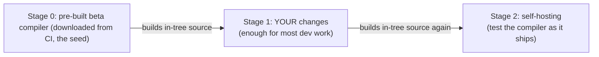
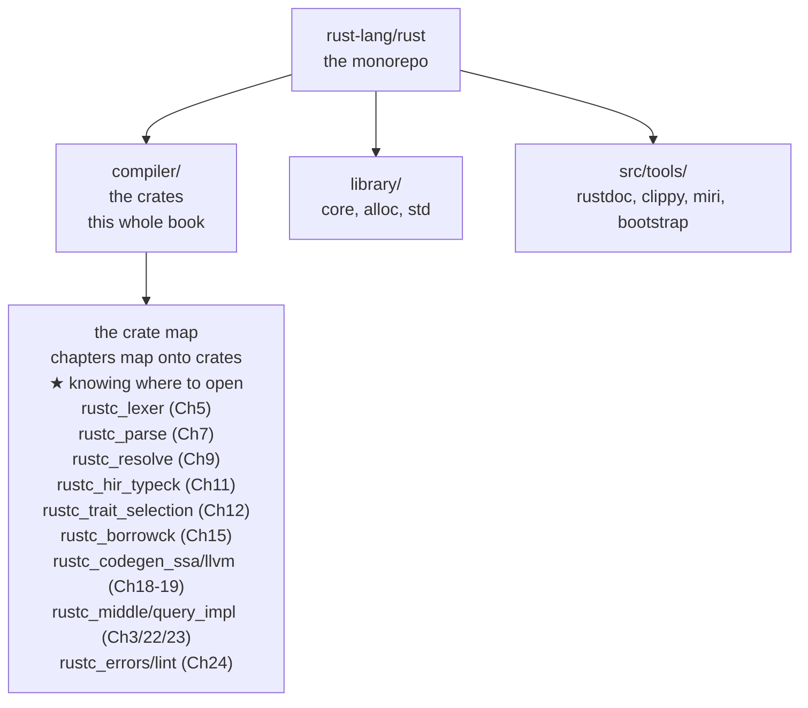
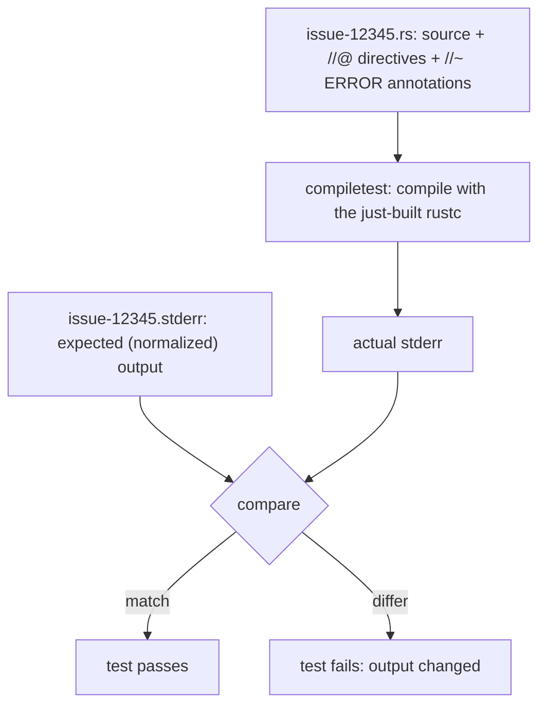
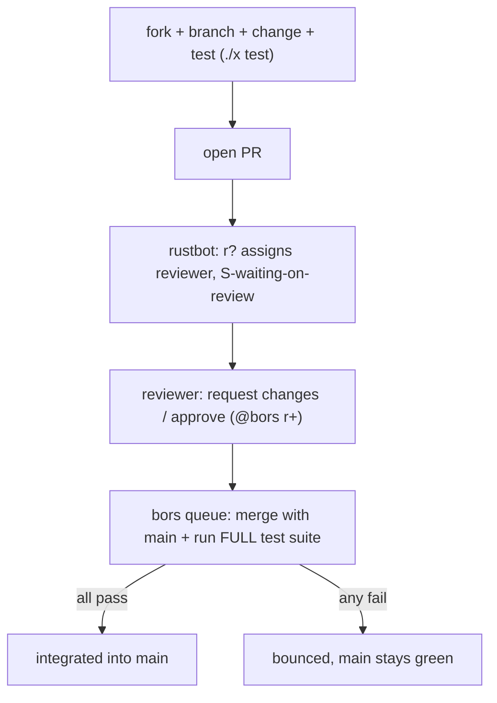
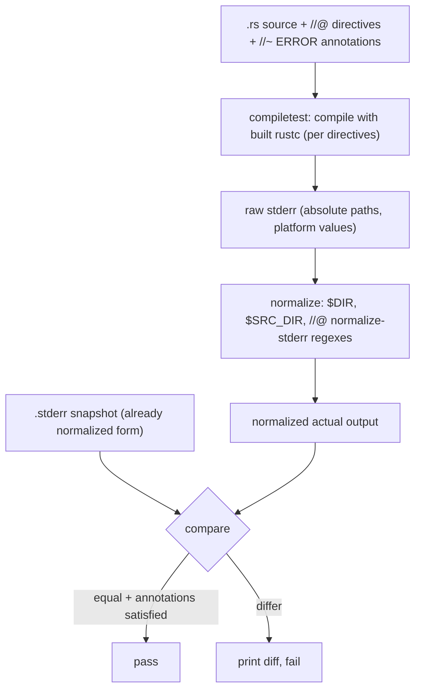
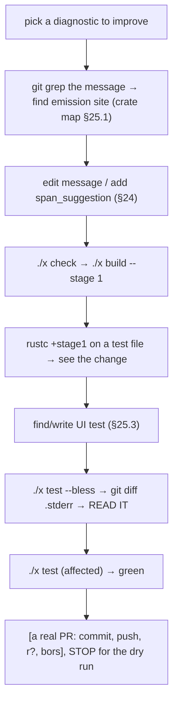

```admonish abstract title="What you'll learn"
- Why building `rustc` is **bootstrapping**: stage 0 (downloaded beta) builds stage 1 (your changes), which builds stage 2 (self-hosting), and why most compiler work needs only stage 1.
- The daily `./x` commands (`./x setup`, `./x check`, `./x build --stage 1`, `./x test`) and the `bootstrap.toml` accelerator `download-ci-llvm = true` that keeps your edit-build-test loop in minutes.
- How `compiletest` runs the `tests/ui`, `tests/codegen-llvm`, `tests/mir-opt`, `tests/incremental`, `tests/run-make`, and `tests/debuginfo` suites, and what each suite is the right shape for.
- The anatomy of a UI test: `//@` directives, `//~ ERROR` annotations, the `.stderr` snapshot of `HumanEmitter` output, and the `--bless` loop that regenerates snapshots when you change diagnostics intentionally.
- The fork → PR → `rustbot` `r?` → `@bors r+` → [bors](../glossary.md#bors) merge-queue pipeline that keeps `main` green, and why [`E-mentor`](../glossary.md#e-mentor) / `E-needs-test` issues are the right first targets.
- How to dry-run a real contribution: `git grep` the message, edit the emission site (e.g. `BuiltinWhileTrue` in `rustc_lint/src/lints.rs`), build stage 1, write or bless a UI test, and read the resulting `.stderr` diff.
```

## 25.1 Setting Up to Hack on `rustc`

### From reading to building

Every chapter of this book ended with a lab that rebuilt a piece of the compiler in miniature. This final part makes the move those labs were rehearsing: from *understanding* `rustc` to *changing the real thing*, ending in Chapter 26 by walking one `E-mentor` contribution end to end: clone, change, test, open a PR, take review. The compiler you have studied is an open-source project, `rust-lang/rust` on GitHub, that accepts contributions from anyone, an open-source project of millions of lines, organized along the phase boundaries this book has traced. This section is the practical on-ramp: getting the source, the build system, the stage model, and the realities of building a compiler that takes a while to build. The conceptual work is done; this is logistics, but logistics that, without the preceding 24 chapters, would be bewildering.

### The source, and the guide

`rustc` lives in `rust-lang/rust`, a monorepo you clone with `git`. Its top-level layout maps directly onto this book: `compiler/` holds the compiler crates (`rustc_lexer`, `rustc_parse`, `rustc_middle`, and the rest, more below), `library/` holds the standard library (`core`, `alloc`, `std`), and `src/tools/` holds the surrounding tooling (rustdoc, Clippy, Miri, the build system itself). The book's main companion is the `rustc-dev-guide` (`rustc-dev-guide.rust-lang.org`): the official guide to how `rustc` works and how to contribute, which this book has cited throughout. Where this book teaches the *architecture and the why*, the dev-guide is the *current, authoritative how*, and because the compiler changes constantly, you check the dev-guide for the exact commands and current state. Read them together: this book to understand, the dev-guide to act.

### The bootstrapping problem

Here is the chicken-and-egg at the heart of building `rustc`: the Rust compiler is *written in Rust*. To build it, you need a Rust compiler, but that is the thing you are building. The resolution is **bootstrapping**: you start from a *pre-built* compiler (downloaded, not built by you) and use it to compile the in-tree source, producing a new compiler, which can then compile the source *again*. This is why building `rustc` is not `cargo build`: it is a multi-step process orchestrated by a dedicated build system, and the verified detail that even the build system has this problem (its main logic is in Rust, so a small `bootstrap.py` downloads a prebuilt compiler to first build the build system) shows how deep the recursion goes.

### `x.py` and `./x setup`

The build is driven by the verified entry script: `x` (or `x.py`/`x.ps1`), which lives at the repo root and drives the build system in `src/bootstrap`. You almost never invoke `cargo` directly; you run `./x <subcommand>`. `./x setup` creates `bootstrap.toml` (renamed from the older `config.toml` in 2024) from a profile; pick `compiler` (the dev-guide enumerates the others). The profile sets defaults (under `src/bootstrap/defaults/`) so you do not hand-edit dozens of options. With a `bootstrap.toml` in place, you can build.

### The stage model

The most important concept, and the one that confuses every newcomer, is **stages**. Bootstrapping produces a sequence of compilers, each built by the previous one (verified):

- **Stage 0**: a **pre-built beta compiler**, downloaded from Rust's CI. You did not build it; it is the seed. (Location: `build/<host>/stage0/`.)
- **Stage 1**: the compiler built **by stage 0 from your in-tree source**. *This contains your changes.* For most development, stage 1 is enough: if you edited `rustc_borrowck`, the stage-1 compiler has your edit, and you can test it. (The dev-guide's building section frames stage 1 as enough for most compiler edits.)
- **Stage 2**: the compiler built **by stage 1** (the "self-hosting" stage). Because stage 1 contains your changes, stage 2 is a compiler *built by a compiler containing your changes*, a fuller, more representative build, needed when you must test the compiler the way it will actually ship.

The verified mental model: stage 0 builds stage 1 (your changes), stage 1 builds stage 2 (self-hosting). The reason for the dance is correctness: a compiler should be able to compile itself, and stage 2 proves the stage-1 compiler (with your changes) can build a working compiler.




### The commands you actually run

In daily work, three commands cover most needs (verified):

- `./x check`: type-check the compiler *without* fully building it. Fast (no codegen), and the right tool for "does my refactor compile?", renaming a method, changing a signature. The verified advice: use `./x check` for type-based refactoring; it is *much* faster than a build.
- `./x build --stage 1`: build the stage-1 compiler (with your changes). The go-to for "build a compiler I can run."
- `./x build --stage 2`: the fuller build, for when stage 1 is not enough (testing compiler changes properly).

Once built, you make the new compiler usable as a `rustup` toolchain (verified): `rustup toolchain link stage1 build/<host>/stage1`, then `cargo +stage1 build` in any project runs *your* compiler.

### The time and space reality: and how to cheat

Building `rustc` honestly is *slow* and *large*: the disk requirement can reach tens to a hundred-plus gigabytes (beyond stage 1, dev-guide has current numbers), and a from-scratch build compiles **LLVM** (§19), a multi-hour C++ build by itself. The first build is a coffee-and-then-some affair. But you rarely pay full price, because the build system has accelerators; the load-bearing one for most readers is `download-ci-llvm = true` in `bootstrap.toml`, which downloads a prebuilt LLVM from CI instead of building it, removing the biggest time sink for anyone not touching the LLVM backend. Others exist (`download-rustc`, `--keep-stage`, `./x check`) and the dev-guide's "suggested workflows" page covers them. The realistic first-time advice: pick the `compiler` profile, enable `download-ci-llvm`, build stage 1, and link it, and your edit-build-test loop on the compiler becomes minutes, not hours.

```admonish tip title="Pro-Tip, the loop that makes rustc development bearable"
`./x check` plus a stage-1 build with `download-ci-llvm` is the loop that makes `rustc` development bearable; do not build stage 2 or LLVM unless you must. The single biggest mistake newcomers make is building more than they need: a from-scratch stage-2 build with LLVM compiled from source, watching it churn for an hour, and concluding `rustc` development is impractical. It is not, if you use the right loop. For the overwhelming majority of compiler work (fixing a diagnostic, adjusting a [lint](../glossary.md#lint), tweaking [borrow-check](../glossary.md#borrow-checker) logic, improving an error message, exactly the §26 capstone targets), your loop is: `./x check` while iterating on "does it compile," then `./x build --stage 1` (with `download-ci-llvm = true` so you never build LLVM) to get a runnable compiler with your change, then run it on a test. Stage 2 and from-source LLVM are for specific situations (testing the shipped compiler, working on the LLVM backend itself) you will rarely hit early on. The difference is dramatic: the wrong loop is hours; the right loop is minutes. Set `download-ci-llvm = true` in your `bootstrap.toml` on day one, default to `./x check` and `--stage 1`, and treat any build that compiles LLVM as a signal you configured something wrong. The dev-guide's "suggested workflows" page has more such accelerators (per-crate `opt-level = 0` to speed incremental rebuilds of the crate you are editing, for instance). Read it before your first serious session.
```

```admonish warning title="Warning, stage confusion is the #1 source of my change isnt showing up"
Know which compiler you are actually running. The stage model is powerful but a notorious footgun: a huge fraction of newcomer confusion is "I edited the compiler, rebuilt, ran it, and my change didn't take effect." Almost always the cause is *running the wrong stage*. If you build stage 1 but invoke the stage-0 (downloaded) compiler, or link `stage1` but run `cargo build` (which uses your *default* toolchain, not your linked one), you are running a compiler *without* your change. The discipline: after building, link the stage explicitly (`rustup toolchain link stage1 build/<host>/stage1`) and invoke it explicitly (`cargo +stage1 ...` or `rustc +stage1 ...`), and when in doubt, add a `eprintln!("MY CHANGE RAN")` to the code path you edited and confirm you see it, if you do not, you are running the wrong binary, not failing to change behavior. A related trap: `--keep-stage` skips rebuilds based on *your* assertion that a stage is unchanged, so if you used it after actually changing that stage, you will run stale code and chase a phantom. The mental check before every "why didn't my change work" debugging session: *which compiler did I just run, and was it built from my edited source?* Confirm the binary before debugging the behavior. Most of the time the behavior is fine and the binary was wrong.
```

### The crate map: where everything you learned lives

The `compiler/` crates map onto the chapters of this book as follows:

`rustc_lexer` (Ch. 5) → `rustc_parse` / `rustc_ast` (Ch. 7) → `rustc_expand` (Ch. 8) → `rustc_resolve` (Ch. 9) → `rustc_hir` / `rustc_ast_lowering` (Ch. 10) → `rustc_hir_typeck` / `rustc_infer` (Ch. 11) → `rustc_trait_selection` / [`rustc_next_trait_solver`](../glossary.md#trait-solver) (Ch. 12) → `rustc_mir_build` (Ch. 13 and 14) → `rustc_borrowck` (Ch. 15) → `rustc_mir_transform` (Ch. 16) → `rustc_monomorphize` (Ch. 17) → `rustc_codegen_ssa` / `rustc_codegen_llvm` (Ch. 18 and 19) → `rustc_codegen_cranelift` (Ch. 20) → and threaded throughout, `rustc_middle` (the [`TyCtxt`](../glossary.md#tyctxt-tcx) and [queries](../glossary.md#query), Ch. 3), `rustc_query_impl` (Ch. 22 and 23, the merged successor of the older `rustc_query_system`), `rustc_errors` / `rustc_lint` (Ch. 24), `rustc_span` (Ch. 6). When an issue says "the borrow checker accepts this invalid program," you open `rustc_borrowck`.




### Where this leaves us

Hacking on `rustc` starts with cloning `rust-lang/rust` (the monorepo: `compiler/`, `library/`, `src/tools/`) and pairing this book's *architecture* with the `rustc-dev-guide`'s *current commands*. Because the compiler is written in Rust, building it is **bootstrapping**: `./x setup` (choose the `compiler` profile) creates `bootstrap.toml`, and the `x` build system produces a stage sequence: **stage 0** (downloaded beta seed) builds **stage 1** (your changes, enough for most work), which builds **stage 2** (self-hosting, for testing the compiler as shipped). Daily commands are `./x check` (fast type-check for refactors), `./x build --stage 1` (a runnable compiler with your change), and `--stage 2` when needed; link it with `rustup toolchain link`. A full build is slow (~100 GB, compiles LLVM), so set `download-ci-llvm` and use `--stage 1` / `./x check` to keep the loop in minutes, and watch out for **stage confusion**, the top cause of "my change didn't show up." And the `compiler/` crate map is legible *because* you studied what each crate does.

§25.2 takes the architecture deep-dive of the contribution *process*: the test infrastructure (`compiletest`, the UI tests that check exact compiler output, `./x test`, and `--bless` to update expected output), finding a first issue (the `E-easy` / `E-mentor` GitHub labels, the triage system), and the workflow that gets a change merged (the fork-and-PR model, the `r?` reviewer assignment, and **bors**, the merge bot that tests every PR before integration). Then §25.3 reads a real UI test and its expected-output file, and §25.4 has you do a complete dry-run contribution against a local checkout (find, change, test, bless), the full loop without the wait for review.

## 25.2 The Architecture: Tests, Issues, and the Contribution Workflow

### How a change becomes part of Rust

§25.1 got you a building compiler. This section is everything between "I have an idea" and "it ships in Rust": how `rustc` is *tested* (the suites, UI tests, and the `--bless` loop), how you *find* something to work on (the issue-triage system), and how a change actually *merges* (the fork-PR-review-bors pipeline). That pipeline integrates changes from thousands of contributors into a multi-million-line codebase without ever breaking `main`.

### `compiletest` and the test suites

`rustc`'s tests are run by a bespoke runner called `compiletest` (verified), which lives in `src/tools/compiletest` and drives the tests in the verified `tests/` directory. `compiletest` tests the compiler by running it: it compiles each test file with the just-built `rustc` and checks what happens (did it compile, did it error, what exactly did it print) because the unit under test is a binary whose externally-observable behavior (exit status and rendered diagnostics) is what must be pinned. compiletest organizes tests into suites by mode (UI for stderr snapshots, plus `mir-opt`, `codegen`, `incremental`, `run-make`, and others, walked below). The UI suite is where almost every diagnostic and error-message test lives (§24).

You run them with `./x test <path>`, e.g. `./x test tests/ui` for the whole UI suite, or `./x test tests/ui/issues/issue-12345.rs` for one test, or `--test-args <pattern>` to filter (verified).

### Anatomy of a UI test

The UI test is the workhorse, and understanding it is most of understanding `rustc` testing. A UI test is a `.rs` source file plus a `.stderr` snapshot of the compiler's expected output, sitting side by side. The verified pieces:

- **`//@` directives** control *how* the test is compiled and what is expected: `//@ run-pass`, `//@ compile-flags: -Z...`, `//@ edition: 2024`, `//@ check-pass`, and many more. By default a UI test is expected to *fail* compilation (most test compiler errors); a directive flips that.
- **`//~ ERROR` annotations** mark, inline next to the offending line, that an error (or `//~ WARNING`, `//~ NOTE`) is expected *there*: `//~ ERROR cannot find value` on the line that triggers it. This ties the diagnostic to its exact source location, so a regression that moves or drops the error is caught.
- **The `.stderr` snapshot** records the compiler's *entire* expected diagnostic output. `compiletest` compiles the test and compares the actual stderr against this file; any difference fails the test. The output is **normalized** (verified) to ignore irrelevant variation: absolute paths, line numbers in some contexts, platform differences, so the snapshot is stable across machines.

So a UI test asserts two things at once: the *inline* annotations (an error of this kind occurs at this line) and the *snapshot* (the full rendered output looks exactly like this). Together they pin down both the *semantics* and the *presentation* of a diagnostic, which is why UI tests are the natural home for the §24 work of making errors good.




### `--bless`: the diagnostic-work loop

Here is the loop that makes diagnostic and lint work (§24) tractable. When you *intentionally* change the compiler's output (improve an error message, add a suggestion, adjust a lint), every UI test whose `.stderr` snapshot now differs will *fail*, because the recorded output no longer matches. You do not hand-edit dozens of `.stderr` files. Instead you pass the verified `--bless` flag: `./x test tests/ui --bless` re-runs the tests and *regenerates* the `.stderr` (and `.stdout`/`.fixed`) snapshots to match the new output. Then, crucially, you *inspect the diff*: `git diff` shows you exactly how every affected message changed, and you read it to confirm the new output is what you intended (and only what you intended). The verified workflow: "if you have changed the compiler's output intentionally, or you are making a new test, you can pass `--bless`." This is the §24 feedback loop in practice: change the diagnostic code, bless, read the diff, confirm every message improved and none regressed. Blessing without reading the diff is the most common way regressions slip through; see the blind-bless warning at the end of this section.

### Other suites: what they test, in what shape

UI is the workhorse, but `compiletest` runs several other suites under `tests/` whose shape is genuinely different. Knowing the *shape* tells you, when reading a PR that touches §16 or §19, what kind of test it should include.

- **`tests/codegen-llvm/`**, the [LLVM IR](../glossary.md#llvm-ir) suite (the older `tests/codegen/` was renamed when the gcc and Cranelift backend tests were factored out). Tests embed `// CHECK:` patterns (LLVM's FileCheck syntax) directly in the `.rs` source; `compiletest` compiles with `--emit=llvm-ir` and runs FileCheck against the result. This is how §19 changes (intrinsic lowering, alloca placement, attribute setting) prove they emit what they claim.
- **`tests/assembly-llvm/`**, the same FileCheck idiom applied to generated assembly (renamed from `tests/assembly/` alongside the codegen rename). Used for target-specific codegen: `#[target_feature]`, intrinsics that must lower to a specific instruction, ABI corners.
- **`tests/mir-opt/`**, the optimization-diff suite. The test source is paired with a `.mir` snapshot captured *before* and *after* a specific pass, blessed like a UI test. This is §16's regression-proofing: when ConstProp or simplification changes, the diff in the `.mir` shows exactly what got better (or worse).
- **`tests/incremental/`**, query-reuse verification (§22). A test declares `//@ revisions: rpass1 rpass2`, supplies two source variants gated by `#[cfg(rpass1)]`/`#[cfg(rpass2)]`, and asserts which queries should be marked **green** (reused) versus **red** (re-run) across the edit. The direct cross-check for "did we accidentally invalidate too much?".
- **`tests/run-make/`**, multi-step scenarios that cannot be expressed as one `.rs`: custom linkers, dylib loading, embedded LLVM bitcode, cross-crate metadata. Each test is a directory with a Rust driver, `rmake.rs` (the suite migrated from `Makefile`s to `rmake.rs` drivers over 2023 and 2024).
- **`tests/debuginfo/`**, the gdb/lldb suite. Drives an actual debugger against a compiled binary and checks its output, the only suite that exercises debug-info emission end to end.

Two things are *not* `compiletest`:

- **Per-crate unit tests** in `compiler/*/src/.../tests.rs` (the lexer's character-class tables, parser helpers, span arithmetic) run with plain `cargo test`. They are a small minority of `rustc`'s test count, but the right shape for table-driven logic where compiling a `.rs` file would be overkill.
- **`./x test tidy`**, the source-level lint in `src/tools/tidy` that enforces house rules: no `unwrap()` in certain crates, license headers present, no overlong lines, no stray `dbg!`. It runs as part of CI and is the most common reason a small PR bounces before review even starts.

The mental model: pick a suite by *what kind of output you want to pin*. Diagnostic? UI. Generated machine code? `codegen-llvm` or `assembly-llvm`. A specific transformation? `mir-opt`. Query reuse? `incremental`. The rustc-dev-guide's compiletest reference enumerates every directive each suite accepts.

### Finding a first issue

`rust-lang/rust` uses GitHub labels to make the enormous issue tracker navigable for newcomers (verified ecosystem practice). The ones to look for:

- **`E-easy`**: issues believed to be approachable, small in scope.
- **`E-mentor`**: issues where a contributor has volunteered to *mentor* you through it, often with `E-mentor` instructions written right in the issue explaining where the relevant code is and what to change. These are gold for a first contribution.
- **`E-help-wanted`** / **`E-needs-test`**: wanted work, including issues that just need a regression test written (an excellent first PR: no compiler change, just a UI test).

Combined with `A-*` area labels (`A-diagnostics`, `A-borrow-checker`, `A-lints`) and `T-*` team labels, you can filter to "easy diagnostics issues with a mentor." And here is where this book pays off directly: when an `E-mentor` issue says "the error for X is confusing, it should suggest Y," *you already know* that lives in `rustc_errors`/`rustc_lint` or the relevant phase crate (§25.1's map): you can find the code because you understand the architecture. The Rust **Zulip** (the project's chat) has streams like `#t-compiler/help` where you can ask questions about compiler internals.

### The contribution workflow: fork, PR, review, bors

Once you have a change, the path to merge is a well-defined pipeline (verified):

1. **Fork and branch.** Fork `rust-lang/rust`, create a branch, make your change, add or update tests (a UI test for a diagnostic change, etc.), and run `./x test` on the relevant suite locally.
2. **Open a PR.** Push and open a pull request. The bot `rustbot` automatically assigns a reviewer via the verified `r?` mechanism (it picks someone, or you request a specific reviewer or team with `r? rust-lang/diagnostics`), and labels the PR `S-waiting-on-review`.
3. **Review.** The reviewer reads your change, requests modifications, and eventually approves it with the verified `@bors r+` command. Review can take iterations; responding to feedback is normal.
4. **bors merges it.** The verified integration bot **bors** is the key to Rust's "the `main` branch is never broken" guarantee. bors does *not* merge approved PRs directly; it puts them in a **queue**, and for each, *merges it with the current `main`, runs the full test suite, and only integrates it if everything passes*. If tests fail, the PR is bounced back, `main` untouched. Because the full suite is slow, bors batches small approved PRs into **rollups** (bors marks rolled-up PRs with titles like "Rollup of N pull requests") tested together. This is why `main` stays green in practice: *nothing merges without passing CI against the exact state it will merge into.*




```admonish tip title="Pro-Tip, your first PR should be a regression test or an E-mentor diagnostic fix"
Not an ambitious feature; the workflow rewards small, well-tested, focused changes. The contribution pipeline, especially bors and review, is optimized for *small, verifiable* changes, and that shapes what makes a good first contribution. A regression test for an `E-needs-test` issue is the ideal starter: you write a UI test reproducing a fixed (or known) bug, `--bless` its output, and submit: *zero* compiler-logic risk, you learn the test infrastructure and the full workflow, and reviewers can approve it quickly. The next rung is an `E-mentor` diagnostic improvement: the mentor has often told you *where* the code is (and you can confirm with this book's crate map), the change is localized (a better message, a new suggestion), the test is a UI test you bless, and the blast radius is small. Avoid, as a first PR, anything touching type inference, the trait solver, or borrow-check *logic*: these have enormous test surfaces, subtle correctness implications, and long review cycles. The pattern that gets merged fast: one focused change, the right test updated/added, a clear PR description linking the issue, and responsiveness to review. Rust's reviewers are volunteers; a small, complete, well-tested PR respects their time and gets merged; a sprawling one stalls. Start small not because you cannot do more, but because the workflow *teaches you the workflow* best on something small, and a merged one-line diagnostic fix is a real contribution.
```

```admonish warning title="Warning, never --bless without reading the resulting diff"
A blind bless can silently enshrine a regression as the new expected output. The `--bless` flag is indispensable but dangerous, because it makes the *current* compiler output the *expected* output by definition, so if your change accidentally made a message *worse*, blessing records the worse message as correct, the test passes, and the regression sails through. `--bless` does not check that the output is *good*; it checks nothing: it just overwrites the snapshots with whatever the compiler now produces. The discipline is absolute: after `./x test --bless`, run `git diff` on the `.stderr` files and *read every change*, asking "is each modified message actually better, and are these the only messages that changed?" A change to a widely-used diagnostic can ripple into hundreds of `.stderr` files (every test that happened to trigger that message), and buried in those hundreds might be one where your change made things worse, or one you did not expect to touch at all (a sign your change was less localized than you thought). Reviewers scrutinize blessed diffs precisely because a blind bless is the easy way to merge a regression. The rule: `--bless` regenerates, *you* verify, the flag does the mechanical work, but judging whether the new output is correct is yours alone, and skipping that judgment is how "improvements" ship as regressions. Treat a large blessed diff as a prompt to slow down and read, not a chore to rubber-stamp.
```

### How this builds, and what is next

The contribution process is as engineered as the compiler. Tests run via `compiletest`, which compiles each test with your built compiler and checks the result across suites: `ui` (exact stderr/stdout, the home of diagnostic tests), plus `run-pass`/`run-fail`, `mir-opt` (§16), `codegen` (§19), `incremental` (§22), and `run-make`. A **UI test** pairs a `.rs` (with `//@` directives and `//~ ERROR` annotations) against a normalized `.stderr` snapshot, pinning both a diagnostic's semantics and its presentation; `--bless` regenerates those snapshots when you change output intentionally, and *you read the diff* to confirm the change is right. You find work via GitHub labels (`E-easy`, `E-mentor`, `E-needs-test`) and area/team labels, and the book's architecture knowledge tells you which crate the issue lives in. A change merges through **fork → PR → `rustbot` `r?` reviewer → `@bors r+` → bors**, where the **bors** queue merges-and-tests every PR against `main` (in rollups for small ones), guaranteeing `main` never breaks. Start with a regression test or a mentored diagnostic fix; never bless blindly.

§25.3 reads a real UI test end to end, a `.rs` with its directives and annotations beside its `.stderr` snapshot, and a slice of `compiletest`'s comparison logic, making the test loop concrete. Then §25.4 has you do a full dry-run contribution on a local checkout: find a diagnostic, change it, write/update a UI test, `--bless`, read the diff, and run the suite: the entire loop short of opening the PR, so your first *real* PR is muscle memory.

## 25.3 Reading the Source: A UI Test and the Test Runner

### A test you can read

§25.2 described the UI test; this section reads a real one, end to end (the `.rs` source with its directives and annotations, beside the `.stderr` snapshot it is checked against), and then a slice of `compiletest`'s comparison logic. The thing to see: a UI test is a **golden/snapshot test of the compiler's output**, the `.stderr` file is literally the §24 `HumanEmitter`'s rendering captured to disk, and the whole apparatus exists to make the diagnostics of Chapter 24 *regression-proof*.

### The test source: `.rs` with directives and annotations

Here is the shape of a UI test (synthetic, but faithful to the form): a borrow-check error of the kind that fills `tests/ui/borrowck/`. No edition directive is needed because the rule fires in every edition; UI tests omit directives they do not need.

```rust
// tests/ui/borrowck/borrow-imm-as-mut.rs (illustrative)

struct Point { x: i32, y: i32 }

fn main() {
    let z = Point { x: 1, y: 2 };
    let _ = &mut z.x; //~ ERROR cannot borrow `z.x` as mutable
}
```

Read the two kinds of special comment (§25.2):

- **`//@` directives**, when present, control compilation: `//@ edition: 2024` pins an edition, `//@ check-pass` says the test should compile cleanly, `//@ compile-flags: -Z...` passes extra flags, `//@ run-pass`/`//@ run-fail` switch the test into compile-and-run modes, and many more are catalogued in the rustc-dev-guide's compiletest reference. The structural point is that one directive shapes one aspect of compilation; this test needs none because by default a UI test is expected to *fail* compilation (most test compiler errors), which is what we want.
- The **`//~ ERROR` annotation** on the `&mut z.x` line asserts that an error whose message contains "cannot borrow `z.x` as mutable" is emitted *on that line*. Variant forms (`//~^` to point at the line above, `//~|` to continue onto the same line) are documented in the dev-guide. These inline annotations cross-check the *semantics*: an error of the right kind appears at the right place.

### The snapshot: the `.stderr` file

Beside `borrow-imm-as-mut.rs` sits `borrow-imm-as-mut.stderr`, capturing the compiler's rendered output (faithful in shape; the exact wording is what the current `rustc` prints for this case, verifiable with one run on any installed toolchain):

```text
error[E0596]: cannot borrow `z.x` as mutable, as `z` is not declared as mutable
  --> $DIR/borrow-imm-as-mut.rs:7:13
   |
LL |     let _ = &mut z.x;
   |             ^^^^^^^^ cannot borrow as mutable
   |
help: consider changing this to be mutable
   |
LL |     let mut z = Point { x: 1, y: 2 };
   |         +++

error: aborting due to 1 previous error

For more information about this error, try `rustc --explain E0596`.
```

Every element here is the §24 `HumanEmitter` output, captured to disk: the **error code** `E0596` (the canonical "cannot borrow as mutable" code, §24.1), the message, the `-->` location line, the source line with `^^^` carets under the offending span (§24.2, the [`Span`](../glossary.md#span) resolved through the `SourceMap`), the `help:` suggestion with its `+++` insertion diff (§24.3's `span_suggestion`), and the `--explain` footer. The `.stderr` file *is* the diagnostic engine's rendering, captured. When you improve this error in `rustc_borrowck`/`rustc_errors` (§24), *this file* is what changes, and `--bless` (§25.2) regenerates it.

Note the two non-literal placeholders: `$DIR` replaces the test directory's absolute path (`/home/you/rust/tests/ui/borrowck/...`), which differs on every machine; `LL` replaces the actual source line numbers (so the snapshot stays valid when the test source is reordered or has lines added or removed above the diagnostic). Both are part of compiletest's **normalization** (triggered by the verified `-Zui-testing` flag the runner passes to `rustc`), and they are the first two of several normalizations.

### Normalization: making the snapshot portable

If the snapshot recorded the compiler's *raw* output, it would fail on every machine but the author's (different paths) and every platform (different pointer widths, type layouts). So `compiletest` **normalizes** both the actual output and the expected file before comparing (verified). Built-in normalizations replace machine- and platform-specific text with placeholders: the verified `$DIR` for the test directory, `LL` for source line numbers (under `-Zui-testing`), and others like `$SRC_DIR` for the standard-library source root and `$TEST_BUILD_DIR` for the test's build directory. For platform-dependent values like alignment or pointer width, the mechanism is per-test directives (`//@ normalize-stderr-32bit` / `-64bit`, or `//@ stderr-per-bitwidth`). And a test can declare its *own* general normalization with the verified directive:

```text
//@ normalize-stderr: "REGEX" -> "REPLACEMENT"
```

which replaces every match of `REGEX` in the stderr with `REPLACEMENT` (the verified replacement may use `$1` backreferences). This is how a test that prints, say, a varying hash or a temp path stabilizes its output: normalize the varying part to a fixed placeholder. The verified rule: *normalization is what lets one `.stderr` snapshot pass on every machine and platform*, and a missing `.stderr` file means the expected output is *empty* (verified), so a test that should produce no stderr simply has no snapshot.




### The runner: compile, normalize, compare, diff

Now `compiletest`'s UI-test pipeline, in teaching shape (the real code is spread across `TestCx` methods in `src/tools/compiletest/src/runtest.rs` plus the per-mode submodule `runtest/ui.rs`; the entry is `TestCx::run_revision` dispatching on `self.config.mode`):

```rust
// compiletest UI pipeline, conceptually (teaching shape)
// real entry: TestCx::run_revision() → TestMode::Ui => self.run_ui_test()
fn run_ui_test(test: &TestPaths, built_rustc: &Path, config: &Config) -> TestResult {
    // 1. parse //@ directives and compile with the just-built compiler
    //    real: TestProps::from_file(&test.file, revision, config)
    //          + self.compile_test(will_execute, emit) via make_compile_args + compose_and_run
    let props = TestProps::from_file(&test.file, None, config);
    let proc_res = compile_test(built_rustc, &test.file, &props);

    // 2. check //~ ERROR / //~^ / //~| annotations against rustc's JSON diagnostics
    //    real: self.check_expected_errors(&proc_res); internally calls load_errors(...)
    //    and json::parse_output(...) and does fuzzy unmatched/unexpected reporting
    let expected_errors = load_errors(&test.file, None);
    check_expected_errors(&expected_errors, &proc_res)?;

    // 3. normalize the actual stderr (built-in placeholders + //@ normalize-stderr rules)
    //    real: TestCx::normalize_output(&raw, &normalization_rules)
    let actual = normalize_output(&proc_res.stderr, &config.builtin_rules, &props.normalize_stderr);

    // 4. compare to the .stderr snapshot (missing file ⇒ expected empty)
    let expected = read_to_string(test.stderr_path()).unwrap_or_default();
    if actual != expected {
        if config.bless {
            write(test.stderr_path(), &actual); // --bless: rewrite the snapshot
        } else {
            print_diff(&expected, &actual); // real: write_diff from compute_diff
            return TestResult::Failed;
        }
    }
    TestResult::Passed
}
```

Trace the four steps. **(1)** It compiles the test with *your* built compiler (§25.1), applying the `//@` directives. **(2)** It checks the `//~` annotations: each expected error must appear, of the right level, at the right line; an unexpected error, or a missing expected one, fails the test (this is the *semantic* check). **(3)** It **normalizes** the raw stderr (paths → `$DIR`, etc.). **(4)** It compares the normalized actual output to the `.stderr` snapshot; on mismatch it either **rewrites** the snapshot (under `--bless`) or **prints a diff and fails**. The verified diff output shows the normalized expected vs. actual line by line (and notes when a line was normalized before comparison), so when a test fails, you see *exactly* which characters of the rendered diagnostic changed.

```admonish tip title="Pro-Tip, read a UI tests .stderr failure diff as how did my change alter the rendered diagnostic"
Use `//@ normalize-stderr` to stabilize genuinely-varying output rather than disabling the check. When a UI test fails after your change, `compiletest`'s diff is the most useful artifact you have: it shows the exact before/after of the rendered diagnostic, line by line, post-normalization. Read it as a direct answer to "what did my change do to what users see." If the diff is the *improvement you intended* (a clearer message, a new suggestion line) on the tests you expected, `--bless` and move on. If it touches tests you did *not* expect, or shows a line getting worse, stop. Your change had a wider or different effect than you thought (§25.2's bless warning, made concrete here). And when a test's output genuinely varies for reasons unrelated to what you are testing (a pointer width, a hash, a temp path), the right fix is a targeted `//@ normalize-stderr: "REGEX" -> "$PLACEHOLDER"` that stabilizes *just* that varying fragment, not abandoning the snapshot or over-broad normalization that would hide real regressions. Good normalization is surgical: replace the one varying token, keep everything else exact, so the test still catches any *other* change. The skill of writing UI tests is largely the skill of normalizing precisely, enough to be portable, no more, so the snapshot remains a tight golden record of the diagnostic.
```

```admonish warning title="Warning, the annotation-completeness rule"
The `//~` annotations and the `.stderr` snapshot must agree, and adding a single `NOTE`/`HELP` annotation can suddenly require annotating *all* of them. A subtle `compiletest` rule trips many contributors: the inline `//~` annotations and the `.stderr` snapshot are *two* checks that must both pass, and they interact. For `ERROR`/`WARNING` the annotations assert the right diagnostics at the right lines; but there is a verified completeness behavior around `NOTE` and `HELP`, broadly: if you annotate *any* note/help with `//~`, the test framework may then expect *all* notes/helps of that level to be annotated, so adding one `//~ NOTE` can cause the test to fail demanding annotations for notes you did not mark. The general rule (verified from the testing philosophy): annotations and snapshot must be *consistent*, and partial annotation of a level can flip the framework into requiring completeness for that level. The practical guidance: for most diagnostic tests, rely on the `.stderr` snapshot for the full presentation and use `//~ ERROR` sparingly to pin the *key* errors to their lines; do not scatter `//~ NOTE`/`//~ HELP` unless you intend to annotate them exhaustively. And after editing annotations, *always* re-run the test (not just `--bless` the snapshot) so the annotation checker runs, because `--bless` updates the *snapshot* but the `//~` annotation mismatch is a *separate* failure that blessing does not fix. The two halves of a UI test fail independently; a green snapshot with broken annotations still fails, and the fix for each is different (edit annotations vs. bless snapshot). Knowing which half is complaining saves real confusion.
```

### How this builds, and what is next

A UI test is a **golden test of compiler output**, and reading one shows the whole §24 chapter frozen to disk. The `.rs` carries `//@` directives (`edition`, `run-pass`, `run-fail`, `check-pass`, `compile-flags`, `normalize-stderr`) that control compilation, and `//~` annotations (`ERROR`, the `//~^` point-up and `//~|` continuation forms) that pin expected diagnostics to their lines. The `.stderr` snapshot is the §24 `HumanEmitter`'s exact rendering (error code, `-->` location, `^^^` carets over `SourceMap`-resolved spans, `help:` suggestion diff, `--explain` footer) with **normalization** (`$DIR`, `$SRC_DIR`, custom `//@ normalize-stderr` regexes) replacing machine/platform-specific text so the snapshot is portable (a missing snapshot means expected-empty). `compiletest` **compiles** the test with your built compiler, **checks** the `//~` annotations, **normalizes** the stderr, and **compares** to the snapshot, printing a normalized diff and failing on mismatch, or rewriting the snapshot under `--bless`. The two checks (annotations and snapshot) fail independently.

§25.4 closes Chapter 25 with the capstone lab: a **full dry-run contribution** on a local `rust-lang/rust` checkout: find a real diagnostic, change its message or add a suggestion (in `rustc_errors`/`rustc_lint`/the relevant phase crate), build stage 1, write or update a UI test, `--bless` it, *read the diff*, and run the suite: the entire §25.2 loop short of opening the PR. Plus the Chapter 25 retrospective and the bridge to Chapter 26, the guided capstone where you take a real contribution all the way to a submitted PR.

## 25.4 Hands-On Lab: A Full Dry-Run Contribution

### A different kind of lab

Every previous lab built a miniature in pure `std`. This one is different: it is a **guided walkthrough of operating on the real compiler** (the actual `rust-lang/rust` checkout, the real `./x` commands, real file edits). Because building `rustc` needs the multi-gigabyte toolchain of §25.1 (not available in a sandbox), this lab is a *procedure to run on your own machine*, presented as the exact sequence of commands and edits. We will walk a complete contribution (find a diagnostic, improve it, build, test, `--bless`, read the diff) and stop one step short of opening the PR. By the end, your first *real* PR (Chapter 26) is muscle memory.

### Step 0, setup (recap of §25.1)

```bash
git clone https://github.com/rust-lang/rust.git
cd rust
./x setup # choose the compiler profile; say yes to the editor LSP config and pre-push tidy hook prompts (see dev-guide building/suggested.md)
```

Then ensure your `bootstrap.toml` has the §25.1 accelerator so you never build LLVM:

```toml
# bootstrap.toml
profile = "compiler"
[llvm]
download-ci-llvm = true
```

### Step 1, pick a target

The ideal dry-run target (and a great real first PR, §25.2) is **improving a diagnostic**: making a message clearer or adding a suggestion. Suppose we want to improve a lint's help text, or add a `span_suggestion` to an error that lacks one. We will use a concrete, representative example: improving the wording of a warn-by-default lint's message. The book's crate map (§25.1) tells us exactly where to look: lints live in `rustc_lint` (built-in) or are emitted from the relevant phase crate; errors live near their phase (`rustc_borrowck`, `rustc_hir_typeck`, …) with rendering in `rustc_errors`.

### Step 2, find the code

You rarely know the file offhand; you find it by searching for the *message text*. If the current message is "denote infinite loops with `loop`", grep the compiler source:

```bash
git grep -n "denote infinite loops"
# → compiler/rustc_lint/src/lints.rs # the BuiltinWhileTrue #[diag(...)] struct
# → compiler/rustc_lint/src/builtin.rs # WhileTrue::check_expr emits BuiltinWhileTrue { ... }
```

```admonish example title="What you should see" collapsible=true
`git grep` for the user-visible string lands you on the exact emission site, here an `EarlyLintPass` (§24.3) in `rustc_lint/src/builtin.rs`. (Some lint messages historically lived in Fluent `.ftl` files; in 1.95 they were inlined into `#[diag("...")]` attributes on the diagnostic struct, see `compiler/rustc_macros/src/diagnostics/message.rs::DiagMessage::Inline`.)
```

This is the §25.1 thesis in action: you understand the architecture, so a one-line `git grep` plus your mental crate map *is* your code-navigation tool.

### Step 3, make the change

Open the emission site and improve it. Two representative kinds of change (faithful shapes from §24.3):

Two representative kinds of change, both following the §24 structured-diagnostic shape the real `WHILE_TRUE` lint already uses:

```rust
// (a) improve the message wording: edit the #[diag(...)] text on the
//     BuiltinWhileTrue struct in compiler/rustc_lint/src/lints.rs:
-   #[diag(lint_builtin_while_true)]    // text: "denote infinite loops with `loop { ... }`"
+   #[diag("infinite loops are clearer as `loop {{ ... }}` than `while true`")]
    pub(crate) struct BuiltinWhileTrue {
        #[suggestion(style = "short", code = "loop", applicability = "machine-applicable")]
        pub suggestion: Span,
        pub replace: String,
    }

// (b) OR strengthen the suggestion (the higher-value change, §24.1):
//     add a #[suggestion_part(...)] field to BuiltinWhileTrue and populate it
//     in WhileTrue::check_expr in compiler/rustc_lint/src/builtin.rs.
//     The call site stays the same struct-decorator shape:
    cx.emit_span_lint(
        WHILE_TRUE,
        condition_span,
        BuiltinWhileTrue { suggestion: condition_span, replace },
    );
```

The closure-style `cx.span_lint(LINT, span, |diag| { ... })` API (`rustc_lint/src/context.rs:567`) is the other shape, used by lints whose diagnostic doesn't fit a static struct; `WHILE_TRUE` uses the struct path so we follow suit.

Keep the change *focused* (§25.2): one message, or one suggestion. A small, clear change is what gets merged.

### Step 4, build (just your change)

```bash
./x check compiler/rustc_lint   # narrow inner loop: only the crate you edited
./x build --stage 1             # runnable compiler with your change (download-ci-llvm avoids LLVM)
```

`./x check` is your inner loop while editing; `./x build --stage 1` produces the compiler you will actually run. With `download-ci-llvm`, this is minutes, not hours (§25.1). Narrowing `./x check` to the edited crate is the per-crate accelerator the dev-guide's `building/suggested.md` recommends; falling back to whole-tree `./x check` catches cross-crate impedance mismatches but is slower.

### Step 5, run it and see your change

Link the stage-1 compiler and run it on a tiny program that triggers the lint:

```bash
rustup toolchain link stage1 build/host/stage1 # (use your host triple's path)
```

```rust
// /tmp/t.rs
fn main() { while true { } }
```

```bash
rustc +stage1 /tmp/t.rs
# warning: infinite loops are clearer as `loop { ... }` than `while true`
#  --> /tmp/t.rs:1:13
#   | ...
#   = help: use `loop` instead: `loop`
```

```admonish example title="What you should see" collapsible=true
There is your change, running in a real compiler. (If you *don't* see it, you are running the wrong stage, §25.1's stage-confusion warning: confirm with `rustc +stage1 --version` and that you linked the right path. A quick `eprintln!` in the code path confirms which binary ran.)
```

### Step 6, the test

A compiler change without a test will not merge (§25.2). For an existing lint, the realistic path is to `git grep -l 'denote infinite loops' tests/` to find every snapshot that quotes the old message and re-bless them all; we walk the simpler write-a-fresh-test path here, but real `WHILE_TRUE` coverage at 1.95 lives in `tests/ui/lint/suggestions.rs` and `tests/ui/lint/lint-change-warnings.rs`, and a real PR would update those. Find the existing UI test for this lint, or write one. To find it:

```bash
git grep -l "while true" tests/ui/ # → tests/ui/lint/while-true.rs (or similar)
```

If it exists, your message change will make its `.stderr` snapshot stale (that is *expected*: your improvement changed the output). If no test covers your exact case, write one (§25.3):

```rust
// tests/ui/lint/while-true.rs
//@ check-pass

#![warn(while_true)]

fn main() {
    while true {} //~ WARNING infinite loops are clearer
}
```

(`//@ check-pass` because a warn-level lint does not fail compilation; the `//~ WARNING` pins the diagnostic to its line, §25.3.)

### Step 7, bless, and *read the diff*

Regenerate the snapshot to match your new output, then inspect it (§25.2, §25.3):

```bash
./x test tests/ui/lint/while-true.rs --bless
git diff tests/ui/lint/while-true.stderr
```

```diff
-warning: denote infinite loops with `loop { ... }`
+warning: infinite loops are clearer as `loop { ... }` than `while true`
   --> $DIR/while-true.rs:6:5
    |
 LL |     while true {}
    |     ^^^^^^^^^^
    |
+   = help: use `loop` instead: `loop`
```

```admonish example title="What you should see" collapsible=true
**Read this diff.** Confirm: (1) the message changed to *exactly* your improvement; (2) the new `help:` line appears (your suggestion); (3) *only* the tests you expected changed: `git status` shows which `.stderr` files were blessed, and if your change rippled into a test you did not anticipate, investigate before proceeding (§25.2's blind-bless warning). For a localized lint change, you should see one or a few affected tests; a sprawling diff means your change was less contained than you thought.
```

### Step 8, run the suite green

```bash
./x test tidy # source-level lint, CI runs this first, so do you
./x test tests/ui/lint/while-true.rs # the specific test: should now pass
./x test tests/ui --test-args while # the neighborhood: confirm nothing nearby broke
```

A green run on the affected tests means your change and its snapshot agree. (`tidy` enforces no-`unwrap()`-in-some-crates, license headers, line width; bouncing on tidy before review is the most common new-contributor failure mode, §25.2. A real PR triggers the *full* suite via bors, §25.2, but locally you run the relevant slice.)

### Step 9, what a PR would look like (and we stop)

At this point a real contribution would: commit with a clear message, push to your fork, and open a PR whose description links the issue and explains the change. `rustbot` would assign a reviewer via `r?` (§25.2), and after review and `@bors r+`, bors would test-and-merge it. **We stop here**: the dry run has taken you through the entire *technical* loop (find → change → build → run → test → bless → verify); only the social step (submitting and shepherding the PR) remains, and that is Chapter 26.




### Extension exercises

1. **Do it for real on an `E-mentor` issue.** Browse `rust-lang/rust` issues filtered to `E-mentor` + `A-diagnostics`, pick one whose mentor instructions point at the code, and run this exact loop, then (if you are ready) actually open the PR. Use this loop verbatim on the issue you pick.
2. **Add an error code and `--explain` text.** Take an error that has no code, assign one (`Exxxx`), and write its long-form explanation, touching the error-code registry and the `--explain` machinery (§24.1).
3. **Write a brand-new lint.** Add a small `LateLintPass` (§24.3) that flags a pattern you find worth warning about, register it in the `LintStore` (§24.2), give it a default level and a UI test. This is a complete, self-contained feature in miniature.
4. **Improve a real suggestion's applicability.** Find a diagnostic whose suggestion is `MaybeIncorrect` but could be `MachineApplicable` (or vice versa), and correct the label (a small, high-value change that improves `cargo fix` (§24.3)).
5. **Test the suggestion with `run-rustfix`.** Convert your `tests/ui/lint/while-true.rs` to `//@ run-rustfix` plus a sibling `while-true.fixed` file (with `while true {}` replaced by `loop {}`), then `--bless` both and confirm `compiletest` applies your `MachineApplicable` suggestion and the fixed source still compiles. Read `tests/ui/lint/suggestions.rs@59807616e1fa` as the canonical template, and `src/doc/rustc-dev-guide/src/tests/ui.md::run-rustfix@59807616e1fa` for the directive's contract. What you've learned: `MachineApplicable` is not a label, it is a contract that the `compiletest::runtest::ui::run_rustfix@59807616e1fa` path enforces by re-compiling the fixed source.
6. **Confirm the right stage with `rustc +stage1 -vV`.** Before running `/tmp/t.rs`, run `rustc +stage1 -vV` and check that the `release:` line ends in `-dev`; if it does not, your `rustup toolchain link` did not take, you are still running the downloaded toolchain, and your edit is not in the binary. Compare this against the `eprintln!` fallback in §25.1's stage-confusion warning, and note when the lightweight `-vV` check suffices versus when you need the heavyweight `eprintln!`. What you've learned: the dev-guide-prescribed sanity check at `src/doc/rustc-dev-guide/src/building/how-to-build-and-run.md::verifying-your-build@59807616e1fa` is one command, not a code edit.
7. **Route a diagnostics PR with `r? rust-lang/diagnostics`.** Draft the PR description you would post for the §25.4 change: a one-line summary, a link to the (imagined) issue, a note that you updated the affected `.stderr` snapshots, and a trailing `r? rust-lang/diagnostics` to assign a random member of the diagnostics team (the team form, listed in `triagebot.toml::adhoc_groups@59807616e1fa`, is the recommended idiom for `rustc_lint`/`rustc_errors` changes). Then write what you would type once the reviewer's comments are addressed: `@rustbot ready` to flip `S-waiting-on-author` back to `S-waiting-on-review`. What you've learned: the team-routing convention at `src/doc/rustc-dev-guide/src/contributing.md::assigning-reviewers@59807616e1fa` is the load-bearing line of any diagnostic PR's description.

### Where Chapter 25 leaves us

Chapter 25 is complete. §25.1 set up the environment: cloning `rust-lang/rust`, the bootstrapping build (`./x setup`, the stage model, `./x check`/`build --stage 1`, `download-ci-llvm`), and the crate map that makes the source legible. §25.2 covered the process: `compiletest` and its suites, UI tests and `--bless`, finding issues by label (`E-mentor`), and the fork → PR → `r?` → bors workflow that keeps `main` green. §25.3 read a real UI test (`//@` directives, `//~` annotations, the `.stderr` snapshot as captured `HumanEmitter` output, and normalization) plus `compiletest`'s compile-normalize-compare logic. And this lab walked the entire contribution loop on the real compiler, stopping one step short of the PR.

### The picture so far

Across Parts 0-4 you have learned how rustc works end-to-end; in Chapter 25 you cloned and built it. Chapter 26 sends one of your edits through the contribution workflow until it lands in nightly.

### Bridge to Chapter 26: the guided capstone

You can now *operate* on `rustc`: build it, find code, change it, test it, bless it. Chapter 26, **The Guided Capstone**, takes the final step: walking one complete `E-mentor` contribution through the open-source process end to end, using *everything* this book taught. We will pick a real, representative task (a diagnostic improvement or a small lint), and follow it through the full sequence: `E-mentor` issue, fix, test, PR, review, and the bors merge that closes the worked example, narrating the *judgment* at each step: how understanding the architecture (Parts 0 to 4) tells you where the code is and what the fix should be, how to scope the change so reviewers can say yes, how to write the test that proves it, how to respond to review, and what the bors merge actually does. Where Chapter 25 taught the *mechanics*, Chapter 26 integrates them into a single worked contribution: the capstone that turns a reader of the compiler into a contributor to it. You have built the skills; now you will use all of them at once.

## Test yourself

```admonish question title="Anchor the chapter"
Six quick questions on the key claims of Chapter 25. Answer first, then expand the explanation. Quizzes are not graded; they are a recall checkpoint between chapters.
```

{{#quiz ../../quizzes/ch25.toml}}

---

*End of Chapter 25. Next: Part 5 continues with Chapter 26, §26.1. The Guided Capstone: From Issue to Merge.*