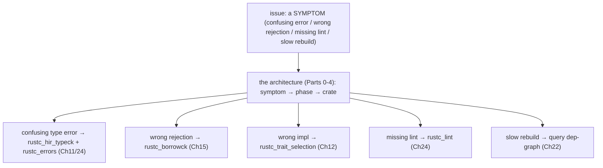
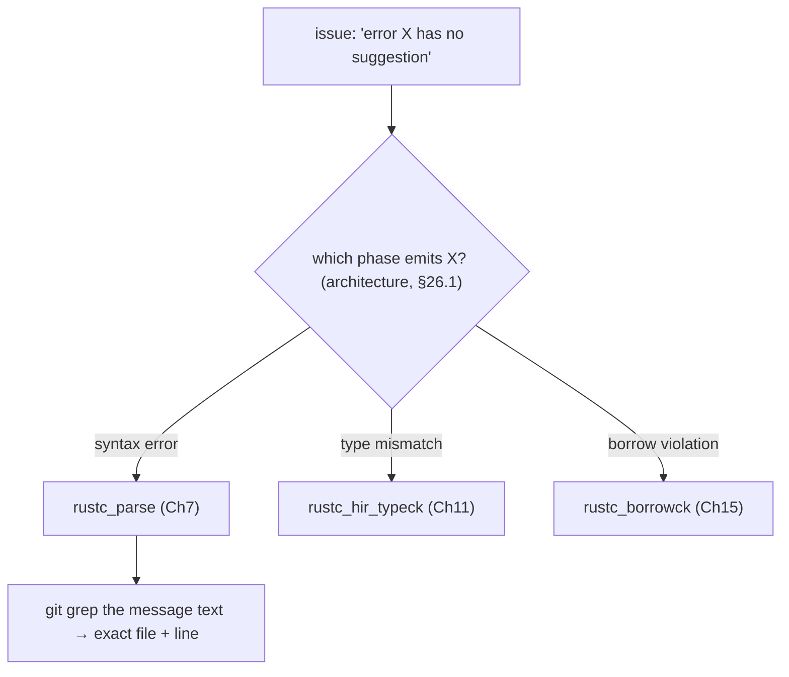
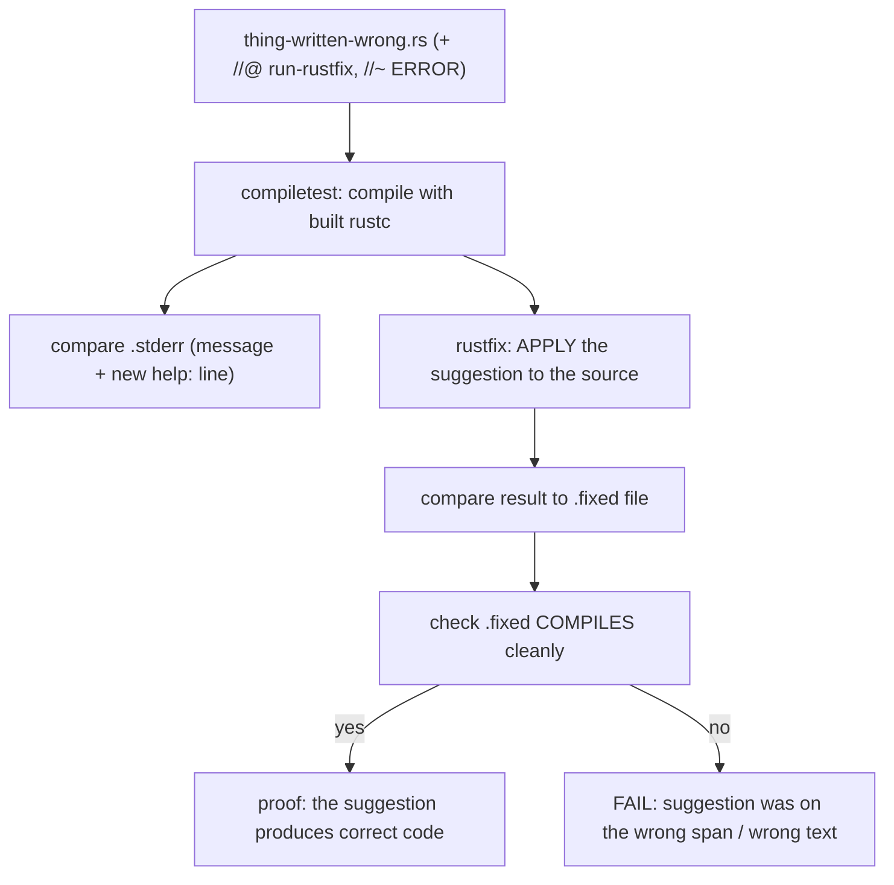
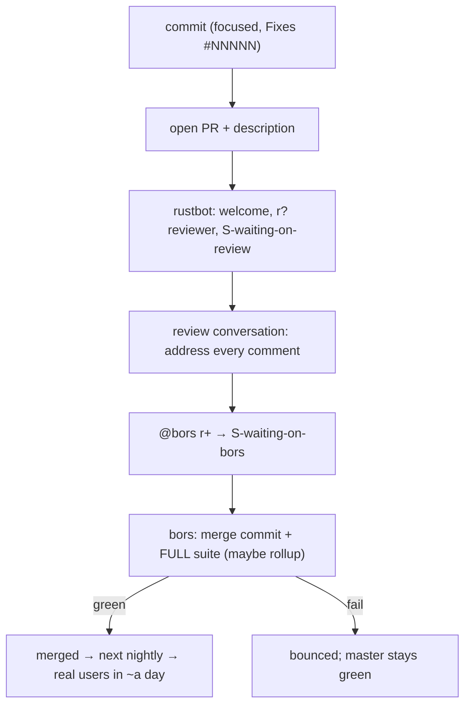

```admonish abstract title="What you'll learn"
- How to translate an issue's *symptom* (confusing type error, wrong [borrow-check](../glossary.md#borrow-checker) rejection, missing [lint](../glossary.md#lint), slow rebuild) into the exact `rustc` crate that emits it, using the architecture-as-map from Parts 0 to 4.
- The judgment behind a good first PR: scoping one reviewable change, deciding **lint vs. fixed error**, choosing whether to attach an **error code**, and the rule 'if you are not sure, just ask your reviewer.'
- How to locate a diagnostic with one `git grep` on its message text, recognize whether it uses the **builder** chain (`struct_span_err(...).span_suggestion(...).emit()`) or the **structured** `#[derive(Diagnostic)]` style (the `ReturnTypesUseThinArrow` shape in `rustc_parse`), and confirm the three ingredients a suggestion needs (a [`Span`](../glossary.md#span), replacement text built via `SourceMap::span_to_snippet`, and an honest `Applicability`).
- How to add a `MachineApplicable` `span_suggestion` (or `#[suggestion(...)]` attribute) and prove it with a `//@ run-rustfix` UI test whose `.fixed` file `compiletest` recompiles, plus the `./x fmt` + `./x test tidy` gates every PR must pass.
- How `rustbot`'s `r?` auto-assignment, the `S-waiting-on-review` / `S-waiting-on-author` labels, [`@bors r+`](../glossary.md#bors), and the bors merge queue carry your change from open PR into the next nightly within roughly a day.
- The retrospective shape of the whole book: how Parts 0 to 4 (prover-then-translator, [queries](../glossary.md#query), [arenas](../glossary.md#arena), lexing, parsing, macros, name resolution, [HIR](../glossary.md#hir), type/trait/[MIR](../glossary.md#mir), borrowck, [monomorphization](../glossary.md#monomorphization), codegen, linking, incremental, parallel, diagnostics) all feed the single capability Part 5 unlocks: changing `rustc` itself.
```

## 26.1 The Guided Capstone: From Issue to Merge

### The capstone

This is the final chapter, and it does what every chapter before it was preparing you for: it walks a *complete* contribution to `rustc` through the open-source process end to end, from an [`E-mentor`](../glossary.md#e-mentor) issue through the fix, the tests, the PR, and the review that lands the worked example. Chapter 25 taught the mechanics: building, testing, blessing, the bors pipeline. This chapter integrates them, and adds the thing mechanics alone do not give you: **judgment**. At each step the narration is not just *what* to do but *why*: how the architecture you learned in Parts 0 to 4 tells you where the code is, how to scope a change so a reviewer can say yes, how to choose between a lint and a hard error, how to read review feedback, and what the bors merge actually does to your work. §26.1 lays the conceptual foundation: how to *think* like a contributor; §26.2 locates and understands the code for our capstone task; §26.3 implements and tests it, reading real source; §26.4 carries it through submission and review, and closes the book.

### The architecture *is* the map

The hardest part of contributing to a multi-million-line compiler is not writing code: it is *knowing where the code is*. An issue arrives as a description of a *symptom* ("the error message for this case is confusing," "the borrow checker rejects this valid program," "there should be a lint for this pattern"), and the contributor's first job is to translate that symptom into a *location*. This translation is exactly what Parts 0 to 4 trained you to do:

- "The type error here is unclear" → the diagnostic is built in `rustc_hir_typeck` (Chapter 11) and rendered by `rustc_errors` (Chapter 24).
- "The borrow checker rejects valid code" → `rustc_borrowck` (Chapter 15), the [NLL](../glossary.md#nll) region inference.
- "Trait resolution picks the wrong impl" → `rustc_trait_selection` / the next-gen solver (Chapter 12).
- "There should be a warning for X" → a new lint (typically a `LateLintPass` over HIR, sometimes an `EarlyLintPass` over [AST](../glossary.md#ast)) in `rustc_lint` (Chapter 24).
- "The compiler is slow to rebuild after this edit" → the query [dependency graph](../glossary.md#depgraph) (Chapter 22).

Someone who has *not* studied the architecture sees an undifferentiated mass of code and a `git grep` that returns hundreds of hits. You see a *map*: the symptom names a phase, the phase names a crate, and you open that crate already understanding what it does and how its data flows. The whole book was navigation training, and this is where it pays off: the difference between "I don't know where to start" and "this is almost certainly in `rustc_borrowck`'s region inference, let me look."




### Choosing a good first contribution

Not all true things are good *first* contributions. The dev-guide's first-contribution page lists the friendliest categories: Clippy lints (self-contained `LateLintPass`es, Chapter 24, with a deliberately newcomer-oriented contribution process), diagnostic improvements (localized, high user value), regression tests for `E-needs-test` issues, and adopting abandoned PRs labelled `S-inactive` (label names current as of 2026; consult the dev-guide for live labels).

And the things to *avoid* as a first PR (Chapter 25's warning, restated as judgment): the [trait solver](../glossary.md#trait-solver), type inference, and borrow-check *logic*. Not because you cannot understand them, you studied them, but because changes there have enormous test surfaces, subtle soundness implications, and long review cycles. A first contribution should be *complete-able* and *reviewable*, and those areas are neither for a newcomer.

### The judgment of scoping

A core contributor skill after navigation is **scoping**: making a change that does *one* thing. A good PR is small enough that a volunteer reviewer can hold all of it in their head, has a clear and testable effect, and does not bundle unrelated changes. The reasons are social as much as technical: reviewers are volunteers (rustbot's standard greeting, words to the effect of "Thanks for the pull request, and welcome! ... you should hear from [a reviewer] soon" (configured in the external triagebot service, visible on any open rust-lang/rust PR), is a *person* committing their time), and a focused PR respects that time and merges fast, while a sprawling one stalls in review indefinitely. Scoping judgment means resisting the urge to fix five things you noticed along the way: note them, file issues, but keep *this* PR to one improvement with its one test. The capstone we will carry through this chapter is deliberately scoped this way: a single diagnostic improvement.

### A real decision: lint or hard error?

Contributing diagnostics surfaces a genuine design judgment the verified dev-guide addresses directly: should a new diagnostic be a **lint** (user-controllable level: `allow`/`warn`/`deny`, Chapter 24) or a **"fixed" error** the user cannot silence? The verified guidance: lints are for things the user might legitimately want to turn off; fixed errors are for genuine violations, the verified example being borrow-checker errors, which "are fixed errors. The user cannot adjust the level of these diagnostics to silence the borrow checker." A related verified decision: whether to give an error an **error code** with a `--explain` write-up, the rule being "give an error a code (with an associated explanation) if the explanation would give more information than the error itself," and otherwise just put the information in the message. These are not mechanical choices; they are judgment, and the verified advice for all of them is the same and worth internalizing: *"if you are not sure, just ask your reviewer."* Asking is not weakness; it is how the project works.

### The process and its culture

The path a contribution travels (Chapter 25's pipeline) has one feature worth understanding as *judgment*: **review is a conversation**. The reviewer may request changes, ask questions, or push back on the approach; responding thoughtfully is the work. For larger changes the project has an FCP and crater-run process (consult the dev-guide for the current variant); for ours, bors will run the full suite on the merge commit and merge to nightly. Your change ships to real users within a day.

The infrastructure reflects this: the mentor labels, the Clippy on-ramp, the Zulip help streams, the "just ask your reviewer." You are not expected to know everything; you are expected to be willing to learn and to engage.

```admonish tip title="Pro-Tip, scope a change to the size of your own understanding"
A useful self-test before committing to a contribution: can you (a) describe the entire change in one or two sentences, (b) name the single crate and roughly the function it touches, and (c) predict what the UI test diff will look like *before* you run `--bless`? If yes to all three, you understand the change well enough to do it well and defend it in review. If no (if the change sprawls across crates, or you are not sure what the output will become), that is a signal to either narrow the scope until you *can* answer, or to study the area more first (or pick a `E-mentor` issue where someone will guide you). This test is why diagnostic improvements make ideal capstones: a message change is one sentence ('clarify the error when X by suggesting Y'), one location (the emission site you `git grep`'d), and a predictable diff (the old message becomes the new one in a handful of `.stderr` files). The skill it builds, scoping a change to the size of your own understanding, is the master contributor skill, and it scales: experienced contributors take on bigger changes precisely because their 'head-sized' unit is bigger, but the discipline of staying within it never changes. Start where your understanding is complete, and grow the boundary outward; never reach past it into a change you cannot fully reason about, because that is where unreviewed bugs and stalled PRs come from.
```

```admonish warning title="Warning, keep message changes and behavior changes in separate PRs"
A trap that catches eager first contributors: while improving a diagnostic, you notice the *underlying logic* could also be 'fixed' (the error fires in a case you think it shouldn't, or could fire in a case it misses), and you change that too. Now your 'diagnostic improvement' PR also alters *what programs compile*, which is a completely different and far higher review bar: changing whether code is accepted or rejected can affect soundness, can break existing crates (triggering a crater run), and may need team sign-off (an FCP), turning a fast message-wording merge into a long design discussion, often stalling both the wording fix and the logic change. Keep them separate. If you are improving *how* an error is presented (wording, span, suggestion), that is a diagnostics PR with a low bar and a UI-test diff. If you think the error fires *wrongly* (a logic bug: a false positive or false negative), that is a *separate* PR touching the phase's analysis (borrowck, typeck), needing its own reasoning about correctness and probably its own discussion. The discipline is to notice the distinction in your own change: 'am I changing what the compiler *says*, or what it *does*?' Those are different contributions with different risks, and a clean PR does exactly one of them. When you catch yourself reaching from the message into the logic, stop, finish the message PR, and file the logic concern as its own issue: your reviewer (and your merge time) will thank you, and the soundness question gets the careful separate attention it deserves rather than riding along on a wording change.
```

### The capstone task

For the worked contribution we carry through §26.2 to §26.4, we take a **diagnostic improvement**: the friendliest high-value category, and the one the whole book has equipped you for. Concretely: a diagnostic that fires correctly but presents poorly (a clear message but no actionable suggestion, say), which we will improve by adding a structured, machine-applicable suggestion (Chapter 24), so that `cargo fix` can apply the fix automatically. It is one change, in one crate, with a predictable test diff: the ideal capstone. §26.2 locates the code (using the architecture-as-map), reads the surrounding diagnostic-construction logic, and forms a precise plan. §26.3 implements the suggestion and writes the UI test, reading the real `rustc_errors` APIs. §26.4 carries it through the full submission (commit, PR, review, bors) and then steps back to close the book.

### Where this leaves us

The capstone integrates everything. Its foundation is **judgment**: the architecture of Parts 0 to 4 is a *map* that turns an issue's symptom into a code location (confusing type error → `rustc_hir_typeck`/`rustc_errors`; wrong rejection → `rustc_borrowck`; missing lint → `rustc_lint`); a good first contribution is **scoped to one reviewable thing** (a Clippy lint, a diagnostic improvement, a regression test: *not* trait-solver or borrowck logic); diagnostics carry real design choices (**lint vs. fixed error**, whether to add an **error code**, and "if unsure, ask your reviewer"); and the process is a **welcoming, volunteer-driven conversation** (review, occasionally FCP and crater runs, then bors merging to nightly). The master skill is scoping a change to the size of your own understanding, and never reaching past it, especially never letting a *message* change smuggle in a *behavior* change. Our capstone is a single diagnostic improvement: add a machine-applicable suggestion to an error that lacks one.

§26.2 begins the work: using the architecture-as-map to locate the diagnostic in the source, reading the construction logic around it, and forming the precise plan for the change.

## 26.2 Locating and Understanding the Code

### The plan for this section

Our capstone (§26.1) is a diagnostic improvement: an error that fires correctly but lacks an actionable suggestion, which we improve by adding a machine-applicable one so `cargo fix` can apply it. Before writing a line, do what a good contributor always does first: *locate and understand*. The judgment runs from the issue's symptom to the crate (using the architecture-as-map), to the exact emission site, to understanding the surrounding code well enough to form a precise, small plan. Writing comes in §26.3; understanding comes first.

### Step 1, from symptom to crate

The issue reads, in effect: *"the error for [some mistake] prints a clear message but offers no suggestion; it should suggest the fix, so `cargo fix` can apply it."* The first judgment (§26.1) is *which phase emits this error*. We reason from the architecture: if the mistake is a *syntax* error (a malformed construct the parser rejects), it is emitted in `rustc_parse` (Chapter 7); if it is a *type* mismatch, `rustc_hir_typeck` (Chapter 11); if a *borrow* violation, `rustc_borrowck` (Chapter 15). The symptom names the phase. For a concrete, representative example, take the verified real diagnostic for writing a return type wrong: the parser error *"return types are denoted using `->`"* (emitted when someone writes a function signature with the wrong arrow-like syntax). That is a *parse* error, so it lives in `rustc_parse`.

We confirm with `git grep` on the message text (§25.4):

```bash
git grep -n "return types are denoted" compiler/
# → compiler/rustc_parse/src/errors.rs:NNNN:  #[diag("return types are denoted using `->`")]
#   (the diagnostic struct; the emit site is in `parser/ty.rs::parse_ret_ty`,
#    grep for the struct name `ReturnTypesUseThinArrow` to land there.)
```

The architecture turned a one-line symptom into a single file. That is the §26.1 thesis at work: you did not search blindly; you *predicted* the crate and confirmed with one command.




### Step 2, reading the emission site

Diagnostics come in two styles (§24.2): the builder chain and the `#[derive(Diagnostic)]` struct (with inline message text in the attributes at 1.95.0; the Fluent infrastructure exists but `compiler/` ships no `.ftl` bundles). Match the local file's style; the change differs slightly between them. See the dev-guide diagnostics chapter for the full shapes. Builder-style spine (illustrative; in current rustc the return-arrow diagnostic is actually emitted via the structured form below):

```rust
// builder style (illustrative shape: same API for any builder-style diagnostic)
self.struct_span_err(span, "return types are denoted using `->`")
    .span_suggestion_short(span, "use `->` instead", "->",
                           Applicability::MachineApplicable).emit();
```

And the structured form that current `rustc_parse` actually uses for this case (in `parser/ty.rs::parse_ret_ty`):

```rust
// rustc_parse::parser::ty  (faithful, current emission)
self.dcx().emit_err(ReturnTypesUseThinArrow {
    span: self.prev_token.span,
    suggestion: lo.between(self.token.span),
});
// ReturnTypesUseThinArrow is a #[derive(Diagnostic)] struct in `crate::errors`;
// message text + suggestion label are literal string arguments inside the
// `#[diag(...)]` / `#[suggestion(...)]` macro attributes; see
// `compiler/rustc_parse/src/errors.rs::ReturnTypesUseThinArrow` for the real
// shape. (Fluent translation infrastructure exists but no `.ftl` bundles ship
// in `compiler/` at 1.95.0; see dev-guide `diagnostics/translation.md` for
// the in-progress design.)
```

This diagnostic already has a suggestion; we are reading it to learn the pattern. Our capstone targets one that does not. Read the actual emission site to see which style the target uses, and read a *neighboring* diagnostic that already has a suggestion to copy the established local pattern.

### Step 3, understanding the context

A suggestion needs three things (§24.1), and you confirm each is available at the emission site:

1. **A span to apply the fix to.** The suggestion replaces the code at some `Span` (Chapter 6). At our site, `self.prev_token.span` is the span of the offending token, exactly where the fix goes. For a diagnostic *lacking* a suggestion, you check: is the relevant span in scope here? Usually yes (the diagnostic already points at it for the primary message); occasionally you must thread it through.
2. **The replacement text.** What should the code become? For a fixed replacement (like `"->"`) it is a literal. For a fix that depends on the user's code, you build it from the source via the verified `span_to_snippet`: `sess.source_map().span_to_snippet(sp)` returns the original text (Chapter 6's `SourceMap`), which you transform into the suggestion (the verified dev-guide example: `format!("qux {}", snippet)`). The verified caution: `span_to_snippet` can *fail* (macro-generated spans have no snippet), so the idiom is to offer a concrete suggestion when it succeeds and fall back to a plain `span_help` message when it does not.
3. **The right `Applicability`** (§24.3). If the fix is *always* correct, `MachineApplicable` (so `cargo fix` applies it). If it is a guess, `MaybeIncorrect`. If it has holes, `HasPlaceholders`. This is the §26.1 judgment: *be honest*; over-claiming `MachineApplicable` breaks `cargo fix`.

You read the surrounding code to confirm: the span is available, you can produce the replacement (literal or via snippet), and you can justify the applicability.

### Step 4, the precise plan

Now you can state the change in one sentence (the §26.1 self-test): *"add a machine-applicable `span_suggestion` to the [name] diagnostic in `rustc_parse`, proposing [the fix] at [the span], so `cargo fix` can apply it."* Concretely, for the builder style, the plan is to insert one method call into the chain:

```rust
 self.struct_span_err(span, "….")
+    .span_suggestion(
+        span,
+        "….", // the help text (literal label string)
+        replacement, // literal, or built via span_to_snippet
+        Applicability::MachineApplicable,
+    )
     .emit();
```

For the structured style, the plan is to add a `#[suggestion("…", code = "…", applicability = "machine-applicable")]` to the span field, with the suggestion's label as the first positional argument inside the attribute (no separate Fluent line is needed; `compiler/` at 1.95.0 carries no `.ftl` bundles). Either way: **one** addition, no behavior change (§26.1's warning: we change what the compiler *says*, not what it *does*), and a predictable test diff (a new `help:` line in the affected `.stderr` snapshots). That predictability is the sign (§26.1) we understand the change well enough to make it.

### Step 5, verify understanding before writing

Two final checks before §26.3, both pure judgment:

- **Is this the right *kind* of diagnostic?** (§26.1) Our target is a hard error with a suggestion, fine; we are not changing its level. If the task had been "warn about X," we would be adding a *lint* (Chapter 24), a different shape. Confirm you are working in the right framework.
- **Does a neighbor show the blessed pattern?** Compiler crates have strong local conventions. Before writing, read two or three nearby diagnostics that already carry suggestions (our `"->"` example is one) and *match their style*: same method (the `span_suggestion` family has variants for inline vs separate display: `span_suggestion`, `span_suggestion_short`, `span_suggestion_verbose`, `span_suggestion_hidden`, `multipart_suggestion`, `tool_only_span_suggestion`; pick the one neighbors use), same Applicability conventions, same structured-vs-builder choice. Matching local style is what makes a PR look like it belongs and sail through review; inventing your own makes a reviewer ask you to redo it.

```admonish tip title="Pro-Tip, find the precedent and copy it"
An effective technique for contributing to a large, mature codebase is *pattern-matching against existing code*, and `rustc` rewards it heavily. Almost any small change you want to make (add a suggestion, add a lint, add an error variant, add a note) has been done dozens of times already, somewhere nearby, by people who knew the conventions. So before writing novel code, `git grep` for the *mechanism* (`span_suggestion`, `multipart_suggestion`, `#[suggestion(`) and read several real uses; you will discover the idiomatic method to call, the typical Applicability, how the message is phrased, whether it is builder or structured, and the local error-handling idioms (like the `span_to_snippet`-might-fail fallback). Then your change is 'the same thing those twenty diagnostics do, applied here': which is exactly what a reviewer wants to see, because it is consistent, tested-by-precedent, and obviously correct. This is not cargo-culting; it is respecting that a mature codebase encodes thousands of decisions in its existing patterns, and that matching them is usually *more* correct than reasoning from scratch (you would likely rediscover the same pattern, with more bugs). Newcomers waste time inventing what already exists three files over. The skill is to assume the codebase already solved your problem nearby, it usually has, and to find that solution before writing your own. The architecture knowledge from this book tells you *where* to look for the precedent; the precedent tells you *how* to write the change.
```

```admonish warning title="Warning, verify the suggestion span before you ship it"
The most common way a well-intentioned suggestion goes wrong is a *span mismatch*: attaching the replacement to a span that does not cover exactly the text you mean to replace. Because a `MachineApplicable` suggestion is applied *mechanically* by `cargo fix` (it splices your replacement into the span's byte range, §24.3), if the span is off by a token (too wide, eating adjacent code, too narrow, leaving a fragment, or pointing at the wrong location entirely), the auto-applied fix produces broken or wrong source, and the user's trust in `cargo fix` is damaged. Spans (Chapter 6) are precise byte ranges, and the span that is convenient at the emission site (the one the primary error points at) is not always the exact span your *replacement* should cover. Before finalizing, confirm: does this span's text, replaced by my replacement, yield correct code? Mentally (or in a test) apply the edit: take the span's snippet via `span_to_snippet`, replace it with your suggestion, and check the result compiles and means what you intend. If the span covers `while true` and you suggest `loop`, good; if it covers `while true {` and you suggest `loop`, you have eaten the brace. This is why testing the suggestion (not just the message) matters, and why §26.3 will write a UI test that exercises the `.fixed` output: a suggestion is *executable*, and an executable suggestion on the wrong span is worse than no suggestion at all: it actively breaks code while claiming to fix it. Get the span exactly right, and verify by applying it.
```

### Where this leaves us

Locating and understanding came before writing. The **architecture-as-map** (§26.1) turned the issue's symptom into a phase (syntax → `rustc_parse`, type → `rustc_hir_typeck`, borrow → `rustc_borrowck`), and `git grep` on the message text turned the phase into the exact file. At the **emission site** we recognized the diagnostic *style* (the **builder** chain (`struct_span_err(...).span_suggestion(...).emit()`) or the **structured** `#[derive(Diagnostic)]` struct with a Fluent message) because adding a suggestion differs between them. We confirmed the three ingredients a suggestion needs are at hand: a **span** (Chapter 6) to apply the fix to, the **replacement** text (a literal, or built from `span_to_snippet` with a fallback if it fails), and the honest `Applicability` (`MachineApplicable` only if always correct). The **plan** is one addition, a `.span_suggestion(...)` call or a `#[suggestion(...)]` field, with no behavior change and a predictable test diff. And we verified by checking the diagnostic *kind* (error vs lint) and by copying the **established local pattern** from a neighboring diagnostic. The master moves: find the precedent and match it; get the suggestion's span exactly right.

§26.3 implements the change (adding the suggestion in the real `rustc_errors` API following the local pattern) and writes the UI test that proves it, exercising not just the message but the `.fixed` output that confirms the suggestion produces correct code.

## 26.3 Implementing and Testing the Change

### Now we write it

The plan from §26.2 is settled: add one machine-applicable suggestion, no behavior change. Implementing it carries a twist worth the whole chapter. Because a suggestion is *code that gets applied*, its test is special. We do not just check the message; we check that applying the suggestion produces *correct, compiling source*. That is what makes a suggestion test different from any other UI test, and getting it right is the §26.2 span-correctness warning, made concrete and verified.

### Step 1, implement the suggestion

Following §26.2's plan and the neighboring pattern, we add the suggestion. For the **builder style**, it is one method call inserted into the chain:

```rust
// rustc_parse (or wherever the diagnostic lives): the change
 self.struct_span_err(span, "this thing is written wrong")
+    .span_suggestion(
// the Chapter 6 span the fix replaces (§26.2)
+        span,
+        "write it like this instead", // the help text
+        "the_correct_form", // the replacement
// §24.3: honest, this fix is always correct
+        Applicability::MachineApplicable,
+    )
     .emit();
```

When the replacement depends on the user's own code, we build it from the source (§26.2) via the verified `span_to_snippet`, with the verified fallback when it fails:

```rust
// replacement built from the user's code, with the macro-span fallback
if let Ok(snippet) = self.sess.source_map().span_to_snippet(inner_span) {
    err.span_suggestion(
        span,
        "write it like this instead",
        format!("correct_form({snippet})"), // transform the user's text
        Applicability::MachineApplicable,
    );
} else {
    // span_to_snippet failed (e.g. macro-generated): degrade to a help message, no concrete code
    err.span_help(span, "write it like this instead");
}
```

For the **structured style** (§26.2), the change is instead a `#[suggestion(...)]` attribute on the span field carrying the suggestion's label as its first positional argument:

```rust
 #[derive(Diagnostic)]
 #[diag("this thing is written wrong")]
 struct ThingWrong {
     #[primary_span]
+    #[suggestion("write it like this instead", code = "the_correct_form", applicability = "machine-applicable")]
     span: Span,
 }
```

One addition, matching the local style: exactly the §26.2 plan.

### Step 2, build and see it

```bash
./x check && ./x build --stage 1 # §25.1: fast, no LLVM with download-ci-llvm
rustc +stage1 /tmp/trigger.rs # a file that triggers the diagnostic
```

````admonish example title="Expected output" collapsible=true
```text
error: this thing is written wrong
 --> /tmp/trigger.rs:2:5
  |
2 |     <the wrong code>
  |     ^^^^^^^^^^^^^^^^
  |
help: write it like this instead
  |
2 |     the_correct_form
  |     ~~~~~~~~~~~~~~~~
```

The `help:` line is new: your suggestion, rendered by the §24.2 `AnnotateSnippetEmitter`. The diagnostic now teaches the fix, not just names the problem.
````

### Step 3, the test that proves the suggestion *works*

A message test (§25.3) would check the `.stderr`. But our change adds a *suggestion*, and a suggestion is **executable**: `cargo fix` will splice the replacement into the span (§24.3). So the right test does not just check the message; it checks that *applying the suggestion yields correct code*. The verified mechanism is the `//@ run-rustfix` directive:

```rust
// tests/ui/parser/thing-written-wrong.rs
//@ run-rustfix

fn main() {
    <the wrong code> //~ ERROR this thing is written wrong
}
```

`compiletest` supports a `//@ run-rustfix` directive that applies the suggestion and verifies the resulting `.fixed` file compiles, the gold-standard proof a machine-applicable suggestion is safe. The test ends up with up to three artifacts: the source `.rs`, the rendered `.stderr` (§25.3), and the post-apply `.fixed` that `compiletest` recompiles. See the dev-guide UI-tests page for the full directive list (including `rustfix-only-machine-applicable` for mixed-confidence tests, confirmed in `runtest/ui.rs`'s `Filter::MachineApplicableOnly` branch).




### Step 4, bless, and read *both* diffs

```bash
./x test tests/ui/parser/thing-written-wrong.rs --bless
git status # which snapshots changed?
git diff tests/ui/parser/thing-written-wrong.stderr # the message + help line
git diff tests/ui/parser/thing-written-wrong.fixed # the APPLIED suggestion
```

`--bless` regenerates both `.stderr` and `.fixed` (see the dev-guide UI-tests page for the full `--bless` semantics); read both, the `.fixed` is your span-correctness proof. If the `.fixed` looks wrong (a brace eaten, a fragment left), the span was wrong: fix it, rebuild, re-bless, until the `.fixed` is correct code. A correct `.fixed` that compiles is your evidence the suggestion is safe to ship to `cargo fix`.

### Step 5, run green, and tidy

```bash
./x test tests/ui/parser/thing-written-wrong.rs # should pass: .stderr matches, .fixed compiles
./x test tests/ui --test-args parser # neighborhood: nothing nearby broke
```

Then the often-forgotten step that gates every PR: **formatting and tidy**. The project enforces style mechanically, and a PR that fails it bounces in CI before review even starts:

```bash
./x fmt # format your code to the project style (rustfmt)
./x test tidy # the "tidy" lint: license headers, line length, no stray whitespace, etc.
```

`./x test tidy` is the verified in-tree style/consistency checker; running it locally before pushing saves a CI round-trip. With code formatted, tidy passing, the test green, and both diffs verified, the change is *complete*: every technical box checked.

```admonish tip title="Pro-Tip, run-rustfix is the gold standard for a suggestion PR"
When you add a `MachineApplicable` suggestion, the most convincing thing you can do, for yourself and your reviewer, is add a `//@ run-rustfix` test, because it converts the question 'is this suggestion correct?' from a judgment call into a *checked fact*: the `.fixed` file is the suggestion applied, and compiletest verifies it compiles. This is strictly stronger than a `.stderr` test, which only checks the message *looks* right; `run-rustfix` checks the fix *is* right by executing it. The discipline pays off twice: it catches your own span/replacement bugs immediately (a wrong span makes the `.fixed` fail to compile, surfacing §26.2's hazard before review), and it gives the reviewer a `.fixed` diff they can read as 'here is exactly what `cargo fix` will do to user code,' which is precisely what they need to approve a machine-applicable suggestion with confidence. The verified coverage check, compiletest flagging machine-applicable suggestions that *lack* a `run-rustfix` test, tells you the project considers this mandatory practice, not optional polish. So the rule for suggestion PRs: if it is `MachineApplicable`, it gets a `run-rustfix` test with a `.fixed` file, full stop. The `.fixed` file is the difference between 'I think this fix is right' and 'the test proves this fix compiles', and the latter is what ships safely to millions of `cargo fix` invocations.
```

```admonish warning title="Warning, pass the robots before you ask a person to look"
It is genuinely easy to do excellent compiler work and then have the PR bounce on a trivial style violation (a line too long, a missing license header, mis-sorted imports, trailing whitespace, unformatted code) because `rust-lang/rust` enforces these mechanically via `tidy` and `rustfmt` in CI, *before* a human reviews anything. The cost is real: a tidy failure means a CI run (minutes), a force-push, another CI run, and a reviewer who now sees a PR that failed basic checks: a small but real ding on the impression your contribution makes. The fix is a thirty-second habit: `./x fmt` to auto-format and `./x test tidy` to run the in-tree checker, *locally, before every push*. Many contributors wire this into a pre-push git hook so it is impossible to forget. The deeper point is about respecting the project's mechanical gates: CI exists to catch the boring stuff so humans can focus on the substantive stuff, and arriving at review having already passed all the mechanical checks is what lets the reviewer engage with your actual change instead of asking you to fix whitespace. A clean PR (formatted, tidy-passing, tests green, diffs verified) is one a reviewer can say yes to quickly; a PR red with mechanical failures stalls and signals that the human checks may need extra scrutiny too. Pass the robots' checks before you ask a person to look; it is the single cheapest way to make a good impression and a fast merge.
```

### Where this leaves us

The change is implemented and proven. We **added** the suggestion following §26.2's plan and the local pattern: a `.span_suggestion(span, msg, replacement, MachineApplicable)` call (builder style) or a `#[suggestion(code=…, applicability="machine-applicable")]` field plus Fluent line (structured style), building the replacement from `span_to_snippet` with a `span_help` fallback when needed. We **built** stage 1 and ran it to see the new `help:` line. Crucially, we **tested** it with a verified `//@ run-rustfix` UI test, which makes `compiletest` *apply* the suggestion and check the resulting `.fixed` file *compiles*: proving the suggestion produces correct code, not just the right message (with `//@ rustfix-only-machine-applicable` for mixed-confidence cases). We **blessed** both the `.stderr` (message) and `.fixed` (applied result), **read both diffs** (the `.fixed` being the span-correctness proof), ran the suite **green**, and passed `./x fmt` and `./x test tidy`. A suggestion test is special because the suggestion is executable: the `.fixed` file is the fix proven against real code. The change is technically complete; only submission remains.

§26.4 carries it the final distance: committing with a clear message, opening the PR, navigating `rustbot`'s reviewer assignment and the review conversation, responding to feedback, and watching `@bors r+` and the bors merge land your change in the next nightly, and then we close the book.

## 26.4 Submitting, Review, and the End of the Road

### The last mile

The change is written, tested, and tidy (§26.3). What remains is committing, opening the PR, the review conversation, and the bors merge: four steps, and then the book closes.

### Step 1, commit

A good commit is *focused* (§26.1) and *explains itself*. The message says what changed and why, in the imperative, and references the issue:

```text
Add a suggestion to the "thing written wrong" parse error

The error correctly identifies the mistake but offered no fix.
Add a machine-applicable `span_suggestion` proposing the correct
form, so `cargo fix` can apply it automatically. Includes a
run-rustfix UI test verifying the applied fix compiles.

Fixes #NNNNN
```

The `Fixes #NNNNN` line links the issue so it auto-closes on merge. One commit, one change: keep it clean (squash work-in-progress noise; reviewers read history).

### Step 2, open the PR

Push to your fork and open a pull request against `rust-lang/rust`. The description restates the commit's *what and why* for a reader skimming the PR list, and notes the test. Within moments, the bot greets you with words to the effect of:

```admonish example title="What you should see" collapsible=true
> *"Thanks for the pull request, and welcome! The Rust team is excited to review your changes, and you should hear from [a reviewer] soon."*

(The exact wording lives in the external triagebot service and is easily checked on any open rust-lang/rust PR.)
```

`rustbot` then **auto-assigns a reviewer** via the `r?` mechanism (or you request a team, `r? rust-lang/diagnostics` for a diagnostics change) and labels the PR `S-waiting-on-review` (§25.2; label and routing rules live in `triagebot.toml` at the repo root and evolve over time). Your change is now in front of a human, a volunteer who will read it.

### Step 3, the review conversation

Review is a *conversation*, not a verdict (§26.1). The reviewer may approve immediately, or ask questions, or request changes (a clearer test, a tweaked message, a different `Applicability`, matching a convention you missed). The judgment here is simple and human: **address every comment**, graciously. Push follow-up commits answering the feedback (you do not open a new PR; you add to this one), reply to each thread, and ask if something is unclear (§26.1's verified refrain: *if you are not sure, just ask your reviewer*). Reviewers are volunteers spending their attention on your change; responsiveness and good faith are the whole etiquette. When the reviewer is satisfied, they post the verified approval:

```text
@bors r+
```

and the PR flips to `S-waiting-on-bors`. You are approved. The last actor is not human.

### Step 4, bors merges it to nightly

**bors** (§25.2) is what keeps `rust-lang/rust`'s `main` branch green in practice. bors runs the full suite on the merge commit (sometimes batched in a rollup, see Chapter 25 / dev-guide for the full pipeline) and, if green, lands the change in the next nightly. If anything fails, the PR bounces back and `main` stays green.

Your change then **becomes part of the next nightly**. Within roughly a day, a developer somewhere runs `cargo +nightly fix`, and your suggestion rewrites their code correctly: a fix you reasoned out, located with the architecture map, implemented in `rustc_errors`, and proved with a `.fixed` test, now running in the compiler. The loop from "I noticed an error could be better" to "it is better, for everyone" closes in days.




### You did it with everything

Step back and see what that contribution actually used. You **located** the code by turning a symptom into a crate: the architecture map of Parts 0 to 4 (a parse error → `rustc_parse`; §26.1 to §26.2). You **understood** the emission site because you knew what a [`Diag`](../glossary.md#diag), a `Span`, a `SourceMap`, and an `Applicability` are: Chapters 6 and 24. You **implemented** the suggestion in the real `rustc_errors` API. You **built and ran** a real compiler through the stage model, and **tested** the fix with a `run-rustfix` UI test: Chapter 25. And you exercised **judgment** throughout (scoping to one change, choosing machine-applicable honestly, keeping the message-change from becoming a behavior-change, matching the local pattern): Chapter 26. A single small PR, and it drew on the entire book. That is not a coincidence; it is the point. The architecture is what makes the contribution *possible*, and the contribution is what makes the architecture *real*.

### Chapter 26 retrospective

Chapter 26 was the capstone: a complete contribution, narrated for judgment. §26.1 framed the thinking (the architecture as a *map* from symptom to code, scoping to one reviewable change, the lint-vs-error and error-code judgments, and the welcoming volunteer-driven process). §26.2 located and understood our diagnostic: symptom → `rustc_parse`, recognizing builder vs structured style, confirming a span, replacement, and honest applicability. §26.3 implemented the machine-applicable suggestion and proved it with a `run-rustfix` test whose `.fixed` file shows the fix *executed and compiling*. And §26.4 carried it through commit, PR, review, and the bors merge to nightly. The throughline: contributing well is *judgment applied to architecture*, and you now have both.

### Part 5 retrospective: from reader to contributor

Part 5 made the final transformation this book exists to enable. **Chapter 25** set up the workshop: cloning `rust-lang/rust`, the bootstrapping stage model, `./x check`/`build`, the `compiletest` suites and UI tests, `--bless`, and the fork-PR-bors workflow: the *mechanics* of operating on the compiler. **Chapter 26** integrated those mechanics with judgment into a single worked contribution, issue to merge. Together they take the reader from understanding how a compiler works to changing a real one. You did not just read about `rustc`'s diagnostics; you added one and shipped it.

### The end of the road: what we built together

And so we arrive at the end. Look back at the whole road.

**Part 0** laid the foundations: the thesis that `rustc` is unusual because it must *prove* your program correct (ownership, types, lifetimes) before it *translates* it, the **prover-then-translator** dual nature, and the machinery that makes that tractable: the **query system** (demand-driven, memoized, the spine of the whole compiler, [`TyCtxt`](../glossary.md#tyctxt-tcx) as database), and **arenas and interning** (the [`'tcx`](../glossary.md#tcx-lifetime) lifetime, types as interned `Interned<WithCachedTypeInfo<TyKind>>`).

**Part 1** built the front end: **lexing** (`rustc_lexer`'s pure tokenizer), **spans and diagnostics** (`BytePos`, the `SourceMap`, `DiagCtxt`), **parsing** into the AST (recursive descent + Pratt), **[macro expansion](../glossary.md#macro-expansion)** ([hygiene](../glossary.md#hygiene), [`SyntaxContext`](../glossary.md#syntaxcontext)), and **name resolution** (the three namespaces, the `Rib` stack): turning text into a named, structured tree.

**Part 2** was the middle end, where the *proving* happens: **HIR lowering** (desugaring), the **type system and inference** ([`Ty`](../glossary.md#tytcx), Hindley-Milner, `InferCtxt`'s unification), **trait solving** (the next-gen solver, traits as propositions), **[THIR](../glossary.md#thir) and exhaustiveness**, **MIR** (the CFG of basic blocks, the three-address simplification), **borrow checking** (NLL, [regions](../glossary.md#region) from the CFG), and **MIR optimizations and const eval**. This is the heart of what makes Rust *Rust*.

**Part 3** was the back end, the *translating*: **monomorphization** (generics to concrete instances), the **codegen abstraction** (`rustc_codegen_ssa`'s backend-agnostic traits), the **LLVM backend** (and its FFI, the `'ll` lifetime), **alternative backends** (Cranelift, GCC), and **linking** (relocations, symbol mangling, invoking the linker): MIR all the way down to an executable.

**Part 4** covered the cross-cutting concerns: **incremental compilation** (the [red-green](../glossary.md#red-green-algorithm) dependency graph that remembers), **parallel compilation** (sharded locks and the thread-safe query system that uses all your cores), and **diagnostics and lints** (the one engine, fed by every phase, that produces rustc's user-facing error output).

**Part 5** turned understanding into capability: **setting up** to hack on `rustc`, and the **guided capstone** that walked a contribution from `E-mentor` issue through the open-source path end to end.

Through all of it ran a single idea: a compiler is a sequence of **lowerings**, each from a representation that makes one thing easy to a representation that makes the *next* thing easy, with the type system and the query graph threading correctness and efficiency through every step. The "ladder of IRs": source → tokens → AST → HIR → THIR → MIR → [LLVM IR](../glossary.md#llvm-ir) → machine code, is not arbitrary; each rung exists because some analysis or transformation is natural there and nowhere else. Understand the rungs and why each exists, and `rustc` stops being a monolith and becomes what it is: a layered argument that your program is correct, followed by a faithful translation of it to the machine.

### A closing word

You began this book able to *use* Rust. You end it able to *understand the thing that understands Rust*, and, as Part 5 proved, able to *change it*. The compiler is no longer a black box that emits errors and binaries; it is a system whose every stage you can name, whose data structures you can picture, whose source you can navigate, and whose behavior you can improve. When you next see a borrow-check error, you will know it came from `rustc_borrowck`'s region inference over the MIR CFG. When you see a slow rebuild, you will think of the query dependency graph. When you see a beautiful error message with a suggestion, you will know a `Diag` was built with a `span_suggestion` and rendered by the `AnnotateSnippetEmitter` from a `Span` resolved through the `SourceMap`, and you will know how to make the next one better.

rustc is a prover and a translator, incremental and parallel. You now understand it end to end, and you can contribute to it. The `E-mentor` issues in `rust-lang/rust` are a good place to start.

### The picture so far

The picture is finished. You read the compiler (Parts 0-4), built it (Ch.25), changed it, tested it, sent a pull request, and merged a contribution to `rust-lang/rust` (Ch.26). The reader of the book has become a contributor to the project the book taught. There is no chapter after this one because there is nothing more this book can give you that the actual codebase will not.

And `fn sum`, the ten-line specimen from §1.4, has by now traversed every phase this book described: lexed, parsed, expanded, name-resolved, lowered to HIR, typed, trait-solved, exhaustiveness-checked, lowered to MIR, borrow-checked, optimized, monomorphized, codegen'd through LLVM, and linked into the binary that ran when you typed `cargo run`. The pipeline is no longer a diagram. It is a thing you have walked one program all the way through.

## Test yourself

```admonish question title="Anchor the chapter"
Six quick questions on the key claims of Chapter 26. Answer first, then expand the explanation. Quizzes are not graded; they are a recall checkpoint between chapters.
```

{{#quiz ../../quizzes/ch26.toml}}

---

*End of Chapter 26, end of Part 5, and end of* Inside rustc: A Tour of the Rust Compiler.